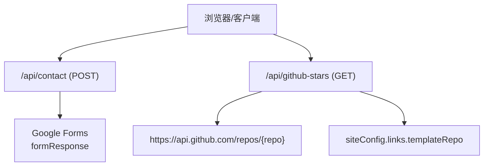
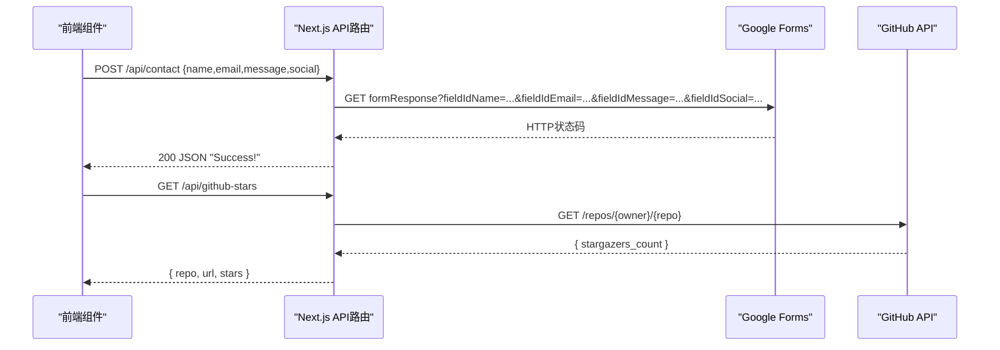
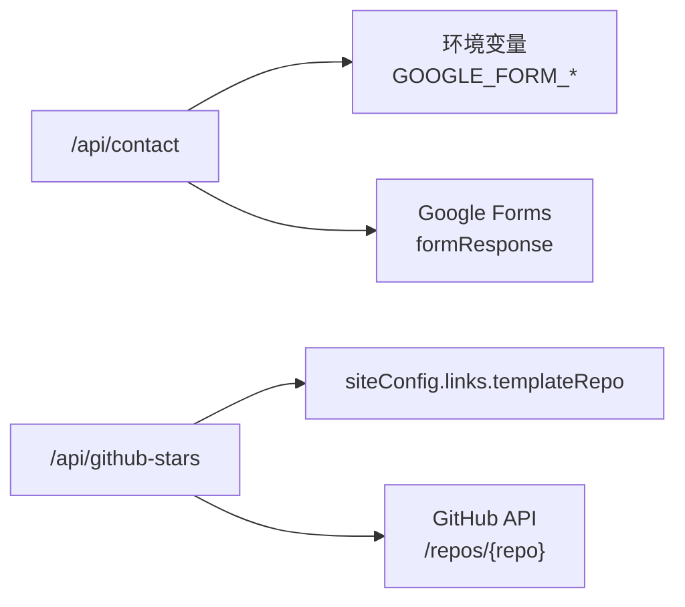

# API参考

<cite>
**本文引用的文件**
- [app/api/contact/route.ts](file://app/api/contact/route.ts)
- [app/api/github-stars/route.ts](file://app/api/github-stars/route.ts)
- [components/forms/contact-form.tsx](file://components/forms/contact-form.tsx)
- [components/common/github-star-badge.tsx](file://components/common/github-star-badge.tsx)
- [config/site.ts](file://config/site.ts)
- [next.config.js](file://next.config.js)
</cite>

## 目录
1. [简介](#简介)
2. [项目结构](#项目结构)
3. [核心组件](#核心组件)
4. [架构总览](#架构总览)
5. [详细端点说明](#详细端点说明)
6. [依赖关系分析](#依赖关系分析)
7. [性能与缓存](#性能与缓存)
8. [安全与验证](#安全与验证)
9. [客户端集成示例](#客户端集成示例)
10. [故障排查](#故障排查)
11. [结论](#结论)

## 简介
本API参考文档面向Next.js投资组合项目的内置服务端路由，覆盖以下两个端点：
- 联系表单提交：POST /api/contact
- GitHub仓库星标数获取：GET /api/github-stars

文档包含HTTP方法、URL路径、请求参数、响应格式、错误处理、环境变量配置、客户端调用示例以及常见问题解决方案。

## 项目结构
本项目采用Next.js App Router的服务端路由组织方式，API位于app/api目录下：
- app/api/contact/route.ts：处理联系表单的POST请求，将数据转发至Google Forms。
- app/api/github-stars/route.ts：从GitHub API获取模板仓库的星标数量并返回给前端。

图表来源
- [app/api/contact/route.ts:3-25](file://app/api/contact/route.ts#L3-L25)
- [app/api/github-stars/route.ts:17-42](file://app/api/github-stars/route.ts#L17-L42)
- [config/site.ts:8-12](file://config/site.ts#L8-L12)

章节来源
- [app/api/contact/route.ts:1-31](file://app/api/contact/route.ts#L1-L31)
- [app/api/github-stars/route.ts:1-44](file://app/api/github-stars/route.ts#L1-L44)
- [config/site.ts:1-41](file://config/site.ts#L1-L41)

## 核心组件
- 联系表单组件（客户端）：负责收集用户输入并进行本地校验，然后调用/api/contact提交。
- GitHub星标徽章组件（客户端）：在页面加载时调用/api/github-stars获取星标数并展示。

章节来源
- [components/forms/contact-form.tsx:21-71](file://components/forms/contact-form.tsx#L21-L71)
- [components/common/github-star-badge.tsx:14-36](file://components/common/github-star-badge.tsx#L14-L36)

## 架构总览
- 联系表单流程：前端表单校验通过后，向/api/contact发送JSON数据；后端读取环境变量中的Google Forms链接和字段ID，拼接查询参数后转发到Google Forms；成功后返回成功响应。
- 星标数获取流程：前端调用/api/github-stars；后端根据siteConfig中的模板仓库URL解析出仓库标识，调用GitHub API获取仓库信息，提取stargazers_count并返回；使用Revalidate进行边缘缓存。

图表来源
- [components/forms/contact-form.tsx:48-71](file://components/forms/contact-form.tsx#L48-L71)
- [app/api/contact/route.ts:17-25](file://app/api/contact/route.ts#L17-L25)
- [components/common/github-star-badge.tsx:20-36](file://components/common/github-star-badge.tsx#L20-L36)
- [app/api/github-stars/route.ts:17-42](file://app/api/github-stars/route.ts#L17-L42)

## 详细端点说明

### 联系表单提交
- 方法：POST
- URL：/api/contact
- 内容类型：application/json
- 请求体字段：
  - name：字符串，必填，最小长度3
  - email：字符串，必填，邮箱格式
  - message：字符串，必填，最小长度10
  - social：字符串，可选，URL格式或空字符串
- 成功响应：
  - 状态码：200
  - 响应体：字符串 "Success!"
- 错误处理：
  - 未配置环境变量（如GOOGLE_FORM_LINK等）：返回500，消息提示需配置环境变量
  - 网络或解析异常：返回500，消息为“Internal error”
- 依赖环境变量：
  - GOOGLE_FORM_LINK：Google Forms表单基础URL
  - GOOGLE_FORM_FIELD_ID_NAME：姓名字段ID
  - GOOGLE_FORM_FIELD_ID_EMAIL：邮箱字段ID
  - GOOGLE_FORM_FIELD_ID_MESSAGE：消息字段ID
  - GOOGLE_FORM_FIELD_ID_SOCIAL：社交链接字段ID

章节来源
- [app/api/contact/route.ts:3-29](file://app/api/contact/route.ts#L3-L29)
- [components/forms/contact-form.tsx:21-30](file://components/forms/contact-form.tsx#L21-L30)

### GitHub仓库星标数获取
- 方法：GET
- URL：/api/github-stars
- 请求参数：无
- 成功响应：
  - 状态码：200
  - 响应体对象：
    - repo：字符串，仓库标识（如 owner/repo）
    - url：字符串，模板仓库完整URL
    - stars：数字或null，当前星标数（可能为空）
- 错误处理：
  - 当GitHub API不可用或返回非2xx时，stars为null，但仍返回200及repo、url
  - 解析失败或异常时，stars为null
- 缓存策略：
  - 对GitHub API请求设置revalidate为6小时，减少频繁请求
- 数据来源：
  - siteConfig.links.templateRepo用于确定目标仓库

章节来源
- [app/api/github-stars/route.ts:7-42](file://app/api/github-stars/route.ts#L7-L42)
- [config/site.ts:8-12](file://config/site.ts#L8-L12)

## 依赖关系分析
- 联系表单API依赖：
  - NextResponse用于构造响应
  - process.env读取Google Forms相关环境变量
  - fetch调用Google Forms的formResponse接口
- 星标数API依赖：
  - siteConfig.links.templateRepo提供仓库地址
  - fetch调用GitHub API，设置Accept头以兼容GitHub API v3
  - next.revalidate用于边缘缓存控制

图表来源
- [app/api/contact/route.ts:4-23](file://app/api/contact/route.ts#L4-L23)
- [app/api/github-stars/route.ts:7-24](file://app/api/github-stars/route.ts#L7-L24)
- [config/site.ts:8-12](file://config/site.ts#L8-L12)

章节来源
- [app/api/contact/route.ts:1-31](file://app/api/contact/route.ts#L1-L31)
- [app/api/github-stars/route.ts:1-44](file://app/api/github-stars/route.ts#L1-L44)
- [config/site.ts:1-41](file://config/site.ts#L1-L41)

## 性能与缓存
- 星标数API通过next.revalidate设置为6小时，降低GitHub API调用频率，提升响应速度。
- 前端组件在获取星标数时使用no-store缓存策略，确保每次渲染都尝试获取最新数据（但服务端仍受revalidate限制）。

章节来源
- [app/api/github-stars/route.ts:5-24](file://app/api/github-stars/route.ts#L5-L24)
- [components/common/github-star-badge.tsx:20-23](file://components/common/github-star-badge.tsx#L20-L23)

## 安全与验证
- 前端表单校验：
  - 使用Zod进行字段校验，包括最小长度、邮箱格式、URL格式等。
- 后端安全：
  - 联系表单API不直接存储敏感数据，而是转发到Google Forms；请确保环境变量正确配置且仅允许可信来源访问。
  - 未配置必要环境变量时返回500，避免泄露内部细节。
- CORS：
  - 项目中为特定路径配置了CORS头部，但当前API路由未显式启用跨域；如需外部服务调用，请在next.config中扩展对应路径的CORS配置。

章节来源
- [components/forms/contact-form.tsx:21-30](file://components/forms/contact-form.tsx#L21-L30)
- [app/api/contact/route.ts:4-9](file://app/api/contact/route.ts#L4-L9)
- [next.config.js:3-21](file://next.config.js#L3-L21)

## 客户端集成示例

### 联系表单提交
- 触发时机：用户在ContactForm中填写并提交表单
- 请求：
  - 方法：POST
  - URL：/api/contact
  - 头部：Content-Type: application/json
  - 主体：{ name, email, message, social }
- 响应：
  - 200：字符串 "Success!"
- 前端处理：
  - 成功后重置表单并弹出感谢弹窗
  - 失败时记录错误日志

章节来源
- [components/forms/contact-form.tsx:48-71](file://components/forms/contact-form.tsx#L48-L71)

### GitHub星标数获取
- 触发时机：页面加载时，GitHubStarBadge组件在useEffect中发起请求
- 请求：
  - 方法：GET
  - URL：/api/github-stars
  - 头部：无特殊要求
- 响应：
  - 200：{ repo, url, stars }
- 前端处理：
  - 若stars为数字则显示格式化后的星标数
  - 若请求失败或stars为空，显示占位文本

章节来源
- [components/common/github-star-badge.tsx:20-36](file://components/common/github-star-badge.tsx#L20-L36)

## 故障排查
- 联系表单无法提交：
  - 检查是否已配置所有必要的Google Forms环境变量
  - 确认Google Forms表单字段ID与代码中一致
  - 查看服务器控制台输出，定位网络或解析错误
- 星标数始终为null：
  - 检查siteConfig.links.templateRepo是否正确
  - 确认GitHub API可访问且未被限流
  - 观察服务端日志，确认是否有异常捕获
- CORS相关问题：
  - 如需跨域调用，请在next.config中为目标路径添加Access-Control-Allow-*头部

章节来源
- [app/api/contact/route.ts:4-9](file://app/api/contact/route.ts#L4-L9)
- [app/api/contact/route.ts:17-29](file://app/api/contact/route.ts#L17-L29)
- [app/api/github-stars/route.ts:17-32](file://app/api/github-stars/route.ts#L17-L32)
- [next.config.js:3-21](file://next.config.js#L3-L21)

## 结论
本项目的API设计简洁实用，分别服务于联系表单提交与GitHub星标数获取。通过前端校验与服务端转发，保证了用户体验与数据安全。星标数API利用缓存机制优化性能。建议在生产环境中完善CORS与安全策略，并对错误响应进行更细粒度的结构化处理，以提升可维护性与可观测性。