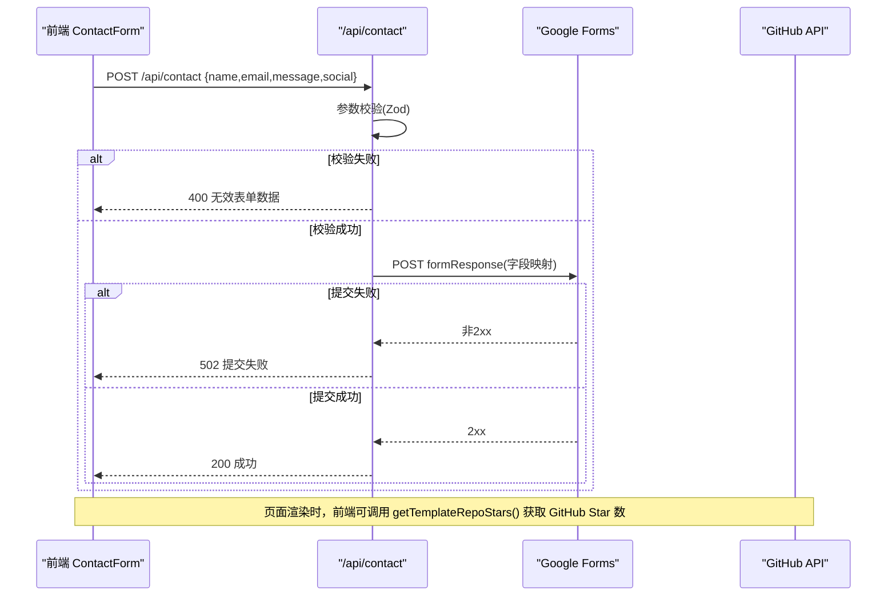
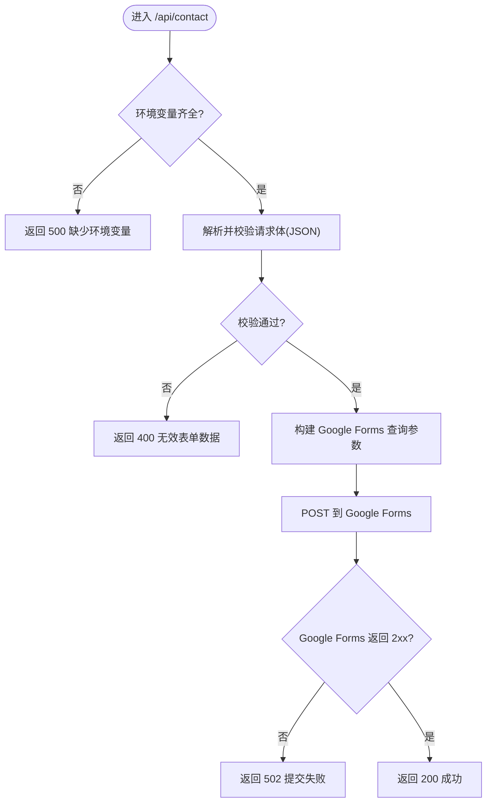
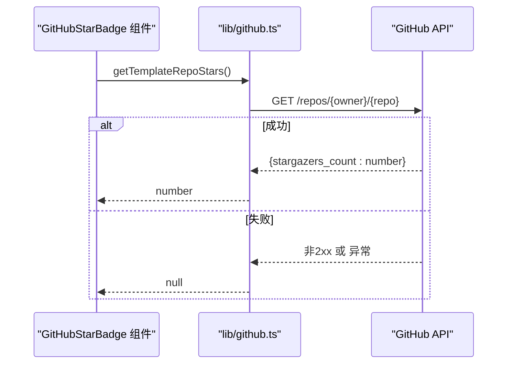
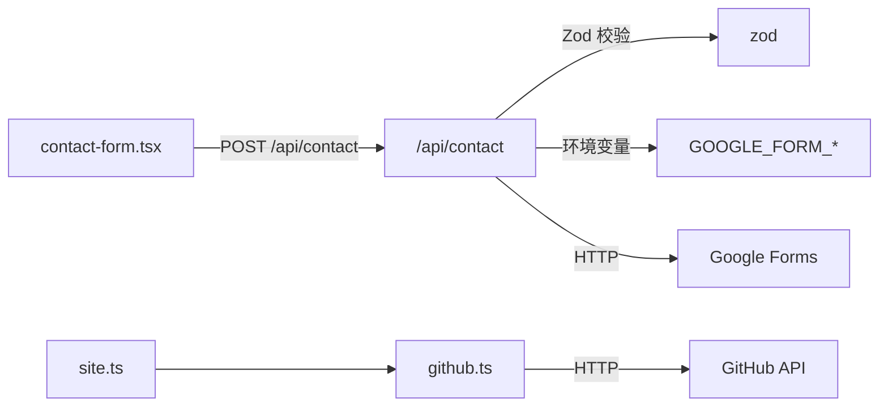

# API接口文档

<cite>
**本文档引用的文件**
- [app/api/contact/route.ts](file://app/api/contact/route.ts)
- [lib/github.ts](file://lib/github.ts)
- [components/forms/contact-form.tsx](file://components/forms/contact-form.tsx)
- [config/site.ts](file://config/site.ts)
</cite>

## 目录
1. [简介](#简介)
2. [项目结构](#项目结构)
3. [核心组件](#核心组件)
4. [架构总览](#架构总览)
5. [详细组件分析](#详细组件分析)
6. [依赖关系分析](#依赖关系分析)
7. [性能考虑](#性能考虑)
8. [故障排查指南](#故障排查指南)
9. [结论](#结论)
10. [附录](#附录)

## 简介
本文件为 Next.js 投资组合项目的后端 API 接口文档，覆盖以下能力：
- 联系表单提交 API：用于接收前端用户提交的联系信息，并转发到 Google Forms。
- GitHub 集成：在服务端获取模板仓库的 Star 数（通过 GitHub API），供前端展示。

文档包含：
- 端点规范、HTTP 方法、URL 模式、请求/响应格式、参数校验规则
- 错误处理机制与错误码说明
- 客户端集成示例与最佳实践
- 常见问题解决方案

## 项目结构
本项目使用 Next.js App Router，API 路由位于 app/api 目录下；GitHub 数据获取逻辑封装在 lib/github.ts；前端表单组件调用 /api/contact。

```mermaid
graph TB
subgraph "前端"
CF["ContactForm 组件"]
end
subgraph "Next.js 服务端"
AC["/api/contact (POST)"]
GH["lib/github.ts<br/>getTemplateRepoStars()"]
end
subgraph "外部服务"
GF["Google Forms"]
GA["GitHub API"]
end
CF --> |POST /api/contact| AC
AC --> |POST 表单数据| GF
CF --> |渲染时| GH
GH --> |GET repos/{owner}/{repo}| GA
```

图表来源
- [app/api/contact/route.ts:11-56](file://app/api/contact/route.ts#L11-L56)
- [lib/github.ts:12-32](file://lib/github.ts#L12-L32)
- [components/forms/contact-form.tsx:45-75](file://components/forms/contact-form.tsx#L45-L75)

章节来源
- [app/api/contact/route.ts:1-57](file://app/api/contact/route.ts#L1-L57)
- [lib/github.ts:1-33](file://lib/github.ts#L1-L33)
- [components/forms/contact-form.tsx:1-140](file://components/forms/contact-form.tsx#L1-L140)
- [config/site.ts:1-39](file://config/site.ts#L1-L39)

## 核心组件
- 联系表单 API (/api/contact)
  - 职责：接收前端 JSON 数据，进行参数校验，将数据转发至 Google Forms，返回统一结果。
  - 输入：JSON 对象（name, email, message, social）
  - 输出：成功或错误响应
- GitHub 集成（lib/github.ts）
  - 职责：从 GitHub API 获取模板仓库的 stargazers_count，带缓存与重新验证策略。
  - 输出：数字或 null（失败时）

章节来源
- [app/api/contact/route.ts:1-57](file://app/api/contact/route.ts#L1-L57)
- [lib/github.ts:1-33](file://lib/github.ts#L1-L33)

## 架构总览
- 前端 ContactForm 组件通过 fetch 调用 /api/contact，发送 JSON 数据。
- 服务端 route.ts 使用 Zod 校验请求体，成功后构造查询参数并 POST 到 Google Forms。
- GitHub 相关数据由 lib/github.ts 直接调用 GitHub API，并在服务端侧进行缓存与重新验证。



图表来源
- [components/forms/contact-form.tsx:45-75](file://components/forms/contact-form.tsx#L45-L75)
- [app/api/contact/route.ts:11-56](file://app/api/contact/route.ts#L11-L56)
- [lib/github.ts:12-32](file://lib/github.ts#L12-L32)

## 详细组件分析

### 联系表单 API (/api/contact)
- HTTP 方法与 URL
  - 方法：POST
  - URL：/api/contact
- 认证方式
  - 无内置鉴权；如需保护，可在环境变量中配置密钥并通过中间件校验（当前未实现）。
- 请求头
  - Content-Type: application/json
- 请求体（JSON）
  - name: string，必填，最小长度 1（服务端）；前端要求至少 3 个字符
  - email: string，必填，邮箱格式（前端严格校验）
  - message: string，必填，最小长度 1（服务端）；前端要求至少 10 个字符
  - social: string，可选，URL 格式（前端校验）
- 参数校验
  - 服务端使用 Zod 校验，失败返回 400。
- 业务逻辑
  - 读取环境变量：GOOGLE_FORM_LINK、GOOGLE_FORM_FIELD_ID_NAME、GOOGLE_FORM_FIELD_ID_EMAIL、GOOGLE_FORM_FIELD_ID_MESSAGE、GOOGLE_FORM_FIELD_ID_SOCIAL
  - 将表单数据映射为查询参数，POST 到 Google Forms 的 formResponse 端点
- 响应
  - 成功：200，文本 "Success!"
  - 失败：
    - 400：Invalid form data（参数校验失败）
    - 500：Please configure the env variables（环境变量缺失）或 Internal error（异常）
    - 502：Failed to submit the form（Google Forms 返回非 2xx）
- 错误处理
  - 捕获异常并返回 500；日志记录错误堆栈
- 客户端集成要点
  - 设置 Content-Type 为 application/json
  - 处理 400/500/502 等状态码，给出用户提示
  - 成功后重置表单并显示感谢弹窗



图表来源
- [app/api/contact/route.ts:11-56](file://app/api/contact/route.ts#L11-L56)

章节来源
- [app/api/contact/route.ts:1-57](file://app/api/contact/route.ts#L1-L57)
- [components/forms/contact-form.tsx:21-30](file://components/forms/contact-form.tsx#L21-L30)
- [components/forms/contact-form.tsx:45-75](file://components/forms/contact-form.tsx#L45-L75)

### GitHub 集成（获取模板仓库 Star 数）
- 功能概述
  - 通过 GitHub API 获取模板仓库的 stargazers_count
  - 使用 next.revalidate 进行服务端缓存与定时刷新（6 小时）
- 关键函数
  - getTemplateRepoSlug(): 从 siteConfig.links.templateRepo 提取 owner/repo
  - getTemplateRepoStars(): 调用 GitHub API 并返回 star 数量或 null
- 请求
  - GET https://api.github.com/repos/{owner}/{repo}
  - 请求头：Accept: application/vnd.github+json
- 响应
  - 成功：JSON 中包含 stargazers_count（数字）
  - 失败：返回 null（网络错误或非 2xx）
- 缓存策略
  - 使用 next.revalidate=21600（秒）进行增量静态再生成（ISR）级别的缓存控制
- 前端使用
  - 在需要展示 Star 数的组件中调用 getTemplateRepoStars()，并根据返回值渲染



图表来源
- [lib/github.ts:12-32](file://lib/github.ts#L12-L32)
- [config/site.ts:8-12](file://config/site.ts#L8-L12)

章节来源
- [lib/github.ts:1-33](file://lib/github.ts#L1-L33)
- [config/site.ts:1-39](file://config/site.ts#L1-L39)

## 依赖关系分析
- 联系表单 API 依赖
  - NextResponse：构建响应
  - Zod：请求体验证
  - 环境变量：GOOGLE_FORM_*
  - 外部：Google Forms（formResponse）
- GitHub 集成依赖
  - siteConfig：模板仓库地址
  - 外部：GitHub API
- 前端依赖
  - react-hook-form + zodResolver：前端表单校验
  - fetch：调用 /api/contact



图表来源
- [components/forms/contact-form.tsx:45-75](file://components/forms/contact-form.tsx#L45-L75)
- [app/api/contact/route.ts:1-57](file://app/api/contact/route.ts#L1-L57)
- [lib/github.ts:1-33](file://lib/github.ts#L1-L33)
- [config/site.ts:1-39](file://config/site.ts#L1-L39)

章节来源
- [components/forms/contact-form.tsx:1-140](file://components/forms/contact-form.tsx#L1-L140)
- [app/api/contact/route.ts:1-57](file://app/api/contact/route.ts#L1-L57)
- [lib/github.ts:1-33](file://lib/github.ts#L1-L33)
- [config/site.ts:1-39](file://config/site.ts#L1-L39)

## 性能考虑
- 联系表单 API
  - 建议增加限流与防刷策略（如基于 IP 的速率限制）
  - 对 Google Forms 的请求可考虑重试与超时控制
  - 敏感信息（如 Google Form 字段 ID）应通过环境变量管理
- GitHub 集成
  - 已启用 next.revalidate=6h，减少频繁请求 GitHub API
  - 若需更高频率更新，可降低 revalidate 时间
  - 注意 GitHub API 未认证时的速率限制（默认 60 次/小时）

[本节为通用性能建议，不直接分析具体代码文件]

## 故障排查指南
- 400 Invalid form data
  - 原因：请求体不符合 Zod 校验规则（字段缺失、类型不符、长度不足等）
  - 处理：检查前端表单校验与提交数据
- 500 Please configure the env variables
  - 原因：缺少 GOOGLE_FORM_LINK 或对应字段 ID 环境变量
  - 处理：在部署环境配置所有 GOOGLE_FORM_* 变量
- 502 Failed to submit the form
  - 原因：Google Forms 返回非 2xx（网络问题、链接错误、字段映射错误）
  - 处理：核对 GOOGLE_FORM_LINK 与字段 ID 映射是否正确
- 500 Internal error
  - 原因：运行时异常（如 JSON 解析失败、网络异常）
  - 处理：查看服务器日志定位错误堆栈
- GitHub Star 数为 null
  - 原因：GitHub API 不可用或返回非 2xx
  - 处理：检查网络连接与 GitHub 服务状态；必要时降级显示

章节来源
- [app/api/contact/route.ts:20-55](file://app/api/contact/route.ts#L20-L55)
- [lib/github.ts:12-32](file://lib/github.ts#L12-L32)

## 结论
- 联系表单 API 提供了简洁可靠的表单提交流程，结合前端 Zod 校验与服务端 Zod 校验，确保数据质量。
- GitHub 集成通过服务端函数获取 Star 数，具备缓存与容错机制，适合展示型场景。
- 建议在后续版本中加入鉴权、限流、更丰富的错误信息与监控指标，以提升安全性与可观测性。

[本节为总结性内容，不直接分析具体代码文件]

## 附录

### 端点规范汇总
- POST /api/contact
  - 请求头：Content-Type: application/json
  - 请求体：{ name, email, message, social? }
  - 成功响应：200，文本 "Success!"
  - 错误响应：
    - 400：Invalid form data
    - 500：Please configure the env variables / Internal error
    - 502：Failed to submit the form

章节来源
- [app/api/contact/route.ts:11-56](file://app/api/contact/route.ts#L11-L56)

### 客户端集成示例（联系表单）
- 使用 fetch 调用 /api/contact，设置 Content-Type 为 application/json
- 根据响应状态码处理成功与失败分支
- 成功后重置表单并展示感谢提示

章节来源
- [components/forms/contact-form.tsx:45-75](file://components/forms/contact-form.tsx#L45-L75)

### 环境变量清单
- GOOGLE_FORM_LINK：Google Forms 的提交链接
- GOOGLE_FORM_FIELD_ID_NAME：姓名字段 ID
- GOOGLE_FORM_FIELD_ID_EMAIL：邮箱字段 ID
- GOOGLE_FORM_FIELD_ID_MESSAGE：消息字段 ID
- GOOGLE_FORM_FIELD_ID_SOCIAL：社交链接字段 ID

章节来源
- [app/api/contact/route.ts:12-18](file://app/api/contact/route.ts#L12-L18)

### 最佳实践
- 前后端均进行参数校验（前端提升用户体验，服务端保障安全）
- 敏感配置使用环境变量管理
- 对外部服务调用增加超时与重试策略
- 对高频接口实施限流与防护
- 对第三方 API 调用做好降级与容错处理

[本节为通用最佳实践，不直接分析具体代码文件]