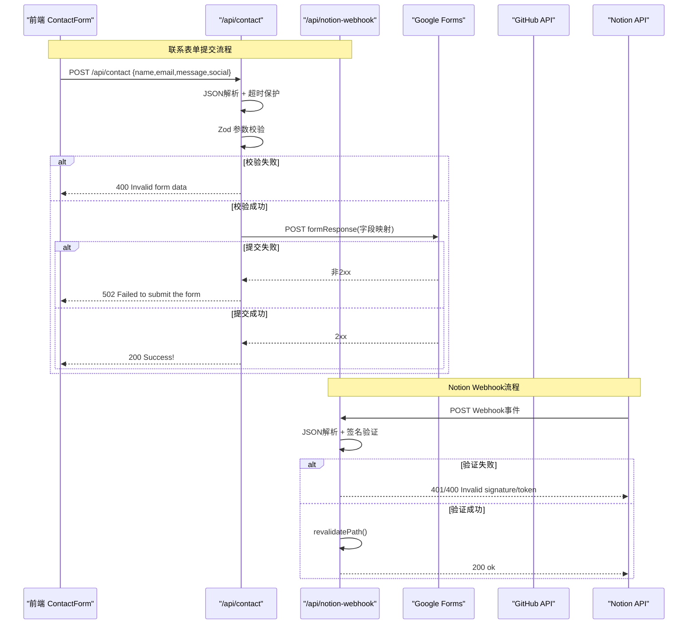
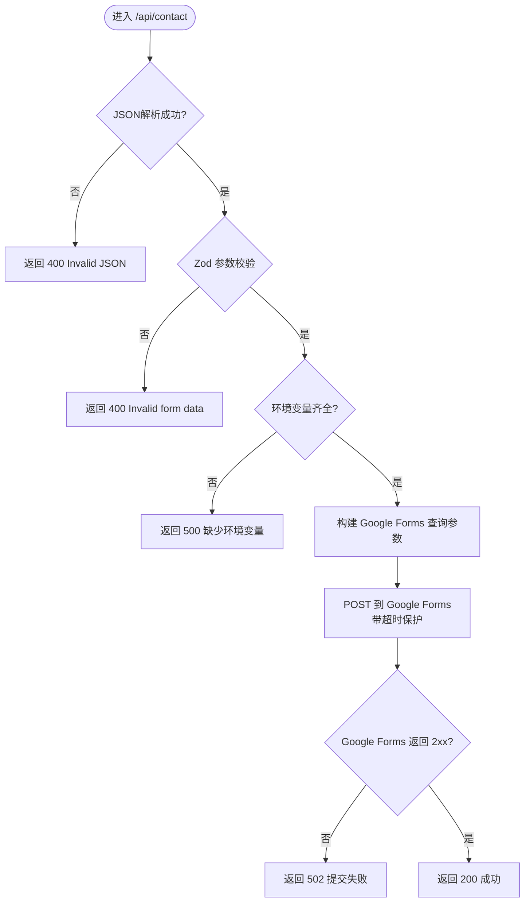
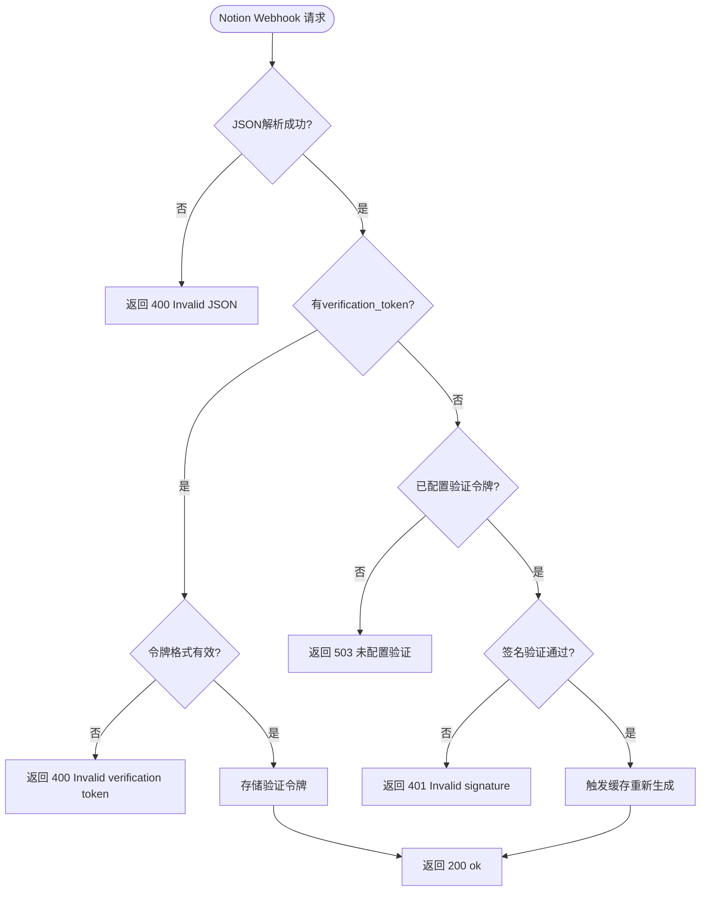
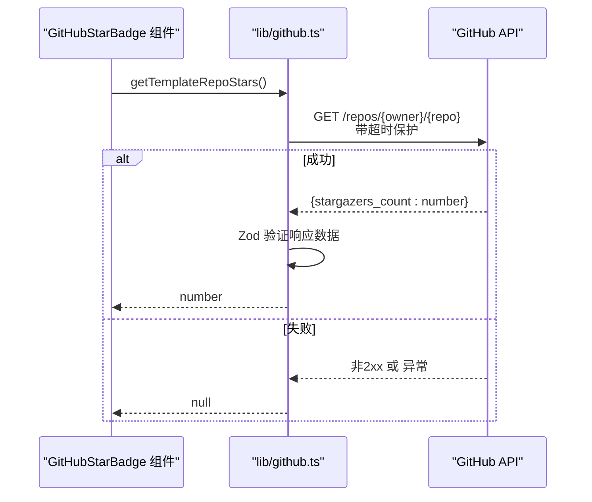
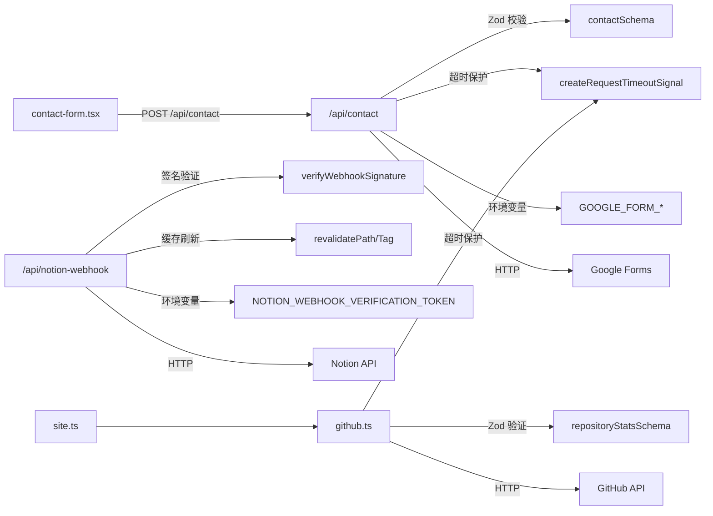

</think>

现在我已经收集了所有必要的信息。基于代码分析，我发现了以下关键变更：

1. **新的验证schema结构**：在`lib/contact.ts`中定义了独立的Zod schema
2. **增强的错误处理机制**：包括JSON解析错误处理和请求超时保护
3. **HTTP工具函数**：`createRequestTimeoutSignal()`提供统一的超时控制
4. **Notion Webhook API**：新增的Webhook端点用于博客内容更新

让我更新API接口文档：

# API接口文档

<cite>
**本文档引用的文件**
- [app/api/contact/route.ts](file://app/api/contact/route.ts)
- [app/api/notion-webhook/route.ts](file://app/api/notion-webhook/route.ts)
- [lib/contact.ts](file://lib/contact.ts)
- [lib/github.ts](file://lib/github.ts)
- [lib/http.ts](file://lib/http.ts)
- [components/forms/contact-form.tsx](file://components/forms/contact-form.tsx)
- [config/site.ts](file://config/site.ts)
</cite>

## 更新摘要
**变更内容**
- 新增独立的验证schema结构（lib/contact.ts）
- 增强错误处理机制，包括JSON解析错误处理
- 添加请求超时保护功能
- 新增Notion Webhook API端点
- 统一HTTP请求超时配置

## 目录
1. [简介](#简介)
2. [项目结构](#项目结构)
3. [核心组件](#核心组件)
4. [架构总览](#架构总览)
5. [详细组件分析](#详细组件分析)
6. [依赖关系分析](#依赖关系分析)
7. [性能考虑](#性能考虑)
8. [故障排查指南](#故障排查指南)
9. [结论](#结论)
10. [附录](#附录)

## 简介
本文件为 Next.js 投资组合项目的后端 API 接口文档，覆盖以下能力：
- 联系表单提交 API：用于接收前端用户提交的联系信息，并转发到 Google Forms。
- Notion Webhook API：用于处理 Notion 博客内容的实时更新。
- GitHub 集成：在服务端获取模板仓库的 Star 数（通过 GitHub API），供前端展示。

文档包含：
- 端点规范、HTTP 方法、URL 模式、请求/响应格式、参数校验规则
- 错误处理机制与错误码说明
- 客户端集成示例与最佳实践
- 常见问题解决方案

## 项目结构
本项目使用 Next.js App Router，API 路由位于 app/api 目录下；GitHub 数据获取逻辑封装在 lib/github.ts；前端表单组件调用 /api/contact。

```mermaid
graph TB
subgraph "前端"
CF["ContactForm 组件"]
end
subgraph "Next.js 服务端"
AC["/api/contact (POST)"]
NW["/api/notion-webhook (POST)"]
GH["lib/github.ts<br/>getTemplateRepoStars()"]
HT["lib/http.ts<br/>createRequestTimeoutSignal()"]
CS["lib/contact.ts<br/>contactSchema"]
end
subgraph "外部服务"
GF["Google Forms"]
GA["GitHub API"]
NOTION["Notion API"]
end
CF --> |POST /api/contact| AC
AC --> |Zod 校验| CS
AC --> |超时保护| HT
AC --> |POST 表单数据| GF
NW --> |Webhook 验证| NOTION
CF --> |渲染时| GH
GH --> |GET repos/{owner}/{repo}| GA
```

**图表来源**
- [app/api/contact/route.ts:1-61](file://app/api/contact/route.ts#L1-L61)
- [app/api/notion-webhook/route.ts:1-76](file://app/api/notion-webhook/route.ts#L1-L76)
- [lib/contact.ts:1-15](file://lib/contact.ts#L1-L15)
- [lib/http.ts:1-10](file://lib/http.ts#L1-L10)
- [lib/github.ts:1-41](file://lib/github.ts#L1-L41)
- [components/forms/contact-form.tsx:48-91](file://components/forms/contact-form.tsx#L48-L91)

**章节来源**
- [app/api/contact/route.ts:1-61](file://app/api/contact/route.ts#L1-L61)
- [app/api/notion-webhook/route.ts:1-76](file://app/api/notion-webhook/route.ts#L1-L76)
- [lib/contact.ts:1-15](file://lib/contact.ts#L1-L15)
- [lib/http.ts:1-10](file://lib/http.ts#L1-L10)
- [lib/github.ts:1-41](file://lib/github.ts#L1-L41)
- [components/forms/contact-form.tsx:1-156](file://components/forms/contact-form.tsx#L1-L156)
- [config/site.ts:1-39](file://config/site.ts#L1-L39)

## 核心组件
- 联系表单 API (/api/contact)
  - 职责：接收前端 JSON 数据，进行参数校验，将数据转发至 Google Forms，返回统一结果。
  - 输入：JSON 对象（name, email, message, social）
  - 输出：成功或错误响应
- Notion Webhook API (/api/notion-webhook)
  - 职责：处理 Notion 博客内容的实时更新，验证 Webhook 签名并触发缓存重新生成。
  - 输入：Notion Webhook 请求体
  - 输出：确认响应
- GitHub 集成（lib/github.ts）
  - 职责：从 GitHub API 获取模板仓库的 stargazers_count，带缓存与重新验证策略。
  - 输出：数字或 null（失败时）

**章节来源**
- [app/api/contact/route.ts:1-61](file://app/api/contact/route.ts#L1-L61)
- [app/api/notion-webhook/route.ts:1-76](file://app/api/notion-webhook/route.ts#L1-L76)
- [lib/github.ts:1-41](file://lib/github.ts#L1-L41)

## 架构总览
- 前端 ContactForm 组件通过 fetch 调用 /api/contact，发送 JSON 数据。
- 服务端 route.ts 使用 Zod 校验请求体，成功后构造查询参数并 POST 到 Google Forms。
- Notion Webhook 接收 Notion 的实时通知，验证签名后触发缓存重新生成。
- GitHub 相关数据由 lib/github.ts 直接调用 GitHub API，并在服务端侧进行缓存与重新验证。



**图表来源**
- [components/forms/contact-form.tsx:61-91](file://components/forms/contact-form.tsx#L61-L91)
- [app/api/contact/route.ts:6-61](file://app/api/contact/route.ts#L6-L61)
- [app/api/notion-webhook/route.ts:13-76](file://app/api/notion-webhook/route.ts#L13-L76)
- [lib/github.ts:21-41](file://lib/github.ts#L21-L41)

## 详细组件分析

### 联系表单 API (/api/contact)
- HTTP 方法与 URL
  - 方法：POST
  - URL：/api/contact
- 认证方式
  - 无内置鉴权；如需保护，可在环境变量中配置密钥并通过中间件校验（当前未实现）。
- 请求头
  - Content-Type: application/json
- 请求体（JSON）
  - name: string，必填，最小长度 3 个字符
  - email: string，必填，邮箱格式
  - message: string，必填，最小长度 10 个字符
  - social: string，可选，URL 格式或空字符串
- 参数校验
  - 使用独立的 `contactSchema` 进行 Zod 校验，失败返回 400。
- 业务逻辑
  - 读取环境变量：GOOGLE_FORM_LINK、GOOGLE_FORM_FIELD_ID_NAME、GOOGLE_FORM_FIELD_ID_EMAIL、GOOGLE_FORM_FIELD_ID_MESSAGE、GOOGLE_FORM_FIELD_ID_SOCIAL
  - 将表单数据映射为查询参数，POST 到 Google Forms 的 formResponse 端点
  - 使用 `createRequestTimeoutSignal()` 提供请求超时保护（默认10秒）
- 响应
  - 成功：200，文本 "Success!"
  - 失败：
    - 400：Invalid JSON（JSON解析失败）或 Invalid form data（参数校验失败）
    - 500：Please configure the env variables（环境变量缺失）或 Internal error（异常）
    - 502：Failed to submit the form（Google Forms 返回非 2xx）
- 错误处理
  - JSON解析错误：捕获并返回 400
  - 参数校验错误：返回 400
  - 运行时异常：捕获并返回 500，记录错误日志



**图表来源**
- [app/api/contact/route.ts:6-61](file://app/api/contact/route.ts#L6-L61)
- [lib/contact.ts:3-12](file://lib/contact.ts#L3-L12)
- [lib/http.ts:5-9](file://lib/http.ts#L5-L9)

**章节来源**
- [app/api/contact/route.ts:1-61](file://app/api/contact/route.ts#L1-L61)
- [lib/contact.ts:1-15](file://lib/contact.ts#L1-L15)
- [components/forms/contact-form.tsx:48-91](file://components/forms/contact-form.tsx#L48-L91)

### Notion Webhook API (/api/notion-webhook)
- HTTP 方法与 URL
  - 方法：POST
  - URL：/api/notion-webhook
- 认证方式
  - 基于 Notion Webhook 签名验证和验证令牌
- 请求头
  - x-notion-signature: Notion 生成的签名
  - Content-Type: application/json
- 请求体
  - Notion Webhook 事件数据，包含 verification_token（首次配置时）
- 安全验证
  - 首次配置：验证 verification_token 格式（长度20-256，仅字母数字和下划线）
  - 常规请求：验证 Notion Webhook 签名
- 业务逻辑
  - 验证通过后触发缓存重新生成：revalidateTag(BLOG_CACHE_TAG)、revalidatePath("/")、revalidatePath("/blogs")、revalidatePath("/sitemap.xml")
- 响应
  - 成功：200，{ ok: true }
  - 失败：
    - 400：Invalid JSON 或 Invalid verification token
    - 401：Invalid signature
    - 503：Webhook verification is not configured



**图表来源**
- [app/api/notion-webhook/route.ts:13-76](file://app/api/notion-webhook/route.ts#L13-L76)

**章节来源**
- [app/api/notion-webhook/route.ts:1-76](file://app/api/notion-webhook/route.ts#L1-L76)

### GitHub 集成（获取模板仓库 Star 数）
- 功能概述
  - 通过 GitHub API 获取模板仓库的 stargazers_count
  - 使用 next.revalidate 进行服务端缓存与定时刷新（6 小时）
  - 使用 Zod schema 验证响应数据格式
- 关键函数
  - getTemplateRepoSlug(): 从 siteConfig.links.templateRepo 提取 owner/repo
  - getTemplateRepoStars(): 调用 GitHub API 并返回 star 数量或 null
- 请求
  - GET https://api.github.com/repos/{owner}/{repo}
  - 请求头：Accept: application/vnd.github+json
  - 超时保护：使用 createRequestTimeoutSignal()
- 响应
  - 成功：JSON 中包含 stargazers_count（数字）
  - 失败：返回 null（网络错误或非 2xx）
- 缓存策略
  - 使用 next.revalidate=21600（秒）进行增量静态再生成（ISR）级别的缓存控制
- 前端使用
  - 在需要展示 Star 数的组件中调用 getTemplateRepoStars()，并根据返回值渲染



**图表来源**
- [lib/github.ts:21-41](file://lib/github.ts#L21-L41)
- [lib/http.ts:5-9](file://lib/http.ts#L5-L9)

**章节来源**
- [lib/github.ts:1-41](file://lib/github.ts#L1-L41)
- [config/site.ts:1-39](file://config/site.ts#L1-L39)

## 依赖关系分析
- 联系表单 API 依赖
  - NextResponse：构建响应
  - contactSchema：独立的 Zod 验证schema
  - createRequestTimeoutSignal：请求超时保护
  - 环境变量：GOOGLE_FORM_*
  - 外部：Google Forms（formResponse）
- Notion Webhook API 依赖
  - verifyWebhookSignature：Notion Webhook 签名验证
  - revalidatePath/revalidateTag：缓存重新生成
  - 环境变量：NOTION_WEBHOOK_VERIFICATION_TOKEN
  - 外部：Notion API
- GitHub 集成依赖
  - siteConfig：模板仓库地址
  - repositoryStatsSchema：响应数据验证
  - createRequestTimeoutSignal：请求超时保护
  - 外部：GitHub API
- 前端依赖
  - react-hook-form + zodResolver：前端表单校验
  - fetch：调用 /api/contact



**图表来源**
- [components/forms/contact-form.tsx:61-91](file://components/forms/contact-form.tsx#L61-L91)
- [app/api/contact/route.ts:1-61](file://app/api/contact/route.ts#L1-L61)
- [app/api/notion-webhook/route.ts:1-76](file://app/api/notion-webhook/route.ts#L1-L76)
- [lib/contact.ts:1-15](file://lib/contact.ts#L1-L15)
- [lib/http.ts:1-10](file://lib/http.ts#L1-L10)
- [lib/github.ts:1-41](file://lib/github.ts#L1-L41)
- [config/site.ts:1-39](file://config/site.ts#L1-L39)

**章节来源**
- [components/forms/contact-form.tsx:1-156](file://components/forms/contact-form.tsx#L1-L156)
- [app/api/contact/route.ts:1-61](file://app/api/contact/route.ts#L1-L61)
- [app/api/notion-webhook/route.ts:1-76](file://app/api/notion-webhook/route.ts#L1-L76)
- [lib/contact.ts:1-15](file://lib/contact.ts#L1-L15)
- [lib/http.ts:1-10](file://lib/http.ts#L1-L10)
- [lib/github.ts:1-41](file://lib/github.ts#L1-L41)
- [config/site.ts:1-39](file://config/site.ts#L1-L39)

## 性能考虑
- 联系表单 API
  - 建议增加限流与防刷策略（如基于 IP 的速率限制）
  - 对 Google Forms 的请求可考虑重试与超时控制（已实现10秒超时）
  - 敏感信息（如 Google Form 字段 ID）应通过环境变量管理
- Notion Webhook API
  - 已实现高效的缓存重新生成，避免全量重建
  - 建议在生产环境启用更严格的速率限制
- GitHub 集成
  - 已启用 next.revalidate=6h，减少频繁请求 GitHub API
  - 若需更高频率更新，可降低 revalidate 时间
  - 注意 GitHub API 未认证时的速率限制（默认 60 次/小时）
  - 已添加请求超时保护，防止长时间阻塞

## 故障排查指南
- 400 Invalid JSON
  - 原因：请求体不是有效的 JSON 格式
  - 处理：检查前端是否正确序列化数据
- 400 Invalid form data
  - 原因：请求体不符合 contactSchema 校验规则（字段缺失、类型不符、长度不足等）
  - 处理：检查前端表单校验与提交数据
- 400 Invalid verification token
  - 原因：Notion Webhook 验证令牌格式不正确
  - 处理：确保令牌长度为20-256位，仅包含字母、数字和下划线
- 401 Invalid signature
  - 原因：Notion Webhook 签名验证失败
  - 处理：检查 NOTION_WEBHOOK_VERIFICATION_TOKEN 环境变量配置
- 500 Please configure the env variables
  - 原因：缺少 GOOGLE_FORM_LINK 或对应字段 ID 环境变量
  - 处理：在部署环境配置所有 GOOGLE_FORM_* 变量
- 500 Internal error
  - 原因：运行时异常（如网络异常、Google Forms 连接失败）
  - 处理：查看服务器日志定位错误堆栈
- 502 Failed to submit the form
  - 原因：Google Forms 返回非 2xx（网络问题、链接错误、字段映射错误）
  - 处理：核对 GOOGLE_FORM_LINK 与字段 ID 映射是否正确
- 503 Webhook verification is not configured
  - 原因：未配置 Notion Webhook 验证令牌
  - 处理：通过 Notion Webhook 首次请求获取并配置验证令牌
- GitHub Star 数为 null
  - 原因：GitHub API 不可用、超时或返回非 2xx
  - 处理：检查网络连接与 GitHub 服务状态；必要时降级显示

**章节来源**
- [app/api/contact/route.ts:6-61](file://app/api/contact/route.ts#L6-L61)
- [app/api/notion-webhook/route.ts:13-76](file://app/api/notion-webhook/route.ts#L13-L76)
- [lib/github.ts:21-41](file://lib/github.ts#L21-L41)

## 结论
- 联系表单 API 提供了简洁可靠的表单提交流程，结合独立验证schema和前后端双重校验，确保数据质量。
- Notion Webhook API 实现了安全的实时内容更新机制，支持签名验证和缓存优化。
- GitHub 集成通过服务端函数获取 Star 数，具备缓存、容错和超时保护机制，适合展示型场景。
- 统一的HTTP超时保护机制提升了API的健壮性，防止长时间请求阻塞。
- 建议在后续版本中加入更详细的监控指标和错误追踪，以提升可观测性。

## 附录

### 端点规范汇总

#### POST /api/contact
- 请求头：Content-Type: application/json
- 请求体：{ name: string(min 3), email: string(email), message: string(min 10), social?: string(url or empty) }
- 成功响应：200，文本 "Success!"
- 错误响应：
  - 400：Invalid JSON / Invalid form data
  - 500：Please configure the env variables / Internal error
  - 502：Failed to submit the form

#### POST /api/notion-webhook
- 请求头：x-notion-signature, Content-Type: application/json
- 请求体：Notion Webhook 事件数据
- 成功响应：200，{ ok: true }
- 错误响应：
  - 400：Invalid JSON / Invalid verification token
  - 401：Invalid signature
  - 503：Webhook verification is not configured

**章节来源**
- [app/api/contact/route.ts:6-61](file://app/api/contact/route.ts#L6-L61)
- [app/api/notion-webhook/route.ts:13-76](file://app/api/notion-webhook/route.ts#L13-L76)

### 客户端集成示例（联系表单）
- 使用 fetch 调用 /api/contact，设置 Content-Type 为 application/json
- 根据响应状态码处理成功与失败分支
- 成功后重置表单并展示感谢提示

**章节来源**
- [components/forms/contact-form.tsx:61-91](file://components/forms/contact-form.tsx#L61-L91)

### 环境变量清单
- GOOGLE_FORM_LINK：Google Forms 的提交链接
- GOOGLE_FORM_FIELD_ID_NAME：姓名字段 ID
- GOOGLE_FORM_FIELD_ID_EMAIL：邮箱字段 ID
- GOOGLE_FORM_FIELD_ID_MESSAGE：消息字段 ID
- GOOGLE_FORM_FIELD_ID_SOCIAL：社交链接字段 ID
- NOTION_WEBHOOK_VERIFICATION_TOKEN：Notion Webhook 验证令牌

**章节来源**
- [app/api/contact/route.ts:19-37](file://app/api/contact/route.ts#L19-L37)
- [app/api/notion-webhook/route.ts:23-57](file://app/api/notion-webhook/route.ts#L23-L57)

### 验证Schema定义
- contactSchema：联系表单数据验证
  - name: 字符串，最小长度3
  - email: 邮箱格式
  - message: 字符串，最小长度10
  - social: URL格式或空字符串（可选）
- repositoryStatsSchema：GitHub API响应验证
  - stargazers_count: 非负整数

**章节来源**
- [lib/contact.ts:3-12](file://lib/contact.ts#L3-L12)
- [lib/github.ts:10-12](file://lib/github.ts#L10-L12)

### 最佳实践
- 前后端均进行参数校验（前端提升用户体验，服务端保障安全）
- 敏感配置使用环境变量管理
- 对外部服务调用增加超时与重试策略（已实现10秒超时）
- 对高频接口实施限流与防护
- 对第三方 API 调用做好降级与容错处理
- 使用独立的验证schema提高代码复用性和可维护性
- 实现Webhook签名验证确保安全性
- 合理使用缓存重新生成提升性能

[本节为通用最佳实践，不直接分析具体代码文件]