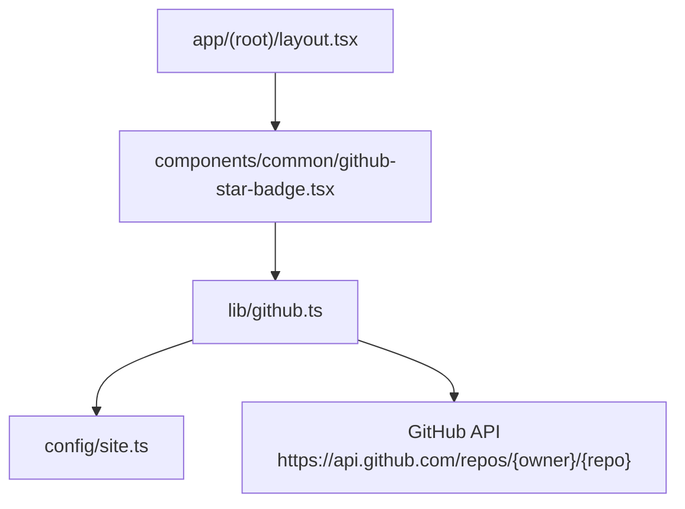
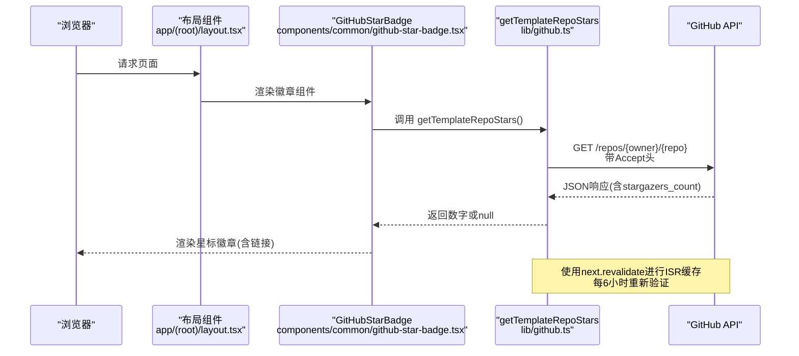
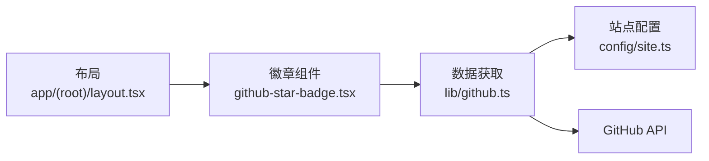

# GitHub星标API

<cite>
**本文引用的文件**
- [lib/github.ts](file://lib/github.ts)
- [components/common/github-star-badge.tsx](file://components/common/github-star-badge.tsx)
- [app/(root)/layout.tsx](file://app/(root)/layout.tsx)
- [config/site.ts](file://config/site.ts)
</cite>

## 目录
1. [简介](#简介)
2. [项目结构](#项目结构)
3. [核心组件](#核心组件)
4. [架构总览](#架构总览)
5. [详细组件分析](#详细组件分析)
6. [依赖关系分析](#依赖关系分析)
7. [性能考量](#性能考量)
8. [故障排查指南](#故障排查指南)
9. [结论](#结论)
10. [附录](#附录)

## 简介
本文件为“GitHub星标信息获取”的完整技术文档。当前仓库未提供独立的GET /api/github-stars端点，而是通过服务端组件直接调用GitHub API获取仓库星标数，并在页面渲染时展示。该方案利用Next.js的ISR（增量静态再生成）缓存机制，在构建后定期刷新数据，避免每次请求都访问外部API，从而提升性能与稳定性。

## 项目结构
- 数据获取逻辑位于 lib/github.ts：封装了从配置中解析仓库地址、调用GitHub API、提取星标数以及错误处理。
- 前端展示组件位于 components/common/github-star-badge.tsx：在服务端组件中异步获取星标数并渲染徽章。
- 布局中使用该组件，使其出现在站点头部区域。
- 仓库URL等配置集中在 config/site.ts。

图表来源
- [app/(root)/layout.tsx:11-25](file://app/(root)/layout.tsx#L11-L25)
- [components/common/github-star-badge.tsx:12-13](file://components/common/github-star-badge.tsx#L12-L13)
- [lib/github.ts:6-15](file://lib/github.ts#L6-L15)
- [config/site.ts:8-12](file://config/site.ts#L8-L12)

章节来源
- [app/(root)/layout.tsx:11-25](file://app/(root)/layout.tsx#L11-L25)
- [components/common/github-star-badge.tsx:12-13](file://components/common/github-star-badge.tsx#L12-L13)
- [lib/github.ts:6-15](file://lib/github.ts#L6-L15)
- [config/site.ts:8-12](file://config/site.ts#L8-L12)

## 核心组件
- 数据获取函数 getTemplateRepoStars：从配置的模板仓库URL解析出 owner/repo，向GitHub API发起请求，使用 ISR revalidate 进行缓存刷新，返回 stargazers_count 或 null。
- 展示组件 GitHubStarBadge：在服务端组件中调用上述函数，将星标数以本地化格式显示，并提供可点击链接跳转至仓库。
- 布局集成：在站点布局中引入并渲染该徽章，确保全局可见。

章节来源
- [lib/github.ts:11-32](file://lib/github.ts#L11-L32)
- [components/common/github-star-badge.tsx:12-39](file://components/common/github-star-badge.tsx#L12-L39)
- [app/(root)/layout.tsx:11-25](file://app/(root)/layout.tsx#L11-L25)

## 架构总览
下图展示了从页面渲染到GitHub API调用的完整流程，包括缓存策略与错误处理路径。

图表来源
- [app/(root)/layout.tsx:11-25](file://app/(root)/layout.tsx#L11-L25)
- [components/common/github-star-badge.tsx:12-13](file://components/common/github-star-badge.tsx#L12-L13)
- [lib/github.ts:11-32](file://lib/github.ts#L11-L32)

## 详细组件分析

### 数据获取模块（lib/github.ts）
- 功能职责
  - 解析仓库slug：从 siteConfig.links.templateRepo 中提取 owner/repo。
  - 调用GitHub API：构造 https://api.github.com/repos/{owner}/{repo} 请求，设置 Accept 头以兼容新版API。
  - 缓存策略：使用 next.revalidate=6小时 实现ISR缓存，减少重复请求。
  - 错误处理：网络异常或非2xx响应均返回 null，保证前端降级显示。
- 复杂度与性能
  - 时间复杂度：O(1) 网络请求为主。
  - 空间复杂度：O(1)。
  - 缓存命中后可显著降低延迟与外部依赖失败概率。
- 关键行为
  - 当响应非成功或JSON缺失字段时，返回 null。
  - 捕获异常并返回 null，避免崩溃。

章节来源
- [lib/github.ts:1-32](file://lib/github.ts#L1-L32)

### 展示组件（components/common/github-star-badge.tsx）
- 功能职责
  - 在服务端组件中异步获取星标数。
  - 将数字格式化输出，并提供无障碍标签与可点击链接。
  - 支持自定义样式类名。
- 交互与可访问性
  - aria-label 包含星标数量信息，便于屏幕阅读器。
  - 链接目标为新窗口打开仓库。
- 容错显示
  - 当 stars 为 null 时，显示占位文本，避免空白。

章节来源
- [components/common/github-star-badge.tsx:8-39](file://components/common/github-star-badge.tsx#L8-L39)

### 布局集成（app/(root)/layout.tsx）
- 在站点头部两侧分别渲染徽章，确保全局可见。
- 与其他导航元素组合，保持布局一致性。

章节来源
- [app/(root)/layout.tsx:11-25](file://app/(root)/layout.tsx#L11-L25)

### 配置（config/site.ts）
- 定义模板仓库URL，供数据获取模块解析。
- 统一维护站点元信息与链接，便于后续替换。

章节来源
- [config/site.ts:8-12](file://config/site.ts#L8-L12)

## 依赖关系分析
- 组件耦合
  - 布局仅依赖徽章组件，不感知具体数据源。
  - 徽章组件依赖数据获取函数，但不关心网络细节。
  - 数据获取函数依赖配置与外部API。
- 外部依赖
  - GitHub API：受限于网络与速率限制，需通过缓存与降级策略缓解。
- 潜在循环依赖
  - 无循环依赖；层级清晰。

图表来源
- [app/(root)/layout.tsx:11-25](file://app/(root)/layout.tsx#L11-L25)
- [components/common/github-star-badge.tsx:12-13](file://components/common/github-star-badge.tsx#L12-L13)
- [lib/github.ts:6-15](file://lib/github.ts#L6-L15)
- [config/site.ts:8-12](file://config/site.ts#L8-L12)

章节来源
- [app/(root)/layout.tsx:11-25](file://app/(root)/layout.tsx#L11-L25)
- [components/common/github-star-badge.tsx:12-13](file://components/common/github-star-badge.tsx#L12-L13)
- [lib/github.ts:6-15](file://lib/github.ts#L6-L15)
- [config/site.ts:8-12](file://config/site.ts#L8-L12)

## 性能考量
- ISR缓存
  - 使用 next.revalidate=6小时 对GitHub API响应进行缓存，显著降低外部请求频率。
  - 适合低频更新的数据（如仓库星标）。
- 降级策略
  - 网络异常或API失败时返回 null，前端显示占位文本，保障可用性。
- 建议优化
  - 若访问量较大，可在边缘节点或CDN层增加缓存。
  - 考虑添加重试与超时控制，提高鲁棒性。
  - 如需多仓库支持，可增加批量查询与并发控制。

[本节为通用性能指导，无需特定文件引用]

## 故障排查指南
- 常见问题
  - 星标数为空：检查网络连通性与GitHub API可达性；确认配置中的仓库URL正确。
  - 缓存未更新：确认 revalidate 周期是否合理；必要时手动触发重建或等待下一次revalidate。
  - 显示异常：检查组件渲染分支，确保 null 时有占位文本。
- 定位方法
  - 查看服务端的日志输出（如有）。
  - 在开发环境临时缩短 revalidate 周期以快速验证。
  - 使用浏览器开发者工具观察网络请求与响应。

[本节为通用故障排查指导，无需特定文件引用]

## 结论
本项目采用“服务端组件 + ISR缓存”的方式获取并展示GitHub仓库星标数，避免了独立API路由的复杂性，同时具备良好的性能与容错能力。通过清晰的模块划分与配置集中管理，易于扩展与维护。若未来需要更灵活的参数化查询（如多仓库、用户指定），可在此基础上演进为独立的API路由。

[本节为总结性内容，无需特定文件引用]

## 附录

### 关于GET /api/github-stars端点的说明
- 当前仓库未实现 GET /api/github-stars 端点。
- 现有实现通过服务端组件直接调用GitHub API，并使用ISR缓存。
- 若需新增API端点，可参考项目中其他API路由的实现模式（例如 contact/notion-webhook），并结合缓存与错误处理策略。

[本节为概念性说明，无需特定文件引用]