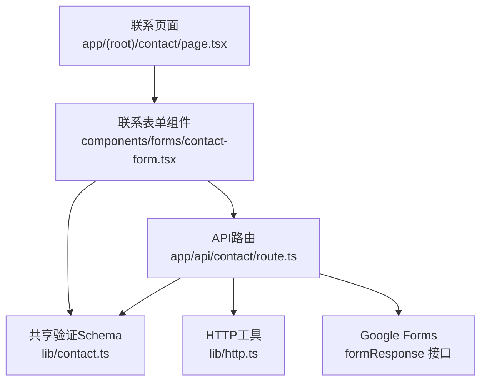
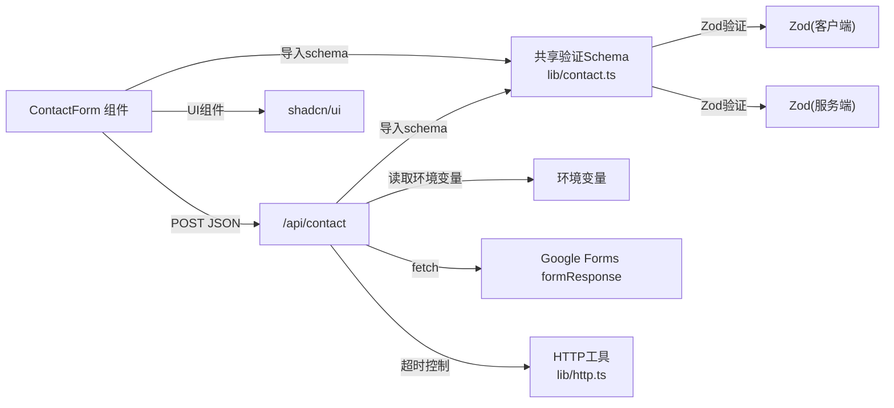

# 联系表单API

<cite>
**本文引用的文件**
- [app/api/contact/route.ts](file://app/api/contact/route.ts)
- [lib/contact.ts](file://lib/contact.ts)
- [components/forms/contact-form.tsx](file://components/forms/contact-form.tsx)
- [app/(root)/contact/page.tsx](file://app/(root)/contact/page.tsx)
- [config/pages.ts](file://config/pages.ts)
- [lib/http.ts](file://lib/http.ts)
</cite>

## 更新摘要
**所做更改**
- 更新了Zod schema架构部分，反映从内联方式提取到独立文件的变更
- 增强了类型安全性说明，包含新的`ContactFormValues`类型
- 改进了错误处理机制描述，突出更好的用户反馈
- 更新了依赖关系图以反映新的模块结构
- 增强了可维护性和代码组织方面的说明

## 目录
1. [简介](#简介)
2. [项目结构](#项目结构)
3. [核心组件](#核心组件)
4. [架构总览](#架构总览)
5. [详细组件分析](#详细组件分析)
6. [依赖关系分析](#依赖关系分析)
7. [性能考虑](#性能考虑)
8. [故障排查指南](#故障排查指南)
9. [结论](#结论)
10. [附录](#附录)

## 简介
本文件为"联系表单API"的完整技术文档，聚焦于 POST /api/contact 端点。内容涵盖：
- 请求体结构与字段验证规则（姓名、邮箱、消息、社交媒体）
- 数据校验机制与错误处理策略
- Google Forms 集成配置与环境变量说明
- 表单提交流程、请求示例、响应格式与错误码
- 客户端集成指南（表单数据处理、错误处理、用户体验优化建议）

该API基于Next.js API路由实现，使用Zod进行服务端数据校验，并将表单数据转发至Google Forms以完成提交。**重要更新**：验证逻辑已重构，Zod schema从内联方式提取到独立的`lib/contact.ts`文件中，增强了类型安全性和可维护性，改进了错误消息和用户反馈。

## 项目结构
联系表单功能由以下关键部分组成：
- 前端页面：展示联系表单并调用API
- 前端表单组件：负责用户输入、本地校验与提交
- API路由：接收请求、校验数据、转发到Google Forms并返回结果
- **新增**：共享验证schema模块：集中管理表单验证逻辑
- 页面元信息：用于SEO和页面标题/描述



**图表来源**
- [app/(root)/contact/page.tsx:1-30](file://app/(root)/contact/page.tsx#L1-L30)
- [components/forms/contact-form.tsx:1-156](file://components/forms/contact-form.tsx#L1-L156)
- [lib/contact.ts:1-15](file://lib/contact.ts#L1-L15)
- [app/api/contact/route.ts:1-61](file://app/api/contact/route.ts#L1-L61)
- [lib/http.ts:1-10](file://lib/http.ts#L1-L10)

**章节来源**
- [app/(root)/contact/page.tsx:1-30](file://app/(root)/contact/page.tsx#L1-L30)
- [components/forms/contact-form.tsx:1-156](file://components/forms/contact-form.tsx#L1-L156)
- [lib/contact.ts:1-15](file://lib/contact.ts#L1-L15)
- [app/api/contact/route.ts:1-61](file://app/api/contact/route.ts#L1-L61)
- [config/pages.ts:1-80](file://config/pages.ts#L1-L80)

## 核心组件
- **前端表单组件**：使用react-hook-form与zod进行客户端校验，提交JSON到/api/contact
- **共享验证Schema**：集中管理表单验证规则和类型定义，提供前后端一致的验证逻辑
- **API路由**：使用共享schema进行服务端校验，读取环境变量，构造Google Forms参数并提交
- **联系页面**：组合表单组件与侧边卡片，提供页面元信息

**章节来源**
- [components/forms/contact-form.tsx:1-156](file://components/forms/contact-form.tsx#L1-L156)
- [lib/contact.ts:1-15](file://lib/contact.ts#L1-L15)
- [app/api/contact/route.ts:1-61](file://app/api/contact/route.ts#L1-L61)
- [app/(root)/contact/page.tsx:1-30](file://app/(root)/contact/page.tsx#L1-L30)

## 架构总览
下图展示了从用户提交到Google Forms的完整流程，包括前后端校验与错误分支。

```mermaid
sequenceDiagram
participant U as "用户"
participant F as "联系表单组件"
participant S as "共享Schema"
participant R as "API路由 /api/contact"
participant G as "Google Forms"
U->>F : 填写表单并提交
F->>S : 客户端校验(姓名/邮箱/消息/社交链接)
F->>R : POST /api/contact {name,email,message,social}
R->>S : 服务端校验(复用同一schema)
alt 环境变量缺失
R-->>F : 500 请配置环境变量
else 环境变量齐全
alt 校验失败
R-->>F : 400 无效表单数据
else 校验通过
R->>G : GET formResponse?fieldIdName=name&...
alt Google Forms 返回非成功
R-->>F : 502 提交失败
else 成功
R-->>F : 200 Success!
end
end
end
end
```

**图表来源**
- [components/forms/contact-form.tsx:51-91](file://components/forms/contact-form.tsx#L51-L91)
- [lib/contact.ts:3-12](file://lib/contact.ts#L3-L12)
- [app/api/contact/route.ts:14-55](file://app/api/contact/route.ts#L14-L55)

## 详细组件分析

### 共享验证Schema：lib/contact.ts
**新增组件** - 集中管理表单验证逻辑

- **功能概述**
  - 定义统一的表单验证schema，供前后端共享
  - 提供类型安全的表单值类型定义
  - 包含详细的错误消息，改善用户体验
  - 支持可选字段的灵活验证

- **验证规则**
  - name: 至少3个字符，错误消息："Name must contain at least 3 characters."
  - email: 有效的邮箱格式，错误消息："Please enter a valid email."
  - message: 至少10个字符，错误消息："Please write something more descriptive."
  - social: 可选URL或空字符串

- **类型定义**
  - `ContactFormValues`: 基于schema推导出的TypeScript类型
  - 确保前后端类型一致性

**章节来源**
- [lib/contact.ts:1-15](file://lib/contact.ts#L1-L15)

### API端点：POST /api/contact
- **功能概述**
  - 接收JSON请求体，包含姓名、邮箱、消息、可选的社交媒体链接
  - **更新**：使用共享schema进行服务端数据校验，提高代码复用性
  - 读取环境变量以获取Google Forms地址与各字段ID
  - 将表单数据映射到Google Forms字段并通过formResponse接口提交
  - 根据Google Forms响应状态返回相应HTTP状态码

- **请求体结构**
  - name: 字符串，必填
  - email: 字符串，必填
  - message: 字符串，必填
  - social: 字符串，可选

- **字段验证规则（服务端）**
  - **更新**：复用lib/contact.ts中的统一schema
  - name: 非空字符串，至少3个字符
  - email: 有效邮箱格式
  - message: 非空字符串，至少10个字符
  - social: 可选URL或空字符串

- **环境变量要求**
  - GOOGLE_FORM_LINK: Google Forms基础URL
  - GOOGLE_FORM_FIELD_ID_NAME: 姓名字段ID
  - GOOGLE_FORM_FIELD_ID_EMAIL: 邮箱字段ID
  - GOOGLE_FORM_FIELD_ID_MESSAGE: 消息字段ID
  - GOOGLE_FORM_FIELD_ID_SOCIAL: 社交媒体字段ID

- **提交流程**
  - 解析JSON请求体，失败返回400
  - **更新**：使用共享schema进行安全解析
  - 校验环境变量是否齐全，否则返回500
  - 构建URLSearchParams，将字段名替换为对应Google Forms字段ID
  - 发起GET请求到{GOOGLE_FORM_LINK}/formResponse?params，带超时信号
  - 若Google Forms返回非成功，返回502；否则返回200并提示成功

- **响应格式**
  - 成功：HTTP 200，响应体为文本"Success!"
  - 失败：
    - 400：无效JSON或无效表单数据
    - 500：缺少环境变量或内部错误
    - 502：Google Forms提交失败

- **错误处理**
  - JSON解析失败：直接返回400
  - 环境变量缺失：直接返回500
  - 数据校验失败：返回400
  - Google Forms提交失败：返回502
  - 其他异常：捕获后返回500并记录日志

**章节来源**
- [app/api/contact/route.ts:1-61](file://app/api/contact/route.ts#L1-L61)

### 前端表单组件：ContactForm
- **功能概述**
  - 使用react-hook-form与共享schema进行客户端校验
  - **更新**：导入并使用lib/contact.ts中的contactSchema和ContactFormValues类型
  - 提交JSON到/api/contact
  - 成功后重置表单并弹出感谢弹窗
  - 失败时弹出错误提示

- **字段验证规则（客户端）**
  - **更新**：复用lib/contact.ts中的统一验证规则
  - name: 至少3个字符
  - email: 有效邮箱格式
  - message: 至少10个字符
  - social: 可选，必须为合法URL或空字符串

- **类型安全性**
  - **新增**：使用ContactFormValues类型确保表单值的类型安全
  - 前后端共享相同的验证逻辑和类型定义

- **提交流程**
  - 用户提交表单
  - 客户端校验通过后，发送POST请求到/api/contact
  - 根据响应状态决定显示成功或错误弹窗

- **用户体验优化**
  - 即时校验反馈
  - 成功/失败弹窗提示
  - 提交后清空表单

**章节来源**
- [components/forms/contact-form.tsx:1-156](file://components/forms/contact-form.tsx#L1-L156)

### 联系页面：Contact Page
- **功能概述**
  - 渲染ContactForm组件与右侧GitHub重定向卡片
  - 设置页面元信息（标题、描述）

**章节来源**
- [app/(root)/contact/page.tsx:1-30](file://app/(root)/contact/page.tsx#L1-L30)
- [config/pages.ts:39-46](file://config/pages.ts#L39-L46)

## 依赖关系分析
- **前端依赖**
  - react-hook-form：表单状态管理
  - zod：客户端数据校验
  - shadcn/ui：UI组件（Input、Textarea、Button等）
  - 自定义Modal：用于成功/失败提示

- **后端依赖**
  - Next.js API路由：处理HTTP请求
  - **更新**：共享验证schema（lib/contact.ts）：集中管理验证逻辑
  - Zod：服务端数据校验
  - fetch：向Google Forms发起请求
  - **新增**：HTTP工具（lib/http.ts）：提供请求超时控制

- **外部服务**
  - Google Forms：存储表单提交数据



**图表来源**
- [components/forms/contact-form.tsx:3-19](file://components/forms/contact-form.tsx#L3-L19)
- [lib/contact.ts:1-15](file://lib/contact.ts#L1-L15)
- [app/api/contact/route.ts:1-5](file://app/api/contact/route.ts#L1-L5)
- [lib/http.ts:1-10](file://lib/http.ts#L1-L10)

**章节来源**
- [components/forms/contact-form.tsx:1-156](file://components/forms/contact-form.tsx#L1-L156)
- [lib/contact.ts:1-15](file://lib/contact.ts#L1-L15)
- [app/api/contact/route.ts:1-61](file://app/api/contact/route.ts#L1-L61)
- [lib/http.ts:1-10](file://lib/http.ts#L1-L10)

## 性能考虑
- 前端校验减少无效请求，提升用户体验
- **更新**：共享schema避免重复定义，减少代码体积
- 服务端校验确保数据安全与一致性
- 使用环境变量避免硬编码敏感信息
- **新增**：请求超时控制防止长时间等待
- Google Forms作为轻量级后端，适合个人作品集场景

## 故障排查指南
- **常见问题**
  - 环境变量未配置：检查GOOGLE_FORM_LINK及所有GOOGLE_FORM_FIELD_ID_*是否已设置
  - 表单提交失败：确认Google Forms字段ID与表单字段映射正确
  - 网络错误：检查服务器网络连通性与Google Forms可达性
  - **新增**：验证schema错误：检查lib/contact.ts中的验证规则是否符合预期

- **调试建议**
  - 查看浏览器控制台错误信息
  - 检查API路由日志输出
  - 验证环境变量在部署平台是否正确注入
  - **新增**：检查共享schema的类型定义是否与表单组件匹配

**章节来源**
- [app/api/contact/route.ts:19-37](file://app/api/contact/route.ts#L19-L37)
- [app/api/contact/route.ts:56-59](file://app/api/contact/route.ts#L56-L59)
- [lib/contact.ts:3-12](file://lib/contact.ts#L3-L12)

## 结论
联系表单API提供了简洁可靠的联系方式收集方案，结合前后端双重校验与Google Forms集成，满足个人作品集的基本需求。**重要改进**：通过将Zod schema提取到独立的lib/contact.ts文件中，实现了代码复用、类型安全和更好的可维护性。共享的验证逻辑确保了前后端行为的一致性，而改进的错误消息提升了用户体验。通过合理的环境变量配置与错误处理，可确保表单提交的稳定性与用户体验。

## 附录

### 环境变量清单
- GOOGLE_FORM_LINK: Google Forms基础URL
- GOOGLE_FORM_FIELD_ID_NAME: 姓名字段ID
- GOOGLE_FORM_FIELD_ID_EMAIL: 邮箱字段ID
- GOOGLE_FORM_FIELD_ID_MESSAGE: 消息字段ID
- GOOGLE_FORM_FIELD_ID_SOCIAL: 社交媒体字段ID

**章节来源**
- [app/api/contact/route.ts:19-25](file://app/api/contact/route.ts#L19-L25)

### 请求示例
- 方法：POST
- 路径：/api/contact
- 请求头：Content-Type: application/json
- 请求体：
  - name: 字符串（必填）
  - email: 字符串（必填）
  - message: 字符串（必填）
  - social: 字符串（可选）

**章节来源**
- [components/forms/contact-form.tsx:61-69](file://components/forms/contact-form.tsx#L61-L69)

### 响应格式
- 成功：HTTP 200，响应体为"Success!"
- 失败：
  - 400：无效JSON或无效表单数据
  - 500：缺少环境变量或内部错误
  - 502：Google Forms提交失败

**章节来源**
- [app/api/contact/route.ts:11-17](file://app/api/contact/route.ts#L11-L17)
- [app/api/contact/route.ts:34-37](file://app/api/contact/route.ts#L34-L37)
- [app/api/contact/route.ts:52-58](file://app/api/contact/route.ts#L52-L58)

### 客户端集成指南
- **表单数据处理**
  - 使用react-hook-form管理表单状态
  - **更新**：导入并使用lib/contact.ts中的contactSchema进行客户端校验
  - **新增**：使用ContactFormValues类型确保类型安全
  - 提交前确保字段符合预期格式

- **错误处理**
  - 根据HTTP状态码显示不同提示信息
  - 网络错误或服务器错误时提供重试或替代联系方式

- **用户体验优化**
  - 即时校验反馈
  - 成功/失败弹窗提示
  - 提交后清空表单并引导用户

**章节来源**
- [components/forms/contact-form.tsx:51-91](file://components/forms/contact-form.tsx#L51-L91)
- [lib/contact.ts:1-15](file://lib/contact.ts#L1-L15)

### Google Forms集成配置步骤
1. 创建Google Forms并添加所需字段（姓名、邮箱、消息、社交媒体）
2. 获取每个字段的Field ID
3. 在环境变量中配置GOOGLE_FORM_LINK与GOOGLE_FORM_FIELD_ID_*
4. 部署并测试表单提交功能

**章节来源**
- [app/api/contact/route.ts:19-25](file://app/api/contact/route.ts#L19-L25)

### 共享Schema最佳实践
- **代码组织**
  - 将验证逻辑集中在lib/contact.ts中
  - 导出类型定义以确保前后端一致性
  - 提供详细的错误消息改善用户体验

- **维护优势**
  - 单一来源的验证规则，易于维护
  - 类型安全确保编译时错误检测
  - 便于单元测试和测试覆盖

**章节来源**
- [lib/contact.ts:1-15](file://lib/contact.ts#L1-L15)
- [components/forms/contact-form.tsx:19-52](file://components/forms/contact-form.tsx#L19-L52)
- [app/api/contact/route.ts:3-17](file://app/api/contact/route.ts#L3-L17)