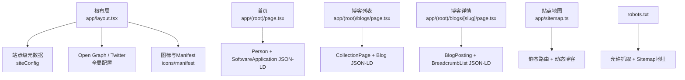
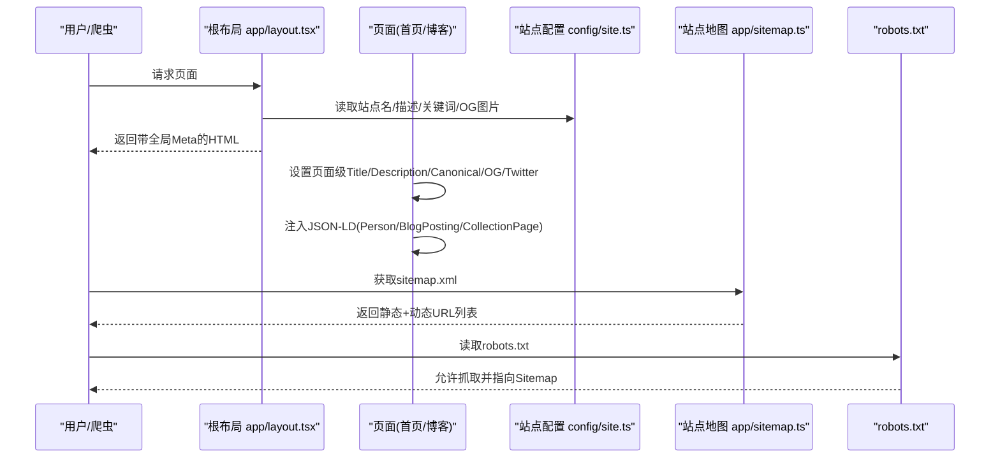
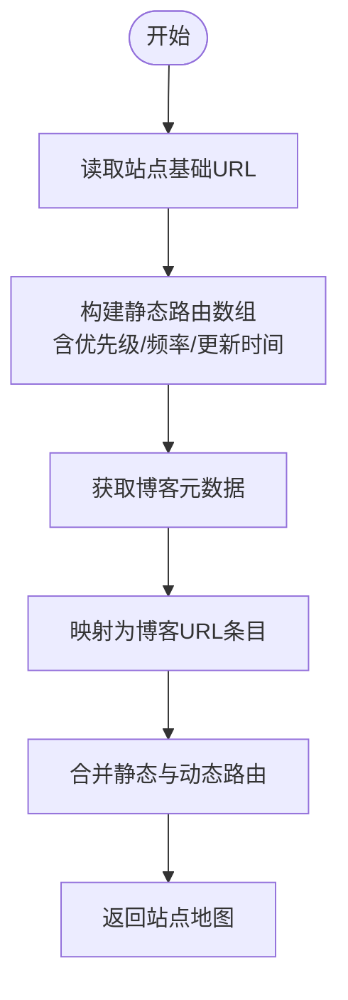
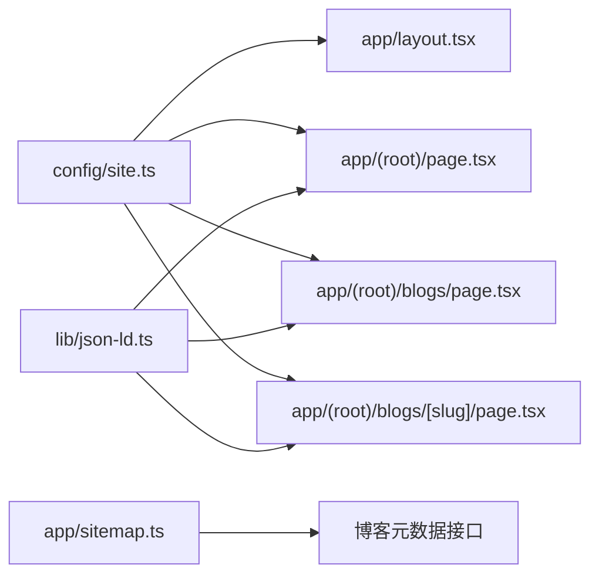

# SEO优化

<cite>
**本文引用的文件**
- [app/layout.tsx](file://app/layout.tsx)
- [app/(root)/layout.tsx](file://app/(root)/layout.tsx)
- [app/(root)/page.tsx](file://app/(root)/page.tsx)
- [app/(root)/blogs/page.tsx](file://app/(root)/blogs/page.tsx)
- [app/(root)/blogs/[slug]/page.tsx](file://app/(root)/blogs/[slug]/page.tsx)
- [app/sitemap.ts](file://app/sitemap.ts)
- [app/manifest.ts](file://app/manifest.ts)
- [public/robots.txt](file://public/robots.txt)
- [config/site.ts](file://config/site.ts)
- [config/pages.ts](file://config/pages.ts)
- [lib/json-ld.ts](file://lib/json-ld.ts)
</cite>

## 目录
1. [简介](#简介)
2. [项目结构](#项目结构)
3. [核心组件](#核心组件)
4. [架构总览](#架构总览)
5. [详细组件分析](#详细组件分析)
6. [依赖关系分析](#依赖关系分析)
7. [性能考量](#性能考量)
8. [故障排查指南](#故障排查指南)
9. [结论](#结论)
10. [附录](#附录)

## 简介
本文件为Next.js投资组合的SEO优化提供系统化文档，覆盖搜索引擎优化策略、元数据配置、结构化数据实现与站点地图生成。重点说明Open Graph标签、Twitter卡片、JSON-LD标记与语义化HTML的使用，并给出SEO最佳实践、关键词优化与内容结构化方法，以及SEO测试工具与监控指标建议。

## 项目结构
本项目采用Next.js App Router组织页面与布局：
- 根布局集中定义全局元数据（标题模板、描述、关键词、OG/Twitter、图标、manifest、canonical、robots、Google验证等）
- 各路由页面按需覆盖或扩展元数据
- 站点地图由服务端函数动态生成，包含静态路由与博客文章
- PWA manifest用于PWA能力与分享展示
- robots.txt声明爬虫策略与站点地图位置
- JSON-LD通过统一序列化器注入到页面中

图表来源
- [app/layout.tsx:18-85](file://app/layout.tsx#L18-L85)
- [app/(root)/page.tsx:28-77](file://app/(root)/page.tsx#L28-L77)
- [app/(root)/blogs/page.tsx:42-88](file://app/(root)/blogs/page.tsx#L42-L88)
- [app/(root)/blogs/[slug]/page.tsx:43-83](file://app/(root)/blogs/[slug]/page.tsx#L43-L83)
- [app/sitemap.ts:6-70](file://app/sitemap.ts#L6-L70)
- [public/robots.txt:1-6](file://public/robots.txt#L1-L6)

章节来源
- [app/layout.tsx:18-85](file://app/layout.tsx#L18-L85)
- [app/(root)/page.tsx:28-77](file://app/(root)/page.tsx#L28-L77)
- [app/(root)/blogs/page.tsx:42-88](file://app/(root)/blogs/page.tsx#L42-L88)
- [app/(root)/blogs/[slug]/page.tsx:43-83](file://app/(root)/blogs/[slug]/page.tsx#L43-L83)
- [app/sitemap.ts:6-70](file://app/sitemap.ts#L6-L70)
- [public/robots.txt:1-6](file://public/robots.txt#L1-L6)

## 核心组件
- 全局元数据与社交分享：在根布局集中配置标题模板、描述、关键词、作者、Open Graph、Twitter卡片、图标、manifest、canonical、robots策略与Google验证令牌
- 站点地图：按优先级与更新频率维护静态页面，并动态聚合博客文章
- 结构化数据：首页注入个人与软件应用信息；博客列表注入集合页与博客集合；博客详情注入文章与面包屑
- PWA清单：定义应用名称、描述、启动路径、主题色、图标与分类
- robots.txt：允许所有爬虫访问根路径，并指向站点地图

章节来源
- [app/layout.tsx:18-85](file://app/layout.tsx#L18-L85)
- [app/sitemap.ts:6-70](file://app/sitemap.ts#L6-L70)
- [app/(root)/page.tsx:28-77](file://app/(root)/page.tsx#L28-L77)
- [app/(root)/blogs/page.tsx:42-88](file://app/(root)/blogs/page.tsx#L42-L88)
- [app/(root)/blogs/[slug]/page.tsx:43-83](file://app/(root)/blogs/[slug]/page.tsx#L43-L83)
- [app/manifest.ts:3-38](file://app/manifest.ts#L3-L38)
- [public/robots.txt:1-6](file://public/robots.txt#L1-L6)

## 架构总览
下图展示了SEO相关的关键模块与数据流向：站点配置驱动全局元数据与社交分享；页面级元数据覆盖默认值；结构化数据通过统一序列化器注入；站点地图与服务端渲染结合确保可索引性。

图表来源
- [app/layout.tsx:18-85](file://app/layout.tsx#L18-L85)
- [config/site.ts:1-39](file://config/site.ts#L1-L39)
- [app/(root)/page.tsx:28-77](file://app/(root)/page.tsx#L28-L77)
- [app/(root)/blogs/[slug]/page.tsx:43-83](file://app/(root)/blogs/[slug]/page.tsx#L43-L83)
- [app/sitemap.ts:6-70](file://app/sitemap.ts#L6-L70)
- [public/robots.txt:1-6](file://public/robots.txt#L1-L6)

## 详细组件分析

### 全局元数据与社交分享（根布局）
- 标题模板：使用“%s | 站点名”模式，便于子页面继承
- 描述与关键词：从站点配置集中管理，保证一致性
- Open Graph：网站类型、语言、URL、标题、描述、站点名、封面图尺寸与替代文本
- Twitter卡片：大图卡片、标题、描述、图片与创作者
- 图标与Manifest：favicon、shortcut、apple图标与webmanifest路径
- Canonical：统一规范URL，避免重复内容
- Robots：允许索引与跟随，并为GoogleBot开启大预览与无片段限制
- Google验证：通过环境变量注入

章节来源
- [app/layout.tsx:18-85](file://app/layout.tsx#L18-L85)
- [config/site.ts:1-39](file://config/site.ts#L1-L39)

### 首页结构化数据（Person + SoftwareApplication）
- Person：姓名、主页、头像、职位、社交账号链接
- SoftwareApplication：应用名称、类别、平台、价格、作者信息
- 通过统一序列化器安全注入script标签

章节来源
- [app/(root)/page.tsx:28-77](file://app/(root)/page.tsx#L28-L77)
- [lib/json-ld.ts:1-9](file://lib/json-ld.ts#L1-L9)

### 博客列表页结构化数据（CollectionPage + Blog）
- CollectionPage：集合页名称、描述、URL、所属网站、作者
- Blog：博客集合信息，内嵌多篇BlogPosting（标题、描述、发布时间、URL、作者、标签、封面图）

章节来源
- [app/(root)/blogs/page.tsx:42-88](file://app/(root)/blogs/page.tsx#L42-L88)

### 博客详情页结构化数据（BlogPosting + BreadcrumbList）
- BlogPosting：标题、描述、发布时间与修改时间、作者、发布者、URL、主页面ID、图片、关键词、字数、阅读时长、语言、所属博客
- BreadcrumbList：首页 -> 博客 -> 当前文章的路径层级
- 页面级元数据：标题、描述、作者、关键词、canonical、OG、Twitter、Robots策略

章节来源
- [app/(root)/blogs/[slug]/page.tsx:43-83](file://app/(root)/blogs/[slug]/page.tsx#L43-L83)
- [app/(root)/blogs/[slug]/page.tsx:101-174](file://app/(root)/blogs/[slug]/page.tsx#L101-L174)

### 站点地图（Sitemap）
- 静态路由：首页、技能、项目、经历、贡献、博客、联系、简历，分别设置lastModified、changeFrequency与priority
- 动态路由：遍历博客元数据，为每篇文章生成独立条目，使用文章更新时间作为lastModified
- 基于站点基础URL拼接完整地址

图表来源
- [app/sitemap.ts:6-70](file://app/sitemap.ts#L6-L70)

章节来源
- [app/sitemap.ts:6-70](file://app/sitemap.ts#L6-L70)

### PWA清单（Manifest）
- 应用名称与短名称、描述、启动路径、显示模式、背景与主题色
- 图标资源与用途（标准/可遮罩）
- 分类标签与语言方向
- 与根布局中的manifest路径保持一致

章节来源
- [app/manifest.ts:3-38](file://app/manifest.ts#L3-L38)
- [app/layout.tsx:68-68](file://app/layout.tsx#L68-L68)

### robots.txt
- 允许所有爬虫访问根路径
- 声明站点地图地址

章节来源
- [public/robots.txt:1-6](file://public/robots.txt#L1-L6)

### 语义化HTML与可访问性
- 单页单一H1：博客详情页使用H1承载文章标题
- 段落与列表：用p、ul/li等语义标签组织内容
- 图片alt：为关键图片提供有意义的替代文本
- 链接aria-label：为按钮与导航提供无障碍标签
- 这些做法有助于搜索引擎理解内容与提升可访问性

章节来源
- [app/(root)/blogs/[slug]/page.tsx:213-236](file://app/(root)/blogs/[slug]/page.tsx#L213-L236)
- [app/(root)/page.tsx:81-137](file://app/(root)/page.tsx#L81-L137)

## 依赖关系分析
- 站点配置site.ts被根布局、首页、博客列表与详情多处引用，形成SEO信息的单一事实源
- 根布局集中输出OG/Twitter/图标/manifest/robots策略，页面级仅做必要覆盖
- JSON-LD序列化器lib/json-ld.ts被首页与博客页面复用，确保脚本注入安全
- 站点地图依赖博客元数据接口，保证动态内容及时收录

图表来源
- [config/site.ts:1-39](file://config/site.ts#L1-L39)
- [app/layout.tsx:18-85](file://app/layout.tsx#L18-L85)
- [app/(root)/page.tsx:28-77](file://app/(root)/page.tsx#L28-L77)
- [app/(root)/blogs/page.tsx:42-88](file://app/(root)/blogs/page.tsx#L42-L88)
- [app/(root)/blogs/[slug]/page.tsx:43-83](file://app/(root)/blogs/[slug]/page.tsx#L43-L83)
- [lib/json-ld.ts:1-9](file://lib/json-ld.ts#L1-L9)
- [app/sitemap.ts:6-70](file://app/sitemap.ts#L6-L70)

## 性能考量
- 首屏元数据在服务端渲染时即已输出，减少客户端重绘与解析开销
- OG/Twitter图片建议使用合适尺寸（如1200x630），避免过大影响加载
- 站点地图按变更频率与优先级排序，帮助爬虫高效抓取
- JSON-LD以字符串形式注入，避免运行时计算带来的额外开销
- 合理使用canonical与robots策略，减少重复抓取与无效爬取

[本节为通用指导，不直接分析具体文件]

## 故障排查指南
- 社交媒体预览异常
  - 检查OG与Twitter卡片是否配置了title、description、image及尺寸
  - 确认图片URL可公开访问且响应正常
  - 参考：根布局与页面级元数据配置
- 结构化数据校验失败
  - 使用Google Rich Results Test或Schema Markup Validator校验JSON-LD
  - 确保字段类型与必填项正确（如发布日期、作者、URL）
  - 参考：首页与博客页面的JSON-LD注入位置
- 站点地图未生效
  - 确认robots.txt中Sitemap地址正确
  - 检查sitemap.xml是否包含预期URL与优先级
  - 参考：站点地图生成逻辑与robots.txt
- 重复内容问题
  - 确保每个页面设置了正确的canonical URL
  - 避免多域名或多协议导致重复
  - 参考：根布局与页面级alternates配置
- 抓取与索引控制
  - 检查robots指令是否符合预期（index/follow）
  - 针对特定页面可单独覆盖robots策略
  - 参考：根布局与博客详情页robots配置

章节来源
- [app/layout.tsx:18-85](file://app/layout.tsx#L18-L85)
- [app/(root)/blogs/[slug]/page.tsx:43-83](file://app/(root)/blogs/[slug]/page.tsx#L43-L83)
- [app/sitemap.ts:6-70](file://app/sitemap.ts#L6-L70)
- [public/robots.txt:1-6](file://public/robots.txt#L1-L6)

## 结论
本项目通过集中化的站点配置与根布局元数据，配合页面级覆盖与统一的JSON-LD注入，实现了完善的SEO基础能力。站点地图与robots.txt确保爬虫高效抓取，OG与Twitter卡片提升社交分享体验。建议在后续迭代中持续完善结构化数据、优化图片与内容质量，并结合SEO工具进行持续监测与调优。

[本节为总结性内容，不直接分析具体文件]

## 附录

### SEO最佳实践清单
- 标题与描述：每页唯一且具吸引力，长度适中
- 关键词：围绕业务与内容主题自然分布，避免堆砌
- 语义化HTML：正确使用H1-H6、p、ul/li、figure等
- 图片优化：合理尺寸、压缩、alt文本、懒加载
- 结构化数据：Person、Article/BlogPosting、BreadcrumbList、WebSite等
- 社交分享：OG与Twitter卡片完整一致
- 站点地图：静态+动态URL，合理优先级与更新频率
- robots策略：明确允许/禁止规则，避免误屏蔽
- canonical：统一规范URL，避免重复内容
- 可访问性：aria-label、键盘可达、对比度与可读性

[本节为通用指导，不直接分析具体文件]

### 关键词优化与内容结构化
- 关键词来源：站点配置keywords、页面metadata、博客tags
- 内容结构：清晰的标题层级、摘要段落、标签与分类
- 内部链接：通过导航与相关文章增强权重传递
- 更新频率：根据changeFrequency调整内容刷新节奏

章节来源
- [config/site.ts:19-37](file://config/site.ts#L19-L37)
- [config/pages.ts:15-80](file://config/pages.ts#L15-L80)
- [app/(root)/blogs/page.tsx:42-88](file://app/(root)/blogs/page.tsx#L42-L88)
- [app/(root)/blogs/[slug]/page.tsx:43-83](file://app/(root)/blogs/[slug]/page.tsx#L43-L83)

### SEO测试工具与监控指标
- 测试工具
  - Google Search Console：提交站点地图、查看索引状态、错误报告
  - Rich Results Test：校验结构化数据有效性
  - Schema Markup Validator：验证JSON-LD语法与语义
  - Lighthouse：性能与可访问性审计
  - 社交媒体调试器：Facebook Sharing Debugger、Twitter Card Validator
- 监控指标
  - 搜索表现：点击率、平均排名、曝光量、索引覆盖率
  - 抓取与索引：抓取频次、错误数、排除原因
  - 结构化数据：富结果启用数量、错误修复进度
  - 性能与体验：Core Web Vitals、移动端友好度

[本节为通用指导，不直接分析具体文件]