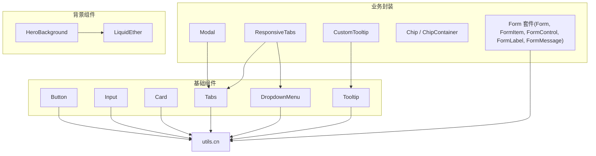
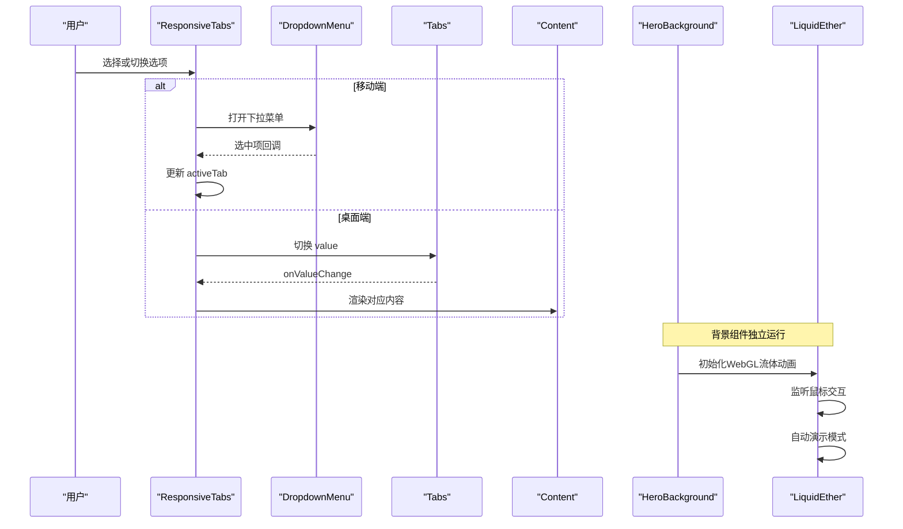
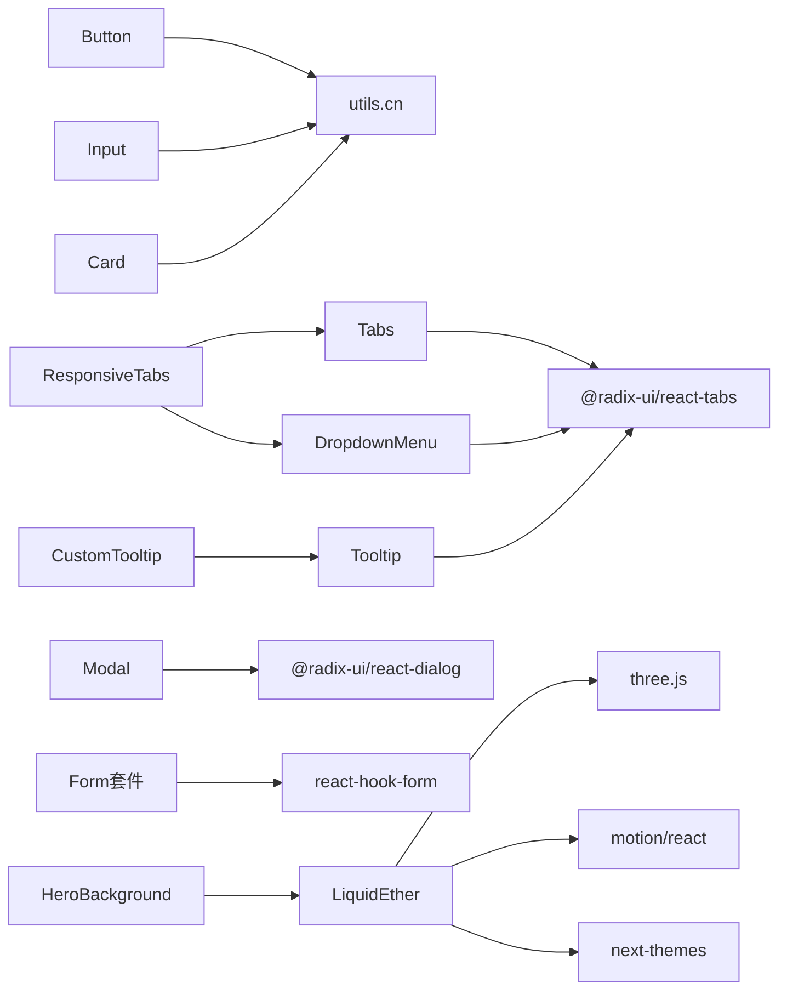

# UI组件库

<cite>
**本文引用的文件**
- [components/ui/button.tsx](file://components/ui/button.tsx)
- [components/ui/card.tsx](file://components/ui/card.tsx)
- [components/ui/input.tsx](file://components/ui/input.tsx)
- [components/ui/dialog.tsx](file://components/ui/dialog.tsx)
- [components/ui/modal.tsx](file://components/ui/modal.tsx)
- [components/ui/tabs.tsx](file://components/ui/tabs.tsx)
- [components/ui/dropdown-menu.tsx](file://components/ui/dropdown-menu.tsx)
- [components/ui/tooltip.tsx](file://components/ui/tooltip.tsx)
- [components/ui/custom-tooltip.tsx](file://components/ui/custom-tooltip.tsx)
- [components/ui/responsive-tabs.tsx](file://components/ui/responsive-tabs.tsx)
- [components/ui/form.tsx](file://components/ui/form.tsx)
- [components/ui/chip.tsx](file://components/ui/chip.tsx)
- [components/ui/chip-container.tsx](file://components/ui/chip-container.tsx)
- [components/backgrounds/liquid-ether.tsx](file://components/backgrounds/liquid-ether.tsx)
- [components/backgrounds/hero-background.tsx](file://components/backgrounds/hero-background.tsx)
- [lib/utils.ts](file://lib/utils.ts)
</cite>

## 更新摘要
**变更内容**
- 新增WebGL流体动画背景组件章节
- 添加LiquidEther和HeroBackground组件的详细API文档
- 更新项目结构图以包含背景组件
- 增强性能与可访问性部分，涵盖WebGL优化
- 添加主题定制指南，支持明暗主题切换

## 目录
1. [简介](#简介)
2. [项目结构](#项目结构)
3. [核心组件](#核心组件)
4. [架构总览](#架构总览)
5. [详细组件分析](#详细组件分析)
6. [WebGL流体动画背景组件](#webgl流体动画背景组件)
7. [依赖关系分析](#依赖关系分析)
8. [性能与可访问性](#性能与可访问性)
9. [主题与样式定制](#主题与样式定制)
10. [响应式设计与组合模式](#响应式设计与组合模式)
11. [故障排查指南](#故障排查指南)
12. [结论](#结论)

## 简介
本UI组件库基于Radix primitives与Tailwind CSS构建，提供基础UI组件（按钮、输入、卡片、标签页、下拉菜单、提示框等）与业务级封装（模态框、响应式标签页、表单控件、信息提示等）。组件遵循无头UI原则，通过类名与CSS变量实现主题化，具备完善的键盘导航与屏幕阅读器支持。**新增的WebGL流体动画背景组件**为页面提供高性能的交互式视觉效果，支持鼠标交互、自动演示模式和可访问性优化。文档涵盖设计原则、API说明、使用方式、事件处理、样式定制、可访问性与响应式实践，并给出组合模式与最佳实践建议。

## 项目结构
- 基础组件位于 components/ui，按功能拆分：交互控件（button、input、tabs、dropdown-menu、tooltip）、布局容器（card、form）、业务封装（modal、responsive-tabs、custom-tooltip、chip*）。
- **背景组件位于 components/backgrounds**，提供WebGL流体动画效果（liquid-ether、hero-background）。
- 工具函数集中在 lib/utils.ts，用于合并类名与通用逻辑。
- 所有组件统一采用 forwardRef、显式 displayName 与语义化HTML，确保可维护性与可测试性。



**图表来源**
- [components/ui/button.tsx:1-58](file://components/ui/button.tsx#L1-L58)
- [components/backgrounds/liquid-ether.tsx:11-31](file://components/backgrounds/liquid-ether.tsx#L11-L31)
- [components/backgrounds/hero-background.tsx:17-51](file://components/backgrounds/hero-background.tsx#L17-L51)

**章节来源**
- [components/ui/button.tsx:1-58](file://components/ui/button.tsx#L1-L58)
- [components/backgrounds/liquid-ether.tsx:1-1337](file://components/backgrounds/liquid-ether.tsx#L1-L1337)
- [components/backgrounds/hero-background.tsx:1-52](file://components/backgrounds/hero-background.tsx#L1-L52)

## 核心组件
本节概述各组件的职责、属性、事件与可访问性要点，并提供使用指引。

### 基础UI组件
- Button
  - 职责：可配置变体与尺寸的按钮，支持 asChild 透传至底层元素。
  - 关键属性：variant（default/destructive/outline/secondary/ghost/link）、size（default/sm/lg/icon）、asChild、以及标准按钮属性。
  - 事件：onClick 等原生事件透传。
  - 可访问性：聚焦环、禁用态、键盘可用。
  - 参考路径：[components/ui/button.tsx:7-34](file://components/ui/button.tsx#L7-L34)、[components/ui/button.tsx:36-57](file://components/ui/button.tsx#L36-L57)

- Input
  - 职责：带默认样式与焦点状态的输入框。
  - 关键属性：type、placeholder、disabled、value/onChange 受控用法等。
  - 可访问性：focus-visible 环、禁用态。
  - 参考路径：[components/ui/input.tsx:7-22](file://components/ui/input.tsx#L7-L22)

- Card
  - 职责：卡片容器及子区域（Header/Title/Description/Content/Footer）。
  - 关键属性：各子组件接受标准HTML属性，className 覆盖默认样式。
  - 可访问性：语义化标题与段落。
  - 参考路径：[components/ui/card.tsx:5-86](file://components/ui/card.tsx#L5-L86)

- Tabs
  - 职责：基于Radix的标签页，包含 List/Trigger/Content。
  - 关键属性：value/onValueChange（受控）、children。
  - 可访问性：键盘导航、ARIA状态。
  - 参考路径：[components/ui/tabs.tsx:8-55](file://components/ui/tabs.tsx#L8-L55)

- DropdownMenu
  - 职责：下拉菜单，含触发器、内容、分组、分隔符、单选/多选项等。
  - 关键属性：sideOffset、inset、checked/radio 等。
  - 可访问性：箭头键导航、Esc关闭、焦点管理。
  - 参考路径：[components/ui/dropdown-menu.tsx:9-200](file://components/ui/dropdown-menu.tsx#L9-L200)

- Tooltip
  - 职责：悬浮提示，含Provider/Trigger/Content。
  - 关键属性：sideOffset、children。
  - 可访问性：延迟显示、焦点外隐藏、屏幕阅读器友好。
  - 参考路径：[components/ui/tooltip.tsx:8-30](file://components/ui/tooltip.tsx#L8-L30)

- Modal
  - 职责：基于Dialog的业务封装，提供title/description/open/close控制。
  - 关键属性：isOpen、onClose、title、description、children。
  - 事件：关闭时调用onClose。
  - 参考路径：[components/ui/modal.tsx:13-39](file://components/ui/modal.tsx#L13-L39)

- ResponsiveTabs
  - 职责：移动端下拉选择、桌面端标签页切换的组合组件。
  - 关键属性：items（value/label/content）、defaultValue、className。
  - 事件：内部维护activeTab，移动端点击更新。
  - 参考路径：[components/ui/responsive-tabs.tsx:16-88](file://components/ui/responsive-tabs.tsx#L16-L88)

- CustomTooltip
  - 职责：带图标与信息文本的提示封装。
  - 关键属性：children、text、icon（可选）。
  - 参考路径：[components/ui/custom-tooltip.tsx:11-34](file://components/ui/custom-tooltip.tsx#L11-L34)

- Chip / ChipContainer
  - 职责：标签展示与批量渲染。
  - 关键属性：Chip.content；ChipContainer.textArr。
  - 参考路径：[components/ui/chip.tsx:1-12](file://components/ui/chip.tsx#L1-L12)、[components/ui/chip-container.tsx:1-16](file://components/ui/chip-container.tsx#L1-L16)

- Form 套件
  - 职责：基于react-hook-form的表单控件集合，提供FormItem/FormControl/FormLabel/FormDescription/FormMessage。
  - 关键属性：结合Controller使用，自动注入id与ARIA关联。
  - 可访问性：错误描述与无效状态通过aria-describedby/aria-invalid暴露。
  - 参考路径：[components/ui/form.tsx:16-177](file://components/ui/form.tsx#L16-L177)

**章节来源**
- [components/ui/button.tsx:7-57](file://components/ui/button.tsx#L7-L57)
- [components/ui/input.tsx:7-22](file://components/ui/input.tsx#L7-L22)
- [components/ui/card.tsx:5-86](file://components/ui/card.tsx#L5-L86)
- [components/ui/tabs.tsx:8-55](file://components/ui/tabs.tsx#L8-L55)
- [components/ui/dropdown-menu.tsx:9-200](file://components/ui/dropdown-menu.tsx#L9-L200)
- [components/ui/tooltip.tsx:8-30](file://components/ui/tooltip.tsx#L8-L30)
- [components/ui/modal.tsx:13-39](file://components/ui/modal.tsx#L13-L39)
- [components/ui/responsive-tabs.tsx:16-88](file://components/ui/responsive-tabs.tsx#L16-L88)
- [components/ui/custom-tooltip.tsx:11-34](file://components/ui/custom-tooltip.tsx#L11-L34)
- [components/ui/chip.tsx:1-12](file://components/ui/chip.tsx#L1-L12)
- [components/ui/chip-container.tsx:1-16](file://components/ui/chip-container.tsx#L1-L16)
- [components/ui/form.tsx:16-177](file://components/ui/form.tsx#L16-L177)

## 架构总览
组件以"基础原子 + 业务封装 + WebGL背景"分层组织，通过工具函数统一样式合并，借助Radix保证无障碍与行为一致性。



**图表来源**
- [components/ui/responsive-tabs.tsx:28-88](file://components/ui/responsive-tabs.tsx#L28-L88)
- [components/backgrounds/hero-background.tsx:17-51](file://components/backgrounds/hero-background.tsx#L17-L51)
- [components/backgrounds/liquid-ether.tsx:1084-1173](file://components/backgrounds/liquid-ether.tsx#L1084-L1173)

## 详细组件分析

### 基础UI组件详解
本节保持原有内容不变，涵盖所有基础UI组件的详细API和使用方法。

**章节来源**
- [components/ui/button.tsx:7-57](file://components/ui/button.tsx#L7-L57)
- [components/ui/input.tsx:7-22](file://components/ui/input.tsx#L7-L22)
- [components/ui/card.tsx:5-86](file://components/ui/card.tsx#L5-L86)
- [components/ui/tabs.tsx:8-55](file://components/ui/tabs.tsx#L8-L55)
- [components/ui/dropdown-menu.tsx:9-200](file://components/ui/dropdown-menu.tsx#L9-L200)
- [components/ui/tooltip.tsx:8-30](file://components/ui/tooltip.tsx#L8-L30)
- [components/ui/modal.tsx:13-39](file://components/ui/modal.tsx#L13-L39)
- [components/ui/responsive-tabs.tsx:16-88](file://components/ui/responsive-tabs.tsx#L16-L88)
- [components/ui/custom-tooltip.tsx:11-34](file://components/ui/custom-tooltip.tsx#L11-L34)
- [components/ui/chip.tsx:1-12](file://components/ui/chip.tsx#L1-L12)
- [components/ui/chip-container.tsx:1-16](file://components/ui/chip-container.tsx#L1-L16)
- [components/ui/form.tsx:16-177](file://components/ui/form.tsx#L16-L177)

## WebGL流体动画背景组件

### LiquidEther 组件
LiquidEther是一个基于Three.js的高性能WebGL流体动画组件，提供交互式液体效果，支持鼠标拖拽、自动演示模式和丰富的自定义选项。

#### 组件特性
- **高性能渲染**：使用WebGL和着色器程序实现流畅的流体动画
- **鼠标交互**：支持鼠标移动、触摸事件和自动演示模式
- **可访问性**：尊重用户的运动偏好设置，提供降级方案
- **主题适配**：支持明暗主题的颜色调色板切换
- **性能优化**：使用IntersectionObserver和ResizeObserver优化性能

#### API接口
```typescript
interface LiquidEtherProps {
  // 交互设置
  mouseForce?: number;        // 鼠标力强度 (默认: 20)
  cursorSize?: number;        // 光标大小 (默认: 100)
  
  // 物理模拟
  isViscous?: boolean;        // 是否启用粘性效果 (默认: false)
  viscous?: number;           // 粘性系数 (默认: 30)
  iterationsViscous?: number; // 粘性迭代次数 (默认: 32)
  iterationsPoisson?: number; // 泊松迭代次数 (默认: 32)
  dt?: number;               // 时间步长 (默认: 0.014)
  
  // 渲染设置
  BFECC?: boolean;           // 双向边界条件修正 (默认: true)
  resolution?: number;       // 渲染分辨率 (默认: 0.5)
  isBounce?: boolean;        // 是否启用反弹效果 (默认: false)
  
  // 视觉设置
  colors?: string[];         // 颜色调色板 (默认: ["#5227FF", "#FF9FFC", "#B497CF"])
  style?: React.CSSProperties; // 容器样式
  className?: string;        // 容器类名
  
  // 自动演示
  autoDemo?: boolean;        // 是否启用自动演示 (默认: true)
  autoSpeed?: number;        // 自动演示速度 (默认: 0.5)
  autoIntensity?: number;    // 自动演示强度 (默认: 2.2)
  takeoverDuration?: number; // 接管过渡时间 (默认: 0.25)
  autoResumeDelay?: number;  // 自动恢复延迟 (默认: 1000)
  autoRampDuration?: number; // 自动渐入时间 (默认: 0.6)
}
```

#### 使用示例
```tsx
// 基础使用
<LiquidEther 
  colors={["#0ea5e9", "#8b5cf6", "#ec4899"]}
  mouseForce={14}
  cursorSize={90}
  autoDemo
/>

// 高性能模式
<LiquidEther 
  resolution={0.4}
  iterationsPoisson={20}
  isViscous={false}
  autoSpeed={0.35}
/>
```

#### 性能优化
- **动态加载**：使用Next.js dynamic import避免SSR问题
- **视口检测**：IntersectionObserver仅在组件可见时渲染
- **设备适配**：根据设备像素比调整渲染质量
- **内存管理**：组件卸载时正确清理WebGL资源

**章节来源**
- [components/backgrounds/liquid-ether.tsx:11-31](file://components/backgrounds/liquid-ether.tsx#L11-L31)
- [components/backgrounds/liquid-ether.tsx:64-84](file://components/backgrounds/liquid-ether.tsx#L64-L84)
- [components/backgrounds/liquid-ether.tsx:1084-1173](file://components/backgrounds/liquid-ether.tsx#L1084-L1173)

### HeroBackground 组件
HeroBackground是LiquidEther的高级封装组件，专为首页英雄区域设计，提供主题感知的流体背景效果。

#### 组件特性
- **主题感知**：自动检测系统主题并应用相应的颜色调色板
- **可访问性优先**：尊重用户的减少运动偏好设置
- **渐进增强**：提供CSS渐变作为降级方案
- **性能优化**：客户端渲染，避免SSR开销

#### API接口
```typescript
export function HeroBackground(): React.ReactElement
```

#### 使用示例
```tsx
import { HeroBackground } from "@/components/backgrounds/hero-background";

function HomePage() {
  return (
    <section className="relative">
      <HeroBackground />
      <div className="relative z-10">
        {/* 页面内容 */}
      </div>
    </section>
  );
}
```

#### 主题配色
- **浅色主题**：["#0ea5e9", "#8b5cf6", "#ec4899"]
- **深色主题**：["#22d3ee", "#8b5cf6", "#f472b6"]

#### 可访问性支持
- 使用`aria-hidden="true"`标记装饰性内容
- 尊重`prefers-reduced-motion`媒体查询
- 提供CSS渐变作为JavaScript不可用时的降级方案

**章节来源**
- [components/backgrounds/hero-background.tsx:17-51](file://components/backgrounds/hero-background.tsx#L17-L51)

## 依赖关系分析
- 外部依赖
  - Radix Primitives：Dialog、Tabs、DropdownMenu、Tooltip、Label等，提供无障碍与行为。
  - React Hook Form：表单状态管理与校验集成。
  - Lucide Icons：图标资源。
  - Class Variance Authority：变体样式管理。
  - Tailwind CSS：原子化样式与主题变量。
  - **Three.js**：WebGL流体动画渲染引擎。
  - **motion/react**：可访问性动画检测。
  - **next-themes**：主题管理。
- 内部依赖
  - utils.cn：统一合并类名，避免冲突。
  - 组件间组合：Modal依赖Dialog；ResponsiveTabs组合Tabs与DropdownMenu；CustomTooltip封装Tooltip；HeroBackground封装LiquidEther。



**图表来源**
- [components/backgrounds/hero-background.tsx:3-6](file://components/backgrounds/hero-background.tsx#L3-L6)
- [components/backgrounds/liquid-ether.tsx:8-9](file://components/backgrounds/liquid-ether.tsx#L8-L9)

**章节来源**
- [components/backgrounds/hero-background.tsx:1-52](file://components/backgrounds/hero-background.tsx#L1-L52)
- [components/backgrounds/liquid-ether.tsx:1-1337](file://components/backgrounds/liquid-ether.tsx#L1-L1337)

## 性能与可访问性
- 性能
  - 无头UI减少重绘与副作用，按需渲染。
  - 使用React.memo或记忆化策略可在上层优化大型列表（如DropdownMenu大量项）。
  - 避免在高频事件中创建新对象，保持引用稳定。
  - **WebGL优化**：使用IntersectionObserver仅在组件可见时渲染，ResizeObserver优化重排，设备像素比自适应。
  - **内存管理**：组件卸载时正确清理WebGL上下文和事件监听器。
- 可访问性
  - 键盘导航：Tabs/DropdownMenu/Tooltip/Dialog均支持键盘操作。
  - 焦点管理：Dialog提供焦点陷阱；Tooltip在焦点外隐藏。
  - 屏幕阅读器：语义化标签、aria-describedby/aria-invalid、sr-only文本。
  - 对比度与聚焦环：通过Tailwind主题色与focus-visible样式保障。
  - **WebGL可访问性**：使用`aria-hidden="true"`标记装饰性背景，尊重`prefers-reduced-motion`设置，提供CSS降级方案。

**章节来源**
- [components/ui/tabs.tsx:8-55](file://components/ui/tabs.tsx#L8-L55)
- [components/ui/dropdown-menu.tsx:9-200](file://components/ui/dropdown-menu.tsx#L9-L200)
- [components/ui/tooltip.tsx:8-30](file://components/ui/tooltip.tsx#L8-L30)
- [components/ui/dialog.tsx:18-55](file://components/ui/dialog.tsx#L18-L55)
- [components/ui/form.tsx:104-124](file://components/ui/form.tsx#L104-L124)
- [components/backgrounds/hero-background.tsx:18-22](file://components/backgrounds/hero-background.tsx#L18-L22)

## 主题与样式定制
- 主题变量
  - 使用Tailwind CSS变量（如background、primary、ring等）实现明暗主题与品牌色替换。
- 组件样式
  - 通过className覆盖默认样式；Button使用cva变体，可按需新增variant/size。
  - 卡片、输入、标签页等均可通过className进行局部定制。
  - **背景组件主题**：HeroBackground自动检测主题并应用相应颜色调色板。
- 工具函数
  - utils.cn用于安全合并类名，避免重复与冲突。
- 最佳实践
  - 优先使用语义化组件与Tailwind原子类，减少自定义CSS。
  - 对复杂样式抽取为独立模块或主题层，便于复用与维护。
  - **WebGL背景定制**：通过colors属性自定义流体动画颜色，调整resolution控制性能与质量的平衡。

**章节来源**
- [components/ui/button.tsx:7-34](file://components/ui/button.tsx#L7-L34)
- [components/ui/card.tsx:5-17](file://components/ui/card.tsx#L5-L17)
- [components/ui/input.tsx:7-22](file://components/ui/input.tsx#L7-L22)
- [components/ui/tabs.tsx:10-55](file://components/ui/tabs.tsx#L10-L55)
- [components/backgrounds/hero-background.tsx:12-15](file://components/backgrounds/hero-background.tsx#L12-L15)
- [lib/utils.ts](file://lib/utils.ts)

## 响应式设计与组合模式
- 响应式
  - 使用Tailwind断点（如md:hidden/md:block）在ResponsiveTabs中切换移动端下拉与桌面端标签页。
  - 通过DropdownMenu与Tabs组合实现一致的交互体验。
  - **WebGL响应式**：LiquidEther使用ResizeObserver自动适应容器尺寸变化。
- 组合模式
  - Modal = Dialog + DialogContent + Header/Title/Description。
  - CustomTooltip = TooltipProvider + Tooltip + Content + Icon。
  - Form套件 = FormProvider + Controller + Label/Description/Message。
  - **HeroBackground = LiquidEther + 主题管理 + 可访问性处理**。
- 使用建议
  - 在移动端优先简洁交互（下拉选择），桌面端提供更丰富的导航（标签页）。
  - 通过items数据驱动渲染，保持结构与数据解耦。
  - **背景组件使用**：将HeroBackground置于页面最底层，配合z-index管理内容层级。

**章节来源**
- [components/ui/responsive-tabs.tsx:28-88](file://components/ui/responsive-tabs.tsx#L28-L88)
- [components/ui/modal.tsx:21-39](file://components/ui/modal.tsx#L21-L39)
- [components/ui/custom-tooltip.tsx:17-34](file://components/ui/custom-tooltip.tsx#L17-L34)
- [components/ui/form.tsx:16-177](file://components/ui/form.tsx#L16-L177)
- [components/backgrounds/hero-background.tsx:17-51](file://components/backgrounds/hero-background.tsx#L17-L51)

## 故障排查指南
- 常见问题
  - 表单字段未正确关联：确保使用FormItem包裹，并使用FormControl/Label/Description/Message。
  - 下拉菜单位置异常：检查父容器overflow与z-index，必要时调整sideOffset。
  - 提示框不显示：确认TooltipProvider已包裹，且Trigger可聚焦。
  - 模态框无法关闭：检查isOpen状态与onClose回调是否正确传递。
  - **WebGL背景不显示**：确认组件在客户端渲染，检查浏览器WebGL支持。
  - **性能问题**：调整resolution参数降低渲染质量，或禁用autoDemo减少计算。
- 调试建议
  - 使用浏览器开发者工具检查DOM结构与ARIA属性。
  - 逐步注释样式定位冲突；使用className覆盖验证问题范围。
  - 对复杂组合组件（如ResponsiveTabs）先隔离渲染基础组件（Tabs/DropdownMenu）定位问题。
  - **WebGL调试**：使用浏览器开发者工具的GPU监控面板检查渲染性能，检查控制台是否有WebGL相关错误。

**章节来源**
- [components/ui/form.tsx:73-177](file://components/ui/form.tsx#L73-L177)
- [components/ui/dropdown-menu.tsx:59-75](file://components/ui/dropdown-menu.tsx#L59-L75)
- [components/ui/tooltip.tsx:8-30](file://components/ui/tooltip.tsx#L8-L30)
- [components/ui/modal.tsx:21-39](file://components/ui/modal.tsx#L21-L39)
- [components/backgrounds/liquid-ether.tsx:1212-1227](file://components/backgrounds/liquid-ether.tsx#L1212-L1227)

## 结论
本UI组件库以Radix与Tailwind为核心，提供一致、可访问、易定制的组件体系。**新增的WebGL流体动画背景组件**为页面增添了现代感和互动性，同时保持了良好的性能和可访问性。通过基础组件与业务封装的分层设计，既满足快速搭建页面的需求，又便于深度定制与扩展。推荐在实践中遵循组合模式、响应式策略与主题化方案，以获得更好的可维护性与用户体验。对于需要视觉冲击力的页面，推荐使用HeroBackground组件提供高性能的流体动画背景效果。