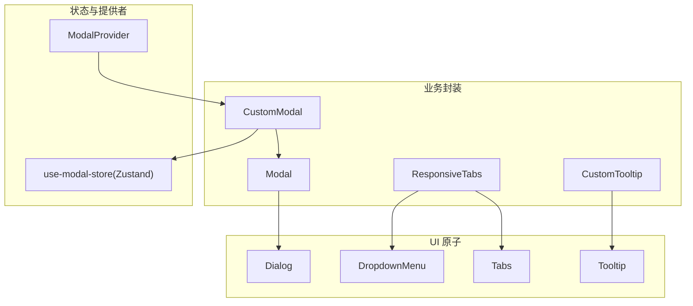
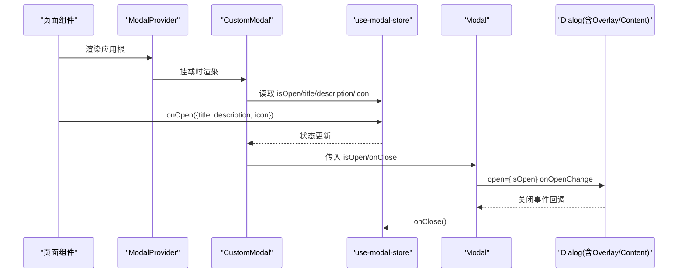
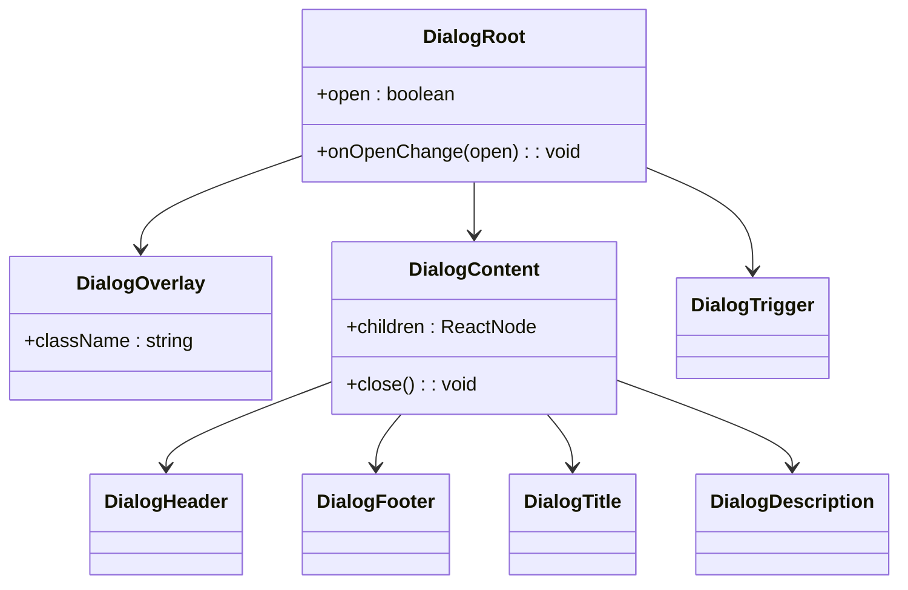
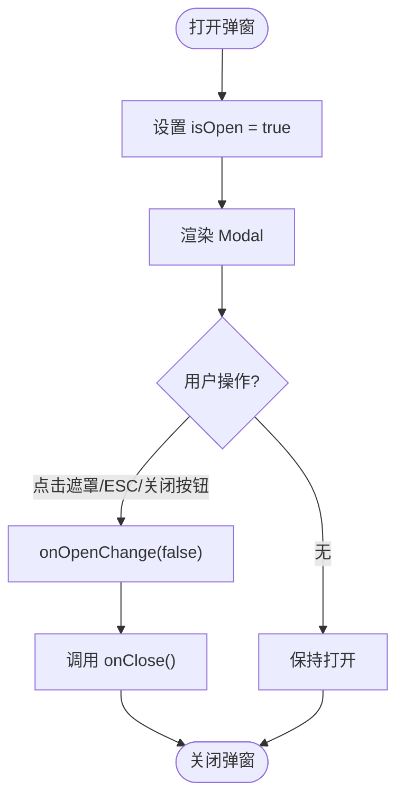
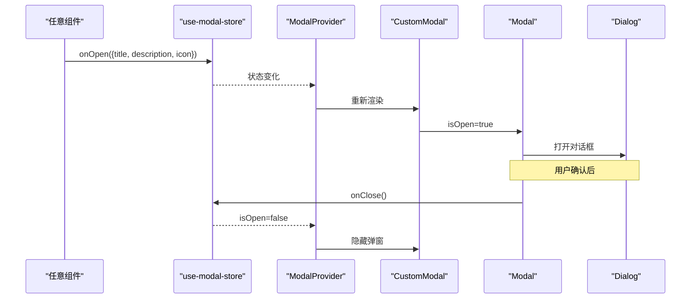
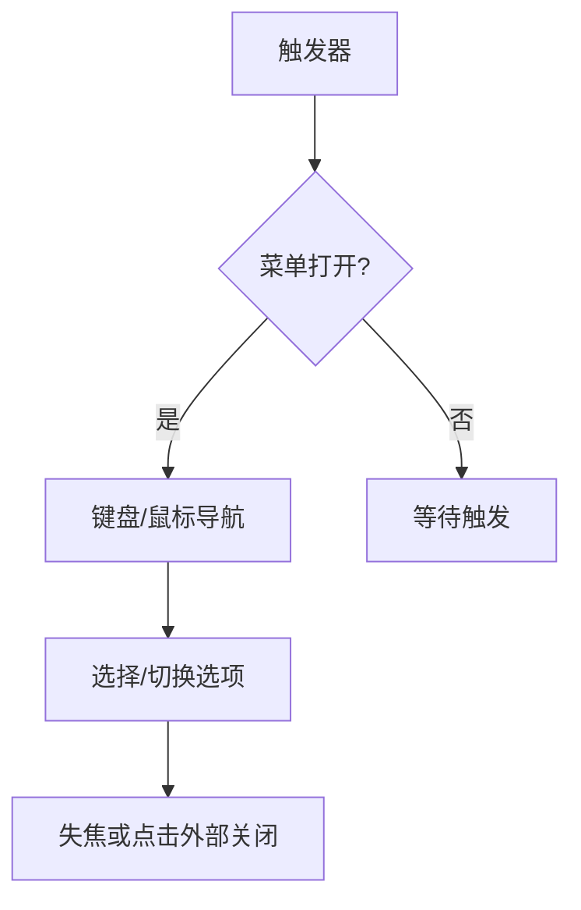
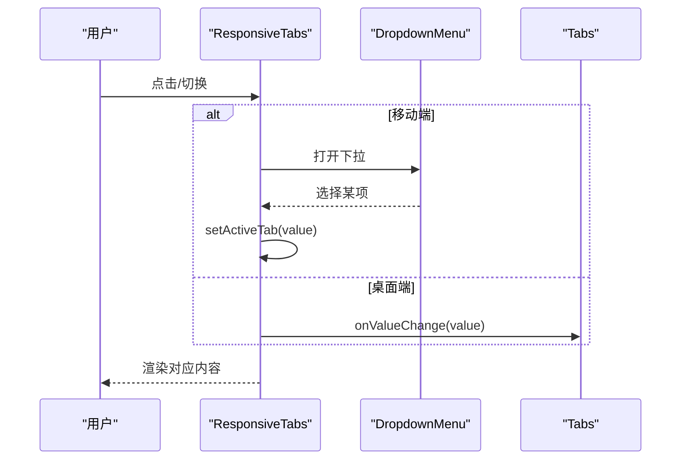
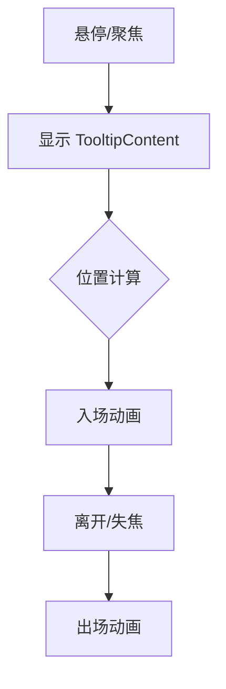
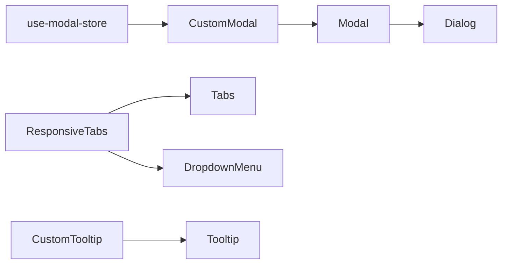

# 交互组件

<cite>
**本文引用的文件**
- [components/ui/dialog.tsx](file://components/ui/dialog.tsx)
- [components/ui/modal.tsx](file://components/ui/modal.tsx)
- [components/modals/custom-modal.tsx](file://components/modals/custom-modal.tsx)
- [hooks/use-modal-store.ts](file://hooks/use-modal-store.ts)
- [providers/modal-provider.tsx](file://providers/modal-provider.tsx)
- [components/ui/dropdown-menu.tsx](file://components/ui/dropdown-menu.tsx)
- [components/ui/tabs.tsx](file://components/ui/tabs.tsx)
- [components/ui/responsive-tabs.tsx](file://components/ui/responsive-tabs.tsx)
- [components/ui/tooltip.tsx](file://components/ui/tooltip.tsx)
- [components/ui/custom-tooltip.tsx](file://components/ui/custom-tooltip.tsx)
</cite>

## 目录
1. [简介](#简介)
2. [项目结构](#项目结构)
3. [核心组件](#核心组件)
4. [架构总览](#架构总览)
5. [详细组件分析](#详细组件分析)
6. [依赖关系分析](#依赖关系分析)
7. [性能考虑](#性能考虑)
8. [故障排查指南](#故障排查指南)
9. [结论](#结论)
10. [附录](#附录)

## 简介
本文件面向开发者，系统化梳理本项目中的交互组件实现与使用方式，覆盖 Modal、Dialog、DropdownMenu、Tabs、Accordion（以响应式 Tabs 替代）、Toast（未在本仓库找到对应实现）、Tooltip 等。重点说明：
- 状态管理：受控与非受控模式、全局 store 与 Provider 组合
- 动画效果：基于 Radix 的 data-[state] 与 Tailwind 动画类
- 键盘导航与可访问性：焦点管理、ARIA 语义、屏幕阅读器支持
- 组合模式与自定义样式：通过 forwardRef、className 合并与主题变量
- 实际使用示例与最佳实践

## 项目结构
交互组件集中在 components/ui 下，采用“基础原子组件 + 业务封装”的分层组织：
- 基础原子：dialog、dropdown-menu、tabs、tooltip 等基于 Radix UI 的封装
- 业务封装：modal、custom-modal、responsive-tabs、custom-tooltip 等组合原子能力
- 状态与上下文：use-modal-store（Zustand）+ modal-provider 提供全局弹窗能力

图表来源
- [components/ui/dialog.tsx:1-121](file://components/ui/dialog.tsx#L1-L121)
- [components/ui/dropdown-menu.tsx:1-201](file://components/ui/dropdown-menu.tsx#L1-L201)
- [components/ui/tabs.tsx:1-56](file://components/ui/tabs.tsx#L1-L56)
- [components/ui/tooltip.tsx:1-31](file://components/ui/tooltip.tsx#L1-L31)
- [components/ui/modal.tsx:1-40](file://components/ui/modal.tsx#L1-L40)
- [components/modals/custom-modal.tsx:1-30](file://components/modals/custom-modal.tsx#L1-L30)
- [hooks/use-modal-store.ts:1-33](file://hooks/use-modal-store.ts#L1-L33)
- [providers/modal-provider.tsx:1-24](file://providers/modal-provider.tsx#L1-L24)

章节来源
- [components/ui/dialog.tsx:1-121](file://components/ui/dialog.tsx#L1-L121)
- [components/ui/dropdown-menu.tsx:1-201](file://components/ui/dropdown-menu.tsx#L1-L201)
- [components/ui/tabs.tsx:1-56](file://components/ui/tabs.tsx#L1-L56)
- [components/ui/tooltip.tsx:1-31](file://components/ui/tooltip.tsx#L1-L31)
- [components/ui/modal.tsx:1-40](file://components/ui/modal.tsx#L1-L40)
- [components/modals/custom-modal.tsx:1-30](file://components/modals/custom-modal.tsx#L1-L30)
- [hooks/use-modal-store.ts:1-33](file://hooks/use-modal-store.ts#L1-L33)
- [providers/modal-provider.tsx:1-24](file://providers/modal-provider.tsx#L1-L24)

## 核心组件
- Dialog：基于 @radix-ui/react-dialog 的底层封装，提供 Overlay、Content、Header/Footer、Title/Description、Trigger 等子组件，内置动画与焦点管理。
- Modal：在 Dialog 之上提供 title/description/isOpen/onClose 的受控接口，简化调用方状态管理。
- DropdownMenu：基于 @radix-ui/react-dropdown-menu，提供菜单项、分组、分隔符、快捷键提示、子菜单等完整能力。
- Tabs：基于 @radix-ui/react-tabs，提供 TabList/TabTrigger/TabContent，具备键盘切换与焦点环。
- ResponsiveTabs：组合 Tabs 与 DropdownMenu，在小屏以下拉选择代替标签页，在大屏显示标准 Tabs。
- Tooltip：基于 @radix-ui/react-tooltip，提供触发器与内容容器，带入场/出场动画。
- CustomTooltip：对 Tooltip 的业务封装，统一图标与文案展示。

章节来源
- [components/ui/dialog.tsx:1-121](file://components/ui/dialog.tsx#L1-L121)
- [components/ui/modal.tsx:1-40](file://components/ui/modal.tsx#L1-L40)
- [components/ui/dropdown-menu.tsx:1-201](file://components/ui/dropdown-menu.tsx#L1-L201)
- [components/ui/tabs.tsx:1-56](file://components/ui/tabs.tsx#L1-L56)
- [components/ui/responsive-tabs.tsx:1-89](file://components/ui/responsive-tabs.tsx#L1-L89)
- [components/ui/tooltip.tsx:1-31](file://components/ui/tooltip.tsx#L1-L31)
- [components/ui/custom-tooltip.tsx:1-34](file://components/ui/custom-tooltip.tsx#L1-L34)

## 架构总览
下图展示了从页面到 UI 原子的调用链，以及全局弹窗的状态流。

图表来源
- [providers/modal-provider.tsx:1-24](file://providers/modal-provider.tsx#L1-L24)
- [components/modals/custom-modal.tsx:1-30](file://components/modals/custom-modal.tsx#L1-L30)
- [hooks/use-modal-store.ts:1-33](file://hooks/use-modal-store.ts#L1-L33)
- [components/ui/modal.tsx:1-40](file://components/ui/modal.tsx#L1-L40)
- [components/ui/dialog.tsx:1-121](file://components/ui/dialog.tsx#L1-L121)

## 详细组件分析

### Dialog（基础对话框）
- 职责：提供模态对话框的底层能力（Portal、Overlay、Content、Header/Footer、Title/Description、Trigger），并处理焦点陷阱与 ESC 关闭。
- 状态与动画：通过 data-[state=open|closed] 驱动 Tailwind 动画类，实现淡入/缩放/滑入等过渡。
- 可访问性：包含 sr-only 关闭按钮文本，配合 Radix 的 ARIA 属性，确保屏幕阅读器可读。
- 扩展点：forwardRef 暴露 ref；className 合并便于主题定制。

图表来源
- [components/ui/dialog.tsx:1-121](file://components/ui/dialog.tsx#L1-L121)

章节来源
- [components/ui/dialog.tsx:1-121](file://components/ui/dialog.tsx#L1-L121)

### Modal（受控弹窗）
- 职责：将 Dialog 包装为受控组件，对外暴露 isOpen/onClose 与标题、描述、插槽 children。
- 状态管理：由调用方控制 isOpen，内部通过 onOpenChange 回调触发 onClose。
- 使用建议：适合需要集中管理弹窗开关的场景；复杂场景可与 use-modal-store 结合。

图表来源
- [components/ui/modal.tsx:1-40](file://components/ui/modal.tsx#L1-L40)
- [components/ui/dialog.tsx:1-121](file://components/ui/dialog.tsx#L1-L121)

章节来源
- [components/ui/modal.tsx:1-40](file://components/ui/modal.tsx#L1-L40)

### 全局弹窗：CustomModal + ModalProvider + use-modal-store
- 职责：提供全局弹窗能力，任意组件可通过 store.onOpen 打开统一样式的确认/信息弹窗。
- 状态流：store 维护 isOpen、title、description、icon；Provider 在客户端挂载后渲染 CustomModal。
- 组合模式：CustomModal 作为 Modal 的内容插槽，动态渲染图标与文案。

图表来源
- [hooks/use-modal-store.ts:1-33](file://hooks/use-modal-store.ts#L1-L33)
- [providers/modal-provider.tsx:1-24](file://providers/modal-provider.tsx#L1-L24)
- [components/modals/custom-modal.tsx:1-30](file://components/modals/custom-modal.tsx#L1-L30)
- [components/ui/modal.tsx:1-40](file://components/ui/modal.tsx#L1-L40)
- [components/ui/dialog.tsx:1-121](file://components/ui/dialog.tsx#L1-L121)

章节来源
- [hooks/use-modal-store.ts:1-33](file://hooks/use-modal-store.ts#L1-L33)
- [providers/modal-provider.tsx:1-24](file://providers/modal-provider.tsx#L1-L24)
- [components/modals/custom-modal.tsx:1-30](file://components/modals/custom-modal.tsx#L1-L30)
- [components/ui/modal.tsx:1-40](file://components/ui/modal.tsx#L1-L40)
- [components/ui/dialog.tsx:1-121](file://components/ui/dialog.tsx#L1-L121)

### DropdownMenu（下拉菜单）
- 职责：提供完整的下拉菜单能力，包括分组、分隔符、单选/多选、子菜单、快捷键提示等。
- 状态与动画：data-[state] 驱动淡入/缩放/滑入动画；聚焦高亮与禁用态样式。
- 可访问性：Radix 自动处理键盘导航（方向键、Enter、Esc）与 ARIA 属性。
- 扩展点：MenuItem/CheckboxItem/RadioItem 支持 inset 缩进；Separator 用于视觉分割。

图表来源
- [components/ui/dropdown-menu.tsx:1-201](file://components/ui/dropdown-menu.tsx#L1-L201)

章节来源
- [components/ui/dropdown-menu.tsx:1-201](file://components/ui/dropdown-menu.tsx#L1-L201)

### Tabs 与 ResponsiveTabs（标签页与响应式标签）
- Tabs：基于 Radix，提供 TabList/TabTrigger/TabContent，具备键盘左右切换与焦点环。
- ResponsiveTabs：小屏用 DropdownMenu 模拟标签选择，大屏用标准 Tabs；通过 value/onValueChange 同步选中态。
- 数据模型：items 数组定义每个标签的 value、label、content。

图表来源
- [components/ui/responsive-tabs.tsx:1-89](file://components/ui/responsive-tabs.tsx#L1-L89)
- [components/ui/dropdown-menu.tsx:1-201](file://components/ui/dropdown-menu.tsx#L1-L201)
- [components/ui/tabs.tsx:1-56](file://components/ui/tabs.tsx#L1-L56)

章节来源
- [components/ui/tabs.tsx:1-56](file://components/ui/tabs.tsx#L1-L56)
- [components/ui/responsive-tabs.tsx:1-89](file://components/ui/responsive-tabs.tsx#L1-L89)

### Tooltip（气泡提示）
- 职责：为元素提供悬浮提示，支持 sideOffset 偏移与多方位滑入动画。
- 可访问性：Radix 负责焦点与键盘行为；可搭配 aria-* 增强语义。
- 组合模式：CustomTooltip 统一图标与文案，减少重复代码。

图表来源
- [components/ui/tooltip.tsx:1-31](file://components/ui/tooltip.tsx#L1-L31)
- [components/ui/custom-tooltip.tsx:1-34](file://components/ui/custom-tooltip.tsx#L1-L34)

章节来源
- [components/ui/tooltip.tsx:1-31](file://components/ui/tooltip.tsx#L1-L31)
- [components/ui/custom-tooltip.tsx:1-34](file://components/ui/custom-tooltip.tsx#L1-L34)

### Accordion（手风琴）
- 现状：当前仓库未提供独立的 Accordion 组件。
- 替代方案：可使用 Tabs 或自定义折叠面板（基于 Dialog/Tabs 的组合）实现类似功能。
- 建议：若需手风琴交互，可在现有 Tabs 基础上扩展，或使用第三方库如 Radix Collapsible。

[本节不直接分析具体文件，故无章节来源]

### Toast（轻提示）
- 现状：当前仓库未提供 Toast 相关组件（toast.tsx/toaster.tsx/use-toast.ts 不存在）。
- 建议：可引入 Radix Toast 或 shadcn/ui toast 实现，遵循相同的数据驱动与动画规范。

[本节不直接分析具体文件，故无章节来源]

## 依赖关系分析
- 外部依赖：@radix-ui/* 提供无障碍与状态机；lucide-react 提供图标；Tailwind 提供样式与动画。
- 内部依赖：业务组件依赖 UI 原子；Provider 与 Store 解耦视图与状态。

图表来源
- [hooks/use-modal-store.ts:1-33](file://hooks/use-modal-store.ts#L1-L33)
- [components/modals/custom-modal.tsx:1-30](file://components/modals/custom-modal.tsx#L1-L30)
- [components/ui/modal.tsx:1-40](file://components/ui/modal.tsx#L1-L40)
- [components/ui/dialog.tsx:1-121](file://components/ui/dialog.tsx#L1-L121)
- [components/ui/responsive-tabs.tsx:1-89](file://components/ui/responsive-tabs.tsx#L1-L89)
- [components/ui/tabs.tsx:1-56](file://components/ui/tabs.tsx#L1-L56)
- [components/ui/dropdown-menu.tsx:1-201](file://components/ui/dropdown-menu.tsx#L1-L201)
- [components/ui/tooltip.tsx:1-31](file://components/ui/tooltip.tsx#L1-L31)
- [components/ui/custom-tooltip.tsx:1-34](file://components/ui/custom-tooltip.tsx#L1-L34)

章节来源
- [hooks/use-modal-store.ts:1-33](file://hooks/use-modal-store.ts#L1-L33)
- [components/modals/custom-modal.tsx:1-30](file://components/modals/custom-modal.tsx#L1-L30)
- [components/ui/modal.tsx:1-40](file://components/ui/modal.tsx#L1-L40)
- [components/ui/dialog.tsx:1-121](file://components/ui/dialog.tsx#L1-L121)
- [components/ui/responsive-tabs.tsx:1-89](file://components/ui/responsive-tabs.tsx#L1-L89)
- [components/ui/tabs.tsx:1-56](file://components/ui/tabs.tsx#L1-L56)
- [components/ui/dropdown-menu.tsx:1-201](file://components/ui/dropdown-menu.tsx#L1-L201)
- [components/ui/tooltip.tsx:1-31](file://components/ui/tooltip.tsx#L1-L31)
- [components/ui/custom-tooltip.tsx:1-34](file://components/ui/custom-tooltip.tsx#L1-L34)

## 性能考虑
- Portal 渲染：Dialog/DropdownMenu/Tooltip 均使用 Portal，避免 DOM 层级导致的重绘与布局抖动。
- 动画优化：使用 CSS 动画与 transform 提升合成层性能；避免在动画期间进行昂贵计算。
- 条件渲染：ModalProvider 在客户端挂载后再渲染，避免 SSR 水合差异。
- 列表与菜单：DropdownMenu 项尽量轻量，必要时懒加载长列表内容。

[本节提供通用指导，不直接分析具体文件，故无章节来源]

## 故障排查指南
- 弹窗无法关闭
  - 检查是否传入了正确的 onOpenChange/onClose，并确保调用 store.onClose 或父级 setState。
  - 参考路径：[components/ui/modal.tsx:21-39](file://components/ui/modal.tsx#L21-L39)、[hooks/use-modal-store.ts:19-32](file://hooks/use-modal-store.ts#L19-L32)
- 键盘导航异常
  - 确认使用了 Radix 提供的组件（Dialog/Tabs/DropdownMenu/Tooltip），它们已内置焦点管理与键盘行为。
  - 参考路径：[components/ui/dialog.tsx:1-121](file://components/ui/dialog.tsx#L1-L121)、[components/ui/tabs.tsx:1-56](file://components/ui/tabs.tsx#L1-L56)、[components/ui/dropdown-menu.tsx:1-201](file://components/ui/dropdown-menu.tsx#L1-L201)、[components/ui/tooltip.tsx:1-31](file://components/ui/tooltip.tsx#L1-L31)
- 动画不生效
  - 检查 Tailwind 配置是否启用 animate-in/animate-out，以及 data-[state] 类名是否正确。
  - 参考路径：[components/ui/dialog.tsx:21-55](file://components/ui/dialog.tsx#L21-L55)、[components/ui/dropdown-menu.tsx:43-75](file://components/ui/dropdown-menu.tsx#L43-L75)、[components/ui/tooltip.tsx:14-28](file://components/ui/tooltip.tsx#L14-L28)
- 屏幕阅读器无反馈
  - 确保包含必要的 ARIA 与 sr-only 文本；Radix 组件通常已处理，但自定义内容需补充语义。
  - 参考路径：[components/ui/dialog.tsx:48-52](file://components/ui/dialog.tsx#L48-L52)

章节来源
- [components/ui/modal.tsx:21-39](file://components/ui/modal.tsx#L21-L39)
- [hooks/use-modal-store.ts:19-32](file://hooks/use-modal-store.ts#L19-L32)
- [components/ui/dialog.tsx:21-55](file://components/ui/dialog.tsx#L21-L55)
- [components/ui/dropdown-menu.tsx:43-75](file://components/ui/dropdown-menu.tsx#L43-L75)
- [components/ui/tooltip.tsx:14-28](file://components/ui/tooltip.tsx#L14-L28)
- [components/ui/dialog.tsx:48-52](file://components/ui/dialog.tsx#L48-L52)

## 结论
本项目以 Radix UI 为基础，构建了稳定、可访问且易扩展的交互组件体系。通过“原子 + 业务封装 + 全局状态”的分层设计，既保证了复用性，又降低了集成成本。对于缺失的 Accordion 与 Toast，建议按现有风格继续扩展，以保持整体一致性与可维护性。

[本节为总结性内容，不直接分析具体文件，故无章节来源]

## 附录
- 使用示例（路径指引）
  - 打开全局弹窗：在任意组件中调用 store.onOpen({title, description, icon})，并在根节点包裹 ModalProvider。
    - 参考路径：[hooks/use-modal-store.ts:19-32](file://hooks/use-modal-store.ts#L19-L32)、[providers/modal-provider.tsx:1-24](file://providers/modal-provider.tsx#L1-L24)
  - 使用受控 Modal：传入 isOpen/onClose，并通过 children 注入内容。
    - 参考路径：[components/ui/modal.tsx:13-39](file://components/ui/modal.tsx#L13-L39)
  - 响应式标签页：传入 items 数组，自动适配移动端下拉与桌面端标签。
    - 参考路径：[components/ui/responsive-tabs.tsx:16-89](file://components/ui/responsive-tabs.tsx#L16-L89)
  - 气泡提示：使用 CustomTooltip 快速添加图标与文案。
    - 参考路径：[components/ui/custom-tooltip.tsx:11-34](file://components/ui/custom-tooltip.tsx#L11-L34)

[本节为使用指引，不直接分析具体文件，故无章节来源]