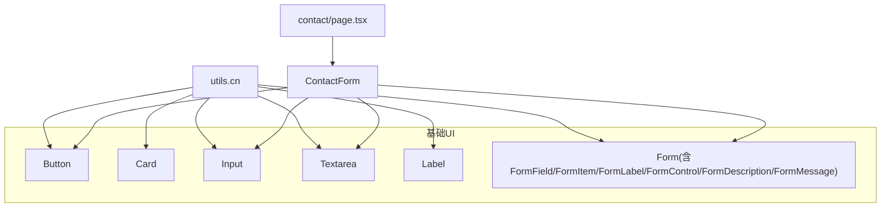
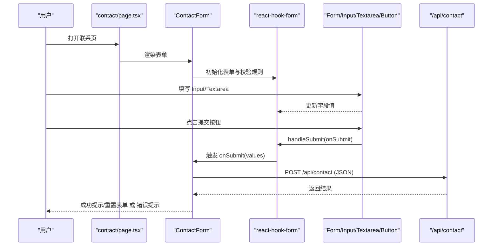
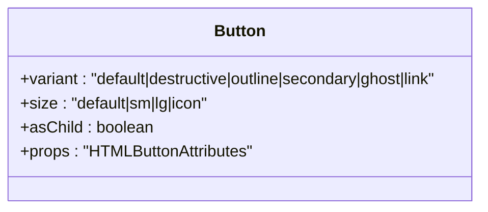
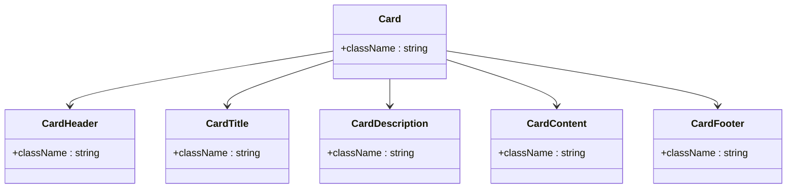
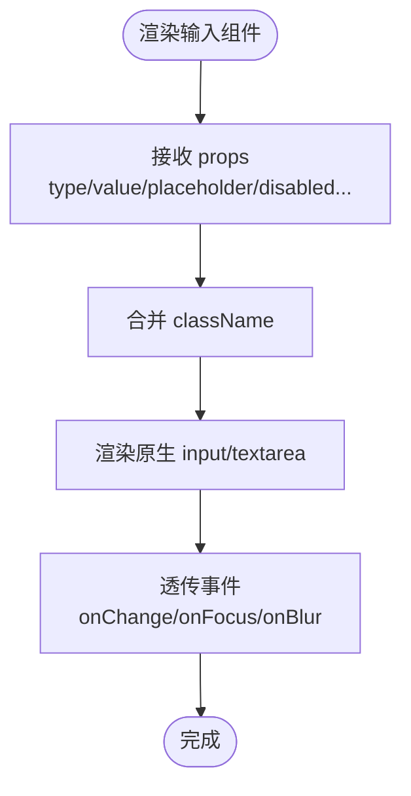
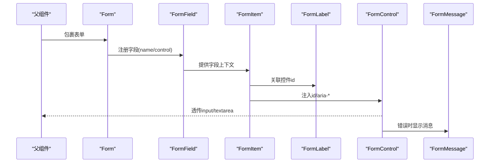
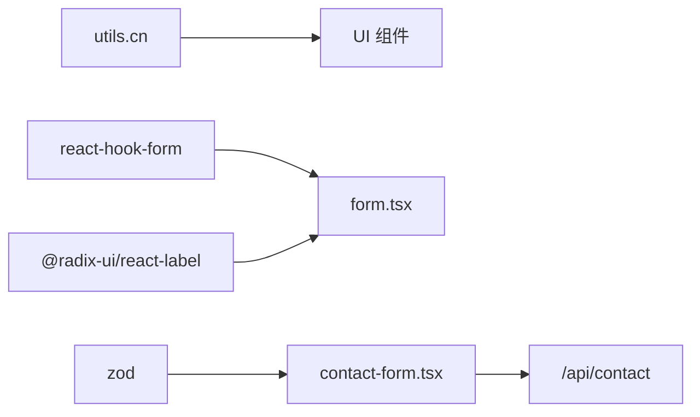

# 基础UI组件

<cite>
**本文引用的文件**
- [components/ui/button.tsx](file://components/ui/button.tsx)
- [components/ui/card.tsx](file://components/ui/card.tsx)
- [components/ui/input.tsx](file://components/ui/input.tsx)
- [components/ui/textarea.tsx](file://components/ui/textarea.tsx)
- [components/ui/label.tsx](file://components/ui/label.tsx)
- [components/ui/form.tsx](file://components/ui/form.tsx)
- [components/forms/contact-form.tsx](file://components/forms/contact-form.tsx)
- [lib/utils.ts](file://lib/utils.ts)
- [app/(root)/contact/page.tsx](file://app/(root)/contact/page.tsx)
</cite>

## 目录
1. [简介](#简介)
2. [项目结构](#项目结构)
3. [核心组件](#核心组件)
4. [架构总览](#架构总览)
5. [详细组件分析](#详细组件分析)
6. [依赖关系分析](#依赖关系分析)
7. [性能与可访问性](#性能与可访问性)
8. [故障排查指南](#故障排查指南)
9. [结论](#结论)
10. [附录：使用示例与最佳实践](#附录使用示例与最佳实践)

## 简介
本文件面向开发者，系统化梳理本项目中的基础UI组件（Button、Card、Input、Textarea、Label、Form）的设计原则、API接口、样式定制、事件处理与可访问性支持。文档同时覆盖表单验证集成、响应式布局与主题定制方法，并提供常见使用场景的参考路径，帮助快速上手并正确使用这些组件。

## 项目结构
- 基础组件位于 components/ui 目录下，采用“原子化”设计，通过 Tailwind CSS 与 class-variance-authority（CVA）实现变体与尺寸管理。
- 表单相关能力集中在 components/ui/form.tsx，基于 react-hook-form 与 @radix-ui/react-label 构建，提供 Form、FormField、FormItem、FormLabel、FormControl、FormDescription、FormMessage 等语义化组件。
- 工具函数 lib/utils.ts 提供 className 合并能力 cn(...)，用于安全地组合 Tailwind 类名。
- 实际页面与业务组件在 app 与 components 下引用上述基础组件，如 contact 页面与 ContactForm。

图表来源
- [components/ui/button.tsx:1-58](file://components/ui/button.tsx#L1-L58)
- [components/ui/card.tsx:1-87](file://components/ui/card.tsx#L1-L87)
- [components/ui/input.tsx:1-25](file://components/ui/input.tsx#L1-L25)
- [components/ui/textarea.tsx:1-24](file://components/ui/textarea.tsx#L1-L24)
- [components/ui/label.tsx:1-27](file://components/ui/label.tsx#L1-L27)
- [components/ui/form.tsx:1-178](file://components/ui/form.tsx#L1-L178)
- [components/forms/contact-form.tsx:1-140](file://components/forms/contact-form.tsx#L1-L140)
- [lib/utils.ts:1-29](file://lib/utils.ts#L1-L29)
- [app/(root)/contact/page.tsx:1-30](file://app/(root)/contact/page.tsx#L1-L30)

章节来源
- [components/ui/button.tsx:1-58](file://components/ui/button.tsx#L1-L58)
- [components/ui/card.tsx:1-87](file://components/ui/card.tsx#L1-L87)
- [components/ui/input.tsx:1-25](file://components/ui/input.tsx#L1-L25)
- [components/ui/textarea.tsx:1-24](file://components/ui/textarea.tsx#L1-L24)
- [components/ui/label.tsx:1-27](file://components/ui/label.tsx#L1-L27)
- [components/ui/form.tsx:1-178](file://components/ui/form.tsx#L1-L178)
- [lib/utils.ts:1-29](file://lib/utils.ts#L1-L29)
- [app/(root)/contact/page.tsx:1-30](file://app/(root)/contact/page.tsx#L1-L30)

## 核心组件
本节概述各组件的职责、属性、样式与事件能力。

- Button
  - 职责：通用按钮，支持多种视觉变体与尺寸，可通过 asChild 透传为其他元素。
  - 关键属性：variant（default、destructive、outline、secondary、ghost、link）、size（default、sm、lg、icon）、asChild、以及所有原生 button 属性（onClick、disabled、type 等）。
  - 样式：基于 CVA 定义，默认包含圆角、字号、聚焦环、禁用态等；可通过 className 叠加。
  - 事件：透传原生事件（如 onClick），支持 disabled 时禁止交互。
  - 可访问性：作为原生 button 或 Slot 渲染，保持键盘可操作与焦点可见。

- Card
  - 职责：卡片容器，提供 Header、Title、Description、Content、Footer 子组件以结构化内容。
  - 关键属性：每个子组件均接受标准 HTML 属性与 className。
  - 样式：边框、背景、阴影、间距等；可通过 className 自定义。
  - 事件：透传至对应 DOM 节点。
  - 可访问性：语义化标签（h3 用于标题），适合屏幕阅读器阅读。

- Input
  - 职责：文本输入框，封装常用样式与聚焦态。
  - 关键属性：type、placeholder、disabled、value/onChange（受控用法）等原生 input 属性。
  - 样式：边框、内边距、占位符颜色、禁用态、聚焦环等。
  - 事件：透传原生事件（如 onChange、onFocus、onBlur）。
  - 可访问性：支持 aria-* 与 label 关联（配合 FormLabel）。

- Textarea
  - 职责：多行文本输入，样式与 Input 保持一致。
  - 关键属性：同 Input，支持 rows、maxLength 等原生 textarea 属性。
  - 样式：最小高度、边框、占位符、禁用态、聚焦环。
  - 事件：透传原生事件。
  - 可访问性：与 Label 关联，错误信息通过 aria-describedby 关联。

- Label
  - 职责：可访问性友好的标签，基于 Radix Label 实现。
  - 关键属性：className、htmlFor 等。
  - 样式：字号、字重、禁用态透明度。
  - 事件：点击会聚焦到关联控件。
  - 可访问性：天然支持无障碍语义。

- Form（表单体系）
  - 职责：基于 react-hook-form 的表单容器与字段组织，提供校验、描述、错误消息等能力。
  - 关键组件：
    - Form：包裹整个表单，注入 form context。
    - FormField：绑定字段名与控制器，提供 field 上下文。
    - FormItem：字段容器，生成唯一 id。
    - FormLabel：与 FormControl 关联，错误时高亮。
    - FormControl：透传底层控件，自动设置 id、aria-describedby、aria-invalid。
    - FormDescription：辅助说明文本。
    - FormMessage：显示错误消息或自定义内容。
  - 事件：由 react-hook-form 管理提交与校验流程。
  - 可访问性：通过 id 与 aria-* 属性建立控件与说明/错误的关联。

章节来源
- [components/ui/button.tsx:1-58](file://components/ui/button.tsx#L1-L58)
- [components/ui/card.tsx:1-87](file://components/ui/card.tsx#L1-L87)
- [components/ui/input.tsx:1-25](file://components/ui/input.tsx#L1-L25)
- [components/ui/textarea.tsx:1-24](file://components/ui/textarea.tsx#L1-L24)
- [components/ui/label.tsx:1-27](file://components/ui/label.tsx#L1-L27)
- [components/ui/form.tsx:1-178](file://components/ui/form.tsx#L1-L178)

## 架构总览
下图展示表单从页面到 API 的完整调用链，体现基础组件如何协作完成数据收集、校验与提交。

图表来源
- [app/(root)/contact/page.tsx:13-28](file://app/(root)/contact/page.tsx#L13-L28)
- [components/forms/contact-form.tsx:32-75](file://components/forms/contact-form.tsx#L32-L75)
- [components/ui/form.tsx:16-178](file://components/ui/form.tsx#L16-L178)
- [components/ui/input.tsx:7-22](file://components/ui/input.tsx#L7-L22)
- [components/ui/textarea.tsx:7-21](file://components/ui/textarea.tsx#L7-L21)
- [components/ui/button.tsx:43-55](file://components/ui/button.tsx#L43-L55)

## 详细组件分析

### Button 组件
- 设计要点
  - 使用 CVA 管理变体与尺寸，保证一致的视觉层级与交互反馈。
  - 支持 asChild，便于与路由或第三方组件无缝集成。
- 属性与类型
  - variant：default、destructive、outline、secondary、ghost、link。
  - size：default、sm、lg、icon。
  - asChild：布尔值，决定是否使用 Slot 透传。
  - 其余继承自原生 button 的所有属性（如 type、disabled、onClick）。
- 样式定制
  - 通过 className 追加或覆盖样式；内部已包含聚焦环、禁用态等。
- 事件处理
  - 透传原生事件，例如 onClick、onKeyDown。
- 可访问性
  - 作为原生按钮或可聚焦元素，确保键盘可达与焦点可见。

图表来源
- [components/ui/button.tsx:7-41](file://components/ui/button.tsx#L7-L41)
- [components/ui/button.tsx:43-55](file://components/ui/button.tsx#L43-L55)

章节来源
- [components/ui/button.tsx:1-58](file://components/ui/button.tsx#L1-L58)

### Card 组件族
- 设计要点
  - 将卡片拆分为 Header、Title、Description、Content、Footer，便于灵活组合。
- 属性与类型
  - 每个子组件接受标准 HTML 属性与 className。
- 样式定制
  - 通过 className 调整布局、间距、颜色等。
- 可访问性
  - Title 使用 h3 语义，利于屏幕阅读器识别。

图表来源
- [components/ui/card.tsx:5-86](file://components/ui/card.tsx#L5-L86)

章节来源
- [components/ui/card.tsx:1-87](file://components/ui/card.tsx#L1-L87)

### Input 与 Textarea 组件
- 设计要点
  - 统一风格：边框、圆角、内边距、占位符、禁用态、聚焦环。
  - 完全透传原生属性，便于受控与非受控两种用法。
- 属性与类型
  - Input：继承 React.InputHTMLAttributes<HTMLInputElement>。
  - Textarea：继承 React.TextareaHTMLAttributes<HTMLTextAreaElement>。
- 样式定制
  - 通过 className 扩展；内部已处理 focus-visible 与禁用态。
- 可访问性
  - 与 Label 配合使用时，建议通过 FormLabel 与 FormControl 建立关联，确保无障碍体验。

图表来源
- [components/ui/input.tsx:7-22](file://components/ui/input.tsx#L7-L22)
- [components/ui/textarea.tsx:7-21](file://components/ui/textarea.tsx#L7-L21)

章节来源
- [components/ui/input.tsx:1-25](file://components/ui/input.tsx#L1-L25)
- [components/ui/textarea.tsx:1-24](file://components/ui/textarea.tsx#L1-L24)

### Label 组件
- 设计要点
  - 基于 Radix Label，提供可访问性友好的标签行为。
- 属性与类型
  - 继承 Radix Label 的属性，支持 className。
- 样式定制
  - 通过 className 控制字体大小、粗细、禁用态透明度等。
- 可访问性
  - 点击可聚焦到关联控件，提升键盘与屏幕阅读器体验。

章节来源
- [components/ui/label.tsx:1-27](file://components/ui/label.tsx#L1-L27)

### Form 表单体系
- 设计要点
  - 基于 react-hook-form 与 zod（在业务层）进行数据建模与校验。
  - 通过 Context 传递字段状态与 ID，使 FormLabel、FormControl、FormMessage 协同工作。
- 关键组件职责
  - Form：提供表单上下文。
  - FormField：绑定字段名与控制器，暴露 field 给子组件。
  - FormItem：生成唯一 id，组织字段空间。
  - FormLabel：根据错误状态改变样式，并通过 htmlFor 关联控件。
  - FormControl：注入 id、aria-describedby、aria-invalid，透传到底层控件。
  - FormDescription：辅助说明文本。
  - FormMessage：显示错误或自定义消息。
- 事件与校验
  - 使用 react-hook-form 的 useForm 与 Controller 管理字段值与校验。
  - 在业务层通过 zod 定义 schema，并在 onSubmit 中处理提交逻辑。
- 可访问性
  - 通过 id 与 aria-* 属性建立控件与说明/错误的关联，确保无障碍。

图表来源
- [components/ui/form.tsx:16-178](file://components/ui/form.tsx#L16-L178)

章节来源
- [components/ui/form.tsx:1-178](file://components/ui/form.tsx#L1-L178)

## 依赖关系分析
- 样式与类名合并
  - 所有组件通过 lib/utils.ts 的 cn(...) 合并 Tailwind 类名，避免冲突并支持动态类名。
- 表单库依赖
  - form.tsx 依赖 react-hook-form 与 @radix-ui/react-label，提供强大的表单管理与可访问性。
- 业务集成
  - contact-form.tsx 使用 zod 进行校验，结合 Form 组件完成端到端的数据流。
  - 页面通过 app/(root)/contact/page.tsx 引入表单组件，形成页面级入口。

图表来源
- [lib/utils.ts:1-29](file://lib/utils.ts#L1-L29)
- [components/ui/form.tsx:1-178](file://components/ui/form.tsx#L1-L178)
- [components/forms/contact-form.tsx:1-140](file://components/forms/contact-form.tsx#L1-L140)

章节来源
- [lib/utils.ts:1-29](file://lib/utils.ts#L1-L29)
- [components/ui/form.tsx:1-178](file://components/ui/form.tsx#L1-L178)
- [components/forms/contact-form.tsx:1-140](file://components/forms/contact-form.tsx#L1-L140)

## 性能与可访问性
- 性能
  - 组件均为轻量包装，无额外运行时开销；样式通过 Tailwind 编译期优化。
  - 表单校验在业务层集中处理，避免重复计算。
- 可访问性
  - 使用语义化标签与 ARIA 属性（如 aria-invalid、aria-describedby）。
  - 通过 Label 与 FormControl 的关联，确保键盘导航与屏幕阅读器友好。
  - 聚焦态与禁用态均有明确视觉反馈，符合 WCAG 建议。

[本节为通用指导，不直接分析具体文件]

## 故障排查指南
- 表单未正确联动
  - 检查是否使用 FormField 包裹字段，并确保 name 与 control 正确传入。
  - 确认 FormControl 被用于包裹 Input/Textarea，以便注入 id 与 aria-*。
- 错误消息不显示
  - 确认 FormMessage 置于 FormItem 内，且字段存在校验错误。
  - 检查 zod schema 是否正确配置，并在 onSubmit 前执行校验。
- 样式冲突或覆盖异常
  - 使用 cn(...) 合并类名，避免直接拼接字符串导致冲突。
  - 如需覆盖默认样式，优先通过 className 追加而非修改组件源码。
- 提交失败或无响应
  - 检查 API 路由是否存在并可访问，网络请求是否正确发送。
  - 捕获并处理异常，向用户提供反馈。

章节来源
- [components/ui/form.tsx:42-178](file://components/ui/form.tsx#L42-L178)
- [components/forms/contact-form.tsx:21-75](file://components/forms/contact-form.tsx#L21-L75)

## 结论
本项目的基础UI组件以“小而美”的原子化设计为核心，借助 Tailwind CSS 与 CVA 实现灵活的样式变体，结合 react-hook-form 与 Radix 提供健壮的表单能力与可访问性保障。通过统一的类名合并工具与清晰的组件职责划分，开发者可以快速搭建一致、可维护的用户界面。

[本节为总结性内容，不直接分析具体文件]

## 附录：使用示例与最佳实践
- 表单集成示例
  - 参考路径：[components/forms/contact-form.tsx:21-139](file://components/forms/contact-form.tsx#L21-L139)
  - 要点：使用 zod 定义校验规则，通过 FormProvider 与 FormField 绑定字段，提交后调用 API 并给出反馈。
- 按钮使用示例
  - 参考路径：[components/projects/project-card.tsx:35-40](file://components/projects/project-card.tsx#L35-L40)
  - 要点：通过 variant 与 className 控制外观，结合 Link 实现跳转。
- 卡片使用示例
  - 参考路径：[components/ui/card.tsx:5-86](file://components/ui/card.tsx#L5-L86)
  - 要点：组合 CardHeader/CardTitle/CardDescription/CardContent/CardFooter 构建信息块。
- 输入与文本域
  - 参考路径：[components/ui/input.tsx:7-22](file://components/ui/input.tsx#L7-L22)、[components/ui/textarea.tsx:7-21](file://components/ui/textarea.tsx#L7-L21)
  - 要点：在 Form 中使用 FormControl 包裹，确保无障碍与错误提示联动。
- 标签与可访问性
  - 参考路径：[components/ui/label.tsx:13-24](file://components/ui/label.tsx#L13-L24)
  - 要点：与 FormControl 配合，确保屏幕阅读器可读性与键盘可达。
- 页面集成
  - 参考路径：[app/(root)/contact/page.tsx:13-28](file://app/(root)/contact/page.tsx#L13-L28)
  - 要点：在页面中引入表单组件，并合理布局。

章节来源
- [components/forms/contact-form.tsx:21-139](file://components/forms/contact-form.tsx#L21-L139)
- [components/projects/project-card.tsx:35-40](file://components/projects/project-card.tsx#L35-L40)
- [components/ui/card.tsx:5-86](file://components/ui/card.tsx#L5-L86)
- [components/ui/input.tsx:7-22](file://components/ui/input.tsx#L7-L22)
- [components/ui/textarea.tsx:7-21](file://components/ui/textarea.tsx#L7-L21)
- [components/ui/label.tsx:13-24](file://components/ui/label.tsx#L13-L24)
- [app/(root)/contact/page.tsx:13-28](file://app/(root)/contact/page.tsx#L13-L28)