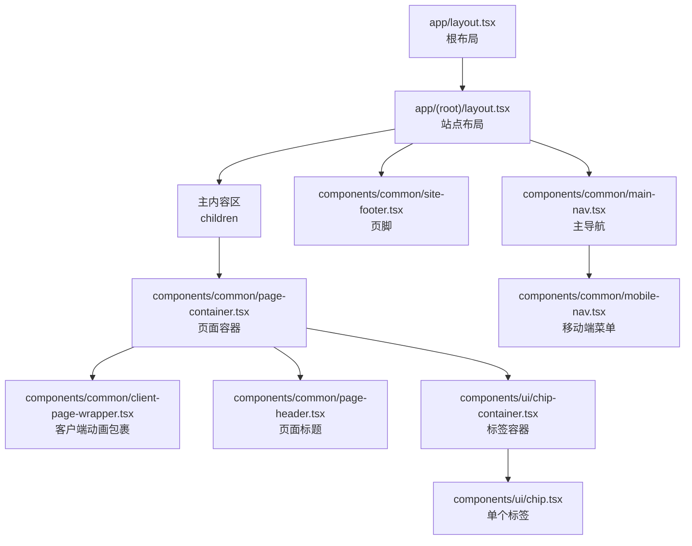
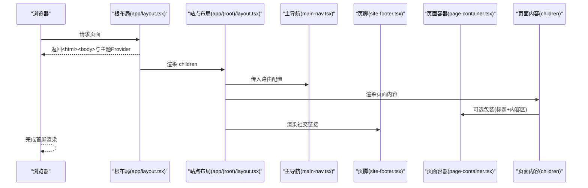
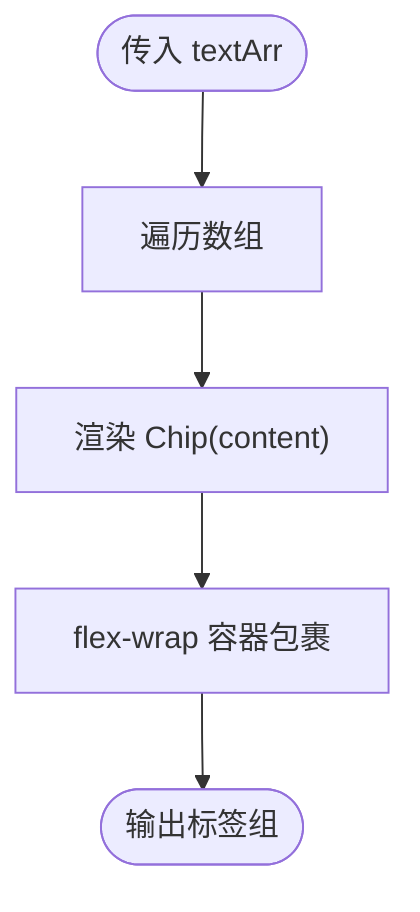
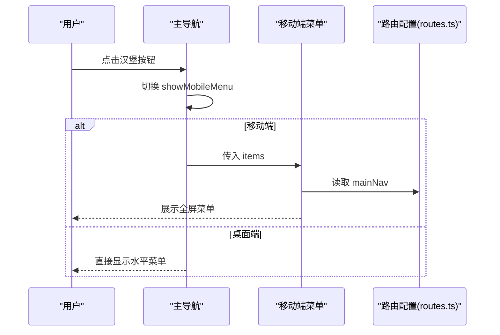
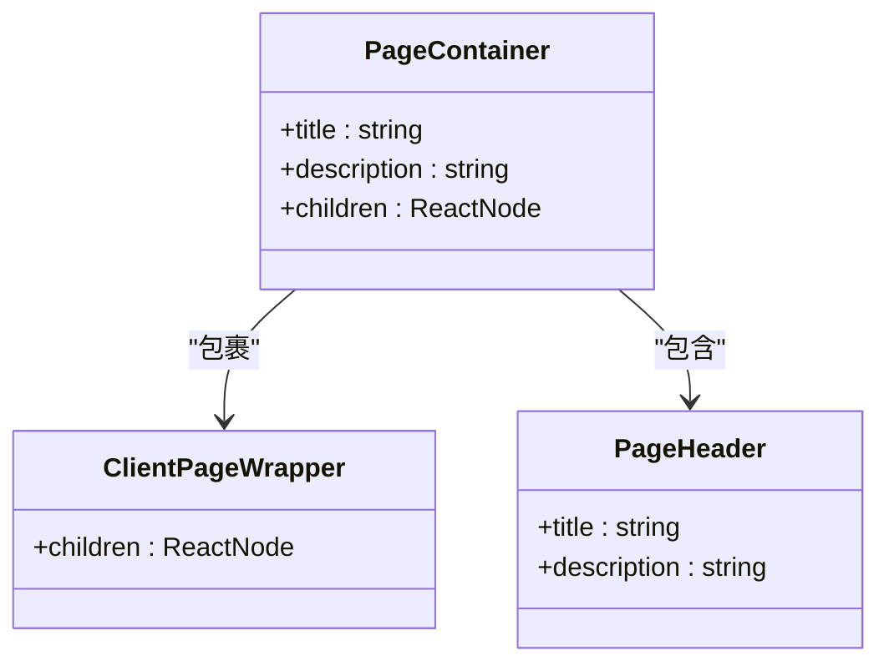
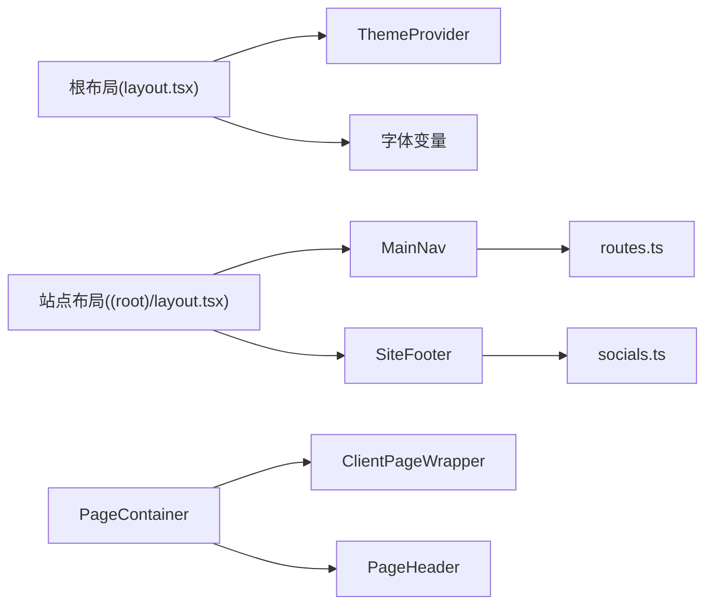

# 布局组件

<cite>
**本文引用的文件**
- [chip-container.tsx](file://components/ui/chip-container.tsx)
- [chip.tsx](file://components/ui/chip.tsx)
- [main-nav.tsx](file://components/common/main-nav.tsx)
- [mobile-nav.tsx](file://components/common/mobile-nav.tsx)
- [site-footer.tsx](file://components/common/site-footer.tsx)
- [page-container.tsx](file://components/common/page-container.tsx)
- [page-header.tsx](file://components/common/page-header.tsx)
- [client-page-wrapper.tsx](file://components/common/client-page-wrapper.tsx)
- [routes.ts](file://config/routes.ts)
- [site.ts](file://config/site.ts)
- [layout.tsx](file://app/(root)/layout.tsx)
- [layout.tsx](file://app/layout.tsx)
</cite>

## 目录
1. [简介](#简介)
2. [项目结构](#项目结构)
3. [核心组件](#核心组件)
4. [架构总览](#架构总览)
5. [详细组件分析](#详细组件分析)
6. [依赖关系分析](#依赖关系分析)
7. [性能考量](#性能考量)
8. [故障排查指南](#故障排查指南)
9. [结论](#结论)
10. [附录：最佳实践与常见布局模式](#附录最佳实践与常见布局模式)

## 简介
本文件聚焦于项目的布局相关组件，包括 ChipContainer、Chip、MainNav、SiteFooter、PageContainer 等，系统阐述其设计理念、实现方式、响应式行为、内容组织与页面结构搭建方法。同时覆盖组件的可定制性、主题支持与性能优化策略，并提供页面布局的最佳实践与常见布局模式的实现示例，帮助读者快速掌握并复用这些能力。

## 项目结构
该 Next.js 应用采用 App Router 的布局分层：
- 根布局 app/layout.tsx 负责全局主题、元信息、第三方脚本与 Provider 注入。
- 营销/站点级布局 app/(root)/layout.tsx 组合 MainNav、SiteFooter 与主内容区，形成“页头-主体-页脚”的经典三段式结构。
- 通用页面容器 components/common/page-container.tsx 封装了 ClientPageWrapper 与 PageHeader，用于统一页面标题与内容区域样式。
- UI 层 components/ui/chip.tsx 与 chip-container.tsx 提供标签类展示能力。
- 导航组件 components/common/main-nav.tsx 与 mobile-nav.tsx 提供桌面与移动端导航。
- 配置 config/routes.ts 与 config/site.ts 集中管理路由项与站点信息。

图表来源
- [layout.tsx:87-131](file://app/layout.tsx#L87-L131)
- [layout.tsx:11-33](file://app/(root)/layout.tsx#L11-L33)
- [main-nav.tsx:34-99](file://components/common/main-nav.tsx#L34-L99)
- [mobile-nav.tsx:15-49](file://components/common/mobile-nav.tsx#L15-L49)
- [site-footer.tsx:9-34](file://components/common/site-footer.tsx#L9-L34)
- [page-container.tsx:11-27](file://components/common/page-container.tsx#L11-L27)
- [client-page-wrapper.tsx:25-37](file://components/common/client-page-wrapper.tsx#L25-L37)
- [page-header.tsx:6-21](file://components/common/page-header.tsx#L6-L21)
- [chip-container.tsx:7-16](file://components/ui/chip-container.tsx#L7-L16)
- [chip.tsx:5-12](file://components/ui/chip.tsx#L5-L12)

章节来源
- [layout.tsx:87-131](file://app/layout.tsx#L87-L131)
- [layout.tsx:11-33](file://app/(root)/layout.tsx#L11-L33)

## 核心组件
- ChipContainer：接收字符串数组，渲染为可换行的标签集合，适合技能、标签、分类等场景。
- Chip：基础标签单元，使用语义化内联块与主题色变量，支持紧凑排版与高可读性。
- MainNav：响应式导航，桌面端水平排列，移动端通过按钮切换全屏菜单；支持当前段高亮与禁用态。
- SiteFooter：居中社交链接列表，配合 Tooltip 提升可访问性与交互体验。
- PageContainer：统一页面头部与内容区域的容器，结合 ClientPageWrapper 提供入场动画与滚动约束。

章节来源
- [chip-container.tsx:7-16](file://components/ui/chip-container.tsx#L7-L16)
- [chip.tsx:5-12](file://components/ui/chip.tsx#L5-L12)
- [main-nav.tsx:34-99](file://components/common/main-nav.tsx#L34-L99)
- [site-footer.tsx:9-34](file://components/common/site-footer.tsx#L9-L34)
- [page-container.tsx:11-27](file://components/common/page-container.tsx#L11-L27)

## 架构总览
站点级布局将导航、内容与页脚组合为稳定的三段式结构，并通过 ThemeProvider 提供多主题支持。页面级容器进一步封装标题与内容区，保证一致的视觉节奏与可访问性。

图表来源
- [layout.tsx:87-131](file://app/layout.tsx#L87-L131)
- [layout.tsx:11-33](file://app/(root)/layout.tsx#L11-L33)
- [main-nav.tsx:34-99](file://components/common/main-nav.tsx#L34-L99)
- [site-footer.tsx:9-34](file://components/common/site-footer.tsx#L9-L34)
- [page-container.tsx:11-27](file://components/common/page-container.tsx#L11-L27)

## 详细组件分析

### ChipContainer 与 Chip
- 设计目标：以最小成本渲染一组可换行、易读、可主题的标签。
- 数据流：外部传入字符串数组 -> 循环渲染多个 Chip。
- 响应式：使用弹性布局与换行，适配不同屏幕宽度。
- 可定制性：可通过 CSS 变量（如 primary、border、background）与 Tailwind 工具类调整外观。
- 性能：纯函数组件，无状态，渲染开销极低。

图表来源
- [chip-container.tsx:7-16](file://components/ui/chip-container.tsx#L7-L16)
- [chip.tsx:5-12](file://components/ui/chip.tsx#L5-L12)

章节来源
- [chip-container.tsx:7-16](file://components/ui/chip-container.tsx#L7-L16)
- [chip.tsx:5-12](file://components/ui/chip.tsx#L5-L12)

### MainNav 与 MobileNav
- 设计目标：统一的桌面与移动端导航体验，支持当前段高亮、禁用态与动画。
- 响应式：桌面端显示水平导航；移动端显示汉堡按钮，点击后展开全屏菜单。
- 状态管理：使用本地状态控制菜单显隐，并在路由变化时自动关闭菜单。
- 可访问性：使用语义化 <nav> 与 Link，禁用态提供不可交互提示。
- 集成点：从 routes.ts 读取 mainNav 配置，支持扩展更多菜单项。

图表来源
- [main-nav.tsx:34-99](file://components/common/main-nav.tsx#L34-L99)
- [mobile-nav.tsx:15-49](file://components/common/mobile-nav.tsx#L15-L49)
- [routes.ts:11-39](file://config/routes.ts#L11-L39)

章节来源
- [main-nav.tsx:34-99](file://components/common/main-nav.tsx#L34-L99)
- [mobile-nav.tsx:15-49](file://components/common/mobile-nav.tsx#L15-L49)
- [routes.ts:11-39](file://config/routes.ts#L11-L39)

### SiteFooter
- 设计目标：居中展示社交链接，提供 Tooltip 提示用户名。
- 可定制性：接受 className，便于在不同布局中复用；图标与文案来自 socials 配置。
- 可访问性：每个链接使用 Tooltip 提供额外上下文，提升无障碍体验。
- 响应式：在容器内居中排列，适配不同屏幕尺寸。

章节来源
- [site-footer.tsx:9-34](file://components/common/site-footer.tsx#L9-L34)

### PageContainer、PageHeader 与 ClientPageWrapper
- PageContainer：组合 ClientPageWrapper 与 PageHeader，统一页面标题与内容区边距、最大宽度与溢出处理。
- PageHeader：展示页面标题与描述，使用响应式布局确保在大屏与小屏下均有良好阅读体验。
- ClientPageWrapper：客户端动画包裹器，提供淡入与上移的入场效果，增强页面过渡体验。
- 适用场景：适用于大多数内容型页面，减少重复布局代码。

图表来源
- [page-container.tsx:11-27](file://components/common/page-container.tsx#L11-L27)
- [page-header.tsx:6-21](file://components/common/page-header.tsx#L6-L21)
- [client-page-wrapper.tsx:25-37](file://components/common/client-page-wrapper.tsx#L25-L37)

章节来源
- [page-container.tsx:11-27](file://components/common/page-container.tsx#L11-L27)
- [page-header.tsx:6-21](file://components/common/page-header.tsx#L6-L21)
- [client-page-wrapper.tsx:25-37](file://components/common/client-page-wrapper.tsx#L25-L37)

## 依赖关系分析
- 主题与字体：根布局通过 ThemeProvider 启用多主题，并注入字体变量，所有布局组件均可受益于主题切换。
- 路由与站点配置：MainNav 依赖 routes.ts 中的 mainNav 配置；SiteFooter 依赖 socials 配置；站点名称等信息来自 site.ts。
- 工具函数：多处使用 cn 工具类合并样式，提升可维护性。

图表来源
- [layout.tsx:87-131](file://app/layout.tsx#L87-L131)
- [layout.tsx:11-33](file://app/(root)/layout.tsx#L11-L33)
- [main-nav.tsx:34-99](file://components/common/main-nav.tsx#L34-L99)
- [site-footer.tsx:9-34](file://components/common/site-footer.tsx#L9-L34)
- [page-container.tsx:11-27](file://components/common/page-container.tsx#L11-L27)
- [routes.ts:11-39](file://config/routes.ts#L11-L39)
- [site.ts:1-39](file://config/site.ts#L1-L39)

章节来源
- [layout.tsx:87-131](file://app/layout.tsx#L87-L131)
- [layout.tsx:11-33](file://app/(root)/layout.tsx#L11-L33)
- [routes.ts:11-39](file://config/routes.ts#L11-L39)
- [site.ts:1-39](file://config/site.ts#L1-L39)

## 性能考量
- 轻量组件：Chip、ChipContainer 为无状态函数组件，渲染成本低。
- 客户端动画：ClientPageWrapper 与 MainNav 使用 motion 库进行动画，建议在长列表或复杂页面中谨慎使用，避免过度重绘。
- 条件渲染：MainNav 根据断点切换菜单，减少不必要的 DOM 节点。
- 主题切换：ThemeProvider 基于 class 切换主题，避免整棵子树重建，性能友好。
- 建议：
  - 对大量动态内容（如博客列表）考虑分页或虚拟滚动。
  - 图片资源使用 Next/Image 并设置合适的 sizes/priority。
  - 第三方脚本（如统计、聊天窗口）使用 afterInteractive 策略延迟加载。

## 故障排查指南
- 导航未高亮：检查 useSelectedLayoutSegment 与 href 是否匹配当前段；确认 routes.ts 中的 href 与路由一致。
- 移动端菜单不显示：确认 MainNav 的 showMobileMenu 状态与 MobileNav 的条件渲染逻辑；检查断点样式是否被覆盖。
- 主题无效：确认根布局已包裹 ThemeProvider 且 attribute="class"；检查 CSS 变量与 Tailwind 配置是否正确。
- 页面标题错位：检查 PageContainer 与 PageHeader 的间距与最大宽度设置；确认外层容器未限制宽度导致溢出。
- 动画卡顿：减少 motion 动画数量与复杂度；必要时拆分组件或使用 requestAnimationFrame 优化。

章节来源
- [main-nav.tsx:34-99](file://components/common/main-nav.tsx#L34-L99)
- [mobile-nav.tsx:15-49](file://components/common/mobile-nav.tsx#L15-L49)
- [layout.tsx:87-131](file://app/layout.tsx#L87-L131)
- [page-container.tsx:11-27](file://components/common/page-container.tsx#L11-L27)

## 结论
本项目通过清晰的布局分层与可复用的组件，实现了响应式、可主题化、易维护的页面结构。ChipContainer/Chip 提供灵活的标签展示；MainNav/MobileNav 保障跨设备导航一致性；SiteFooter 简化社交链接呈现；PageContainer/PageHeader/ClientPageWrapper 统一页面结构与动效。遵循本文的最佳实践与性能建议，可在现有基础上快速扩展新的页面与功能。

## 附录：最佳实践与常见布局模式
- 三段式布局：页头(MainNav)+主体(children)+页脚(SiteFooter)，适用于大多数站点页面。
- 页面容器模式：使用 PageContainer 包裹页面内容，统一标题与边距，减少重复样式。
- 标签云模式：使用 ChipContainer 渲染技能、标签、分类等，支持换行与主题色。
- 响应式导航：桌面端水平菜单，移动端全屏菜单，注意状态同步与可访问性。
- 主题支持：通过 ThemeProvider 与 CSS 变量实现一键切换，避免硬编码颜色。
- 性能优化：合理使用动画、懒加载图片、分割大组件、避免不必要的重渲染。

[本节为概念性指导，不直接分析具体文件]