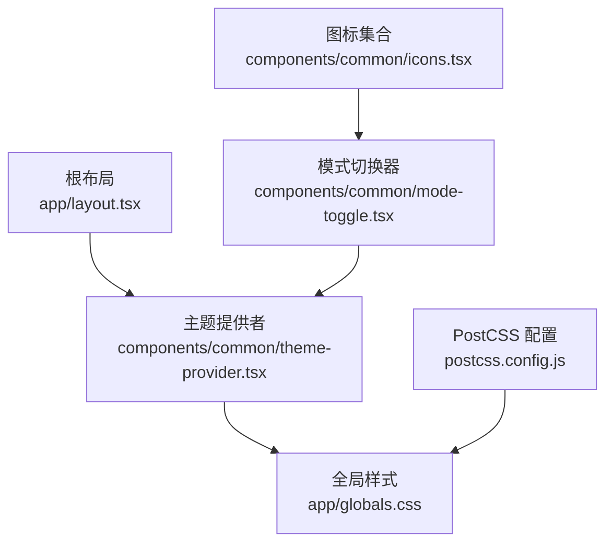
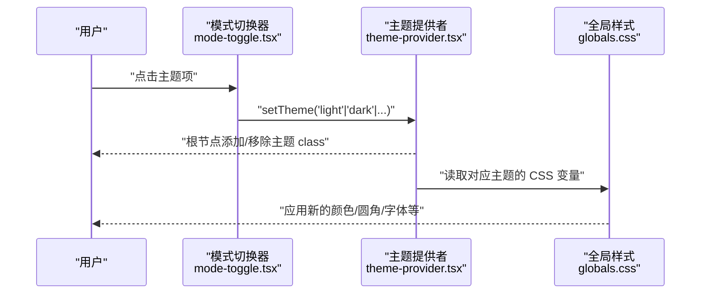
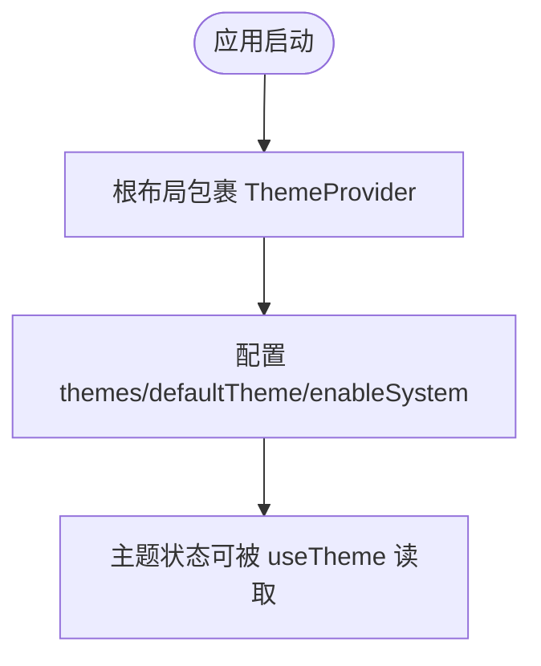
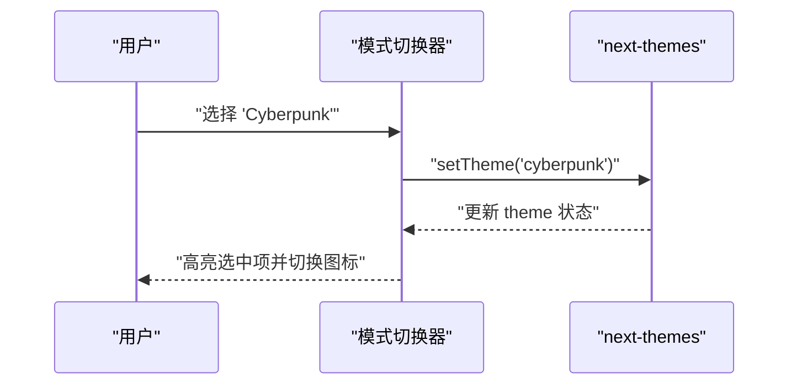
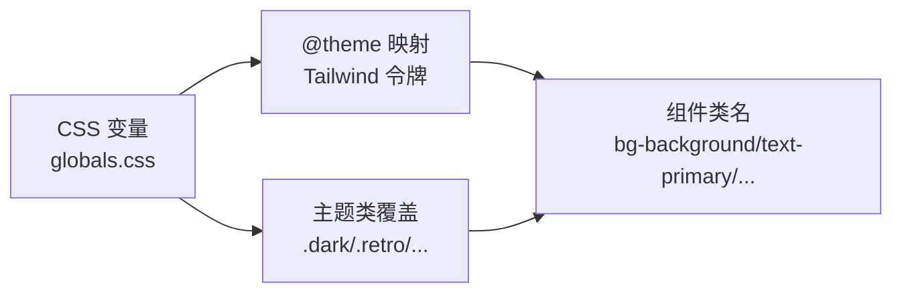
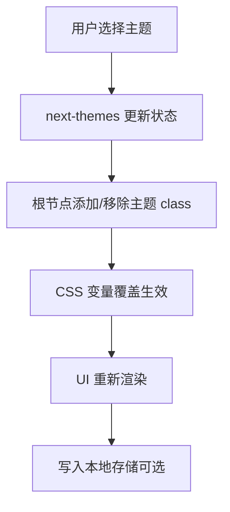
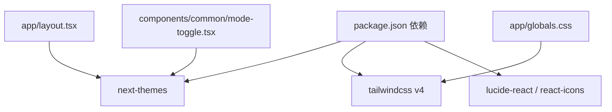

# 主题系统

<cite>
**本文档引用的文件**
- [app/layout.tsx](file://app/layout.tsx)
- [components/common/theme-provider.tsx](file://components/common/theme-provider.tsx)
- [components/common/mode-toggle.tsx](file://components/common/mode-toggle.tsx)
- [components/common/icons.tsx](file://components/common/icons.tsx)
- [app/globals.css](file://app/globals.css)
- [postcss.config.js](file://postcss.config.js)
- [package.json](file://package.json)
</cite>

## 目录
1. [简介](#简介)
2. [项目结构](#项目结构)
3. [核心组件](#核心组件)
4. [架构总览](#架构总览)
5. [详细组件分析](#详细组件分析)
6. [依赖关系分析](#依赖关系分析)
7. [性能考虑](#性能考虑)
8. [故障排查指南](#故障排查指南)
9. [结论](#结论)
10. [附录](#附录)

## 简介
本主题为 Next.js 投资组合提供 7 种预设主题：深色、浅色、复古、赛博朋克、极光、合成波、纸张。主题通过 CSS 变量与 Tailwind CSS 的 @theme 机制结合 next-themes 的状态管理实现，支持在运行时切换并持久化到本地存储。所有颜色、圆角、字体等设计令牌均以 CSS 变量形式集中定义，便于统一扩展与维护。

## 项目结构
主题系统的关键位置如下：
- 根布局注入主题提供者，声明可用主题列表与默认行为
- 全局样式中定义 CSS 变量与主题类（dark/retro/cyberpunk/aurora/synthwave/paper）
- 模式切换器调用 next-themes 的 setTheme 切换主题
- 图标组件为各主题提供对应视觉标识
- PostCSS 使用 Tailwind v4 插件，配合 @import "tailwindcss" 启用新配置方式

**图示来源**
- [app/layout.tsx:87-117](file://app/layout.tsx#L87-L117)
- [components/common/theme-provider.tsx:1-10](file://components/common/theme-provider.tsx#L1-L10)
- [components/common/mode-toggle.tsx:15-69](file://components/common/mode-toggle.tsx#L15-L69)
- [components/common/icons.tsx:90-217](file://components/common/icons.tsx#L90-L217)
- [app/globals.css:28-335](file://app/globals.css#L28-L335)
- [postcss.config.js:1-5](file://postcss.config.js#L1-L5)

**章节来源**
- [app/layout.tsx:87-117](file://app/layout.tsx#L87-L117)
- [postcss.config.js:1-5](file://postcss.config.js#L1-L5)

## 核心组件
- 主题提供者：封装 next-themes 的 ThemeProvider，设置 attribute="class"、默认主题与允许的主题列表，使主题以 class 形式挂载到根节点。
- 模式切换器：下拉菜单提供 Light/Dark/Retro/Cyberpunk/Paper/Aurora/Synthwave/System 选项，点击后调用 setTheme 切换。
- 全局样式：在 :root 与 .dark/.retro/.cyberpunk/.aurora/.synthwave/.paper 下定义统一的 CSS 变量；@theme inline 将 CSS 变量映射到 Tailwind 的设计令牌（如 --color-background）。
- 图标：为每个主题提供专属图标，用于切换按钮的视觉反馈。

**章节来源**
- [components/common/theme-provider.tsx:1-10](file://components/common/theme-provider.tsx#L1-L10)
- [components/common/mode-toggle.tsx:15-69](file://components/common/mode-toggle.tsx#L15-L69)
- [app/globals.css:28-335](file://app/globals.css#L28-L335)
- [components/common/icons.tsx:90-217](file://components/common/icons.tsx#L90-L217)

## 架构总览
主题切换流程：用户在下拉菜单中选择主题 → next-themes 更新状态 → 在根元素上添加/移除对应 class → CSS 变量覆盖生效 → UI 即时刷新。

**图示来源**
- [components/common/mode-toggle.tsx:15-69](file://components/common/mode-toggle.tsx#L15-L69)
- [components/common/theme-provider.tsx:1-10](file://components/common/theme-provider.tsx#L1-L10)
- [app/globals.css:28-335](file://app/globals.css#L28-L335)

## 详细组件分析

### 主题提供者（ThemeProvider）
- 职责：包装 next-themes 的 ThemeProvider，暴露给根布局使用。
- 关键配置：attribute="class" 表示通过 class 切换主题；themes 数组声明允许的主题名；defaultTheme 与 enableSystem 控制默认与系统主题跟随。
- 与布局集成：根布局在 body 内包裹 ThemeProvider，确保全应用生效。

**图示来源**
- [components/common/theme-provider.tsx:1-10](file://components/common/theme-provider.tsx#L1-L10)
- [app/layout.tsx:87-117](file://app/layout.tsx#L87-L117)

**章节来源**
- [components/common/theme-provider.tsx:1-10](file://components/common/theme-provider.tsx#L1-L10)
- [app/layout.tsx:87-117](file://app/layout.tsx#L87-L117)

### 模式切换器（ModeToggle）
- 交互：下拉菜单列出所有主题，点击后调用 setTheme 切换。
- 视觉：根据当前主题显示对应图标，利用 Tailwind 条件类（如 dark:、retro: 等）控制图标显隐与缩放。
- 图标来源：icons.tsx 导出 retro/cyberpunk/paper/aurora/synthwave 等图标。

**图示来源**
- [components/common/mode-toggle.tsx:15-69](file://components/common/mode-toggle.tsx#L15-L69)
- [components/common/icons.tsx:212-216](file://components/common/icons.tsx#L212-L216)

**章节来源**
- [components/common/mode-toggle.tsx:15-69](file://components/common/mode-toggle.tsx#L15-L69)
- [components/common/icons.tsx:90-217](file://components/common/icons.tsx#L90-L217)

### 全局样式与 CSS 变量系统
- 变量体系：在 :root 定义浅色基色，在 .dark/.retro/.cyberpunk/.aurora/.synthwave/.paper 下分别覆盖同一组变量（background、foreground、primary、secondary、accent、muted、border、input、card、popover、destructive、ring、radius 等）。
- Tailwind 映射：@theme inline 将 CSS 变量映射到 Tailwind 的设计令牌（--color-*），从而可在任意组件中使用 bg-background、text-primary 等语义化类名。
- 自定义变体：@custom-variant dark 使得 dark 类作用于其子元素，便于局部暗色场景。
- 动画与字体：定义了统一的过渡时长与缓动函数变量（--d、--e），以及字体变量（--font-sans、--font-heading）。

**图示来源**
- [app/globals.css:28-335](file://app/globals.css#L28-L335)

**章节来源**
- [app/globals.css:28-335](file://app/globals.css#L28-L335)

### 预设主题说明
- 深色（dark）：低明度背景、高对比前景，强调主色与辅助色的可读性。
- 浅色（light）：明亮背景、深前景，适合日间阅读。
- 复古（retro）：暖色调背景与边框，低饱和强调色，营造怀旧感。
- 赛博朋克（cyberpunk）：深蓝底+霓虹强调色（粉/青/黄），科技感强。
- 极光（aurora）：冷绿/紫渐变氛围，强调色鲜明，适合创意展示。
- 合成波（synthwave）：深紫底+品红/青色强调，复古未来风格。
- 纸张（paper）：米白底+暖棕文字，模拟纸质阅读体验。

**章节来源**
- [app/globals.css:126-335](file://app/globals.css#L126-L335)

### 主题状态管理与切换机制
- 状态源：next-themes 维护当前主题状态，并通过 attribute="class" 将主题名作为 class 添加到根节点。
- 切换入口：ModeToggle 中的 setTheme 调用，支持 light/dark/retro/cyberpunk/paper/aurora/synthwave/system。
- 持久化：next-themes 默认将主题写入 localStorage，页面重载后恢复上次选择。
- 系统跟随：enableSystem 开启后，若未手动设置则跟随系统偏好。

**图示来源**
- [components/common/mode-toggle.tsx:15-69](file://components/common/mode-toggle.tsx#L15-L69)
- [components/common/theme-provider.tsx:1-10](file://components/common/theme-provider.tsx#L1-L10)
- [app/layout.tsx:87-117](file://app/layout.tsx#L87-L117)

**章节来源**
- [components/common/mode-toggle.tsx:15-69](file://components/common/mode-toggle.tsx#L15-L69)
- [components/common/theme-provider.tsx:1-10](file://components/common/theme-provider.tsx#L1-L10)
- [app/layout.tsx:87-117](file://app/layout.tsx#L87-L117)

## 依赖关系分析
- 运行时依赖：next-themes 提供主题状态与持久化；lucide-react/react-icons 提供图标。
- 构建时依赖：Tailwind v4 通过 @tailwindcss/postcss 插件引入，无需传统 tailwind.config.js，样式通过 @import "tailwindcss" 与 @theme 配置。
- 根布局负责装配 ThemeProvider 并声明 themes 列表，确保切换器可用。

**图示来源**
- [package.json:13-49](file://package.json#L13-L49)
- [app/layout.tsx:87-117](file://app/layout.tsx#L87-L117)
- [components/common/mode-toggle.tsx:15-69](file://components/common/mode-toggle.tsx#L15-L69)
- [app/globals.css:1-2](file://app/globals.css#L1-L2)

**章节来源**
- [package.json:13-49](file://package.json#L13-L49)
- [postcss.config.js:1-5](file://postcss.config.js#L1-L5)

## 性能考虑
- 避免重绘抖动：主题切换仅改变 CSS 变量值，浏览器可高效增量更新，建议保持变量命名一致，减少额外样式计算。
- 最小化 JS 体积：图标按需引入（lucide-react 已按树摇优化），避免一次性导入全部图标。
- 样式组织：将主题变量集中在 globals.css，避免分散定义导致重复计算。
- 动画与过渡：统一使用 --d、--e 变量控制时长与缓动，便于全局调优。
- 首屏体验：next-themes 的 attribute="class" 模式在客户端生效，建议在布局层尽早包裹，减少闪烁。

[本节为通用指导，不直接分析具体文件]

## 故障排查指南
- 主题不生效
  - 检查根布局是否正确包裹 ThemeProvider，并传入 themes 列表。
  - 确认全局样式中是否包含对应主题类的 CSS 变量块。
  - 验证 ModeToggle 是否调用 setTheme 且参数与 themes 一致。
- 切换后样式错乱
  - 检查组件是否使用了语义化类名（如 bg-background/text-primary），而非硬编码颜色。
  - 确认 Tailwind 已通过 @import "tailwindcss" 正确引入，且 @theme 映射存在。
- 图标显示异常
  - 确认 icons.tsx 中已导出对应主题图标并在 ModeToggle 中引用。
- 系统主题跟随无效
  - 确认 enableSystem 已开启，且未强制覆盖 defaultTheme。

**章节来源**
- [app/layout.tsx:87-117](file://app/layout.tsx#L87-L117)
- [components/common/mode-toggle.tsx:15-69](file://components/common/mode-toggle.tsx#L15-L69)
- [app/globals.css:28-335](file://app/globals.css#L28-L335)
- [components/common/icons.tsx:212-216](file://components/common/icons.tsx#L212-L216)

## 结论
该主题系统基于 CSS 变量 + Tailwind v4 的 @theme 映射 + next-themes 的状态管理，实现了轻量、可扩展、易维护的多主题方案。通过集中化的变量定义与清晰的切换入口，开发者可以快速新增或定制主题，同时保证一致的视觉语言与良好的性能表现。

[本节为总结性内容，不直接分析具体文件]

## 附录

### 自定义主题开发指南
- 步骤
  1) 在全局样式中添加一个新的主题类（例如 .mytheme），覆盖一组完整的 CSS 变量（background、foreground、primary、secondary、accent、muted、border、input、card、popover、destructive、ring、radius 等）。
  2) 在根布局的 ThemeProvider 的 themes 数组中加入新主题名。
  3) 在 ModeToggle 中添加对应的菜单项与图标，调用 setTheme("mytheme")。
  4) 如需为新主题提供专属图标，请在 icons.tsx 中导出并复用。
- 最佳实践
  - 保持变量键名一致，便于 Tailwind 令牌映射稳定。
  - 使用 HSL 色彩空间，便于调整色相/饱和度/亮度。
  - 遵循对比度与可访问性原则，确保文本与背景对比足够。
  - 统一使用 --d、--e 控制动画时长与缓动，保持交互一致性。

**章节来源**
- [app/globals.css:28-335](file://app/globals.css#L28-L335)
- [app/layout.tsx:87-117](file://app/layout.tsx#L87-L117)
- [components/common/mode-toggle.tsx:15-69](file://components/common/mode-toggle.tsx#L15-L69)
- [components/common/icons.tsx:212-216](file://components/common/icons.tsx#L212-L216)

### 颜色方案配置与主题扩展方法
- 颜色方案
  - 使用 HSL 三元组定义颜色，便于主题间平滑过渡。
  - 通过 --color-* 映射到 Tailwind 令牌，组件侧直接使用语义化类名。
- 扩展方法
  - 新增主题类：在 globals.css 中追加 .yourtheme 块。
  - 注册主题：在 layout.tsx 的 themes 数组中添加名称。
  - 提供图标：在 icons.tsx 中导出对应图标并在 mode-toggle 中引用。
  - 统一动画：通过 --d、--e 变量控制全局动画节奏。

**章节来源**
- [app/globals.css:28-335](file://app/globals.css#L28-L335)
- [app/layout.tsx:87-117](file://app/layout.tsx#L87-L117)
- [components/common/icons.tsx:212-216](file://components/common/icons.tsx#L212-L216)
- [components/common/mode-toggle.tsx:15-69](file://components/common/mode-toggle.tsx#L15-L69)