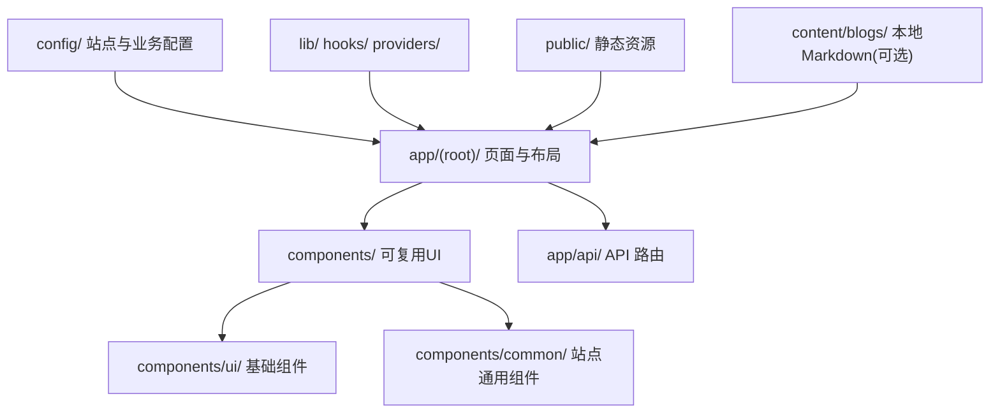
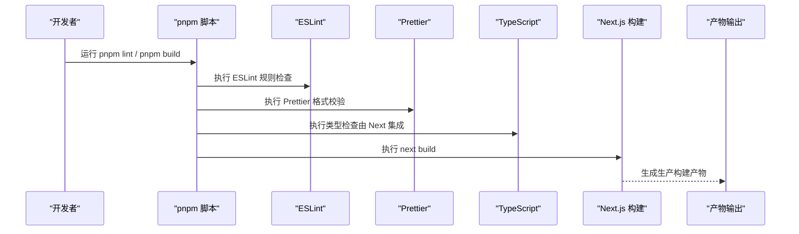
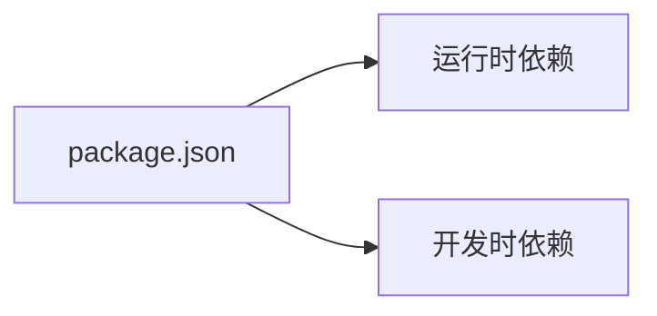

# 开发指南

<cite>
**本文引用的文件**
- [package.json](file://package.json)
- [tsconfig.json](file://tsconfig.json)
- [eslint.config.mjs](file://eslint.config.mjs)
- [.prettierrc](file://.prettierrc)
- [next.config.js](file://next.config.js)
- [postcss.config.js](file://postcss.config.js)
- [components.json](file://components.json)
- [README.md](file://README.md)
- [AGENTS.md](file://AGENTS.md)
- [.gitignore](file://.gitignore)
- [lib/utils.ts](file://lib/utils.ts)
</cite>

## 目录
1. [简介](#简介)
2. [项目结构](#项目结构)
3. [核心组件](#核心组件)
4. [架构总览](#架构总览)
5. [详细组件分析](#详细组件分析)
6. [依赖分析](#依赖分析)
7. [性能考虑](#性能考虑)
8. [故障排查指南](#故障排查指南)
9. [结论](#结论)
10. [附录](#附录)

## 简介
本指南面向使用 Next.js 构建的个人作品集项目的开发者，覆盖开发环境搭建、代码规范与工具链（ESLint、Prettier）、TypeScript 配置、调试技巧与日常开发工作流，以及 Git 协作流程、代码审查标准与贡献指南。同时提供常用开发工具与插件建议，帮助提升编码效率与质量。

## 项目结构
本项目采用 Next.js App Router 组织页面与路由：
- 页面与布局位于 app/ 下，公开路由分组在 app/(root)/，动态段以文件夹形式表示，API 路由位于 app/api/。
- 可复用 UI 集中在 components/，基础原子组件在 components/ui/，站点通用组件在 components/common/，功能型组件按模块划分（如 projects/、blogs/）。
- 类型化数据与站点配置集中在 config/，公共逻辑放在 lib/、hooks/、providers/。
- 静态资源放置于 public/，字体文件位于 assets/fonts/。
- 博客内容通过 Notion API 加载，构建时或按需获取。

图表来源
- [README.md:5-21](file://README.md#L5-L21)
- [AGENTS.md:3-12](file://AGENTS.md#L3-L12)

章节来源
- [README.md:5-21](file://README.md#L5-L21)
- [AGENTS.md:3-12](file://AGENTS.md#L3-L12)

## 核心组件
本节聚焦开发环境与工程化配置，确保团队一致性与高效协作。

- 包管理与脚本
  - 使用 pnpm 作为包管理器，锁定版本以保证一致性。
  - 常用脚本：开发 dev、构建 build、启动 start、代码检查 lint、博客 Markdown 测试脚本等。

- TypeScript 配置
  - 严格模式开启，目标 ES2017，启用 JSX React 自动注入，模块解析为 bundler 模式，支持 JSON 模块与增量编译。
  - 路径别名 @/* 指向仓库根，便于统一导入风格。

- ESLint 规则
  - 集成 Next.js、React 与 React Hooks 推荐规则集，关闭不需要的 prop-types 与旧版 scope 规则。
  - 忽略 .next 与 node_modules。

- Prettier 格式化
  - 双空格缩进、80 列行宽、双引号、ES5 尾逗号，自动整理 import 顺序。

- PostCSS 与 Tailwind
  - 使用 @tailwindcss/postcss 处理样式；shadcn/ui 通过 components.json 配置别名与 CSS 变量。

- Next.js 配置
  - 当前为空对象，可按需扩展（如环境变量、路径重写等）。

章节来源
- [package.json:6-11](file://package.json#L6-L11)
- [tsconfig.json:1-35](file://tsconfig.json#L1-L35)
- [eslint.config.mjs:1-24](file://eslint.config.mjs#L1-L24)
- [.prettierrc:1-9](file://.prettierrc#L1-L9)
- [postcss.config.js:1-6](file://postcss.config.js#L1-L6)
- [components.json:1-17](file://components.json#L1-L17)
- [next.config.js:1-5](file://next.config.js#L1-L5)

## 架构总览
下图展示开发到构建的关键流程与工具链关系：

图表来源
- [package.json:6-11](file://package.json#L6-L11)
- [eslint.config.mjs:1-24](file://eslint.config.mjs#L1-L24)
- [.prettierrc:1-9](file://.prettierrc#L1-L9)
- [tsconfig.json:1-35](file://tsconfig.json#L1-L35)

## 详细组件分析

### 开发环境设置
- 安装依赖
  - 使用 pnpm install --frozen-lockfile 安装精确依赖。
- 启动开发服务器
  - pnpm dev 启动本地服务，默认访问 http://localhost:3000。
- 构建与启动
  - pnpm build 进行生产构建并捕获集成与类型错误。
  - pnpm start 启动已构建的生产服务。
- 环境变量
  - 复制 .env.copy 至本地 .env 并填写所需值；不要提交真实密钥；仅暴露安全的 NEXT_PUBLIC_ 变量。

章节来源
- [AGENTS.md:14-23](file://AGENTS.md#L14-L23)
- [AGENTS.md:42-47](file://AGENTS.md#L42-L47)
- [README.md:46-72](file://README.md#L46-L72)

### 代码规范与命名约定
- 语言与导入
  - 使用严格 TypeScript，优先使用 @/ 别名进行根路径导入。
- 命名与文件
  - 文件名使用 kebab-case；React 组件与类型使用 PascalCase；函数与变量使用 camelCase；Hook 使用 useX 前缀。
- 组件类型
  - 默认 Server Components，仅在需要浏览器 API、状态或事件处理器时使用 "use client"。
- 格式化
  - Prettier 权威：双空格、80 列、双引号、无分号、ES5 尾逗号、自动整理 import。

章节来源
- [AGENTS.md:24-33](file://AGENTS.md#L24-L33)
- [.prettierrc:1-9](file://.prettierrc#L1-L9)
- [tsconfig.json:22-24](file://tsconfig.json#L22-L24)

### ESLint 配置说明
- 插件与规则集
  - 启用 @next/eslint-plugin-next、eslint-plugin-react、eslint-plugin-react-hooks 的推荐规则。
  - 关闭 react/react-in-jsx-scope 与 react/prop-types。
- 忽略范围
  - 忽略 .next 与 node_modules。

章节来源
- [eslint.config.mjs:1-24](file://eslint.config.mjs#L1-L24)

### Prettier 格式化规则
- 缩进与行宽
  - 使用 2 空格缩进，最大行宽 80。
- 引号与逗号
  - 双引号字符串，ES5 尾逗号。
- Import 整理
  - 启用 prettier-plugin-organize-imports 自动排序与去重。

章节来源
- [.prettierrc:1-9](file://.prettierrc#L1-L9)

### TypeScript 配置要点
- 严格模式与目标
  - strict: true，target: ES2017，lib 包含 DOM 与迭代器。
- 模块与 JSX
  - module: esnext，moduleResolution: bundler，jsx: react-jsx。
- 路径别名
  - @/* 映射到仓库根，配合 IDE 与构建工具使用。
- 增量与排除
  - 启用 incremental，排除 node_modules。

章节来源
- [tsconfig.json:1-35](file://tsconfig.json#L1-L35)

### 调试技巧与开发工作流
- 本地调试
  - 使用浏览器开发者工具与 Next.js 内置调试能力；结合 console 日志定位问题。
- 构建期验证
  - 每次 PR 前执行 pnpm lint 与 pnpm build，确保类型与集成无误。
- 手动测试
  - 对受影响路由进行响应式与主题切换的端到端验证。
- 博客内容更新
  - 通过 Notion 数据库管理文章，构建时或按需拉取；必要时配置 Webhook 刷新缓存。

章节来源
- [AGENTS.md:34-40](file://AGENTS.md#L34-L40)
- [README.md:74-133](file://README.md#L74-L133)

### Git 工作流程与贡献指南
- 提交规范
  - 遵循 Conventional Commits：type(scope): summary，例如 feat(home): add contact section。
- PR 要求
  - 描述变更范围、验证步骤、关联 issue，视觉变更附前后截图。
- 分支与合并
  - 保持提交粒度清晰，多部分变更在正文中列出要点。

章节来源
- [AGENTS.md:49-55](file://AGENTS.md#L49-L55)

### 代码审查标准
- 必检项
  - 通过 pnpm lint 与 pnpm build。
  - 确认新增/修改的路由在开发与生产环境下表现正常。
  - 检查敏感信息未泄露，环境变量仅暴露必要字段。
- 可读性
  - 遵循命名约定与组件拆分原则，避免过大组件。
- 性能
  - 关注首屏渲染与网络请求，合理使用服务端组件与客户端组件边界。

章节来源
- [AGENTS.md:34-40](file://AGENTS.md#L34-L40)
- [AGENTS.md:42-47](file://AGENTS.md#L42-L47)

### 开发工具与插件推荐
- 编辑器
  - VS Code：启用 ESLint、Prettier、TypeScript 语言服务；安装 Tailwind CSS IntelliSense。
- 命令行
  - 使用 pnpm 脚本统一管理命令；结合 git hooks（husky + lint-staged）在提交前自动格式化与检查。
- 样式与组件
  - shadcn/ui 通过 components.json 配置别名与 CSS 变量；Tailwind v4 通过 postcss 插件处理。

章节来源
- [postcss.config.js:1-6](file://postcss.config.js#L1-L6)
- [components.json:1-17](file://components.json#L1-L17)
- [package.json:51-66](file://package.json#L51-L66)

## 依赖分析
项目依赖分为运行时与开发时两类：
- 运行时依赖包括 Next.js、React、Tailwind、Motion、Zod、react-hook-form、Notion SDK、Vercel Analytics 等。
- 开发时依赖包括 TypeScript、ESLint、Prettier、@next/eslint-plugin-next、PostCSS 等。

图表来源
- [package.json:13-66](file://package.json#L13-L66)

章节来源
- [package.json:13-66](file://package.json#L13-L66)

## 性能考虑
- 构建优化
  - 使用 Next.js 16 与 Turbopack 加速开发体验；生产构建启用代码分割与资源优化。
- 渲染策略
  - 默认使用服务端组件减少客户端体积；仅在必要时引入客户端交互。
- 样式与动画
  - 利用 Tailwind 与 Motion 实现轻量动画与响应式布局，避免过度渲染。
- 资源加载
  - 图片与静态资源放置在 public/，使用 CDN 或对象存储以提升加载速度。

章节来源
- [README.md:33-44](file://README.md#L33-L44)
- [README.md:173-184](file://README.md#L173-L184)

## 故障排查指南
- 常见问题
  - 端口占用：若 3000 端口被占用，可在系统层面释放或调整 Next 端口配置。
  - 依赖不一致：删除 node_modules 与锁文件后重新安装，或使用 pnpm install --frozen-lockfile。
  - 环境变量缺失：检查 .env 是否包含必要字段，确认未将敏感信息提交至仓库。
- 构建失败
  - 查看 pnpm build 输出，定位类型错误或模块解析问题；必要时逐步禁用第三方库缩小范围。
- 样式异常
  - 确认 Tailwind 与 PostCSS 插件正确加载；检查全局样式与组件类名冲突。
- 博客内容不更新
  - 检查 Notion Token 与数据源 ID；确认 Webhook 配置与 HMAC 验证令牌；必要时手动触发缓存刷新。

章节来源
- [AGENTS.md:42-47](file://AGENTS.md#L42-L47)
- [README.md:74-133](file://README.md#L74-L133)

## 结论
通过统一的工程化配置与严格的代码规范，本项目在保证高性能与可维护性的同时，提供了清晰的开发工作流与协作标准。建议在团队协作中持续遵循本文档的实践，并结合实际项目演进不断优化工具链与流程。

## 附录
- 实用命令速查
  - 安装依赖：pnpm install --frozen-lockfile
  - 开发：pnpm dev
  - 构建：pnpm build
  - 启动：pnpm start
  - 检查：pnpm lint
  - 格式化检查：pnpm exec prettier --check .
- 忽略文件
  - .gitignore 已排除 node_modules、.next、构建产物与环境文件，避免污染仓库。

章节来源
- [AGENTS.md:14-23](file://AGENTS.md#L14-L23)
- [.gitignore:1-38](file://.gitignore#L1-L38)