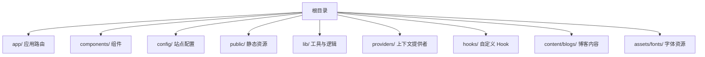
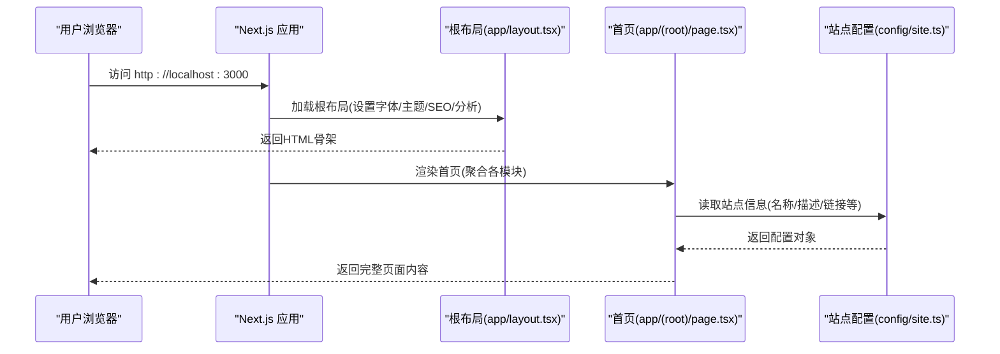
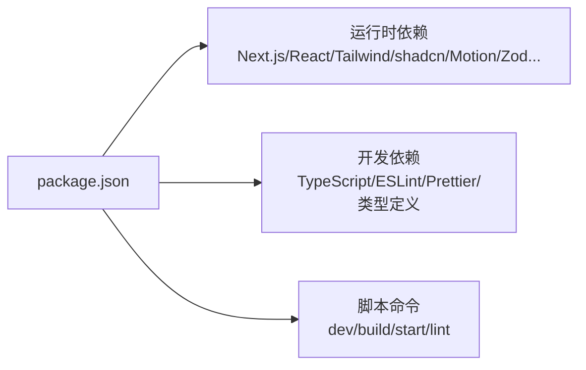

# 快速开始

<cite>
**本文引用的文件**
- [package.json](file://package.json)
- [README.md](file://README.md)
- [next.config.js](file://next.config.js)
- [app/layout.tsx](file://app/layout.tsx)
- [app/(root)/page.tsx](file://app/(root)/page.tsx)
- [config/site.ts](file://config/site.ts)
- [tsconfig.json](file://tsconfig.json)
- [app/api/contact/route.ts](file://app/api/contact/route.ts)
</cite>

## 目录
1. [简介](#简介)
2. [项目结构](#项目结构)
3. [核心组件](#核心组件)
4. [架构总览](#架构总览)
5. [详细组件分析](#详细组件分析)
6. [依赖分析](#依赖分析)
7. [性能注意事项](#性能注意事项)
8. [故障排除指南](#故障排除指南)
9. [结论](#结论)
10. [附录](#附录)

## 简介
本指南帮助你从零开始，快速搭建并运行 Next.js 投资组合项目。你将完成环境准备、克隆仓库、安装依赖、配置环境变量、启动开发服务器，以及基本使用流程。同时提供常见问题与排错建议，确保你尽快看到效果。

## 项目结构
本项目基于 Next.js App Router，采用 TypeScript + Tailwind CSS + shadcn/ui 等现代前端技术栈。根目录包含应用路由、API 路由、组件库、配置与静态资源等。关键入口与布局位于 app 目录，站点元数据与主题由全局布局统一管理。

图表来源
- [package.json:1-73](file://package.json#L1-L73)
- [next.config.js:1-25](file://next.config.js#L1-L25)

章节来源
- [package.json:1-73](file://package.json#L1-L73)
- [next.config.js:1-25](file://next.config.js#L1-L25)

## 核心组件
- 应用根布局：负责全局样式、字体、主题、SEO 元数据、分析与第三方脚本注入。
- 首页：聚合展示项目、经验、贡献、技能、博客与联系方式等模块。
- 站点配置：集中管理站点名称、描述、链接、图标与关键词等。
- API 路由：处理联系表单提交到外部服务（如 Google Form）。

章节来源
- [app/layout.tsx:1-145](file://app/layout.tsx#L1-L145)
- [app/(root)/page.tsx:1-357](file://app/(root)/page.tsx#L1-L357)
- [config/site.ts:1-41](file://config/site.ts#L1-L41)
- [app/api/contact/route.ts:1-30](file://app/api/contact/route.ts#L1-L30)

## 架构总览
下图展示了从浏览器访问到页面渲染的关键路径，包括全局布局、首页内容与必要的环境变量校验。

图表来源
- [app/layout.tsx:1-145](file://app/layout.tsx#L1-L145)
- [app/(root)/page.tsx:1-357](file://app/(root)/page.tsx#L1-L357)
- [config/site.ts:1-41](file://config/site.ts#L1-L41)

## 详细组件分析

### 环境与依赖准备
- Node.js 版本要求
  - 本项目使用较新的 Next.js 与 React 版本，建议使用当前长期支持（LTS）的 Node.js 版本，以确保兼容性与构建稳定性。
- 包管理器
  - 支持 npm、yarn、pnpm。根据 README 中的脚本命令，可使用任意一种进行安装与运行。
- 安装依赖
  - 在项目根目录执行包管理器安装命令，等待依赖下载完成。

章节来源
- [package.json:1-73](file://package.json#L1-L73)
- [README.md:44-77](file://README.md#L44-L77)

### 克隆与初始化
- 克隆仓库
  - 将仓库克隆到本地并进入项目目录。
- 创建环境变量文件
  - 在根目录创建 .env 文件，填入必要的公开环境变量（例如 Google Analytics 测量 ID），以避免启动时报错。
  - 若需要启用联系表单功能，还需配置 Google Form 相关环境变量（见“环境变量”小节）。

章节来源
- [README.md:44-77](file://README.md#L44-L77)
- [app/layout.tsx:99-103](file://app/layout.tsx#L99-L103)
- [app/api/contact/route.ts:1-30](file://app/api/contact/route.ts#L1-L30)

### 环境变量配置
- 必需的环境变量
  - NEXT_PUBLIC_GOOGLE_MEASUREMENT_ID：用于集成 Google Analytics。缺少该变量会在根布局中抛出错误，导致无法启动。
- 可选的环境变量（联系表单）
  - GOOGLE_FORM_LINK：Google Form 响应地址。
  - GOOGLE_FORM_FIELD_ID_NAME / EMAIL / MESSAGE / SOCIAL：对应表单字段 ID。
- 说明
  - 所有以 NEXT_PUBLIC_ 开头的变量会在客户端可用；其他变量仅在服务端可用。
  - 请确保 .env 文件不被提交到版本库（项目已忽略常见环境变量文件）。

章节来源
- [app/layout.tsx:99-103](file://app/layout.tsx#L99-L103)
- [app/api/contact/route.ts:1-30](file://app/api/contact/route.ts#L1-L30)

### 启动开发服务器与基本使用
- 启动开发服务器
  - 使用包管理器运行开发脚本，启动后打开浏览器访问本地端口查看效果。
- 基本使用流程
  - 首次启动成功后，可在浏览器中看到首页，包含个人介绍、项目、经验、贡献、技能、博客与联系方式等模块。
  - 通过导航或滚动浏览不同区块，体验动画与主题切换。
- 生产构建与预览
  - 构建完成后，可启动生产服务器进行本地预览。

章节来源
- [package.json:1-73](file://package.json#L1-L73)
- [README.md:44-77](file://README.md#L44-L77)

### 站点信息与 SEO
- 站点信息
  - 站点名称、作者、描述、链接、图标与关键词集中在站点配置文件中，便于统一修改。
- SEO 元数据
  - 根布局中设置了标题模板、描述、Open Graph、Twitter Card、Robots 与验证信息等，有助于搜索引擎收录与社交分享优化。

章节来源
- [config/site.ts:1-41](file://config/site.ts#L1-L41)
- [app/layout.tsx:30-97](file://app/layout.tsx#L30-L97)

### 联系表单 API
- 接口说明
  - 提供 POST 接口用于接收表单数据，并将数据转发至 Google Form。
- 行为说明
  - 若未配置 GOOGLE_FORM_LINK，将返回错误提示。
  - 成功时返回成功消息，失败时记录错误并返回内部错误状态。

章节来源
- [app/api/contact/route.ts:1-30](file://app/api/contact/route.ts#L1-L30)

## 依赖分析
- 运行时依赖
  - Next.js、React、Tailwind CSS、shadcn/ui 生态组件、Motion 动画、Zod 校验、React Hook Form、Lucide 图标等。
- 开发依赖
  - TypeScript、ESLint、Prettier、类型定义等。
- 构建与脚本
  - 提供 dev/build/start/lint 等常用脚本，便于开发与发布。

图表来源
- [package.json:1-73](file://package.json#L1-L73)

章节来源
- [package.json:1-73](file://package.json#L1-L73)

## 性能注意事项
- 首屏渲染与 SEO
  - 根布局与首页均进行了 SEO 元数据与结构化数据配置，有利于搜索引擎抓取与社交分享展示。
- 主题与字体
  - 使用系统字体与本地字体变量，减少额外请求；主题切换通过 class 属性控制，避免重绘开销。
- 静态资源
  - 图片与媒体资源放置在 public 目录，按需加载与优化。

章节来源
- [app/layout.tsx:15-24](file://app/layout.tsx#L15-L24)
- [app/layout.tsx:30-97](file://app/layout.tsx#L30-L97)
- [app/(root)/page.tsx:28-35](file://app/(root)/page.tsx#L28-L35)

## 故障排除指南
- 启动时报错：缺少 Google Analytics ID
  - 现象：启动后立即抛出错误，提示缺失 Google Analytics ID。
  - 原因：根布局在启动时会检查 NEXT_PUBLIC_GOOGLE_MEASUREMENT_ID 是否存在。
  - 解决：在根目录创建 .env 文件，添加 NEXT_PUBLIC_GOOGLE_MEASUREMENT_ID=你的ID，然后重启开发服务器。
- 联系表单无法提交
  - 现象：提交表单后返回错误或无响应。
  - 原因：未配置 GOOGLE_FORM_LINK 或其字段 ID。
  - 解决：在 .env 中配置 GOOGLE_FORM_LINK 及对应的字段 ID 环境变量，确保值正确。
- 端口占用或无法访问
  - 现象：开发服务器启动失败或无法在浏览器访问。
  - 解决：确认 3000 端口未被占用；尝试更换端口或关闭占用进程后重试。
- 依赖安装失败
  - 现象：npm/yarn/pnpm 安装报错。
  - 解决：清理缓存后重试；确保 Node.js 版本为 LTS；必要时删除 node_modules 与锁文件后重新安装。

章节来源
- [app/layout.tsx:99-103](file://app/layout.tsx#L99-L103)
- [app/api/contact/route.ts:1-30](file://app/api/contact/route.ts#L1-L30)

## 结论
按照本指南完成环境准备、依赖安装与环境变量配置后，即可快速启动并运行 Next.js 投资组合项目。通过统一的站点配置与完善的 SEO 元数据，你可以轻松定制个人信息、项目与技能等内容，并在本地或线上环境中预览与部署。

## 附录

### 快速上手步骤清单
- 准备 Node.js（建议使用 LTS 版本）
- 克隆仓库并进入项目目录
- 创建 .env 文件并填写必要的环境变量
- 安装依赖
- 启动开发服务器
- 在浏览器中访问本地地址查看效果

章节来源
- [README.md:44-77](file://README.md#L44-L77)
- [package.json:1-73](file://package.json#L1-L73)

### 环境变量参考
- NEXT_PUBLIC_GOOGLE_MEASUREMENT_ID：必填，用于 Google Analytics
- GOOGLE_FORM_LINK：选填，用于联系表单提交
- GOOGLE_FORM_FIELD_ID_NAME / EMAIL / MESSAGE / SOCIAL：选填，对应 Google Form 字段 ID

章节来源
- [app/layout.tsx:99-103](file://app/layout.tsx#L99-L103)
- [app/api/contact/route.ts:1-30](file://app/api/contact/route.ts#L1-L30)