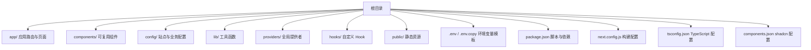
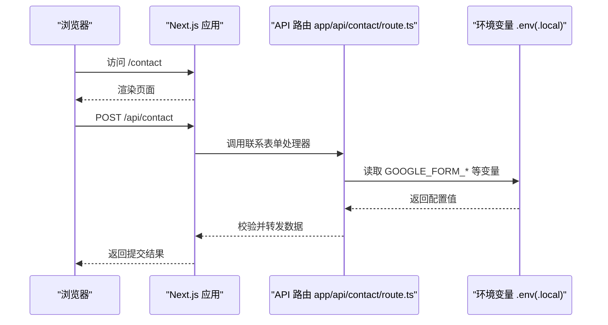
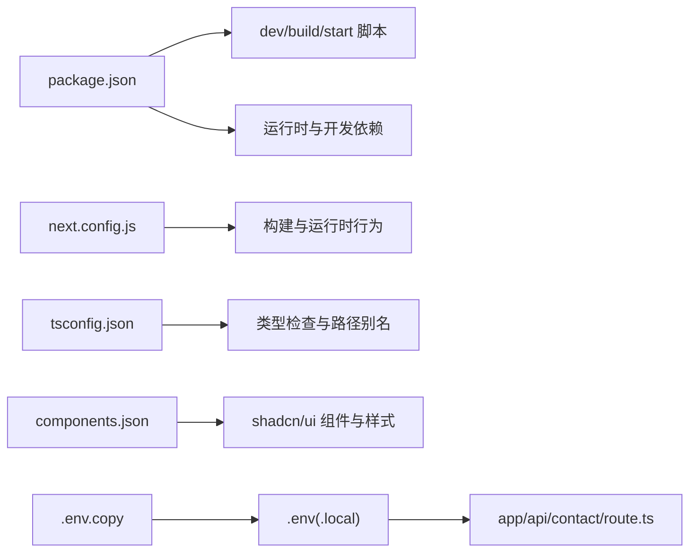

# 快速开始

<cite>
**本文引用的文件**
- [package.json](file://package.json)
- [README.md](file://README.md)
- [next.config.js](file://next.config.js)
- [.env.copy](file://.env.copy)
- [.env](file://.env)
- [app/api/contact/route.ts](file://app/api/contact/route.ts)
- [components.json](file://components.json)
- [tsconfig.json](file://tsconfig.json)
</cite>

## 目录
1. [简介](#简介)
2. [项目结构](#项目结构)
3. [核心组件](#核心组件)
4. [架构总览](#架构总览)
5. [详细步骤：环境搭建与运行](#详细步骤环境搭建与运行)
6. [依赖关系分析](#依赖关系分析)
7. [性能注意事项](#性能注意事项)
8. [故障排查指南](#故障排查指南)
9. [结论](#结论)
10. [附录：常用命令与最佳实践](#附录常用命令与最佳实践)

## 简介
本指南面向初学者，帮助你从零开始克隆、配置并运行 Next.js 投资组合项目。你将完成以下目标：
- 准备本地开发环境（Node.js、pnpm）
- 克隆仓库并安装依赖
- 配置环境变量（可选但推荐）
- 启动开发服务器并验证站点运行
- 了解常见问题及解决方案
- 掌握常用命令与本地开发最佳实践

## 项目结构
该项目采用 Next.js App Router 组织页面与路由，使用 TypeScript 与 Tailwind CSS，并通过 shadcn/ui 提供 UI 组件。根级配置文件包括 package.json、next.config.js、tsconfig.json、components.json 等。

图表来源
- [package.json:1-68](file://package.json#L1-L68)
- [next.config.js:1-5](file://next.config.js#L1-L5)
- [tsconfig.json:1-35](file://tsconfig.json#L1-L35)
- [components.json:1-17](file://components.json#L1-L17)

章节来源
- [package.json:1-68](file://package.json#L1-L68)
- [next.config.js:1-5](file://next.config.js#L1-L5)
- [tsconfig.json:1-35](file://tsconfig.json#L1-L35)
- [components.json:1-17](file://components.json#L1-L17)

## 核心组件
- 包管理与脚本：通过 package.json 定义 dev/build/start/lint 等脚本，统一开发体验。
- 构建与运行时：Next.js 作为框架，配合 TypeScript 与 Tailwind CSS。
- UI 系统：shadcn/ui 基于 Radix 组件，样式由 Tailwind 驱动。
- 环境变量：通过 .env/.env.local 管理敏感信息；客户端变量以 NEXT_PUBLIC_ 前缀暴露。

章节来源
- [package.json:6-11](file://package.json#L6-L11)
- [components.json:1-17](file://components.json#L1-L17)
- [.env.copy:1-20](file://.env.copy#L1-L20)

## 架构总览
下图展示从浏览器访问到服务端处理请求的关键路径，尤其关注联系表单 API 对环境变量的依赖。

图表来源
- [app/api/contact/route.ts:1-30](file://app/api/contact/route.ts#L1-L30)
- [.env.copy:1-20](file://.env.copy#L1-L20)

## 详细步骤：环境搭建与运行

### 前置条件
- Node.js 版本需满足 Next.js 16 的要求（建议使用 LTS）。
- 包管理器 pnpm（项目声明了 packageManager 字段）。

说明
- 项目通过 package.json 的 scripts 提供 dev/build/start 等命令，便于本地开发与生产构建。

章节来源
- [package.json:1-11](file://package.json#L1-L11)

### 第一步：克隆仓库
在终端执行：
- git clone https://github.com/namanbarkiya/minimal-next-portfolio.git my-portfolio
- cd my-portfolio

提示
- 若网络较慢，可使用国内镜像或代理加速下载。

章节来源
- [README.md:46-73](file://README.md#L46-L73)

### 第二步：安装依赖
在项目根目录执行：
- pnpm install

说明
- 该命令会依据 package.json 中的 dependencies 与 devDependencies 安装所有依赖。
- 若遇到 pnpm 版本不匹配，请根据 package.json 中声明的版本升级或切换 pnpm。

章节来源
- [package.json:1-11](file://package.json#L1-L11)

### 第三步：配置环境变量（可选但推荐）
- 复制模板文件为实际环境变量文件：
  - cp .env.copy .env.local
- 按需填写必要的环境变量：
  - 联系表单：GOOGLE_FORM_LINK 与对应字段 ID
  - 前端统计：NEXT_PUBLIC_GOOGLE_MEASUREMENT_ID
  - 简历链接：NEXT_PUBLIC_RESUME_LINK
  - Notion 博客（可选）：NOTION_TOKEN、NOTION_DATA_SOURCE_ID、NOTION_WEBHOOK_VERIFICATION_TOKEN、NOTION_BLOG_REVALIDATE_SECONDS

注意
- 以 NEXT_PUBLIC_ 开头的变量会被打包到客户端代码中，请勿将密钥放入此类变量。
- 服务端专用变量不要加 NEXT_PUBLIC_ 前缀。

章节来源
- [.env.copy:1-20](file://.env.copy#L1-L20)
- [app/api/contact/route.ts:1-30](file://app/api/contact/route.ts#L1-L30)

### 第四步：启动开发服务器
执行：
- pnpm dev

然后打开浏览器访问：
- http://localhost:3000

说明
- 开发服务器支持热重载，修改代码后会自动刷新页面。
- 如需自定义端口，可在 next.config.js 中配置或通过环境变量指定。

章节来源
- [package.json:6-11](file://package.json#L6-L11)
- [next.config.js:1-5](file://next.config.js#L1-L5)

### 第五步：构建与启动生产服务（可选）
- 构建：pnpm build
- 启动生产服务：pnpm start

说明
- 构建产物位于 .next 目录，生产模式适合部署到 Vercel 或其他支持 Next.js 的平台。

章节来源
- [package.json:6-11](file://package.json#L6-L11)

## 依赖关系分析
- 包管理器与脚本：package.json 定义了 pnpm 与 Next.js 脚本。
- 运行时依赖：Next.js、React、Tailwind CSS、shadcn/ui、动画库等。
- 类型与工具：TypeScript、ESLint、Prettier、Zod 等。
- 环境变量：联系表单与博客功能依赖 .env(.local) 中的配置。

图表来源
- [package.json:1-68](file://package.json#L1-L68)
- [next.config.js:1-5](file://next.config.js#L1-L5)
- [tsconfig.json:1-35](file://tsconfig.json#L1-L35)
- [components.json:1-17](file://components.json#L1-L17)
- [.env.copy:1-20](file://.env.copy#L1-L20)
- [app/api/contact/route.ts:1-30](file://app/api/contact/route.ts#L1-L30)

章节来源
- [package.json:1-68](file://package.json#L1-L68)
- [next.config.js:1-5](file://next.config.js#L1-L5)
- [tsconfig.json:1-35](file://tsconfig.json#L1-L35)
- [components.json:1-17](file://components.json#L1-L17)
- [.env.copy:1-20](file://.env.copy#L1-L20)
- [app/api/contact/route.ts:1-30](file://app/api/contact/route.ts#L1-L30)

## 性能注意事项
- 使用 pnpm 提升安装速度与磁盘占用效率。
- 开发时使用 pnpm dev，构建时启用 Next.js 优化选项（默认已开启）。
- 图片与静态资源建议放置在 public 目录并使用合适的尺寸与格式。
- 避免在客户端代码中引入不必要的重型依赖。

[本节为通用指导，无需特定文件引用]

## 故障排查指南

常见问题与解决方案
- 端口被占用
  - 现象：启动时报错端口已被占用。
  - 解决：更换端口或关闭占用进程。可通过 next.config.js 或环境变量设置新端口。
- 依赖安装失败
  - 现象：pnpm install 报错。
  - 解决：清理缓存后重试（如 pnpm store prune），或切换 pnpm 版本至 package.json 声明的版本。
- 环境变量未生效
  - 现象：联系表单提交失败或显示“请配置环境变量”。
  - 解决：确认 .env(.local) 中存在所需变量，且名称与大小写正确；重启开发服务器。
- 博客功能不可用
  - 现象：博客页面为空或报错。
  - 解决：检查 NOTION_TOKEN、NOTION_DATA_SOURCE_ID 等是否配置正确；确保 Notion 数据库结构与权限无误。

章节来源
- [app/api/contact/route.ts:1-30](file://app/api/contact/route.ts#L1-L30)
- [.env.copy:1-20](file://.env.copy#L1-L20)

## 结论
通过以上步骤，你已成功在本机克隆、配置并运行 Next.js 投资组合项目。你可以在此基础上继续添加内容、调整主题与布局，并将项目部署到 Vercel 等平台。建议在本地开发过程中遵循本文的最佳实践，以获得更稳定高效的开发体验。

[本节为总结性内容，无需特定文件引用]

## 附录：常用命令与最佳实践

常用命令
- 安装依赖：pnpm install
- 启动开发服务器：pnpm dev
- 构建生产版本：pnpm build
- 启动生产服务：pnpm start
- 代码检查：pnpm lint

最佳实践
- 使用 .env.local 存放本地环境变量，勿提交到版本库。
- 仅将必要的公开变量以 NEXT_PUBLIC_ 前缀暴露给客户端。
- 保持依赖更新，定期运行 pnpm update 并审查变更。
- 使用 ESLint 与 Prettier 统一代码风格，提高团队协作效率。
- 在提交前执行构建与检查，确保无错误与警告。

章节来源
- [package.json:6-11](file://package.json#L6-L11)
- [.env.copy:1-20](file://.env.copy#L1-L20)