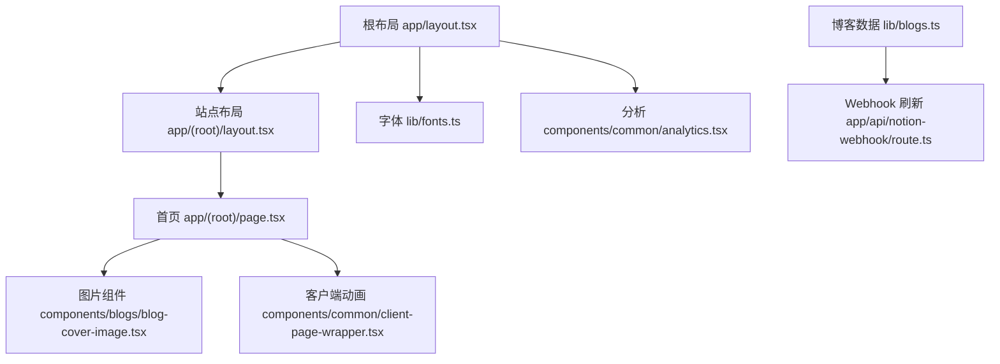
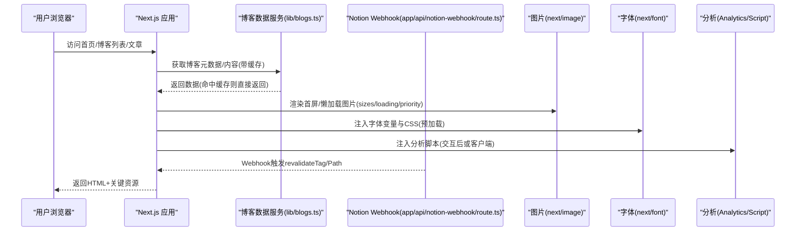
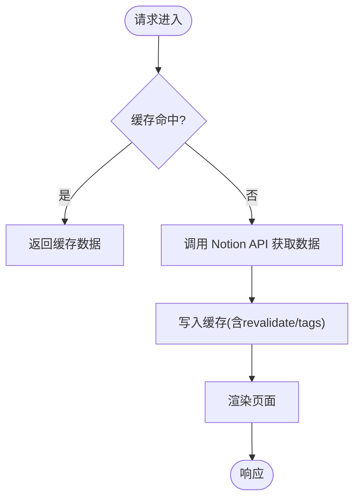
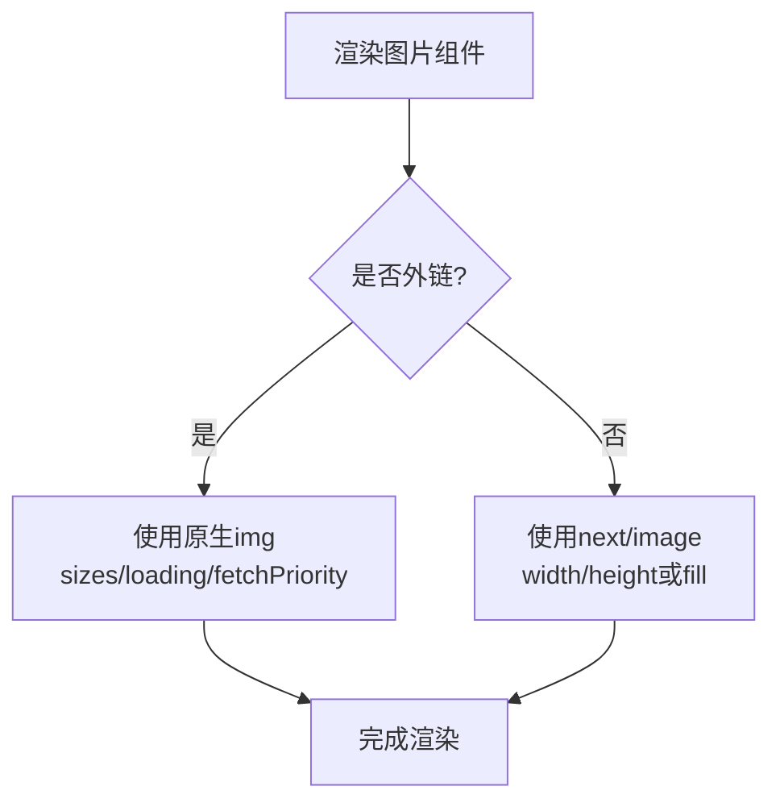
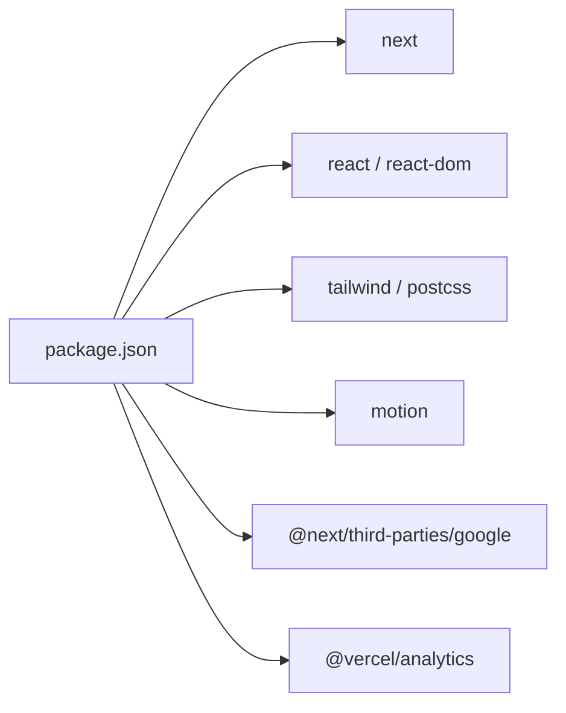

# 性能优化

<cite>
**本文引用的文件**
- [next.config.js](file://next.config.js)
- [package.json](file://package.json)
- [app/layout.tsx](file://app/layout.tsx)
- [app/(root)/layout.tsx](file://app/(root)/layout.tsx)
- [app/(root)/page.tsx](file://app/(root)/page.tsx)
- [components/common/analytics.tsx](file://components/common/analytics.tsx)
- [components/common/client-page-wrapper.tsx](file://components/common/client-page-wrapper.tsx)
- [components/common/theme-provider.tsx](file://components/common/theme-provider.tsx)
- [components/blogs/blog-cover-image.tsx](file://components/blogs/blog-cover-image.tsx)
- [lib/blogs.ts](file://lib/blogs.ts)
- [lib/fonts.ts](file://lib/fonts.ts)
- [postcss.config.js](file://postcss.config.js)
- [app/api/notion-webhook/route.ts](file://app/api/notion-webhook/route.ts)
- [README.md](file://README.md)
</cite>

## 目录
1. [简介](#简介)
2. [项目结构](#项目结构)
3. [核心组件](#核心组件)
4. [架构总览](#架构总览)
5. [详细组件分析](#详细组件分析)
6. [依赖分析](#依赖分析)
7. [性能考量](#性能考量)
8. [故障排查指南](#故障排查指南)
9. [结论](#结论)
10. [附录](#附录)

## 简介
本文件为 Next.js 投资组合的性能优化指南，围绕静态生成策略、图片优化、代码分割与缓存策略展开，并结合项目的实际实现给出 Lighthouse 评分优化与 Core Web Vitals（LCP、FID/INP、CLS）改进建议。同时提供分析工具集成、性能监控与调试技巧，以及性能测试方法与最佳实践。

## 项目结构
本项目采用 App Router 组织页面与布局，服务端渲染与客户端交互通过“use client”边界明确划分；博客内容来自 Notion，使用 Next.js 缓存与 Webhook 进行增量更新；字体通过 next/font 预加载与本地化；图片使用 next/image 与自定义封装组件；分析脚本通过第三方包与 Script 标签按需加载。

图表来源
- [app/layout.tsx:1-131](file://app/layout.tsx#L1-L131)
- [app/(root)/layout.tsx:1-33](file://app/(root)/layout.tsx#L1-L33)
- [app/(root)/page.tsx:1-354](file://app/(root)/page.tsx#L1-L354)
- [components/blogs/blog-cover-image.tsx:1-68](file://components/blogs/blog-cover-image.tsx#L1-L68)
- [components/common/client-page-wrapper.tsx:1-37](file://components/common/client-page-wrapper.tsx#L1-L37)
- [lib/fonts.ts:1-19](file://lib/fonts.ts#L1-L19)
- [components/common/analytics.tsx:1-8](file://components/common/analytics.tsx#L1-L8)
- [lib/blogs.ts:1-200](file://lib/blogs.ts#L1-L200)
- [app/api/notion-webhook/route.ts:1-75](file://app/api/notion-webhook/route.ts#L1-L75)

章节来源
- [app/layout.tsx:1-131](file://app/layout.tsx#L1-L131)
- [app/(root)/layout.tsx:1-33](file://app/(root)/layout.tsx#L1-L33)
- [app/(root)/page.tsx:1-354](file://app/(root)/page.tsx#L1-L354)
- [lib/fonts.ts:1-19](file://lib/fonts.ts#L1-L19)
- [components/common/analytics.tsx:1-8](file://components/common/analytics.tsx#L1-L8)
- [components/blogs/blog-cover-image.tsx:1-68](file://components/blogs/blog-cover-image.tsx#L1-L68)
- [lib/blogs.ts:1-200](file://lib/blogs.ts#L1-L200)
- [app/api/notion-webhook/route.ts:1-75](file://app/api/notion-webhook/route.ts#L1-L75)

## 核心组件
- 根布局与元信息：定义全局 metadata、Open Graph/Twitter 卡片、图标与 manifest，并注入 Google Analytics 与第三方脚本。
- 站点布局：包含导航、页脚与主题切换，保持页面骨架稳定以减少 CLS。
- 首页：使用服务端函数获取精选博客与配置数据，内联结构化数据，首屏优先图片使用 priority。
- 图片组件：统一处理外部与站内图片，支持 fill/尺寸/sizes/loading/fetchPriority，避免阻塞与重排。
- 字体：通过 next/font 预加载与变量注入，减少字体闪烁与布局偏移。
- 分析：客户端分析组件与 Script 标签按交互后加载，降低首屏阻塞。
- 博客数据与缓存：基于 Next.js unstable_cache 与 revalidateTag/revalidatePath 的增量静态再生成，配合 Webhook 快速失效缓存。

章节来源
- [app/layout.tsx:18-127](file://app/layout.tsx#L18-L127)
- [app/(root)/layout.tsx:11-31](file://app/(root)/layout.tsx#L11-L31)
- [app/(root)/page.tsx:28-89](file://app/(root)/page.tsx#L28-L89)
- [components/blogs/blog-cover-image.tsx:17-68](file://components/blogs/blog-cover-image.tsx#L17-L68)
- [lib/fonts.ts:1-19](file://lib/fonts.ts#L1-L19)
- [components/common/analytics.tsx:1-8](file://components/common/analytics.tsx#L1-L8)
- [lib/blogs.ts:92-131](file://lib/blogs.ts#L92-L131)
- [app/api/notion-webhook/route.ts:13-75](file://app/api/notion-webhook/route.ts#L13-L75)

## 架构总览
下图展示从请求到渲染的关键路径，包括 SSR/SSG、缓存、图片与字体加载、分析脚本注入等。

图表来源
- [app/(root)/page.tsx:36-89](file://app/(root)/page.tsx#L36-L89)
- [lib/blogs.ts:404-420](file://lib/blogs.ts#L404-L420)
- [app/api/notion-webhook/route.ts:59-75](file://app/api/notion-webhook/route.ts#L59-L75)
- [components/blogs/blog-cover-image.tsx:17-68](file://components/blogs/blog-cover-image.tsx#L17-L68)
- [lib/fonts.ts:1-19](file://lib/fonts.ts#L1-L19)
- [components/common/analytics.tsx:1-8](file://components/common/analytics.tsx#L1-L8)
- [app/layout.tsx:118-127](file://app/layout.tsx#L118-L127)

## 详细组件分析

### 静态生成与增量再生成（SSG + ISR）
- 博客列表与详情页通过服务端函数读取 Notion 数据，并使用 unstable_cache 进行内存级缓存，结合 revalidate 时间窗口控制过期。
- Webhook 在内容变更时调用 revalidateTag 与 revalidatePath，对首页、博客列表与站点地图进行精准失效，缩短更新延迟。
- 默认重新验证周期可通过环境变量覆盖，未配置时使用默认值。

图表来源
- [lib/blogs.ts:92-131](file://lib/blogs.ts#L92-L131)
- [lib/blogs.ts:404-420](file://lib/blogs.ts#L404-L420)
- [app/api/notion-webhook/route.ts:59-75](file://app/api/notion-webhook/route.ts#L59-L75)

章节来源
- [lib/blogs.ts:92-131](file://lib/blogs.ts#L92-L131)
- [lib/blogs.ts:404-420](file://lib/blogs.ts#L404-L420)
- [app/api/notion-webhook/route.ts:13-75](file://app/api/notion-webhook/route.ts#L13-L75)
- [README.md:115-133](file://README.md#L115-L133)

### 图片优化（LCP 与 CLS）
- 首屏头像使用 next/image 并设置 priority，提升 LCP。
- 博客封面图组件根据是否为外链选择原生 img 或 next/image，统一支持 sizes、loading、fill、fetchPriority，避免阻塞与布局偏移。
- 建议在长文列表中对外部大图使用 lazy 加载，并在容器固定宽高或使用 aspect-ratio 防止 CLS。

图表来源
- [components/blogs/blog-cover-image.tsx:17-68](file://components/blogs/blog-cover-image.tsx#L17-L68)
- [app/(root)/page.tsx:81-89](file://app/(root)/page.tsx#L81-L89)

章节来源
- [components/blogs/blog-cover-image.tsx:17-68](file://components/blogs/blog-cover-image.tsx#L17-L68)
- [app/(root)/page.tsx:81-89](file://app/(root)/page.tsx#L81-L89)

### 代码分割与客户端边界
- 动画与主题切换等需要 DOM 能力的组件标记为 “use client”，与服务器端渲染分离，减少首屏 JS 体积。
- 分析脚本通过 next/script 的 afterInteractive 策略与客户端组件按需加载，避免阻塞首屏。
- 建议将大型第三方库（如动画、图表）进一步拆分为动态导入，仅在必要时加载。

章节来源
- [components/common/client-page-wrapper.tsx:1-37](file://components/common/client-page-wrapper.tsx#L1-L37)
- [components/common/theme-provider.tsx:1-11](file://components/common/theme-provider.tsx#L1-L11)
- [components/common/analytics.tsx:1-8](file://components/common/analytics.tsx#L1-L8)
- [app/layout.tsx:118-127](file://app/layout.tsx#L118-L127)

### 字体与样式优化（CLS 与 FCP）
- 使用 next/font 的 Inter 与本地 CalSans，通过 variable 注入 CSS 变量，避免字体加载导致的布局偏移。
- PostCSS 仅启用 Tailwind 插件，保持构建链路简洁，利于 Tree-shaking 与产物体积控制。
- 建议为所有文本容器预留最小高度或使用占位，避免 CLS。

章节来源
- [lib/fonts.ts:1-19](file://lib/fonts.ts#L1-L19)
- [postcss.config.js:1-6](file://postcss.config.js#L1-L6)

### 分析与监控集成
- 根布局中注入 Google Analytics（条件渲染）与第三方 Widget（afterInteractive）。
- 客户端分析组件使用 @vercel/analytics/react，便于后续扩展埋点。
- 建议结合 Next.js 内置指标与浏览器 Performance API 采集关键指标，建立持续监控。

章节来源
- [app/layout.tsx:18-127](file://app/layout.tsx#L18-L127)
- [components/common/analytics.tsx:1-8](file://components/common/analytics.tsx#L1-L8)

## 依赖分析
- 运行时依赖包含 next、react、tailwind 生态、motion、@next/third-parties、@vercel/analytics 等，确保框架能力与 UI 动画、分析能力。
- 开发依赖包含 eslint、prettier、typescript、esbuild 等，保障代码质量与构建效率。
- 通过 pnpm 锁定版本，保证构建可重复性。

图表来源
- [package.json:13-49](file://package.json#L13-L49)

章节来源
- [package.json:1-68](file://package.json#L1-L68)

## 性能考量
- 静态生成策略
  - 博客列表与详情使用服务端数据获取与缓存，结合 revalidate 与 Webhook 实现近实时的增量再生成，兼顾速度与新鲜度。
  - 首页聚合精选内容，减少不必要的网络请求与渲染开销。
- 图片优化
  - 首屏关键图片使用 priority；非关键图片使用 lazy；统一 sizes 与合适的宽高，避免 CLS。
  - 外链图片使用原生 img 并设置 fetchPriority，站内图片使用 next/image 自动优化。
- 代码分割
  - 将客户端逻辑放入 “use client” 组件；分析脚本与第三方脚本使用 afterInteractive；大依赖按需动态导入。
- 缓存策略
  - 使用 unstable_cache 对博客数据进行缓存，并通过 revalidateTag/revalidatePath 精准失效。
  - Webhook 校验签名后触发缓存失效，确保内容变更后尽快生效。
- 字体与样式
  - 使用 next/font 预加载字体，减少闪烁与布局偏移；精简 PostCSS 插件链。
- Lighthouse 与 Core Web Vitals
  - LCP：优先加载首屏图片与关键字体，减少阻塞资源。
  - INP/FID：拆分客户端逻辑，避免主线程长时间占用；谨慎使用动画。
  - CLS：为图片与广告位预留空间，使用稳定的布局容器。
- 分析工具与监控
  - 已集成 Google Analytics 与 Vercel Analytics；建议增加自定义事件追踪关键交互与错误。
  - 在生产环境开启性能指标上报，结合日志平台进行问题定位。
- 性能测试方法
  - 使用 Lighthouse CI 与 WebPageTest 进行回归测试；在真实设备上测量 CWV。
  - 通过 Chrome DevTools 的 Performance 面板录制关键路径，识别阻塞与重绘。
- 优化建议与最佳实践
  - 限制首屏组件数量与动画复杂度；按需加载第三方脚本。
  - 对长列表使用虚拟滚动或分页；对大图进行压缩与 CDN 加速。
  - 定期审查 bundle 大小，移除未使用的依赖与样式。

[本节为通用指导，不直接分析具体文件]

## 故障排查指南
- 博客数据为空或报错
  - 检查环境变量 NOTION_TOKEN 与 NOTION_DATA_SOURCE_ID 是否正确配置；缺失时将禁用博客功能并输出警告。
  - 若属性缺失或格式不符，会抛出错误提示，需修正 Notion 字段。
- Webhook 无法触发缓存失效
  - 确认已配置 NOTION_WEBHOOK_VERIFICATION_TOKEN，且签名校验通过；否则返回 401/503。
  - 检查路由是否暴露并可被 Notion 访问。
- 图片显示异常或 CLS 高
  - 外链图片未设置 sizes/loading；或容器无固定宽高导致重排。
  - 建议使用 blog-cover-image 组件统一处理。
- 字体闪烁或布局偏移
  - 确认 next/font 已正确引入并注入变量；避免在字体加载前强制改变字号。
- 分析数据未上报
  - 检查 Google Measurement ID 是否存在；第三方脚本策略是否为 afterInteractive。

章节来源
- [lib/blogs.ts:92-131](file://lib/blogs.ts#L92-L131)
- [lib/blogs.ts:134-200](file://lib/blogs.ts#L134-L200)
- [app/api/notion-webhook/route.ts:13-75](file://app/api/notion-webhook/route.ts#L13-L75)
- [components/blogs/blog-cover-image.tsx:17-68](file://components/blogs/blog-cover-image.tsx#L17-L68)
- [lib/fonts.ts:1-19](file://lib/fonts.ts#L1-L19)
- [app/layout.tsx:118-127](file://app/layout.tsx#L118-L127)

## 结论
本项目已具备完善的性能基础：基于 App Router 的服务端渲染、博客内容的缓存与增量再生成、图片与字体的优化、以及分析工具的集成。通过进一步的代码分割、资源按需加载与持续的性能监控，可显著提升 Lighthouse 评分与 Core Web Vitals 指标，为用户提供更流畅的体验。

[本节为总结，不直接分析具体文件]

## 附录
- 环境变量参考
  - NOTION_TOKEN、NOTION_DATA_SOURCE_ID：用于连接 Notion 数据源。
  - NOTION_BLOG_REVALIDATE_SECONDS：缓存重新验证间隔（秒），未设置时使用默认值。
  - NOTION_WEBHOOK_VERIFICATION_TOKEN：Webhook 签名校验令牌。
  - NEXT_PUBLIC_GOOGLE_MEASUREMENT_ID：Google Analytics 标识。
  - NEXT_PUBLIC_GOOGLE_VERIFICATION：Google 站点验证。
- 相关脚本
  - dev/build/start/lint/test:blog-markdown：开发与构建流程。

章节来源
- [lib/blogs.ts:92-131](file://lib/blogs.ts#L92-L131)
- [app/api/notion-webhook/route.ts:23-49](file://app/api/notion-webhook/route.ts#L23-L49)
- [package.json:6-12](file://package.json#L6-L12)
- [app/layout.tsx:87-127](file://app/layout.tsx#L87-L127)