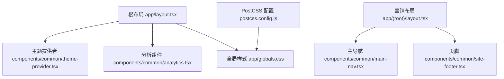
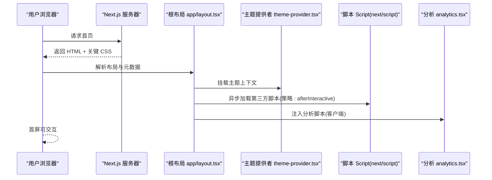
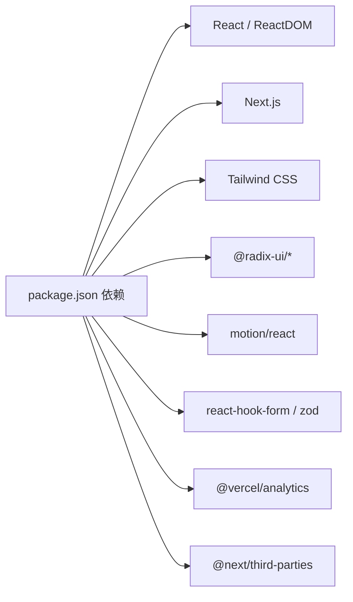

# 前端性能优化

<cite>
**本文引用的文件**
- [next.config.js](file://next.config.js)
- [package.json](file://package.json)
- [app/layout.tsx](file://app/layout.tsx)
- [app/(root)/layout.tsx](file://app/(root)/layout.tsx)
- [components/common/theme-provider.tsx](file://components/common/theme-provider.tsx)
- [components/common/analytics.tsx](file://components/common/analytics.tsx)
- [components/common/main-nav.tsx](file://components/common/main-nav.tsx)
- [components/common/site-footer.tsx](file://components/common/site-footer.tsx)
- [postcss.config.js](file://postcss.config.js)
- [app/globals.css](file://app/globals.css)
</cite>

## 目录
1. [简介](#简介)
2. [项目结构](#项目结构)
3. [核心组件](#核心组件)
4. [架构总览](#架构总览)
5. [详细组件分析](#详细组件分析)
6. [依赖分析](#依赖分析)
7. [性能考虑](#性能考虑)
8. [故障排查指南](#故障排查指南)
9. [结论](#结论)
10. [附录](#附录)

## 简介
本指南面向 Next.js 投资组合项目的前端性能优化，聚焦以下方面：代码分割与懒加载、图片优化（含 WebP 与压缩）、字体加载优化（子集化与预加载）、CSS/JS 优化（Tree Shaking、Dead Code Elimination、Bundle Size），并提供可落地的配置示例与最佳实践，确保站点在各类设备上快速加载与响应。

## 项目结构
本项目采用 App Router 组织页面与布局，公共样式通过全局 CSS 引入，字体使用 next/font 进行子集化与变量注入，第三方脚本通过 next/script 按需加载，客户端能力通过 "use client" 边界隔离，便于构建期进行更精准的 Tree Shaking 与代码分割。

图表来源
- [app/layout.tsx:1-145](file://app/layout.tsx#L1-L145)
- [components/common/theme-provider.tsx:1-8](file://components/common/theme-provider.tsx#L1-L8)
- [components/common/analytics.tsx:1-8](file://components/common/analytics.tsx#L1-L8)
- [app/(root)/layout.tsx:1-33](file://app/(root)/layout.tsx#L1-L33)
- [components/common/main-nav.tsx:1-105](file://components/common/main-nav.tsx#L1-L105)
- [components/common/site-footer.tsx:1-34](file://components/common/site-footer.tsx#L1-L34)
- [postcss.config.js:1-6](file://postcss.config.js#L1-L6)

章节来源
- [app/layout.tsx:1-145](file://app/layout.tsx#L1-L145)
- [app/(root)/layout.tsx:1-33](file://app/(root)/layout.tsx#L1-L33)
- [postcss.config.js:1-6](file://postcss.config.js#L1-L6)
- [app/globals.css:1-750](file://app/globals.css#L1-L750)

## 核心组件
- 根布局与元数据：集中管理站点标题、描述、社交卡片、图标与验证信息，并注入字体变量与第三方脚本。
- 主题提供器：以客户端组件形式包裹应用，启用多主题切换。
- 分析组件：封装 Vercel Analytics，避免阻塞首屏。
- 导航与页脚：展示站点导航与社交链接，使用 Tailwind 原子类减少冗余样式。

章节来源
- [app/layout.tsx:30-97](file://app/layout.tsx#L30-L97)
- [components/common/theme-provider.tsx:1-8](file://components/common/theme-provider.tsx#L1-L8)
- [components/common/analytics.tsx:1-8](file://components/common/analytics.tsx#L1-L8)
- [components/common/main-nav.tsx:1-105](file://components/common/main-nav.tsx#L1-L105)
- [components/common/site-footer.tsx:1-34](file://components/common/site-footer.tsx#L1-L34)

## 架构总览
下图展示了从浏览器到服务端渲染再到客户端交互的关键路径，以及各优化点的位置。

图表来源
- [app/layout.tsx:105-142](file://app/layout.tsx#L105-L142)
- [components/common/theme-provider.tsx:1-8](file://components/common/theme-provider.tsx#L1-L8)
- [components/common/analytics.tsx:1-8](file://components/common/analytics.tsx#L1-L8)

## 详细组件分析

### 字体加载优化
- Google Fonts 子集化：通过 next/font/google 指定 subsets，仅加载所需字符集，显著减小字体体积。
- 本地字体子集化：使用 next/font/local 将自定义字体 woff2 作为资源引用，并通过 variable 注入 CSS 变量，避免 FOIT/FOUT。
- 显示策略：导航中为外部字体设置 display: swap，提升首次渲染体验。
- 建议：
  - 优先使用系统字体栈作为回退，减少网络请求。
  - 对非首屏字体使用 font-display: optional 或 swap。
  - 结合 preload 与 prefetch 策略，仅在必要时提前加载。

章节来源
- [app/layout.tsx:15-24](file://app/layout.tsx#L15-L24)
- [components/common/main-nav.tsx:19-24](file://components/common/main-nav.tsx#L19-L24)

### 图片优化技术
- 使用 Next.js Image 组件：自动实现尺寸裁剪、格式选择（WebP/AVIF）、懒加载与占位图，降低带宽与重排。
- 格式转换与压缩：构建时由 Next.js 内置优化管线处理；如需自定义，可在构建流程中集成 sharp 等工具进行批量转换与压缩。
- 缓存与 CDN：部署至支持静态资源缓存的 CDN，配合合理的 Cache-Control 头提升重复访问速度。
- 建议：
  - 所有展示型图片统一走 Image 组件，避免裸 img 标签。
  - 为不同断点提供合适的 sizes 与 priority 控制。
  - 对大图使用 AVIF/WebP 双格式回退。

章节来源
- [package.json:11-44](file://package.json#L11-L44)

### 代码分割与组件懒加载
- 客户端组件边界："use client" 标记的组件会被拆分到独立的客户端包，减少服务端包体积。
- 路由级分割：App Router 天然按路由进行代码分割，进入新路由时仅加载对应资源。
- 动态导入：对重型库（如动画、图表）使用动态 import() 或 next/dynamic，延迟到需要时再加载。
- 建议：
  - 将大依赖拆分为独立 chunk，避免首屏阻塞。
  - 对非关键交互使用 Suspense + 懒加载，提升首屏性能。
  - 监控 bundle 大小，定期清理未使用依赖。

章节来源
- [components/common/theme-provider.tsx:1-8](file://components/common/theme-provider.tsx#L1-L8)
- [components/common/analytics.tsx:1-8](file://components/common/analytics.tsx#L1-L8)

### 脚本加载与第三方集成
- next/script 策略：使用 afterInteractive 策略在页面可交互后加载第三方脚本，避免阻塞首屏。
- 分析集成：通过 Vercel Analytics 与 @next/third-parties 提供的 Google Analytics 组件，最小化侵入性。
- 建议：
  - 将非关键脚本（聊天小部件、埋点、广告）置于 afterInteractive 或 idle。
  - 避免在 head 中同步加载阻塞脚本。

章节来源
- [app/layout.tsx:134-142](file://app/layout.tsx#L134-L142)
- [components/common/analytics.tsx:1-8](file://components/common/analytics.tsx#L1-L8)

### CSS 优化（Tailwind 与 PostCSS）
- Tailwind 扫描：通过 PostCSS 插件在生产构建时移除未使用的样式，显著减小 CSS 体积。
- 设计令牌：使用 CSS 变量统一管理颜色、圆角、动画时长等，便于主题切换与复用。
- 建议：
  - 保持模板类名与 Tailwind 匹配，避免手写冗余 CSS。
  - 将动画与复杂样式放入 @layer 管理，提升可维护性。

章节来源
- [postcss.config.js:1-6](file://postcss.config.js#L1-L6)
- [app/globals.css:28-85](file://app/globals.css#L28-L85)
- [app/globals.css:87-333](file://app/globals.css#L87-L333)

### JavaScript 优化（Tree Shaking、DCE、Bundle Size）
- 构建优化：Next.js 默认启用 Tree Shaking 与 Dead Code Elimination，仅打包被实际引用的模块。
- 客户端边界：将状态管理与 UI 逻辑放入 "use client" 组件，使服务端包更精简。
- 依赖治理：定期审计依赖，移除未使用库，关注大型依赖（动画、UI 库）的按需引入。
- 建议：
  - 使用 bundle 分析工具定位大依赖。
  - 对第三方库优先使用官方 Next.js 集成或轻量替代。

章节来源
- [package.json:11-44](file://package.json#L11-L44)
- [components/common/theme-provider.tsx:1-8](file://components/common/theme-provider.tsx#L1-L8)

### 路由与布局的性能影响
- 营销布局：包含导航与页脚，属于高频渲染区域，应保持轻量，避免在其中引入重型逻辑。
- 页面容器：通过组合 PageHeader 与内容区，保证内容层次清晰，利于缓存与增量更新。
- 建议：
  - 将通用 UI 下沉到共享组件，减少重复代码。
  - 对长列表与复杂页面使用虚拟滚动与分页。

章节来源
- [app/(root)/layout.tsx:1-33](file://app/(root)/layout.tsx#L1-L33)
- [components/common/site-footer.tsx:1-34](file://components/common/site-footer.tsx#L1-L34)

## 依赖分析
项目依赖包括 React、Next.js、Tailwind、Radix UI、动画库、表单与状态管理等。构建产物的大小与运行时的开销受这些依赖影响较大。

图表来源
- [package.json:11-44](file://package.json#L11-L44)

章节来源
- [package.json:11-44](file://package.json#L11-L44)

## 性能考虑
- 首屏优化
  - 字体：子集化 + display: swap，减少 FOIT/FOUT。
  - 脚本：afterInteractive 加载第三方脚本，避免阻塞。
  - 样式：Tailwind 生产构建去除未用样式。
- 资源优化
  - 图片：统一使用 Next.js Image，启用 WebP/AVIF，合理 sizes/priority。
  - 缓存：CDN 缓存静态资源，设置合理过期时间。
- 运行时优化
  - 客户端边界：将交互逻辑放入 "use client"，减少服务端包。
  - 动态导入：对重型功能按需加载，降低首屏体积。
- 构建优化
  - Tree Shaking/DCE：保持模块化与按需引入，避免全量引入。
  - 依赖治理：定期清理与替换大依赖。

[本节为通用指导，不直接分析具体文件]

## 故障排查指南
- 缺少环境变量导致构建失败
  - 现象：启动时报错提示缺失 Google Analytics ID。
  - 处理：检查环境变量是否已正确配置，或在开发环境提供默认值。
- 第三方脚本未生效
  - 现象：聊天小部件或分析未加载。
  - 处理：确认 next/script 的 strategy 设置为 afterInteractive，并检查网络请求是否被拦截。
- 样式未生效或闪烁
  - 现象：主题切换或字体加载出现闪烁。
  - 处理：确保字体变量已注入到 body，并使用 display: swap 或 optional。

章节来源
- [app/layout.tsx:100-103](file://app/layout.tsx#L100-L103)
- [app/layout.tsx:134-142](file://app/layout.tsx#L134-L142)

## 结论
通过字体子集化、脚本异步加载、Tailwind 样式裁剪、Image 组件优化与客户端边界划分，本项目能够在保证功能完整性的同时，显著提升首屏加载速度与交互响应性。建议在后续迭代中持续监控 Bundle 大小与核心指标（FCP、LCP、INP），并结合业务场景调整懒加载与缓存策略。

[本节为总结，不直接分析具体文件]

## 附录
- 配置要点速查
  - 字体：next/font/google subsets、next/font/local、display: swap
  - 脚本：next/script strategy="afterInteractive"
  - 样式：PostCSS + Tailwind 生产构建
  - 图片：Next.js Image 组件（WebP/AVIF、sizes、priority）
  - 客户端边界："use client" 隔离交互逻辑
  - 分析：Vercel Analytics 与 @next/third-parties

[本节为补充说明，不直接分析具体文件]