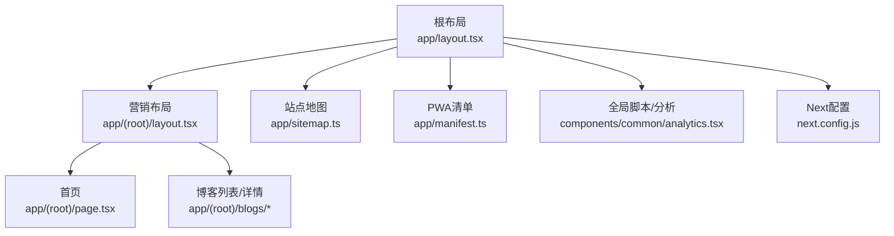
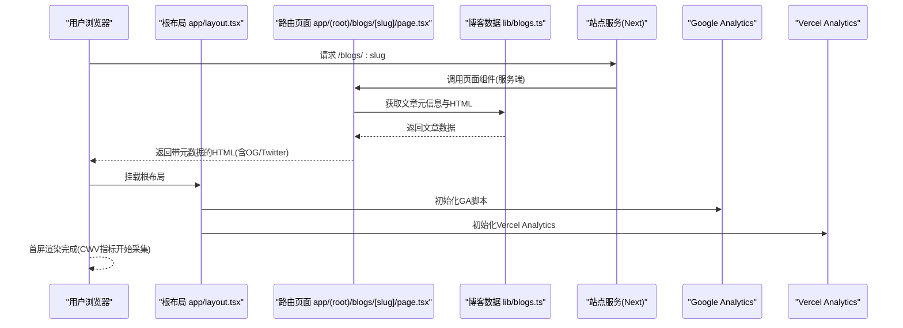
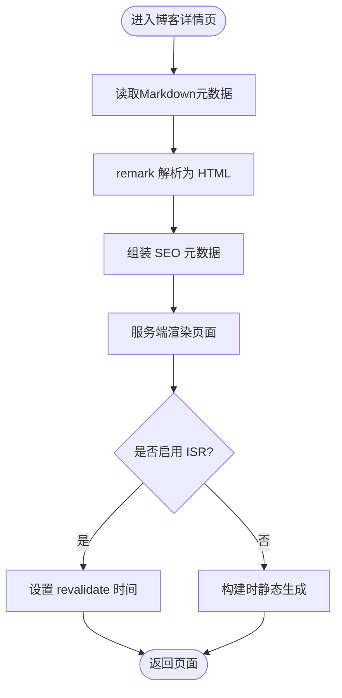
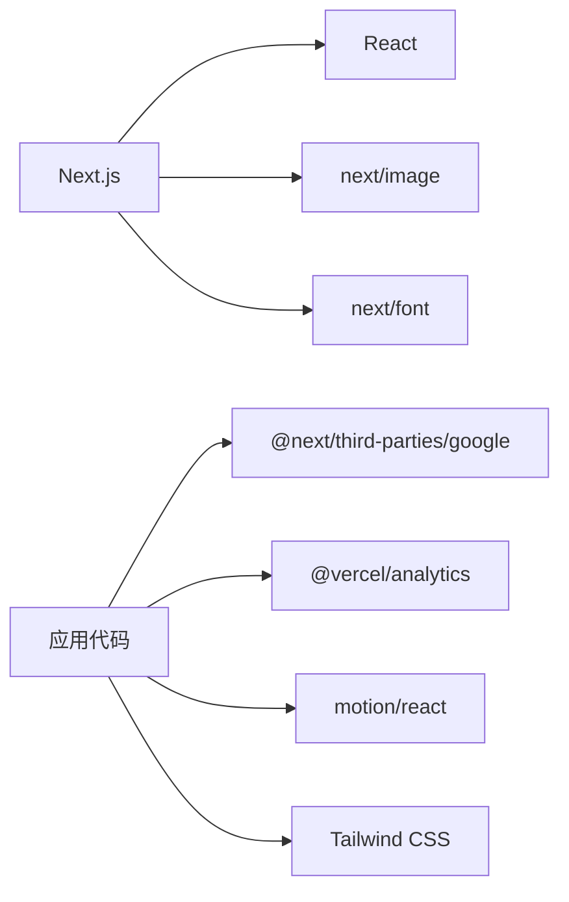

# 性能优化

<cite>
**本文引用的文件**
- [next.config.js](file://next.config.js)
- [package.json](file://package.json)
- [app/layout.tsx](file://app/layout.tsx)
- [app/(root)/layout.tsx](file://app/(root)/layout.tsx)
- [components/common/analytics.tsx](file://components/common/analytics.tsx)
- [app/manifest.ts](file://app/manifest.ts)
- [app/sitemap.ts](file://app/sitemap.ts)
- [lib/blogs.ts](file://lib/blogs.ts)
- [app/(root)/blogs/[slug]/page.tsx](file://app/(root)/blogs/[slug]/page.tsx)
- [app/(root)/page.tsx](file://app/(root)/page.tsx)
- [components/common/main-nav.tsx](file://components/common/main-nav.tsx)
</cite>

## 目录
1. [简介](#简介)
2. [项目结构](#项目结构)
3. [核心组件](#核心组件)
4. [架构总览](#架构总览)
5. [详细组件分析](#详细组件分析)
6. [依赖分析](#依赖分析)
7. [性能考量](#性能考量)
8. [故障排查指南](#故障排查指南)
9. [结论](#结论)
10. [附录](#附录)

## 简介
本指南面向Next.js投资组合项目的性能优化，覆盖代码分割、图片优化、缓存策略、SEO优化、SSR/ISR/静态生成实践、Core Web Vitals与Lighthouse优化方法，以及Google Analytics与Vercel Analytics的监控配置。目标是确保网站在各类设备上提供快速、稳定且可访问的用户体验。

## 项目结构
本项目采用App Router组织页面与布局，使用Next内置能力进行元数据、站点地图、PWA清单与字体加载；通过第三方库集成分析与主题切换；博客内容以Markdown存储并在构建时解析为HTML。

图表来源
- [app/layout.tsx:1-145](file://app/layout.tsx#L1-L145)
- [app/(root)/layout.tsx:1-33](file://app/(root)/layout.tsx#L1-L33)
- [app/(root)/page.tsx:1-357](file://app/(root)/page.tsx#L1-L357)
- [app/sitemap.ts:1-72](file://app/sitemap.ts#L1-L72)
- [app/manifest.ts:1-39](file://app/manifest.ts#L1-L39)
- [components/common/analytics.tsx:1-8](file://components/common/analytics.tsx#L1-L8)
- [next.config.js:1-25](file://next.config.js#L1-L25)

章节来源
- [app/layout.tsx:1-145](file://app/layout.tsx#L1-L145)
- [app/(root)/layout.tsx:1-33](file://app/(root)/layout.tsx#L1-L33)
- [app/(root)/page.tsx:1-357](file://app/(root)/page.tsx#L1-L357)
- [app/sitemap.ts:1-72](file://app/sitemap.ts#L1-L72)
- [app/manifest.ts:1-39](file://app/manifest.ts#L1-L39)
- [components/common/analytics.tsx:1-8](file://components/common/analytics.tsx#L1-L8)
- [next.config.js:1-25](file://next.config.js#L1-L25)

## 核心组件
- 根布局与元数据：集中定义站点标题、描述、Open Graph/Twitter卡片、图标、robots、canonical等，利于SEO与分享预览。
- 分析埋点：集成Google Analytics与Vercel Analytics，分别用于通用流量统计与平台级性能指标采集。
- 导航与交互：客户端组件实现动画与状态管理，按需加载以减少首屏体积。
- 博客数据层：读取Markdown并转换为HTML，支持按slug获取文章与元信息，便于构建期或请求期渲染。
- 站点地图与PWA：动态生成sitemap与web manifest，提升可发现性与离线能力。

章节来源
- [app/layout.tsx:30-97](file://app/layout.tsx#L30-L97)
- [components/common/analytics.tsx:1-8](file://components/common/analytics.tsx#L1-L8)
- [components/common/main-nav.tsx:1-105](file://components/common/main-nav.tsx#L1-L105)
- [lib/blogs.ts:59-96](file://lib/blogs.ts#L59-L96)
- [app/sitemap.ts:1-72](file://app/sitemap.ts#L1-L72)
- [app/manifest.ts:1-39](file://app/manifest.ts#L1-L39)

## 架构总览
下图展示从浏览器到服务端渲染与数据获取的关键路径，包括元数据注入、分析脚本加载、博客内容解析与页面渲染。

图表来源
- [app/(root)/blogs/[slug]/page.tsx:35-89](file://app/(root)/blogs/[slug]/page.tsx#L35-L89)
- [lib/blogs.ts:64-82](file://lib/blogs.ts#L64-L82)
- [app/layout.tsx:99-142](file://app/layout.tsx#L99-L142)

## 详细组件分析

### 博客内容渲染与SEO（SSR/ISR/静态生成）
- 数据获取：通过异步函数读取Markdown并使用remark生态转换为HTML，返回包含元数据与内容的对象。
- 页面元数据：根据文章元数据动态设置title、description、canonical、Open Graph与Twitter Card，增强搜索引擎索引与社交分享效果。
- 渲染模式建议：
  - 静态生成：若博客数量可控且更新频率低，可在构建时预渲染所有文章，获得最佳首屏性能与缓存命中。
  - ISR：若博客频繁更新但允许短暂延迟，可使用增量静态再生，兼顾性能与时效性。
  - SSR：对需要实时数据或个性化内容的页面保留SSR。

图表来源
- [lib/blogs.ts:64-82](file://lib/blogs.ts#L64-L82)
- [app/(root)/blogs/[slug]/page.tsx:35-89](file://app/(root)/blogs/[slug]/page.tsx#L35-L89)

章节来源
- [lib/blogs.ts:59-96](file://lib/blogs.ts#L59-L96)
- [app/(root)/blogs/[slug]/page.tsx:35-89](file://app/(root)/blogs/[slug]/page.tsx#L35-L89)

### 图片优化与字体加载
- 图片优化：首页使用next/image并设置宽高与优先级，减少CLS并加速首屏关键图像加载。
- 字体优化：使用next/font与本地字体变量，避免布局偏移与字体闪烁，提升FCP/LCP。
- 资源优先级：对首屏关键资源标记优先加载，非关键资源延后加载。

章节来源
- [app/(root)/page.tsx:84-92](file://app/(root)/page.tsx#L84-L92)
- [app/layout.tsx:15-24](file://app/layout.tsx#L15-L24)

### 代码分割与客户端组件
- 客户端组件：导航与动画相关组件标注“use client”，将交互逻辑与动画库按需加载至客户端，降低服务端包体。
- 动画与过渡：使用motion/react实现轻量动画，避免阻塞首屏。
- 建议：将重型UI库与第三方脚本延迟加载，仅在交互触发时引入。

章节来源
- [components/common/main-nav.tsx:1-105](file://components/common/main-nav.tsx#L1-L105)
- [app/(root)/page.tsx:1-357](file://app/(root)/page.tsx#L1-L357)

### 缓存策略与HTTP头
- CORS头：针对特定API路径配置跨域与安全头，保障接口安全与兼容性。
- 建议：为静态资源与API响应设置合适的Cache-Control与ETag，利用浏览器与CDN缓存提升重复访问速度。

章节来源
- [next.config.js:3-21](file://next.config.js#L3-L21)

### SEO优化与可发现性
- 元数据：根布局集中定义站点级OG/Twitter卡片、作者、关键词、canonical与robots策略。
- 站点地图：动态生成sitemap，包含主页与每篇博客，附带lastModified与优先级，帮助搜索引擎抓取。
- PWA清单：定义应用名称、启动页、主题色与图标，提升移动端体验与可安装性。

章节来源
- [app/layout.tsx:30-97](file://app/layout.tsx#L30-L97)
- [app/sitemap.ts:1-72](file://app/sitemap.ts#L1-L72)
- [app/manifest.ts:1-39](file://app/manifest.ts#L1-L39)

### 分析与监控（Google Analytics与Vercel Analytics）
- Google Analytics：在根布局中注入GA脚本，统一收集流量与行为数据。
- Vercel Analytics：作为客户端组件嵌入，自动采集Web Vitals与页面性能指标，便于在Vercel仪表板观察。
- 建议：在生产环境开启环境变量校验，避免遗漏关键ID导致运行时错误。

章节来源
- [app/layout.tsx:99-142](file://app/layout.tsx#L99-L142)
- [components/common/analytics.tsx:1-8](file://components/common/analytics.tsx#L1-L8)

## 依赖分析
- Next.js与React：提供框架级性能优化（如自动代码分割、图片优化、字体加载）。
- 动画与交互：motion/react用于客户端动画，注意控制动画复杂度以避免影响FPS。
- 分析与工具：@next/third-parties/google与@vercel/analytics用于埋点与性能观测。
- 构建与样式：Tailwind CSS与PostCSS组合，配合next/font与next/image形成高效前端栈。

图表来源
- [package.json:11-43](file://package.json#L11-L43)
- [app/layout.tsx:3-12](file://app/layout.tsx#L3-L12)

章节来源
- [package.json:11-43](file://package.json#L11-L43)

## 性能考量
- 首屏优化
  - 使用next/image为关键图像指定尺寸与优先级，减少CLS与LCP。
  - 使用next/font预加载字体，避免FOIT/FOUT。
  - 将非关键脚本与第三方小部件设置为交互后加载。
- 代码分割
  - 客户端组件仅加载交互所需逻辑，避免首屏阻塞。
  - 拆分重型UI与动画库，按需引入。
- 缓存策略
  - 为静态资源与API设置合理的Cache-Control与ETag。
  - 利用CDN与浏览器缓存提升重复访问速度。
- SEO与可发现性
  - 完善元数据、sitemap与robots，提高索引质量。
  - 结构化数据（JSON-LD）增强搜索结果展示。
- Core Web Vitals
  - LCP：优化首屏大图与关键资源加载。
  - CLS：固定媒体尺寸与字体加载，避免布局抖动。
  - INP：减少主线程阻塞，精简事件处理与动画。
- 监控与分析
  - 使用Vercel Analytics持续观测CWV与页面性能。
  - 结合Google Analytics分析用户行为与转化漏斗。

[本节为通用指导，不直接分析具体文件]

## 故障排查指南
- 缺少Google Analytics ID
  - 现象：构建或运行时报错提示缺失GA ID。
  - 处理：检查环境变量配置，确保生产环境已设置测量ID。
- API跨域问题
  - 现象：前端请求被CORS拦截。
  - 处理：在Next配置中为对应API路径添加允许的头部与方法。
- 博客内容未正确渲染
  - 现象：页面空白或内容缺失。
  - 处理：确认Markdown文件存在且格式正确，检查remark解析流程与异常分支。

章节来源
- [app/layout.tsx:99-103](file://app/layout.tsx#L99-L103)
- [next.config.js:3-21](file://next.config.js#L3-L21)
- [lib/blogs.ts:64-82](file://lib/blogs.ts#L64-L82)

## 结论
本项目通过Next.js内置能力与合理的前端工程实践，实现了良好的首屏性能、SEO与可维护性。建议在后续迭代中继续强化缓存策略、精细化代码分割与动画性能控制，并结合Vercel Analytics与Google Analytics持续监测与优化Core Web Vitals指标，确保在不同设备与网络环境下提供一致的优秀体验。

## 附录
- 常用优化清单
  - 图片：使用next/image，设置width/height/priority，压缩与合适格式。
  - 字体：使用next/font，启用display swap与预加载。
  - 脚本：第三方脚本使用afterInteractive策略，避免阻塞。
  - 缓存：为静态资源设置长缓存与版本化，API使用ETag。
  - SEO：完善元数据、sitemap、robots与结构化数据。
  - 监控：接入Vercel Analytics与Google Analytics，定期审查CWV。

[本节为通用指导，不直接分析具体文件]