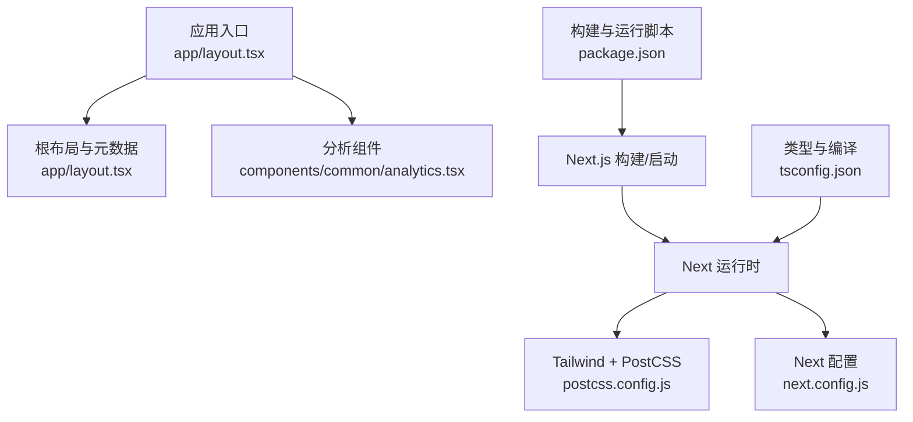
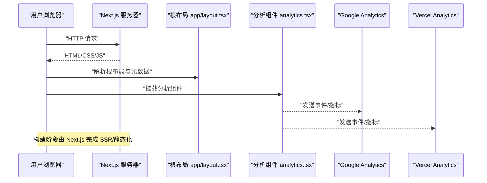
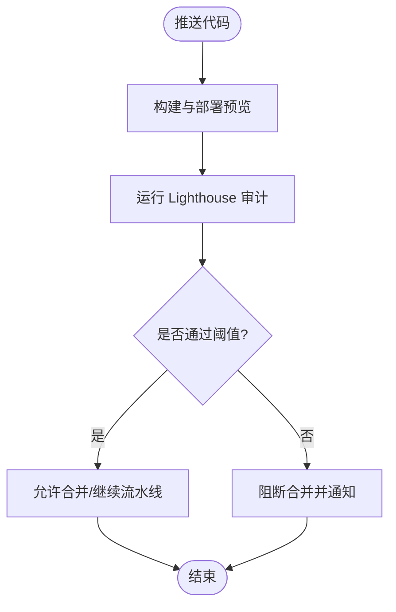

# 性能测试与诊断

<cite>
**本文引用的文件**
- [package.json](file://package.json)
- [next.config.js](file://next.config.js)
- [postcss.config.js](file://postcss.config.js)
- [tsconfig.json](file://tsconfig.json)
- [README.md](file://README.md)
- [app/layout.tsx](file://app/layout.tsx)
- [components/common/analytics.tsx](file://components/common/analytics.tsx)
</cite>

## 目录
1. [简介](#简介)
2. [项目结构](#项目结构)
3. [核心组件](#核心组件)
4. [架构总览](#架构总览)
5. [详细组件分析](#详细组件分析)
6. [依赖分析](#依赖分析)
7. [性能注意事项](#性能注意事项)
8. [故障排查指南](#故障排查指南)
9. [结论](#结论)
10. [附录](#附录)

## 简介
本指南面向使用 Next.js 构建的个人作品集项目，目标是建立一套完整的性能测试与诊断流程，覆盖本地开发、预发布与生产环境。内容涵盖：
- 使用 Lighthouse 进行移动端/桌面端审计与评分优化
- 使用 Chrome DevTools 进行网络瀑布图、内存分析与渲染性能分析
- 配置并使用 Webpack Bundle Analyzer（通过 Next.js 集成）分析包大小与依赖关系
- 使用 Performance API 测量 Core Web Vitals 并上报监控
- 在 CI/CD 中自动化性能回归检测，确保持续保持优秀体验

本项目已具备基础的性能友好实践（如图片优先加载、字体优化、第三方脚本按需加载等），本指南在此基础上提供系统化方法与可执行步骤。

## 项目结构
该仓库采用 Next.js App Router 组织页面与路由，样式基于 Tailwind CSS 4，并通过 PostCSS 处理；根布局负责元数据、字体、主题、分析工具与第三方脚本注入。关键配置文件包括 package.json（脚本与依赖）、next.config.js（Next 配置）、postcss.config.js（PostCSS 插件）、tsconfig.json（TypeScript 编译选项）。

图表来源
- [app/layout.tsx:1-145](file://app/layout.tsx#L1-L145)
- [components/common/analytics.tsx:1-8](file://components/common/analytics.tsx#L1-L8)
- [package.json:1-73](file://package.json#L1-L73)
- [postcss.config.js:1-6](file://postcss.config.js#L1-L6)
- [next.config.js:1-25](file://next.config.js#L1-L25)
- [tsconfig.json:1-43](file://tsconfig.json#L1-L43)

章节来源
- [package.json:1-73](file://package.json#L1-L73)
- [next.config.js:1-25](file://next.config.js#L1-L25)
- [postcss.config.js:1-6](file://postcss.config.js#L1-L6)
- [tsconfig.json:1-43](file://tsconfig.json#L1-L43)
- [app/layout.tsx:1-145](file://app/layout.tsx#L1-L145)
- [components/common/analytics.tsx:1-8](file://components/common/analytics.tsx#L1-L8)

## 核心组件
- 根布局与元数据：定义站点标题、描述、Open Graph/Twitter 卡片、图标、manifest、robots 等，有助于 SEO 与社交分享预览质量，间接影响性能感知。
- 分析组件：封装 Vercel Analytics，便于在客户端启用性能与交互指标采集。
- 构建与运行脚本：提供 dev/build/start/lint 等命令，用于本地开发与构建产物生成。
- 样式与类型：Tailwind + PostCSS 管线与 TypeScript 编译选项，保证构建效率与类型安全。

章节来源
- [app/layout.tsx:30-97](file://app/layout.tsx#L30-L97)
- [components/common/analytics.tsx:1-8](file://components/common/analytics.tsx#L1-L8)
- [package.json:5-10](file://package.json#L5-L10)
- [postcss.config.js:1-6](file://postcss.config.js#L1-L6)
- [tsconfig.json:1-43](file://tsconfig.json#L1-L43)

## 架构总览
下图展示了从浏览器请求到服务端渲染、再到客户端分析的端到端流程，以及性能数据采集点。

图表来源
- [app/layout.tsx:105-142](file://app/layout.tsx#L105-L142)
- [components/common/analytics.tsx:1-8](file://components/common/analytics.tsx#L1-L8)

## 详细组件分析

### Lighthouse 审计与优化（移动端/桌面端）
- 目标
  - 获取移动端与桌面端的综合评分与 Core Web Vitals 指标
  - 识别性能瓶颈（资源体积、缓存策略、渲染阻塞、图片优化等）
  - 制定优化清单并验证改进效果
- 操作步骤
  - 本地开发：启动开发服务器后，打开 Chrome DevTools -> Lighthouse，选择“移动设备”或“桌面设备”，勾选性能、可访问性、最佳实践、SEO 等类别，生成报告
  - 远程/CI：使用 Lighthouse CI 或 GitHub Actions 对部署预览地址定期审计，设置阈值告警
- 常见优化要点（结合本项目）
  - 图片与媒体：确保使用 Next Image 的优先级与尺寸控制，避免阻塞首屏
  - 字体与样式：利用 next/font 与 Tailwind 按需生成 CSS，减少无用样式
  - 第三方脚本：使用 Next Script 的加载策略（如 afterInteractive）延迟非关键脚本
  - 缓存与压缩：借助托管平台（如 Vercel）的 CDN 与压缩能力
- 参考实现位置
  - 根布局中的第三方脚本加载策略与 Google Analytics 集成
  - README 中关于性能与响应式优化的说明

章节来源
- [app/layout.tsx:134-141](file://app/layout.tsx#L134-L141)
- [README.md:116-127](file://README.md#L116-L127)

### Chrome DevTools 性能面板使用指南
- 网络瀑布图
  - 用途：观察资源加载顺序、并发限制、重定向、缓存命中情况
  - 关注点：大资源、重复请求、未缓存资源、阻塞关键路径
- 内存分析
  - 用途：定位内存泄漏、长生命周期对象、未释放监听器
  - 操作：录制堆快照、比较快照差异、查找保留链
- 渲染性能分析
  - 用途：识别掉帧、主线程阻塞、过度重排/重绘
  - 操作：开启性能录制，查看火焰图与帧率曲线
- 建议
  - 在真实设备上测试，模拟慢网络与中等 CPU
  - 结合 Lighthouse 报告交叉验证

[本节为通用操作指南，不直接分析具体代码文件]

### Webpack Bundle Analyzer 配置与使用（Next.js）
- 背景
  - Next.js 默认使用 Turbopack/Webpack 构建，可通过环境变量与插件启用 Bundle Analyzer
- 配置步骤
  - 安装依赖：添加 @next/bundle-analyzer 到开发依赖
  - 启用方式：在构建时设置环境变量以生成分析报告
  - 查看报告：构建完成后打开生成的 HTML 报告，分析各模块体积与依赖关系
- 优化方向
  - 拆分与懒加载：将大型库按需引入或使用动态导入
  - 去重与版本对齐：避免重复依赖版本导致打包膨胀
  - Tree-shaking：确保无副作用的库被正确摇树
- 注意
  - 仅在开发/预发布环境启用，避免影响生产构建速度

[本节为通用配置指南，不直接分析具体代码文件]

### Performance API 与 Core Web Vitals 测量
- 指标说明
  - LCP（最大内容绘制）：衡量主要内容可见时间
  - FID/INP（首次输入延迟/交互至下次绘制）：衡量交互响应性
  - CLS（累积布局偏移）：衡量视觉稳定性
- 实现思路
  - 使用 web-vitals 库或原生 Performance API 收集指标
  - 在关键页面或全局埋点上报至分析平台（如 Vercel Analytics、自定义后端）
  - 结合根布局中的分析组件，统一接入上报逻辑
- 监控与告警
  - 设定阈值（如 LCP < 2.5s，CLS < 0.1，INP < 200ms）
  - 在 CI/CD 或线上监控中触发告警，及时回滚或修复

章节来源
- [components/common/analytics.tsx:1-8](file://components/common/analytics.tsx#L1-L8)
- [app/layout.tsx:105-141](file://app/layout.tsx#L105-L141)

### CI/CD 中的自动化性能回归检测
- 目标
  - 每次提交或合并请求自动执行性能审计，防止性能退化
- 推荐方案
  - Lighthouse CI：对部署预览链接执行 Lighthouse 审计，设置分数阈值，失败则阻断合并
  - 性能预算：结合 Bundle Analyzer 输出，设置包大小上限
  - 基准对比：记录基线指标，增量变更时对比差异
- 流程示意

[本节为通用流程设计，不直接分析具体代码文件]

## 依赖分析
- 构建与运行
  - Next.js 作为框架与运行时，提供 SSR/静态化、路由、图片优化等能力
  - React 19 与 TypeScript 提供现代前端开发与类型安全
  - Tailwind CSS 4 + PostCSS 提供原子化样式与高效构建
- 分析与监控
  - Vercel Analytics 与 Google Analytics 用于线上行为与性能指标采集
- 潜在优化点
  - 评估第三方库必要性，移除冗余依赖
  - 使用按需引入与动态导入减少首屏体积
  - 合理设置字体加载策略与图片优化参数

章节来源
- [package.json:11-56](file://package.json#L11-L56)
- [postcss.config.js:1-6](file://postcss.config.js#L1-L6)
- [app/layout.tsx:3-11](file://app/layout.tsx#L3-L11)

## 性能注意事项
- 首屏优化
  - 最小化关键 CSS/JS，延迟非关键脚本
  - 合理使用 next/font 与字体子集，避免 FOIT/FOUT
  - 图片使用 Next Image，设置合适宽高与优先级
- 缓存与传输
  - 启用 gzip/brotli 压缩与 HTTP 缓存头
  - 利用 CDN 缓存静态资源与 API 响应
- 渲染与交互
  - 避免主线程长时间阻塞任务，拆分计算密集型逻辑
  - 使用虚拟列表或分页减少 DOM 节点数量
- 监控与迭代
  - 定期运行 Lighthouse 与 DevTools 分析
  - 建立性能基线与回归告警机制

[本节为通用指导，不直接分析具体代码文件]

## 故障排查指南
- 常见问题
  - 缺少分析 ID：根布局中要求配置 Google Analytics ID，缺失会抛出错误
  - 第三方脚本加载失败：检查策略与域名白名单，确认异步加载不影响首屏
  - 构建产物过大：启用 Bundle Analyzer 定位大依赖，考虑拆分与懒加载
- 排查步骤
  - 使用 DevTools Network 面板检查资源加载与错误
  - 使用 Memory 面板排查内存泄漏
  - 使用 Performance 面板定位掉帧与主线程阻塞
  - 使用 Lighthouse 报告定位具体问题项并逐项修复

章节来源
- [app/layout.tsx:100-103](file://app/layout.tsx#L100-L103)
- [app/layout.tsx:134-141](file://app/layout.tsx#L134-L141)

## 结论
通过系统化的 Lighthouse 审计、Chrome DevTools 深度分析、Bundle Analyzer 包体积诊断、Performance API 指标监控以及 CI/CD 自动化回归检测，可以持续保障 Next.js 作品集项目的性能表现。建议将上述流程纳入日常开发规范，形成“度量—分析—优化—验证”的闭环，确保用户体验始终处于优秀水平。

## 附录
- 快速开始
  - 安装依赖并启动开发服务器
  - 打开 DevTools 运行 Lighthouse 与性能录制
  - 构建后启用 Bundle Analyzer 查看报告
- 参考
  - README 中关于性能与响应式的说明
  - 根布局中的分析组件与脚本加载策略

章节来源
- [README.md:44-77](file://README.md#L44-L77)
- [README.md:116-127](file://README.md#L116-L127)
- [app/layout.tsx:105-141](file://app/layout.tsx#L105-L141)