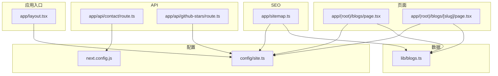
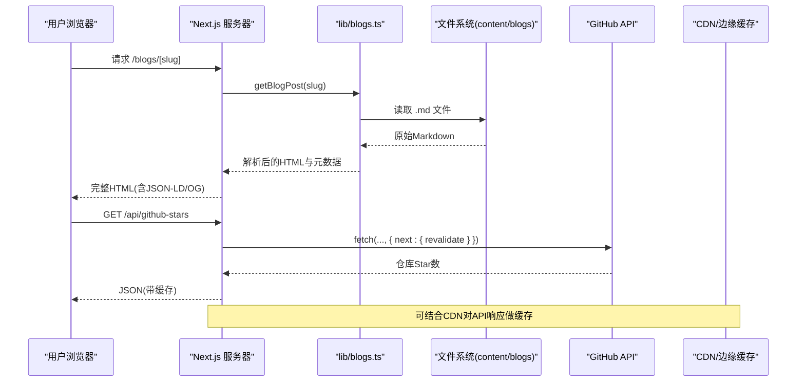
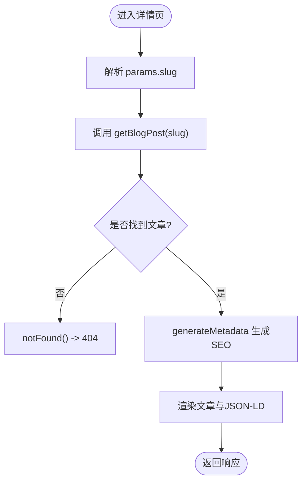
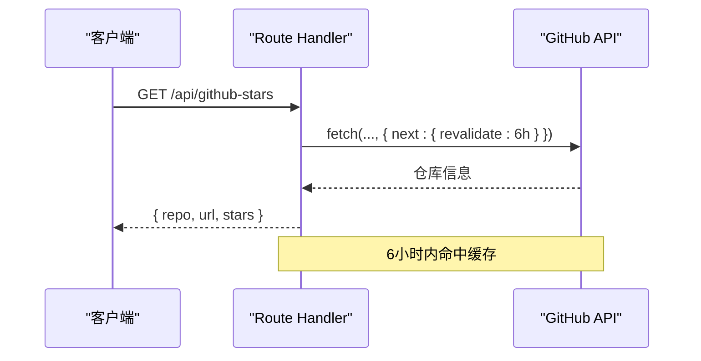
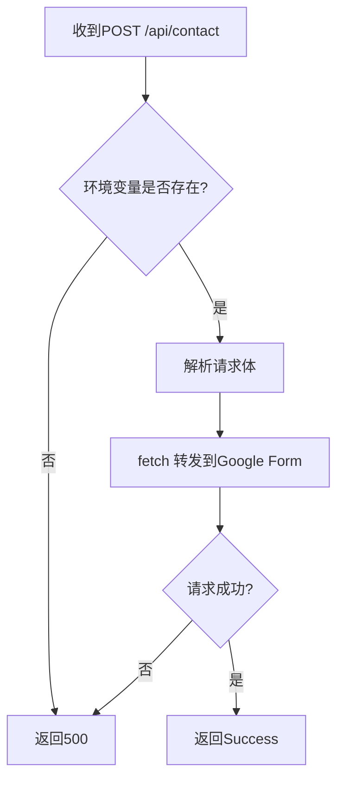
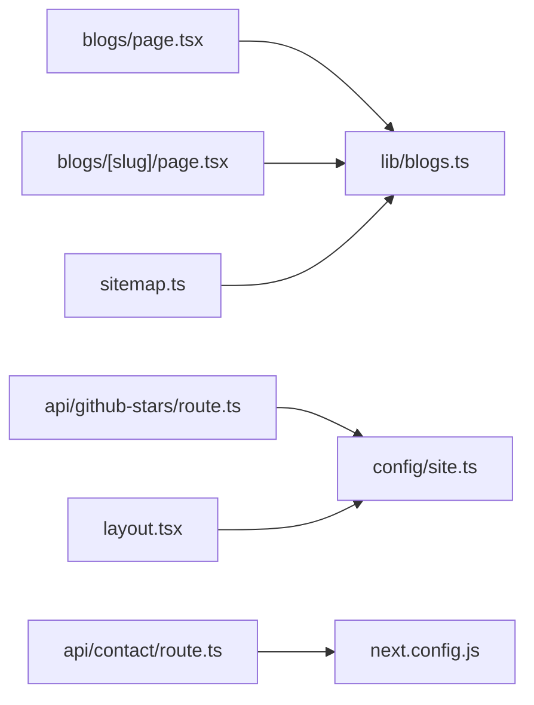

# 服务端性能优化

<cite>
**本文引用的文件**
- [next.config.js](file://next.config.js)
- [app/sitemap.ts](file://app/sitemap.ts)
- [lib/blogs.ts](file://lib/blogs.ts)
- [app/(root)/blogs/page.tsx](file://app/(root)/blogs/page.tsx)
- [app/(root)/blogs/[slug]/page.tsx](file://app/(root)/blogs/[slug]/page.tsx)
- [app/api/contact/route.ts](file://app/api/contact/route.ts)
- [app/api/github-stars/route.ts](file://app/api/github-stars/route.ts)
- [config/site.ts](file://config/site.ts)
- [app/layout.tsx](file://app/layout.tsx)
- [package.json](file://package.json)
</cite>

## 目录
1. [简介](#简介)
2. [项目结构](#项目结构)
3. [核心组件](#核心组件)
4. [架构总览](#架构总览)
5. [详细组件分析](#详细组件分析)
6. [依赖关系分析](#依赖关系分析)
7. [性能考量](#性能考量)
8. [故障排查指南](#故障排查指南)
9. [结论](#结论)
10. [附录](#附录)

## 简介
本指南面向 Next.js 投资组合项目的服务端性能优化，聚焦以下目标：
- SSR（服务器端渲染）与 ISR（增量静态再生成）的配置与适用场景
- API 路由的性能优化：缓存策略、请求合并与错误处理
- 数据获取模式与 Server Components 的使用
- Sitemap 生成优化与 SEO 相关性能考虑
- CDN 配置、缓存头设置与压缩传输等后端优化技术
- 确保服务端响应速度快且资源利用率高

## 项目结构
本项目采用 App Router 组织页面与 API 路由，内容型数据通过 Markdown + gray-matter 在构建期或运行时读取，Sitemap 由 app/sitemap.ts 动态生成。关键路径包括：
- 页面层：app/(root)/... 下的页面组件，使用 Metadata 与 JSON-LD 增强 SEO
- API 层：app/api/... 下的 Route Handlers
- 数据层：lib/blogs.ts 提供博客元数据与内容解析
- 站点配置：config/site.ts 集中站点元信息
- 根布局：app/layout.tsx 定义全局元信息与第三方脚本加载策略

图表来源
- [app/layout.tsx:30-97](file://app/layout.tsx#L30-L97)
- [app/(root)/blogs/page.tsx:1-40](file://app/(root)/blogs/page.tsx#L1-L40)
- [app/(root)/blogs/[slug]/page.tsx:20-79](file://app/(root)/blogs/[slug]/page.tsx#L20-L79)
- [app/api/github-stars/route.ts:1-44](file://app/api/github-stars/route.ts#L1-L44)
- [app/api/contact/route.ts:1-31](file://app/api/contact/route.ts#L1-L31)
- [lib/blogs.ts:1-97](file://lib/blogs.ts#L1-L97)
- [config/site.ts:1-41](file://config/site.ts#L1-L41)
- [next.config.js:1-24](file://next.config.js#L1-L24)
- [app/sitemap.ts:1-72](file://app/sitemap.ts#L1-L72)

章节来源
- [app/layout.tsx:30-97](file://app/layout.tsx#L30-L97)
- [app/(root)/blogs/page.tsx:1-40](file://app/(root)/blogs/page.tsx#L1-L40)
- [app/(root)/blogs/[slug]/page.tsx:20-79](file://app/(root)/blogs/[slug]/page.tsx#L20-L79)
- [app/api/github-stars/route.ts:1-44](file://app/api/github-stars/route.ts#L1-L44)
- [app/api/contact/route.ts:1-31](file://app/api/contact/route.ts#L1-L31)
- [lib/blogs.ts:1-97](file://lib/blogs.ts#L1-L97)
- [config/site.ts:1-41](file://config/site.ts#L1-L41)
- [next.config.js:1-24](file://next.config.js#L1-L24)
- [app/sitemap.ts:1-72](file://app/sitemap.ts#L1-L72)

## 核心组件
- 博客数据层 lib/blogs.ts：提供 getAllBlogsMeta、getBlogPost、getFeaturedBlogs 等函数，负责读取 content/blogs/*.md，解析 frontmatter 与 Markdown 为 HTML。
- 博客列表页 app/(root)/blogs/page.tsx：使用 getAllBlogsMeta 在服务端渲染列表，注入 SEO 元数据与 JSON-LD。
- 博客详情页 app/(root)/blogs/[slug]/page.tsx：使用 generateStaticParams 预渲染所有文章；generateMetadata 基于文章内容生成 SEO；页面内渲染结构化数据与内容。
- API 路由：
  - app/api/contact/route.ts：接收表单并转发到 Google Form，包含环境变量校验与错误处理。
  - app/api/github-stars/route.ts：调用 GitHub API 获取仓库 Star 数，内置 revalidate 缓存。
- 站点配置 config/site.ts：集中站点 URL、社交链接、OG 图片等。
- 根布局 app/layout.tsx：全局 metadata、字体、主题、第三方脚本加载策略。
- Sitemap app/sitemap.ts：聚合主站路由与博客文章路由，设置 lastModified/changeFrequency/priority。
- Next 配置 next.config.js：自定义 headers（当前仅针对特定路径）。

章节来源
- [lib/blogs.ts:1-97](file://lib/blogs.ts#L1-L97)
- [app/(root)/blogs/page.tsx:1-40](file://app/(root)/blogs/page.tsx#L1-L40)
- [app/(root)/blogs/[slug]/page.tsx:20-79](file://app/(root)/blogs/[slug]/page.tsx#L20-L79)
- [app/api/contact/route.ts:1-31](file://app/api/contact/route.ts#L1-L31)
- [app/api/github-stars/route.ts:1-44](file://app/api/github-stars/route.ts#L1-L44)
- [config/site.ts:1-41](file://config/site.ts#L1-L41)
- [app/layout.tsx:30-97](file://app/layout.tsx#L30-L97)
- [app/sitemap.ts:1-72](file://app/sitemap.ts#L1-L72)
- [next.config.js:1-24](file://next.config.js#L1-L24)

## 架构总览
下图展示了从浏览器到服务端的关键数据流与缓存点：

图表来源
- [app/(root)/blogs/[slug]/page.tsx:81-177](file://app/(root)/blogs/[slug]/page.tsx#L81-L177)
- [lib/blogs.ts:64-82](file://lib/blogs.ts#L64-L82)
- [app/api/github-stars/route.ts:17-43](file://app/api/github-stars/route.ts#L17-L43)

## 详细组件分析

### 博客数据层 lib/blogs.ts
- 职责：读取 content/blogs 目录，解析 frontmatter 与 Markdown，返回元数据与 HTML。
- 关键点：
  - getAllBlogsMeta：同步读取所有 .md，排序后返回元数据，适合列表页与服务端渲染。
  - getBlogPost：异步解析单个文章，将 Markdown 转为 HTML，供详情页使用。
  - ensureBlogsDir：保证目录存在，避免构建期缺失导致异常。
- 复杂度：
  - 列表：O(N) 扫描与排序，N 为文章数量。
  - 单篇：I/O 读取一次文件 + Markdown 解析，时间复杂度取决于内容长度。
- 优化建议：
  - 对高频访问的热门文章可做内存级缓存（如 Map<slug, BlogPost>），减少重复 I/O。
  - 若文章量增长，可考虑按标签/分类分片存储或引入轻量数据库。

章节来源
- [lib/blogs.ts:29-97](file://lib/blogs.ts#L29-L97)

### 博客列表页 app/(root)/blogs/page.tsx
- 职责：在服务端获取博客列表，渲染卡片网格，注入 SEO 元数据与 JSON-LD。
- 性能要点：
  - 使用 getAllBlogsMeta 在服务端执行，首屏无额外网络请求。
  - 通过 Script 注入 CollectionPage/Blog 结构化数据，提升搜索引擎理解。
- 可扩展：
  - 分页/懒加载：当文章较多时，可改为分页或虚拟滚动，降低首屏体积。
  - 图片优化：封面图使用 next/image 并设置合适尺寸与占位。

章节来源
- [app/(root)/blogs/page.tsx:1-153](file://app/(root)/blogs/page.tsx#L1-L153)

### 博客详情页 app/(root)/blogs/[slug]/page.tsx
- 职责：根据 slug 渲染单篇文章，生成动态 metadata，注入 JSON-LD。
- 构建期/运行期：
  - generateStaticParams：构建时枚举所有 slug，实现全量静态化（SSG）。
  - generateMetadata：基于文章内容生成 SEO 元信息。
- 性能要点：
  - 静态化页面命中 CDN 概率高，首字节时间低。
  - 结构化数据（BlogPosting、BreadcrumbList）有助于富摘要展示。
- 错误处理：
  - 捕获异常并调用 notFound()，返回 404。

图表来源
- [app/(root)/blogs/[slug]/page.tsx:20-89](file://app/(root)/blogs/[slug]/page.tsx#L20-L89)
- [lib/blogs.ts:64-82](file://lib/blogs.ts#L64-L82)

章节来源
- [app/(root)/blogs/[slug]/page.tsx:20-177](file://app/(root)/blogs/[slug]/page.tsx#L20-L177)
- [lib/blogs.ts:64-82](file://lib/blogs.ts#L64-L82)

### API 路由：GitHub Stars app/api/github-stars/route.ts
- 缓存策略：
  - 使用 fetch 的 next.revalidate 进行 ISR 级别缓存，过期时间 6 小时。
  - 建议在部署平台（如 Vercel）开启 CDN 缓存，进一步降低上游请求。
- 错误处理：
  - 非 2xx 或解析失败返回 null，最终仍返回稳定结构（stars 可为 null）。
- 扩展建议：
  - 增加重试与退避策略，提高稳定性。
  - 对频繁请求的客户端侧做本地缓存（如 localStorage/IndexedDB）以减少 API 调用。

图表来源
- [app/api/github-stars/route.ts:17-43](file://app/api/github-stars/route.ts#L17-L43)

章节来源
- [app/api/github-stars/route.ts:1-44](file://app/api/github-stars/route.ts#L1-L44)

### API 路由：联系表单 app/api/contact/route.ts
- 流程：校验环境变量 -> 解析请求体 -> 转发到 Google Form -> 返回成功/错误。
- 错误处理：
  - 缺少环境变量直接返回 500。
  - 外部请求异常捕获并返回 500。
- 安全与可靠性：
  - 建议对输入进行校验（如 Zod），限制字段长度与格式。
  - 对外部服务调用增加超时与重试上限，避免阻塞。

图表来源
- [app/api/contact/route.ts:3-31](file://app/api/contact/route.ts#L3-L31)

章节来源
- [app/api/contact/route.ts:1-31](file://app/api/contact/route.ts#L1-L31)

### Sitemap 生成 app/sitemap.ts
- 聚合主站路由与博客文章路由，设置 lastModified、changeFrequency、priority。
- 性能影响：
  - 构建期生成，不增加运行时开销。
  - 合理设置 changeFrequency 与 priority 有助于搜索引擎抓取效率。
- 扩展：
  - 可按模块拆分 sitemap 或使用 sitemap index（当站点规模扩大时）。

章节来源
- [app/sitemap.ts:1-72](file://app/sitemap.ts#L1-L72)

### 根布局与全局 SEO app/layout.tsx
- 全局 metadata：title、description、keywords、Open Graph、Twitter Card、robots、验证信息等。
- 第三方脚本：
  - 使用 next/script 的 strategy="afterInteractive" 延迟加载，避免阻塞首屏。
- 性能建议：
  - 谨慎添加第三方脚本，按需加载与去重。
  - 使用 preload/prefetch 优化关键资源。

章节来源
- [app/layout.tsx:30-97](file://app/layout.tsx#L30-L97)
- [app/layout.tsx:134-142](file://app/layout.tsx#L134-L142)

### Next 配置 next.config.js
- 当前仅对特定路径设置 CORS 相关头部。
- 建议：
  - 为静态资源与 API 设置合适的 Cache-Control 与跨域策略。
  - 启用 gzip/br 压缩（通常由部署平台自动处理）。

章节来源
- [next.config.js:1-24](file://next.config.js#L1-L24)

## 依赖关系分析
- 页面与数据：
  - 博客列表/详情依赖 lib/blogs.ts 提供的数据接口。
  - 详情页依赖 generateStaticParams 进行全量静态化。
- API 与外部服务：
  - GitHub Stars 路由依赖 GitHub API，并通过 revalidate 控制缓存。
  - 联系表单路由依赖 Google Form，需环境变量配置。
- 站点配置：
  - 多处引用 config/site.ts 统一站点元信息，便于维护与一致性。

图表来源
- [app/(root)/blogs/page.tsx:1-40](file://app/(root)/blogs/page.tsx#L1-L40)
- [app/(root)/blogs/[slug]/page.tsx:20-79](file://app/(root)/blogs/[slug]/page.tsx#L20-L79)
- [app/sitemap.ts:1-72](file://app/sitemap.ts#L1-L72)
- [app/api/github-stars/route.ts:1-44](file://app/api/github-stars/route.ts#L1-L44)
- [app/api/contact/route.ts:1-31](file://app/api/contact/route.ts#L1-L31)
- [config/site.ts:1-41](file://config/site.ts#L1-L41)
- [next.config.js:1-24](file://next.config.js#L1-L24)
- [app/layout.tsx:30-97](file://app/layout.tsx#L30-L97)

章节来源
- [app/(root)/blogs/page.tsx:1-40](file://app/(root)/blogs/page.tsx#L1-L40)
- [app/(root)/blogs/[slug]/page.tsx:20-79](file://app/(root)/blogs/[slug]/page.tsx#L20-L79)
- [app/sitemap.ts:1-72](file://app/sitemap.ts#L1-L72)
- [app/api/github-stars/route.ts:1-44](file://app/api/github-stars/route.ts#L1-L44)
- [app/api/contact/route.ts:1-31](file://app/api/contact/route.ts#L1-L31)
- [config/site.ts:1-41](file://config/site.ts#L1-L41)
- [next.config.js:1-24](file://next.config.js#L1-L24)
- [app/layout.tsx:30-97](file://app/layout.tsx#L30-L97)

## 性能考量
- SSR 与 ISR
  - 博客详情页使用 generateStaticParams 实现全量静态化，适合内容稳定的文章，利于 CDN 缓存与快速首屏。
  - API 路由使用 next.revalidate 实现 ISR 级别的增量更新，平衡新鲜度与性能。
- 数据获取模式
  - 列表页在服务端直接读取 Markdown，避免客户端渲染开销。
  - 对于高频访问的文章，可在内存中缓存解析结果，减少重复 I/O。
- 缓存策略
  - API 层：GitHub Stars 已设置 6 小时 revalidate；建议结合部署平台的 CDN 缓存。
  - 静态资源：通过 next/image 与静态文件托管于 CDN，设置合理的 Cache-Control。
- 压缩传输
  - 部署平台通常默认启用 gzip/br；必要时可在反向代理层配置压缩。
- 请求合并
  - 前端如需多次获取相似数据，可在客户端或服务端进行合并，减少网络往返。
- 错误处理
  - API 路由统一捕获异常并返回明确状态码；详情页对不存在内容返回 404。
- 资源优化
  - 使用 next/font 与 localFont 减少字体加载阻塞。
  - 第三方脚本使用 afterInteractive 策略，避免阻塞首屏。

[本节为通用性能指导，不直接分析具体文件]

## 故障排查指南
- 环境变量缺失
  - 联系表单路由在未配置 GOOGLE_FORM_LINK 等变量时返回 500。请检查部署环境的环境变量。
- 外部服务不可用
  - GitHub API 调用失败时返回 null；可增加重试与降级逻辑。
- 构建期静态参数
  - generateStaticParams 依赖 getAllBlogSlugs，若 content/blogs 为空或权限问题会导致构建失败。
- 缓存未生效
  - 确认部署平台启用了 CDN 缓存；API 路由的 revalidate 仅在服务端生效，客户端仍需遵循 HTTP 缓存头。

章节来源
- [app/api/contact/route.ts:3-31](file://app/api/contact/route.ts#L3-L31)
- [app/api/github-stars/route.ts:17-43](file://app/api/github-stars/route.ts#L17-L43)
- [app/(root)/blogs/[slug]/page.tsx:20-23](file://app/(root)/blogs/[slug]/page.tsx#L20-L23)

## 结论
本项目通过静态化博客详情页、ISR 缓存 API 响应、完善的 SEO 元数据与结构化数据，实现了良好的服务端性能与可发现性。进一步优化方向包括：
- 为 API 路由增加更健壮的缓存与重试机制
- 对高频数据进行内存级缓存
- 结合 CDN 与合适的 Cache-Control 提升全局缓存命中率
- 持续监控与压测，确保在高并发下保持稳定与低延迟

[本节为总结性内容，不直接分析具体文件]

## 附录
- 关键依赖版本参考：Next.js 16.x、React 19.x、TypeScript 6.x（见 package.json）
- 站点配置集中在 config/site.ts，便于统一管理与变更

章节来源
- [package.json:1-73](file://package.json#L1-L73)
- [config/site.ts:1-41](file://config/site.ts#L1-L41)