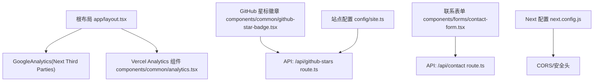
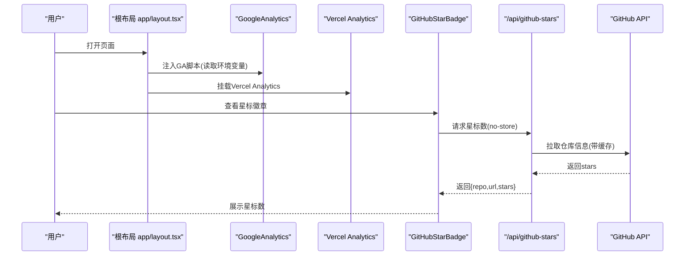
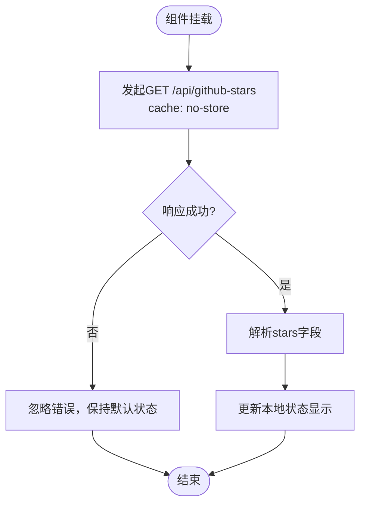
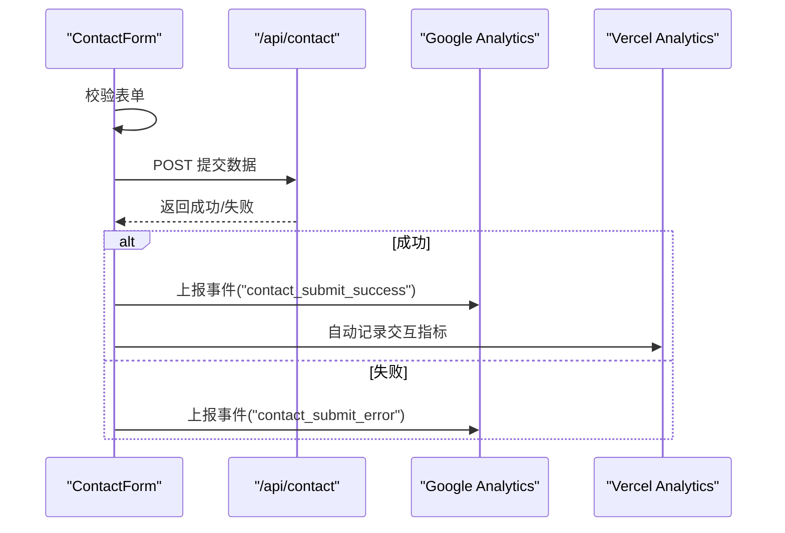
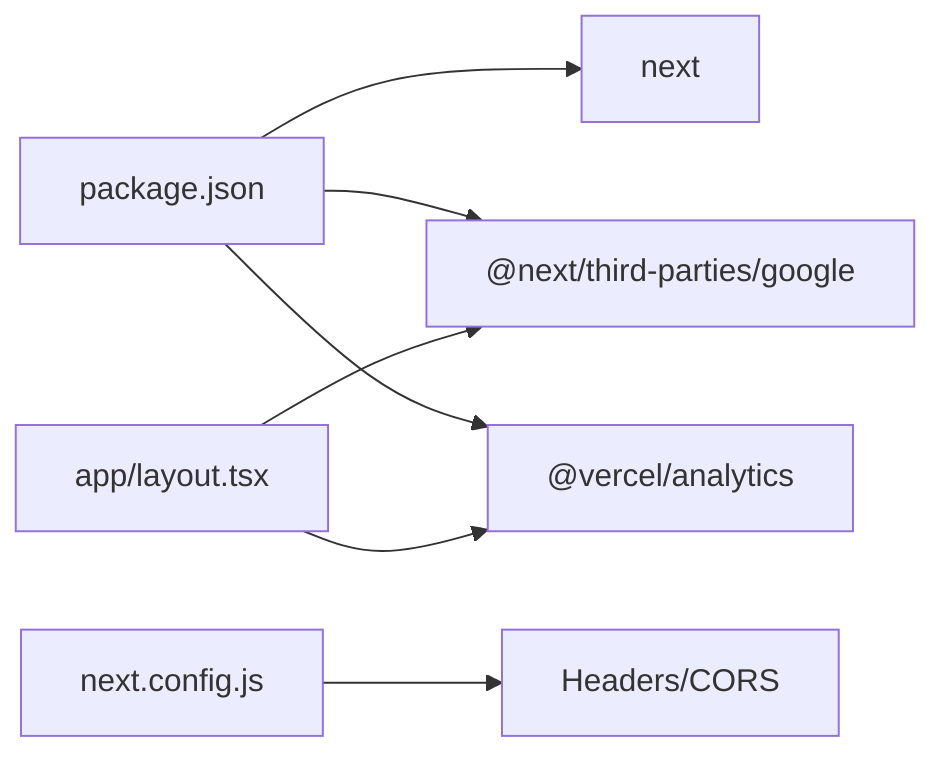

# 监控与分析

<cite>
**本文引用的文件**
- [app/layout.tsx](file://app/layout.tsx)
- [components/common/analytics.tsx](file://components/common/analytics.tsx)
- [components/common/github-star-badge.tsx](file://components/common/github-star-badge.tsx)
- [app/api/github-stars/route.ts](file://app/api/github-stars/route.ts)
- [components/forms/contact-form.tsx](file://components/forms/contact-form.tsx)
- [app/api/contact/route.ts](file://app/api/contact/route.ts)
- [next.config.js](file://next.config.js)
- [package.json](file://package.json)
- [config/site.ts](file://config/site.ts)
</cite>

## 目录
1. [简介](#简介)
2. [项目结构](#项目结构)
3. [核心组件](#核心组件)
4. [架构总览](#架构总览)
5. [详细组件分析](#详细组件分析)
6. [依赖关系分析](#依赖关系分析)
7. [性能考量](#性能考量)
8. [故障排查指南](#故障排查指南)
9. [结论](#结论)
10. [附录](#附录)

## 简介
本指南面向Next.js投资组合项目的监控与分析系统配置，覆盖以下目标：
- Google Analytics集成与事件跟踪、用户行为分析、页面访问统计
- Vercel Analytics的使用与性能指标、用户体验数据收集
- GitHub Stars徽章的动态加载与优化
- 自定义事件跟踪（按钮点击、表单提交、用户交互）
- 性能监控工具配置建议（Lighthouse CI、Web Vitals）
确保准确采集与分析网站性能与用户行为数据，为持续优化提供依据。

## 项目结构
本项目采用Next.js App Router组织页面与API路由，监控与分析相关代码主要分布在：
- 根布局中集成Google Analytics与Vercel Analytics
- 通用组件封装Vercel Analytics
- API路由用于GitHub Stars动态获取与联系表单转发
- 表单组件承载用户交互入口，便于接入自定义事件

图表来源
- [app/layout.tsx:1-145](file://app/layout.tsx#L1-L145)
- [components/common/analytics.tsx:1-8](file://components/common/analytics.tsx#L1-L8)
- [components/common/github-star-badge.tsx:1-63](file://components/common/github-star-badge.tsx#L1-L63)
- [app/api/github-stars/route.ts:1-44](file://app/api/github-stars/route.ts#L1-L44)
- [components/forms/contact-form.tsx:1-142](file://components/forms/contact-form.tsx#L1-L142)
- [app/api/contact/route.ts:1-30](file://app/api/contact/route.ts#L1-L30)
- [config/site.ts:1-41](file://config/site.ts#L1-L41)
- [next.config.js:1-25](file://next.config.js#L1-L25)

章节来源
- [app/layout.tsx:1-145](file://app/layout.tsx#L1-L145)
- [package.json:1-73](file://package.json#L1-L73)

## 核心组件
- 根布局中的Google Analytics集成：通过Next官方第三方组件注入GA脚本，并在构建时校验测量ID是否存在，缺失则抛出错误，避免无埋点运行。
- Vercel Analytics：以客户端组件形式引入，自动采集页面浏览、性能与交互等基础指标。
- GitHub Stars徽章：客户端组件发起异步请求到服务端API，拉取仓库星数并展示；服务端API缓存并调用GitHub API。
- 联系表单：前端使用React Hook Form进行校验，提交到后端API后转发至Google表单；可在此处扩展自定义事件上报。

章节来源
- [app/layout.tsx:99-142](file://app/layout.tsx#L99-L142)
- [components/common/analytics.tsx:1-8](file://components/common/analytics.tsx#L1-L8)
- [components/common/github-star-badge.tsx:1-63](file://components/common/github-star-badge.tsx#L1-L63)
- [app/api/github-stars/route.ts:1-44](file://app/api/github-stars/route.ts#L1-L44)
- [components/forms/contact-form.tsx:1-142](file://components/forms/contact-form.tsx#L1-L142)
- [app/api/contact/route.ts:1-30](file://app/api/contact/route.ts#L1-L30)

## 架构总览
下图展示了监控与分析在应用中的关键路径：页面渲染时注入GA与Vercel Analytics；用户交互触发表单或导航；GitHub Stars通过API动态加载；站点配置集中管理链接与元信息。

图表来源
- [app/layout.tsx:99-142](file://app/layout.tsx#L99-L142)
- [components/common/github-star-badge.tsx:17-36](file://components/common/github-star-badge.tsx#L17-L36)
- [app/api/github-stars/route.ts:17-43](file://app/api/github-stars/route.ts#L17-L43)

## 详细组件分析

### Google Analytics集成与页面访问统计
- 集成方式：在根布局中使用Next官方Google Analytics组件，传入测量ID。该ID从环境变量读取，若未配置则在启动时报错，确保生产环境不会静默失败。
- 页面访问统计：GA默认记录页面浏览、来源、设备信息等；可通过Next路由变化自动追踪SPA页面切换。
- 建议扩展：如需更细粒度事件（如特定按钮点击），可在业务组件中调用analytics事件上报函数（例如通过window.gtag或自定义封装）。

章节来源
- [app/layout.tsx:99-142](file://app/layout.tsx#L99-L142)

### Vercel Analytics使用与用户体验数据
- 集成方式：通过客户端组件引入Vercel Analytics，无需额外配置即可采集页面性能、交互与错误等指标。
- 指标范围：包含Core Web Vitals、首字节时间、资源加载耗时、用户交互延迟等，有助于评估用户体验。
- 部署建议：在Vercel平台部署时，Vercel Analytics会自动关联项目，便于在Dashboard中查看趋势与异常。

章节来源
- [components/common/analytics.tsx:1-8](file://components/common/analytics.tsx#L1-L8)
- [app/layout.tsx:129-131](file://app/layout.tsx#L129-L131)

### GitHub Stars徽章动态加载与优化
- 客户端行为：徽章组件在挂载时发起异步请求，设置no-store以避免缓存导致的数据滞后；请求失败时忽略错误，保证UI可用。
- 服务端缓存：API层对GitHub API响应设置了合理的revalidate周期，降低外部依赖压力。
- 配置来源：仓库地址来源于站点配置，便于统一管理与多环境切换。

图表来源
- [components/common/github-star-badge.tsx:17-36](file://components/common/github-star-badge.tsx#L17-L36)
- [app/api/github-stars/route.ts:17-43](file://app/api/github-stars/route.ts#L17-L43)
- [config/site.ts:8-12](file://config/site.ts#L8-L12)

章节来源
- [components/common/github-star-badge.tsx:1-63](file://components/common/github-star-badge.tsx#L1-L63)
- [app/api/github-stars/route.ts:1-44](file://app/api/github-stars/route.ts#L1-L44)
- [config/site.ts:1-41](file://config/site.ts#L1-L41)

### 自定义事件跟踪实现方法
- 表单提交事件：在联系表单的提交处理函数中，可在成功回调处添加事件上报逻辑（例如记录“提交成功”、“提交失败”及字段类型），以便分析转化率与问题定位。
- 按钮点击事件：对于关键CTA按钮（如“开始项目”、“下载简历”），可在onClick中上报事件，携带按钮名称、所在页面等上下文。
- 用户交互行为：滚动、模态框打开/关闭、主题切换等均可作为事件上报，帮助理解用户偏好与页面热区。

图表来源
- [components/forms/contact-form.tsx:47-71](file://components/forms/contact-form.tsx#L47-L71)
- [app/api/contact/route.ts:1-30](file://app/api/contact/route.ts#L1-L30)

章节来源
- [components/forms/contact-form.tsx:1-142](file://components/forms/contact-form.tsx#L1-L142)
- [app/api/contact/route.ts:1-30](file://app/api/contact/route.ts#L1-L30)

### 性能监控工具配置建议
- Lighthouse CI：建议在CI流水线中为关键页面执行Lighthouse审计，输出性能分数与改进建议，阻断低分合并。
- Web Vitals：结合Vercel Analytics与浏览器原生Performance API，采集CLS、FID/INP、LCP等指标，建立告警阈值。
- 资源优化：图片使用Next Image并设置尺寸与优先级；字体使用预加载；CSS按需加载，减少阻塞。

[本节为通用指导，不直接分析具体文件]

## 依赖关系分析
- 运行时依赖：
  - Next.js框架与App Router
  - @next/third-parties/google用于GA集成
  - @vercel/analytics用于性能与交互数据采集
- 配置与脚本：
  - package.json定义了依赖版本与脚本命令
  - next.config.js配置了CORS与安全头，保障API跨域访问

图表来源
- [package.json:11-43](file://package.json#L11-L43)
- [next.config.js:3-21](file://next.config.js#L3-L21)
- [app/layout.tsx:3-8](file://app/layout.tsx#L3-L8)

章节来源
- [package.json:1-73](file://package.json#L1-L73)
- [next.config.js:1-25](file://next.config.js#L1-L25)

## 性能考量
- 首屏性能：启用字体预加载、图片懒加载与优先策略，减少主线程阻塞。
- 网络优化：对GitHub API响应设置合理缓存周期，避免频繁请求；前端请求使用no-store确保实时性。
- 监控闭环：通过Vercel Analytics与GA聚合指标，结合Lighthouse CI持续回归，形成“采集—分析—优化”的闭环。

[本节为通用指导，不直接分析具体文件]

## 故障排查指南
- 缺少Google Analytics ID：根布局会在未配置测量ID时抛出错误，检查环境变量是否已正确设置。
- 表单提交失败：确认后端API所需的环境变量（如Google表单链接与字段ID）已配置；检查网络请求与响应状态。
- 徽章星数不更新：检查API层缓存策略与GitHub API可用性；确认前端请求未被拦截或缓存。

章节来源
- [app/layout.tsx:99-103](file://app/layout.tsx#L99-L103)
- [app/api/contact/route.ts:3-29](file://app/api/contact/route.ts#L3-L29)
- [components/common/github-star-badge.tsx:17-36](file://components/common/github-star-badge.tsx#L17-L36)
- [app/api/github-stars/route.ts:17-43](file://app/api/github-stars/route.ts#L17-L43)

## 结论
本项目已具备完善的监控与分析基础：
- 通过Google Analytics与Vercel Analytics实现页面访问与性能指标采集
- GitHub Stars徽章动态加载，提升可信度与用户体验
- 表单与交互入口预留事件上报位置，便于扩展自定义埋点
建议在此基础上完善事件埋点规范与性能基线，持续驱动产品优化。

[本节为总结性内容，不直接分析具体文件]

## 附录
- 环境变量清单（示例）
  - NEXT_PUBLIC_GOOGLE_MEASUREMENT_ID：Google Analytics测量ID
  - NEXT_PUBLIC_GOOGLE_VERIFICATION：Google搜索验证标识
  - GOOGLE_FORM_LINK：Google表单提交链接
  - GOOGLE_FORM_FIELD_ID_NAME/EMAIL/MESSAGE/SOCIAL：表单字段ID映射
- 部署注意事项
  - 在Vercel环境中确保上述环境变量已配置
  - 开启Vercel Analytics以自动采集性能与交互数据

[本节为补充说明，不直接分析具体文件]