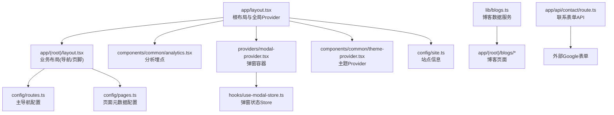
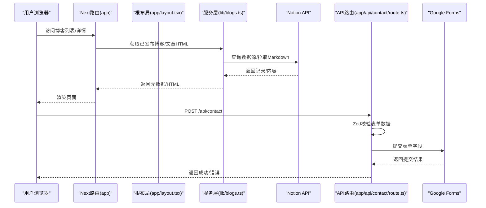
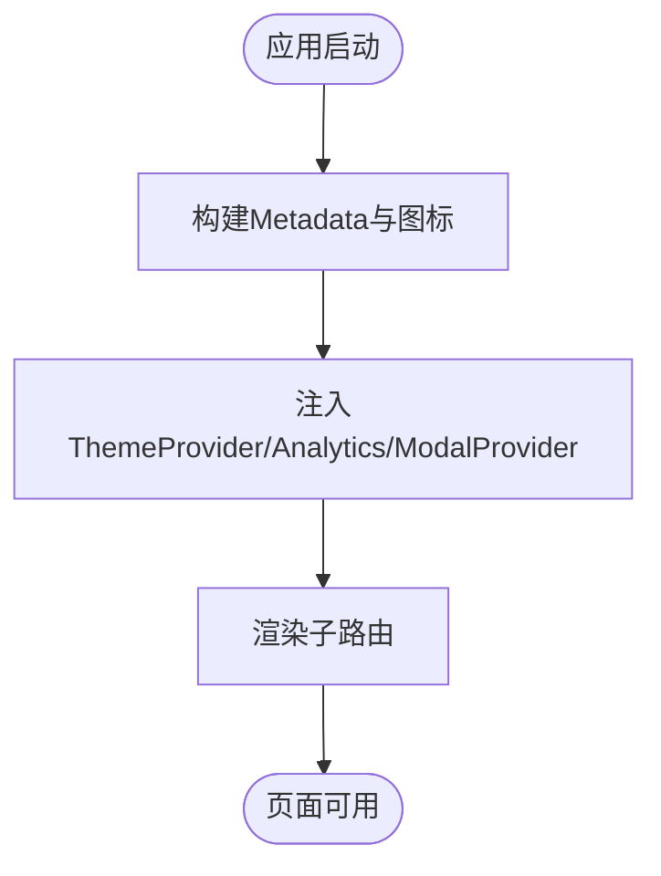
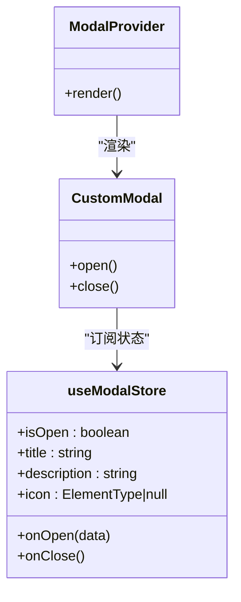
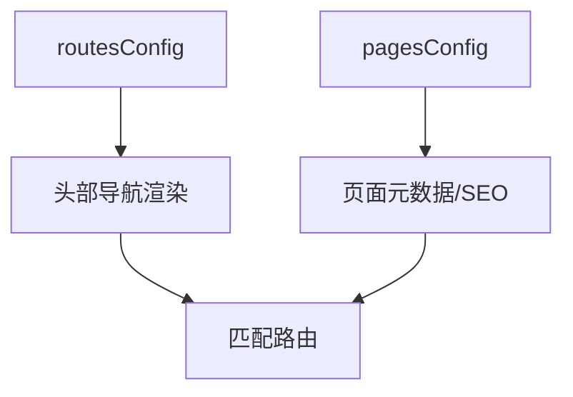
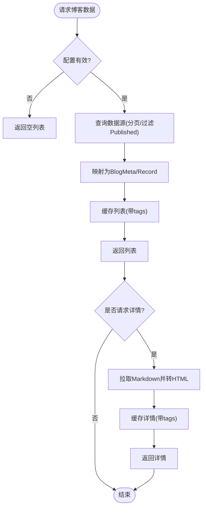
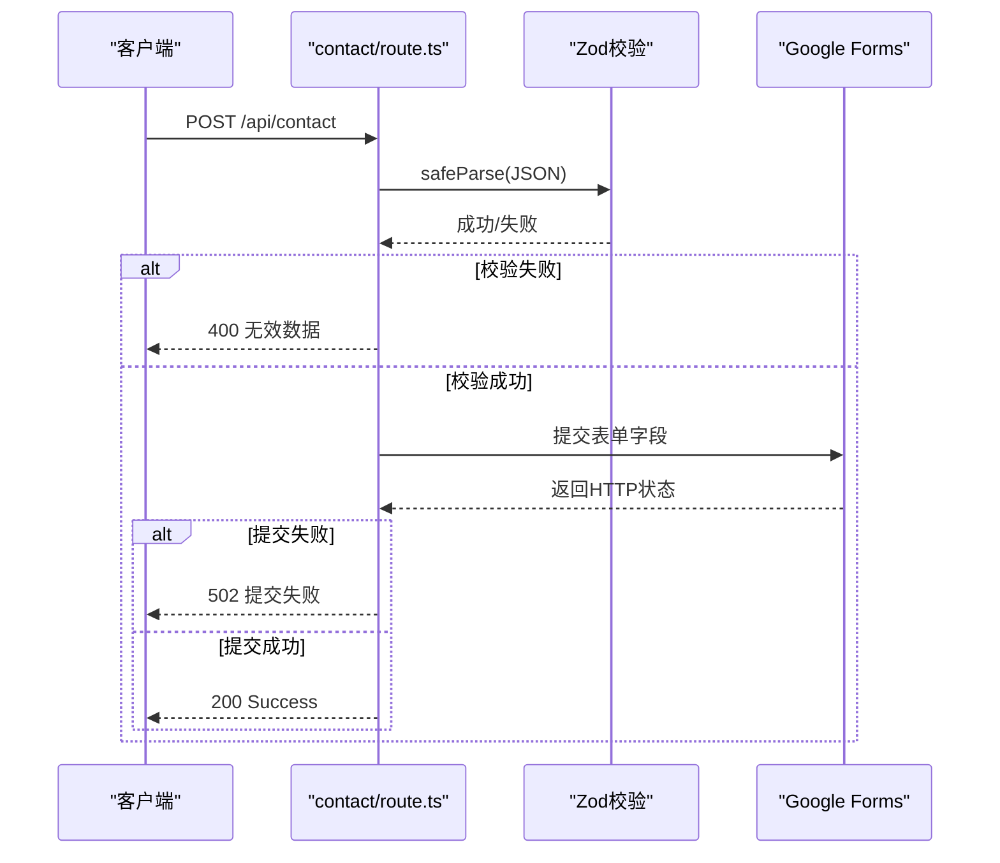
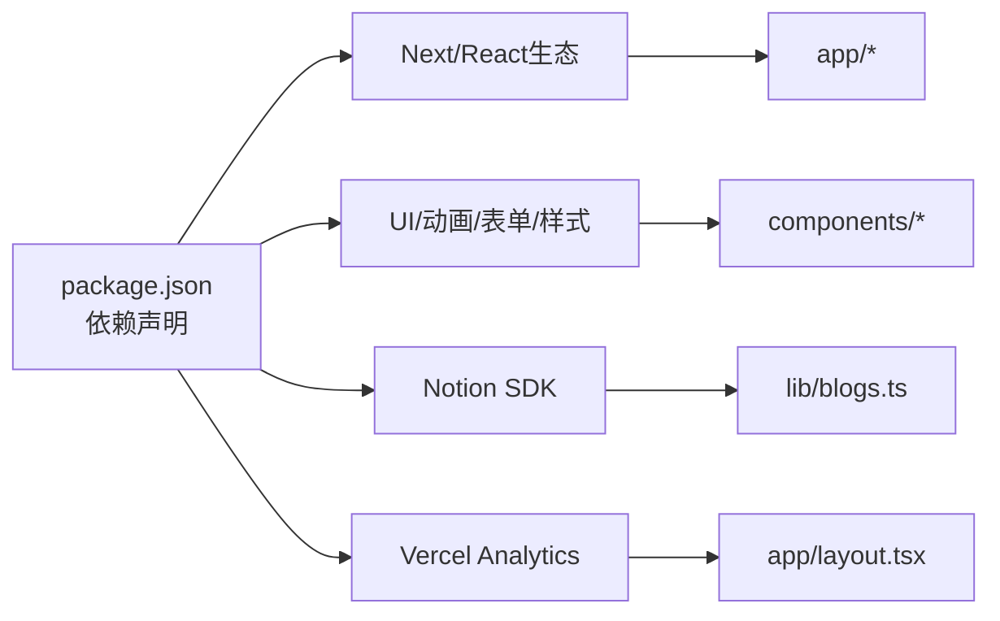

# 扩展开发

<cite>
**本文引用的文件**
- [package.json](file://package.json)
- [next.config.js](file://next.config.js)
- [README.md](file://README.md)
- [app/layout.tsx](file://app/layout.tsx)
- [config/site.ts](file://config/site.ts)
- [components/common/theme-provider.tsx](file://components/common/theme-provider.tsx)
- [providers/modal-provider.tsx](file://providers/modal-provider.tsx)
- [hooks/use-modal-store.ts](file://hooks/use-modal-store.ts)
- [config/pages.ts](file://config/pages.ts)
- [app/(root)/layout.tsx](file://app/(root)/layout.tsx)
- [config/routes.ts](file://config/routes.ts)
- [app/api/contact/route.ts](file://app/api/contact/route.ts)
- [lib/blogs.ts](file://lib/blogs.ts)
- [components/common/analytics.tsx](file://components/common/analytics.tsx)
</cite>

## 目录
1. [简介](#简介)
2. [项目结构](#项目结构)
3. [核心组件](#核心组件)
4. [架构总览](#架构总览)
5. [详细组件分析](#详细组件分析)
6. [依赖分析](#依赖分析)
7. [性能考虑](#性能考虑)
8. [故障排查指南](#故障排查指南)
9. [结论](#结论)
10. [附录](#附录)

## 简介
本指南面向希望在 Next.js 投资组合模板上进行“扩展开发”的开发者，覆盖如何添加新功能、自定义组件与第三方集成；如何识别扩展点、设计插件化架构与模块化开发；以及 Hooks、服务层与 API 扩展的最佳实践。文档同时提供可操作的示例路径、测试方法与发布建议，帮助你在不破坏现有功能的前提下安全地增强站点能力。

## 项目结构
该仓库采用 Next.js App Router 组织页面与服务端 API，结合集中式配置与可复用 UI 组件：
- 应用根布局与全局元信息在 app/layout.tsx 中定义，注入主题、分析与弹窗等全局 Provider。
- 业务路由以 (root) 分组，统一头部导航与页脚。
- 配置集中在 config/ 下（站点信息、路由、页面元数据、技能、项目、经历、贡献等）。
- 服务端能力集中于 lib/ 与 app/api/，如博客数据获取与联系表单提交。
- 通用 UI 与业务组件位于 components/，按领域划分。
- 客户端状态与交互通过 hooks/ 与 providers/ 管理。

图表来源
- [app/layout.tsx:1-131](file://app/layout.tsx#L1-L131)
- [app/(root)/layout.tsx:1-33](file://app/(root)/layout.tsx#L1-L33)
- [config/routes.ts:1-39](file://config/routes.ts#L1-L39)
- [config/pages.ts:1-81](file://config/pages.ts#L1-L81)
- [components/common/analytics.tsx:1-8](file://components/common/analytics.tsx#L1-L8)
- [providers/modal-provider.tsx:1-24](file://providers/modal-provider.tsx#L1-L24)
- [hooks/use-modal-store.ts:1-33](file://hooks/use-modal-store.ts#L1-L33)
- [components/common/theme-provider.tsx:1-11](file://components/common/theme-provider.tsx#L1-L11)
- [config/site.ts:1-39](file://config/site.ts#L1-L39)
- [lib/blogs.ts:1-550](file://lib/blogs.ts#L1-L550)

章节来源
- [app/layout.tsx:1-131](file://app/layout.tsx#L1-L131)
- [app/(root)/layout.tsx:1-33](file://app/(root)/layout.tsx#L1-L33)
- [config/routes.ts:1-39](file://config/routes.ts#L1-L39)
- [config/pages.ts:1-81](file://config/pages.ts#L1-L81)
- [components/common/analytics.tsx:1-8](file://components/common/analytics.tsx#L1-L8)
- [providers/modal-provider.tsx:1-24](file://providers/modal-provider.tsx#L1-L24)
- [hooks/use-modal-store.ts:1-33](file://hooks/use-modal-store.ts#L1-L33)
- [components/common/theme-provider.tsx:1-11](file://components/common/theme-provider.tsx#L1-L11)
- [config/site.ts:1-39](file://config/site.ts#L1-L39)
- [lib/blogs.ts:1-550](file://lib/blogs.ts#L1-L550)

## 核心组件
- 根布局与全局上下文
  - 根布局负责注入主题、分析、弹窗等全局能力，并设置站点元信息与图标、社交分享图。
  - 主题通过 next-themes 封装为 ThemeProvider，便于多主题切换。
  - 弹窗通过 ModalProvider + useModalStore 实现跨组件共享的弹窗状态。
- 业务布局
  - 统一渲染头部导航、GitHub Star 徽章、模式切换与页脚，导航项由 routesConfig 驱动。
- 配置中心
  - site.ts 维护站点基础信息；pages.ts 维护各页面的标题与描述；routes.ts 维护主导航。
- 服务层
  - lib/blogs.ts 提供 Notion 博客数据的读取、校验、缓存与内容渲染接口。
- API 层
  - app/api/contact/route.ts 接收联系表单数据，使用 Zod 校验后转发至 Google Forms。

章节来源
- [app/layout.tsx:1-131](file://app/layout.tsx#L1-L131)
- [components/common/theme-provider.tsx:1-11](file://components/common/theme-provider.tsx#L1-L11)
- [providers/modal-provider.tsx:1-24](file://providers/modal-provider.tsx#L1-L24)
- [hooks/use-modal-store.ts:1-33](file://hooks/use-modal-store.ts#L1-L33)
- [app/(root)/layout.tsx:1-33](file://app/(root)/layout.tsx#L1-L33)
- [config/site.ts:1-39](file://config/site.ts#L1-L39)
- [config/pages.ts:1-81](file://config/pages.ts#L1-L81)
- [config/routes.ts:1-39](file://config/routes.ts#L1-L39)
- [lib/blogs.ts:1-550](file://lib/blogs.ts#L1-L550)
- [app/api/contact/route.ts:1-57](file://app/api/contact/route.ts#L1-L57)

## 架构总览
下图展示了从请求到响应的主要路径，包括页面渲染、服务层调用与 API 处理。

图表来源
- [app/layout.tsx:1-131](file://app/layout.tsx#L1-L131)
- [lib/blogs.ts:1-550](file://lib/blogs.ts#L1-L550)
- [app/api/contact/route.ts:1-57](file://app/api/contact/route.ts#L1-L57)

## 详细组件分析

### 根布局与全局上下文
- 职责
  - 设置站点元数据、图标、社交分享图、robots 与验证信息。
  - 注入主题、分析、弹窗等全局 Provider。
  - 按需加载第三方脚本与分析 SDK。
- 扩展点
  - 新增全局 Provider：在根布局包裹新 Provider，确保 SSR/CSR 一致性。
  - 新增分析或脚本：在根布局中以 Script 或专用组件引入，遵循策略控制加载时机。
  - 修改站点元信息：通过 config/site.ts 集中管理，避免硬编码。

图表来源
- [app/layout.tsx:1-131](file://app/layout.tsx#L1-L131)
- [components/common/analytics.tsx:1-8](file://components/common/analytics.tsx#L1-L8)
- [providers/modal-provider.tsx:1-24](file://providers/modal-provider.tsx#L1-L24)
- [components/common/theme-provider.tsx:1-11](file://components/common/theme-provider.tsx#L1-L11)

章节来源
- [app/layout.tsx:1-131](file://app/layout.tsx#L1-L131)
- [components/common/analytics.tsx:1-8](file://components/common/analytics.tsx#L1-L8)
- [providers/modal-provider.tsx:1-24](file://providers/modal-provider.tsx#L1-L24)
- [components/common/theme-provider.tsx:1-11](file://components/common/theme-provider.tsx#L1-L11)

### 弹窗系统（Provider + Store）
- 职责
  - ModalProvider 在客户端挂载 CustomModal。
  - useModalStore 通过 Zustand 管理弹窗开关、标题、描述与图标。
- 扩展点
  - 新增弹窗类型：在 store 中扩展状态与动作，或在 CustomModal 中根据类型渲染不同内容。
  - 触发弹窗：在任意组件中调用 onOpen(data)，无需传递 props。

图表来源
- [providers/modal-provider.tsx:1-24](file://providers/modal-provider.tsx#L1-L24)
- [hooks/use-modal-store.ts:1-33](file://hooks/use-modal-store.ts#L1-L33)

章节来源
- [providers/modal-provider.tsx:1-24](file://providers/modal-provider.tsx#L1-L24)
- [hooks/use-modal-store.ts:1-33](file://hooks/use-modal-store.ts#L1-L33)

### 导航与页面元数据
- 职责
  - routes.ts 定义主导航项，供头部导航渲染。
  - pages.ts 定义各页面的标题与描述，用于 SEO 与展示。
- 扩展点
  - 新增页面：在 app/(root) 下创建路由，并在 routes.ts 与 pages.ts 中注册。
  - 调整导航顺序或禁用项：直接编辑 routesConfig。

图表来源
- [config/routes.ts:1-39](file://config/routes.ts#L1-L39)
- [config/pages.ts:1-81](file://config/pages.ts#L1-L81)
- [app/(root)/layout.tsx:1-33](file://app/(root)/layout.tsx#L1-L33)

章节来源
- [config/routes.ts:1-39](file://config/routes.ts#L1-L39)
- [config/pages.ts:1-81](file://config/pages.ts#L1-L81)
- [app/(root)/layout.tsx:1-33](file://app/(root)/layout.tsx#L1-L33)

### 博客服务层（Notion 集成）
- 职责
  - 校验并读取 Notion 数据源，过滤已发布文章，分页拉取并按发布日期排序。
  - 将 Notion Markdown 转换为 HTML，估算阅读时间。
  - 使用 unstable_cache 对列表与单篇文章进行缓存，支持标签失效。
- 扩展点
  - 新增字段：在属性白名单与 schema 中扩展，保持向后兼容。
  - 替换内容源：抽象出数据源接口，当前实现基于 Notion，可替换为其他 CMS。
  - 缓存策略：调整 revalidate 与 tags，配合 Webhook 刷新。

图表来源
- [lib/blogs.ts:1-550](file://lib/blogs.ts#L1-L550)

章节来源
- [lib/blogs.ts:1-550](file://lib/blogs.ts#L1-L550)

### 联系表单 API
- 职责
  - 使用 Zod 校验请求体，构造表单字段参数，提交到 Google Forms。
  - 处理环境变量缺失、网络异常与校验失败等错误场景。
- 扩展点
  - 接入其他后端：替换 fetch 目标与字段映射逻辑。
  - 增加字段：在 schema 与环境变量中扩展，保持最小侵入。

图表来源
- [app/api/contact/route.ts:1-57](file://app/api/contact/route.ts#L1-L57)

章节来源
- [app/api/contact/route.ts:1-57](file://app/api/contact/route.ts#L1-L57)

### 主题与站点信息
- 职责
  - 通过 ThemeProvider 启用多主题；site.ts 集中站点名称、描述、链接与图片资源。
- 扩展点
  - 新增主题：在根布局的主题列表中追加。
  - 更新站点信息：仅修改 site.ts，多处自动生效。

章节来源
- [components/common/theme-provider.tsx:1-11](file://components/common/theme-provider.tsx#L1-L11)
- [config/site.ts:1-39](file://config/site.ts#L1-L39)
- [app/layout.tsx:1-131](file://app/layout.tsx#L1-L131)

## 依赖分析
- 运行时依赖
  - Next.js、React、Tailwind、shadcn/ui、Motion、zod、react-hook-form、Notion SDK、Vercel Analytics 等。
- 关键耦合
  - 根布局与全局 Provider 强耦合于主题、分析与弹窗。
  - 博客服务层与 Notion 数据源紧密耦合，但通过 schema 与缓存隔离了上层变化。
  - API 层与 Google Forms 通过环境变量解耦，便于替换。
- 潜在循环
  - 当前模块边界清晰，未发现循环依赖迹象。

图表来源
- [package.json:1-68](file://package.json#L1-L68)
- [app/layout.tsx:1-131](file://app/layout.tsx#L1-L131)
- [lib/blogs.ts:1-550](file://lib/blogs.ts#L1-L550)

章节来源
- [package.json:1-68](file://package.json#L1-L68)

## 性能考虑
- 缓存与增量静态再生
  - 博客列表与详情使用 unstable_cache 与 tags 缓存，可通过 Webhook 或定时任务刷新。
- 首屏与体积
  - 仅在根布局加载必要脚本；分析组件按需挂载。
- 网络与超时
  - Notion 客户端设置了超时与重试；API 层对失败进行明确错误码返回。
- 渲染优化
  - 服务端渲染与客户端交互分离，减少不必要的重渲染。

[本节为通用指导，不直接分析具体文件]

## 故障排查指南
- 博客功能不可用
  - 检查 NOTION_TOKEN 与 NOTION_DATA_SOURCE_ID 是否同时配置；若缺失会降级为空列表。
  - 确认数据源 Status 包含 Published 选项，且页面状态正确。
  - 查看控制台警告：未知块或不支持的块会被记录。
- 联系表单提交失败
  - 检查 GOOGLE_FORM_LINK 与各字段 ID 环境变量是否配置完整。
  - 校验失败会返回 400；网络错误返回 502；内部异常返回 500。
- 主题/分析未生效
  - 确认根布局已包裹对应 Provider；第三方脚本策略是否正确。

章节来源
- [lib/blogs.ts:92-121](file://lib/blogs.ts#L92-L121)
- [lib/blogs.ts:287-335](file://lib/blogs.ts#L287-L335)
- [lib/blogs.ts:422-467](file://lib/blogs.ts#L422-L467)
- [app/api/contact/route.ts:12-55](file://app/api/contact/route.ts#L12-L55)
- [app/layout.tsx:100-127](file://app/layout.tsx#L100-L127)

## 结论
本项目提供了清晰的扩展点：通过配置中心、Provider 体系、服务层抽象与 API 路由，可以低成本地添加新功能与第三方集成。建议在扩展时遵循以下原则：
- 优先通过配置文件与 Provider 扩展行为，避免改动页面逻辑。
- 在服务层抽象外部依赖，保持上层稳定。
- 使用缓存与标签机制提升性能，并通过 Webhook 或任务刷新。
- 严格校验输入输出，保证健壮性与可观测性。

[本节为总结性内容，不直接分析具体文件]

## 附录

### 扩展开发最佳实践清单
- 识别扩展点
  - 新增页面：在 app/(root) 创建路由，并在 routes.ts 与 pages.ts 注册。
  - 新增全局能力：在根布局中添加 Provider 或脚本。
  - 新增数据源：在 lib/ 中实现服务函数，暴露统一接口。
  - 新增 API：在 app/api/ 下新建路由，使用 Zod 校验输入。
- 插件化设计
  - 将易变逻辑抽离为独立模块，通过配置开关启用/禁用。
  - 对外暴露最小接口，隐藏实现细节。
- 模块化方法
  - 按领域拆分组件与 Hook，避免大文件。
  - 使用常量与类型约束配置，减少运行时错误。
- Hooks 开发
  - 关注副作用与状态隔离，避免在渲染中执行副作用。
  - 使用稳定的依赖数组与清理函数。
- 服务层扩展
  - 抽象外部依赖，统一错误处理与日志。
  - 合理使用缓存与失效策略。
- API 扩展
  - 始终校验输入，返回明确的错误码与信息。
  - 将敏感配置放入环境变量，不在代码中硬编码。
- 测试方法
  - 单元测试：对工具函数、Hook、服务层纯逻辑进行测试。
  - 集成测试：对 API 路由进行端到端校验（可使用 Mock 外部服务）。
  - 回归测试：变更配置或 Provider 后，验证关键流程。
- 发布指南
  - 本地构建与预览：pnpm build 与 pnpm start。
  - 环境变量：确保生产环境配置完整（Notion、Google Forms、分析等）。
  - 部署：推荐 Vercel，遵循官方部署文档。

章节来源
- [README.md:46-73](file://README.md#L46-L73)
- [README.md:74-133](file://README.md#L74-L133)
- [README.md:135-149](file://README.md#L135-L149)
- [README.md:195-199](file://README.md#L195-L199)
- [package.json:6-12](file://package.json#L6-L12)
- [next.config.js:1-5](file://next.config.js#L1-L5)