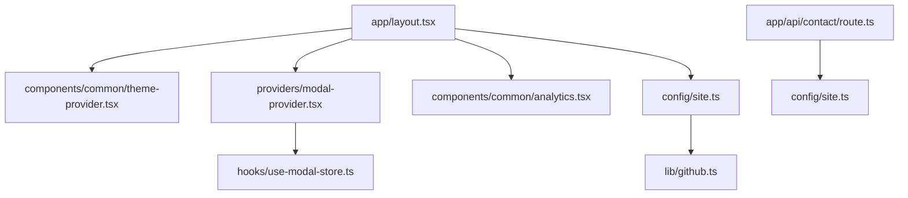
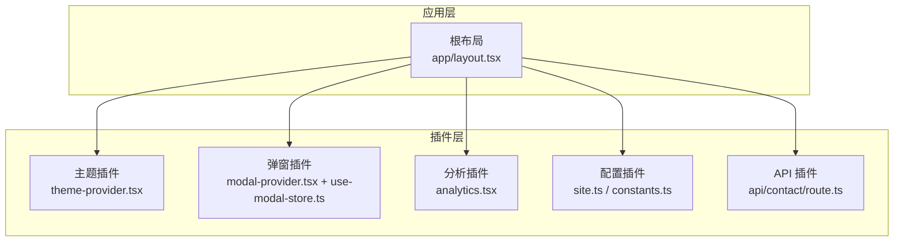
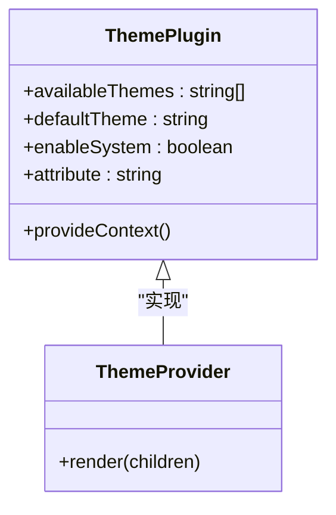
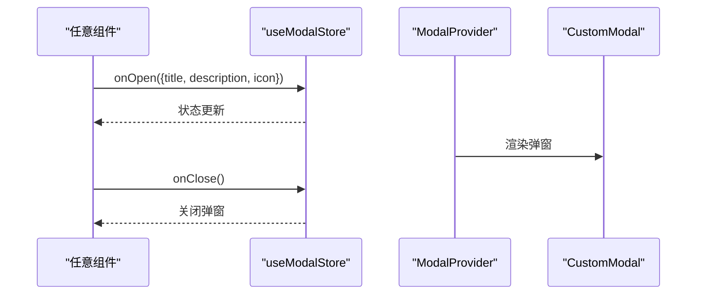
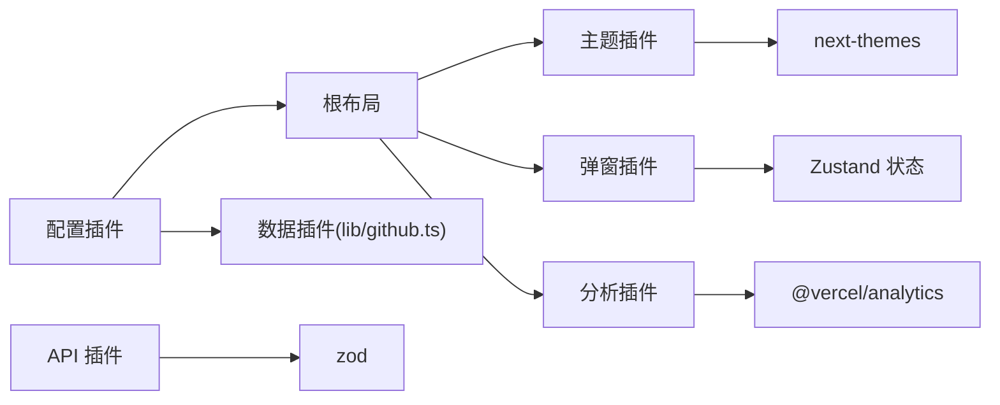
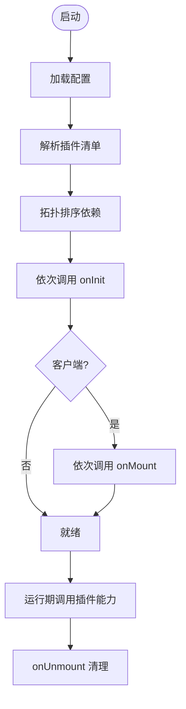

# 插件架构

<cite>
**本文引用的文件**
- [package.json](file://package.json)
- [next.config.js](file://next.config.js)
- [app/layout.tsx](file://app/layout.tsx)
- [components/common/theme-provider.tsx](file://components/common/theme-provider.tsx)
- [providers/modal-provider.tsx](file://providers/modal-provider.tsx)
- [hooks/use-modal-store.ts](file://hooks/use-modal-store.ts)
- [config/site.ts](file://config/site.ts)
- [config/constants.ts](file://config/constants.ts)
- [components/common/analytics.tsx](file://components/common/analytics.tsx)
- [lib/github.ts](file://lib/github.ts)
- [app/api/contact/route.ts](file://app/api/contact/route.ts)
</cite>

## 目录
1. [简介](#简介)
2. [项目结构](#项目结构)
3. [核心组件](#核心组件)
4. [架构总览](#架构总览)
5. [详细组件分析](#详细组件分析)
6. [依赖分析](#依赖分析)
7. [性能考虑](#性能考虑)
8. [故障排查指南](#故障排查指南)
9. [结论](#结论)
10. [附录：插件开发模板与发布规范](#附录：插件开发模板与发布规范)

## 简介
本指南面向在 Next.js 投资组合项目中构建可扩展的“插件架构”。目标包括：
- 设计清晰的插件接口与生命周期管理
- 实现插件注册机制与配置管理
- 应用 Provider 模式、上下文管理与状态共享策略
- 提供插件开发模板与发布规范，便于团队扩展功能（如主题、分析、弹窗、数据源等）

本项目已具备若干可演化为插件的模块：主题切换、全局弹窗、站点元信息、第三方脚本注入、服务端 API 路由等。我们将基于现有结构，提出一套低侵入、高内聚、易扩展的插件化方案。

## 项目结构
当前仓库采用按功能域划分的目录组织方式：
- app：页面路由、根布局、API 路由
- components：UI 与业务组件
- providers：全局 Provider 容器
- hooks：跨组件状态与逻辑
- config：站点与常量配置
- lib：工具与外部服务封装
- public：静态资源

图表来源
- [app/layout.tsx:87-131](file://app/layout.tsx#L87-L131)
- [components/common/theme-provider.tsx:1-11](file://components/common/theme-provider.tsx#L1-L11)
- [providers/modal-provider.tsx:1-24](file://providers/modal-provider.tsx#L1-L24)
- [hooks/use-modal-store.ts:1-33](file://hooks/use-modal-store.ts#L1-L33)
- [config/site.ts:1-39](file://config/site.ts#L1-L39)
- [lib/github.ts:1-32](file://lib/github.ts#L1-L32)
- [app/api/contact/route.ts:1-56](file://app/api/contact/route.ts#L1-L56)

章节来源
- [app/layout.tsx:87-131](file://app/layout.tsx#L87-L131)
- [package.json:1-68](file://package.json#L1-L68)

## 核心组件
- 根布局与 Provider 装配：根布局负责挂载主题、分析、弹窗等能力，是插件化的天然入口点。
- 主题 Provider：封装 next-themes，作为可插拔的主题能力载体。
- 弹窗 Provider + Store：通过 Zustand 管理弹窗状态，提供统一的全局弹窗能力。
- 站点配置：集中管理站点元信息，供各插件读取或扩展。
- 服务端 API：以 Route Handler 暴露能力，可作为插件对外提供的后端能力。

章节来源
- [app/layout.tsx:87-131](file://app/layout.tsx#L87-L131)
- [components/common/theme-provider.tsx:1-11](file://components/common/theme-provider.tsx#L1-L11)
- [providers/modal-provider.tsx:1-24](file://providers/modal-provider.tsx#L1-L24)
- [hooks/use-modal-store.ts:1-33](file://hooks/use-modal-store.ts#L1-L33)
- [config/site.ts:1-39](file://config/site.ts#L1-L39)
- [app/api/contact/route.ts:1-56](file://app/api/contact/route.ts#L1-L56)

## 架构总览
下图展示“插件化”后的系统边界与交互关系：根布局作为编排层，按需加载并组合多个插件；每个插件提供独立的 Provider、配置与可选的客户端/服务端能力。

图表来源
- [app/layout.tsx:87-131](file://app/layout.tsx#L87-L131)
- [components/common/theme-provider.tsx:1-11](file://components/common/theme-provider.tsx#L1-L11)
- [providers/modal-provider.tsx:1-24](file://providers/modal-provider.tsx#L1-L24)
- [hooks/use-modal-store.ts:1-33](file://hooks/use-modal-store.ts#L1-L33)
- [components/common/analytics.tsx:1-8](file://components/common/analytics.tsx#L1-L8)
- [config/site.ts:1-39](file://config/site.ts#L1-L39)
- [config/constants.ts:1-91](file://config/constants.ts#L1-L91)
- [app/api/contact/route.ts:1-56](file://app/api/contact/route.ts#L1-L56)

## 详细组件分析

### 根布局与插件编排
- 根布局承担以下职责：
  - 注入全局样式与字体变量
  - 挂载主题 Provider、分析、弹窗等能力
  - 动态注入第三方脚本（如聊天小部件）
  - 根据环境变量启用可选能力（如 Google Analytics）
- 插件化建议：
  - 将 ThemeProvider、ModalProvider、Analytics 抽象为“插件”，由统一的插件清单驱动渲染顺序与条件启用
  - 使用“插件注册表”集中声明启用的插件及其配置，避免硬编码嵌套

章节来源
- [app/layout.tsx:87-131](file://app/layout.tsx#L87-L131)

### 主题插件（ThemeProvider）
- 现状：对 next-themes 的轻量封装，暴露标准 props
- 插件化建议：
  - 定义主题插件接口：包含可用主题列表、默认主题、是否启用系统主题等
  - 支持运行时切换主题集合（例如从配置或远程获取）
  - 通过 Context 暴露当前主题与切换方法，供其他插件消费

图表来源
- [components/common/theme-provider.tsx:1-11](file://components/common/theme-provider.tsx#L1-L11)
- [app/layout.tsx:100-117](file://app/layout.tsx#L100-L117)

章节来源
- [components/common/theme-provider.tsx:1-11](file://components/common/theme-provider.tsx#L1-L11)
- [app/layout.tsx:100-117](file://app/layout.tsx#L100-L117)

### 弹窗插件（ModalProvider + Store）
- 现状：
  - ModalProvider 负责挂载 CustomModal，并在客户端挂载后渲染
  - useModalStore 使用 Zustand 管理弹窗开关、标题、描述、图标等状态
- 插件化建议：
  - 将弹窗能力封装为独立插件，暴露 open/close API
  - 支持多实例、优先级、遮罩行为等配置项
  - 通过 Context 或 Hook 暴露给任意组件调用

图表来源
- [providers/modal-provider.tsx:1-24](file://providers/modal-provider.tsx#L1-L24)
- [hooks/use-modal-store.ts:1-33](file://hooks/use-modal-store.ts#L1-L33)

章节来源
- [providers/modal-provider.tsx:1-24](file://providers/modal-provider.tsx#L1-L24)
- [hooks/use-modal-store.ts:1-33](file://hooks/use-modal-store.ts#L1-L33)

### 分析插件（Analytics）
- 现状：封装 Vercel Analytics，根布局中直接挂载
- 插件化建议：
  - 抽象为“分析插件”，支持多种分析供应商（GA、Vercel、自定义）
  - 通过配置控制启用与否、追踪 ID、事件白名单等
  - 提供统一的事件上报接口，供业务组件调用

章节来源
- [components/common/analytics.tsx:1-8](file://components/common/analytics.tsx#L1-L8)
- [app/layout.tsx:115-117](file://app/layout.tsx#L115-L117)

### 配置插件（site.ts / constants.ts）
- 现状：集中站点元信息、链接、关键词等；常量类型用于约束技能、分类、页面等
- 插件化建议：
  - 将站点配置抽象为“配置插件”，支持多环境覆盖、合并策略
  - 为各插件提供只读的配置上下文，避免散落的硬编码
  - 通过类型约束保证配置一致性

章节来源
- [config/site.ts:1-39](file://config/site.ts#L1-L39)
- [config/constants.ts:1-91](file://config/constants.ts#L1-L91)

### API 插件（Route Handler）
- 现状：contact 路由接收表单数据，校验后提交到 Google Forms
- 插件化建议：
  - 将后端能力封装为“API 插件”，提供统一的错误码、响应格式
  - 支持多目标适配器（Google Forms、自建 API、邮件服务等）
  - 通过配置选择适配器与字段映射

章节来源
- [app/api/contact/route.ts:1-56](file://app/api/contact/route.ts#L1-L56)

### 数据与外部服务集成（GitHub Stars）
- 现状：根据 site 配置中的模板仓库地址，拉取 Star 数并缓存
- 插件化建议：
  - 抽象为“数据源插件”，支持多种数据源与缓存策略
  - 通过配置注入域名、令牌、重试策略等

章节来源
- [lib/github.ts:1-32](file://lib/github.ts#L1-L32)
- [config/site.ts:1-39](file://config/site.ts#L1-L39)

## 依赖分析
- 根布局依赖主题、分析、弹窗等能力，形成“编排层”
- 弹窗能力依赖 Zustand 状态库
- 分析能力依赖 Vercel Analytics
- 主题能力依赖 next-themes
- 配置被多处引用，形成“配置中心”
- API 路由依赖 Zod 进行请求校验

图表来源
- [app/layout.tsx:87-131](file://app/layout.tsx#L87-L131)
- [providers/modal-provider.tsx:1-24](file://providers/modal-provider.tsx#L1-L24)
- [hooks/use-modal-store.ts:1-33](file://hooks/use-modal-store.ts#L1-L33)
- [components/common/analytics.tsx:1-8](file://components/common/analytics.tsx#L1-L8)
- [components/common/theme-provider.tsx:1-11](file://components/common/theme-provider.tsx#L1-L11)
- [config/site.ts:1-39](file://config/site.ts#L1-L39)
- [lib/github.ts:1-32](file://lib/github.ts#L1-L32)
- [app/api/contact/route.ts:1-56](file://app/api/contact/route.ts#L1-L56)
- [package.json:13-49](file://package.json#L13-L49)

章节来源
- [package.json:13-49](file://package.json#L13-L49)
- [app/layout.tsx:87-131](file://app/layout.tsx#L87-L131)

## 性能考虑
- 条件启用：通过环境变量或配置控制插件加载，减少首屏开销
- 客户端惰性：仅对需要客户端能力的插件使用 "use client" 与 useEffect 延迟挂载
- 缓存与重验证：对远端数据（如 GitHub Stars）设置合理的 revalidate 时间
- 最小化依赖：按需引入第三方库，避免打包体积膨胀
- 状态粒度：使用细粒度状态（如 Zustand slice），减少不必要重渲染

[本节为通用指导，不直接分析具体文件]

## 故障排查指南
- 环境变量缺失：
  - 现象：API 路由返回 500，提示未配置环境变量
  - 处理：检查 .env 中必要键值，确保部署环境已注入
- 客户端水合警告：
  - 现象：Hydration warning
  - 处理：确保仅在客户端执行的操作放在 useEffect 中，或使用 isMounted 标志
- 主题切换异常：
  - 现象：主题未生效或闪烁
  - 处理：确认 attribute 配置一致，避免 SSR/CSR 差异
- 弹窗无法打开：
  - 现象：点击无反应
  - 处理：确认 ModalProvider 已挂载，store 状态正确更新

章节来源
- [app/api/contact/route.ts:20-30](file://app/api/contact/route.ts#L20-L30)
- [providers/modal-provider.tsx:8-16](file://providers/modal-provider.tsx#L8-L16)
- [app/layout.tsx:91-117](file://app/layout.tsx#L91-L117)

## 结论
通过将主题、弹窗、分析、配置、API 等能力抽象为插件，并以根布局为编排层，可实现高内聚、低耦合的可扩展架构。配合统一的插件注册表、配置管理与状态共享策略，既能满足当前需求，又便于未来持续演进。

[本节为总结性内容，不直接分析具体文件]

## 附录：插件开发模板与发布规范

### 插件接口设计（建议）
- 插件元信息：名称、版本、作者、描述、许可证
- 生命周期钩子：
  - onInit：初始化阶段，读取配置、注册能力
  - onMount：客户端挂载时执行副作用（如埋点、监听事件）
  - onUnmount：清理资源
  - onError：统一错误处理
- 配置项：
  - 必填/选填字段、默认值、校验规则
  - 多环境覆盖策略
- 能力暴露：
  - 客户端 API（Hook/函数）
  - 服务端 API（Route Handler）
  - 上下文（Context）

### 插件注册机制（建议）
- 插件清单：集中声明启用的插件及配置
- 注册表：维护插件实例、生命周期状态、依赖关系
- 加载顺序：依据依赖拓扑排序，确保先加载基础插件（如配置、日志）
- 条件启用：基于环境变量或运行时检测决定是否加载

图表来源
- [app/layout.tsx:87-131](file://app/layout.tsx#L87-L131)
- [providers/modal-provider.tsx:1-24](file://providers/modal-provider.tsx#L1-L24)
- [components/common/analytics.tsx:1-8](file://components/common/analytics.tsx#L1-L8)
- [config/site.ts:1-39](file://config/site.ts#L1-L39)

### 状态共享策略（建议）
- 全局状态：使用 Zustand 或 React Context 管理跨插件共享状态
- 局部状态：组件内部状态保持最小化
- 事件总线：插件间通信可通过事件总线或回调注册
- 持久化：关键状态可持久化到 localStorage/sessionStorage

### 发布规范（建议）
- 包管理：使用 pnpm workspace 管理插件与主应用
- 版本策略：语义化版本，变更日志遵循 Conventional Commits
- 文档：README 包含安装、配置、API 说明与示例
- 测试：至少包含单元测试与集成测试用例
- 安全：不泄露密钥，敏感配置通过环境变量注入

[本节为通用指导，不直接分析具体文件]