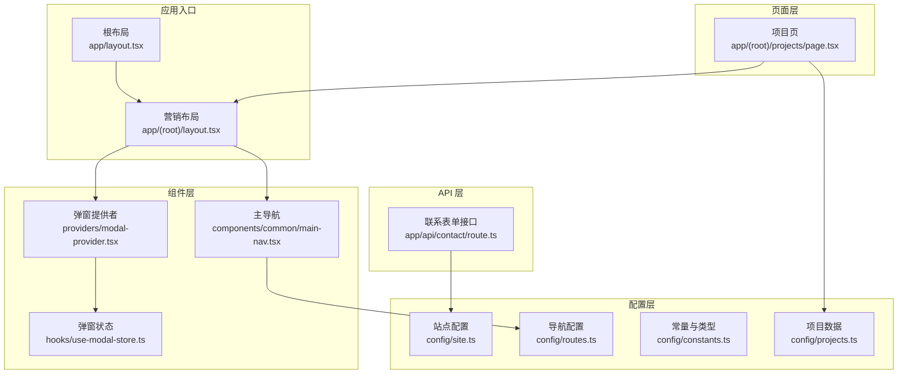
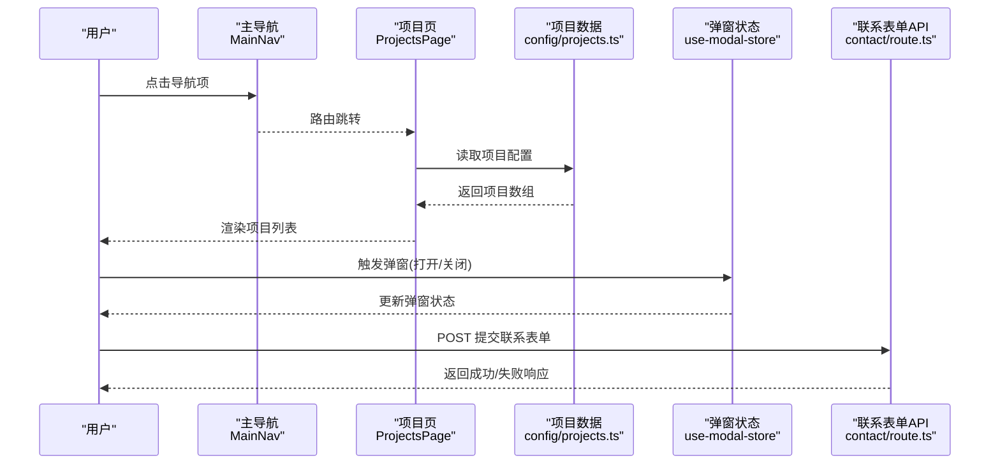
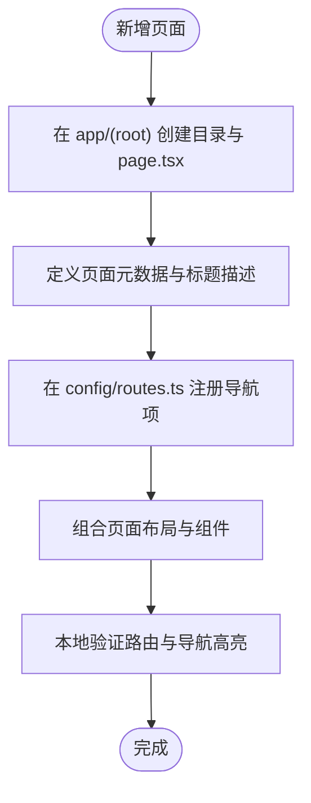
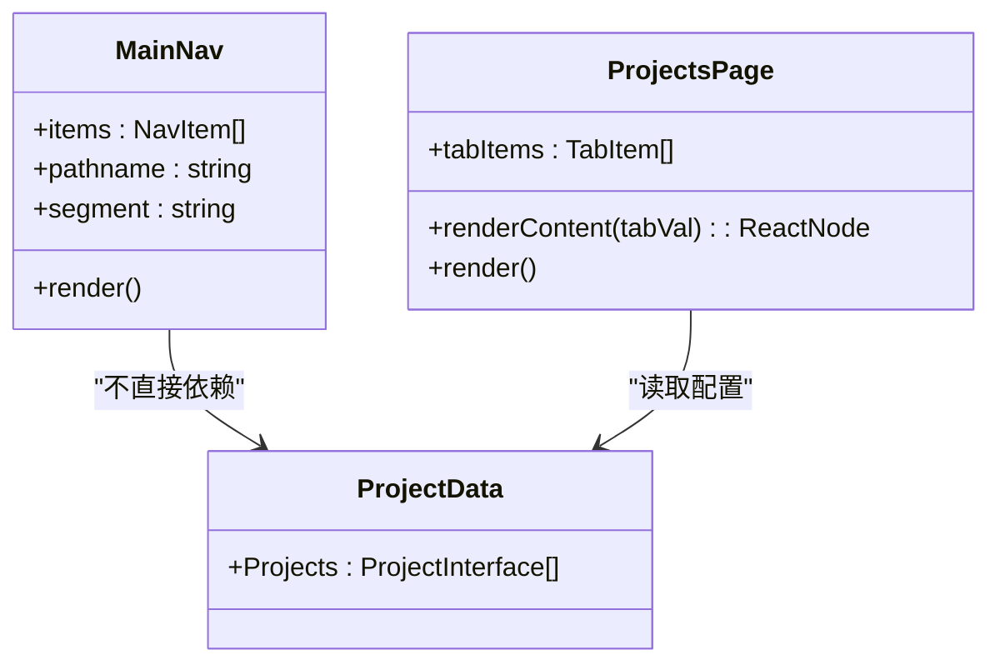
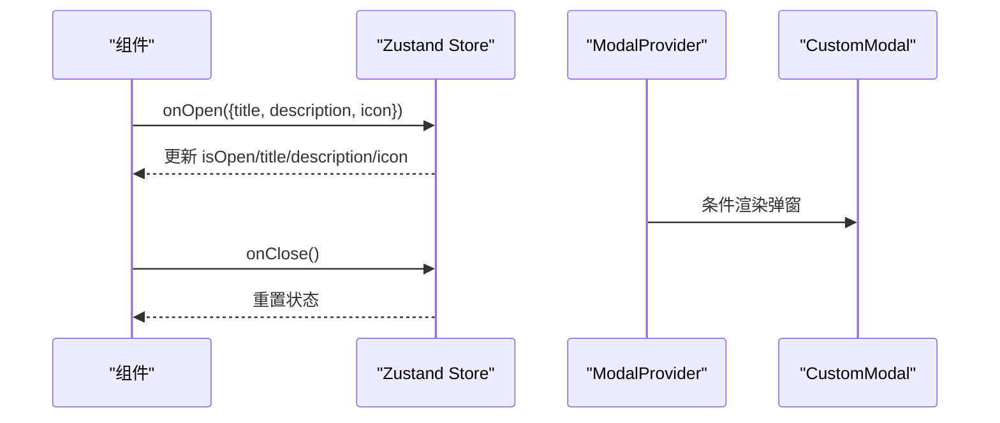
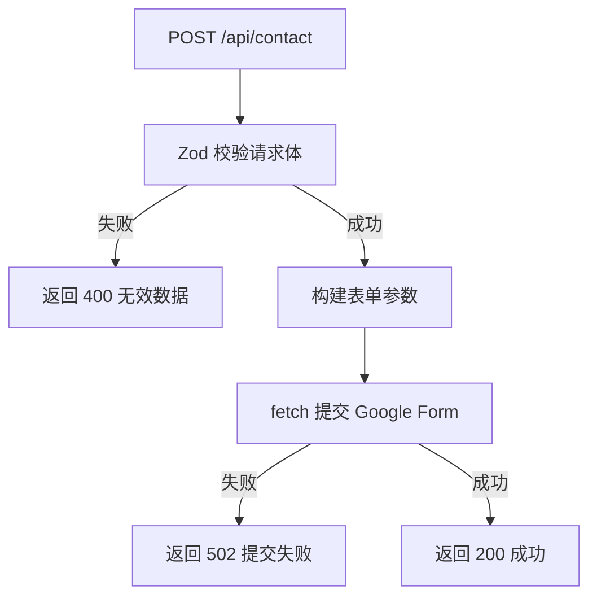
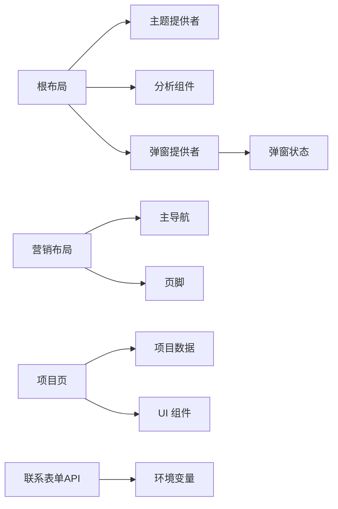

# 新功能开发

<cite>
**本文引用的文件**
- [package.json](file://package.json)
- [app/layout.tsx](file://app/layout.tsx)
- [app/(root)/layout.tsx](file://app/(root)/layout.tsx)
- [config/routes.ts](file://config/routes.ts)
- [config/site.ts](file://config/site.ts)
- [components/common/main-nav.tsx](file://components/common/main-nav.tsx)
- [app/(root)/projects/page.tsx](file://app/(root)/projects/page.tsx)
- [config/projects.ts](file://config/projects.ts)
- [hooks/use-modal-store.ts](file://hooks/use-modal-store.ts)
- [providers/modal-provider.tsx](file://providers/modal-provider.tsx)
- [app/api/contact/route.ts](file://app/api/contact/route.ts)
- [lib/utils.ts](file://lib/utils.ts)
- [config/constants.ts](file://config/constants.ts)
</cite>

## 目录
1. [简介](#简介)
2. [项目结构](#项目结构)
3. [核心组件](#核心组件)
4. [架构总览](#架构总览)
5. [详细组件分析](#详细组件分析)
6. [依赖关系分析](#依赖关系分析)
7. [性能考虑](#性能考虑)
8. [故障排查指南](#故障排查指南)
9. [结论](#结论)
10. [附录：新功能开发流程与示例](#附录：新功能开发流程与示例)

## 简介
本指南面向在 Next.js 投资组合项目中新增功能的需求，提供从识别扩展点、设计新架构到实现模块化开发的完整方法论。内容覆盖页面路由添加、组件开发模式、数据流设计与状态管理最佳实践，并给出从需求分析到代码实现的步骤化示例，以及测试与集成验证策略。

## 项目结构
本项目采用 Next.js App Router 的目录即路由组织方式，结合配置驱动的数据模型与可复用 UI 组件，形成“配置层—页面层—组件层—API 层”的分层结构：
- 配置层：站点信息、路由导航、业务数据（项目/经历/技能等）集中管理，便于统一维护与类型约束。
- 页面层：基于 app/(root) 下的路由分组，承载页面元数据、布局与页面内逻辑。
- 组件层：通用 UI 组件与领域组件分离，保证高内聚低耦合。
- API 层：Next.js Route Handler 处理表单提交、外部服务调用等服务端逻辑。
- 状态与提供者：使用 Zustand 管理全局弹窗状态，并通过 Provider 注入根布局。

图表来源
- [app/layout.tsx:1-131](file://app/layout.tsx#L1-L131)
- [app/(root)/layout.tsx:1-33](file://app/(root)/layout.tsx#L1-L33)
- [config/site.ts:1-39](file://config/site.ts#L1-L39)
- [config/routes.ts:1-39](file://config/routes.ts#L1-L39)
- [config/constants.ts:1-91](file://config/constants.ts#L1-L91)
- [config/projects.ts:1-422](file://config/projects.ts#L1-L422)
- [components/common/main-nav.tsx:1-99](file://components/common/main-nav.tsx#L1-L99)
- [providers/modal-provider.tsx:1-24](file://providers/modal-provider.tsx#L1-L24)
- [hooks/use-modal-store.ts:1-33](file://hooks/use-modal-store.ts#L1-L33)
- [app/api/contact/route.ts:1-57](file://app/api/contact/route.ts#L1-L57)

章节来源
- [app/layout.tsx:1-131](file://app/layout.tsx#L1-L131)
- [app/(root)/layout.tsx:1-33](file://app/(root)/layout.tsx#L1-L33)
- [config/site.ts:1-39](file://config/site.ts#L1-L39)
- [config/routes.ts:1-39](file://config/routes.ts#L1-L39)
- [config/constants.ts:1-91](file://config/constants.ts#L1-L91)
- [config/projects.ts:1-422](file://config/projects.ts#L1-L422)
- [components/common/main-nav.tsx:1-99](file://components/common/main-nav.tsx#L1-L99)
- [providers/modal-provider.tsx:1-24](file://providers/modal-provider.tsx#L1-L24)
- [hooks/use-modal-store.ts:1-33](file://hooks/use-modal-store.ts#L1-L33)
- [app/api/contact/route.ts:1-57](file://app/api/contact/route.ts#L1-L57)

## 核心组件
- 根布局与主题：根布局负责站点元信息、主题提供者、分析与第三方脚本注入，确保全站一致体验。
- 营销布局：封装头部导航、主体区域与页脚，统一管理导航项与交互控件。
- 主导航：根据当前路由段高亮菜单项，支持移动端折叠菜单与动画效果。
- 项目页：通过响应式标签切换展示项目列表，数据来源于配置模块。
- 弹窗状态：使用 Zustand 创建全局弹窗 store，配合 Provider 在客户端渲染弹窗组件。
- 联系表单 API：使用 Zod 校验请求体，将表单数据转发至 Google Form，并返回统一响应。

章节来源
- [app/layout.tsx:1-131](file://app/layout.tsx#L1-L131)
- [app/(root)/layout.tsx:1-33](file://app/(root)/layout.tsx#L1-L33)
- [components/common/main-nav.tsx:1-99](file://components/common/main-nav.tsx#L1-L99)
- [app/(root)/projects/page.tsx:1-59](file://app/(root)/projects/page.tsx#L1-L59)
- [hooks/use-modal-store.ts:1-33](file://hooks/use-modal-store.ts#L1-L33)
- [providers/modal-provider.tsx:1-24](file://providers/modal-provider.tsx#L1-L24)
- [app/api/contact/route.ts:1-57](file://app/api/contact/route.ts#L1-L57)

## 架构总览
下图展示了从用户交互到数据处理的端到端流程，包括导航、页面渲染、状态管理与 API 调用。

图表来源
- [components/common/main-nav.tsx:1-99](file://components/common/main-nav.tsx#L1-L99)
- [app/(root)/projects/page.tsx:1-59](file://app/(root)/projects/page.tsx#L1-L59)
- [config/projects.ts:1-422](file://config/projects.ts#L1-L422)
- [hooks/use-modal-store.ts:1-33](file://hooks/use-modal-store.ts#L1-L33)
- [app/api/contact/route.ts:1-57](file://app/api/contact/route.ts#L1-L57)

## 详细组件分析

### 页面路由与布局
- 根布局负责站点级元数据、主题与全局脚本；营销布局提供统一的头部、主体与页脚结构。
- 新增页面时，建议在 app/(root) 下按功能创建目录与 page.tsx，并在 config/routes.ts 中注册导航项，保持导航与路由一致。

图表来源
- [app/layout.tsx:1-131](file://app/layout.tsx#L1-L131)
- [app/(root)/layout.tsx:1-33](file://app/(root)/layout.tsx#L1-L33)
- [config/routes.ts:1-39](file://config/routes.ts#L1-L39)

章节来源
- [app/layout.tsx:1-131](file://app/layout.tsx#L1-L131)
- [app/(root)/layout.tsx:1-33](file://app/(root)/layout.tsx#L1-L33)
- [config/routes.ts:1-39](file://config/routes.ts#L1-L39)

### 组件开发模式
- 主导航根据当前路由段高亮，支持移动端菜单与动效；新增导航项需同时更新配置与页面路由。
- 项目页通过响应式标签切换不同项目集合，数据来自配置模块，便于维护与扩展。

图表来源
- [components/common/main-nav.tsx:1-99](file://components/common/main-nav.tsx#L1-L99)
- [app/(root)/projects/page.tsx:1-59](file://app/(root)/projects/page.tsx#L1-L59)
- [config/projects.ts:1-422](file://config/projects.ts#L1-L422)

章节来源
- [components/common/main-nav.tsx:1-99](file://components/common/main-nav.tsx#L1-L99)
- [app/(root)/projects/page.tsx:1-59](file://app/(root)/projects/page.tsx#L1-L59)
- [config/projects.ts:1-422](file://config/projects.ts#L1-L422)

### 数据流设计与状态管理
- 数据流：页面从配置模块读取结构化数据，渲染为 UI；如需动态数据，可通过 API 层获取并缓存。
- 状态管理：使用 Zustand 管理弹窗状态，避免跨组件传递 props；在根布局中注入 Provider，确保客户端可用。

图表来源
- [hooks/use-modal-store.ts:1-33](file://hooks/use-modal-store.ts#L1-L33)
- [providers/modal-provider.tsx:1-24](file://providers/modal-provider.tsx#L1-L24)

章节来源
- [hooks/use-modal-store.ts:1-33](file://hooks/use-modal-store.ts#L1-L33)
- [providers/modal-provider.tsx:1-24](file://providers/modal-provider.tsx#L1-L24)

### API 与服务集成
- 联系表单 API 使用 Zod 校验输入，将数据转发至 Google Form，并返回统一响应码；错误路径包含环境变量缺失、网络异常与内部错误的处理。

图表来源
- [app/api/contact/route.ts:1-57](file://app/api/contact/route.ts#L1-L57)

章节来源
- [app/api/contact/route.ts:1-57](file://app/api/contact/route.ts#L1-L57)

## 依赖关系分析
- 根布局依赖站点配置与主题提供者，注入分析与弹窗提供者。
- 营销布局依赖导航配置与通用组件。
- 项目页依赖项目数据配置与 UI 组件。
- 弹窗状态由 Zustand 管理，Provider 在根布局中挂载。
- API 层依赖环境变量与外部服务。

图表来源
- [app/layout.tsx:1-131](file://app/layout.tsx#L1-L131)
- [app/(root)/layout.tsx:1-33](file://app/(root)/layout.tsx#L1-L33)
- [components/common/main-nav.tsx:1-99](file://components/common/main-nav.tsx#L1-L99)
- [app/(root)/projects/page.tsx:1-59](file://app/(root)/projects/page.tsx#L1-L59)
- [config/projects.ts:1-422](file://config/projects.ts#L1-L422)
- [providers/modal-provider.tsx:1-24](file://providers/modal-provider.tsx#L1-L24)
- [hooks/use-modal-store.ts:1-33](file://hooks/use-modal-store.ts#L1-L33)
- [app/api/contact/route.ts:1-57](file://app/api/contact/route.ts#L1-L57)

章节来源
- [app/layout.tsx:1-131](file://app/layout.tsx#L1-L131)
- [app/(root)/layout.tsx:1-33](file://app/(root)/layout.tsx#L1-L33)
- [components/common/main-nav.tsx:1-99](file://components/common/main-nav.tsx#L1-L99)
- [app/(root)/projects/page.tsx:1-59](file://app/(root)/projects/page.tsx#L1-L59)
- [config/projects.ts:1-422](file://config/projects.ts#L1-L422)
- [providers/modal-provider.tsx:1-24](file://providers/modal-provider.tsx#L1-L24)
- [hooks/use-modal-store.ts:1-33](file://hooks/use-modal-store.ts#L1-L33)
- [app/api/contact/route.ts:1-57](file://app/api/contact/route.ts#L1-L57)

## 性能考虑
- 首屏优化：根布局仅加载必要的全局样式与脚本；按需引入主题与分析。
- 路由与数据：页面数据优先使用静态配置，减少运行时计算；如需动态数据，考虑服务端缓存或增量更新。
- 组件渲染：使用响应式 UI 组件与懒加载图片，避免不必要的重渲染；弹窗状态通过全局 store 管理，减少 prop drilling。
- 构建与依赖：使用 pnpm 管理依赖，利用 Next.js 的编译优化；避免在渲染路径中进行昂贵计算。

## 故障排查指南
- 导航高亮异常：检查当前路由段与导航配置的 href 是否匹配；确认 useSelectedLayoutSegment 的使用位置。
- 弹窗不显示：确认 ModalProvider 已挂载于根布局；检查 Zustand store 的 isOpen 状态是否正确更新。
- 表单提交失败：检查环境变量是否配置齐全；查看 API 层的错误分支与网络响应码；确认 Google Form 字段 ID 正确。
- 页面元数据未生效：确认页面导出 metadata 对象，且父布局未覆盖。

章节来源
- [components/common/main-nav.tsx:1-99](file://components/common/main-nav.tsx#L1-L99)
- [providers/modal-provider.tsx:1-24](file://providers/modal-provider.tsx#L1-L24)
- [hooks/use-modal-store.ts:1-33](file://hooks/use-modal-store.ts#L1-L33)
- [app/api/contact/route.ts:1-57](file://app/api/contact/route.ts#L1-L57)

## 结论
通过配置驱动、分层架构与状态管理，本项目具备良好的可扩展性与可维护性。新增功能应遵循“配置先行、页面聚焦、组件复用、API 解耦”的原则，确保代码清晰、职责明确、易于测试与迭代。

## 附录：新功能开发流程与示例
以下为从需求分析到代码实现的步骤化示例，适用于新增一个“活动展示”功能：

1. 需求分析
- 目标：在活动页展示近期活动列表与详情，支持分类筛选与搜索。
- 范围：新增页面、新增配置数据、新增组件、可选新增 API。

2. 识别扩展点
- 路由：在 app/(root) 下新增 activities 目录与 page.tsx。
- 导航：在 config/routes.ts 中添加活动导航项。
- 数据：在 config 下新建 activities.ts 定义活动数据结构与样例数据。
- 组件：在 components/activities 下创建活动卡片与详情页组件。
- 状态：如需全局活动筛选状态，可在 hooks 下新增 store。

3. 设计架构
- 页面层：activities/page.tsx 负责元数据与布局组合。
- 数据层：activities.ts 提供类型化数据与过滤函数。
- 组件层：ActivityCard、ActivityList、ActivityDetail 等。
- 状态层：可选 useActivitiesStore 管理筛选与分页。
- API 层：可选 /api/activities 用于后端同步或缓存。

4. 实现步骤
- 创建路由与布局：在 app/(root)/activities/page.tsx 中定义页面元数据与布局。
- 注册导航：在 config/routes.ts 中添加活动链接。
- 定义数据模型：在 config/activities.ts 中定义活动类型与数据数组。
- 开发组件：实现活动卡片与列表，支持分类筛选与搜索。
- 状态管理：如需要，创建 Zustand store 管理筛选状态。
- 接入 API：如需动态数据，实现 /api/activities 并对接外部服务。

5. 测试方法
- 单元测试：对活动数据过滤函数与工具函数进行断言。
- 组件测试：模拟渲染活动卡片与列表，验证交互与展示。
- 集成测试：验证导航跳转、页面渲染与 API 调用链路。
- 冒烟测试：本地启动后检查路由、导航高亮与页面内容。

6. 集成验证策略
- 导航一致性：确保新增路由在导航中高亮且可访问。
- 数据一致性：验证活动数据与 UI 展示一致，筛选与搜索有效。
- 状态一致性：验证全局状态在不同组件间共享与更新。
- API 稳定性：验证接口响应码与错误处理路径。

7. 发布与回滚
- 构建与部署：执行构建命令并部署到预览环境。
- 监控与反馈：观察线上行为与错误日志，收集用户反馈。
- 回滚策略：如出现问题，快速回滚到上一稳定版本。

章节来源
- [config/routes.ts:1-39](file://config/routes.ts#L1-L39)
- [app/(root)/projects/page.tsx:1-59](file://app/(root)/projects/page.tsx#L1-L59)
- [config/projects.ts:1-422](file://config/projects.ts#L1-L422)
- [hooks/use-modal-store.ts:1-33](file://hooks/use-modal-store.ts#L1-L33)
- [providers/modal-provider.tsx:1-24](file://providers/modal-provider.tsx#L1-L24)
- [app/api/contact/route.ts:1-57](file://app/api/contact/route.ts#L1-L57)
- [lib/utils.ts:1-29](file://lib/utils.ts#L1-L29)
- [config/constants.ts:1-91](file://config/constants.ts#L1-L91)
- [package.json:1-68](file://package.json#L1-L68)