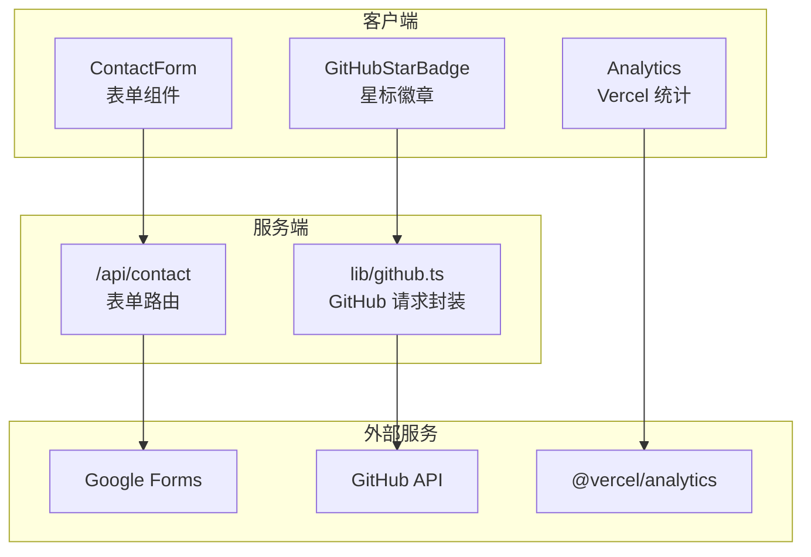
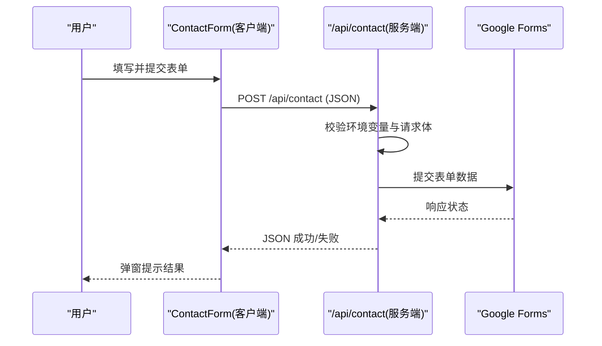
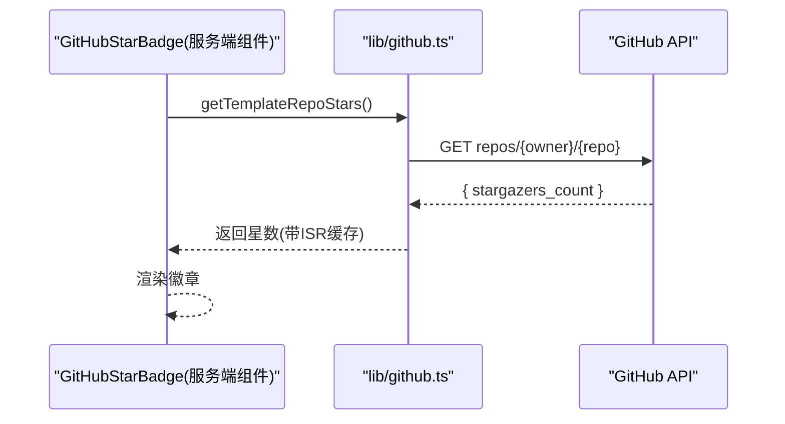
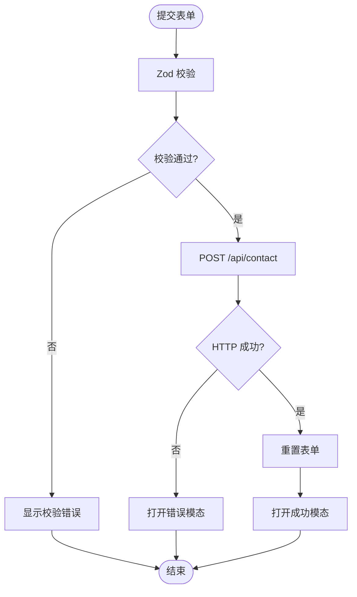
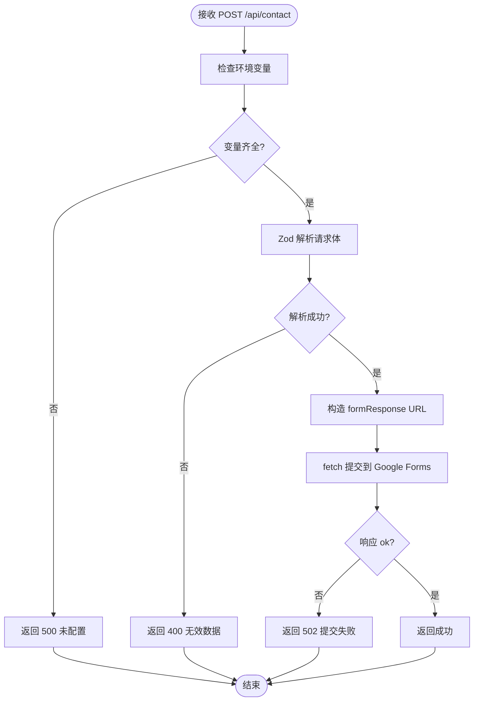
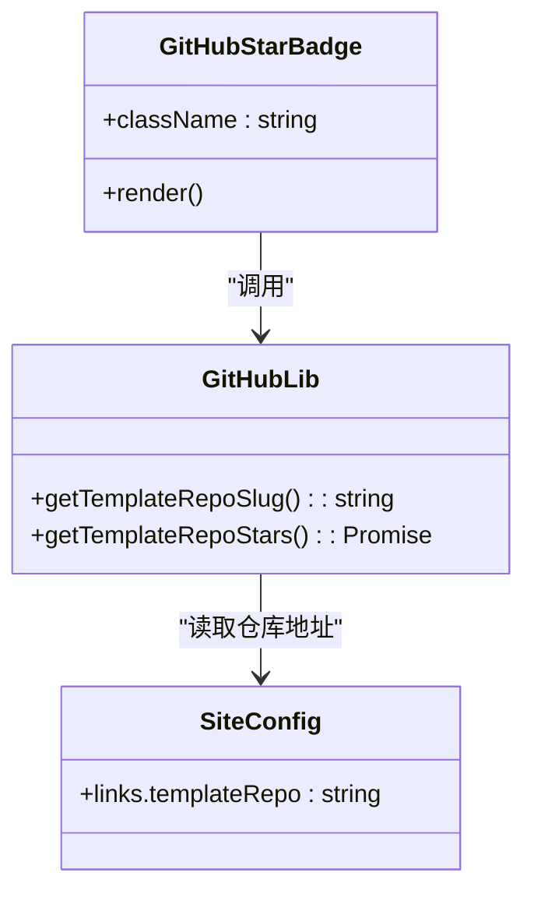
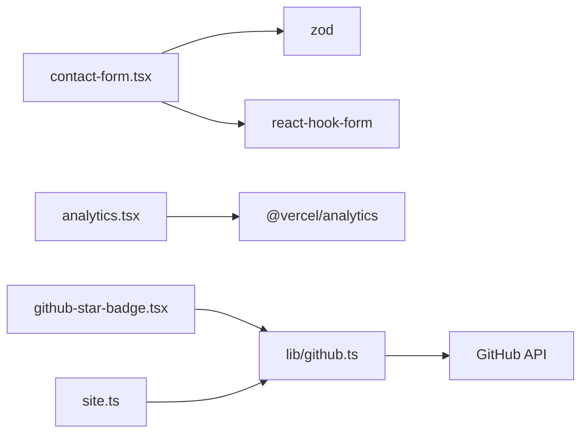

# 第三方集成

<cite>
**本文引用的文件**
- [app/api/contact/route.ts](file://app/api/contact/route.ts)
- [components/common/analytics.tsx](file://components/common/analytics.tsx)
- [components/forms/contact-form.tsx](file://components/forms/contact-form.tsx)
- [lib/github.ts](file://lib/github.ts)
- [components/common/github-star-badge.tsx](file://components/common/github-star-badge.tsx)
- [config/site.ts](file://config/site.ts)
- [package.json](file://package.json)
- [next.config.js](file://next.config.js)
</cite>

## 目录
1. [简介](#简介)
2. [项目结构](#项目结构)
3. [核心组件](#核心组件)
4. [架构总览](#架构总览)
5. [详细组件分析](#详细组件分析)
6. [依赖关系分析](#依赖关系分析)
7. [性能与缓存策略](#性能与缓存策略)
8. [故障排查指南](#故障排查指南)
9. [结论](#结论)
10. [附录：新增第三方服务集成最佳实践](#附录新增第三方服务集成最佳实践)

## 简介
本指南面向 Next.js 投资组合项目的第三方服务集成，覆盖认证配置、错误处理、缓存策略与性能优化。文档基于仓库中已有的 Google Forms 表单提交、GitHub API 获取仓库 Star 数、以及 Vercel Analytics 统计等实现，提供可复用的模式与扩展方法，帮助快速接入新的外部服务（如 Notion Webhook、邮件服务、CDN、监控等）。

## 项目结构
本项目采用 Next.js App Router 的模块化组织方式：
- 服务端 API 路由位于 app/api，用于安全地调用第三方服务并统一错误处理与缓存策略。
- 客户端组件位于 components，封装 UI 交互与状态反馈。
- 业务逻辑与工具函数位于 lib，集中管理对外部服务的请求与数据转换。
- 配置集中在 config，便于统一管理站点信息与第三方服务地址。

图表来源
- [components/forms/contact-form.tsx:45-75](file://components/forms/contact-form.tsx#L45-L75)
- [app/api/contact/route.ts:11-56](file://app/api/contact/route.ts#L11-L56)
- [lib/github.ts:12-32](file://lib/github.ts#L12-L32)
- [components/common/github-star-badge.tsx:12-39](file://components/common/github-star-badge.tsx#L12-L39)
- [components/common/analytics.tsx:1-8](file://components/common/analytics.tsx#L1-L8)

章节来源
- [package.json:13-49](file://package.json#L13-L49)
- [next.config.js:1-5](file://next.config.js#L1-L5)

## 核心组件
- 联系表单（客户端）：使用 React Hook Form + Zod 进行表单校验，提交到 /api/contact。
- 联系表单（服务端）：读取环境变量中的 Google Forms 链接与字段 ID，校验输入后转发至 Google Forms。
- GitHub 星标徽章（服务端渲染）：通过 lib/github.ts 调用 GitHub API 获取模板仓库的 Star 数，并使用 ISR 缓存。
- 分析统计（客户端）：通过 @vercel/analytics 注入页面级埋点。

章节来源
- [components/forms/contact-form.tsx:21-75](file://components/forms/contact-form.tsx#L21-L75)
- [app/api/contact/route.ts:1-56](file://app/api/contact/route.ts#L1-L56)
- [lib/github.ts:1-32](file://lib/github.ts#L1-L32)
- [components/common/github-star-badge.tsx:1-39](file://components/common/github-star-badge.tsx#L1-L39)
- [components/common/analytics.tsx:1-8](file://components/common/analytics.tsx#L1-L8)

## 架构总览
整体流程分为两条主线：
- 表单提交流程：前端校验 -> 调用后端路由 -> 转发到 Google Forms -> 返回结果并提示用户。
- 星标展示流程：服务端组件在构建或请求时拉取 GitHub API，设置 ISR 缓存，渲染为徽章。

图表来源
- [components/forms/contact-form.tsx:45-75](file://components/forms/contact-form.tsx#L45-L75)
- [app/api/contact/route.ts:11-56](file://app/api/contact/route.ts#L11-L56)

图表来源
- [components/common/github-star-badge.tsx:12-39](file://components/common/github-star-badge.tsx#L12-L39)
- [lib/github.ts:12-32](file://lib/github.ts#L12-L32)

## 详细组件分析

### 联系表单（客户端）
- 使用 React Hook Form 与 Zod 定义表单结构与校验规则，确保类型安全与用户体验。
- 提交时以 JSON 形式调用 /api/contact，根据响应打开模态框提示成功或失败。
- 错误处理：捕获网络异常与服务端错误，给出友好提示。

图表来源
- [components/forms/contact-form.tsx:21-75](file://components/forms/contact-form.tsx#L21-L75)

章节来源
- [components/forms/contact-form.tsx:21-75](file://components/forms/contact-form.tsx#L21-L75)

### 联系表单（服务端）
- 从环境变量读取 Google Forms 链接与各字段 ID，缺失则直接返回 500。
- 使用 Zod 校验请求体，不合法返回 400。
- 将表单数据以 URLSearchParams 拼接后 POST 到 Google Forms，非 2xx 返回 502。
- 异常捕获并记录日志，返回 500。

图表来源
- [app/api/contact/route.ts:11-56](file://app/api/contact/route.ts#L11-L56)

章节来源
- [app/api/contact/route.ts:1-56](file://app/api/contact/route.ts#L1-L56)

### GitHub 星标徽章
- 服务端组件在渲染时调用 lib/github.ts 获取仓库 Star 数。
- 使用 next.revalidate 实现 ISR 缓存，降低频繁请求 GitHub API 的压力。
- 对非 2xx 响应与异常进行容错处理，降级为无星数显示。

图表来源
- [components/common/github-star-badge.tsx:12-39](file://components/common/github-star-badge.tsx#L12-L39)
- [lib/github.ts:1-32](file://lib/github.ts#L1-L32)
- [config/site.ts:1-12](file://config/site.ts#L1-L12)

章节来源
- [components/common/github-star-badge.tsx:1-39](file://components/common/github-star-badge.tsx#L1-L39)
- [lib/github.ts:1-32](file://lib/github.ts#L1-L32)
- [config/site.ts:1-12](file://config/site.ts#L1-L12)

### 分析统计（Vercel Analytics）
- 通过 @vercel/analytics/react 在客户端注入统计脚本，零配置即可收集页面访问与交互事件。
- 适合快速启用基础分析能力，无需自建埋点管道。

章节来源
- [components/common/analytics.tsx:1-8](file://components/common/analytics.tsx#L1-L8)
- [package.json:24-24](file://package.json#L24-L24)

## 依赖关系分析
- 运行时依赖
  - @vercel/analytics：用于客户端分析统计。
  - react-hook-form、@hookform/resolvers、zod：表单校验与类型安全。
  - next：App Router 与 ISR 缓存能力。
- 配置文件
  - next.config.js：当前为空对象，可按需添加自定义配置。
  - package.json：声明依赖与脚本命令。

图表来源
- [components/forms/contact-form.tsx:1-30](file://components/forms/contact-form.tsx#L1-L30)
- [components/common/analytics.tsx:1-8](file://components/common/analytics.tsx#L1-L8)
- [components/common/github-star-badge.tsx:1-12](file://components/common/github-star-badge.tsx#L1-L12)
- [lib/github.ts:1-12](file://lib/github.ts#L1-L12)
- [config/site.ts:1-12](file://config/site.ts#L1-L12)

章节来源
- [package.json:13-49](file://package.json#L13-L49)
- [next.config.js:1-5](file://next.config.js#L1-L5)

## 性能与缓存策略
- ISR（增量静态再生成）
  - GitHub API 调用使用 next.revalidate 设置缓存时间，减少上游压力并提升首屏速度。
  - 建议根据数据更新频率调整 revalidate 时长，平衡新鲜度与性能。
- 客户端缓存
  - 对于静态资源与图标，可通过浏览器缓存与 CDN 加速。
- 请求合并与去抖
  - 表单提交前做本地校验，避免无效请求；必要时对高频操作进行防抖。
- 错误降级
  - 当外部服务不可用时，提供降级展示（如无星数），保证页面可用性。

章节来源
- [lib/github.ts:3-32](file://lib/github.ts#L3-L32)

## 故障排查指南
- 环境变量缺失
  - 现象：服务端返回 500，提示需要配置环境变量。
  - 排查：确认已设置 Google Forms 链接与各字段 ID。
- 表单数据校验失败
  - 现象：服务端返回 400。
  - 排查：检查前端提交的字段是否符合 Zod 校验规则。
- 外部服务提交失败
  - 现象：服务端返回 502。
  - 排查：检查 Google Forms 链接与字段映射是否正确，网络是否可达。
- 网络异常
  - 现象：前端捕获异常并弹出错误模态。
  - 排查：检查网络连接与跨域限制（通常由服务端代理解决）。

章节来源
- [app/api/contact/route.ts:20-56](file://app/api/contact/route.ts#L20-L56)
- [components/forms/contact-form.tsx:45-75](file://components/forms/contact-form.tsx#L45-L75)

## 结论
本项目已具备稳定的第三方服务集成范式：
- 表单类集成：前端校验 + 服务端转发 + 统一错误处理。
- API 类集成：服务端封装 + ISR 缓存 + 降级策略。
- 分析统计：客户端轻量埋点，开箱即用。
遵循上述模式，可快速扩展更多第三方服务（如 Notion Webhook、邮件发送、CDN 上传、监控告警等），并保持代码一致性与可维护性。

## 附录：新增第三方服务集成最佳实践
- 认证配置
  - 使用环境变量存储密钥与端点，禁止硬编码。
  - 在服务端路由中进行鉴权与签名计算，避免暴露敏感信息。
- 错误处理
  - 明确区分客户端错误、服务端错误与上游服务错误，返回合适的 HTTP 状态码。
  - 记录关键日志，便于定位问题。
- 缓存策略
  - 对读多写少的数据使用 ISR 或内存缓存，合理设置过期时间。
  - 对写操作进行幂等设计，避免重复提交。
- 性能优化
  - 合并请求、分页加载、懒加载图片与组件。
  - 使用 CDN 托管静态资源与媒体文件。
- 可扩展性
  - 将第三方服务封装为独立模块，提供统一的接口与错误模型。
  - 通过配置开关控制功能启停，便于灰度发布与回滚。