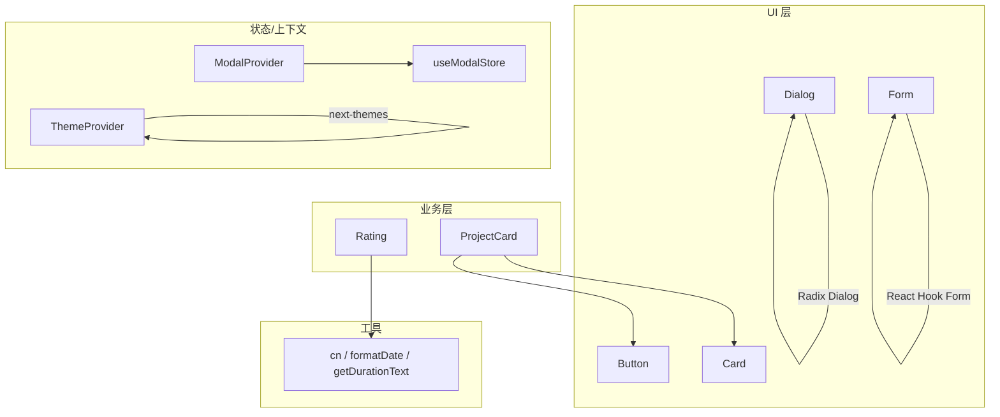
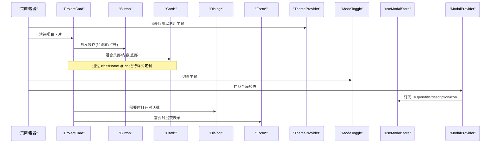
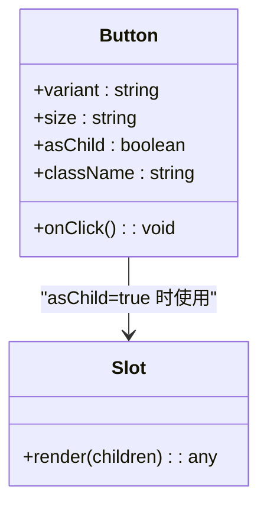
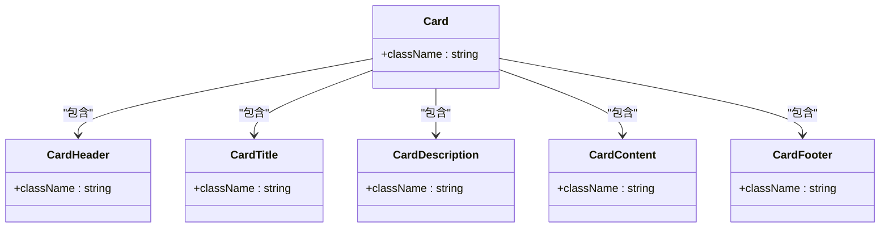
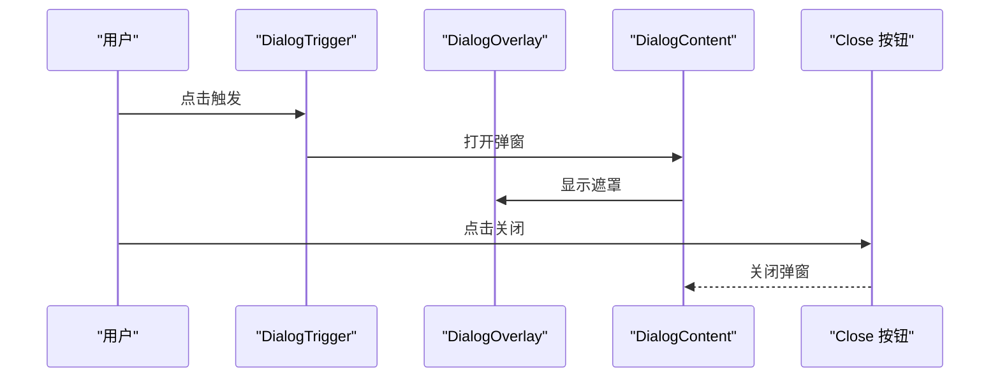
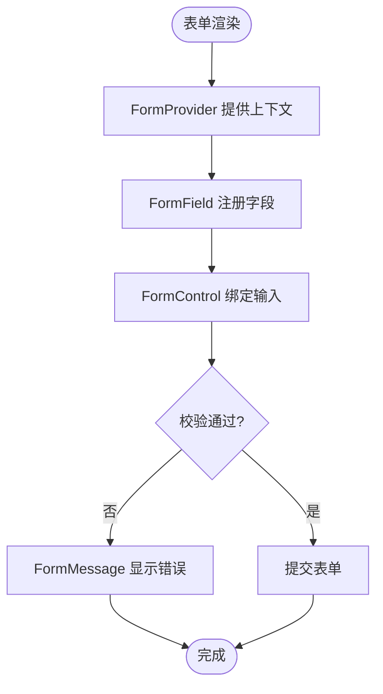
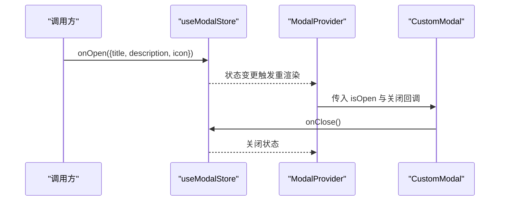
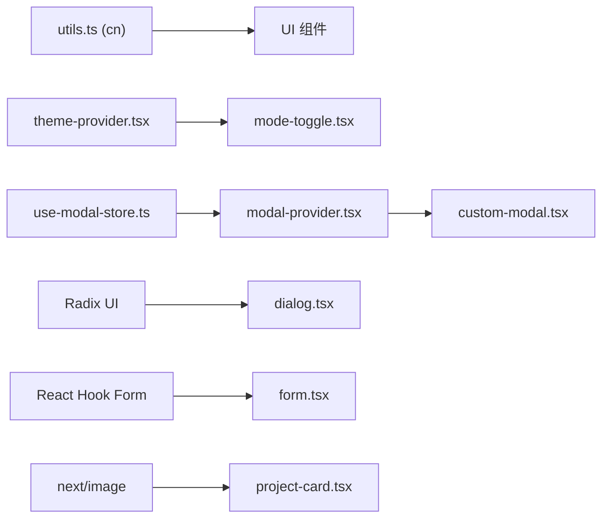

# 组件扩展

<cite>
**本文引用的文件**
- [button.tsx](file://components/ui/button.tsx)
- [card.tsx](file://components/ui/card.tsx)
- [dialog.tsx](file://components/ui/dialog.tsx)
- [form.tsx](file://components/ui/form.tsx)
- [theme-provider.tsx](file://components/common/theme-provider.tsx)
- [mode-toggle.tsx](file://components/common/mode-toggle.tsx)
- [use-modal-store.ts](file://hooks/use-modal-store.ts)
- [modal-provider.tsx](file://providers/modal-provider.tsx)
- [custom-modal.tsx](file://components/modals/custom-modal.tsx)
- [utils.ts](file://lib/utils.ts)
- [project-card.tsx](file://components/projects/project-card.tsx)
- [rating.tsx](file://components/skills/rating.tsx)
- [site.ts](file://config/site.ts)
- [use-lock-body.ts](file://hooks/use-lock-body.ts)
</cite>

## 目录
1. [简介](#简介)
2. [项目结构](#项目结构)
3. [核心组件](#核心组件)
4. [架构总览](#架构总览)
5. [详细组件分析](#详细组件分析)
6. [依赖关系分析](#依赖关系分析)
7. [性能考量](#性能考量)
8. [故障排查指南](#故障排查指南)
9. [结论](#结论)
10. [附录](#附录)

## 简介
本指南面向希望在 Next.js 投资组合项目中扩展现有 UI 组件、创建自定义 Hooks 与实现组件组合模式的开发者。文档基于仓库中的实际组件与 Hook，系统讲解 Props 设计、事件处理、样式定制与主题适配方法；并提供组件文档编写、可访问性支持与性能优化的最佳实践，以及具体的扩展示例与重构建议。

## 项目结构
本项目采用“按功能域组织”的目录结构：
- components/ui：基础 UI 原子组件（按钮、卡片、对话框、表单等）
- components/common：通用业务组件（主题切换、导航、动画等）
- components/{domain}：领域组件（项目、技能、经验等）
- hooks：跨组件复用的自定义 Hook
- providers：全局 Provider（如模态框、主题）
- lib：工具函数（类名合并、日期格式化等）
- config：站点配置与常量

图表来源
- [button.tsx:1-58](file://components/ui/button.tsx#L1-L58)
- [card.tsx:1-87](file://components/ui/card.tsx#L1-L87)
- [dialog.tsx:1-121](file://components/ui/dialog.tsx#L1-L121)
- [form.tsx:1-178](file://components/ui/form.tsx#L1-L178)
- [project-card.tsx:1-52](file://components/projects/project-card.tsx#L1-L52)
- [rating.tsx:1-41](file://components/skills/rating.tsx#L1-L41)
- [use-modal-store.ts:1-33](file://hooks/use-modal-store.ts#L1-L33)
- [modal-provider.tsx:1-24](file://providers/modal-provider.tsx#L1-L24)
- [theme-provider.tsx:1-11](file://components/common/theme-provider.tsx#L1-L11)
- [utils.ts:1-29](file://lib/utils.ts#L1-L29)

章节来源
- [button.tsx:1-58](file://components/ui/button.tsx#L1-L58)
- [card.tsx:1-87](file://components/ui/card.tsx#L1-L87)
- [dialog.tsx:1-121](file://components/ui/dialog.tsx#L1-L121)
- [form.tsx:1-178](file://components/ui/form.tsx#L1-L178)
- [project-card.tsx:1-52](file://components/projects/project-card.tsx#L1-L52)
- [rating.tsx:1-41](file://components/skills/rating.tsx#L1-L41)
- [use-modal-store.ts:1-33](file://hooks/use-modal-store.ts#L1-L33)
- [modal-provider.tsx:1-24](file://providers/modal-provider.tsx#L1-L24)
- [theme-provider.tsx:1-11](file://components/common/theme-provider.tsx#L1-L11)
- [utils.ts:1-29](file://lib/utils.ts#L1-L29)

## 核心组件
- 按钮 Button：使用 class-variance-authority 管理变体与尺寸，支持 asChild 透传底层元素，便于与 Link 或第三方组件组合。
- 卡片 Card：拆分为 Header/Title/Description/Content/Footer 子组件，便于组合与复用。
- 对话框 Dialog：基于 Radix Dialog 封装，提供 Overlay、Content、Header、Footer、Title、Description 等语义化子组件。
- 表单 Form：基于 React Hook Form 封装，提供 Form/FormField/FormItem/FormLabel/FormControl/FormDescription/FormMessage，内置无障碍属性绑定。
- 主题 ThemeProvider：基于 next-themes 的轻量包装，统一主题能力。
- 模式切换 ModeToggle：结合 DropdownMenu 与图标，提供多主题切换。

章节来源
- [button.tsx:1-58](file://components/ui/button.tsx#L1-L58)
- [card.tsx:1-87](file://components/ui/card.tsx#L1-L87)
- [dialog.tsx:1-121](file://components/ui/dialog.tsx#L1-L121)
- [form.tsx:1-178](file://components/ui/form.tsx#L1-L178)
- [theme-provider.tsx:1-11](file://components/common/theme-provider.tsx#L1-L11)
- [mode-toggle.tsx:1-71](file://components/common/mode-toggle.tsx#L1-L71)

## 架构总览
下图展示了从页面到 UI 组件、状态管理与主题的调用关系，体现“组合模式 + 状态提升”的设计思路。

图表来源
- [project-card.tsx:1-52](file://components/projects/project-card.tsx#L1-L52)
- [button.tsx:1-58](file://components/ui/button.tsx#L1-L58)
- [card.tsx:1-87](file://components/ui/card.tsx#L1-L87)
- [dialog.tsx:1-121](file://components/ui/dialog.tsx#L1-L121)
- [form.tsx:1-178](file://components/ui/form.tsx#L1-L178)
- [theme-provider.tsx:1-11](file://components/common/theme-provider.tsx#L1-L11)
- [mode-toggle.tsx:1-71](file://components/common/mode-toggle.tsx#L1-L71)
- [use-modal-store.ts:1-33](file://hooks/use-modal-store.ts#L1-L33)
- [modal-provider.tsx:1-24](file://providers/modal-provider.tsx#L1-L24)

## 详细组件分析

### 按钮 Button：变体、尺寸与 asChild 组合
- 设计要点
  - 使用 cva 定义 variant 与 size 两套变体，并通过 defaultVariants 设置默认值。
  - 通过 asChild + Slot 将 Button 作为任意可聚焦元素的“装饰器”，避免额外 DOM 节点。
  - 使用 cn 合并 Tailwind 类名，确保覆盖与优先级可控。
- 可扩展点
  - 新增变体：在 variants 中追加新键值对，并在业务组件中按需引用。
  - 扩展尺寸：增加 size 选项并定义对应间距与字号。
  - 无障碍：保持 focus-visible 与 ring 样式，确保键盘可达。
- 示例路径
  - 变体与尺寸定义：[button.tsx:7-34](file://components/ui/button.tsx#L7-L34)
  - Props 接口与 asChild：[button.tsx:36-41](file://components/ui/button.tsx#L36-L41)
  - 渲染逻辑：[button.tsx:43-55](file://components/ui/button.tsx#L43-L55)

图表来源
- [button.tsx:7-55](file://components/ui/button.tsx#L7-L55)

章节来源
- [button.tsx:1-58](file://components/ui/button.tsx#L1-L58)

### 卡片 Card：组合式布局与可访问性
- 设计要点
  - 将 Card 拆为 Header/Title/Description/Content/Footer，每个子组件独立接收 className 与 props。
  - 通过 cn 合并样式，保证外层样式覆盖与主题色一致。
- 可扩展点
  - 新增子区域：例如 CardMeta、CardActions，遵循相同 forwardRef 与 className 约定。
  - 主题适配：使用语义化颜色 token（如 text-card-foreground），配合主题系统自动适配。
- 示例路径
  - 组件拆分与渲染：[card.tsx:5-77](file://components/ui/card.tsx#L5-L77)

图表来源
- [card.tsx:5-77](file://components/ui/card.tsx#L5-L77)

章节来源
- [card.tsx:1-87](file://components/ui/card.tsx#L1-L87)

### 对话框 Dialog：基于 Radix 的可访问弹窗
- 设计要点
  - 使用 Radix Dialog 原语，提供 Trigger/Overlay/Content/Header/Footer/Title/Description。
  - Content 内嵌关闭按钮，具备 sr-only 文本，满足屏幕阅读器需求。
  - 通过 Portal 将弹窗渲染至 body，避免层级问题。
- 可扩展点
  - 添加更多交互：如 ESC 关闭、点击外部关闭、焦点陷阱等（Radix 已内置）。
  - 主题适配：使用背景与边框 token，确保明暗主题一致。
- 示例路径
  - 弹窗结构与动画：[dialog.tsx:18-55](file://components/ui/dialog.tsx#L18-L55)
  - 标题与描述：[dialog.tsx:85-110](file://components/ui/dialog.tsx#L85-L110)

图表来源
- [dialog.tsx:1-121](file://components/ui/dialog.tsx#L1-L121)

章节来源
- [dialog.tsx:1-121](file://components/ui/dialog.tsx#L1-L121)

### 表单 Form：受控表单与无障碍
- 设计要点
  - 基于 React Hook Form 的 Controller 与 Context，提供 Form/FormField/FormItem/FormLabel/FormControl/FormDescription/FormMessage。
  - FormControl 自动注入 id、aria-describedby、aria-invalid，并与错误消息联动。
  - FormMessage 仅在存在错误时渲染，减少冗余 DOM。
- 可扩展点
  - 校验规则：在父组件中通过 useForm 配置 resolver 与 rules。
  - 自定义输入：通过 FormControl 包裹任何可聚焦元素，保持无障碍一致性。
- 示例路径
  - 字段上下文与 useFormField：[form.tsx:25-63](file://components/ui/form.tsx#L25-L63)
  - 控件与无障碍属性：[form.tsx:104-124](file://components/ui/form.tsx#L104-L124)
  - 错误消息渲染：[form.tsx:144-166](file://components/ui/form.tsx#L144-L166)

图表来源
- [form.tsx:16-166](file://components/ui/form.tsx#L16-L166)

章节来源
- [form.tsx:1-178](file://components/ui/form.tsx#L1-L178)

### 主题与模式切换：ThemeProvider 与 ModeToggle
- 设计要点
  - ThemeProvider 是对 next-themes 的薄封装，集中管理主题策略。
  - ModeToggle 通过 DropdownMenu 暴露多种主题选项，并使用图标动态切换视觉反馈。
- 可扩展点
  - 新增主题：在 ModeToggle 中添加菜单项，并在 CSS 变量或 Tailwind 主题中定义对应 token。
  - 持久化：next-themes 默认支持本地存储，可按需配置 key 与存储策略。
- 示例路径
  - 主题提供者：[theme-provider.tsx:1-11](file://components/common/theme-provider.tsx#L1-L11)
  - 模式切换器：[mode-toggle.tsx:15-68](file://components/common/mode-toggle.tsx#L15-L68)

章节来源
- [theme-provider.tsx:1-11](file://components/common/theme-provider.tsx#L1-L11)
- [mode-toggle.tsx:1-71](file://components/common/mode-toggle.tsx#L1-L71)

### 模态框：全局状态与 Provider 模式
- 设计要点
  - useModalStore 使用 Zustand 维护 isOpen、title、description、icon 等状态，并提供 onOpen/onClose 方法。
  - ModalProvider 负责挂载 CustomModal，避免服务端渲染时的水合差异。
  - CustomModal 读取 store 数据并渲染到通用 Modal 中。
- 可扩展点
  - 多实例：如需同时多个模态，可在 store 中改为数组并管理 z-index。
  - 回调机制：在 onClose 后执行清理逻辑（如重置表单）。
- 示例路径
  - 状态定义与更新：[use-modal-store.ts:4-32](file://hooks/use-modal-store.ts#L4-L32)
  - 挂载与防 SSR：[modal-provider.tsx:7-22](file://providers/modal-provider.tsx#L7-L22)
  - 内容渲染：[custom-modal.tsx:6-28](file://components/modals/custom-modal.tsx#L6-L28)

图表来源
- [use-modal-store.ts:1-33](file://hooks/use-modal-store.ts#L1-L33)
- [modal-provider.tsx:1-24](file://providers/modal-provider.tsx#L1-L24)
- [custom-modal.tsx:1-30](file://components/modals/custom-modal.tsx#L1-L30)

章节来源
- [use-modal-store.ts:1-33](file://hooks/use-modal-store.ts#L1-L33)
- [modal-provider.tsx:1-24](file://providers/modal-provider.tsx#L1-L24)
- [custom-modal.tsx:1-30](file://components/modals/custom-modal.tsx#L1-L30)

### 业务组件组合：ProjectCard 与 Rating
- ProjectCard
  - 组合 Button、ChipContainer、Image 与链接，展示项目信息并引导详情。
  - 通过 cn 与主题 token 控制外观，响应式布局。
  - 示例路径：[project-card.tsx:13-49](file://components/projects/project-card.tsx#L13-L49)
- Rating
  - 根据 stars 数量渲染星形图标，使用 aria-hidden 避免重复朗读。
  - 示例路径：[rating.tsx:5-39](file://components/skills/rating.tsx#L5-L39)

章节来源
- [project-card.tsx:1-52](file://components/projects/project-card.tsx#L1-L52)
- [rating.tsx:1-41](file://components/skills/rating.tsx#L1-L41)

## 依赖关系分析
- 样式工具
  - cn：基于 clsx 与 tailwind-merge，安全合并类名，避免冲突。
  - 示例路径：[utils.ts:4-6](file://lib/utils.ts#L4-L6)
- 主题系统
  - ThemeProvider 基于 next-themes，ModeToggle 通过 useTheme 切换主题。
  - 示例路径：[theme-provider.tsx:3-9](file://components/common/theme-provider.tsx#L3-L9)、[mode-toggle.tsx:3-16](file://components/common/mode-toggle.tsx#L3-L16)
- 状态管理
  - useModalStore 使用 Zustand 提供轻量全局状态。
  - 示例路径：[use-modal-store.ts:1-33](file://hooks/use-modal-store.ts#L1-L33)
- 第三方库
  - Radix UI：Dialog、Tooltip、DropdownMenu 等提供可访问性与行为保障。
  - React Hook Form：表单状态与校验。
  - next/image：图片优化与懒加载。

图表来源
- [utils.ts:1-29](file://lib/utils.ts#L1-L29)
- [theme-provider.tsx:1-11](file://components/common/theme-provider.tsx#L1-L11)
- [mode-toggle.tsx:1-71](file://components/common/mode-toggle.tsx#L1-L71)
- [use-modal-store.ts:1-33](file://hooks/use-modal-store.ts#L1-L33)
- [modal-provider.tsx:1-24](file://providers/modal-provider.tsx#L1-L24)
- [custom-modal.tsx:1-30](file://components/modals/custom-modal.tsx#L1-L30)
- [dialog.tsx:1-121](file://components/ui/dialog.tsx#L1-L121)
- [form.tsx:1-178](file://components/ui/form.tsx#L1-L178)
- [project-card.tsx:1-52](file://components/projects/project-card.tsx#L1-L52)

章节来源
- [utils.ts:1-29](file://lib/utils.ts#L1-L29)
- [theme-provider.tsx:1-11](file://components/common/theme-provider.tsx#L1-L11)
- [mode-toggle.tsx:1-71](file://components/common/mode-toggle.tsx#L1-L71)
- [use-modal-store.ts:1-33](file://hooks/use-modal-store.ts#L1-L33)
- [modal-provider.tsx:1-24](file://providers/modal-provider.tsx#L1-L24)
- [custom-modal.tsx:1-30](file://components/modals/custom-modal.tsx#L1-L30)
- [dialog.tsx:1-121](file://components/ui/dialog.tsx#L1-L121)
- [form.tsx:1-178](file://components/ui/form.tsx#L1-L178)
- [project-card.tsx:1-52](file://components/projects/project-card.tsx#L1-L52)

## 性能考量
- 组件粒度与惰性加载
  - 将大体积组件（如复杂图表、地图）延迟加载，减少首屏包体。
  - 使用 React.lazy 与 Suspense 包裹非关键 UI。
- 列表渲染优化
  - 对长列表使用虚拟滚动或分页，避免一次性渲染过多节点。
  - 为列表项提供稳定 key，减少重渲染。
- 图片与媒体
  - 使用 next/image 的 fill、sizes、priority 等属性优化加载与布局偏移。
  - 为不同断点提供合适尺寸的图片资源。
- 状态更新频率
  - 高频状态（如滚动位置）使用节流/防抖，降低重渲染成本。
  - 将频繁更新的局部状态下沉到组件内部，避免全局状态风暴。
- 样式与主题
  - 使用 Tailwind 原子类与 cn 合并，避免过度嵌套与重复计算。
  - 主题切换尽量通过 CSS 变量或类名切换，减少 JS 计算。

## 故障排查指南
- 表单字段报错
  - 现象：useFormField 在非 FormField 上下文中抛出错误。
  - 排查：确保字段被 FormField 包裹，且处于 FormProvider 内。
  - 参考路径：[form.tsx:42-51](file://components/ui/form.tsx#L42-L51)
- 模态框未显示
  - 现象：调用 onOpen 后无弹窗。
  - 排查：确认 ModalProvider 已在应用根节点挂载；检查 isMounted 防止 SSR 水合差异。
  - 参考路径：[modal-provider.tsx:7-22](file://providers/modal-provider.tsx#L7-L22)
- 主题切换无效
  - 现象：切换主题后界面未变化。
  - 排查：确认 ThemeProvider 包裹了应用根；检查 ModeToggle 是否正确调用 setTheme。
  - 参考路径：[theme-provider.tsx:3-9](file://components/common/theme-provider.tsx#L3-L9)、[mode-toggle.tsx:15-68](file://components/common/mode-toggle.tsx#L15-L68)
- 滚动锁失效
  - 现象：打开模态后仍可滚动页面。
  - 排查：确认在打开模态时调用 useLockBody，并在关闭时恢复 overflow。
  - 参考路径：[use-lock-body.ts:4-11](file://hooks/use-lock-body.ts#L4-L11)

章节来源
- [form.tsx:42-51](file://components/ui/form.tsx#L42-L51)
- [modal-provider.tsx:7-22](file://providers/modal-provider.tsx#L7-L22)
- [theme-provider.tsx:3-9](file://components/common/theme-provider.tsx#L3-L9)
- [mode-toggle.tsx:15-68](file://components/common/mode-toggle.tsx#L15-L68)
- [use-lock-body.ts:4-11](file://hooks/use-lock-body.ts#L4-L11)

## 结论
本项目通过原子化 UI 组件、组合式布局、基于 Radix 的可访问性组件与 React Hook Form 的表单体系，构建了高内聚、低耦合的前端架构。借助 cn 与 Tailwind 的主题 token，实现了灵活的样式定制与主题适配；通过 Zustand 与 Provider 模式，实现了清晰的状态管理与全局能力挂载。按照本文档的扩展指南，你可以安全地扩展现有组件、创建自定义 Hook 与组合模式，同时兼顾可访问性与性能。

## 附录

### Props 设计最佳实践
- 明确类型：使用 TypeScript 接口定义 Props，区分可选与必填字段。
- 组合优先：通过 children、Slot、asChild 等方式支持组合，避免硬编码结构。
- 样式解耦：暴露 className 与样式相关 Props，使用 cn 合并，避免内部样式耦合。
- 事件命名：使用标准 HTML 事件名（onClick、onSubmit 等），保持一致性。

### 事件处理与副作用
- 事件委托：在列表或复杂结构中谨慎使用事件委托，减少监听器数量。
- 副作用隔离：将副作用放入 useEffect/useLayoutEffect，并确保清理函数正确释放资源。
- 防抖节流：对高频事件（滚动、输入）使用防抖/节流，降低渲染压力。

### 样式定制与主题适配
- 使用 Tailwind 语义化类名与颜色 token，确保明暗主题一致。
- 通过 cva 管理变体，集中维护样式规则，便于扩展与维护。
- 使用 cn 合并类名，避免覆盖冲突与重复样式。

### 组件文档编写
- 说明用途与适用场景。
- 列出 Props 名称、类型、默认值与示例。
- 提供基本用法与组合示例。
- 标注可访问性要求与注意事项。

### 可访问性支持
- 语义化标签：使用 button、a、h1-h6、form、label 等原生语义。
- ARIA 属性：为不可见元素提供 sr-only 文本；为控件设置 aria-describedby、aria-invalid。
- 键盘可达：确保所有交互均可通过键盘操作，并提供可见焦点样式。
- 屏幕阅读器：为图标与装饰性元素添加 aria-hidden，避免重复朗读。

### 性能优化清单
- 代码分割：路由级与组件级懒加载。
- 列表优化：虚拟滚动、分页、稳定 key。
- 图片优化：next/image 的 sizes/priority/loading。
- 状态优化：局部状态下沉、避免不必要的全局更新。
- 样式优化：原子类与 cn 合并，减少重复计算。