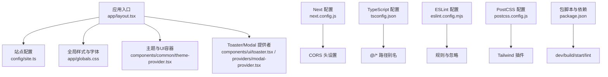
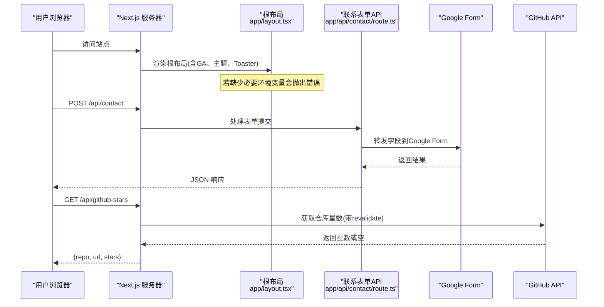
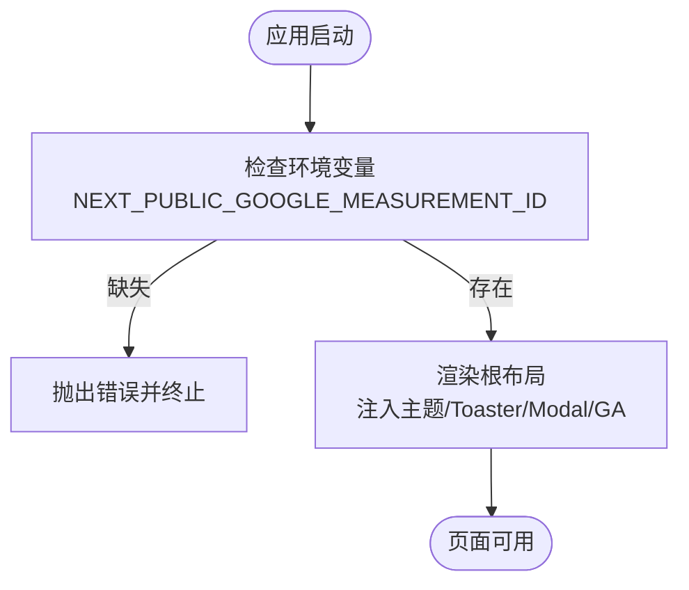
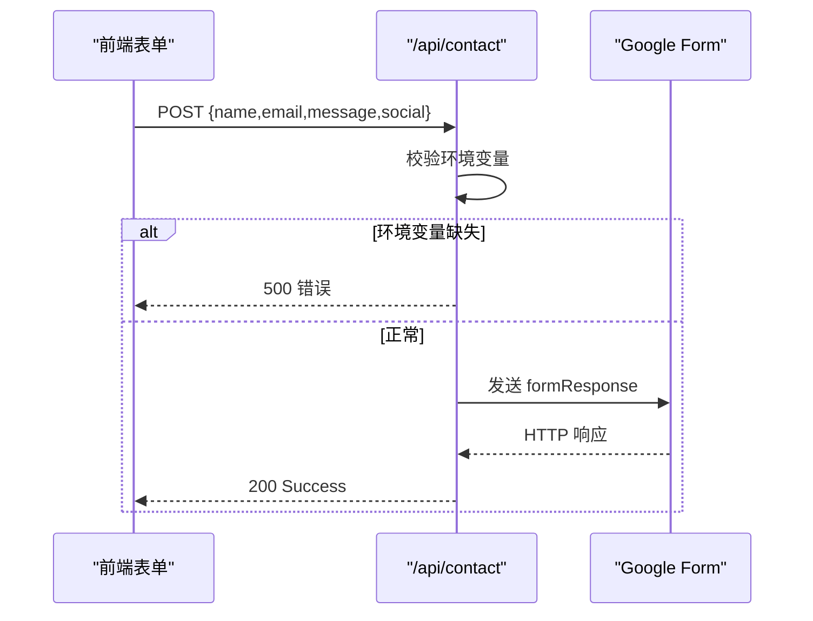
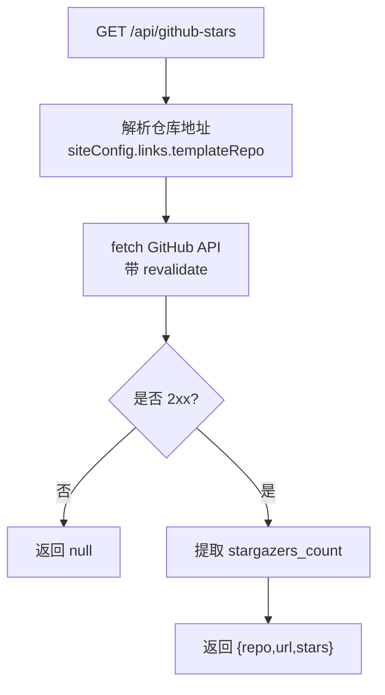
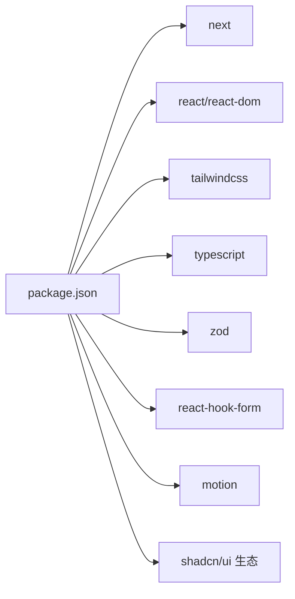

# 故障排除

<cite>
**本文引用的文件**
- [package.json](file://package.json)
- [next.config.js](file://next.config.js)
- [tsconfig.json](file://tsconfig.json)
- [README.md](file://README.md)
- [app/layout.tsx](file://app/layout.tsx)
- [app/api/contact/route.ts](file://app/api/contact/route.ts)
- [app/api/github-stars/route.ts](file://app/api/github-stars/route.ts)
- [components.json](file://components.json)
- [eslint.config.mjs](file://eslint.config.mjs)
- [postcss.config.js](file://postcss.config.js)
- [config/site.ts](file://config/site.ts)
- [lib/utils.ts](file://lib/utils.ts)
</cite>

## 目录
1. [简介](#简介)
2. [项目结构](#项目结构)
3. [核心组件](#核心组件)
4. [架构总览](#架构总览)
5. [详细组件分析](#详细组件分析)
6. [依赖分析](#依赖分析)
7. [性能注意事项](#性能注意事项)
8. [故障排除指南](#故障排除指南)
9. [结论](#结论)
10. [附录](#附录)

## 简介
本指南面向使用 Next.js 投资组合模板的开发者与设计师，聚焦安装、开发环境、构建、运行时、API 集成、样式与主题、SEO/元数据、性能与可观测性等方面的常见问题诊断与解决方案。文档基于仓库中的实际配置与代码路径进行说明，帮助你快速定位并解决问题，继续高效推进项目。

## 项目结构
本项目采用 Next.js App Router 组织页面与 API，结合 TypeScript、Tailwind CSS、shadcn/ui、动画库与表单校验等现代前端工具链。关键入口包括根布局、站点配置、API 路由以及构建/类型/样式相关配置文件。

图表来源
- [app/layout.tsx:1-145](file://app/layout.tsx#L1-L145)
- [config/site.ts:1-41](file://config/site.ts#L1-L41)
- [next.config.js:1-25](file://next.config.js#L1-L25)
- [tsconfig.json:1-43](file://tsconfig.json#L1-L43)
- [eslint.config.mjs:1-24](file://eslint.config.mjs#L1-L24)
- [postcss.config.js:1-6](file://postcss.config.js#L1-L6)
- [package.json:1-73](file://package.json#L1-L73)

章节来源
- [README.md:44-77](file://README.md#L44-L77)
- [package.json:5-10](file://package.json#L5-L10)
- [tsconfig.json:26-30](file://tsconfig.json#L26-L30)
- [postcss.config.js:1-6](file://postcss.config.js#L1-L6)
- [eslint.config.mjs:1-24](file://eslint.config.mjs#L1-L24)
- [next.config.js:1-25](file://next.config.js#L1-L25)
- [app/layout.tsx:1-145](file://app/layout.tsx#L1-L145)

## 核心组件
- 根布局与元数据：负责站点标题、描述、Open Graph/Twitter 卡片、图标、robots、验证信息、Google Analytics 注入等。
- 主题与 UI 容器：提供主题切换、Toast 提示、模态框等全局能力。
- API 路由：
  - 联系表单：将表单数据转发到 Google Form（需环境变量）。
  - GitHub Stars：拉取仓库星数并缓存重验证。
- 构建与类型：TypeScript 严格模式、路径别名、增量编译；Tailwind v4 PostCSS 插件；ESLint 推荐规则。
- 站点配置：集中管理站点名称、链接、OG 图片、关键词等。

章节来源
- [app/layout.tsx:30-145](file://app/layout.tsx#L30-L145)
- [app/api/contact/route.ts:1-31](file://app/api/contact/route.ts#L1-L31)
- [app/api/github-stars/route.ts:1-44](file://app/api/github-stars/route.ts#L1-L44)
- [config/site.ts:1-41](file://config/site.ts#L1-L41)
- [tsconfig.json:1-43](file://tsconfig.json#L1-L43)
- [postcss.config.js:1-6](file://postcss.config.js#L1-L6)
- [eslint.config.mjs:1-24](file://eslint.config.mjs#L1-L24)

## 架构总览
下图展示了从浏览器请求到服务端渲染、API 调用与外部服务交互的整体流程，涵盖常见错误点与重试/缓存策略。

图表来源
- [app/layout.tsx:99-145](file://app/layout.tsx#L99-L145)
- [app/api/contact/route.ts:3-30](file://app/api/contact/route.ts#L3-L30)
- [app/api/github-stars/route.ts:17-43](file://app/api/github-stars/route.ts#L17-L43)

## 详细组件分析

### 根布局与元数据（app/layout.tsx）
- 职责：注入字体、主题、Analytics、Toaster、ModalProvider、Google Analytics，并定义站点元数据（title、description、OG、Twitter、icons、manifest、robots、verification）。
- 关键点：
  - 若未配置 Google Analytics ID，启动时会抛出错误，阻止运行。
  - 通过 next/font 加载本地字体与 Google Fonts，避免布局偏移。
  - Script 以 afterInteractive 策略加载第三方小部件，减少阻塞。

图表来源
- [app/layout.tsx:99-145](file://app/layout.tsx#L99-L145)

章节来源
- [app/layout.tsx:30-145](file://app/layout.tsx#L30-L145)

### 联系表单 API（app/api/contact/route.ts）
- 职责：接收表单数据，拼接 URL 参数发送到 Google Form，返回成功或错误。
- 关键点：
  - 需要配置 GOOGLE_FORM_LINK 及对应字段 ID 的环境变量。
  - 未配置时直接返回 500。
  - 网络异常或解析失败捕获后返回 500。

图表来源
- [app/api/contact/route.ts:3-30](file://app/api/contact/route.ts#L3-L30)

章节来源
- [app/api/contact/route.ts:1-31](file://app/api/contact/route.ts#L1-L31)

### GitHub Stars API（app/api/github-stars/route.ts）
- 职责：根据站点配置的模板仓库地址，拉取 GitHub 仓库星数，并进行 ISR 缓存。
- 关键点：
  - 使用 revalidate 控制缓存刷新频率。
  - 对非 2xx 响应或异常返回 null，保证健壮性。
  - 仓库地址来自 config/site.ts，若无效则回退默认值。

图表来源
- [app/api/github-stars/route.ts:7-43](file://app/api/github-stars/route.ts#L7-L43)
- [config/site.ts:8-12](file://config/site.ts#L8-L12)

章节来源
- [app/api/github-stars/route.ts:1-44](file://app/api/github-stars/route.ts#L1-L44)
- [config/site.ts:1-41](file://config/site.ts#L1-L41)

### 样式与主题（Tailwind v4 + shadcn/ui）
- Tailwind v4 通过 @tailwindcss/postcss 插件启用，样式入口为 app/globals.css。
- shadcn/ui 通过 components.json 配置别名与基础色，便于组件生成与复用。
- 主题切换由 next-themes 驱动，支持多主题。

章节来源
- [postcss.config.js:1-6](file://postcss.config.js#L1-L6)
- [components.json:1-17](file://components.json#L1-L17)
- [app/layout.tsx:115-133](file://app/layout.tsx#L115-L133)

### 类型与路径别名（tsconfig.json）
- 启用严格模式、模块解析为 bundler、增量编译、React JSX 转换。
- 配置 @/* 路径别名指向根目录，简化导入。

章节来源
- [tsconfig.json:1-43](file://tsconfig.json#L1-L43)

### 代码质量与格式化（eslint.config.mjs）
- 启用 Next、React、React Hooks 推荐规则，关闭 PropTypes 检查。
- 忽略 .next 与 node_modules。

章节来源
- [eslint.config.mjs:1-24](file://eslint.config.mjs#L1-L24)

## 依赖分析
- 包管理与脚本：dev/build/start/lint 命令在 package.json 中定义。
- 关键依赖：Next.js 16、React 19、TypeScript、Tailwind CSS v4、Motion、zod、react-hook-form、shadcn/ui 生态等。
- 覆盖与允许脚本：overrides 用于统一 eslint 版本；allowScripts 允许特定原生模块。

图表来源
- [package.json:11-56](file://package.json#L11-L56)

章节来源
- [package.json:1-73](file://package.json#L1-L73)

## 性能注意事项
- 使用 Next.js ISR：GitHub Stars API 已设置 revalidate，降低频繁请求压力。
- 字体优化：通过 next/font 加载字体，减少布局偏移与 FOIT/FOUT。
- 第三方脚本：使用 afterInteractive 策略延迟加载，提升首屏性能。
- 静态资源：图片与媒体建议使用 Next 优化或 CDN。
- 构建与缓存：合理配置 headers 与缓存策略，减少重复请求。

[本节为通用指导，不直接分析具体文件]

## 故障排除指南

### 一、安装与环境问题
- 现象：npm install 失败、权限报错、Node 版本不兼容、依赖冲突。
- 排查步骤：
  - 确认 Node 版本满足 Next.js/React 要求。
  - 清理缓存并重新安装：删除 lock 文件与 node_modules，再执行安装。
  - 检查代理/镜像源是否影响下载。
  - 查看 allowScripts 与 overrides 是否导致版本冲突。
- 参考位置
  - 脚本与依赖定义：[package.json:5-73](file://package.json#L5-L73)

章节来源
- [package.json:5-73](file://package.json#L5-L73)

### 二、开发环境问题
- 现象：npm run dev 无法启动、端口占用、热更新失效。
- 排查步骤：
  - 检查端口占用，必要时更换端口。
  - 清理 .next 缓存后重启。
  - 检查环境变量是否齐全（尤其是 GA 相关）。
  - 若使用代理或防火墙，确保能访问外部资源。
- 参考位置
  - 启动脚本：[package.json:5-10](file://package.json#L5-L10)
  - 根布局对 GA 环境变量的强校验：[app/layout.tsx:99-103](file://app/layout.tsx#L99-L103)

章节来源
- [package.json:5-10](file://package.json#L5-L10)
- [app/layout.tsx:99-103](file://app/layout.tsx#L99-L103)

### 三、构建错误
- 现象：next build 失败、TypeScript 类型错误、样式未生效。
- 排查步骤：
  - 先运行 lint 定位语法与规则问题：npm run lint。
  - 检查 tsconfig 的 strict、moduleResolution、paths 是否正确。
  - 确认 Tailwind v4 插件已正确引入。
  - 若出现模块解析问题，核对 @/* 别名与文件路径。
- 参考位置
  - TypeScript 配置：[tsconfig.json:1-43](file://tsconfig.json#L1-L43)
  - ESLint 配置：[eslint.config.mjs:1-24](file://eslint.config.mjs#L1-L24)
  - PostCSS 配置：[postcss.config.js:1-6](file://postcss.config.js#L1-L6)

章节来源
- [tsconfig.json:1-43](file://tsconfig.json#L1-L43)
- [eslint.config.mjs:1-24](file://eslint.config.mjs#L1-L24)
- [postcss.config.js:1-6](file://postcss.config.js#L1-L6)

### 四、运行时错误
- 现象：页面白屏、控制台报错、主题不生效、弹窗/Toast 不显示。
- 排查步骤：
  - 打开浏览器开发者工具，查看 Console/Network 面板的错误与失败请求。
  - 检查根布局是否成功注入主题与 Toaster。
  - 若涉及第三方脚本，确认其加载策略与 token 配置。
- 参考位置
  - 根布局注入与脚本策略：[app/layout.tsx:105-145](file://app/layout.tsx#L105-L145)

章节来源
- [app/layout.tsx:105-145](file://app/layout.tsx#L105-L145)

### 五、API 相关问题
- 联系表单（/api/contact）
  - 现象：提交失败、返回 500。
  - 原因：未配置 GOOGLE_FORM_LINK 或其字段 ID；网络异常。
  - 解决：完善环境变量；检查 Google Form 字段映射；查看服务端日志。
  - 参考：[app/api/contact/route.ts:3-30](file://app/api/contact/route.ts#L3-L30)
- GitHub Stars（/api/github-stars）
  - 现象：星数为空或接口超时。
  - 原因：仓库地址无效；GitHub API 限流或不可用；缓存未刷新。
  - 解决：修正 siteConfig.links.templateRepo；检查网络；等待 revalidate 或调整缓存时间。
  - 参考：[app/api/github-stars/route.ts:7-43](file://app/api/github-stars/route.ts#L7-L43)、[config/site.ts:8-12](file://config/site.ts#L8-L12)

章节来源
- [app/api/contact/route.ts:1-31](file://app/api/contact/route.ts#L1-L31)
- [app/api/github-stars/route.ts:1-44](file://app/api/github-stars/route.ts#L1-L44)
- [config/site.ts:1-41](file://config/site.ts#L1-L41)

### 六、CORS 与跨域
- 现象：跨域请求被拒绝。
- 排查步骤：
  - 检查 next.config.js 中的 headers 配置是否匹配你的 API 路径与方法。
  - 确保前端请求包含正确的 Origin 与凭据。
- 参考位置
  - CORS 头配置：[next.config.js:3-21](file://next.config.js#L3-L21)

章节来源
- [next.config.js:1-25](file://next.config.js#L1-L25)

### 七、SEO 与元数据问题
- 现象：分享预览图不正确、搜索引擎抓取异常。
- 排查步骤：
  - 检查 metadataBase、OG/Twitter 图片、canonical、robots 配置。
  - 确认站点 URL 与 verification 配置正确。
- 参考位置
  - 元数据定义：[app/layout.tsx:30-97](file://app/layout.tsx#L30-L97)

章节来源
- [app/layout.tsx:30-97](file://app/layout.tsx#L30-L97)

### 八、样式与主题问题
- 现象：Tailwind 类名不生效、主题切换无效。
- 排查步骤：
  - 确认 PostCSS 插件已启用，样式入口正确。
  - 检查 shadcn/ui 的 components.json 别名与基础色。
  - 确认主题列表与 next-themes 配置一致。
- 参考位置
  - PostCSS：[postcss.config.js:1-6](file://postcss.config.js#L1-L6)
  - shadcn 配置：[components.json:1-17](file://components.json#L1-L17)
  - 主题提供者：[app/layout.tsx:115-133](file://app/layout.tsx#L115-L133)

章节来源
- [postcss.config.js:1-6](file://postcss.config.js#L1-L6)
- [components.json:1-17](file://components.json#L1-L17)
- [app/layout.tsx:115-133](file://app/layout.tsx#L115-L133)

### 九、调试技巧与工具
- 浏览器端：
  - 使用开发者工具的 Network 面板查看请求状态码与响应体。
  - 使用 Performance 面板分析首屏与长任务。
- 服务端：
  - 查看终端输出的日志与堆栈，定位 API 错误。
  - 对关键分支添加更详细的日志输出（注意脱敏）。
- 代码质量：
  - 运行 npm run lint 检查潜在问题。
  - 使用 TypeScript 严格模式尽早发现类型错误。

章节来源
- [eslint.config.mjs:1-24](file://eslint.config.mjs#L1-L24)
- [package.json:5-10](file://package.json#L5-L10)

### 十、错误日志分析与定位
- 联系表单：
  - 若返回 500，优先检查环境变量与网络连通性。
  - 参考：[app/api/contact/route.ts:3-30](file://app/api/contact/route.ts#L3-L30)
- GitHub Stars：
  - 若返回空星数，检查仓库地址与 GitHub API 可用性。
  - 参考：[app/api/github-stars/route.ts:17-43](file://app/api/github-stars/route.ts#L17-L43)
- 根布局：
  - 若启动时报错，检查 GA 环境变量。
  - 参考：[app/layout.tsx:99-103](file://app/layout.tsx#L99-L103)

章节来源
- [app/api/contact/route.ts:3-30](file://app/api/contact/route.ts#L3-L30)
- [app/api/github-stars/route.ts:17-43](file://app/api/github-stars/route.ts#L17-L43)
- [app/layout.tsx:99-103](file://app/layout.tsx#L99-L103)

### 十一、社区支持与问题反馈
- 官方文档：Next.js 文档、React 文档、Tailwind 文档。
- 社区渠道：GitHub Issues、Discussions、Stack Overflow。
- 模板作者与贡献者：关注 README 中的致谢与链接。

章节来源
- [README.md:132-151](file://README.md#L132-L151)

## 结论
通过本指南，你可以系统性地排查安装、开发、构建、运行时、API、样式与 SEO 等方面的问题。建议按“环境→配置→代码→依赖→外部服务”的顺序逐步定位，并结合浏览器与服务端日志快速缩小范围。遇到复杂问题时，优先复现最小用例并收集完整日志，以便更高效地获得社区帮助。

## 附录
- 常用命令
  - 开发：npm run dev
  - 构建：npm run build
  - 启动生产：npm run start
  - 代码检查：npm run lint
- 关键路径
  - 根布局与元数据：[app/layout.tsx](file://app/layout.tsx)
  - API 路由：[app/api/contact/route.ts](file://app/api/contact/route.ts)、[app/api/github-stars/route.ts](file://app/api/github-stars/route.ts)
  - 站点配置：[config/site.ts](file://config/site.ts)
  - 构建与类型：[tsconfig.json](file://tsconfig.json)、[postcss.config.js](file://postcss.config.js)、[eslint.config.mjs](file://eslint.config.mjs)
  - 包脚本与依赖：[package.json](file://package.json)