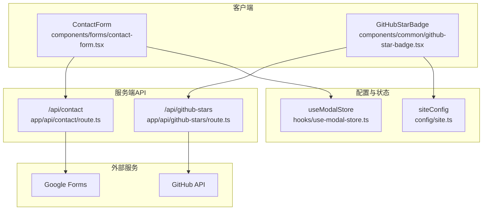
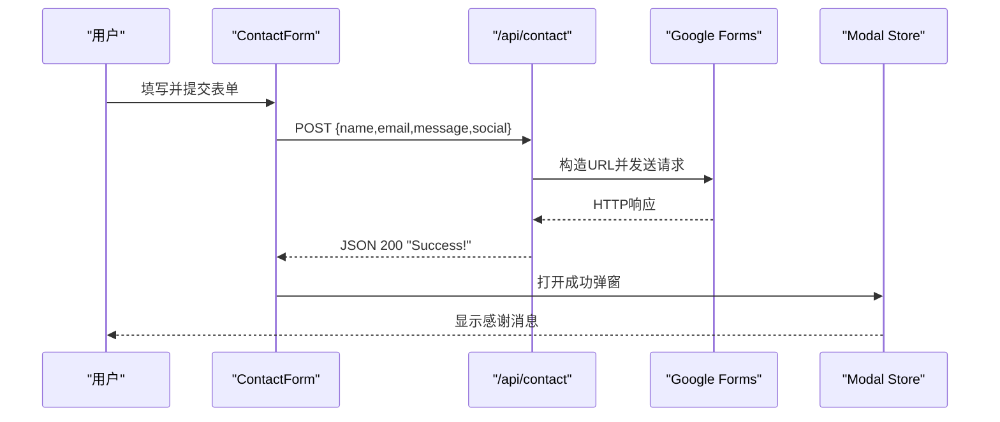
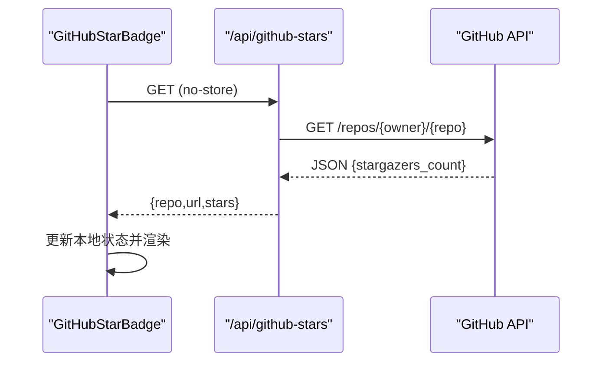
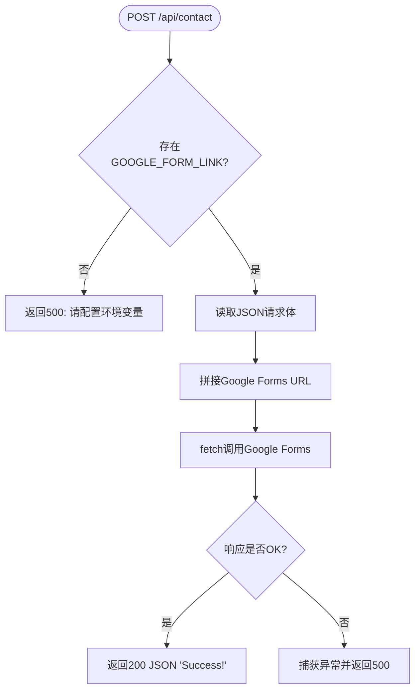
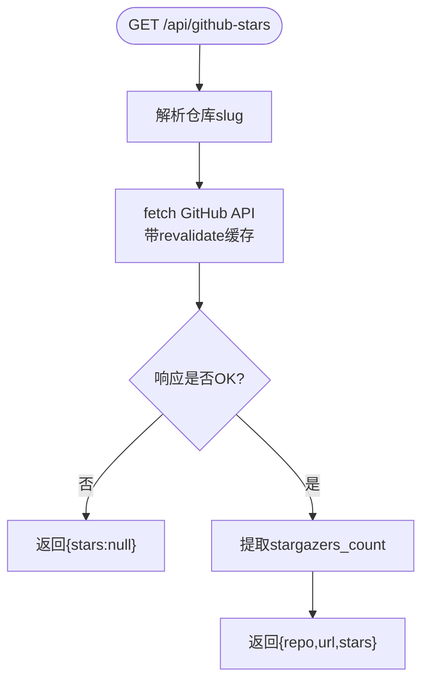
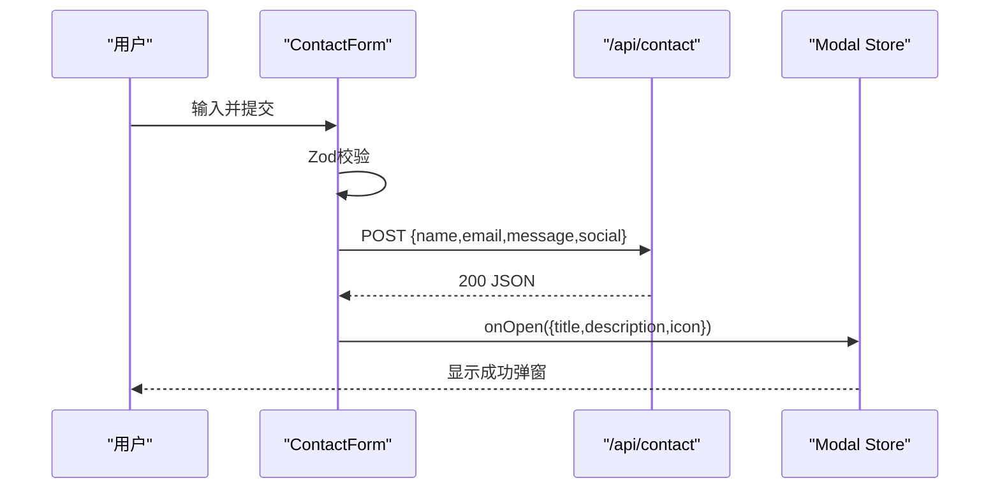
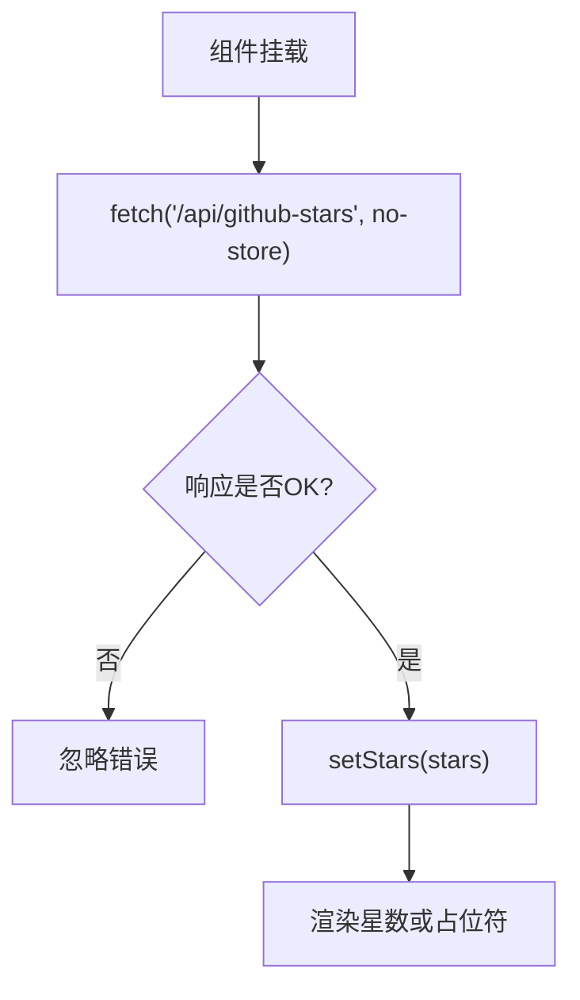
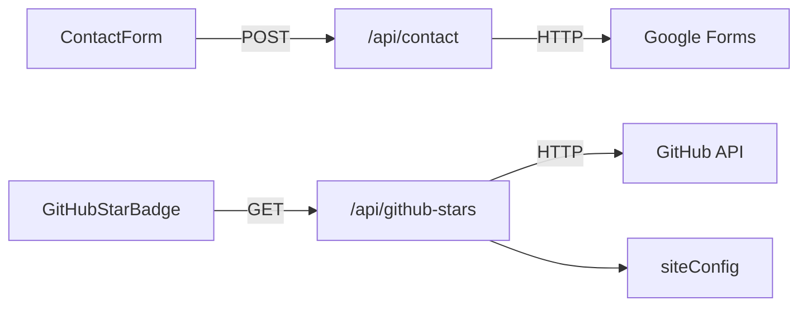

# API请求流

<cite>
**本文引用的文件**
- [app/api/contact/route.ts](file://app/api/contact/route.ts)
- [app/api/github-stars/route.ts](file://app/api/github-stars/route.ts)
- [components/forms/contact-form.tsx](file://components/forms/contact-form.tsx)
- [components/common/github-star-badge.tsx](file://components/common/github-star-badge.tsx)
- [config/site.ts](file://config/site.ts)
- [hooks/use-modal-store.ts](file://hooks/use-modal-store.ts)
- [lib/utils.ts](file://lib/utils.ts)
</cite>

## 目录
1. [简介](#简介)
2. [项目结构](#项目结构)
3. [核心组件](#核心组件)
4. [架构总览](#架构总览)
5. [详细组件分析](#详细组件分析)
6. [依赖关系分析](#依赖关系分析)
7. [性能考量](#性能考量)
8. [故障排查指南](#故障排查指南)
9. [结论](#结论)
10. [附录：API使用示例与最佳实践](#附录api使用示例与最佳实践)

## 简介
本文件面向Next.js应用中的API请求流程，聚焦以下目标：
- 说明Next.js App Router中API路由的设计与实现模式（请求处理、参数验证、错误处理）。
- 详细描述“联系表单”API的实现：包括Google Forms集成、响应格式、客户端调用与状态管理。
- 解释GitHub Stars API的调用机制：认证、缓存策略、错误处理与重试建议。
- 描述客户端组件如何调用这些API，涵盖状态管理、加载态、错误提示等。
- 提供完整的API使用示例与最佳实践。

## 项目结构
本项目采用Next.js App Router组织API路由与页面：
- API路由位于 app/api/ 下，按功能划分目录，如 contact、github-stars。
- 客户端组件位于 components/ 下，负责UI交互与数据获取。
- 配置集中存放于 config/，例如站点信息、链接等。
- 工具函数与通用逻辑在 lib/ 与 hooks/ 中。

图表来源
- [components/forms/contact-form.tsx:1-142](file://components/forms/contact-form.tsx#L1-L142)
- [app/api/contact/route.ts:1-31](file://app/api/contact/route.ts#L1-L31)
- [components/common/github-star-badge.tsx:1-63](file://components/common/github-star-badge.tsx#L1-L63)
- [app/api/github-stars/route.ts:1-44](file://app/api/github-stars/route.ts#L1-L44)
- [config/site.ts:1-41](file://config/site.ts#L1-L41)
- [hooks/use-modal-store.ts:1-36](file://hooks/use-modal-store.ts#L1-L36)

章节来源
- [app/api/contact/route.ts:1-31](file://app/api/contact/route.ts#L1-L31)
- [app/api/github-stars/route.ts:1-44](file://app/api/github-stars/route.ts#L1-L44)
- [components/forms/contact-form.tsx:1-142](file://components/forms/contact-form.tsx#L1-L142)
- [components/common/github-star-badge.tsx:1-63](file://components/common/github-star-badge.tsx#L1-L63)
- [config/site.ts:1-41](file://config/site.ts#L1-L41)
- [hooks/use-modal-store.ts:1-36](file://hooks/use-modal-store.ts#L1-L36)

## 核心组件
- 联系表单组件 ContactForm：基于React Hook Form + Zod进行表单校验，提交到 /api/contact。
- GitHub Star徽章组件 GitHubStarBadge：从 /api/github-stars 拉取仓库星数并展示。
- 联系表单API /api/contact：读取环境变量，将表单数据转发至Google Forms，返回统一JSON响应。
- GitHub Stars API /api/github-stars：从配置解析仓库地址，调用GitHub API获取星数，内置缓存与错误降级。

章节来源
- [components/forms/contact-form.tsx:1-142](file://components/forms/contact-form.tsx#L1-L142)
- [components/common/github-star-badge.tsx:1-63](file://components/common/github-star-badge.tsx#L1-L63)
- [app/api/contact/route.ts:1-31](file://app/api/contact/route.ts#L1-L31)
- [app/api/github-stars/route.ts:1-44](file://app/api/github-stars/route.ts#L1-L44)

## 架构总览
整体请求链路如下：
- 联系表单：客户端提交 -> Next.js API路由 -> Google Forms -> 返回成功响应 -> 客户端弹窗反馈。
- GitHub Stars：客户端组件 -> Next.js API路由 -> GitHub API（带缓存）-> 返回星数 -> 客户端渲染。

图表来源
- [components/forms/contact-form.tsx:48-71](file://components/forms/contact-form.tsx#L48-L71)
- [app/api/contact/route.ts:17-29](file://app/api/contact/route.ts#L17-L29)
- [hooks/use-modal-store.ts:22-35](file://hooks/use-modal-store.ts#L22-L35)

图表来源
- [components/common/github-star-badge.tsx:17-36](file://components/common/github-star-badge.tsx#L17-L36)
- [app/api/github-stars/route.ts:17-43](file://app/api/github-stars/route.ts#L17-L43)

## 详细组件分析

### 联系表单API（/api/contact）
- 设计要点
  - 通过环境变量注入Google Forms链接与各字段ID，避免硬编码敏感信息。
  - 接收JSON请求体，解构 name、email、message、social。
  - 拼接查询参数调用Google Forms的formResponse接口。
  - 成功返回200 JSON；异常捕获后返回500。
- 参数验证
  - 服务端未做二次校验，建议在客户端完成严格校验（Zod），并在必要时在服务端补充基础校验。
- 错误处理
  - 缺少环境变量时直接返回500。
  - 网络或第三方服务异常时捕获并返回500。
- 扩展建议
  - 增加速率限制与防刷。
  - 对敏感字段进行脱敏或加密传输。
  - 记录结构化日志以便审计。

图表来源
- [app/api/contact/route.ts:3-29](file://app/api/contact/route.ts#L3-L29)

章节来源
- [app/api/contact/route.ts:1-31](file://app/api/contact/route.ts#L1-L31)

### GitHub Stars API（/api/github-stars）
- 设计要点
  - 从 siteConfig.links.templateRepo 解析仓库路径，作为GitHub API的请求目标。
  - 使用 next.revalidate 设置缓存时间（6小时），减少重复请求。
  - 添加Accept头以兼容GitHub API v3。
  - 失败或异常时返回null星数，保证前端可优雅降级。
- 认证
  - 当前未使用Token，受限于GitHub未认证访问配额。如需更高配额，可引入环境变量存储Token并在请求头中添加 Authorization。
- 缓存
  - 通过next.revalidate实现边缘/服务器缓存，降低后端压力。
- 错误处理
  - 非2xx或解析失败时返回null，前端不崩溃。
- 扩展建议
  - 增加重试与退避策略。
  - 增加监控指标（成功率、耗时）。
  - 支持多仓库或自定义仓库配置。

图表来源
- [app/api/github-stars/route.ts:7-43](file://app/api/github-stars/route.ts#L7-L43)
- [config/site.ts:8-12](file://config/site.ts#L8-L12)

章节来源
- [app/api/github-stars/route.ts:1-44](file://app/api/github-stars/route.ts#L1-L44)
- [config/site.ts:1-41](file://config/site.ts#L1-L41)

### 客户端：联系表单组件（ContactForm）
- 表单校验
  - 使用Zod定义schema：name最小长度、email格式、message最小长度、social可选URL。
- 提交流程
  - 提交时调用 /api/contact，携带JSON body。
  - 成功后重置表单并通过Modal Store打开成功弹窗。
- 状态与错误
  - 当前未显式处理网络错误，建议增加loading与错误提示。
- 可访问性
  - 使用语义化表单控件与提示信息，提升无障碍体验。

图表来源
- [components/forms/contact-form.tsx:21-71](file://components/forms/contact-form.tsx#L21-L71)
- [hooks/use-modal-store.ts:22-35](file://hooks/use-modal-store.ts#L22-L35)

章节来源
- [components/forms/contact-form.tsx:1-142](file://components/forms/contact-form.tsx#L1-L142)
- [hooks/use-modal-store.ts:1-36](file://hooks/use-modal-store.ts#L1-L36)

### 客户端：GitHub Star徽章组件（GitHubStarBadge）
- 数据获取
  - 组件挂载后调用 /api/github-stars，使用 no-store 避免浏览器缓存干扰。
  - 解析返回的 stars 并更新本地状态。
- 渲染
  - 若stars为null则显示占位文本；否则格式化显示。
  - 点击跳转至模板仓库。
- 健壮性
  - 忽略网络异常，确保组件稳定渲染。

图表来源
- [components/common/github-star-badge.tsx:17-36](file://components/common/github-star-badge.tsx#L17-L36)
- [components/common/github-star-badge.tsx:38-61](file://components/common/github-star-badge.tsx#L38-L61)

章节来源
- [components/common/github-star-badge.tsx:1-63](file://components/common/github-star-badge.tsx#L1-L63)

## 依赖关系分析
- 模块耦合
  - ContactForm 依赖 Zod、React Hook Form、UI组件与Modal Store。
  - /api/contact 依赖环境变量与Google Forms。
  - GitHubStarBadge 依赖 /api/github-stars 与 siteConfig。
  - /api/github-stars 依赖 siteConfig 与GitHub API。
- 外部依赖
  - Google Forms：用于收集联系表单数据。
  - GitHub API：用于获取仓库星数。
- 潜在风险
  - 环境变量缺失会导致API失败。
  - 第三方服务不可用会触发错误分支。

图表来源
- [components/forms/contact-form.tsx:48-71](file://components/forms/contact-form.tsx#L48-L71)
- [app/api/contact/route.ts:17-29](file://app/api/contact/route.ts#L17-L29)
- [components/common/github-star-badge.tsx:17-36](file://components/common/github-star-badge.tsx#L17-L36)
- [app/api/github-stars/route.ts:17-43](file://app/api/github-stars/route.ts#L17-L43)
- [config/site.ts:8-12](file://config/site.ts#L8-L12)

章节来源
- [components/forms/contact-form.tsx:1-142](file://components/forms/contact-form.tsx#L1-L142)
- [app/api/contact/route.ts:1-31](file://app/api/contact/route.ts#L1-L31)
- [components/common/github-star-badge.tsx:1-63](file://components/common/github-star-badge.tsx#L1-L63)
- [app/api/github-stars/route.ts:1-44](file://app/api/github-stars/route.ts#L1-L44)
- [config/site.ts:1-41](file://config/site.ts#L1-L41)

## 性能考量
- 缓存策略
  - /api/github-stars 使用 next.revalidate=6小时，显著降低GitHub API调用频率。
  - 客户端使用 no-store 避免浏览器缓存导致的数据陈旧。
- 请求优化
  - 仅在需要时发起请求（组件挂载时）。
  - 对频繁调用的API考虑加入去抖或节流。
- 错误与降级
  - 当GitHub API不可用时，前端仍可正常渲染占位内容。
- 可扩展性
  - 可通过CDN或边缘缓存进一步加速静态资源与API响应。

[本节为通用性能讨论，不直接分析具体文件]

## 故障排查指南
- 联系表单无法提交
  - 检查环境变量 GOOGLE_FORM_LINK 及字段ID是否正确配置。
  - 查看控制台是否有网络错误或跨域问题。
  - 确认Google Forms已启用接受响应。
- GitHub星数为空
  - 检查 siteConfig.links.templateRepo 是否为有效GitHub仓库URL。
  - 观察网络面板是否出现403/429等限流错误。
  - 确认服务端缓存是否生效（revalidate）。
- 弹窗不显示
  - 确认Modal Store已正确初始化且onOpen被调用。
  - 检查UI层是否正确监听store状态变化。

章节来源
- [app/api/contact/route.ts:3-29](file://app/api/contact/route.ts#L3-L29)
- [app/api/github-stars/route.ts:17-43](file://app/api/github-stars/route.ts#L17-L43)
- [components/forms/contact-form.tsx:48-71](file://components/forms/contact-form.tsx#L48-L71)
- [components/common/github-star-badge.tsx:17-36](file://components/common/github-star-badge.tsx#L17-L36)
- [hooks/use-modal-store.ts:22-35](file://hooks/use-modal-store.ts#L22-L35)

## 结论
本项目通过Next.js App Router实现了清晰的API分层：
- 联系表单API将前端数据可靠地投递到Google Forms，并提供统一的响应格式与错误处理。
- GitHub Stars API通过缓存与错误降级，保障前端展示的稳定性与性能。
- 客户端组件采用现代状态管理与校验方案，具备良好的用户体验与可维护性。
建议在生产环境中进一步完善安全校验、限流、监控与告警，以提升系统的鲁棒性与可观测性。

[本节为总结性内容，不直接分析具体文件]

## 附录：API使用示例与最佳实践

### 联系表单API
- 端点
  - POST /api/contact
- 请求体
  - name: string（必填，最小长度）
  - email: string（必填，邮箱格式）
  - message: string（必填，最小长度）
  - social: string（可选，URL格式）
- 响应
  - 200: JSON "Success!"
  - 500: 字符串错误信息（如环境变量缺失或服务异常）
- 使用示例
  - 客户端通过fetch调用，设置Content-Type为application/json，并传递上述字段。
  - 成功后重置表单并展示成功弹窗。
- 最佳实践
  - 前端使用Zod进行强类型校验。
  - 服务端增加基础校验与速率限制。
  - 记录结构化日志，便于追踪问题。

章节来源
- [components/forms/contact-form.tsx:21-71](file://components/forms/contact-form.tsx#L21-L71)
- [app/api/contact/route.ts:3-29](file://app/api/contact/route.ts#L3-L29)

### GitHub Stars API
- 端点
  - GET /api/github-stars
- 响应
  - repo: string（仓库路径）
  - url: string（仓库链接）
  - stars: number | null（星数，失败时为null）
- 使用示例
  - 客户端组件在挂载时调用该端点，解析stars并渲染。
- 最佳实践
  - 使用next.revalidate控制缓存周期。
  - 如需更高配额，引入Token认证。
  - 增加重试与退避策略，提高可用性。

章节来源
- [components/common/github-star-badge.tsx:17-36](file://components/common/github-star-badge.tsx#L17-L36)
- [app/api/github-stars/route.ts:17-43](file://app/api/github-stars/route.ts#L17-L43)
- [config/site.ts:8-12](file://config/site.ts#L8-L12)