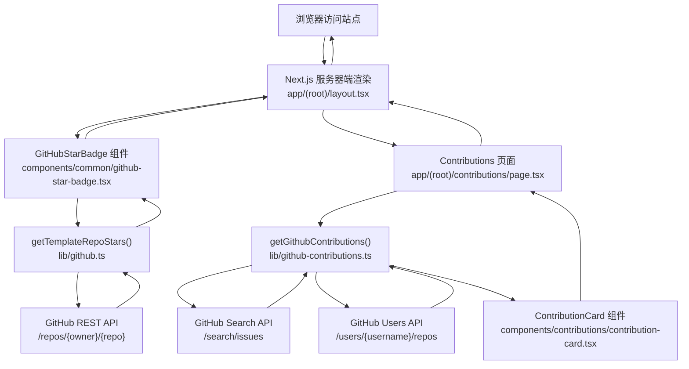
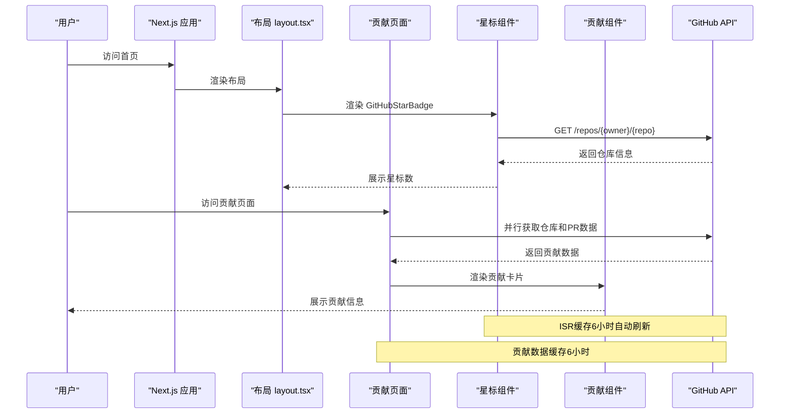
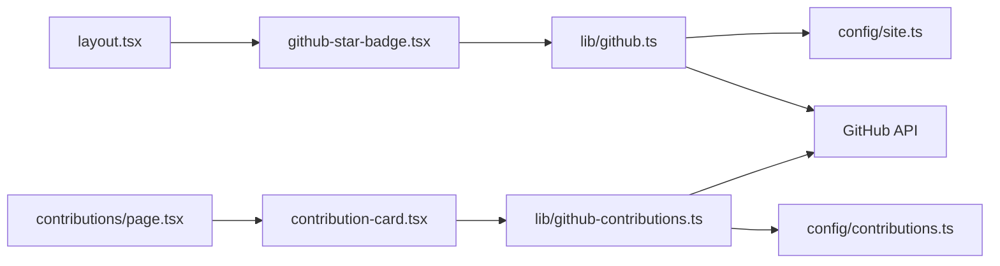
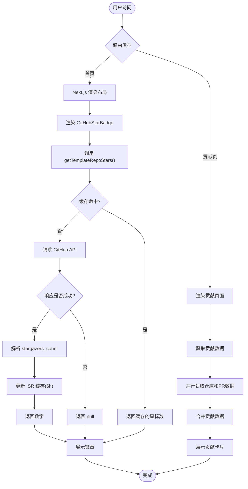
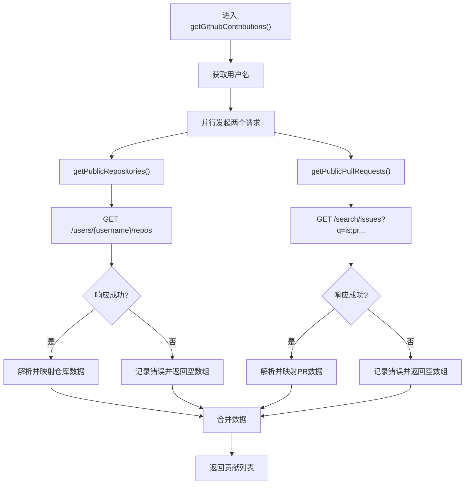
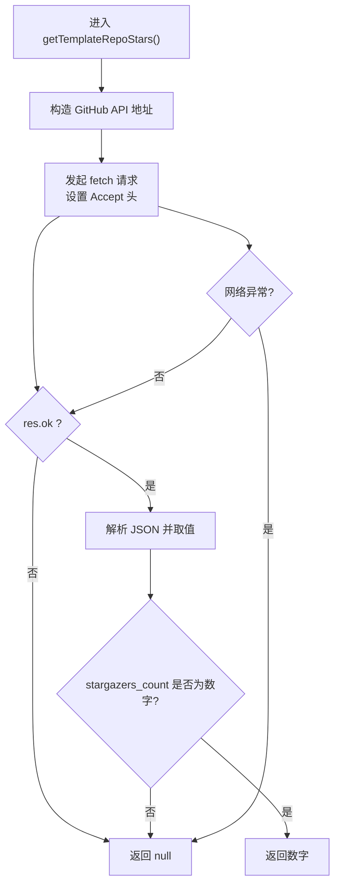

# GitHub集成数据流

<cite>
**本文引用的文件**
- [lib/github.ts](file://lib/github.ts)
- [lib/github-contributions.ts](file://lib/github-contributions.ts)
- [components/common/github-star-badge.tsx](file://components/common/github-star-badge.tsx)
- [components/contributions/contribution-card.tsx](file://components/contributions/contribution-card.tsx)
- [app/(root)/layout.tsx](file://app/(root)/layout.tsx)
- [app/(root)/contributions/page.tsx](file://app/(root)/contributions/page.tsx)
- [config/site.ts](file://config/site.ts)
- [config/contributions.ts](file://config/contributions.ts)
</cite>

## 更新摘要
**所做更改**
- 新增贡献同步系统章节，详细说明仓库获取和Pull Request同步机制
- 更新架构总览图，包含新的贡献数据流
- 增强API认证和请求处理说明
- 添加实时活动同步和数据验证机制
- 扩展性能优化策略，涵盖并发请求和缓存策略

## 目录
1. [简介](#简介)
2. [项目结构](#项目结构)
3. [核心组件](#核心组件)
4. [架构总览](#架构总览)
5. [详细组件分析](#详细组件分析)
6. [贡献同步系统](#贡献同步系统)
7. [依赖关系分析](#依赖关系分析)
8. [性能与缓存策略](#性能与缓存策略)
9. [故障处理与限流恢复](#故障处理与限流恢复)
10. [结论](#结论)
11. [附录：数据流图与流程图](#附录数据流图与流程图)

## 简介
本文档面向Next.js投资组合项目的GitHub集成，聚焦完整的数据流转过程：从用户访问页面开始，到服务端渲染时调用GitHub API、获取并缓存星标数和贡献信息，再到前端组件展示的完整链路。文档详细说明认证方式、请求处理、响应格式化、错误处理与重试机制，以及ISR缓存策略和性能优化方案，并提供限流与故障恢复建议。

**最新更新**：项目已增强为完整的GitHub贡献同步系统，支持实时获取用户的公开仓库和Pull Request信息，实现动态数据展示。

## 项目结构
本项目采用Next.js App Router组织代码，GitHub相关逻辑集中在以下位置：
- 基础数据获取与缓存：lib/github.ts
- 贡献同步系统：lib/github-contributions.ts
- 星标徽章组件：components/common/github-star-badge.tsx
- 贡献卡片组件：components/contributions/contribution-card.tsx
- 布局集成：app/(root)/layout.tsx
- 贡献页面：app/(root)/contributions/page.tsx
- 站点配置：config/site.ts
- 贡献配置：config/contributions.ts

**图表来源**
- [app/(root)/layout.tsx:11-25](file://app/(root)/layout.tsx#L11-L25)
- [app/(root)/contributions/page.tsx:13-24](file://app/(root)/contributions/page.tsx#L13-L24)
- [components/common/github-star-badge.tsx:12-13](file://components/common/github-star-badge.tsx#L12-L13)
- [lib/github.ts:12-32](file://lib/github.ts#L12-L32)
- [lib/github-contributions.ts:178-186](file://lib/github-contributions.ts#L178-L186)

**章节来源**
- [app/(root)/layout.tsx:11-25](file://app/(root)/layout.tsx#L11-L25)
- [app/(root)/contributions/page.tsx:13-24](file://app/(root)/contributions/page.tsx#L13-L24)
- [components/common/github-star-badge.tsx:12-13](file://components/common/github-star-badge.tsx#L12-L13)
- [lib/github.ts:12-32](file://lib/github.ts#L12-L32)
- [lib/github-contributions.ts:178-186](file://lib/github-contributions.ts#L178-L186)
- [config/site.ts:8-12](file://config/site.ts#L8-L12)
- [config/contributions.ts:29-34](file://config/contributions.ts#L29-L34)

## 核心组件
- **基础数据获取层（lib/github.ts）**
  - getTemplateRepoSlug()：从siteConfig.links.templateRepo解析出 owner/repo 片段，用于构造API路径。
  - getTemplateRepoStars()：调用GitHub REST API获取仓库信息，提取stargazers_count；使用next.revalidate实现增量静态再生成（ISR）缓存，默认6小时重新验证一次；对非成功响应或异常返回null。

- **贡献同步系统（lib/github-contributions.ts）**
  - getPublicRepositories()：获取用户的所有公开仓库，按星标数和时间排序。
  - getPublicPullRequests()：搜索用户的公开Pull Request，支持状态过滤和分页。
  - getGithubContributions()：并行获取仓库和PR数据，合并为统一的贡献列表。
  - getFeaturedGithubContributions()：智能筛选和排序，优先展示非fork且未归档的仓库。

- **展示层组件**
  - GitHubStarBadge：在服务端异步调用getTemplateRepoStars()，以徽章形式展示星标数。
  - ContributionCard：展示贡献卡片，支持仓库和Pull Request两种类型的差异化显示。

- **页面集成**
  - 布局集成：在导航区域两处引入GitHubStarBadge，确保全站可见。
  - 贡献页面：专门的贡献展示页面，提供完整的开源贡献信息。

**章节来源**
- [lib/github.ts:5-32](file://lib/github.ts#L5-L32)
- [lib/github-contributions.ts:128-227](file://lib/github-contributions.ts#L128-L227)
- [components/common/github-star-badge.tsx:8-39](file://components/common/github-star-badge.tsx#L8-L39)
- [components/contributions/contribution-card.tsx:16-97](file://components/contributions/contribution-card.tsx#L16-L97)
- [app/(root)/layout.tsx:11-25](file://app/(root)/layout.tsx#L11-L25)
- [app/(root)/contributions/page.tsx:13-24](file://app/(root)/contributions/page.tsx#L13-L24)

## 架构总览
下图展示了从用户访问到数据展示的端到端流程，包括新的贡献同步系统和原有的星标数展示。

**图表来源**
- [app/(root)/layout.tsx:11-25](file://app/(root)/layout.tsx#L11-L25)
- [app/(root)/contributions/page.tsx:13-24](file://app/(root)/contributions/page.tsx#L13-L24)
- [components/common/github-star-badge.tsx:12-13](file://components/common/github-star-badge.tsx#L12-L13)
- [lib/github.ts:12-32](file://lib/github.ts#L12-L32)
- [lib/github-contributions.ts:178-186](file://lib/github-contributions.ts#L178-L186)

## 详细组件分析

### 基础数据获取层：lib/github.ts
- **职责**
  - 解析仓库标识：getTemplateRepoSlug() 从配置的URL中提取 owner/repo。
  - 获取星标数：getTemplateRepoStars() 发起HTTP请求，设置Accept头为GitHub JSON格式，使用next.revalidate控制缓存失效周期。
- **关键行为**
  - 成功响应：解析JSON并校验stargazers_count类型，返回数字或null。
  - 失败响应：非2xx直接返回null，避免UI崩溃。
  - 网络异常：捕获异常并返回null，保证健壮性。
- **复杂度**
  - 时间复杂度：O(1)（单次HTTP请求与对象属性读取）。
  - 空间复杂度：O(1)。

**章节来源**
- [lib/github.ts:5-32](file://lib/github.ts#L5-L32)

### 贡献同步系统：lib/github-contributions.ts
- **职责**
  - 数据验证：使用Zod schema严格验证GitHub API响应数据结构。
  - 并发请求：通过Promise.all并行获取仓库和Pull Request数据。
  - 数据处理：将GitHub API响应映射为统一的数据结构。
  - 智能筛选：根据优先级筛选和排序贡献内容。
- **核心功能**
  - getPublicRepositories()：获取用户仓库，支持分页和排序。
  - getPublicPullRequests()：搜索用户PR，支持状态过滤。
  - getGithubContributions()：合并所有贡献数据。
  - getFeaturedGithubContributions()：智能展示精选贡献。
- **错误处理**
  - 使用getOrLogEmpty()包装每个API请求，单个请求失败不影响整体数据获取。
  - 详细的错误日志记录，便于问题排查。

**章节来源**
- [lib/github-contributions.ts:16-227](file://lib/github-contributions.ts#L16-L227)

### 展示层组件
- **GitHubStarBadge组件**
  - 服务端渲染：直接在组件中调用数据获取函数。
  - 无障碍支持：通过aria-label提供屏幕阅读器支持。
  - 优雅降级：数据缺失时显示友好提示。

- **ContributionCard组件**
  - 双模式显示：支持仓库和Pull Request两种类型的差异化展示。
  - 状态标签：清晰显示仓库类型（开源/Fork/归档）和PR状态（开放/关闭/已合并）。
  - 交互设计：悬停效果和外部链接图标提升用户体验。

**章节来源**
- [components/common/github-star-badge.tsx:8-39](file://components/common/github-star-badge.tsx#L8-L39)
- [components/contributions/contribution-card.tsx:16-97](file://components/contributions/contribution-card.tsx#L16-L97)

### 页面集成
- **布局集成**
  - 在导航区域两处渲染GitHubStarBadge，确保全站可见。
  - 响应式设计：移动端和桌面端的不同展示方式。

- **贡献页面**
  - 专门的数据获取：独立的页面组件负责贡献数据的获取和渲染。
  - 元数据配置：SEO友好的标题和描述。

**章节来源**
- [app/(root)/layout.tsx:11-25](file://app/(root)/layout.tsx#L11-L25)
- [app/(root)/contributions/page.tsx:13-24](file://app/(root)/contributions/page.tsx#L13-L24)

## 贡献同步系统

### 数据获取流程
贡献同步系统通过两个主要的GitHub API端点获取数据：

1. **仓库数据获取**
   - 端点：`/users/{username}/repos`
   - 参数：type=owner, sort=updated, per_page=100
   - 排序：按星标数降序，其次按更新时间降序
   - 数据映射：转换为RepositoryContribution类型

2. **Pull Request数据获取**
   - 端点：`/search/issues`
   - 查询：`is:pr is:public author:{username} -user:{username}`
   - 参数：sort=updated, order=desc, per_page=10
   - 状态映射：open/closed/merged三种状态

### 数据验证与处理
- **Schema验证**：使用Zod严格验证API响应结构，确保数据类型安全。
- **并发处理**：通过Promise.all并行获取仓库和PR数据，提升性能。
- **错误隔离**：单个API请求失败不影响其他数据获取。
- **智能筛选**：优先展示非fork且未归档的仓库，提升展示质量。

### 配置管理
- **revalidateSeconds**：6小时缓存刷新周期
- **featuredLimit**：精选贡献总数限制
- **featuredRepositoryLimit**：精选仓库数量限制
- **pullRequestLimit**：Pull Request最大获取数量

**章节来源**
- [lib/github-contributions.ts:128-227](file://lib/github-contributions.ts#L128-L227)
- [config/contributions.ts:29-34](file://config/contributions.ts#L29-L34)

## 依赖关系分析
- **组件依赖**
  - GitHubStarBadge 依赖 lib/github.ts 的基础数据获取能力。
  - ContributionCard 依赖 lib/github-contributions.ts 的贡献数据获取能力。
  - 布局依赖 GitHubStarBadge 进行展示。
  - 贡献页面依赖 ContributionCard 进行展示。

- **外部依赖**
  - GitHub REST API（/repos/{owner}/{repo}）
  - GitHub Search API（/search/issues）
  - GitHub Users API（/users/{username}/repos）

- **耦合度**
  - 低耦合：数据获取与展示分离，便于替换数据源或调整缓存策略。
  - 模块化：基础功能和贡献功能独立，互不影响。

**图表来源**
- [app/(root)/layout.tsx:11-25](file://app/(root)/layout.tsx#L11-L25)
- [app/(root)/contributions/page.tsx:13-24](file://app/(root)/contributions/page.tsx#L13-L24)
- [components/common/github-star-badge.tsx:12-13](file://components/common/github-star-badge.tsx#L12-L13)
- [components/contributions/contribution-card.tsx:16-97](file://components/contributions/contribution-card.tsx#L16-L97)
- [lib/github.ts:12-32](file://lib/github.ts#L12-L32)
- [lib/github-contributions.ts:178-186](file://lib/github-contributions.ts#L178-L186)

**章节来源**
- [app/(root)/layout.tsx:11-25](file://app/(root)/layout.tsx#L11-L25)
- [app/(root)/contributions/page.tsx:13-24](file://app/(root)/contributions/page.tsx#L13-L24)
- [components/common/github-star-badge.tsx:12-13](file://components/common/github-star-badge.tsx#L12-L13)
- [components/contributions/contribution-card.tsx:16-97](file://components/contributions/contribution-card.tsx#L16-L97)
- [lib/github.ts:12-32](file://lib/github.ts#L12-L32)
- [lib/github-contributions.ts:178-186](file://lib/github-contributions.ts#L178-L186)

## 性能与缓存策略

### ISR缓存机制
- **星标数缓存**：通过next.revalidate=6小时实现增量静态再生成，显著降低GitHub API调用频率。
- **贡献数据缓存**：贡献同步系统同样使用6小时缓存周期，平衡数据新鲜度和性能。
- **首屏性能**：服务端渲染直接输出最终数值，避免客户端等待与闪烁。

### 并发优化
- **并行请求**：贡献同步系统使用Promise.all同时获取仓库和PR数据，减少总等待时间。
- **错误隔离**：单个API请求失败不会影响其他数据的获取，提升整体可用性。

### 内存优化
- **数据映射**：将GitHub API响应转换为轻量级数据结构，减少内存占用。
- **分页限制**：合理设置per_page参数，避免一次性加载过多数据。

### 进一步优化建议
- **进程内短期缓存**：在Node进程内维护最近一次结果与时间戳，避免同一请求被多次并发触发。
- **CDN边缘缓存**：如通过Vercel Edge Functions或CDN缓存API响应，进一步降低延迟。
- **预取与预热**：部署后主动触发一次构建期或启动期请求，填充初始缓存。
- **请求去重**：实现请求去重机制，避免重复的并发请求。

## 故障处理与限流恢复

### 当前错误处理
- **基础错误处理**：非2xx响应返回null，UI降级显示占位文案。
- **网络异常捕获**：捕获异常并返回null，避免崩溃。
- **贡献系统容错**：使用getOrLogEmpty()包装API请求，单个失败不影响整体。

### 认证与限流
- **API版本控制**：使用X-GitHub-Api-Version头部指定API版本。
- **可选认证**：支持可选的GitHub Token认证，提高API速率限制。
- **User-Agent标识**：设置自定义User-Agent，便于GitHub识别请求来源。

### 限流与重试建议
- **指数退避重试**：识别429 Too Many Requests与5xx错误，实施指数退避重试（例如1s、2s、4s、8s），最多重试3次。
- **速率限制器**：结合令牌桶/漏桶算法限制单位时间内的请求次数。
- **平台特性利用**：在Edge/Serverless环境中，利用平台提供的重试与超时控制。

### 降级策略
- **缓存命中优先**：即使API不可用，仍可使用上次缓存值。
- **离线兜底**：当连续失败达到阈值时，固定显示友好提示，并在后台静默重试。
- **渐进式增强**：基础功能（星标数）和高级功能（贡献详情）独立降级。

### 监控与告警
- **错误日志**：详细的错误日志记录，便于问题排查。
- **性能指标**：记录请求耗时、错误率、缓存命中率等关键指标。
- **健康检查**：定期检查GitHub API可用性，及时发现服务异常。

## 结论
本项目通过简洁的服务端组件与ISR缓存，实现了高效、稳定的GitHub数据展示。新增的贡献同步系统提供了完整的开源贡献展示能力，支持实时获取用户的仓库和Pull Request信息。数据获取与展示解耦，易于扩展与优化。建议在现有基础上加入更完善的重试与限流保护、进程内缓存与监控指标，进一步提升鲁棒性与可观测性。

## 附录：数据流图与流程图

### 端到端数据流图

**图表来源**
- [lib/github.ts:12-32](file://lib/github.ts#L12-L32)
- [lib/github-contributions.ts:178-186](file://lib/github-contributions.ts#L178-L186)
- [components/common/github-star-badge.tsx:12-13](file://components/common/github-star-badge.tsx#L12-L13)
- [components/contributions/contribution-card.tsx:16-97](file://components/contributions/contribution-card.tsx#L16-L97)
- [app/(root)/layout.tsx:11-25](file://app/(root)/layout.tsx#L11-L25)
- [app/(root)/contributions/page.tsx:13-24](file://app/(root)/contributions/page.tsx#L13-L24)

### 贡献同步请求流程图

**图表来源**
- [lib/github-contributions.ts:178-186](file://lib/github-contributions.ts#L178-L186)
- [lib/github-contributions.ts:128-164](file://lib/github-contributions.ts#L128-L164)

### 请求处理流程图（含错误分支）

**图表来源**
- [lib/github.ts:12-32](file://lib/github.ts#L12-L32)