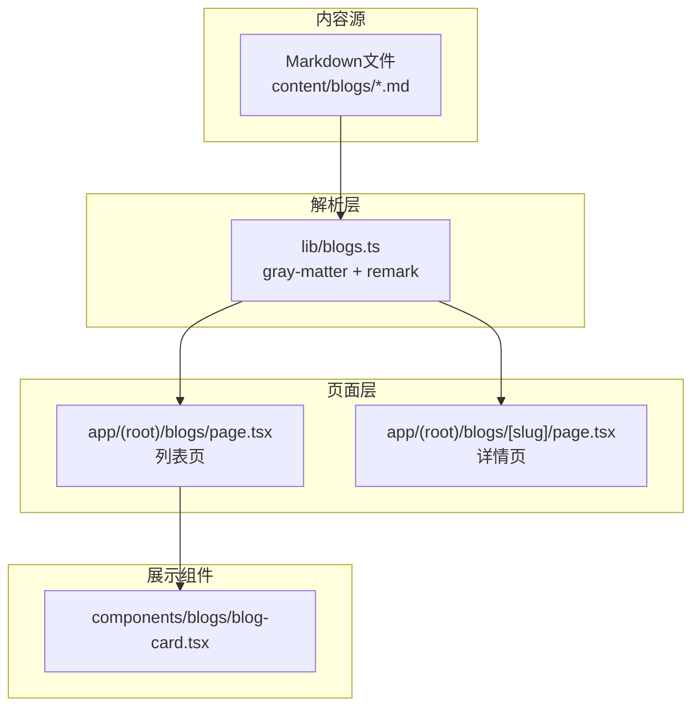
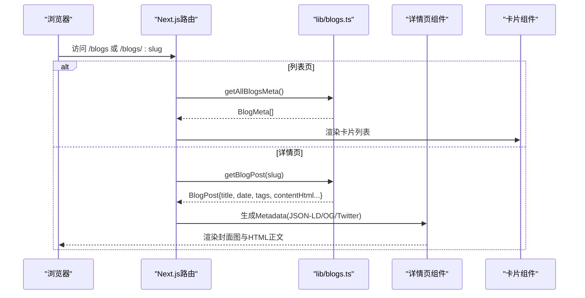
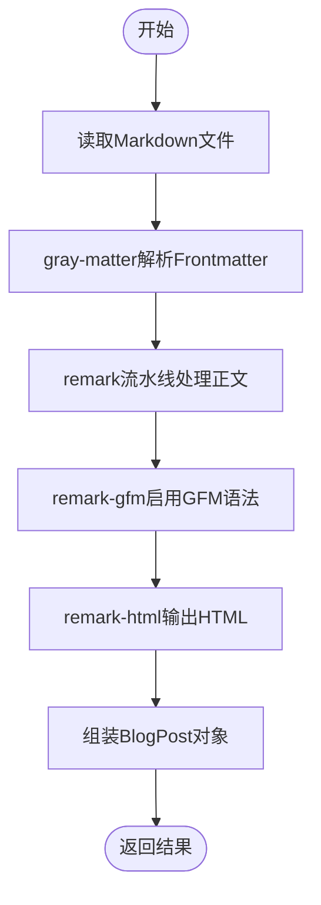
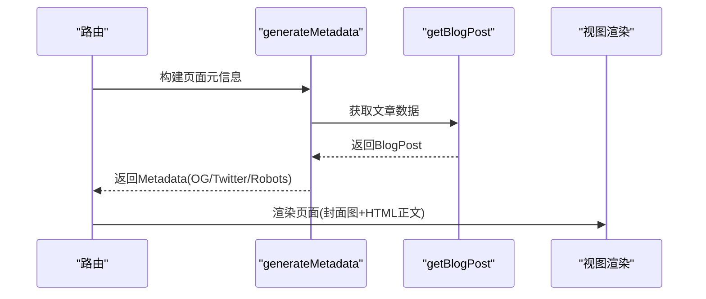
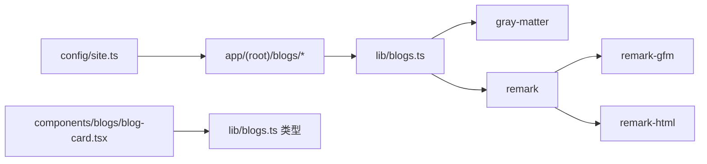

# Markdown内容流

<cite>
**本文引用的文件**
- [lib/blogs.ts](file://lib/blogs.ts)
- [app/(root)/blogs/[slug]/page.tsx](file://app/(root)/blogs/[slug]/page.tsx)
- [app/(root)/blogs/page.tsx](file://app/(root)/blogs/page.tsx)
- [components/blogs/blog-card.tsx](file://components/blogs/blog-card.tsx)
- [content/blogs/3d-card-threejs-blender.md](file://content/blogs/3d-card-threejs-blender.md)
- [package.json](file://package.json)
- [config/site.ts](file://config/site.ts)
- [lib/utils.ts](file://lib/utils.ts)
</cite>

## 目录
1. [简介](#简介)
2. [项目结构](#项目结构)
3. [核心组件](#核心组件)
4. [架构总览](#架构总览)
5. [详细组件分析](#详细组件分析)
6. [依赖关系分析](#依赖关系分析)
7. [性能与缓存策略](#性能与缓存策略)
8. [故障排查指南](#故障排查指南)
9. [结论](#结论)
10. [附录：新增博客文章流程与最佳实践](#附录新增博客文章流程与最佳实践)
11. [附录：内容管理API接口与使用示例](#附录内容管理api接口与使用示例)

## 简介
本文件面向“Markdown内容处理”的完整链路，覆盖博客内容的存储结构、解析流程与渲染机制。重点说明Gray Matter与Remark库在Frontmatter解析、Markdown转HTML、图片处理等方面的协作方式；阐述博客元数据的提取与管理（标题、日期、标签等）；给出内容缓存策略与性能优化建议；并提供新增博客文章的流程与最佳实践，以及内容管理的API接口和使用示例。

## 项目结构
本项目采用Next.js App Router组织页面，博客内容以Markdown文件集中存放于content/blogs目录，通过服务端函数读取并解析为结构化数据，再由页面组件进行渲染。

图表来源
- [lib/blogs.ts:1-97](file://lib/blogs.ts#L1-L97)
- [app/(root)/blogs/page.tsx:1-153](file://app/(root)/blogs/page.tsx#L1-L153)
- [app/(root)/blogs/[slug]/page.tsx:1-325](file://app/(root)/blogs/[slug]/page.tsx#L1-L325)
- [components/blogs/blog-card.tsx:1-96](file://components/blogs/blog-card.tsx#L1-L96)

章节来源
- [lib/blogs.ts:1-97](file://lib/blogs.ts#L1-L97)
- [app/(root)/blogs/page.tsx:1-153](file://app/(root)/blogs/page.tsx#L1-L153)
- [app/(root)/blogs/[slug]/page.tsx:1-325](file://app/(root)/blogs/[slug]/page.tsx#L1-L325)
- [components/blogs/blog-card.tsx:1-96](file://components/blogs/blog-card.tsx#L1-L96)

## 核心组件
- 内容解析与数据导出：lib/blogs.ts
  - 负责扫描content/blogs目录、读取Markdown、解析Frontmatter、将Markdown转换为HTML，并提供元数据聚合、精选文章筛选、阅读时长估算等能力。
- 列表页：app/(root)/blogs/page.tsx
  - 调用getAllBlogsMeta获取所有文章元数据，按时间倒序渲染卡片列表，同时注入集合页JSON-LD与面包屑Schema。
- 详情页：app/(root)/blogs/[slug]/page.tsx
  - 根据slug调用getBlogPost获取完整文章（含HTML），生成SEO元信息（OpenGraph/Twitter）、JSON-LD（文章与面包屑），并渲染封面图与正文。
- 卡片组件：components/blogs/blog-card.tsx
  - 展示封面图、标签、标题、摘要、日期与阅读时长，支持悬停动效与响应式布局。

章节来源
- [lib/blogs.ts:11-27](file://lib/blogs.ts#L11-L27)
- [lib/blogs.ts:35-97](file://lib/blogs.ts#L35-L97)
- [app/(root)/blogs/page.tsx:11-153](file://app/(root)/blogs/page.tsx#L11-L153)
- [app/(root)/blogs/[slug]/page.tsx:20-325](file://app/(root)/blogs/[slug]/page.tsx#L20-L325)
- [components/blogs/blog-card.tsx:1-96](file://components/blogs/blog-card.tsx#L1-L96)

## 架构总览
下图展示了从Markdown到最终页面的端到端数据流，包括Frontmatter解析、Markdown转HTML、SEO元数据注入与渲染。

图表来源
- [lib/blogs.ts:44-82](file://lib/blogs.ts#L44-L82)
- [app/(root)/blogs/page.tsx:41-153](file://app/(root)/blogs/page.tsx#L41-L153)
- [app/(root)/blogs/[slug]/page.tsx:20-177](file://app/(root)/blogs/[slug]/page.tsx#L20-L177)

## 详细组件分析

### 内容解析模块（lib/blogs.ts）
- 数据结构
  - BlogFrontmatter：定义标题、日期、描述、标签、封面图、阅读时长、是否精选等字段。
  - BlogMeta：在Frontmatter基础上增加slug。
  - BlogPost：在Meta基础上增加contentHtml。
- 关键流程
  - ensureBlogsDir：确保content/blogs目录存在。
  - getAllBlogSlugs：列出所有.md文件名（不含扩展名）。
  - getAllBlogsMeta：读取每个文件的Frontmatter，组装元数据并按date降序排序。
  - getBlogPost：读取单个文件，解析Frontmatter与正文，使用remark+remark-gfm+remark-html将Markdown转为HTML，返回完整文章对象。
  - getFeaturedBlogs：优先返回featured:true的文章，最多3篇；若无则回退到最新3篇。
  - estimateReadingTime：基于词数估算阅读时长（默认每分钟200词）。

图表来源
- [lib/blogs.ts:4-8](file://lib/blogs.ts#L4-L8)
- [lib/blogs.ts:64-82](file://lib/blogs.ts#L64-L82)

章节来源
- [lib/blogs.ts:11-27](file://lib/blogs.ts#L11-L27)
- [lib/blogs.ts:29-97](file://lib/blogs.ts#L29-L97)

### 列表页（app/(root)/blogs/page.tsx）
- 功能要点
  - 通过getAllBlogsMeta获取全部文章元数据。
  - 注入CollectionPage与Blog JSON-LD，包含每篇文章的headline、description、publishedDate、url、author、keywords与可选image。
  - 注入BreadcrumbList用于站点层级导航。
  - 渲染网格卡片列表，空状态提示。
- SEO与可访问性
  - 提供canonical、OpenGraph、Twitter Card等元信息。
  - 使用语义化结构与aria属性提升可访问性。

章节来源
- [app/(root)/blogs/page.tsx:11-153](file://app/(root)/blogs/page.tsx#L11-L153)

### 详情页（app/(root)/blogs/[slug]/page.tsx）
- 功能要点
  - generateStaticParams：基于getAllBlogSlugs静态生成所有文章路由。
  - generateMetadata：动态生成页面元信息（标题、描述、作者、关键词、OG/Twitter图片、robots等）。
  - 渲染面包屑导航、标题、描述、作者、日期、阅读时长、封面图与正文HTML。
  - 注入BlogPosting与BreadcrumbList JSON-LD，增强搜索引擎理解。
- 图片处理
  - 封面图通过Next Image组件渲染，支持优先级加载与尺寸控制。

图表来源
- [app/(root)/blogs/[slug]/page.tsx:20-79](file://app/(root)/blogs/[slug]/page.tsx#L20-L79)
- [app/(root)/blogs/[slug]/page.tsx:81-325](file://app/(root)/blogs/[slug]/page.tsx#L81-L325)
- [lib/blogs.ts:64-82](file://lib/blogs.ts#L64-L82)

章节来源
- [app/(root)/blogs/[slug]/page.tsx:20-325](file://app/(root)/blogs/[slug]/page.tsx#L20-L325)

### 卡片组件（components/blogs/blog-card.tsx）
- 展示封面图、标签（最多显示3个，超出显示计数）、标题、摘要、格式化日期与阅读时长。
- 交互与样式：悬停阴影、边框高亮、箭头指示；响应式布局适配不同屏幕。

章节来源
- [components/blogs/blog-card.tsx:1-96](file://components/blogs/blog-card.tsx#L1-L96)

## 依赖关系分析
- 运行时依赖
  - gray-matter：解析Markdown Frontmatter。
  - remark、remark-gfm、remark-html：Markdown解析与HTML转换，支持GitHub Flavored Markdown。
- 配置与工具
  - config/site.ts：站点全局配置（名称、作者、链接、OG图片等）。
  - lib/utils.ts：通用工具函数（类名合并、日期格式化）。

图表来源
- [package.json:26-38](file://package.json#L26-L38)
- [lib/blogs.ts:1-8](file://lib/blogs.ts#L1-L8)
- [config/site.ts:1-41](file://config/site.ts#L1-L41)

章节来源
- [package.json:26-38](file://package.json#L26-L38)
- [lib/blogs.ts:1-8](file://lib/blogs.ts#L1-L8)
- [config/site.ts:1-41](file://config/site.ts#L1-L41)

## 性能与缓存策略
当前实现特点
- 同步文件系统读取：getAllBlogSlugs、getAllBlogsMeta、getBlogPost均使用fs.readFileSync，适合构建期或小规模内容场景。
- 无显式内存缓存：每次请求都会重新读取并解析文件。

优化建议
- 构建期预取与静态生成
  - 利用Next.js的generateStaticParams与页面级异步函数，在构建时完成Markdown解析与HTML生成，减少运行时IO。
- 运行时缓存
  - 引入轻量内存缓存（如Map）对已解析的BlogPost进行缓存，避免重复解析同一slug。
  - 针对高频访问的精选文章（getFeaturedBlogs）可单独缓存。
- 增量静态再生成（ISR）
  - 结合Next.js ISR，当content/blogs下文件变更时触发重建，兼顾更新时效性与性能。
- 资源优化
  - 封面图使用Next Image的priority与合理尺寸，配合CDN缓存。
  - HTML输出中图片路径统一前缀，便于CDN与缓存策略管理。
- 并发与I/O
  - 若内容量增长，可将同步读取改为并行Promise.all，缩短首屏等待时间。
- 安全与健壮性
  - 保持remark-html的sanitize:false以满足富文本需求，但需确保输入可信；如需外部内容，应引入白名单过滤。

[本节为通用性能指导，不直接分析具体文件]

## 故障排查指南
- 常见问题
  - 目录不存在：ensureBlogsDir会创建content/blogs，但若权限不足会导致失败。检查运行环境目录权限。
  - 文件缺失或格式错误：getBlogPost在找不到文件或解析失败时会抛出异常，页面会调用notFound()。
  - 图片路径无效：封面图路径需相对于public或CDN地址，否则无法加载。
- 定位方法
  - 查看控制台错误堆栈，确认是fs读取还是remark解析阶段报错。
  - 检查Frontmatter字段是否符合BlogFrontmatter定义（必填字段、类型）。
  - 验证URL与canonical、OG图片地址是否正确拼接siteConfig.url。
- 修复建议
  - 修正Frontmatter字段拼写与类型。
  - 确保图片资源存在于public或可访问的CDN路径。
  - 若使用自定义remark插件，注意插件顺序与兼容性。

章节来源
- [lib/blogs.ts:29-33](file://lib/blogs.ts#L29-L33)
- [app/(root)/blogs/[slug]/page.tsx:81-89](file://app/(root)/blogs/[slug]/page.tsx#L81-L89)

## 结论
本项目通过gray-matter与remark构建了简洁高效的Markdown内容处理管线：以Markdown文件作为单一事实源，在服务端解析为结构化元数据与HTML，并在Next.js页面中完成SEO与渲染。该方案易于维护、可扩展性强，适合个人博客与小型内容站点。通过引入运行时缓存与ISR，可进一步提升性能与更新效率。

[本节为总结性内容，不直接分析具体文件]

## 附录：新增博客文章流程与最佳实践
- 步骤
  1. 在content/blogs目录下新建.md文件，命名即为slug（例如my-post.md）。
  2. 在文件顶部添加Frontmatter块，至少包含title、date、description、tags；可选coverImage、readingTime、featured。
  3. 编写Markdown正文，可使用GFM语法（表格、任务列表、脚注等由remark-gfm支持）。
  4. 本地开发时，Next.js会自动识别新文件并生成路由；构建时也会静态生成对应页面。
- 最佳实践
  - 标题与描述：简洁明确，利于SEO与分享预览。
  - 日期：使用ISO格式（YYYY-MM-DD），保证排序正确。
  - 标签：合理分类，便于后续筛选与聚合。
  - 封面图：建议使用WebP格式，尺寸适中，路径指向public或CDN。
  - 阅读时长：可手动设置readingTime以提升体验，或使用estimateReadingTime估算。
  - 精选文章：设置featured:true以便进入精选列表。
  - 图片与外链：确保链接有效，图片可访问；必要时添加alt文本。
  - 代码块与语法高亮：如需高亮，可在remark流水线中添加相应插件。

章节来源
- [content/blogs/3d-card-threejs-blender.md:1-9](file://content/blogs/3d-card-threejs-blender.md#L1-L9)
- [lib/blogs.ts:11-27](file://lib/blogs.ts#L11-L27)
- [lib/blogs.ts:91-97](file://lib/blogs.ts#L91-L97)

## 附录：内容管理API接口与使用示例
当前仓库未提供REST API用于内容管理。可通过以下服务端函数访问内容：
- getAllBlogSlugs(): string[]
  - 用途：获取所有文章slug列表，用于静态路由生成或菜单构建。
  - 示例：在generateStaticParams中调用，返回路由参数。
- getAllBlogsMeta(): BlogMeta[]
  - 用途：获取所有文章元数据（标题、日期、标签、封面图等），用于列表页展示。
  - 示例：在列表页调用，渲染卡片网格。
- getBlogPost(slug: string): Promise<BlogPost>
  - 用途：获取指定slug的完整文章（含HTML），用于详情页渲染。
  - 示例：在详情页调用，生成Metadata并渲染正文。
- getFeaturedBlogs(): BlogMeta[]
  - 用途：获取精选文章列表（优先featured:true，最多3篇）。
  - 示例：首页或侧边栏展示精选文章。
- estimateReadingTime(content: string): number
  - 用途：根据Markdown正文估算阅读时长（分钟）。
  - 示例：在卡片或详情页显示阅读时长。

使用建议
- 在Next.js服务端组件或API路由中导入上述函数，按需组合数据。
- 若需要对外暴露API，可在app/api下创建route.ts封装这些函数，返回JSON。

章节来源
- [lib/blogs.ts:35-97](file://lib/blogs.ts#L35-L97)
- [app/(root)/blogs/[slug]/page.tsx:20-89](file://app/(root)/blogs/[slug]/page.tsx#L20-L89)
- [app/(root)/blogs/page.tsx:41-153](file://app/(root)/blogs/page.tsx#L41-L153)