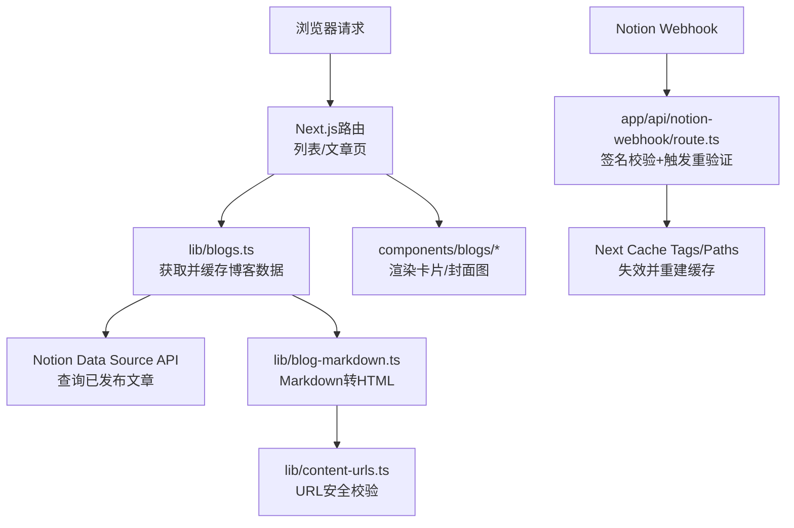
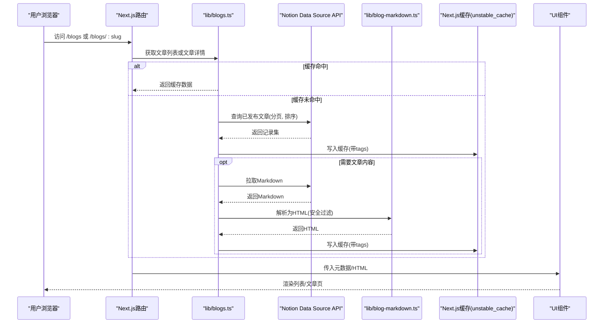
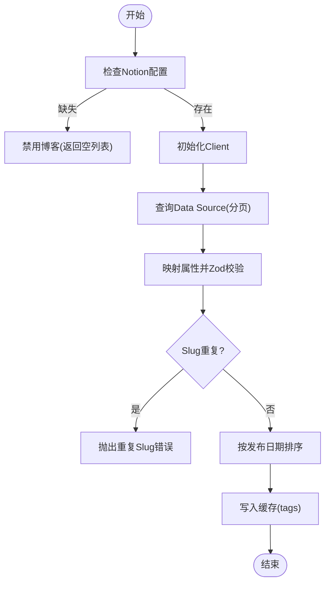
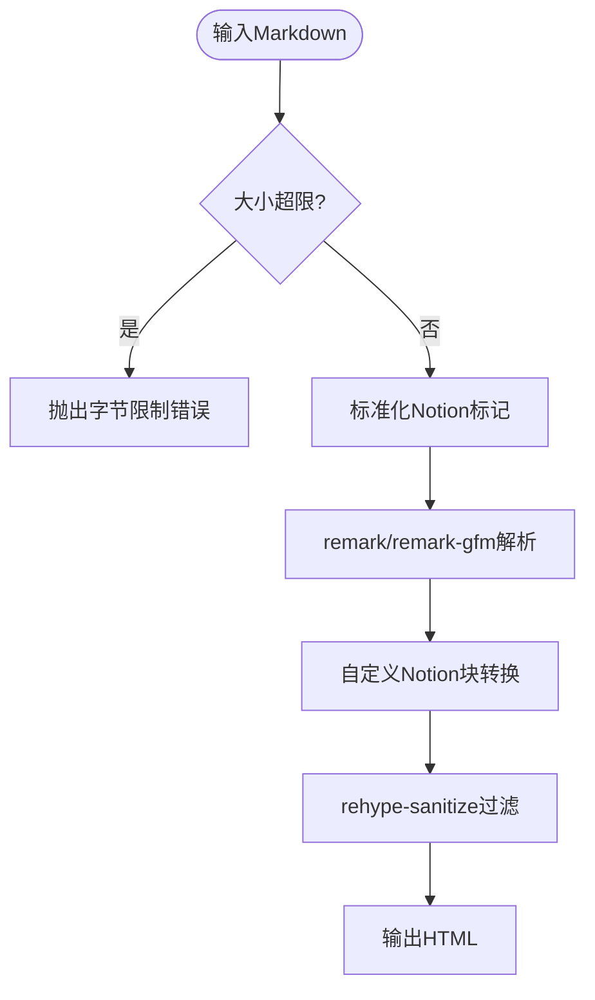
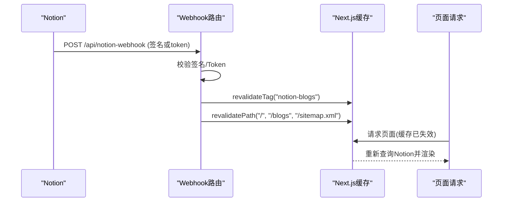
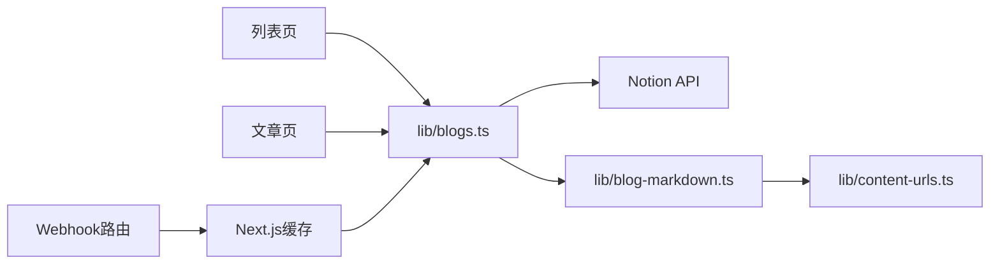

# 博客内容数据流

<cite>
**本文引用的文件**
- [lib/blogs.ts](file://lib/blogs.ts)
- [app/(root)/blogs/page.tsx](file://app/(root)/blogs/page.tsx)
- [app/(root)/blogs/[slug]/page.tsx](file://app/(root)/blogs/[slug]/page.tsx)
- [components/blogs/blog-card.tsx](file://components/blogs/blog-card.tsx)
- [components/blogs/blog-cover-image.tsx](file://components/blogs/blog-cover-image.tsx)
- [lib/blog-markdown.ts](file://lib/blog-markdown.ts)
- [lib/content-urls.ts](file://lib/content-urls.ts)
- [app/api/notion-webhook/route.ts](file://app/api/notion-webhook/route.ts)
</cite>

## 目录
1. [简介](#简介)
2. [项目结构](#项目结构)
3. [核心组件](#核心组件)
4. [架构总览](#架构总览)
5. [详细组件分析](#详细组件分析)
6. [依赖关系分析](#依赖关系分析)
7. [性能考量](#性能考量)
8. [故障排查指南](#故障排查指南)
9. [结论](#结论)
10. [附录](#附录)

## 简介
本文件面向Next.js投资组合项目的“博客内容数据流”，完整描述从Notion数据库获取文章、Markdown解析、缓存策略到前端展示的端到端流程。重点涵盖：
- Notion API集成与分页处理
- 数据验证（Zod schema）与安全校验
- 缓存策略与失效/重新验证机制（含Webhook）
- 元数据提取、HTML渲染、阅读时间估算
- 用户请求到页面渲染的完整数据流图
- 常见问题与性能优化建议

## 项目结构
本项目采用Next.js App Router，博客相关代码主要分布在以下位置：
- 服务端数据获取与缓存：lib/blogs.ts
- Markdown渲染与内容安全：lib/blog-markdown.ts、lib/content-urls.ts
- 路由页面：app/(root)/blogs/page.tsx（列表页）、app/(root)/blogs/[slug]/page.tsx（文章页）
- UI组件：components/blogs/blog-card.tsx、components/blogs/blog-cover-image.tsx
- Webhook重验证：app/api/notion-webhook/route.ts

图表来源
- [lib/blogs.ts:17-131](file://lib/blogs.ts#L17-L131)
- [lib/blog-markdown.ts:483-531](file://lib/blog-markdown.ts#L483-L531)
- [lib/content-urls.ts:1-44](file://lib/content-urls.ts#L1-L44)
- [app/(root)/blogs/page.tsx:42-152](file://app/(root)/blogs/page.tsx#L42-L152)
- [app/(root)/blogs/[slug]/page.tsx:21-322](file://app/(root)/blogs/[slug]/page.tsx#L21-L322)
- [app/api/notion-webhook/route.ts:13-75](file://app/api/notion-webhook/route.ts#L13-L75)

章节来源
- [lib/blogs.ts:17-131](file://lib/blogs.ts#L17-L131)
- [app/(root)/blogs/page.tsx:42-152](file://app/(root)/blogs/page.tsx#L42-L152)
- [app/(root)/blogs/[slug]/page.tsx:21-322](file://app/(root)/blogs/[slug]/page.tsx#L21-L322)

## 核心组件
- 数据层（lib/blogs.ts）
  - Notion配置与客户端初始化
  - 属性读取与类型转换（标题、Slug、状态、日期、描述、标签、封面图、阅读时间、是否推荐）
  - Zod Schema严格校验
  - 分页查询与排序（按发布时间倒序）
  - 缓存封装（unstable_cache + tags）
  - 单篇文章内容加载（Markdown→HTML）
  - 阅读时间估算
- 渲染层（页面与组件）
  - 列表页：获取所有文章元数据，生成SEO JSON-LD，渲染卡片网格
  - 文章页：根据slug获取文章，渲染封面、正文HTML、面包屑、SEO JSON-LD
  - 卡片与封面图组件：懒加载/预加载、外部图片兼容
- 内容安全与解析（lib/blog-markdown.ts、lib/content-urls.ts）
  - 限制最大Markdown字节数与HTML嵌套深度
  - 过滤危险标签、清理临时Notion链接
  - 将Notion自定义块转换为标准Markdown/HTML
- Webhook与缓存失效（app/api/notion-webhook/route.ts）
  - 校验签名或接收验证Token
  - 触发Next.js缓存标签和路径的重验证

章节来源
- [lib/blogs.ts:66-131](file://lib/blogs.ts#L66-L131)
- [lib/blogs.ts:255-401](file://lib/blogs.ts#L255-L401)
- [lib/blogs.ts:422-536](file://lib/blogs.ts#L422-L536)
- [lib/blog-markdown.ts:19-55](file://lib/blog-markdown.ts#L19-L55)
- [lib/blog-markdown.ts:483-531](file://lib/blog-markdown.ts#L483-L531)
- [lib/content-urls.ts:1-44](file://lib/content-urls.ts#L1-L44)
- [app/(root)/blogs/page.tsx:42-152](file://app/(root)/blogs/page.tsx#L42-L152)
- [app/(root)/blogs/[slug]/page.tsx:21-322](file://app/(root)/blogs/[slug]/page.tsx#L21-L322)
- [components/blogs/blog-card.tsx:1-98](file://components/blogs/blog-card.tsx#L1-L98)
- [components/blogs/blog-cover-image.tsx:1-69](file://components/blogs/blog-cover-image.tsx#L1-L69)
- [app/api/notion-webhook/route.ts:13-75](file://app/api/notion-webhook/route.ts#L13-L75)

## 架构总览
下图展示从用户请求到页面渲染的完整数据流，包括缓存命中、Notion API调用、Markdown解析与前端渲染。

图表来源
- [lib/blogs.ts:337-420](file://lib/blogs.ts#L337-L420)
- [lib/blogs.ts:422-476](file://lib/blogs.ts#L422-L476)
- [lib/blog-markdown.ts:509-531](file://lib/blog-markdown.ts#L509-L531)
- [app/(root)/blogs/page.tsx:42-152](file://app/(root)/blogs/page.tsx#L42-L152)
- [app/(root)/blogs/[slug]/page.tsx:86-322](file://app/(root)/blogs/[slug]/page.tsx#L86-L322)

## 详细组件分析

### 数据获取与验证（lib/blogs.ts）
- Notion配置与客户端
  - 通过环境变量获取NOTION_TOKEN与NOTION_DATA_SOURCE_ID，构建Client并设置超时与重试策略。
  - 若配置缺失，会降级为禁用博客功能并返回空列表。
- 属性映射与Zod校验
  - 使用z.object定义notionBlogRecordSchema，对字段进行长度、格式、类型校验；封面图URL需满足稳定站点相对路径或HTTPS且非临时链接。
  - 对Status字段动态识别select/status两种类型，确保包含“Published”选项。
- 分页与排序
  - 使用dataSources.query分页获取，page_size=100，按PublishedAt降序排列，支持start_cursor循环直至无更多结果。
  - 去重检查slug重复，避免数据异常。
- 缓存策略
  - 使用unstable_cache封装查询函数，设置revalidate秒数与tags（BLOG_CACHE_TAG），便于全局失效。
  - 单篇文章内容也独立缓存，键包含slug、pageId、updatedAt与dataSourceId，避免脏读。
- 错误处理
  - 缺失属性、类型不匹配、非Published状态、截断响应、未知block等场景均抛出明确错误。
  - 针对ObjectNotFound返回null，由上层路由处理404。

图表来源
- [lib/blogs.ts:92-131](file://lib/blogs.ts#L92-L131)
- [lib/blogs.ts:255-285](file://lib/blogs.ts#L255-L285)
- [lib/blogs.ts:337-401](file://lib/blogs.ts#L337-L401)
- [lib/blogs.ts:404-420](file://lib/blogs.ts#L404-L420)

章节来源
- [lib/blogs.ts:92-131](file://lib/blogs.ts#L92-L131)
- [lib/blogs.ts:255-285](file://lib/blogs.ts#L255-L285)
- [lib/blogs.ts:337-401](file://lib/blogs.ts#L337-L401)
- [lib/blogs.ts:404-420](file://lib/blogs.ts#L404-L420)

### Markdown解析与内容安全（lib/blog-markdown.ts、lib/content-urls.ts）
- 安全限制
  - 限制Markdown最大字节数，防止超大内容导致内存压力。
  - 限制HTML最大嵌套深度，避免递归过深。
  - 丢弃危险标签（如script、iframe等）。
- Notion块转换
  - 将callout、table、details、synced-block等Notion自定义块转换为标准Markdown/HTML。
  - 规范化标签名与属性，清理临时Notion文件链接。
- 渲染管线
  - remark → remark-gfm → remark-rehype → rehype-raw → rehype-stringify，中间插入自定义处理器进行安全过滤与内容替换。
- URL校验
  - isStableContentUrl仅允许站点相对路径或HTTPS，并拒绝临时签名链接，保障资源稳定性与安全性。

图表来源
- [lib/blog-markdown.ts:19-55](file://lib/blog-markdown.ts#L19-L55)
- [lib/blog-markdown.ts:483-531](file://lib/blog-markdown.ts#L483-L531)
- [lib/content-urls.ts:1-44](file://lib/content-urls.ts#L1-L44)

章节来源
- [lib/blog-markdown.ts:19-55](file://lib/blog-markdown.ts#L19-L55)
- [lib/blog-markdown.ts:483-531](file://lib/blog-markdown.ts#L483-L531)
- [lib/content-urls.ts:1-44](file://lib/content-urls.ts#L1-L44)

### 前端展示（列表页与文章页）
- 列表页（app/(root)/blogs/page.tsx）
  - 调用getAllBlogsMeta获取元数据，生成CollectionPage与Blog JSON-LD，提升SEO。
  - 渲染卡片网格，首张封面图预加载以提升感知性能。
- 文章页（app/(root)/blogs/[slug]/page.tsx）
  - generateStaticParams基于全部slug静态生成参数，提高可索引性。
  - generateMetadata根据文章元数据生成SEO信息（OG/Twitter/Robots）。
  - 渲染封面图、标签、作者、日期、阅读时间、正文HTML与面包屑导航。
- 组件（blog-card.tsx、blog-cover-image.tsx）
  - 卡片展示标题、描述、标签、日期与阅读时间，支持hover动效。
  - 封面图组件自动判断外部URL与本地资源，按需使用img或next/image，支持fill/sizes与懒加载。

章节来源
- [app/(root)/blogs/page.tsx:42-152](file://app/(root)/blogs/page.tsx#L42-L152)
- [app/(root)/blogs/[slug]/page.tsx:21-322](file://app/(root)/blogs/[slug]/page.tsx#L21-L322)
- [components/blogs/blog-card.tsx:1-98](file://components/blogs/blog-card.tsx#L1-L98)
- [components/blogs/blog-cover-image.tsx:1-69](file://components/blogs/blog-cover-image.tsx#L1-L69)

### 缓存失效与重新验证（Webhook）
- Webhook入口（app/api/notion-webhook/route.ts）
  - 首次支持接收verification_token用于配置；后续请求需携带x-notion-signature并由verifyWebhookSignature校验。
  - 校验通过后，触发revalidateTag(BLOG_CACHE_TAG)与revalidatePath("/","/blogs","/sitemap.xml")，立即失效并重建缓存。
- 与数据层的配合
  - lib/blogs.ts中所有缓存均绑定BLOG_CACHE_TAG，确保一次失效影响所有相关缓存。
  - revalidate时Next.js会在下一次请求时重新执行查询与渲染，保证内容实时性。

图表来源
- [app/api/notion-webhook/route.ts:13-75](file://app/api/notion-webhook/route.ts#L13-L75)
- [lib/blogs.ts:17-18](file://lib/blogs.ts#L17-L18)
- [lib/blogs.ts:404-476](file://lib/blogs.ts#L404-L476)

章节来源
- [app/api/notion-webhook/route.ts:13-75](file://app/api/notion-webhook/route.ts#L13-L75)
- [lib/blogs.ts:404-476](file://lib/blogs.ts#L404-L476)

## 依赖关系分析
- 模块耦合
  - 页面层依赖lib/blogs.ts提供的数据接口（getAllBlogsMeta、getBlogPost、getAllBlogSlugs）。
  - lib/blogs.ts依赖Notion客户端、Markdown渲染器与URL校验工具。
  - Markdown渲染器依赖content-urls进行安全过滤。
  - Webhook依赖BLOG_CACHE_TAG与Next.js缓存API。
- 潜在风险
  - 强依赖环境变量配置，缺失会导致功能降级或报错。
  - Notion API限流或网络抖动可能影响首屏性能，需结合缓存与重试策略。
  - 超大Markdown或深层嵌套HTML可能导致解析失败，需控制内容与结构。

图表来源
- [app/(root)/blogs/page.tsx:42-152](file://app/(root)/blogs/page.tsx#L42-L152)
- [app/(root)/blogs/[slug]/page.tsx:21-322](file://app/(root)/blogs/[slug]/page.tsx#L21-L322)
- [lib/blogs.ts:17-131](file://lib/blogs.ts#L17-L131)
- [lib/blog-markdown.ts:483-531](file://lib/blog-markdown.ts#L483-L531)
- [lib/content-urls.ts:1-44](file://lib/content-urls.ts#L1-L44)
- [app/api/notion-webhook/route.ts:13-75](file://app/api/notion-webhook/route.ts#L13-L75)

章节来源
- [lib/blogs.ts:17-131](file://lib/blogs.ts#L17-L131)
- [lib/blog-markdown.ts:483-531](file://lib/blog-markdown.ts#L483-L531)
- [lib/content-urls.ts:1-44](file://lib/content-urls.ts#L1-L44)
- [app/api/notion-webhook/route.ts:13-75](file://app/api/notion-webhook/route.ts#L13-L75)

## 性能考量
- 缓存策略
  - 使用unstable_cache对列表与单篇文章分别缓存，减少频繁API调用。
  - 通过tags实现细粒度失效，Webhook触发后快速重建。
  - 合理设置revalidate秒数（默认900秒），平衡实时性与性能。
- 分页与排序
  - page_size=100，降低单次负载；按PublishedAt倒序，优先展示最新文章。
- 资源加载
  - 首张封面图eager加载，其余lazy加载，改善首屏体验。
  - 外部图片直接使用img，内部图片使用next/image优化。
- 内容安全与体积
  - 限制Markdown字节数与HTML深度，避免过大内容影响解析性能。
  - 过滤危险标签与临时链接，减少无效请求与安全风险。
- 阅读时间估算
  - 基于拉丁词与CJK字符统计，给出最小1分钟的估算值，避免极端情况。

[本节提供通用指导，无需特定文件引用]

## 故障排查指南
- 配置问题
  - 现象：博客页面为空或提示未配置。
  - 原因：缺少NOTION_TOKEN或NOTION_DATA_SOURCE_ID。
  - 解决：在环境变量中同时设置两个值，并确保二者一致。
- 数据源属性不匹配
  - 现象：抛出属性类型错误或缺少必需字段。
  - 原因：Notion数据源属性类型不符合预期（如Status不是select/status或缺少Published选项）。
  - 解决：检查并修正数据源属性类型与选项。
- 内容截断或未知块
  - 现象：文章无法加载或控制台警告未知block。
  - 原因：Notion页面过大被截断或包含不支持的块。
  - 解决：精简文章内容，移除不支持的块或改用支持的替代方案。
- 链接失效
  - 现象：封面图或附件无法显示。
  - 原因：使用了临时签名链接或不稳定的Notion文件地址。
  - 解决：使用站点相对路径或HTTPS稳定链接。
- 缓存未更新
  - 现象：修改Notion内容后页面未刷新。
  - 原因：Webhook未正确触发或签名校验失败。
  - 解决：检查Webhook配置与签名，确认revalidateTag与revalidatePath生效。

章节来源
- [lib/blogs.ts:92-131](file://lib/blogs.ts#L92-L131)
- [lib/blogs.ts:287-335](file://lib/blogs.ts#L287-L335)
- [lib/blogs.ts:422-467](file://lib/blogs.ts#L422-L467)
- [lib/content-urls.ts:20-44](file://lib/content-urls.ts#L20-L44)
- [app/api/notion-webhook/route.ts:23-75](file://app/api/notion-webhook/route.ts#L23-L75)

## 结论
该博客数据流以Next.js为核心，结合Notion作为内容源，通过严格的Zod校验与安全渲染管道，实现了高性能、可扩展的博客系统。缓存与Webhook机制保证了内容的实时性与一致性，前端组件则提供了良好的用户体验与SEO支持。建议在生产环境中：
- 合理配置环境变量与Webhook
- 监控Notion API限流与错误日志
- 定期评估缓存策略与revalidate周期
- 持续优化内容结构与资源加载

[本节总结性内容，无需特定文件引用]

## 附录
- 关键接口与职责
  - getAllBlogsMeta：获取所有已发布文章的元数据
  - getBlogPost：根据slug获取文章详情（含HTML与阅读时间）
  - getAllBlogSlugs：获取所有slug用于静态参数生成
  - renderBlogMarkdown：将Markdown安全地转换为HTML
  - estimateReadingTime：估算阅读时间
- 环境变量
  - NOTION_TOKEN、NOTION_DATA_SOURCE_ID：Notion集成必需
  - NOTION_BLOG_REVALIDATE_SECONDS：缓存有效期（秒）
  - NOTION_WEBHOOK_VERIFICATION_TOKEN：Webhook签名校验

[本节为补充说明，无需特定文件引用]