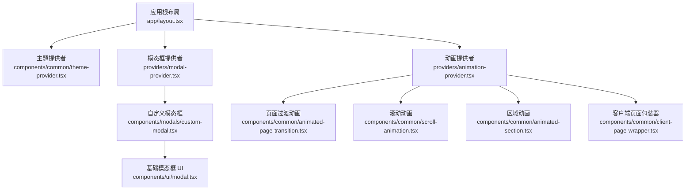
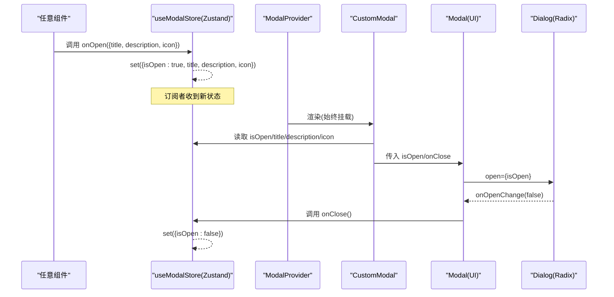
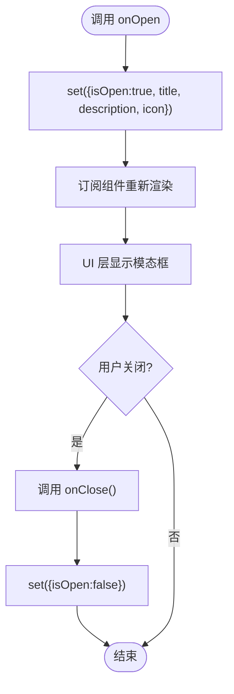
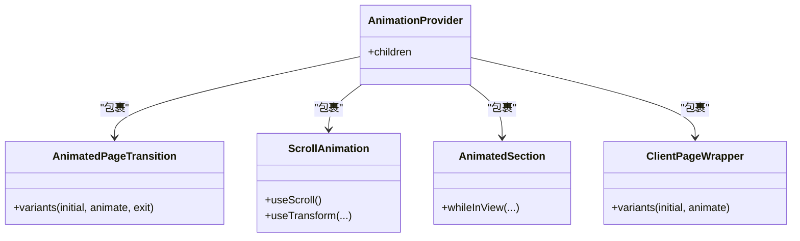
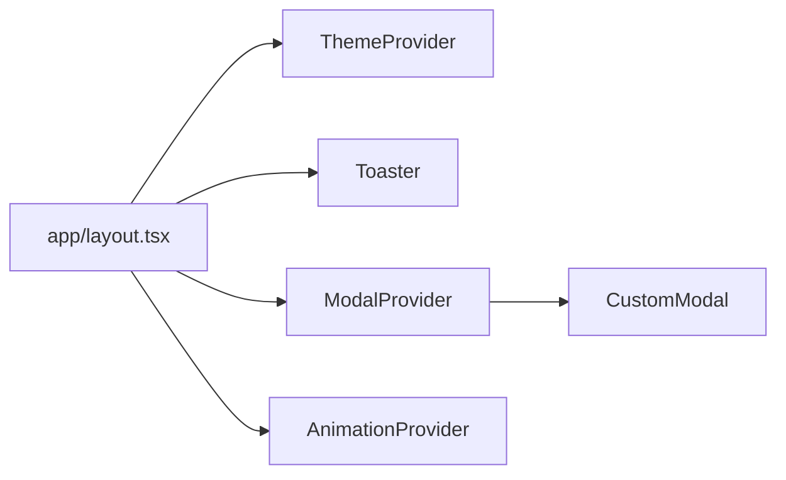
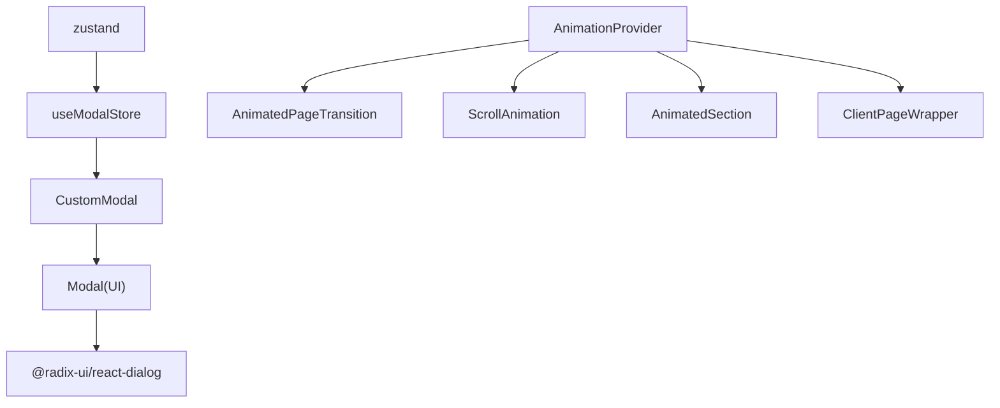

# 客户端状态管理

<cite>
**本文引用的文件**
- [use-modal-store.ts](file://hooks/use-modal-store.ts)
- [modal-provider.tsx](file://providers/modal-provider.tsx)
- [custom-modal.tsx](file://components/modals/custom-modal.tsx)
- [modal.tsx](file://components/ui/modal.tsx)
- [animation-provider.tsx](file://providers/animation-provider.tsx)
- [animated-page-transition.tsx](file://components/common/animated-page-transition.tsx)
- [animated-section.tsx](file://components/common/animated-section.tsx)
- [scroll-animation.tsx](file://components/common/scroll-animation.tsx)
- [client-page-wrapper.tsx](file://components/common/client-page-wrapper.tsx)
- [layout.tsx](file://app/layout.tsx)
- [theme-provider.tsx](file://components/common/theme-provider.tsx)
- [package.json](file://package.json)
</cite>

## 目录
1. [简介](#简介)
2. [项目结构](#项目结构)
3. [核心组件](#核心组件)
4. [架构总览](#架构总览)
5. [详细组件分析](#详细组件分析)
6. [依赖关系分析](#依赖关系分析)
7. [性能考虑](#性能考虑)
8. [故障排查指南](#故障排查指南)
9. [结论](#结论)
10. [附录](#附录)

## 简介
本文件系统性梳理本项目中基于 Zustand 的客户端状态管理方案，覆盖 store 设计、状态更新与副作用处理、模态框状态管理（打开/关闭、事件处理）、动画状态的统一管理策略、Provider 模式在全局状态注入中的应用，以及状态同步机制与性能优化实践。文档面向不同技术背景的读者，提供从高层到代码级的分层说明与可视化图示。

## 项目结构
本项目采用“按功能域组织”的结构：
- hooks：存放基于 Zustand 的自定义 Hook（如 useModalStore）
- providers：全局 Provider（如 ModalProvider、AnimationProvider）
- components：UI 与业务组件（含模态框、动画封装等）
- app：Next.js 应用根布局与页面路由
- config/lib：配置与工具函数

图表来源
- [layout.tsx:99-145](file://app/layout.tsx#L99-L145)
- [theme-provider.tsx:1-8](file://components/common/theme-provider.tsx#L1-L8)
- [modal-provider.tsx:1-24](file://providers/modal-provider.tsx#L1-L24)
- [custom-modal.tsx:1-30](file://components/modals/custom-modal.tsx#L1-L30)
- [modal.tsx:1-40](file://components/ui/modal.tsx#L1-L40)
- [animation-provider.tsx:1-12](file://providers/animation-provider.tsx#L1-L12)
- [animated-page-transition.tsx:1-48](file://components/common/animated-page-transition.tsx#L1-L48)
- [scroll-animation.tsx:1-51](file://components/common/scroll-animation.tsx#L1-L51)
- [animated-section.tsx:1-51](file://components/common/animated-section.tsx#L1-L51)
- [client-page-wrapper.tsx:1-37](file://components/common/client-page-wrapper.tsx#L1-L37)

章节来源
- [layout.tsx:99-145](file://app/layout.tsx#L99-L145)

## 核心组件
- 模态框 Store（Zustand）
  - 职责：集中管理模态框的可见性与内容（标题、描述、图标），并提供 onOpen/onClose 方法用于统一控制。
  - 关键点：使用 create 创建 store；通过 set 进行不可变更新；将数据与方法一并暴露给订阅者。
- 模态框提供者
  - 职责：在应用根层级挂载 CustomModal，避免服务端渲染时访问浏览器 API 导致的警告。
- 自定义模态框组件
  - 职责：读取 store 中的 isOpen/title/description/icon，并透传给基础模态框 UI。
- 基础模态框 UI
  - 职责：封装 Radix Dialog，处理 open/onOpenChange 与 onClose 的联动。
- 动画提供者与动画组件
  - 职责：以 Provider 形式为子树提供动画能力；各动画组件基于 motion/react 实现页面切换、滚动触发、区域入场等效果。

章节来源
- [use-modal-store.ts:1-36](file://hooks/use-modal-store.ts#L1-L36)
- [modal-provider.tsx:1-24](file://providers/modal-provider.tsx#L1-L24)
- [custom-modal.tsx:1-30](file://components/modals/custom-modal.tsx#L1-L30)
- [modal.tsx:1-40](file://components/ui/modal.tsx#L1-L40)
- [animation-provider.tsx:1-12](file://providers/animation-provider.tsx#L1-L12)
- [animated-page-transition.tsx:1-48](file://components/common/animated-page-transition.tsx#L1-L48)
- [scroll-animation.tsx:1-51](file://components/common/scroll-animation.tsx#L1-L51)
- [animated-section.tsx:1-51](file://components/common/animated-section.tsx#L1-L51)
- [client-page-wrapper.tsx:1-37](file://components/common/client-page-wrapper.tsx#L1-L37)

## 架构总览
下图展示了模态框状态从触发到渲染的完整流程，以及动画状态在各组件间的协作方式。

图表来源
- [use-modal-store.ts:22-35](file://hooks/use-modal-store.ts#L22-L35)
- [modal-provider.tsx:7-23](file://providers/modal-provider.tsx#L7-L23)
- [custom-modal.tsx:6-29](file://components/modals/custom-modal.tsx#L6-L29)
- [modal.tsx:21-39](file://components/ui/modal.tsx#L21-L39)

## 详细组件分析

### 模态框状态管理（Zustand）
- Store 设计
  - 状态字段：isOpen、title、description、icon
  - 动作方法：onOpen(data)、onClose()
  - 更新策略：通过 set 合并更新，保证最小化重渲染
- 使用模式
  - 任意组件调用 onOpen 传入展示数据
  - 关闭由 UI 层触发 onClose，或外部逻辑主动关闭
- 副作用处理
  - 当前 store 无副作用；如需持久化（例如记住上次打开的内容），可在 onOpen/onClose 中加入本地存储读写
- 类型安全
  - 使用 TypeScript 接口约束 data 与 store 结构

图表来源
- [use-modal-store.ts:22-35](file://hooks/use-modal-store.ts#L22-L35)

章节来源
- [use-modal-store.ts:1-36](file://hooks/use-modal-store.ts#L1-L36)
- [custom-modal.tsx:1-30](file://components/modals/custom-modal.tsx#L1-L30)
- [modal.tsx:1-40](file://components/ui/modal.tsx#L1-L40)

### 模态框提供者与挂载策略
- 作用
  - 在应用根布局中挂载 CustomModal，确保全局可访问
  - 使用 isMounted 标记避免 SSR 阶段访问 window/document 引起的警告
- 与 UI 层的解耦
  - Provider 仅负责挂载，不持有业务状态；状态由 Zustand store 管理

章节来源
- [modal-provider.tsx:1-24](file://providers/modal-provider.tsx#L1-L24)
- [layout.tsx:99-145](file://app/layout.tsx#L99-L145)

### 动画状态统一管理
- 策略
  - 未引入全局动画 store；动画状态由各组件内部通过 motion/react 钩子（如 useScroll、useTransform）管理
  - 通过 AnimationProvider 作为扩展点，便于未来接入全局动画配置（如全局缓动、时长）
- 页面切换动画
  - AnimatedPageTransition：定义 initial/animate/exit 三态，配合路由切换实现淡入淡出与位移
- 滚动驱动动画
  - ScrollAnimation：基于 useScroll/useTransform 根据滚动进度计算透明度、缩放、位移、旋转
- 区域入场动画
  - AnimatedSection：基于 whileInView 实现进入视口时的入场动画，支持方向与延迟
- 客户端页面包装
  - ClientPageWrapper：为页面级内容提供统一的入场动画

图表来源
- [animation-provider.tsx:1-12](file://providers/animation-provider.tsx#L1-L12)
- [animated-page-transition.tsx:1-48](file://components/common/animated-page-transition.tsx#L1-L48)
- [scroll-animation.tsx:1-51](file://components/common/scroll-animation.tsx#L1-L51)
- [animated-section.tsx:1-51](file://components/common/animated-section.tsx#L1-L51)
- [client-page-wrapper.tsx:1-37](file://components/common/client-page-wrapper.tsx#L1-L37)

章节来源
- [animation-provider.tsx:1-12](file://providers/animation-provider.tsx#L1-L12)
- [animated-page-transition.tsx:1-48](file://components/common/animated-page-transition.tsx#L1-L48)
- [scroll-animation.tsx:1-51](file://components/common/scroll-animation.tsx#L1-L51)
- [animated-section.tsx:1-51](file://components/common/animated-section.tsx#L1-L51)
- [client-page-wrapper.tsx:1-37](file://components/common/client-page-wrapper.tsx#L1-L37)

### Provider 模式与全局状态注入
- 根布局装配
  - ThemeProvider：基于 next-themes 提供主题上下文
  - ModalProvider：挂载全局模态框组件
  - Toaster：全局通知容器
- 扩展点
  - AnimationProvider：当前为空壳 Provider，预留全局动画配置入口

图表来源
- [layout.tsx:99-145](file://app/layout.tsx#L99-L145)
- [theme-provider.tsx:1-8](file://components/common/theme-provider.tsx#L1-L8)
- [modal-provider.tsx:1-24](file://providers/modal-provider.tsx#L1-L24)
- [custom-modal.tsx:1-30](file://components/modals/custom-modal.tsx#L1-L30)
- [animation-provider.tsx:1-12](file://providers/animation-provider.tsx#L1-L12)

章节来源
- [layout.tsx:99-145](file://app/layout.tsx#L99-L145)

## 依赖关系分析
- 运行时依赖
  - zustand：用于创建轻量级全局 store
  - motion/react：用于声明式动画
  - @radix-ui/react-dialog：无障碍对话框基元
  - next-themes：主题切换
- 模块耦合
  - CustomModal 依赖 useModalStore 与 Modal UI
  - Modal UI 依赖 Radix Dialog
  - 动画组件相互独立，均受 AnimationProvider 包裹
- 潜在循环依赖
  - 当前未发现循环导入；store 与组件单向依赖

图表来源
- [package.json:11-44](file://package.json#L11-L44)
- [use-modal-store.ts:1-36](file://hooks/use-modal-store.ts#L1-L36)
- [custom-modal.tsx:1-30](file://components/modals/custom-modal.tsx#L1-L30)
- [modal.tsx:1-40](file://components/ui/modal.tsx#L1-L40)
- [animation-provider.tsx:1-12](file://providers/animation-provider.tsx#L1-L12)
- [animated-page-transition.tsx:1-48](file://components/common/animated-page-transition.tsx#L1-L48)
- [scroll-animation.tsx:1-51](file://components/common/scroll-animation.tsx#L1-L51)
- [animated-section.tsx:1-51](file://components/common/animated-section.tsx#L1-L51)
- [client-page-wrapper.tsx:1-37](file://components/common/client-page-wrapper.tsx#L1-L37)

章节来源
- [package.json:11-44](file://package.json#L11-L44)

## 性能考虑
- 最小化重渲染
  - Zustand 的 selector 粒度：按需选择 store 字段，避免整棵状态树变更导致的全量重渲染
- 避免不必要的副作用
  - 当前 store 无副作用；若加入持久化，建议仅在 onOpen/onClose 中执行，并使用防抖/节流减少写入频率
- 动画性能
  - 使用 transform/opacity 等合成属性提升性能
  - 合理设置 viewport 与 once 选项，避免重复触发
- SSR 友好
  - ModalProvider 使用 isMounted 避免 SSR 阶段访问浏览器 API
  - 所有动画组件均为 "use client"，确保只在客户端执行

[本节为通用指导，不直接分析具体文件]

## 故障排查指南
- 模态框无法关闭
  - 检查 Modal UI 的 onOpenChange 是否正确回调 onClose
  - 确认 store 的 onClose 是否被调用且成功将 isOpen 置为 false
- 模态框内容不更新
  - 确认 onOpen 传入的数据结构与 store 字段一致
  - 检查组件是否正确订阅 store 的对应字段
- 动画不生效
  - 确认组件位于 AnimationProvider 之下
  - 检查 motion 版本与 Next.js 兼容性
  - 验证 useScroll 目标元素是否存在且可滚动
- SSR 警告
  - 确保涉及 window/document 的代码仅在客户端执行（如 ModalProvider 的 isMounted 保护）

章节来源
- [modal.tsx:21-39](file://components/ui/modal.tsx#L21-L39)
- [use-modal-store.ts:22-35](file://hooks/use-modal-store.ts#L22-L35)
- [modal-provider.tsx:7-23](file://providers/modal-provider.tsx#L7-L23)
- [scroll-animation.tsx:17-27](file://components/common/scroll-animation.tsx#L17-L27)

## 结论
本项目采用“Zustand 单例 store + Provider 挂载”的模式，实现了简洁高效的模态框状态管理；动画状态则以组件内局部状态为主，并通过 AnimationProvider 预留全局扩展点。该方案具备以下优势：
- 低耦合：store 与 UI 解耦，易于测试与维护
- 可扩展：Provider 模式便于接入更多全局能力（如主题、国际化、全局动画配置）
- 高性能：基于最小化更新与合成属性的动画策略，兼顾体验与性能

建议在后续迭代中：
- 为模态框增加可选的状态持久化（如 localStorage）
- 在 AnimationProvider 中引入全局动画配置（时长、缓动、默认行为）
- 对复杂交互场景引入更细粒度的 selector，进一步优化重渲染范围

[本节为总结性内容，不直接分析具体文件]

## 附录
- 关键路径参考
  - 模态框 Store：hooks/use-modal-store.ts
  - 模态框提供者：providers/modal-provider.tsx
  - 自定义模态框：components/modals/custom-modal.tsx
  - 基础模态框 UI：components/ui/modal.tsx
  - 动画提供者：providers/animation-provider.tsx
  - 页面过渡动画：components/common/animated-page-transition.tsx
  - 滚动动画：components/common/scroll-animation.tsx
  - 区域动画：components/common/animated-section.tsx
  - 客户端页面包装器：components/common/client-page-wrapper.tsx
  - 应用根布局：app/layout.tsx
  - 主题提供者：components/common/theme-provider.tsx
  - 依赖清单：package.json

[本节为索引信息，不直接分析具体文件]