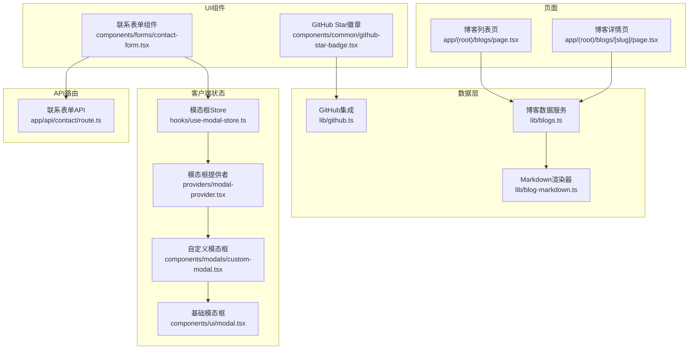
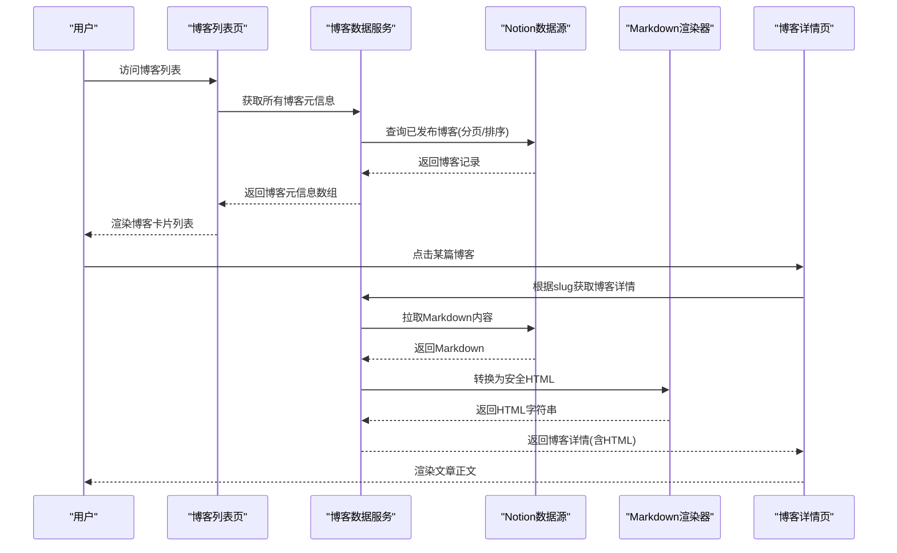
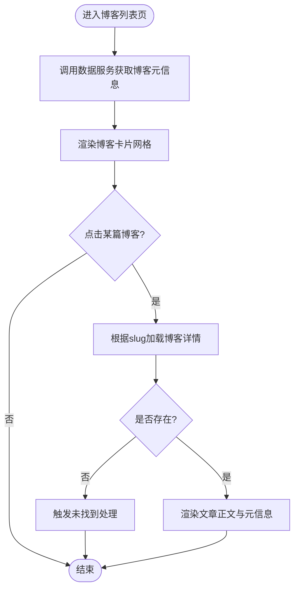
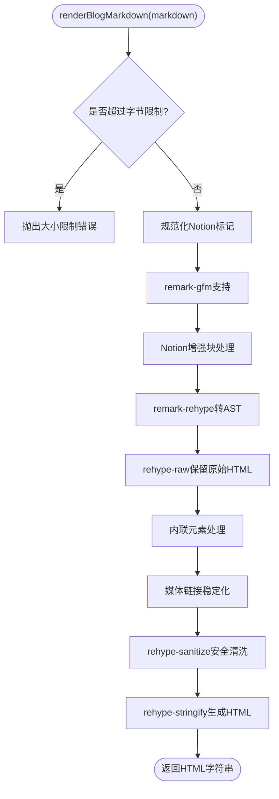
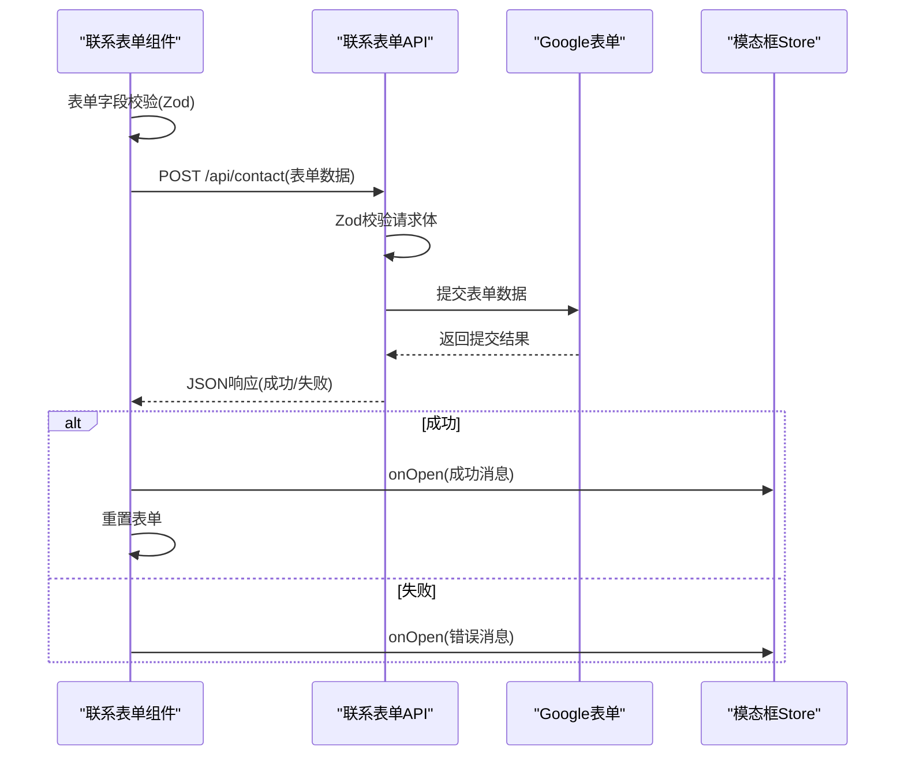
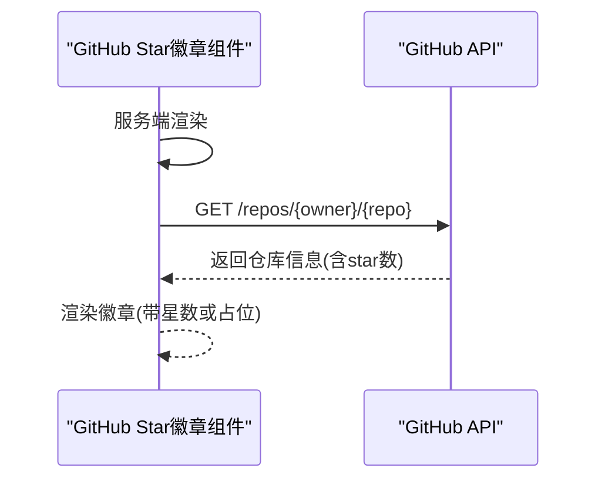
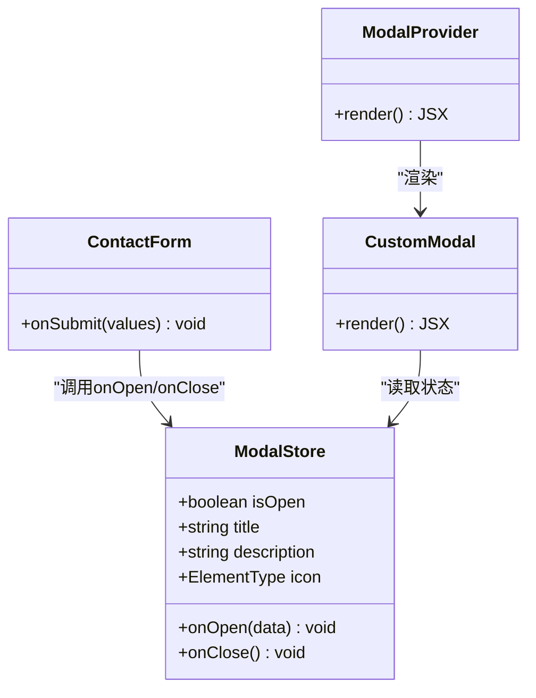
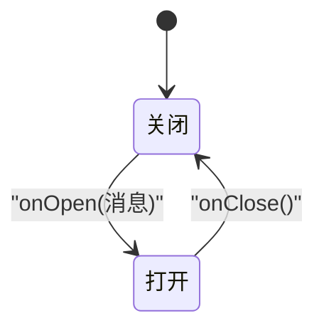
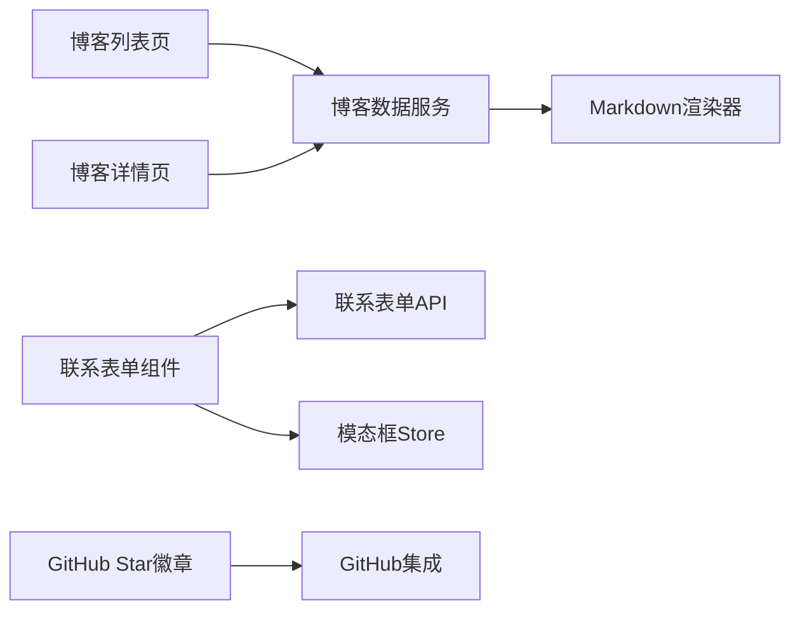

# 数据流设计

<cite>
**本文引用的文件**
- [app/(root)/blogs/page.tsx](file://app/(root)/blogs/page.tsx)
- [app/(root)/blogs/[slug]/page.tsx](file://app/(root)/blogs/[slug]/page.tsx)
- [lib/blogs.ts](file://lib/blogs.ts)
- [lib/blog-markdown.ts](file://lib/blog-markdown.ts)
- [components/forms/contact-form.tsx](file://components/forms/contact-form.tsx)
- [app/api/contact/route.ts](file://app/api/contact/route.ts)
- [hooks/use-modal-store.ts](file://hooks/use-modal-store.ts)
- [providers/modal-provider.tsx](file://providers/modal-provider.tsx)
- [components/modals/custom-modal.tsx](file://components/modals/custom-modal.tsx)
- [components/ui/modal.tsx](file://components/ui/modal.tsx)
- [lib/github.ts](file://lib/github.ts)
- [components/common/github-star-badge.tsx](file://components/common/github-star-badge.tsx)
</cite>

## 目录
1. [简介](#简介)
2. [项目结构](#项目结构)
3. [核心组件](#核心组件)
4. [架构总览](#架构总览)
5. [详细组件分析](#详细组件分析)
6. [依赖关系分析](#依赖关系分析)
7. [性能考量](#性能考量)
8. [故障排查指南](#故障排查指南)
9. [结论](#结论)

## 简介
本文件面向Next.js投资组合项目的数据流设计与实现，聚焦以下目标：
- 服务端数据获取与渲染（博客列表、博客详情）
- 客户端状态管理与交互反馈（表单提交、弹窗提示）
- 数据同步机制（缓存、重新验证、外部API集成）
- API路由的数据处理逻辑（联系表单）
- 博客内容的Markdown解析流程（Notion Markdown到安全HTML）
- GitHub集成的数据获取策略（仓库Star数）
- Zustand状态管理的使用方式（模态框状态）
- 表单数据的验证与提交流程

通过数据流图与状态转换图，帮助开发者理解从用户操作到界面更新的完整过程。

## 项目结构
本项目采用Next.js App Router组织页面与API路由，数据层集中在lib目录，UI组件按功能拆分在components目录，状态管理使用Zustand提供全局模态框状态。

图表来源
- [app/(root)/blogs/page.tsx:42-147](file://app/(root)/blogs/page.tsx#L42-L147)
- [app/(root)/blogs/[slug]/page.tsx:86-319](file://app/(root)/blogs/[slug]/page.tsx#L86-L319)
- [lib/blogs.ts:492-536](file://lib/blogs.ts#L492-L536)
- [lib/blog-markdown.ts:509-531](file://lib/blog-markdown.ts#L509-L531)
- [components/forms/contact-form.tsx:45-75](file://components/forms/contact-form.tsx#L45-L75)
- [app/api/contact/route.ts:11-56](file://app/api/contact/route.ts#L11-L56)
- [hooks/use-modal-store.ts:19-32](file://hooks/use-modal-store.ts#L19-L32)
- [providers/modal-provider.tsx:7-23](file://providers/modal-provider.tsx#L7-L23)
- [components/modals/custom-modal.tsx:6-29](file://components/modals/custom-modal.tsx#L6-L29)
- [components/ui/modal.tsx:21-39](file://components/ui/modal.tsx#L21-L39)
- [lib/github.ts:12-32](file://lib/github.ts#L12-L32)
- [components/common/github-star-badge.tsx:12-39](file://components/common/github-star-badge.tsx#L12-L39)

章节来源
- [app/(root)/blogs/page.tsx:42-147](file://app/(root)/blogs/page.tsx#L42-L147)
- [app/(root)/blogs/[slug]/page.tsx:86-319](file://app/(root)/blogs/[slug]/page.tsx#L86-L319)
- [lib/blogs.ts:492-536](file://lib/blogs.ts#L492-L536)
- [lib/blog-markdown.ts:509-531](file://lib/blog-markdown.ts#L509-L531)
- [components/forms/contact-form.tsx:45-75](file://components/forms/contact-form.tsx#L45-L75)
- [app/api/contact/route.ts:11-56](file://app/api/contact/route.ts#L11-L56)
- [hooks/use-modal-store.ts:19-32](file://hooks/use-modal-store.ts#L19-L32)
- [providers/modal-provider.tsx:7-23](file://providers/modal-provider.tsx#L7-L23)
- [components/modals/custom-modal.tsx:6-29](file://components/modals/custom-modal.tsx#L6-L29)
- [components/ui/modal.tsx:21-39](file://components/ui/modal.tsx#L21-L39)
- [lib/github.ts:12-32](file://lib/github.ts#L12-L32)
- [components/common/github-star-badge.tsx:12-39](file://components/common/github-star-badge.tsx#L12-L39)

## 核心组件
- 博客数据服务：负责从Notion数据源拉取已发布的博客元信息，按需加载单篇内容并转换为HTML，同时提供缓存与重新验证策略。
- Markdown渲染器：将Notion导出的Markdown转换为安全的HTML，包含长度限制、深度限制、危险标签过滤、图片链接校验等。
- 联系表单API：接收前端提交的表单数据，进行参数校验后转发至Google表单，返回统一响应。
- 客户端表单组件：使用React Hook Form与Zod进行字段级校验，提交成功后通过Zustand打开成功/失败弹窗。
- 模态框状态管理：基于Zustand的轻量全局状态，控制弹窗显示与内容。
- GitHub集成：在服务端获取模板仓库的Star数量，并通过Next.js缓存控制刷新频率。

章节来源
- [lib/blogs.ts:35-53](file://lib/blogs.ts#L35-L53)
- [lib/blog-markdown.ts:19-55](file://lib/blog-markdown.ts#L19-L55)
- [app/api/contact/route.ts:4-9](file://app/api/contact/route.ts#L4-L9)
- [components/forms/contact-form.tsx:21-30](file://components/forms/contact-form.tsx#L21-L30)
- [hooks/use-modal-store.ts:4-17](file://hooks/use-modal-store.ts#L4-L17)
- [lib/github.ts:12-32](file://lib/github.ts#L12-L32)

## 架构总览
系统分为三层：
- 页面层：Next.js App Router页面负责SEO元数据、结构化数据注入与布局组装。
- 数据层：lib模块封装对外部数据源的访问与数据处理，包括Notion博客数据与GitHub Star数据。
- 交互层：客户端组件负责用户输入、校验、异步提交与状态更新。

图表来源
- [app/(root)/blogs/page.tsx:42-147](file://app/(root)/blogs/page.tsx#L42-L147)
- [app/(root)/blogs/[slug]/page.tsx:86-319](file://app/(root)/blogs/[slug]/page.tsx#L86-L319)
- [lib/blogs.ts:337-420](file://lib/blogs.ts#L337-L420)
- [lib/blogs.ts:422-530](file://lib/blogs.ts#L422-L530)
- [lib/blog-markdown.ts:509-531](file://lib/blog-markdown.ts#L509-L531)

## 详细组件分析

### 博客数据获取与展示
- 列表页调用数据服务获取所有已发布博客的元信息，并进行JSON-LD结构化数据注入，随后渲染卡片网格。
- 详情页根据URL参数获取对应博客，若不存在则触发未找到处理；否则渲染标题、描述、封面、标签、作者、日期、阅读时长及正文HTML。
- 数据服务对Notion数据源进行分页查询、属性校验、排序与去重，并使用Next.js缓存与标签进行增量失效。

图表来源
- [app/(root)/blogs/page.tsx:42-147](file://app/(root)/blogs/page.tsx#L42-L147)
- [app/(root)/blogs/[slug]/page.tsx:86-319](file://app/(root)/blogs/[slug]/page.tsx#L86-L319)
- [lib/blogs.ts:492-536](file://lib/blogs.ts#L492-L536)

章节来源
- [app/(root)/blogs/page.tsx:42-147](file://app/(root)/blogs/page.tsx#L42-L147)
- [app/(root)/blogs/[slug]/page.tsx:86-319](file://app/(root)/blogs/[slug]/page.tsx#L86-L319)
- [lib/blogs.ts:492-536](file://lib/blogs.ts#L492-L536)

### Markdown解析流程
- 入口函数接收Notion Markdown字符串，首先进行字节大小限制检查。
- 规范化Notion特有标记，依次经过GFM扩展、Notion增强块处理、AST转换、原始HTML保留、内联元素处理、媒体链接稳定化、安全清洗与字符串化。
- 输出安全HTML，供详情页直接渲染。

图表来源
- [lib/blog-markdown.ts:509-531](file://lib/blog-markdown.ts#L509-L531)

章节来源
- [lib/blog-markdown.ts:509-531](file://lib/blog-markdown.ts#L509-L531)

### 联系表单数据流
- 客户端表单使用React Hook Form与Zod定义字段规则，提交时调用后端API。
- API路由接收请求体，使用Zod校验必填字段与格式，构造Google表单提交参数并发起请求。
- 成功时返回成功消息，失败时返回相应错误码；客户端根据响应结果重置表单并打开成功或失败弹窗。

图表来源
- [components/forms/contact-form.tsx:45-75](file://components/forms/contact-form.tsx#L45-L75)
- [app/api/contact/route.ts:11-56](file://app/api/contact/route.ts#L11-L56)
- [hooks/use-modal-store.ts:19-32](file://hooks/use-modal-store.ts#L19-L32)

章节来源
- [components/forms/contact-form.tsx:45-75](file://components/forms/contact-form.tsx#L45-L75)
- [app/api/contact/route.ts:11-56](file://app/api/contact/route.ts#L11-L56)
- [hooks/use-modal-store.ts:19-32](file://hooks/use-modal-store.ts#L19-L32)

### GitHub集成数据获取策略
- 组件在服务端调用GitHub API获取模板仓库的Star数量，使用Next.js缓存配置每6小时重新验证。
- 若请求失败或返回异常，组件降级显示占位文本，保证用户体验。

图表来源
- [components/common/github-star-badge.tsx:12-39](file://components/common/github-star-badge.tsx#L12-L39)
- [lib/github.ts:12-32](file://lib/github.ts#L12-L32)

章节来源
- [components/common/github-star-badge.tsx:12-39](file://components/common/github-star-badge.tsx#L12-L39)
- [lib/github.ts:12-32](file://lib/github.ts#L12-L32)

### Zustand状态管理使用方式
- Store定义模态框的开关、标题、描述与图标，并提供打开与关闭方法。
- 表单组件在提交成功后调用打开方法传入成功消息，失败时调用打开方法传入错误消息。
- 模态框提供者确保组件挂载后再渲染，避免SSR不匹配问题。

图表来源
- [hooks/use-modal-store.ts:19-32](file://hooks/use-modal-store.ts#L19-L32)
- [components/forms/contact-form.tsx:45-75](file://components/forms/contact-form.tsx#L45-L75)
- [components/modals/custom-modal.tsx:6-29](file://components/modals/custom-modal.tsx#L6-L29)
- [providers/modal-provider.tsx:7-23](file://providers/modal-provider.tsx#L7-L23)

章节来源
- [hooks/use-modal-store.ts:19-32](file://hooks/use-modal-store.ts#L19-L32)
- [components/forms/contact-form.tsx:45-75](file://components/forms/contact-form.tsx#L45-L75)
- [components/modals/custom-modal.tsx:6-29](file://components/modals/custom-modal.tsx#L6-L29)
- [providers/modal-provider.tsx:7-23](file://providers/modal-provider.tsx#L7-L23)

### 状态转换图（模态框）

图表来源
- [hooks/use-modal-store.ts:19-32](file://hooks/use-modal-store.ts#L19-L32)

## 依赖关系分析
- 页面依赖数据服务，数据服务依赖Notion客户端与Markdown渲染器。
- 表单组件依赖API路由与模态框Store。
- GitHub徽章组件依赖GitHub集成库。
- 各模块之间通过明确的接口与类型约束解耦，便于测试与维护。

图表来源
- [app/(root)/blogs/page.tsx:42-147](file://app/(root)/blogs/page.tsx#L42-L147)
- [app/(root)/blogs/[slug]/page.tsx:86-319](file://app/(root)/blogs/[slug]/page.tsx#L86-L319)
- [lib/blogs.ts:492-536](file://lib/blogs.ts#L492-L536)
- [lib/blog-markdown.ts:509-531](file://lib/blog-markdown.ts#L509-L531)
- [components/forms/contact-form.tsx:45-75](file://components/forms/contact-form.tsx#L45-L75)
- [app/api/contact/route.ts:11-56](file://app/api/contact/route.ts#L11-L56)
- [hooks/use-modal-store.ts:19-32](file://hooks/use-modal-store.ts#L19-L32)
- [components/common/github-star-badge.tsx:12-39](file://components/common/github-star-badge.tsx#L12-L39)
- [lib/github.ts:12-32](file://lib/github.ts#L12-L32)

章节来源
- [app/(root)/blogs/page.tsx:42-147](file://app/(root)/blogs/page.tsx#L42-L147)
- [app/(root)/blogs/[slug]/page.tsx:86-319](file://app/(root)/blogs/[slug]/page.tsx#L86-L319)
- [lib/blogs.ts:492-536](file://lib/blogs.ts#L492-L536)
- [lib/blog-markdown.ts:509-531](file://lib/blog-markdown.ts#L509-L531)
- [components/forms/contact-form.tsx:45-75](file://components/forms/contact-form.tsx#L45-L75)
- [app/api/contact/route.ts:11-56](file://app/api/contact/route.ts#L11-L56)
- [hooks/use-modal-store.ts:19-32](file://hooks/use-modal-store.ts#L19-L32)
- [components/common/github-star-badge.tsx:12-39](file://components/common/github-star-badge.tsx#L12-L39)
- [lib/github.ts:12-32](file://lib/github.ts#L12-L32)

## 性能考量
- 博客数据使用Next.js不稳定缓存与标签进行增量失效，减少重复请求。
- Markdown渲染设置字节上限与嵌套深度限制，防止恶意或超大内容导致性能问题。
- GitHub Star数据通过服务器端缓存每6小时刷新，降低外部API压力。
- 表单提交采用客户端校验与服务端校验双重保障，提升用户体验与安全性。

[本节为通用性能讨论，不直接分析具体文件]

## 故障排查指南
- 博客数据为空：检查Notion配置是否完整，确认数据源ID与令牌正确，查看控制台警告信息。
- Markdown渲染失败：检查内容是否超过字节限制或嵌套过深，确认图片链接是否为稳定地址。
- 联系表单提交失败：检查环境变量是否配置正确，确认Google表单字段ID映射无误，查看API响应状态码。
- 模态框不显示：确认组件已挂载，Store状态是否正确更新，检查事件绑定与回调调用。

章节来源
- [lib/blogs.ts:99-121](file://lib/blogs.ts#L99-L121)
- [lib/blog-markdown.ts:19-21](file://lib/blog-markdown.ts#L19-L21)
- [app/api/contact/route.ts:12-30](file://app/api/contact/route.ts#L12-L30)
- [providers/modal-provider.tsx:7-23](file://providers/modal-provider.tsx#L7-L23)

## 结论
本项目通过清晰的层次划分与模块化设计，实现了高效的数据获取、处理与展示流程。博客内容从Notion到安全HTML的转换确保了内容与性能的双重保障；联系表单结合客户端与服务端校验提升了健壮性；GitHub集成提供了动态的外部数据展示。Zustand状态管理简化了模态框的状态控制，使交互体验更加流畅。整体架构具备良好的可维护性与扩展性，适合持续迭代与功能增强。