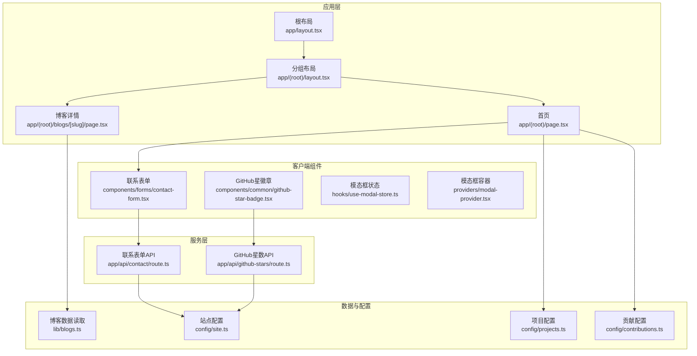
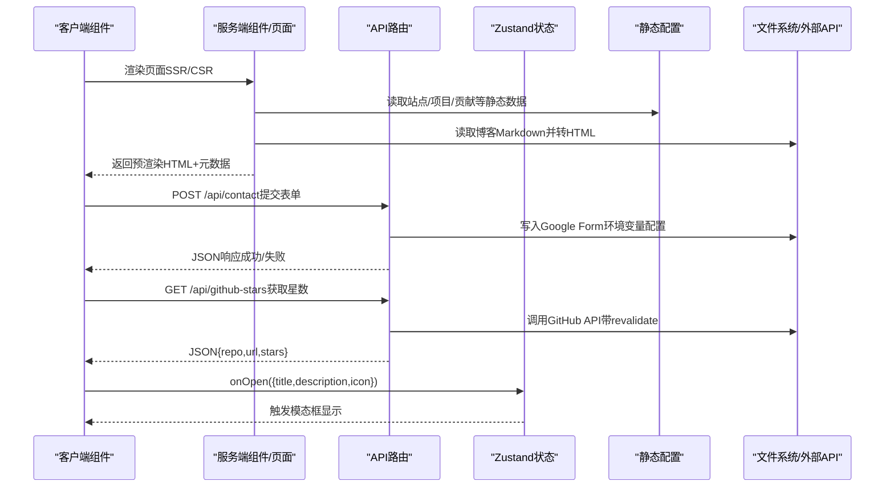
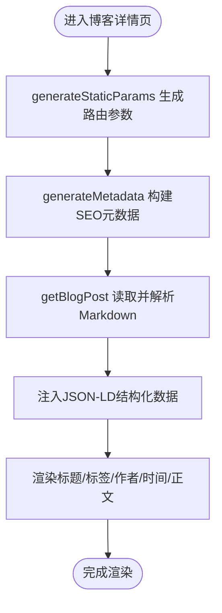
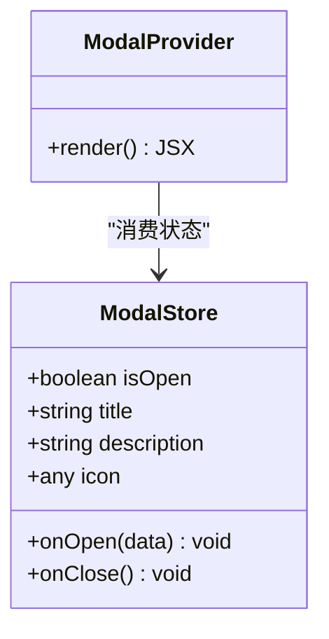
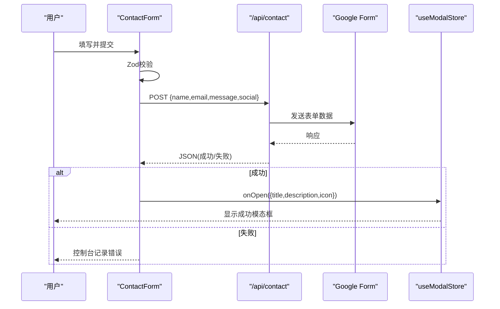
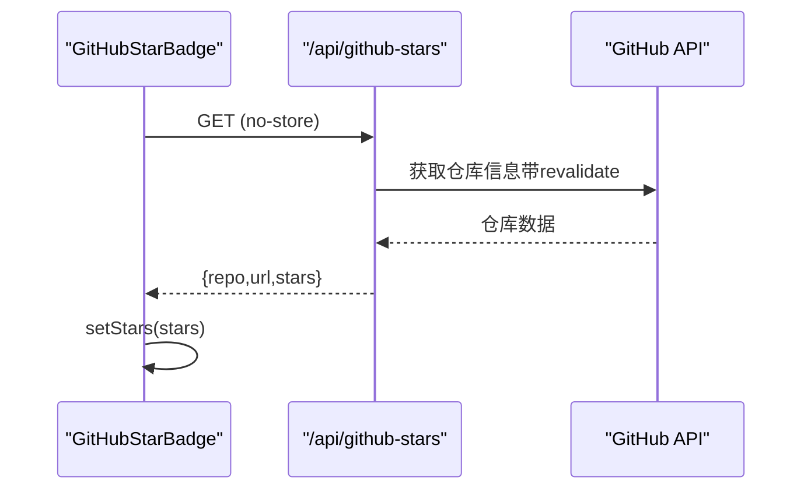
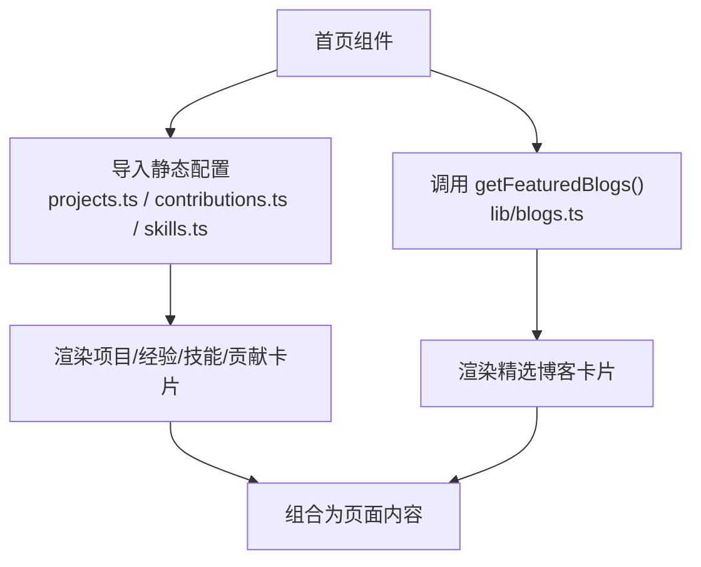
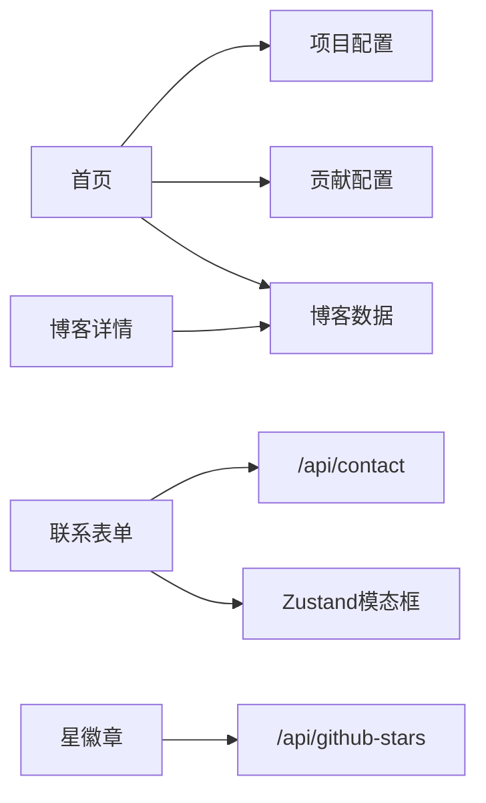

# 数据流设计

<cite>
**本文引用的文件**
- [app/layout.tsx](file://app/layout.tsx)
- [app/(root)/layout.tsx](file://app/(root)/layout.tsx)
- [app/(root)/page.tsx](file://app/(root)/page.tsx)
- [app/(root)/blogs/[slug]/page.tsx](file://app/(root)/blogs/[slug]/page.tsx)
- [app/api/contact/route.ts](file://app/api/contact/route.ts)
- [app/api/github-stars/route.ts](file://app/api/github-stars/route.ts)
- [components/forms/contact-form.tsx](file://components/forms/contact-form.tsx)
- [components/common/github-star-badge.tsx](file://components/common/github-star-badge.tsx)
- [hooks/use-modal-store.ts](file://hooks/use-modal-store.ts)
- [providers/modal-provider.tsx](file://providers/modal-provider.tsx)
- [lib/blogs.ts](file://lib/blogs.ts)
- [config/site.ts](file://config/site.ts)
- [config/projects.ts](file://config/projects.ts)
- [config/contributions.ts](file://config/contributions.ts)
</cite>

## 目录
1. [简介](#简介)
2. [项目结构](#项目结构)
3. [核心组件](#核心组件)
4. [架构总览](#架构总览)
5. [详细组件分析](#详细组件分析)
6. [依赖关系分析](#依赖关系分析)
7. [性能考量](#性能考量)
8. [故障排查指南](#故障排查指南)
9. [结论](#结论)

## 简介
本文件系统性梳理本项目的数据流设计，覆盖从静态配置到动态API调用的完整生命周期。重点说明：
- 服务端组件（Server Components）的异步数据获取与渲染策略
- 客户端组件（Client Components）的状态管理与副作用处理
- Zustand状态管理库的使用模式（store设计、状态更新、副作用）
- API路由设计与实现（请求处理、错误处理、响应格式标准化）
- 数据流图与状态同步机制

## 项目结构
项目采用Next.js App Router组织页面与API：
- app/ 下包含根布局、分组路由、API路由
- components/ 提供可复用UI与业务组件
- hooks/ 存放全局状态（Zustand）
- providers/ 提供全局上下文（如模态框）
- lib/ 封装数据读取与工具函数
- config/ 集中管理站点与展示数据

图表来源
- [app/layout.tsx:105-143](file://app/layout.tsx#L105-L143)
- [app/(root)/layout.tsx:11-31](file://app/(root)/layout.tsx#L11-L31)
- [app/(root)/page.tsx:37-356](file://app/(root)/page.tsx#L37-L356)
- [app/(root)/blogs/[slug]/page.tsx:81-323](file://app/(root)/blogs/[slug]/page.tsx#L81-L323)
- [app/api/contact/route.ts:3-30](file://app/api/contact/route.ts#L3-L30)
- [app/api/github-stars/route.ts:34-43](file://app/api/github-stars/route.ts#L34-L43)
- [components/forms/contact-form.tsx:32-141](file://components/forms/contact-form.tsx#L32-L141)
- [components/common/github-star-badge.tsx:14-62](file://components/common/github-star-badge.tsx#L14-L62)
- [hooks/use-modal-store.ts:22-35](file://hooks/use-modal-store.ts#L22-L35)
- [providers/modal-provider.tsx:7-23](file://providers/modal-provider.tsx#L7-L23)
- [lib/blogs.ts:35-89](file://lib/blogs.ts#L35-L89)
- [config/site.ts:1-41](file://config/site.ts#L1-L41)
- [config/projects.ts:30-596](file://config/projects.ts#L30-L596)
- [config/contributions.ts:8-48](file://config/contributions.ts#L8-L48)

章节来源
- [app/layout.tsx:105-143](file://app/layout.tsx#L105-L143)
- [app/(root)/layout.tsx:11-31](file://app/(root)/layout.tsx#L11-L31)

## 核心组件
- 根布局与分组布局：注入主题、分析脚本、全局Toaster与ModalProvider，统一元数据与SEO设置。
- 首页：聚合静态配置数据（项目、经验、技能、贡献、精选博客），并嵌入客户端交互入口（联系表单）。
- 博客详情页：服务端读取Markdown内容并生成HTML，输出结构化数据（JSON-LD）与SEO元信息。
- 联系表单：客户端表单校验后提交至后端API，成功后通过Zustand打开模态框提示。
- GitHub星徽章：客户端组件在挂载时调用API获取仓库星数，并缓存于本地状态。
- API路由：
  - /api/contact：接收表单数据，转发至Google Form，返回统一JSON或错误响应。
  - /api/github-stars：解析仓库地址，调用GitHub API并带缓存策略，返回标准化JSON。

章节来源
- [app/layout.tsx:30-97](file://app/layout.tsx#L30-L97)
- [app/(root)/page.tsx:37-356](file://app/(root)/page.tsx#L37-L356)
- [app/(root)/blogs/[slug]/page.tsx:20-79](file://app/(root)/blogs/[slug]/page.tsx#L20-L79)
- [components/forms/contact-form.tsx:21-71](file://components/forms/contact-form.tsx#L21-L71)
- [components/common/github-star-badge.tsx:14-62](file://components/common/github-star-badge.tsx#L14-L62)
- [app/api/contact/route.ts:3-30](file://app/api/contact/route.ts#L3-L30)
- [app/api/github-stars/route.ts:7-43](file://app/api/github-stars/route.ts#L7-L43)

## 架构总览
下图展示了从静态配置到动态API的数据流转路径，以及服务端与客户端的职责边界。

图表来源
- [app/(root)/page.tsx:37-356](file://app/(root)/page.tsx#L37-L356)
- [app/(root)/blogs/[slug]/page.tsx:81-323](file://app/(root)/blogs/[slug]/page.tsx#L81-L323)
- [components/forms/contact-form.tsx:48-71](file://components/forms/contact-form.tsx#L48-L71)
- [app/api/contact/route.ts:3-30](file://app/api/contact/route.ts#L3-L30)
- [components/common/github-star-badge.tsx:17-36](file://components/common/github-star-badge.tsx#L17-L36)
- [app/api/github-stars/route.ts:17-43](file://app/api/github-stars/route.ts#L17-L43)
- [hooks/use-modal-store.ts:22-35](file://hooks/use-modal-store.ts#L22-L35)

## 详细组件分析

### 服务端数据获取与渲染（博客详情）
- generateStaticParams：扫描所有Markdown文件，生成静态参数用于预渲染。
- generateMetadata：根据文章元数据构建SEO元信息与社交分享卡片。
- 默认导出组件：读取文章、格式化日期、注入JSON-LD结构化数据，渲染面包屑与正文。

图表来源
- [app/(root)/blogs/[slug]/page.tsx:20-79](file://app/(root)/blogs/[slug]/page.tsx#L20-L79)
- [app/(root)/blogs/[slug]/page.tsx:81-323](file://app/(root)/blogs/[slug]/page.tsx#L81-L323)
- [lib/blogs.ts:35-89](file://lib/blogs.ts#L35-L89)

章节来源
- [app/(root)/blogs/[slug]/page.tsx:20-79](file://app/(root)/blogs/[slug]/page.tsx#L20-L79)
- [lib/blogs.ts:35-89](file://lib/blogs.ts#L35-L89)

### 客户端状态管理（Zustand模态框）
- store设计：定义isOpen、title、description、icon及onOpen/onClose方法。
- 使用方式：表单提交成功后调用onOpen打开模态框；ModalProvider确保仅在客户端挂载后渲染。

图表来源
- [hooks/use-modal-store.ts:22-35](file://hooks/use-modal-store.ts#L22-L35)
- [providers/modal-provider.tsx:7-23](file://providers/modal-provider.tsx#L7-L23)

章节来源
- [hooks/use-modal-store.ts:22-35](file://hooks/use-modal-store.ts#L22-L35)
- [providers/modal-provider.tsx:7-23](file://providers/modal-provider.tsx#L7-L23)

### 表单提交流程（联系表单）
- 前端校验：使用Zod进行字段校验，react-hook-form管理表单状态。
- 提交逻辑：POST到/api/contact，成功后重置表单并通过Zustand打开成功模态框。
- 后端处理：读取环境变量中的Google Form链接与字段ID，拼接URL发起请求，返回统一响应。

图表来源
- [components/forms/contact-form.tsx:21-71](file://components/forms/contact-form.tsx#L21-L71)
- [app/api/contact/route.ts:3-30](file://app/api/contact/route.ts#L3-L30)
- [hooks/use-modal-store.ts:22-35](file://hooks/use-modal-store.ts#L22-L35)

章节来源
- [components/forms/contact-form.tsx:21-71](file://components/forms/contact-form.tsx#L21-L71)
- [app/api/contact/route.ts:3-30](file://app/api/contact/route.ts#L3-L30)

### 动态数据获取（GitHub星数）
- 客户端组件：在useEffect中调用/api/github-stars，设置本地状态以显示星数。
- API路由：解析仓库地址，调用GitHub API并设置revalidate缓存策略，返回标准化JSON。

图表来源
- [components/common/github-star-badge.tsx:17-36](file://components/common/github-star-badge.tsx#L17-L36)
- [app/api/github-stars/route.ts:17-43](file://app/api/github-stars/route.ts#L17-L43)

章节来源
- [components/common/github-star-badge.tsx:17-36](file://components/common/github-star-badge.tsx#L17-L36)
- [app/api/github-stars/route.ts:17-43](file://app/api/github-stars/route.ts#L17-L43)

### 静态数据聚合（首页）
- 数据来源：config下的项目、贡献、技能等常量；lib/blogs.ts提供的精选博客。
- 渲染策略：服务端组件直接导入并渲染，减少客户端负载，提升首屏性能。

图表来源
- [app/(root)/page.tsx:37-356](file://app/(root)/page.tsx#L37-L356)
- [config/projects.ts:30-596](file://config/projects.ts#L30-L596)
- [config/contributions.ts:8-48](file://config/contributions.ts#L8-L48)
- [lib/blogs.ts:84-89](file://lib/blogs.ts#L84-L89)

章节来源
- [app/(root)/page.tsx:37-356](file://app/(root)/page.tsx#L37-L356)
- [config/projects.ts:30-596](file://config/projects.ts#L30-L596)
- [config/contributions.ts:8-48](file://config/contributions.ts#L8-L48)
- [lib/blogs.ts:84-89](file://lib/blogs.ts#L84-L89)

## 依赖关系分析
- 页面与服务端模块：
  - 首页依赖静态配置与博客数据读取，形成“配置→渲染”的单向数据流。
  - 博客详情依赖lib/blogs.ts，将Markdown转为HTML并注入SEO。
- 客户端与API：
  - 联系表单与GitHub星徽章分别调用对应API，遵循“客户端发起→API处理→返回JSON”的模式。
- 状态与UI：
  - Zustand store被多个客户端组件共享，提供跨组件状态同步能力。
  - ModalProvider确保模态框仅在客户端可用，避免SSR不匹配。

图表来源
- [app/(root)/page.tsx:37-356](file://app/(root)/page.tsx#L37-L356)
- [app/(root)/blogs/[slug]/page.tsx:81-323](file://app/(root)/blogs/[slug]/page.tsx#L81-L323)
- [components/forms/contact-form.tsx:48-71](file://components/forms/contact-form.tsx#L48-L71)
- [components/common/github-star-badge.tsx:17-36](file://components/common/github-star-badge.tsx#L17-L36)
- [hooks/use-modal-store.ts:22-35](file://hooks/use-modal-store.ts#L22-L35)

章节来源
- [app/(root)/page.tsx:37-356](file://app/(root)/page.tsx#L37-L356)
- [app/(root)/blogs/[slug]/page.tsx:81-323](file://app/(root)/blogs/[slug]/page.tsx#L81-L323)
- [components/forms/contact-form.tsx:48-71](file://components/forms/contact-form.tsx#L48-L71)
- [components/common/github-star-badge.tsx:17-36](file://components/common/github-star-badge.tsx#L17-L36)
- [hooks/use-modal-store.ts:22-35](file://hooks/use-modal-store.ts#L22-L35)

## 性能考量
- 服务端渲染优先：首页与博客详情在服务端读取静态数据与Markdown，减少客户端负担，提升首屏性能与SEO。
- 缓存策略：GitHub星数API使用revalidate控制缓存刷新频率，降低外部API压力。
- 客户端按需加载：GitHub星徽章与联系表单作为客户端组件，仅在需要交互时执行副作用。
- 资源优化：图片与字体通过Next内置优化，减少网络开销。

[本节为通用性能建议，不直接分析具体文件]

## 故障排查指南
- 环境变量缺失：
  - 联系表单API依赖GOOGLE_FORM_LINK与字段ID，若未配置将返回500错误。
  - 根布局依赖Google Analytics ID，缺失将抛出错误。
- API异常处理：
  - GitHub星数API在请求失败或数据非法时返回null，客户端需容错显示。
  - 联系表单API捕获异常并返回500，客户端应提示错误或重试。
- 客户端副作用：
  - 模态框仅在客户端挂载后渲染，避免SSR不匹配问题。
  - 表单提交前进行Zod校验，防止无效数据提交。

章节来源
- [app/api/contact/route.ts:3-30](file://app/api/contact/route.ts#L3-L30)
- [app/layout.tsx:100-103](file://app/layout.tsx#L100-L103)
- [app/api/github-stars/route.ts:17-31](file://app/api/github-stars/route.ts#L17-L31)
- [providers/modal-provider.tsx:7-23](file://providers/modal-provider.tsx#L7-L23)
- [components/forms/contact-form.tsx:21-71](file://components/forms/contact-form.tsx#L21-L71)

## 结论
本项目通过清晰的职责划分实现了高效的数据流：
- 服务端负责静态数据与内容解析，保障性能与SEO
- 客户端聚焦交互与状态管理，提升用户体验
- API路由统一处理外部集成与错误响应
- Zustand提供轻量级全局状态，简化跨组件通信

整体架构具备良好的扩展性与可维护性，适合持续迭代与功能增强。