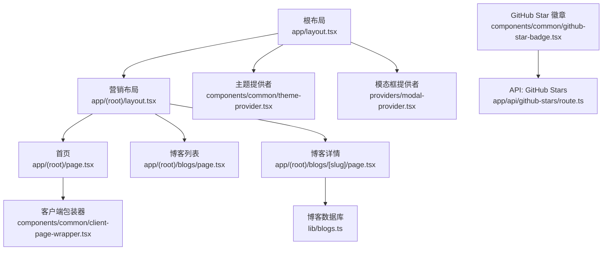
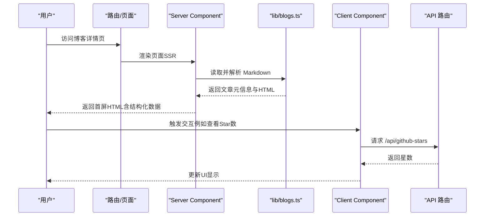
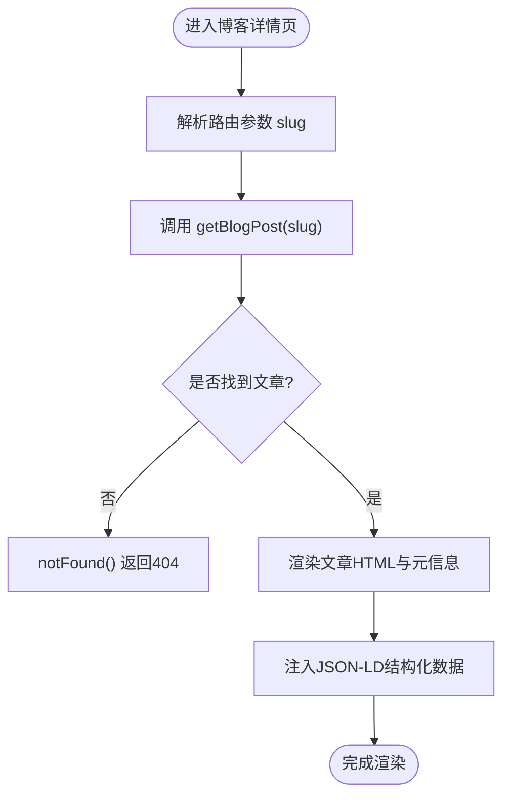
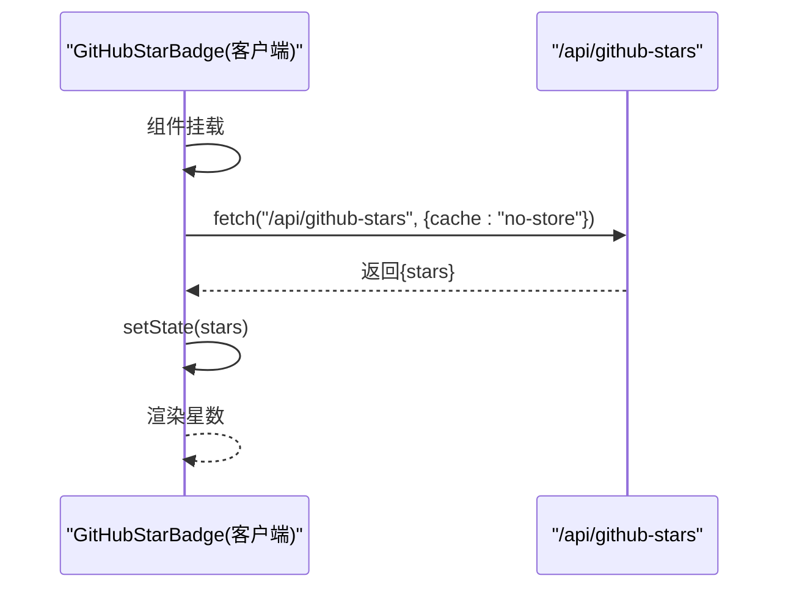
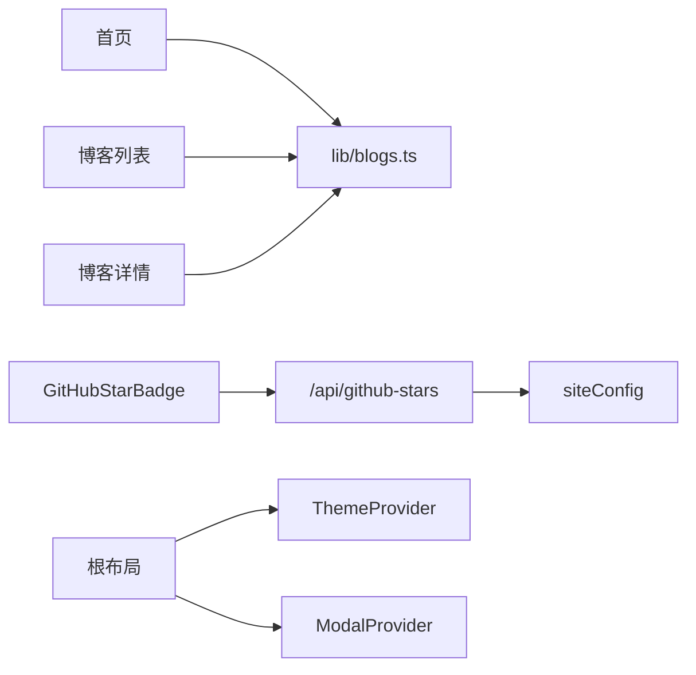

# 服务端与客户端数据同步

<cite>
**本文引用的文件**
- [app/layout.tsx](file://app/layout.tsx)
- [app/(root)/layout.tsx](file://app/(root)/layout.tsx)
- [app/(root)/page.tsx](file://app/(root)/page.tsx)
- [app/(root)/blogs/page.tsx](file://app/(root)/blogs/page.tsx)
- [app/(root)/blogs/[slug]/page.tsx](file://app/(root)/blogs/[slug]/page.tsx)
- [lib/blogs.ts](file://lib/blogs.ts)
- [components/common/client-page-wrapper.tsx](file://components/common/client-page-wrapper.tsx)
- [components/common/theme-provider.tsx](file://components/common/theme-provider.tsx)
- [components/common/github-star-badge.tsx](file://components/common/github-star-badge.tsx)
- [app/api/github-stars/route.ts](file://app/api/github-stars/route.ts)
- [providers/modal-provider.tsx](file://providers/modal-provider.tsx)
- [hooks/use-modal-store.ts](file://hooks/use-modal-store.ts)
- [config/site.ts](file://config/site.ts)
</cite>

## 目录
1. [简介](#简介)
2. [项目结构](#项目结构)
3. [核心组件](#核心组件)
4. [架构总览](#架构总览)
5. [详细组件分析](#详细组件分析)
6. [依赖关系分析](#依赖关系分析)
7. [性能考虑](#性能考虑)
8. [故障排查指南](#故障排查指南)
9. [结论](#结论)
10. [附录](#附录)

## 简介
本文件聚焦于 Next.js App Router 下的服务端与客户端数据同步机制，围绕 Server Components（默认）与 Client Components（"use client"）之间的数据传递、SSR/ISR/客户端动态加载的数据预取策略、组件间共享模式（Props、Context、状态提升），以及性能优化（去重、缓存、懒加载）展开。文档提供完整的数据流图与同步流程说明，帮助读者在真实项目中落地最佳实践。

## 项目结构
本项目采用 App Router 的目录路由组织：
- app 根布局与站点级 Provider 注入（主题、模态框、Toaster、脚本等）
- (root) 分组布局承载导航、页脚等全局 UI
- 页面按功能划分：首页、博客列表、博客详情、API 路由
- lib 层封装静态内容读取与处理（如 Markdown 博客）
- components 层包含可复用 UI 与交互组件
- providers/hooks 提供跨组件状态与能力

图表来源
- [app/layout.tsx:99-145](file://app/layout.tsx#L99-L145)
- [app/(root)/layout.tsx:11-32](file://app/(root)/layout.tsx#L11-L32)
- [app/(root)/page.tsx:37-357](file://app/(root)/page.tsx#L37-L357)
- [app/(root)/blogs/page.tsx:41-153](file://app/(root)/blogs/page.tsx#L41-L153)
- [app/(root)/blogs/[slug]/page.tsx:81-325](file://app/(root)/blogs/[slug]/page.tsx#L81-L325)
- [lib/blogs.ts:1-97](file://lib/blogs.ts#L1-L97)
- [components/common/client-page-wrapper.tsx:1-37](file://components/common/client-page-wrapper.tsx#L1-L37)
- [components/common/theme-provider.tsx:1-8](file://components/common/theme-provider.tsx#L1-L8)
- [providers/modal-provider.tsx:1-24](file://providers/modal-provider.tsx#L1-L24)
- [components/common/github-star-badge.tsx:1-63](file://components/common/github-star-badge.tsx#L1-L63)
- [app/api/github-stars/route.ts:1-44](file://app/api/github-stars/route.ts#L1-L44)

章节来源
- [app/layout.tsx:99-145](file://app/layout.tsx#L99-L145)
- [app/(root)/layout.tsx:11-32](file://app/(root)/layout.tsx#L11-L32)

## 核心组件
- 根布局与元信息：定义站点元数据、字体、第三方脚本、Provider 注入点
- 营销布局：统一头部导航、GitHub Star 徽章、主题切换、页脚
- 首页：聚合展示项目、经历、贡献、技能、博客精选；使用客户端包装器包裹动画
- 博客列表/详情：服务端读取 Markdown，生成 SEO 结构化数据与页面内容
- 博客数据库：读取 content/blogs/*.md，解析 frontmatter 与 HTML
- 客户端组件：主题切换、模态框、GitHub Star 徽章（动态拉取）
- API 路由：缓存并返回 GitHub 仓库星数

章节来源
- [app/layout.tsx:30-97](file://app/layout.tsx#L30-L97)
- [app/(root)/layout.tsx:11-32](file://app/(root)/layout.tsx#L11-L32)
- [app/(root)/page.tsx:37-357](file://app/(root)/page.tsx#L37-L357)
- [app/(root)/blogs/page.tsx:41-153](file://app/(root)/blogs/page.tsx#L41-L153)
- [app/(root)/blogs/[slug]/page.tsx:81-325](file://app/(root)/blogs/[slug]/page.tsx#L81-L325)
- [lib/blogs.ts:1-97](file://lib/blogs.ts#L1-L97)
- [components/common/theme-provider.tsx:1-8](file://components/common/theme-provider.tsx#L1-L8)
- [providers/modal-provider.tsx:1-24](file://providers/modal-provider.tsx#L1-L24)
- [components/common/github-star-badge.tsx:1-63](file://components/common/github-star-badge.tsx#L1-L63)
- [app/api/github-stars/route.ts:1-44](file://app/api/github-stars/route.ts#L1-L44)

## 架构总览
Next.js App Router 将“服务端渲染”和“客户端交互”解耦：
- 默认组件为 Server Components，负责数据获取、SEO、结构化数据注入
- 通过 "use client" 标记的组件运行在浏览器，负责交互与状态管理
- 通过 Props 将服务端数据传递给客户端组件
- 通过 Context/Provider 在客户端侧共享状态（主题、模态框）
- 通过 API 路由 + fetch 实现客户端按需加载外部数据（如 GitHub Stars）

图表来源
- [app/(root)/blogs/[slug]/page.tsx:81-325](file://app/(root)/blogs/[slug]/page.tsx#L81-L325)
- [lib/blogs.ts:64-89](file://lib/blogs.ts#L64-L89)
- [components/common/github-star-badge.tsx:14-63](file://components/common/github-star-badge.tsx#L14-L63)
- [app/api/github-stars/route.ts:17-43](file://app/api/github-stars/route.ts#L17-L43)

## 详细组件分析

### 博客数据获取与 SSR/ISR 策略
- 列表页与服务端渲染：博客列表页在服务端调用 getAllBlogsMeta，直接渲染卡片，利于 SEO 与首屏速度
- 详情页：generateStaticParams 预生成所有 slug 的静态路径；generateMetadata 基于文章内容生成 SEO 元数据；默认导出函数中 await getBlogPost 获取内容并渲染
- ISR 缓存：API 路由中对 GitHub API 的请求设置 revalidate 时间，避免频繁请求，提高稳定性
- 结构化数据：在页面中以 Script 注入 JSON-LD，增强搜索引擎理解

图表来源
- [app/(root)/blogs/[slug]/page.tsx:20-79](file://app/(root)/blogs/[slug]/page.tsx#L20-L79)
- [app/(root)/blogs/[slug]/page.tsx:81-177](file://app/(root)/blogs/[slug]/page.tsx#L81-L177)
- [lib/blogs.ts:64-89](file://lib/blogs.ts#L64-L89)

章节来源
- [app/(root)/blogs/page.tsx:41-153](file://app/(root)/blogs/page.tsx#L41-L153)
- [app/(root)/blogs/[slug]/page.tsx:20-79](file://app/(root)/blogs/[slug]/page.tsx#L20-L79)
- [app/(root)/blogs/[slug]/page.tsx:81-177](file://app/(root)/blogs/[slug]/page.tsx#L81-L177)
- [lib/blogs.ts:35-89](file://lib/blogs.ts#L35-L89)

### 客户端动态加载与状态初始化
- GitHub Star 徽章：客户端组件在 useEffect 中发起 fetch 请求到 /api/github-stars，并将结果写入本地 state，用于 UI 展示
- 主题切换：ThemeProvider 为客户端组件提供主题上下文，支持系统/手动切换
- 模态框：ModalProvider 在挂载后渲染 CustomModal，配合 useModalStore 管理打开/关闭与数据

图表来源
- [components/common/github-star-badge.tsx:14-63](file://components/common/github-star-badge.tsx#L14-L63)
- [app/api/github-stars/route.ts:17-43](file://app/api/github-stars/route.ts#L17-L43)

章节来源
- [components/common/github-star-badge.tsx:14-63](file://components/common/github-star-badge.tsx#L14-L63)
- [components/common/theme-provider.tsx:1-8](file://components/common/theme-provider.tsx#L1-L8)
- [providers/modal-provider.tsx:1-24](file://providers/modal-provider.tsx#L1-L24)
- [hooks/use-modal-store.ts:1-36](file://hooks/use-modal-store.ts#L1-L36)

### 组件间数据共享模式
- Props 传递：页面将博客元信息以 props 形式传给 BlogCard，保持单向数据流
- Context 使用：ThemeProvider 提供主题上下文；ModalProvider 提供模态框实例
- 状态提升：在客户端组件内部维护局部状态（如 stars），必要时提升到父组件或 Store（如 useModalStore）

章节来源
- [app/(root)/page.tsx:166-177](file://app/(root)/page.tsx#L166-L177)
- [components/blogs/blog-card.tsx:7-96](file://components/blogs/blog-card.tsx#L7-L96)
- [components/common/theme-provider.tsx:1-8](file://components/common/theme-provider.tsx#L1-L8)
- [providers/modal-provider.tsx:1-24](file://providers/modal-provider.tsx#L1-L24)
- [hooks/use-modal-store.ts:1-36](file://hooks/use-modal-store.ts#L1-L36)

### 数据预取策略总结
- SSR 数据获取：博客列表/详情在服务端读取 Markdown，直接渲染，减少客户端负担
- ISR 缓存：API 路由对 GitHub API 设置 revalidate 时间，平衡实时性与性能
- 客户端动态加载：GitHub Star 数在客户端按需获取，避免阻塞首屏
- 静态生成：generateStaticParams 预生成所有博客详情页，提升导航与 SEO

章节来源
- [app/(root)/blogs/page.tsx:41-153](file://app/(root)/blogs/page.tsx#L41-L153)
- [app/(root)/blogs/[slug]/page.tsx:20-79](file://app/(root)/blogs/[slug]/page.tsx#L20-L79)
- [app/api/github-stars/route.ts:5-20](file://app/api/github-stars/route.ts#L5-L20)
- [components/common/github-star-badge.tsx:17-36](file://components/common/github-star-badge.tsx#L17-L36)

## 依赖关系分析
- 页面依赖 lib/blogs.ts 进行内容读取与解析
- 客户端组件依赖 API 路由获取外部数据
- 根布局注入 Providers，影响整个应用的状态与行为
- 配置 site.ts 被多处引用，集中管理站点常量

图表来源
- [app/(root)/page.tsx:37-357](file://app/(root)/page.tsx#L37-L357)
- [app/(root)/blogs/page.tsx:41-153](file://app/(root)/blogs/page.tsx#L41-L153)
- [app/(root)/blogs/[slug]/page.tsx:81-325](file://app/(root)/blogs/[slug]/page.tsx#L81-L325)
- [lib/blogs.ts:1-97](file://lib/blogs.ts#L1-L97)
- [components/common/github-star-badge.tsx:1-63](file://components/common/github-star-badge.tsx#L1-L63)
- [app/api/github-stars/route.ts:1-44](file://app/api/github-stars/route.ts#L1-L44)
- [config/site.ts:1-41](file://config/site.ts#L1-L41)
- [app/layout.tsx:99-145](file://app/layout.tsx#L99-L145)

章节来源
- [config/site.ts:1-41](file://config/site.ts#L1-L41)
- [app/layout.tsx:99-145](file://app/layout.tsx#L99-L145)

## 性能考虑
- 数据去重
  - 列表与详情共用同一数据源（lib/blogs.ts），避免重复解析
  - 通过 generateStaticParams 预生成路径，减少运行时计算
- 缓存策略
  - API 路由对 GitHub API 设置 revalidate，降低外部依赖压力
  - 客户端 fetch 使用 no-store 保证最新数据，但仅在非关键路径使用
- 懒加载
  - 客户端动画与交互由 ClientPageWrapper 包裹，不影响首屏
  - 第三方脚本使用 afterInteractive 策略，避免阻塞
- 资源优化
  - 图片使用 next/image，合理尺寸与优先级
  - 结构化数据在服务端注入，提升 SEO 与社交分享质量

[本节为通用指导，不直接分析具体文件]

## 故障排查指南
- 缺少环境变量导致启动失败：根布局检查 Google Analytics ID，缺失时抛出错误
- 博客不存在：详情页捕获异常并调用 notFound，确保 404 体验
- 外部 API 失败：GitHub Star 徽章在 catch 分支忽略错误，避免影响主流程
- 客户端首次渲染闪烁：模态框与主题相关组件通过 isMounted 或 "use client" 规避 SSR 差异

章节来源
- [app/layout.tsx:100-103](file://app/layout.tsx#L100-L103)
- [app/(root)/blogs/[slug]/page.tsx:84-89](file://app/(root)/blogs/[slug]/page.tsx#L84-L89)
- [components/common/github-star-badge.tsx:20-36](file://components/common/github-star-badge.tsx#L20-L36)
- [providers/modal-provider.tsx:7-16](file://providers/modal-provider.tsx#L7-L16)

## 结论
本项目清晰分离了服务端渲染与客户端交互：
- 服务端负责数据获取、SEO、结构化数据注入
- 客户端负责交互与状态管理，按需加载外部数据
- 通过 Props、Context、状态提升实现组件间数据共享
- 结合 SSR、ISR 与客户端动态加载，兼顾性能与用户体验
- 通过缓存、懒加载、资源优化等手段进一步提升性能

[本节为总结性内容，不直接分析具体文件]

## 附录
- 推荐实践清单
  - 优先在服务端获取稳定数据，减少客户端负担
  - 对外部不稳定数据采用客户端动态加载与重试/降级
  - 使用 ISR 控制缓存刷新频率，平衡实时性与成本
  - 通过结构化数据增强 SEO 与社交分享效果
  - 谨慎使用全局状态，尽量通过 Props 与 Context 最小化作用域

[本节为补充建议，不直接分析具体文件]