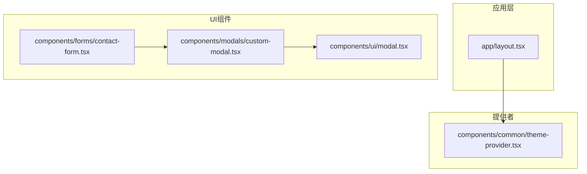
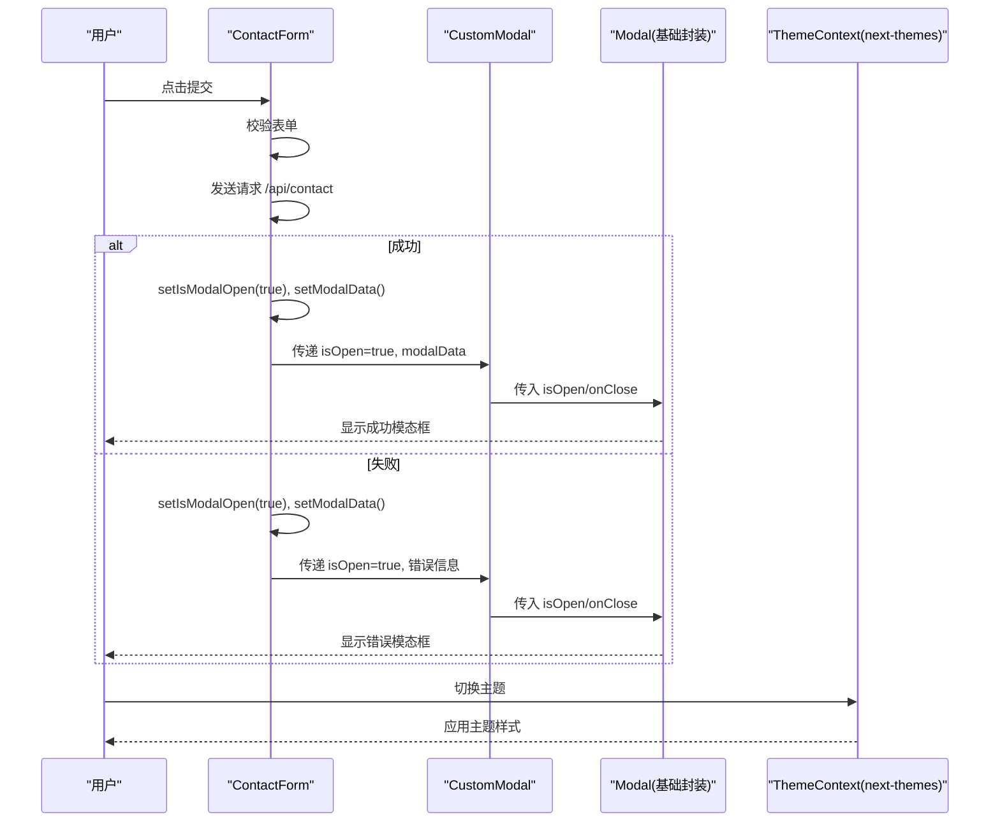
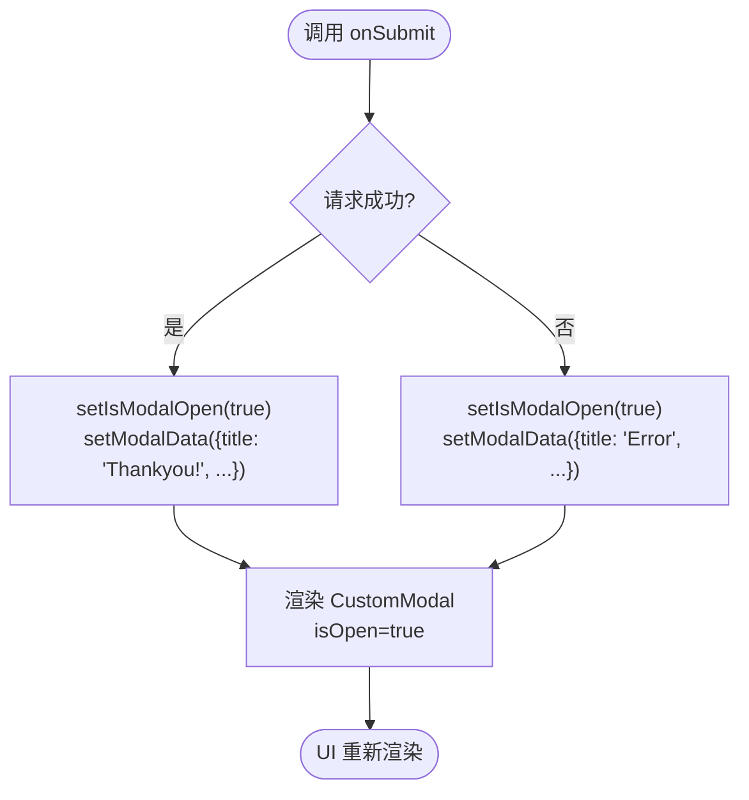
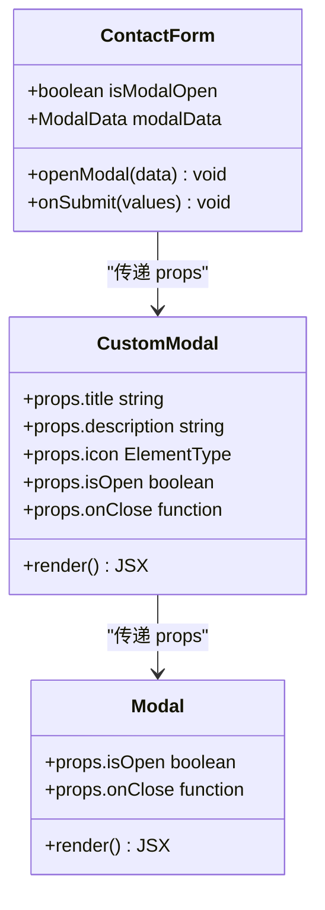
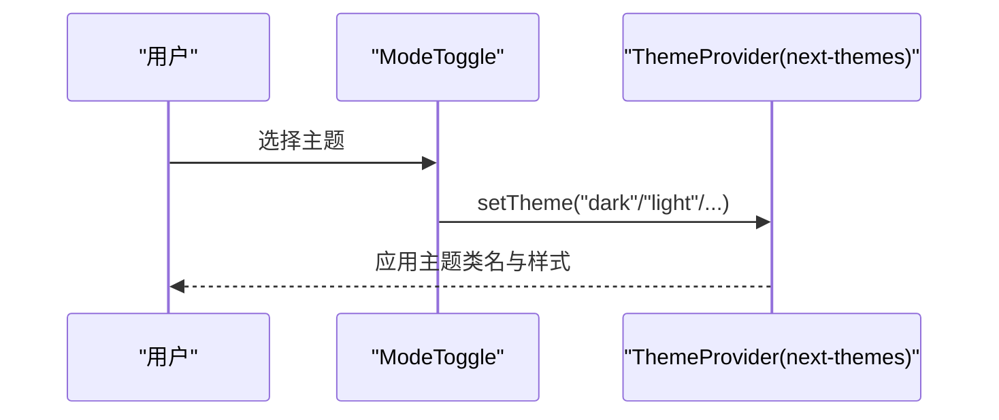
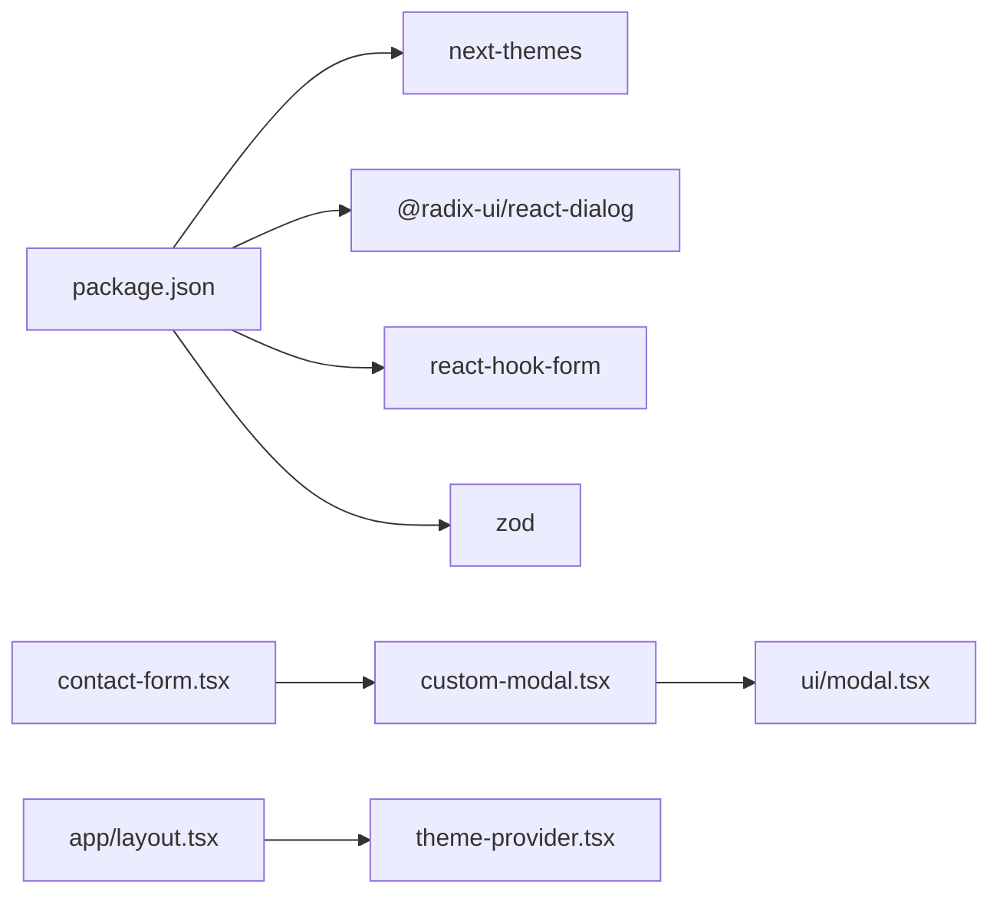

# 状态管理数据流

<cite>
**本文引用的文件**
- [components/modals/custom-modal.tsx](file://components/modals/custom-modal.tsx)
- [components/ui/modal.tsx](file://components/ui/modal.tsx)
- [components/forms/contact-form.tsx](file://components/forms/contact-form.tsx)
- [components/common/theme-provider.tsx](file://components/common/theme-provider.tsx)
- [app/layout.tsx](file://app/layout.tsx)
- [package.json](file://package.json)
</cite>

## 更新摘要
**所做更改**
- 移除了全局模态框状态管理系统（use-modal-store.ts 和 modal-provider.tsx）
- 改用 React useState hook 实现本地组件状态管理
- 简化了状态流，提升了性能和可维护性
- 更新了架构图和数据流图以反映新的实现方式

## 目录
1. [简介](#简介)
2. [项目结构](#项目结构)
3. [核心组件](#核心组件)
4. [架构总览](#架构总览)
5. [详细组件分析](#详细组件分析)
6. [依赖关系分析](#依赖关系分析)
7. [性能考量](#性能考量)
8. [故障排查指南](#故障排查指南)
9. [结论](#结论)
10. [附录](#附录)

## 简介
本文件面向 Next.js 投资组合项目的状态管理数据流，重点说明基于 React useState 的本地组件状态管理模式、主题状态管理以及组件间通信机制。文档涵盖：
- 使用 useState hook 进行本地状态管理，包括模态框打开/关闭状态和内容状态
- 组件内状态提升模式，通过 props 传递状态和回调函数
- 用户操作到状态更新的完整流程，以及状态变更对 UI 的影响
- 最佳实践与性能优化建议（状态分割、条件渲染等）

## 项目结构
本项目采用"按功能域组织"的结构：
- components：UI 组件与业务组件，包含模态框、表单、主题提供器等
- app：Next.js 路由与根布局，注入 Providers 与全局脚本
- hooks：存放自定义钩子（当前仅包含 use-lock-body）

图表来源
- [app/layout.tsx:94-102](file://app/layout.tsx#L94-L102)
- [components/common/theme-provider.tsx:8-10](file://components/common/theme-provider.tsx#L8-L10)
- [components/forms/contact-form.tsx:169-175](file://components/forms/contact-form.tsx#L169-L175)
- [components/modals/custom-modal.tsx:23-41](file://components/modals/custom-modal.tsx#L23-L41)
- [components/ui/modal.tsx:28-39](file://components/ui/modal.tsx#L28-L39)

章节来源
- [app/layout.tsx:94-102](file://app/layout.tsx#L94-L102)
- [components/common/theme-provider.tsx:8-10](file://components/common/theme-provider.tsx#L8-L10)

## 核心组件
- 联系表单组件：使用 useState 管理模态框状态，处理表单提交逻辑
- 自定义模态框组件：接收 props 并渲染模态框内容
- 基础模态框封装：对接 Radix Dialog，将 open 变化映射为 onClose
- 主题提供器：基于 next-themes 提供主题状态与切换能力

章节来源
- [components/forms/contact-form.tsx:57-63](file://components/forms/contact-form.tsx#L57-L63)
- [components/modals/custom-modal.tsx:15-43](file://components/modals/custom-modal.tsx#L15-L43)
- [components/ui/modal.tsx:21-41](file://components/ui/modal.tsx#L21-L41)
- [components/common/theme-provider.tsx:8-10](file://components/common/theme-provider.tsx#L8-L10)

## 架构总览
下图展示了从用户交互到 UI 更新的端到端数据流，包括本地状态管理和主题状态两条主线。

图表来源
- [components/forms/contact-form.tsx:75-105](file://components/forms/contact-form.tsx#L75-L105)
- [components/forms/contact-form.tsx:169-175](file://components/forms/contact-form.tsx#L169-L175)
- [components/modals/custom-modal.tsx:23-41](file://components/modals/custom-modal.tsx#L23-L41)
- [components/ui/modal.tsx:28-39](file://components/ui/modal.tsx#L28-L39)
- [components/common/theme-provider.tsx:8-10](file://components/common/theme-provider.tsx#L8-L10)

## 详细组件分析

### 联系表单本地状态管理
- 状态字段
  - isModalOpen：控制模态框显隐
  - modalData：承载模态框标题、描述、图标内容
- 状态管理
  - 使用 useState 在 ContactForm 组件内部管理状态
  - 通过 openModal 函数统一设置状态，避免分散的状态更新逻辑
- 状态提升
  - 将模态框状态提升到 ContactForm 组件，通过 props 传递给 CustomModal
  - 实现了组件间的解耦和状态的可预测性

图表来源
- [components/forms/contact-form.tsx:75-105](file://components/forms/contact-form.tsx#L75-L105)
- [components/forms/contact-form.tsx:57-63](file://components/forms/contact-form.tsx#L57-L63)

章节来源
- [components/forms/contact-form.tsx:57-63](file://components/forms/contact-form.tsx#L57-L63)
- [components/forms/contact-form.tsx:75-105](file://components/forms/contact-form.tsx#L75-L105)

### 模态框组件层级结构
- CustomModal
  - 接收 title、description、icon、isOpen、onClose 作为 props
  - 负责模态框内容的布局和样式
  - 将 props 传递给基础 Modal 组件
- Modal（基础封装）
  - 对接 Radix Dialog 组件
  - 处理 open 状态变化和关闭逻辑
  - 提供无障碍访问支持

图表来源
- [components/forms/contact-form.tsx:57-63](file://components/forms/contact-form.tsx#L57-L63)
- [components/modals/custom-modal.tsx:7-13](file://components/modals/custom-modal.tsx#L7-L13)
- [components/ui/modal.tsx:13-19](file://components/ui/modal.tsx#L13-L19)

章节来源
- [components/modals/custom-modal.tsx:15-43](file://components/modals/custom-modal.tsx#L15-L43)
- [components/ui/modal.tsx:21-41](file://components/ui/modal.tsx#L21-L41)

### 主题状态管理（next-themes）
- ThemeProvider
  - 基于 next-themes 提供主题上下文，支持多主题与系统主题跟随
- 根布局
  - 在 app/layout.tsx 中包裹 ThemeProvider，确保全应用可用
- 主题切换
  - 通过 useTheme 获取 setTheme/theme，调用 setTheme 更新全局主题状态

图表来源
- [components/common/theme-provider.tsx:8-10](file://components/common/theme-provider.tsx#L8-L10)
- [app/layout.tsx:94-102](file://app/layout.tsx#L94-L102)

章节来源
- [components/common/theme-provider.tsx:8-10](file://components/common/theme-provider.tsx#L8-L10)
- [app/layout.tsx:94-102](file://app/layout.tsx#L94-L102)

## 依赖关系分析
- 运行时依赖
  - next-themes：用于主题状态管理与持久化（由库内部处理）
  - @radix-ui/react-dialog：基础对话框能力，被 Modal 组件封装使用
  - react-hook-form：表单状态管理和验证
  - zod：表单数据验证
- 组件耦合
  - ContactForm 直接管理本地状态，不依赖外部状态管理库
  - CustomModal 仅依赖基础 Modal 组件，职责单一
  - ModalProvider 已移除，不再需要客户端渲染的特殊处理

图表来源
- [package.json:19-55](file://package.json#L19-L55)
- [components/forms/contact-form.tsx:9-21](file://components/forms/contact-form.tsx#L9-L21)
- [components/modals/custom-modal.tsx:5](file://components/modals/custom-modal.tsx#L5)
- [components/ui/modal.tsx:5-11](file://components/ui/modal.tsx#L5-L11)
- [components/common/theme-provider.tsx:3-6](file://components/common/theme-provider.tsx#L3-L6)
- [app/layout.tsx:8-8](file://app/layout.tsx#L8-L8)

章节来源
- [package.json:19-55](file://package.json#L19-L55)
- [components/forms/contact-form.tsx:9-21](file://components/forms/contact-form.tsx#L9-L21)
- [components/modals/custom-modal.tsx:5](file://components/modals/custom-modal.tsx#L5)
- [components/ui/modal.tsx:5-11](file://components/ui/modal.tsx#L5-L11)
- [components/common/theme-provider.tsx:3-6](file://components/common/theme-provider.tsx#L3-L6)
- [app/layout.tsx:8-8](file://app/layout.tsx#L8-L8)

## 性能考量
- 本地状态优势
  - 避免了全局状态管理的复杂性和不必要的重渲染
  - 状态作用域明确，只在相关组件内更新
  - 减少了跨组件通信的开销
- 选择性渲染
  - 模态框仅在需要时渲染，减少初始加载负担
  - 使用条件渲染避免不必要的 DOM 节点创建
- 状态分割
  - 将不同领域的状态分离到各自组件中
  - 表单状态、模态框状态、主题状态各司其职
- 避免不必要的重渲染
  - 使用稳定的状态引用，避免频繁的状态重建
  - 合理拆分组件，确保最小化的重渲染范围

## 故障排查指南
- 模态框不显示
  - 检查是否正确调用了 openModal 函数并传入了必要的 modalData
  - 确认 isModalOpen 状态是否正确设置为 true
- 模态框无法关闭
  - 检查基础 Modal 的 onOpenChange 是否正确调用 props.onClose
  - 确认 onClose 回调是否正确绑定到 setIsModalOpen(false)
- 主题切换无效
  - 确认 ThemeProvider 已包裹应用根节点
  - 检查 useTheme 的 setTheme 调用是否被执行
- 表单提交后无反馈
  - 检查网络请求是否成功，是否在成功/失败分支均调用了 openModal
  - 确认 modalData 是否正确设置了标题、描述和图标

章节来源
- [components/forms/contact-form.tsx:57-63](file://components/forms/contact-form.tsx#L57-L63)
- [components/forms/contact-form.tsx:75-105](file://components/forms/contact-form.tsx#L75-L105)
- [components/ui/modal.tsx:21-41](file://components/ui/modal.tsx#L21-L41)
- [components/common/theme-provider.tsx:8-10](file://components/common/theme-provider.tsx#L8-L10)

## 结论
本项目采用了简洁高效的本地状态管理方案：
- 使用 React useState 管理模态框状态，避免了全局状态管理的复杂性
- 通过组件内状态提升和 props 传递实现组件间通信
- 主题状态由 next-themes 统一管理，根布局注入，便于扩展
- 表单通过本地状态管理模态框，实现了更好的性能和可维护性
- 移除了全局模态框存储系统，简化了架构并提升了性能

这种方案特别适合中小型项目，提供了良好的开发体验和运行时性能。未来可根据需求引入更复杂的状态管理方案。

## 附录
- 关键路径参考
  - 联系表单状态管理：[components/forms/contact-form.tsx:57-63](file://components/forms/contact-form.tsx#L57-L63)
  - 模态框打开逻辑：[components/forms/contact-form.tsx:75-105](file://components/forms/contact-form.tsx#L75-L105)
  - 自定义模态框渲染：[components/modals/custom-modal.tsx:15-43](file://components/modals/custom-modal.tsx#L15-L43)
  - 基础模态框封装：[components/ui/modal.tsx:21-41](file://components/ui/modal.tsx#L21-L41)
  - 主题提供器与根布局：[components/common/theme-provider.tsx:8-10](file://components/common/theme-provider.tsx#L8-L10), [app/layout.tsx:94-102](file://app/layout.tsx#L94-L102)
  - 依赖声明：[package.json:19-55](file://package.json#L19-L55)