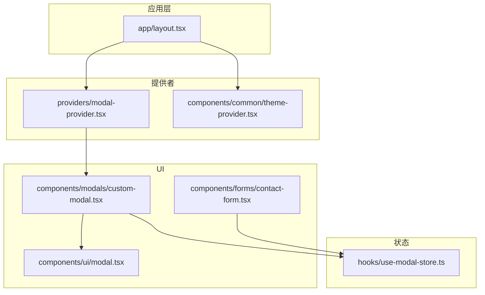
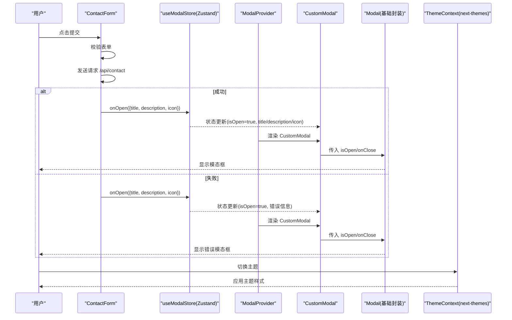
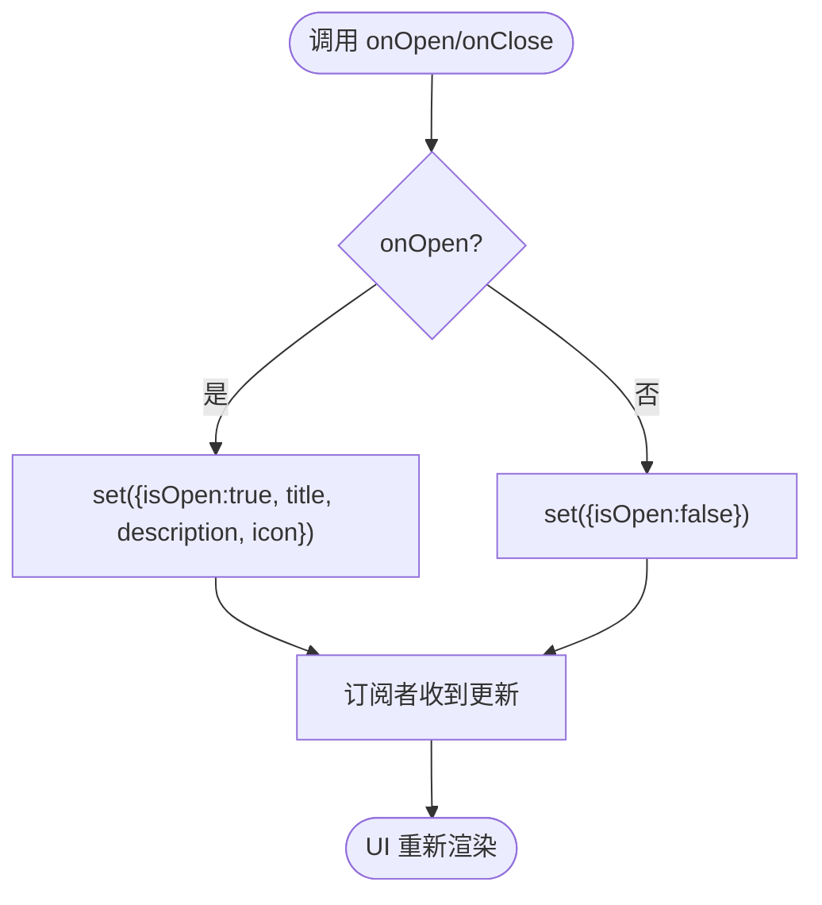
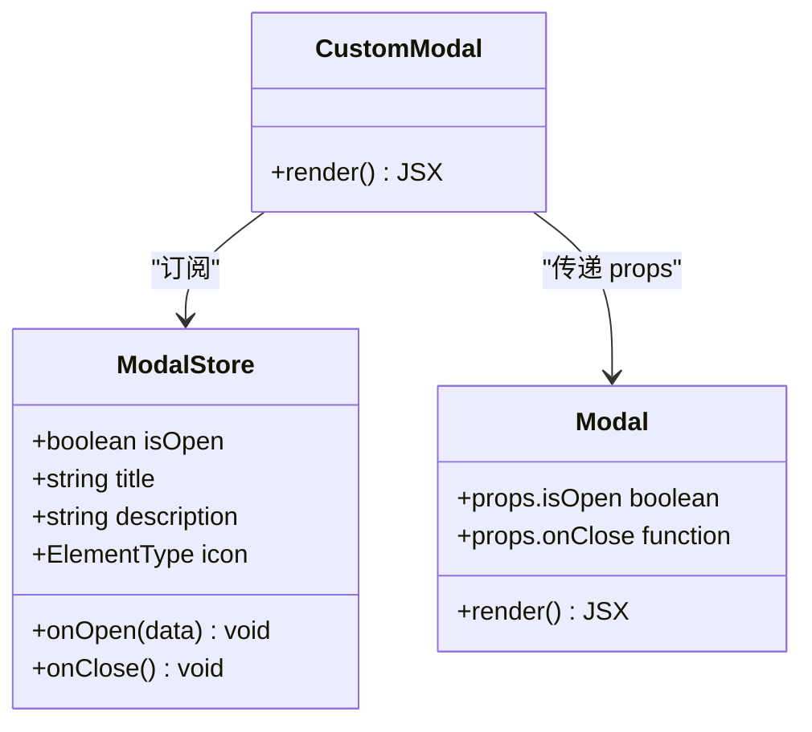
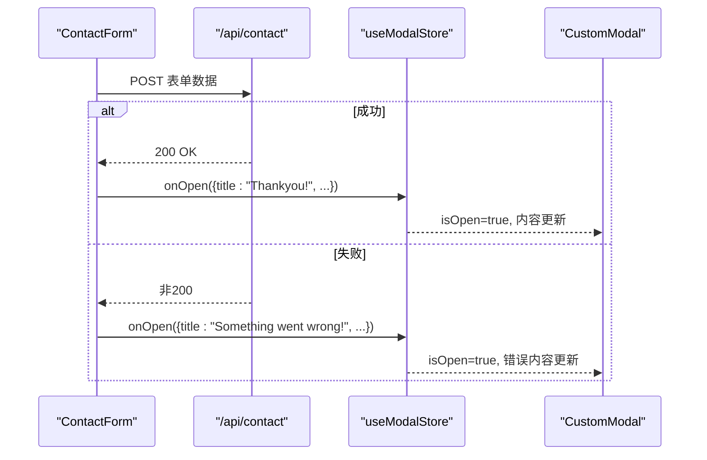
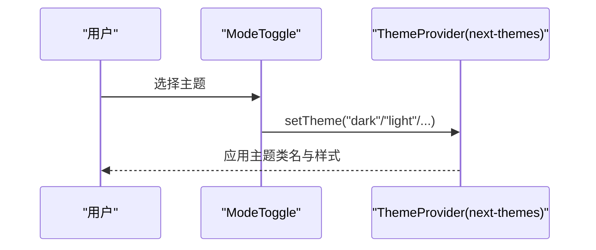
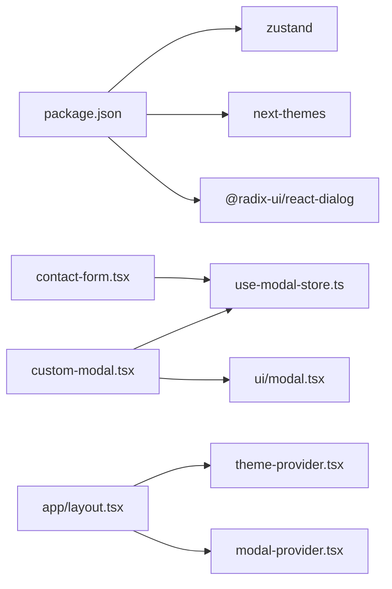

# 状态管理数据流

<cite>
**本文引用的文件**
- [hooks/use-modal-store.ts](file://hooks/use-modal-store.ts)
- [providers/modal-provider.tsx](file://providers/modal-provider.tsx)
- [components/modals/custom-modal.tsx](file://components/modals/custom-modal.tsx)
- [components/ui/modal.tsx](file://components/ui/modal.tsx)
- [components/forms/contact-form.tsx](file://components/forms/contact-form.tsx)
- [components/common/theme-provider.tsx](file://components/common/theme-provider.tsx)
- [app/layout.tsx](file://app/layout.tsx)
- [package.json](file://package.json)
</cite>

## 目录
1. [简介](#简介)
2. [项目结构](#项目结构)
3. [核心组件](#核心组件)
4. [架构总览](#架构总览)
5. [详细组件分析](#详细组件分析)
6. [依赖关系分析](#依赖关系分析)
7. [性能考量](#性能考量)
8. [故障排查指南](#故障排查指南)
9. [结论](#结论)
10. [附录](#附录)

## 简介
本文件面向 Next.js 投资组合项目的状态管理数据流，重点说明基于 Zustand 的模态框状态管理、全局状态同步机制与主题状态管理。文档涵盖：
- 状态定义、动作函数、订阅更新、持久化策略（当前未启用）
- 模态框打开/关闭状态管理、状态提升与跨组件通信模式
- 用户操作到状态更新的完整流程，以及状态变更对 UI 的影响
- 最佳实践与性能优化建议（状态分割、选择性订阅等）

## 项目结构
本项目采用“按功能域组织”的结构：
- hooks：存放基于 Zustand 的全局状态钩子（如 useModalStore）
- providers：应用级 Provider（如 ModalProvider、ThemeProvider），负责挂载全局能力
- components：UI 组件与业务组件（如 CustomModal、ContactForm）
- app：Next.js 路由与根布局，注入 Providers 与全局脚本

图表来源
- [app/layout.tsx:88-117](file://app/layout.tsx#L88-L117)
- [providers/modal-provider.tsx:7-23](file://providers/modal-provider.tsx#L7-L23)
- [components/common/theme-provider.tsx:8-10](file://components/common/theme-provider.tsx#L8-L10)
- [hooks/use-modal-store.ts:19-32](file://hooks/use-modal-store.ts#L19-L32)
- [components/modals/custom-modal.tsx:6-29](file://components/modals/custom-modal.tsx#L6-L29)
- [components/ui/modal.tsx:21-39](file://components/ui/modal.tsx#L21-L39)
- [components/forms/contact-form.tsx:32-75](file://components/forms/contact-form.tsx#L32-L75)

章节来源
- [app/layout.tsx:88-117](file://app/layout.tsx#L88-L117)
- [providers/modal-provider.tsx:7-23](file://providers/modal-provider.tsx#L7-L23)
- [components/common/theme-provider.tsx:8-10](file://components/common/theme-provider.tsx#L8-L10)

## 核心组件
- 模态框状态 store（Zustand）：集中管理 isOpen、标题、描述、图标及 onOpen/onClose 动作
- 模态框提供器：在客户端渲染 CustomModal，避免服务端水合问题
- 自定义模态框组件：从 store 读取状态并渲染内容
- 基础模态框封装：对接 Radix Dialog，将 open 变化映射为 onClose
- 联系表单：提交成功后调用 store.onOpen 展示成功或失败提示
- 主题提供器：基于 next-themes 提供主题状态与切换能力

章节来源
- [hooks/use-modal-store.ts:19-32](file://hooks/use-modal-store.ts#L19-L32)
- [providers/modal-provider.tsx:7-23](file://providers/modal-provider.tsx#L7-L23)
- [components/modals/custom-modal.tsx:6-29](file://components/modals/custom-modal.tsx#L6-L29)
- [components/ui/modal.tsx:21-39](file://components/ui/modal.tsx#L21-L39)
- [components/forms/contact-form.tsx:32-75](file://components/forms/contact-form.tsx#L32-L75)
- [components/common/theme-provider.tsx:8-10](file://components/common/theme-provider.tsx#L8-L10)

## 架构总览
下图展示了从用户交互到 UI 更新的端到端数据流，包括主题状态与模态框状态两条主线。

图表来源
- [components/forms/contact-form.tsx:45-75](file://components/forms/contact-form.tsx#L45-L75)
- [hooks/use-modal-store.ts:19-32](file://hooks/use-modal-store.ts#L19-L32)
- [providers/modal-provider.tsx:7-23](file://providers/modal-provider.tsx#L7-L23)
- [components/modals/custom-modal.tsx:6-29](file://components/modals/custom-modal.tsx#L6-L29)
- [components/ui/modal.tsx:21-39](file://components/ui/modal.tsx#L21-L39)
- [components/common/theme-provider.tsx:8-10](file://components/common/theme-provider.tsx#L8-L10)

## 详细组件分析

### 模态框状态 Store（Zustand）
- 状态字段
  - isOpen：控制模态框显隐
  - title/description/icon：承载模态框内容与图标
- 动作函数
  - onOpen(data)：设置 isOpen=true 并写入标题、描述、图标
  - onClose()：重置 isOpen=false
- 订阅与更新
  - 使用 create 创建 store，组件通过 useModalStore 订阅；仅当对应字段变化时触发重渲染
- 持久化存储
  - 当前未启用持久化；如需跨会话保留主题或模态状态，可结合 zustand/middleware/persist

图表来源
- [hooks/use-modal-store.ts:19-32](file://hooks/use-modal-store.ts#L19-L32)

章节来源
- [hooks/use-modal-store.ts:19-32](file://hooks/use-modal-store.ts#L19-L32)

### 模态框提供器与自定义模态框
- ModalProvider
  - 在客户端挂载 CustomModal，避免 SSR 水合差异
- CustomModal
  - 从 useModalStore 读取 isOpen/title/description/icon
  - 将 isOpen/onClose 传递给基础 Modal 组件
  - 根据 icon 动态渲染图标节点

图表来源
- [hooks/use-modal-store.ts:19-32](file://hooks/use-modal-store.ts#L19-L32)
- [components/modals/custom-modal.tsx:6-29](file://components/modals/custom-modal.tsx#L6-L29)
- [components/ui/modal.tsx:21-39](file://components/ui/modal.tsx#L21-L39)

章节来源
- [providers/modal-provider.tsx:7-23](file://providers/modal-provider.tsx#L7-L23)
- [components/modals/custom-modal.tsx:6-29](file://components/modals/custom-modal.tsx#L6-L29)
- [components/ui/modal.tsx:21-39](file://components/ui/modal.tsx#L21-L39)

### 联系表单与状态提升
- ContactForm
  - 使用 react-hook-form 与 zod 进行表单校验
  - 提交成功后调用 store.onOpen 展示成功提示；失败时展示错误提示
  - 通过 store.onOpen 将“结果消息”提升到全局，使任意位置均可消费该状态
- 状态提升与跨组件通信
  - 表单不直接管理模态框显隐，而是通过全局 store 通知 UI，实现解耦与复用

图表来源
- [components/forms/contact-form.tsx:45-75](file://components/forms/contact-form.tsx#L45-L75)
- [hooks/use-modal-store.ts:19-32](file://hooks/use-modal-store.ts#L19-L32)
- [components/modals/custom-modal.tsx:6-29](file://components/modals/custom-modal.tsx#L6-L29)

章节来源
- [components/forms/contact-form.tsx:45-75](file://components/forms/contact-form.tsx#L45-L75)
- [hooks/use-modal-store.ts:19-32](file://hooks/use-modal-store.ts#L19-L32)

### 主题状态管理（next-themes）
- ThemeProvider
  - 基于 next-themes 提供主题上下文，支持多主题与系统主题跟随
- 根布局
  - 在 app/layout.tsx 中包裹 ThemeProvider，确保全应用可用
- 主题切换
  - 通过 useTheme 获取 setTheme/theme，调用 setTheme 更新全局主题状态

图表来源
- [components/common/theme-provider.tsx:8-10](file://components/common/theme-provider.tsx#L8-L10)
- [app/layout.tsx:100-117](file://app/layout.tsx#L100-L117)

章节来源
- [components/common/theme-provider.tsx:8-10](file://components/common/theme-provider.tsx#L8-L10)
- [app/layout.tsx:100-117](file://app/layout.tsx#L100-L117)

## 依赖关系分析
- 运行时依赖
  - zustand：用于创建轻量级全局状态 store
  - next-themes：用于主题状态管理与持久化（由库内部处理）
  - @radix-ui/react-dialog：基础对话框能力，被 Modal 组件封装使用
- 组件耦合
  - CustomModal 依赖 useModalStore 与基础 Modal
  - ContactForm 仅依赖 useModalStore 的动作接口，不感知具体 UI 实现
  - ModalProvider 仅负责挂载 CustomModal，避免 SSR 问题

图表来源
- [package.json:13-50](file://package.json#L13-L50)
- [components/forms/contact-form.tsx:32-75](file://components/forms/contact-form.tsx#L32-L75)
- [components/modals/custom-modal.tsx:6-29](file://components/modals/custom-modal.tsx#L6-L29)
- [components/ui/modal.tsx:21-39](file://components/ui/modal.tsx#L21-L39)
- [components/common/theme-provider.tsx:8-10](file://components/common/theme-provider.tsx#L8-L10)
- [app/layout.tsx:100-117](file://app/layout.tsx#L100-L117)
- [providers/modal-provider.tsx:7-23](file://providers/modal-provider.tsx#L7-L23)

章节来源
- [package.json:13-50](file://package.json#L13-L50)
- [components/forms/contact-form.tsx:32-75](file://components/forms/contact-form.tsx#L32-L75)
- [components/modals/custom-modal.tsx:6-29](file://components/modals/custom-modal.tsx#L6-L29)
- [components/ui/modal.tsx:21-39](file://components/ui/modal.tsx#L21-L39)
- [components/common/theme-provider.tsx:8-10](file://components/common/theme-provider.tsx#L8-L10)
- [app/layout.tsx:100-117](file://app/layout.tsx#L100-L117)
- [providers/modal-provider.tsx:7-23](file://providers/modal-provider.tsx#L7-L23)

## 性能考量
- 选择性订阅
  - 在需要时仅订阅必要字段，例如只订阅 isOpen 以最小化重渲染
- 状态分割
  - 将不同领域状态拆分至独立 store（如模态框、主题、表单、页面导航），降低耦合度
- 惰性加载与条件渲染
  - 使用 ModalProvider 仅在客户端挂载 CustomModal，减少首屏负担
- 避免不必要的重渲染
  - 将大型对象或回调拆分为稳定引用，必要时使用 memo 包裹
- 持久化策略
  - 当前未启用持久化；若需跨会话保存主题或模态状态，可引入 zustand 的 persist 中间件并结合 localStorage

[本节为通用性能建议，不直接分析具体文件]

## 故障排查指南
- 模态框不显示
  - 检查是否已正确调用 store.onOpen 并传入必要字段
  - 确认 ModalProvider 已在客户端渲染 CustomModal
- 模态框无法关闭
  - 检查基础 Modal 的 onOpenChange 是否正确调用 props.onClose
  - 确认 store.onClose 被正确绑定
- 主题切换无效
  - 确认 ThemeProvider 已包裹应用根节点
  - 检查 useTheme 的 setTheme 调用是否被执行
- 表单提交后无反馈
  - 检查网络请求是否成功，是否在成功/失败分支均调用了 store.onOpen

章节来源
- [components/ui/modal.tsx:21-39](file://components/ui/modal.tsx#L21-L39)
- [providers/modal-provider.tsx:7-23](file://providers/modal-provider.tsx#L7-L23)
- [components/forms/contact-form.tsx:45-75](file://components/forms/contact-form.tsx#L45-L75)
- [components/common/theme-provider.tsx:8-10](file://components/common/theme-provider.tsx#L8-L10)

## 结论
本项目采用简洁清晰的状态管理方案：
- 使用 Zustand 管理模态框全局状态，动作函数明确、订阅粒度可控
- 通过 ModalProvider 解决 SSR 兼容性问题，CustomModal 专注渲染
- 主题状态由 next-themes 统一管理，根布局注入，便于扩展
- 表单通过 store.onOpen 将结果提升到全局，实现跨组件通信
未来可按需引入持久化、状态分割与更细粒度的选择性订阅，进一步提升可维护性与性能。

[本节为总结性内容，不直接分析具体文件]

## 附录
- 关键路径参考
  - 模态框状态定义与动作：[hooks/use-modal-store.ts:19-32](file://hooks/use-modal-store.ts#L19-L32)
  - 模态框提供器挂载：[providers/modal-provider.tsx:7-23](file://providers/modal-provider.tsx#L7-L23)
  - 自定义模态框渲染：[components/modals/custom-modal.tsx:6-29](file://components/modals/custom-modal.tsx#L6-L29)
  - 基础模态框封装：[components/ui/modal.tsx:21-39](file://components/ui/modal.tsx#L21-L39)
  - 表单触发模态框：[components/forms/contact-form.tsx:45-75](file://components/forms/contact-form.tsx#L45-L75)
  - 主题提供器与根布局：[components/common/theme-provider.tsx:8-10](file://components/common/theme-provider.tsx#L8-L10), [app/layout.tsx:100-117](file://app/layout.tsx#L100-L117)
  - 依赖声明：[package.json:13-50](file://package.json#L13-L50)