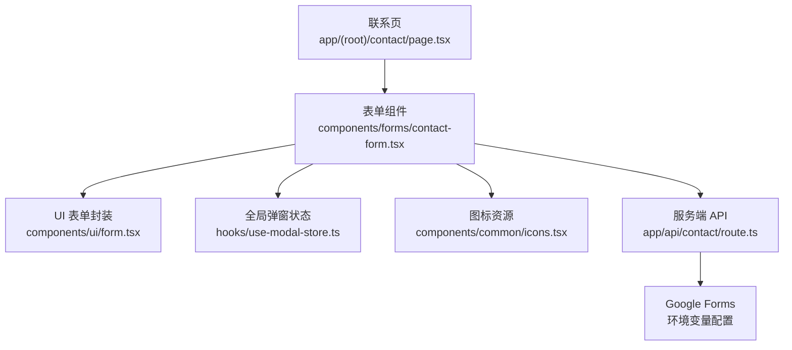
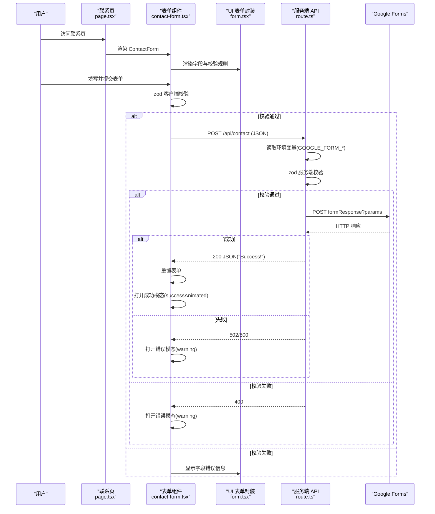
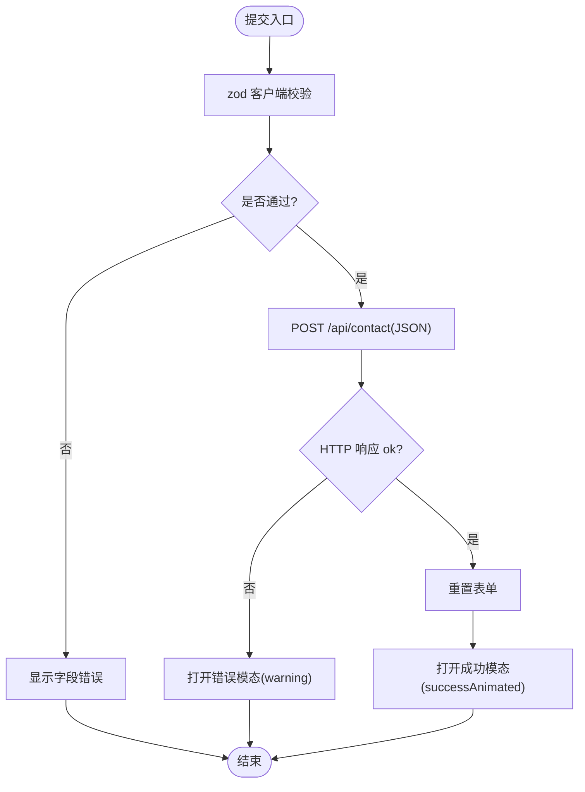
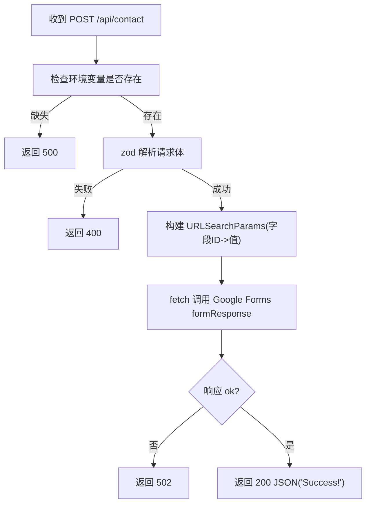
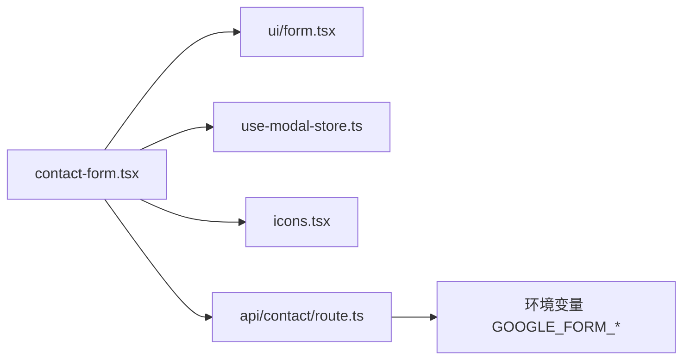

# 表单数据处理流

<cite>
**本文引用的文件**
- [contact-form.tsx](file://components/forms/contact-form.tsx)
- [route.ts](file://app/api/contact/route.ts)
- [page.tsx](file://app/(root)/contact/page.tsx)
- [form.tsx](file://components/ui/form.tsx)
- [use-modal-store.ts](file://hooks/use-modal-store.ts)
- [icons.tsx](file://components/common/icons.tsx)
- [pages.ts](file://config/pages.ts)
</cite>

## 目录
1. [简介](#简介)
2. [项目结构](#项目结构)
3. [核心组件](#核心组件)
4. [架构总览](#架构总览)
5. [详细组件分析](#详细组件分析)
6. [依赖关系分析](#依赖关系分析)
7. [性能与可靠性](#性能与可靠性)
8. [故障排查指南](#故障排查指南)
9. [结论](#结论)
10. [附录：扩展与常见问题](#附录：扩展与常见问题)

## 简介
本文档围绕 Next.js 投资组合项目的“联系表单”数据流，完整描述从用户输入、客户端验证、API 路由处理到 Google Forms 集成的端到端流程。重点说明表单状态管理、数据验证规则、错误处理机制、异步提交逻辑；并解释服务端 API 的数据接收、格式校验、外部服务调用与响应处理。文档包含数据流图与状态转换图，以及表单扩展指南和常见问题解决方案。

## 项目结构
联系表单由页面容器、表单组件、UI 表单封装、全局模态弹窗状态、图标资源与页面配置组成。关键路径如下：
- 页面入口：app/(root)/contact/page.tsx
- 表单组件：components/forms/contact-form.tsx
- UI 表单封装：components/ui/form.tsx
- 服务端 API：app/api/contact/route.ts
- 全局弹窗状态：hooks/use-modal-store.ts
- 图标资源：components/common/icons.tsx
- 页面元信息：config/pages.ts

图表来源
- [page.tsx:13-28](file://app/(root)/contact/page.tsx#L13-L28)
- [contact-form.tsx:32-75](file://components/forms/contact-form.tsx#L32-L75)
- [form.tsx:16-176](file://components/ui/form.tsx#L16-L176)
- [route.ts:11-56](file://app/api/contact/route.ts#L11-L56)

章节来源
- [page.tsx:1-30](file://app/(root)/contact/page.tsx#L1-L30)
- [contact-form.tsx:1-140](file://components/forms/contact-form.tsx#L1-L140)
- [form.tsx:1-178](file://components/ui/form.tsx#L1-L178)
- [route.ts:1-57](file://app/api/contact/route.ts#L1-L57)
- [use-modal-store.ts:1-33](file://hooks/use-modal-store.ts#L1-L33)
- [icons.tsx:90-218](file://components/common/icons.tsx#L90-L218)
- [pages.ts:40-47](file://config/pages.ts#L40-L47)

## 核心组件
- 联系表单组件（客户端）
  - 使用 react-hook-form + zod 进行字段绑定与实时校验
  - 提交时通过 fetch 调用 /api/contact
  - 成功时重置表单并打开成功模态；失败时打开错误模态
- 服务端 API 路由
  - 读取环境变量中的 Google Forms 链接与字段 ID
  - 使用 zod 校验请求体
  - 将数据以查询参数形式 POST 到 Google Forms
  - 根据响应返回不同状态码与消息
- UI 表单封装
  - 基于 Radix 与 react-hook-form 的 Form/FormField/FormItem/FormLabel/FormControl/FormMessage 组合
  - 提供无障碍属性与错误提示渲染
- 全局弹窗状态
  - 使用 zustand 维护 isOpen、title、description、icon
  - 提供 onOpen/onClose 方法统一控制弹窗
- 图标资源
  - 暴露 successAnimated、warning 等图标用于弹窗反馈

章节来源
- [contact-form.tsx:21-75](file://components/forms/contact-form.tsx#L21-L75)
- [route.ts:4-56](file://app/api/contact/route.ts#L4-L56)
- [form.tsx:16-176](file://components/ui/form.tsx#L16-L176)
- [use-modal-store.ts:4-32](file://hooks/use-modal-store.ts#L4-L32)
- [icons.tsx:90-218](file://components/common/icons.tsx#L90-L218)

## 架构总览
下图展示从用户输入到成功提交的完整数据流与状态变化。

图表来源
- [contact-form.tsx:45-75](file://components/forms/contact-form.tsx#L45-L75)
- [route.ts:11-56](file://app/api/contact/route.ts#L11-L56)
- [form.tsx:42-166](file://components/ui/form.tsx#L42-L166)
- [use-modal-store.ts:19-32](file://hooks/use-modal-store.ts#L19-L32)
- [icons.tsx:107,187-211:107-107](file://components/common/icons.tsx#L107-L107)

## 详细组件分析

### 客户端表单组件（ContactForm）
- 表单模式与默认值
  - 使用 zod 定义 schema：name、email、message、social（可选 URL 或空串）
  - 通过 useForm 初始化，设置默认值为空字符串
- 提交流程
  - 使用 fetch 向 /api/contact 发送 JSON 请求
  - 成功：重置表单并打开成功模态（successAnimated 图标）
  - 失败：捕获异常并打开错误模态（warning 图标）
- 字段渲染
  - 使用 UI 表单封装的 FormField/FormItem/FormLabel/FormControl/FormMessage
  - 每个字段绑定对应 field，自动显示校验错误信息

图表来源
- [contact-form.tsx:21-75](file://components/forms/contact-form.tsx#L21-L75)
- [form.tsx:144-166](file://components/ui/form.tsx#L144-L166)
- [use-modal-store.ts:19-32](file://hooks/use-modal-store.ts#L19-L32)
- [icons.tsx:107,187-211:107-107](file://components/common/icons.tsx#L107-L107)

章节来源
- [contact-form.tsx:21-75](file://components/forms/contact-form.tsx#L21-L75)
- [form.tsx:16-176](file://components/ui/form.tsx#L16-L176)
- [use-modal-store.ts:4-32](file://hooks/use-modal-store.ts#L4-L32)
- [icons.tsx:90-218](file://components/common/icons.tsx#L90-L218)

### 服务端 API 路由（/api/contact）
- 环境变量检查
  - 必须配置 GOOGLE_FORM_LINK、GOOGLE_FORM_FIELD_ID_NAME、GOOGLE_FORM_FIELD_ID_EMAIL、GOOGLE_FORM_FIELD_ID_MESSAGE、GOOGLE_FORM_FIELD_ID_SOCIAL
  - 任一缺失返回 500
- 数据校验
  - 使用 zod 对请求体进行 safeParse，失败返回 400
- 外部服务调用
  - 构造 URLSearchParams，将 name/email/message/social 映射为 Google Forms 字段 ID 的值
  - 使用 fetch 调用 Google Forms 的 formResponse 接口
  - 若响应非 ok，返回 502
- 响应处理
  - 成功返回 JSON("Success!")
  - 异常捕获后返回 500 并记录日志

图表来源
- [route.ts:11-56](file://app/api/contact/route.ts#L11-L56)

章节来源
- [route.ts:1-57](file://app/api/contact/route.ts#L1-L57)

### UI 表单封装与错误提示
- 通过 FormProvider 提供上下文，FormField 包装 Controller 实现字段受控
- FormItem 提供唯一 id，FormLabel 关联 htmlFor，FormControl 注入 aria-* 属性
- FormMessage 根据字段 error 动态渲染错误文本
- 该封装确保可访问性与一致的样式行为

章节来源
- [form.tsx:16-176](file://components/ui/form.tsx#L16-L176)

### 全局弹窗状态（useModalStore）
- 使用 zustand 创建 store，维护 isOpen、title、description、icon
- onOpen 接收 ModalDataProps 并更新状态；onClose 关闭弹窗
- 表单组件在成功/失败时调用 onOpen 触发模态展示

章节来源
- [use-modal-store.ts:4-32](file://hooks/use-modal-store.ts#L4-L32)

### 图标资源
- 暴露 successAnimated（成功动画）、warning（警告）等图标
- 表单组件在打开模态时传入对应图标，增强用户体验

章节来源
- [icons.tsx:90-218](file://components/common/icons.tsx#L90-L218)

### 页面容器与元信息
- 联系页引入 ContactForm 与 GithubRedirectCard，并使用 PageContainer 包裹
- 通过 pagesConfig 提供标题与描述等元信息

章节来源
- [page.tsx:1-30](file://app/(root)/contact/page.tsx#L1-L30)
- [pages.ts:40-47](file://config/pages.ts#L40-L47)

## 依赖关系分析
- 组件耦合
  - contact-form.tsx 依赖 UI 表单封装、全局弹窗状态、图标资源
  - route.ts 依赖环境变量与 zod 校验，调用外部 Google Forms
- 外部依赖
  - Google Forms 通过环境变量配置，需保证字段 ID 与链接正确
- 潜在循环依赖
  - 当前无循环引用；表单与服务端解耦清晰

图表来源
- [contact-form.tsx:1-140](file://components/forms/contact-form.tsx#L1-L140)
- [route.ts:1-57](file://app/api/contact/route.ts#L1-L57)

章节来源
- [contact-form.tsx:1-140](file://components/forms/contact-form.tsx#L1-L140)
- [route.ts:1-57](file://app/api/contact/route.ts#L1-L57)

## 性能与可靠性
- 客户端
  - 使用 zod 即时校验，减少无效请求
  - 提交成功后重置表单，避免重复提交导致的冗余状态
- 服务端
  - 环境变量前置校验，快速失败
  - 对请求体进行二次校验，防止恶意或畸形数据
  - 对外部服务调用进行 ok 判断，区分网络/业务错误
- 建议
  - 增加防抖/节流与加载态，提升交互体验
  - 对 Google Forms 调用增加超时与重试策略
  - 记录结构化日志便于问题定位

[本节为通用指导，不直接分析具体文件]

## 故障排查指南
- 环境变量未配置
  - 现象：服务端返回 500
  - 处理：检查 GOOGLE_FORM_LINK 与各字段 ID 是否已设置
- 客户端校验失败
  - 现象：字段下方显示错误信息，无法提交
  - 处理：根据 FormMessage 提示修正输入
- 服务端校验失败
  - 现象：返回 400
  - 处理：确认请求体字段类型与必填项是否符合 schema
- Google Forms 提交失败
  - 现象：返回 502
  - 处理：核对 Google Forms 链接与字段 ID，检查网络连通性
- 未知异常
  - 现象：返回 500
  - 处理：查看服务端日志输出，定位异常堆栈

章节来源
- [route.ts:20-56](file://app/api/contact/route.ts#L20-L56)
- [contact-form.tsx:45-75](file://components/forms/contact-form.tsx#L45-L75)
- [form.tsx:144-166](file://components/ui/form.tsx#L144-L166)

## 结论
本方案通过客户端 zod 校验与 react-hook-form 管理表单状态，结合服务端 zod 校验与 Google Forms 集成，实现了安全、可靠且可扩展的联系表单数据流。统一的模态弹窗与图标资源提升了用户体验，清晰的错误处理与日志记录便于问题定位与维护。

[本节为总结，不直接分析具体文件]

## 附录：扩展与常见问题

### 表单扩展指南
- 新增字段
  - 在客户端 schema 中追加字段与校验规则
  - 在服务端 schema 中同步新增字段与校验
  - 在 UI 表单中渲染新字段，并绑定 field
  - 在服务端将新字段映射到 Google Forms 对应字段 ID
- 自定义校验
  - 使用 zod 的 refine 或自定义 message 实现更复杂的规则
- 多目标提交
  - 可在服务端增加并行或串行调用，支持多个收件系统
- 国际化
  - 将错误消息抽离为 i18n 键值，按语言切换

### 常见问题
- 为什么提交后没有收到邮件？
  - 检查 Google Forms 是否配置了通知或转发规则
- 为什么字段校验不生效？
  - 确认字段名称与 schema 一致，且 FormField 正确绑定
- 为什么出现 502？
  - Google Forms 接口不可用或字段 ID 不匹配，请核对环境变量与表单设置
- 如何禁用可选字段 social？
  - 在 schema 中将 social 设为必填或移除该字段，并在服务端与 UI 同步调整

[本节为通用指导，不直接分析具体文件]