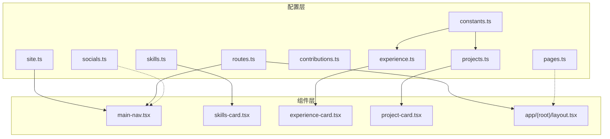
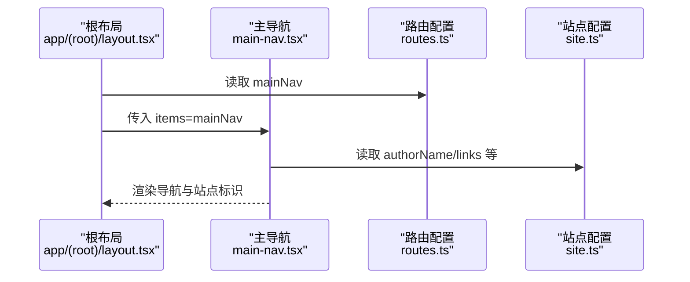
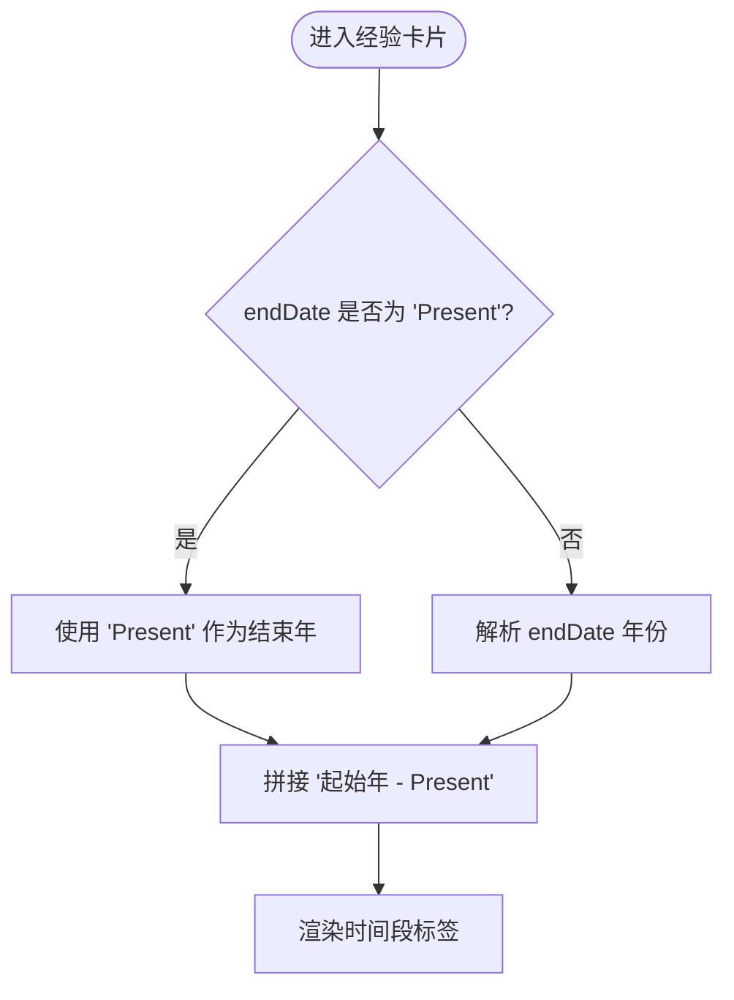
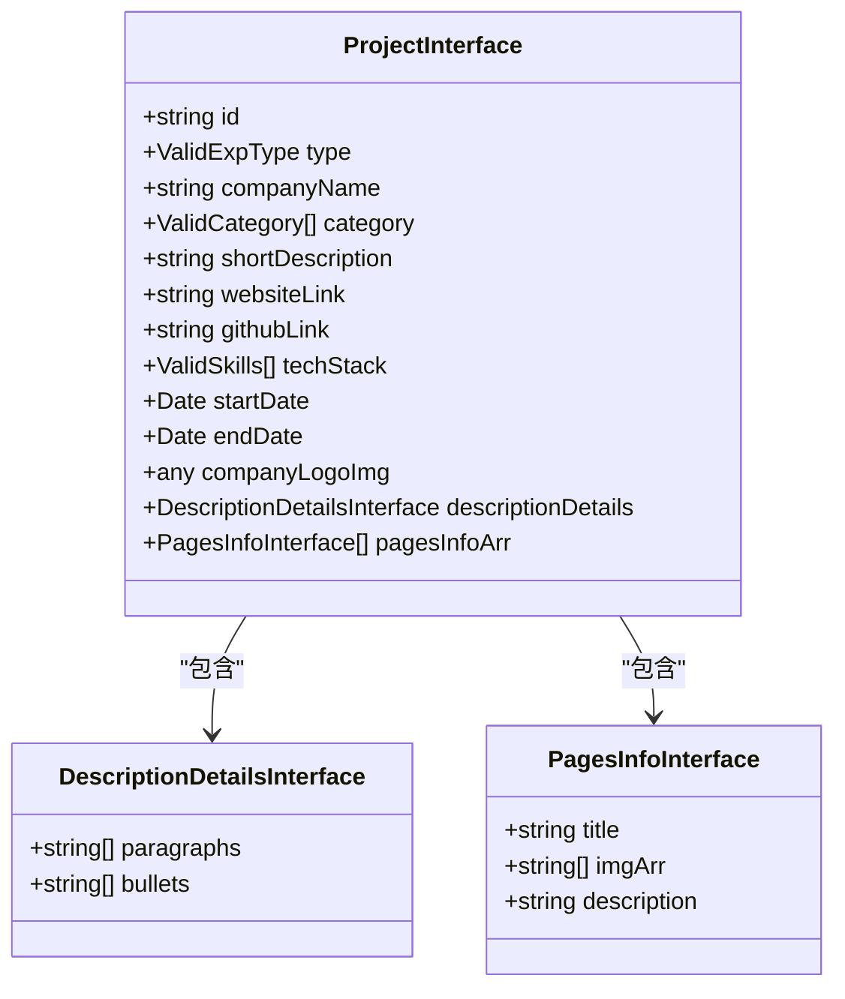
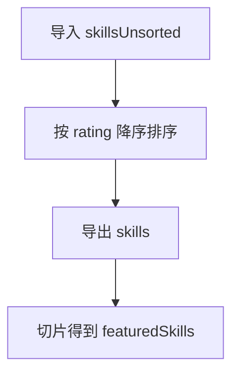
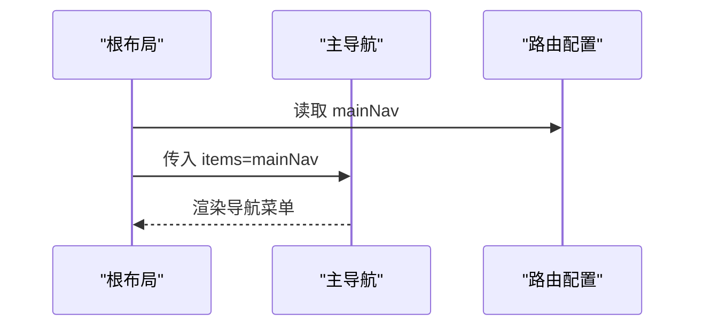
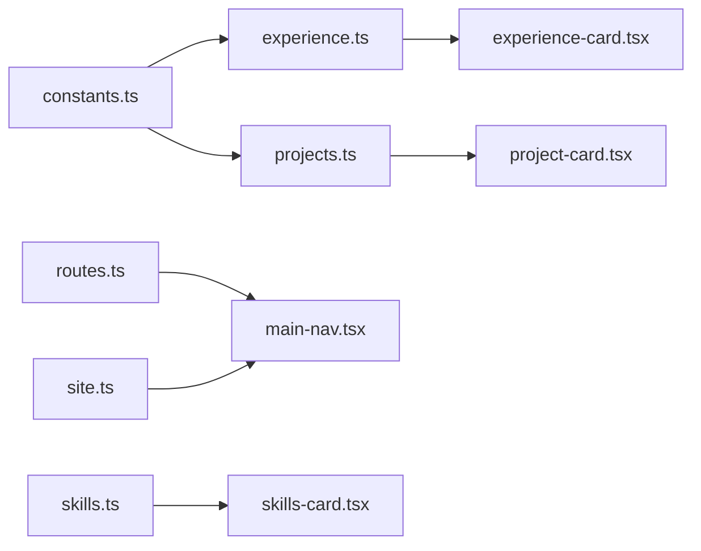

# 静态数据流

<cite>
**本文引用的文件**
- [config/site.ts](file://config/site.ts)
- [config/constants.ts](file://config/constants.ts)
- [config/experience.ts](file://config/experience.ts)
- [config/projects.ts](file://config/projects.ts)
- [config/skills.ts](file://config/skills.ts)
- [config/contributions.ts](file://config/contributions.ts)
- [config/socials.ts](file://config/socials.ts)
- [config/pages.ts](file://config/pages.ts)
- [config/routes.ts](file://config/routes.ts)
- [components/common/main-nav.tsx](file://components/common/main-nav.tsx)
- [components/skills/skills-card.tsx](file://components/skills/skills-card.tsx)
- [components/experience/experience-card.tsx](file://components/experience/experience-card.tsx)
- [components/projects/project-card.tsx](file://components/projects/project-card.tsx)
- [app/(root)/layout.tsx](file://app/(root)/layout.tsx)
</cite>

## 目录
1. [简介](#简介)
2. [项目结构](#项目结构)
3. [核心组件](#核心组件)
4. [架构总览](#架构总览)
5. [详细组件分析](#详细组件分析)
6. [依赖关系分析](#依赖关系分析)
7. [性能考虑](#性能考虑)
8. [故障排查指南](#故障排查指南)
9. [结论](#结论)
10. [附录](#附录)

## 简介
本文件系统化梳理项目中“静态数据流”的组织与加载机制，覆盖站点配置、项目信息、工作经验、技能数据、贡献记录、社交链接、页面元信息与路由导航等。文档解释配置文件的设计模式、类型安全的数据访问方式、如何在组件中消费这些静态数据，并提供扩展方法与最佳实践建议，帮助你在不破坏类型约束的前提下扩展或定制配置。

## 项目结构
静态数据集中存放在 config 目录下，按主题拆分：站点、经验、项目、技能、贡献、社交、页面与路由。各模块通过 TypeScript 接口与联合类型保证类型安全；组件从对应模块导入数据并渲染。根布局将路由配置注入到导航组件，站点配置用于品牌与 SEO 相关展示。

图表来源
- [config/site.ts:1-41](file://config/site.ts#L1-L41)
- [config/routes.ts:1-29](file://config/routes.ts#L1-L29)
- [config/skills.ts:1-166](file://config/skills.ts#L1-L166)
- [config/experience.ts:1-93](file://config/experience.ts#L1-L93)
- [config/projects.ts:1-596](file://config/projects.ts#L1-L596)
- [components/common/main-nav.tsx:1-105](file://components/common/main-nav.tsx#L1-L105)
- [components/skills/skills-card.tsx:1-31](file://components/skills/skills-card.tsx#L1-L31)
- [components/experience/experience-card.tsx:1-112](file://components/experience/experience-card.tsx#L1-L112)
- [components/projects/project-card.tsx:1-51](file://components/projects/project-card.tsx#L1-L51)
- [app/(root)/layout.tsx:1-33](file://app/(root)/layout.tsx#L1-L33)

章节来源
- [config/site.ts:1-41](file://config/site.ts#L1-L41)
- [config/constants.ts:1-85](file://config/constants.ts#L1-L85)
- [config/experience.ts:1-93](file://config/experience.ts#L1-L93)
- [config/projects.ts:1-596](file://config/projects.ts#L1-L596)
- [config/skills.ts:1-166](file://config/skills.ts#L1-L166)
- [config/contributions.ts:1-48](file://config/contributions.ts#L1-L48)
- [config/socials.ts:1-36](file://config/socials.ts#L1-L36)
- [config/pages.ts:1-86](file://config/pages.ts#L1-L86)
- [config/routes.ts:1-29](file://config/routes.ts#L1-L29)
- [components/common/main-nav.tsx:1-105](file://components/common/main-nav.tsx#L1-L105)
- [components/skills/skills-card.tsx:1-31](file://components/skills/skills-card.tsx#L1-L31)
- [components/experience/experience-card.tsx:1-112](file://components/experience/experience-card.tsx#L1-L112)
- [components/projects/project-card.tsx:1-51](file://components/projects/project-card.tsx#L1-L51)
- [app/(root)/layout.tsx:1-33](file://app/(root)/layout.tsx#L1-L33)

## 核心组件
- 站点配置（site.ts）：定义站点名称、作者、描述、URL、图标、关键词与外部链接，供头部、SEO、页脚等全局使用。
- 常量与类型（constants.ts）：集中定义技能、分类、经验类型、页面枚举等联合类型，确保跨模块的类型一致性。
- 工作经验（experience.ts）：以 ExperienceInterface 描述经历条目，包含时间、地点、描述、成就、技能标签、公司链接与 Logo。
- 项目信息（projects.ts）：以 ProjectInterface 描述项目，包含类型、分类、技术栈、起止时间、图片、详细描述与多页面截图信息。
- 技能数据（skills.ts）：以 skillsInterface 描述技能项，包含名称、描述、评分与图标；提供排序后的列表与精选集合。
- 贡献记录（contributions.ts）：以 contributionsInterface 描述开源贡献，包含仓库、描述、所有者与链接；提供精选集合。
- 社交链接（socials.ts）：以 SocialInterface 描述社交平台，包含名称、用户名、图标与链接。
- 页面元信息（pages.ts）：为每个页面提供标题、描述与 metadata，便于统一生成页面元数据。
- 路由导航（routes.ts）：定义主导航菜单的标题与路径，被布局与导航组件消费。

章节来源
- [config/site.ts:1-41](file://config/site.ts#L1-L41)
- [config/constants.ts:1-85](file://config/constants.ts#L1-L85)
- [config/experience.ts:1-93](file://config/experience.ts#L1-L93)
- [config/projects.ts:1-596](file://config/projects.ts#L1-L596)
- [config/skills.ts:1-166](file://config/skills.ts#L1-L166)
- [config/contributions.ts:1-48](file://config/contributions.ts#L1-L48)
- [config/socials.ts:1-36](file://config/socials.ts#L1-L36)
- [config/pages.ts:1-86](file://config/pages.ts#L1-L86)
- [config/routes.ts:1-29](file://config/routes.ts#L1-L29)

## 架构总览
静态数据采用“配置即数据”的模式：所有可编辑内容集中在 config 目录，组件仅负责消费与渲染。类型系统贯穿始终，确保新增字段或修改字段时获得编译期检查。

图表来源
- [app/(root)/layout.tsx:1-33](file://app/(root)/layout.tsx#L1-L33)
- [components/common/main-nav.tsx:1-105](file://components/common/main-nav.tsx#L1-L105)
- [config/routes.ts:1-29](file://config/routes.ts#L1-L29)
- [config/site.ts:1-41](file://config/site.ts#L1-L41)

## 详细组件分析

### 站点配置与全局元信息
- 设计要点
  - 单一事实源：站点名称、作者、URL、图标、关键词等集中在 siteConfig。
  - 类型安全：对象键值由开发者维护，配合 IDE 提示减少拼写错误。
  - 使用位置：导航显示作者名、SEO 元信息、页脚信息等。
- 在组件中的使用
  - 导航组件通过导入 siteConfig 获取作者名进行展示。
  - 根布局可结合 pagesConfig 与 siteConfig 生成页面标题与描述。

章节来源
- [config/site.ts:1-41](file://config/site.ts#L1-L41)
- [components/common/main-nav.tsx:1-105](file://components/common/main-nav.tsx#L1-L105)
- [app/(root)/layout.tsx:1-33](file://app/(root)/layout.tsx#L1-L33)

### 工作经验数据
- 数据结构
  - ExperienceInterface 定义了 id、职位、公司、地点、起止时间、描述数组、成就数组、技能数组、可选的公司链接与 Logo。
  - 时间类型支持 Date 或字符串 "Present"，便于表达当前在职状态。
- 数据处理
  - 组件内根据 startDate 与 endDate 计算时间段文本，处理 "Present" 分支。
- 类型安全
  - skills 字段受 ValidSkills 联合类型约束，避免非法技能名。
- 在组件中的使用
  - 经验卡片渲染公司 Logo、职位、公司名、地点、时间段、前两条技能标签与详情跳转。

图表来源
- [components/experience/experience-card.tsx:1-112](file://components/experience/experience-card.tsx#L1-L112)
- [config/experience.ts:1-93](file://config/experience.ts#L1-L93)

章节来源
- [config/experience.ts:1-93](file://config/experience.ts#L1-L93)
- [components/experience/experience-card.tsx:1-112](file://components/experience/experience-card.tsx#L1-L112)

### 项目信息数据
- 数据结构
  - ProjectInterface 包含 id、类型（个人/职业）、公司名、分类数组、简短描述、网站/GitHub 链接、技术栈、起止时间、Logo、详细描述（段落与要点）、多页面截图信息。
  - featuredProjects 导出前 N 个项目用于首页或精选区。
- 类型安全
  - type 受 ValidExpType 约束；category 受 ValidCategory 约束；techStack 受 ValidSkills 约束。
- 在组件中的使用
  - 项目卡片渲染封面图、公司名、简短描述、分类标签与“查看详情”按钮。

图表来源
- [config/projects.ts:1-596](file://config/projects.ts#L1-L596)

章节来源
- [config/projects.ts:1-596](file://config/projects.ts#L1-L596)
- [components/projects/project-card.tsx:1-51](file://components/projects/project-card.tsx#L1-L51)

### 技能数据
- 数据结构
  - skillsInterface 包含 name、description、rating、icon。
  - skillsUnsorted 为原始列表，skills 为按 rating 降序排序后的结果，featuredSkills 为前 N 个精选。
- 类型安全
  - 图标来自统一图标库，确保一致性与可维护性。
- 在组件中的使用
  - 技能卡片渲染图标、名称、描述与星级评分。

图表来源
- [config/skills.ts:1-166](file://config/skills.ts#L1-L166)

章节来源
- [config/skills.ts:1-166](file://config/skills.ts#L1-L166)
- [components/skills/skills-card.tsx:1-31](file://components/skills/skills-card.tsx#L1-L31)

### 贡献记录与社交链接
- 贡献记录
  - contributionsInterface 包含仓库名、描述、所有者与链接；contributionsUnsorted 为原始列表，featuredContributions 为精选。
- 社交链接
  - SocialInterface 包含平台名、用户名、图标与链接；SocialLinks 为统一入口。
- 使用场景
  - 贡献页面展示精选贡献；社交链接可用于页脚或联系区域。

章节来源
- [config/contributions.ts:1-48](file://config/contributions.ts#L1-L48)
- [config/socials.ts:1-36](file://config/socials.ts#L1-L36)

### 页面元信息与路由导航
- 页面元信息
  - pagesConfig 为每个页面提供标题、描述与 metadata，便于统一生成页面标题与描述。
- 路由导航
  - routesConfig.mainNav 定义主导航项的标题与路径，被根布局与导航组件消费。
- 使用流程
  - 根布局将 routesConfig.mainNav 传递给 MainNav，MainNav 渲染导航项并根据当前路径高亮。

图表来源
- [app/(root)/layout.tsx:1-33](file://app/(root)/layout.tsx#L1-L33)
- [components/common/main-nav.tsx:1-105](file://components/common/main-nav.tsx#L1-L105)
- [config/routes.ts:1-29](file://config/routes.ts#L1-L29)

章节来源
- [config/pages.ts:1-86](file://config/pages.ts#L1-L86)
- [config/routes.ts:1-29](file://config/routes.ts#L1-L29)
- [components/common/main-nav.tsx:1-105](file://components/common/main-nav.tsx#L1-L105)
- [app/(root)/layout.tsx:1-33](file://app/(root)/layout.tsx#L1-L33)

## 依赖关系分析
- 类型依赖
  - experience.ts 与 projects.ts 依赖 constants.ts 中的 ValidSkills、ValidCategory、ValidExpType、ValidPages，确保跨模块类型一致。
- 组件依赖
  - main-nav.tsx 依赖 routes.ts 与 site.ts。
  - skills-card.tsx 依赖 skills.ts。
  - experience-card.tsx 依赖 experience.ts。
  - project-card.tsx 依赖 projects.ts。
- 潜在耦合点
  - 若修改 constants.ts 的联合类型，需同步更新所有引用处，否则会出现类型错误。
  - 若新增页面，需在 pages.ts 与 routes.ts 中保持一致，避免导航与元信息不一致。

图表来源
- [config/constants.ts:1-85](file://config/constants.ts#L1-L85)
- [config/experience.ts:1-93](file://config/experience.ts#L1-L93)
- [config/projects.ts:1-596](file://config/projects.ts#L1-L596)
- [config/routes.ts:1-29](file://config/routes.ts#L1-L29)
- [config/site.ts:1-41](file://config/site.ts#L1-L41)
- [config/skills.ts:1-166](file://config/skills.ts#L1-L166)
- [components/common/main-nav.tsx:1-105](file://components/common/main-nav.tsx#L1-L105)
- [components/skills/skills-card.tsx:1-31](file://components/skills/skills-card.tsx#L1-L31)
- [components/experience/experience-card.tsx:1-112](file://components/experience/experience-card.tsx#L1-L112)
- [components/projects/project-card.tsx:1-51](file://components/projects/project-card.tsx#L1-L51)

章节来源
- [config/constants.ts:1-85](file://config/constants.ts#L1-L85)
- [config/experience.ts:1-93](file://config/experience.ts#L1-L93)
- [config/projects.ts:1-596](file://config/projects.ts#L1-L596)
- [config/routes.ts:1-29](file://config/routes.ts#L1-L29)
- [config/site.ts:1-41](file://config/site.ts#L1-L41)
- [config/skills.ts:1-166](file://config/skills.ts#L1-L166)
- [components/common/main-nav.tsx:1-105](file://components/common/main-nav.tsx#L1-L105)
- [components/skills/skills-card.tsx:1-31](file://components/skills/skills-card.tsx#L1-L31)
- [components/experience/experience-card.tsx:1-112](file://components/experience/experience-card.tsx#L1-L112)
- [components/projects/project-card.tsx:1-51](file://components/projects/project-card.tsx#L1-L51)

## 性能考虑
- 静态数据在构建时即可确定，运行时开销极低。
- 排序与切片操作（如 skills 排序、featuredProjects 切片）在模块加载时执行，不影响渲染性能。
- 图片资源位于 public 目录，按需加载；建议在后续优化中对大图进行压缩与懒加载。
- 导航与站点配置为小对象，内存占用可忽略。

[本节为通用指导，无需具体文件分析]

## 故障排查指南
- 类型错误
  - 现象：新增或修改技能、分类、经验类型时报错。
  - 原因：未同步更新 constants.ts 中的联合类型。
  - 解决：在 constants.ts 中添加新值，并确保所有引用处类型一致。
- 导航与页面不一致
  - 现象：导航点击后页面不存在或元信息缺失。
  - 原因：未在 pages.ts 与 routes.ts 中同步新增页面。
  - 解决：在 pages.ts 添加页面元信息，并在 routes.ts 添加导航项。
- 日期格式问题
  - 现象：经验时间段显示异常。
  - 原因：endDate 为 "Present" 或未正确解析。
  - 解决：确保 experience.ts 中 endDate 为 Date 或 "Present"，并在组件中处理分支逻辑。
- 图标缺失
  - 现象：技能或社交图标不显示。
  - 原因：图标未从统一图标库导入或路径错误。
  - 解决：确认图标存在并从 "@/components/common/icons" 正确导入。

章节来源
- [config/constants.ts:1-85](file://config/constants.ts#L1-L85)
- [config/pages.ts:1-86](file://config/pages.ts#L1-L86)
- [config/routes.ts:1-29](file://config/routes.ts#L1-L29)
- [config/experience.ts:1-93](file://config/experience.ts#L1-L93)
- [components/experience/experience-card.tsx:1-112](file://components/experience/experience-card.tsx#L1-L112)
- [config/skills.ts:1-166](file://config/skills.ts#L1-L166)

## 结论
本项目采用“配置即数据”的静态数据流模式，通过 TypeScript 类型系统与集中式配置文件实现类型安全、可维护且易于扩展的数据组织。组件仅关注渲染与交互，数据变更集中在 config 目录，降低了耦合度并提升了可读性。遵循本文的最佳实践，可在不破坏类型约束的前提下轻松扩展站点配置、项目信息、经验与技能等数据。

[本节为总结，无需具体文件分析]

## 附录

### 类型定义与接口设计
- 站点配置：siteConfig 提供站点级元信息。
- 常量类型：ValidSkills、ValidCategory、ValidExpType、ValidPages 确保跨模块一致性。
- 经验：ExperienceInterface 描述工作经历。
- 项目：ProjectInterface 描述项目详情与多页面截图。
- 技能：skillsInterface 描述技能项与评分。
- 贡献：contributionsInterface 描述开源贡献。
- 社交：SocialInterface 描述社交平台。
- 页面：PagesConfig 为每个页面提供标题、描述与 metadata。
- 路由：routesConfig 定义主导航。

章节来源
- [config/site.ts:1-41](file://config/site.ts#L1-L41)
- [config/constants.ts:1-85](file://config/constants.ts#L1-L85)
- [config/experience.ts:1-93](file://config/experience.ts#L1-L93)
- [config/projects.ts:1-596](file://config/projects.ts#L1-L596)
- [config/skills.ts:1-166](file://config/skills.ts#L1-L166)
- [config/contributions.ts:1-48](file://config/contributions.ts#L1-L48)
- [config/socials.ts:1-36](file://config/socials.ts#L1-L36)
- [config/pages.ts:1-86](file://config/pages.ts#L1-L86)
- [config/routes.ts:1-29](file://config/routes.ts#L1-L29)

### 在组件中正确使用静态数据的示例路径
- 导航使用站点与路由配置
  - 路径参考：[components/common/main-nav.tsx:1-105](file://components/common/main-nav.tsx#L1-L105)、[config/routes.ts:1-29](file://config/routes.ts#L1-L29)、[config/site.ts:1-41](file://config/site.ts#L1-L41)
- 技能卡片渲染技能数据
  - 路径参考：[components/skills/skills-card.tsx:1-31](file://components/skills/skills-card.tsx#L1-L31)、[config/skills.ts:1-166](file://config/skills.ts#L1-L166)
- 经验卡片渲染经验数据
  - 路径参考：[components/experience/experience-card.tsx:1-112](file://components/experience/experience-card.tsx#L1-L112)、[config/experience.ts:1-93](file://config/experience.ts#L1-L93)
- 项目卡片渲染项目数据
  - 路径参考：[components/projects/project-card.tsx:1-51](file://components/projects/project-card.tsx#L1-L51)、[config/projects.ts:1-596](file://config/projects.ts#L1-L596)
- 根布局注入路由配置
  - 路径参考：[app/(root)/layout.tsx:1-33](file://app/(root)/layout.tsx#L1-L33)、[config/routes.ts:1-29](file://config/routes.ts#L1-L29)

### 扩展方法与自定义配置最佳实践
- 新增技能
  - 在 constants.ts 的 ValidSkills 中添加新技能字符串。
  - 在 skills.ts 的 skillsUnsorted 中添加新技能项，确保 icon 来自统一图标库。
- 新增项目
  - 在 projects.ts 的 Projects 数组中添加新项目，遵循 ProjectInterface 结构。
  - 如需在首页展示，调整 featuredProjects 的切片数量。
- 新增经验
  - 在 experience.ts 的 experiences 数组中添加新条目，注意 endDate 可为 Date 或 "Present"。
- 新增页面与路由
  - 在 pages.ts 的 pagesConfig 中添加页面元信息。
  - 在 routes.ts 的 routesConfig.mainNav 中添加导航项，保持标题与路径一致。
- 站点配置扩展
  - 在 site.ts 的 siteConfig 中添加新的站点级字段，并在需要的位置消费该字段。

章节来源
- [config/constants.ts:1-85](file://config/constants.ts#L1-L85)
- [config/skills.ts:1-166](file://config/skills.ts#L1-L166)
- [config/projects.ts:1-596](file://config/projects.ts#L1-L596)
- [config/experience.ts:1-93](file://config/experience.ts#L1-L93)
- [config/pages.ts:1-86](file://config/pages.ts#L1-L86)
- [config/routes.ts:1-29](file://config/routes.ts#L1-L29)
- [config/site.ts:1-41](file://config/site.ts#L1-L41)