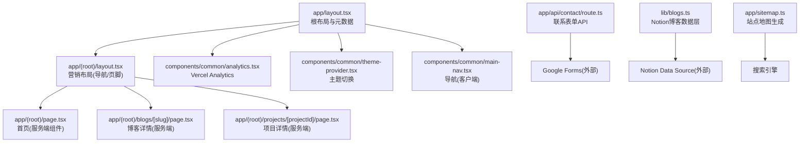
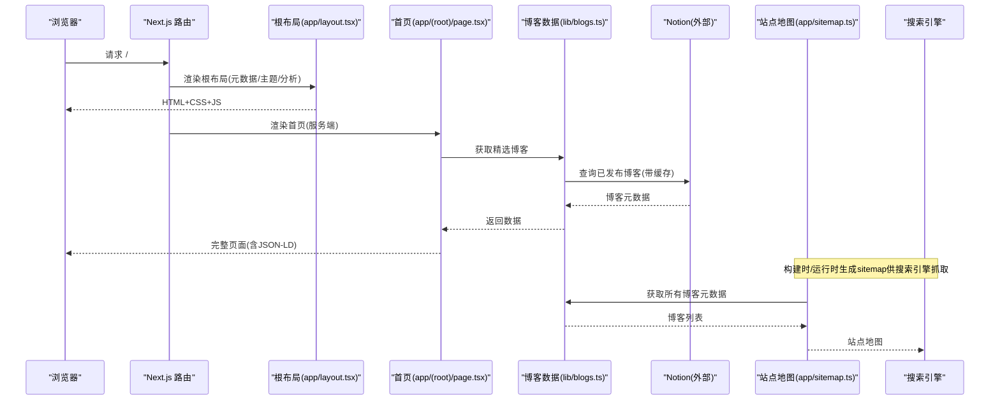
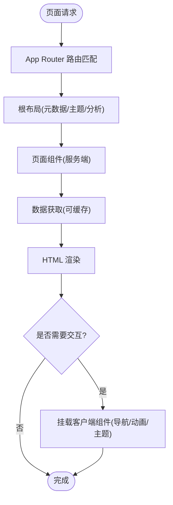
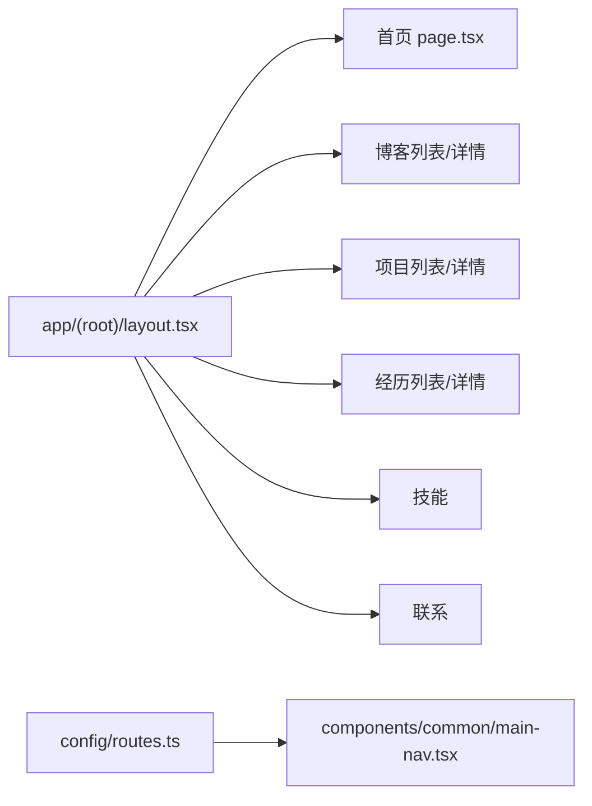
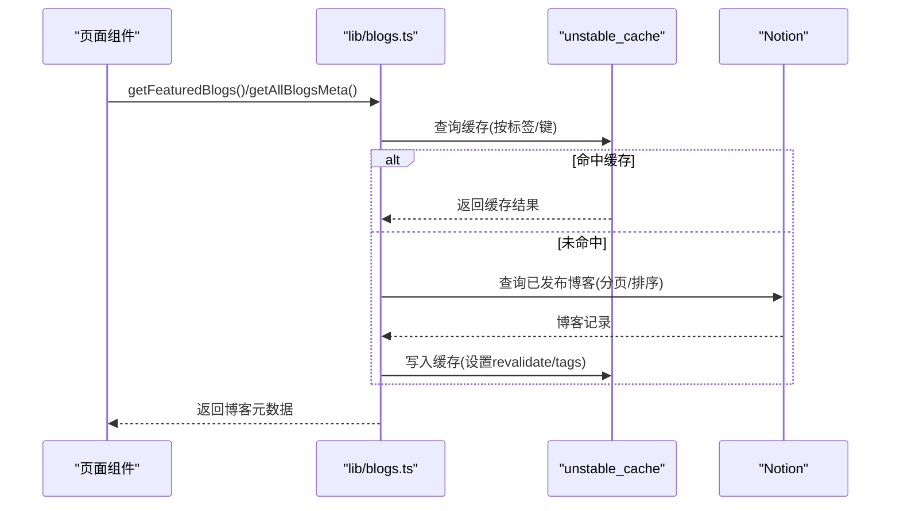
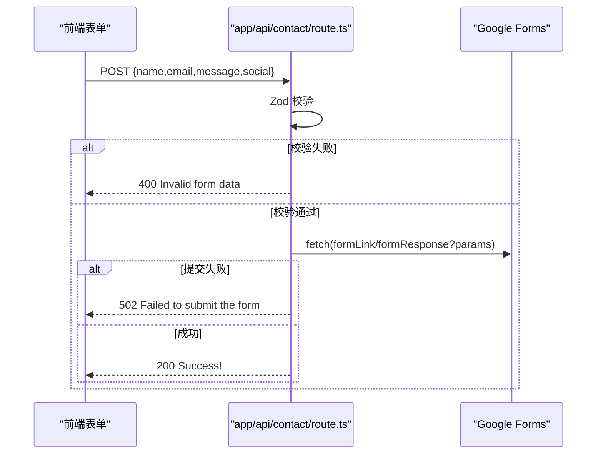
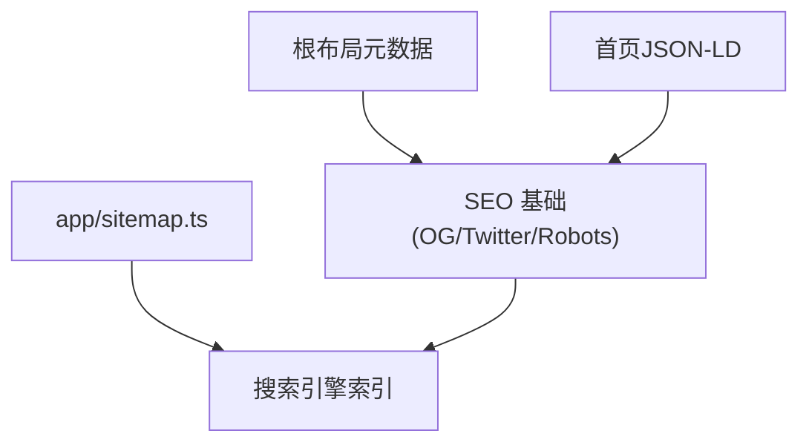
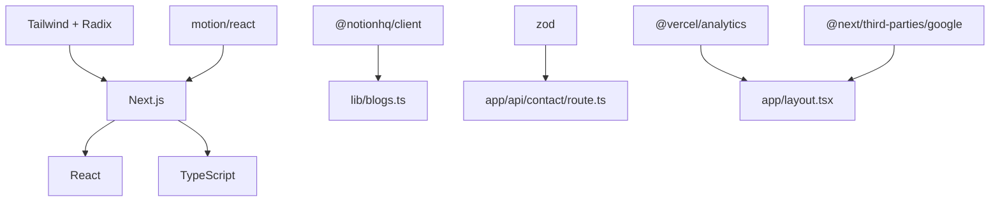

# 整体架构

<cite>
**本文引用的文件**
- [package.json](file://package.json)
- [next.config.js](file://next.config.js)
- [tsconfig.json](file://tsconfig.json)
- [app/layout.tsx](file://app/layout.tsx)
- [app/(root)/layout.tsx](file://app/(root)/layout.tsx)
- [app/(root)/page.tsx](file://app/(root)/page.tsx)
- [app/sitemap.ts](file://app/sitemap.ts)
- [components/common/analytics.tsx](file://components/common/analytics.tsx)
- [components/common/theme-provider.tsx](file://components/common/theme-provider.tsx)
- [components/common/main-nav.tsx](file://components/common/main-nav.tsx)
- [config/site.ts](file://config/site.ts)
- [config/routes.ts](file://config/routes.ts)
- [lib/blogs.ts](file://lib/blogs.ts)
- [app/api/contact/route.ts](file://app/api/contact/route.ts)
</cite>

## 目录
1. [简介](#简介)
2. [项目结构](#项目结构)
3. [核心组件](#核心组件)
4. [架构总览](#架构总览)
5. [详细组件分析](#详细组件分析)
6. [依赖分析](#依赖分析)
7. [性能考虑](#性能考虑)
8. [故障排查指南](#故障排查指南)
9. [结论](#结论)
10. [附录](#附录)

## 简介
本项目是一个基于 Next.js App Router 的个人投资组合网站，采用“服务端组件优先、客户端组件按需使用”的渲染策略。通过 Server Components 实现首屏快速渲染与 SEO 优化，结合客户端组件处理交互与动画；数据层集成 Notion 博客数据源与 Google Analytics、Vercel Analytics 等第三方服务；API 路由提供表单提交能力。部署目标为 Vercel（由包管理与脚本约定推断），并通过 sitemap 与结构化数据提升搜索引擎收录质量。

## 项目结构
- 应用根布局与站点元信息：在 app/layout.tsx 中定义全局元数据、主题提供者、分析与脚本注入。
- 营销页面分组：app/(root) 作为共享布局组，包含首页与各业务页，统一导航与页脚。
- API 路由：app/api 下按功能划分路由，如 contact 表单提交。
- 配置集中化：config 目录管理站点信息、路由、内容等常量。
- 数据与工具：lib 目录封装博客数据获取、工具函数等。
- 组件分层：components 按领域拆分（common、ui、业务模块），UI 组件基于 Radix + Tailwind 构建。
- 静态资源：public 存放图片、图标等静态资源。
- 类型与构建：tsconfig.json 启用严格模式与路径别名；next.config.js 保持最小化配置以便扩展。

图表来源
- [app/layout.tsx:18-127](file://app/layout.tsx#L18-L127)
- [app/(root)/layout.tsx:11-31](file://app/(root)/layout.tsx#L11-L31)
- [app/(root)/page.tsx:36-353](file://app/(root)/page.tsx#L36-L353)
- [components/common/analytics.tsx:1-8](file://components/common/analytics.tsx#L1-L8)
- [components/common/theme-provider.tsx:1-11](file://components/common/theme-provider.tsx#L1-L11)
- [components/common/main-nav.tsx:1-99](file://components/common/main-nav.tsx#L1-L99)
- [app/api/contact/route.ts:1-57](file://app/api/contact/route.ts#L1-L57)
- [lib/blogs.ts:1-550](file://lib/blogs.ts#L1-L550)
- [app/sitemap.ts:1-72](file://app/sitemap.ts#L1-L72)

章节来源
- [app/layout.tsx:18-127](file://app/layout.tsx#L18-L127)
- [app/(root)/layout.tsx:11-31](file://app/(root)/layout.tsx#L11-L31)
- [app/(root)/page.tsx:36-353](file://app/(root)/page.tsx#L36-L353)
- [components/common/analytics.tsx:1-8](file://components/common/analytics.tsx#L1-L8)
- [components/common/theme-provider.tsx:1-11](file://components/common/theme-provider.tsx#L1-L11)
- [components/common/main-nav.tsx:1-99](file://components/common/main-nav.tsx#L1-L99)
- [app/api/contact/route.ts:1-57](file://app/api/contact/route.ts#L1-L57)
- [lib/blogs.ts:1-550](file://lib/blogs.ts#L1-L550)
- [app/sitemap.ts:1-72](file://app/sitemap.ts#L1-L72)

## 核心组件
- 根布局与元数据：集中定义站点标题、描述、Open Graph/Twitter 卡片、图标、robots、验证信息等，并注入 Google Analytics 与第三方聊天小部件脚本。
- 营销布局：提供统一的头部导航、GitHub Star 徽章、主题切换、主内容与页脚区域。
- 首页（服务端）：聚合项目、经历、贡献、技能、博客精选与联系方式区块，注入 JSON-LD 结构化数据以提升 SEO。
- 主题与交互：主题切换由客户端组件提供；导航与移动端菜单使用客户端组件以支持交互与动画。
- 博客数据层：从 Notion Data Source 拉取已发布博客，进行属性校验、分页查询、缓存与内容渲染，暴露列表与详情接口。
- 联系表单 API：接收前端表单数据，校验后转发至 Google Forms，返回统一响应。
- 站点地图：动态生成静态页面与博客详情页的 sitemap，便于搜索引擎抓取。

章节来源
- [app/layout.tsx:18-127](file://app/layout.tsx#L18-L127)
- [app/(root)/layout.tsx:11-31](file://app/(root)/layout.tsx#L11-L31)
- [app/(root)/page.tsx:36-353](file://app/(root)/page.tsx#L36-L353)
- [components/common/theme-provider.tsx:1-11](file://components/common/theme-provider.tsx#L1-L11)
- [components/common/main-nav.tsx:1-99](file://components/common/main-nav.tsx#L1-L99)
- [lib/blogs.ts:1-550](file://lib/blogs.ts#L1-L550)
- [app/api/contact/route.ts:1-57](file://app/api/contact/route.ts#L1-L57)
- [app/sitemap.ts:1-72](file://app/sitemap.ts#L1-L72)

## 架构总览
系统采用 Next.js App Router 的分层架构：
- 表现层：Server Components 负责首屏渲染与 SEO；少量 Client Components 处理交互与动画。
- 路由层：App Router 文件系统路由，(root) 分组共享布局；动态路由用于博客与项目详情。
- 数据层：lib/blogs.ts 封装 Notion 数据访问与缓存；API 路由处理表单提交。
- 集成层：Google Analytics、Vercel Analytics、第三方聊天小部件脚本；sitemap 与 JSON-LD 增强 SEO。
- 部署层：Next.js 构建产物部署至 Vercel（由脚本与生态推断）。

图表来源
- [app/layout.tsx:18-127](file://app/layout.tsx#L18-L127)
- [app/(root)/page.tsx:36-353](file://app/(root)/page.tsx#L36-L353)
- [lib/blogs.ts:1-550](file://lib/blogs.ts#L1-L550)
- [app/sitemap.ts:1-72](file://app/sitemap.ts#L1-L72)

## 详细组件分析

### 渲染策略与组件边界
- 服务端组件优先：首页与详情页均为异步服务端组件，直接读取配置与数据，减少客户端 JS 体积，提升首屏性能与 SEO。
- 客户端组件按需使用：导航、主题切换、动画等交互逻辑集中在标记为客户端的组件中，避免在服务端执行不必要的副作用。
- 布局复用：通过 (root) 分组共享 header/main/footer，降低重复代码。

图表来源
- [app/layout.tsx:18-127](file://app/layout.tsx#L18-L127)
- [app/(root)/page.tsx:36-353](file://app/(root)/page.tsx#L36-L353)
- [components/common/main-nav.tsx:1-99](file://components/common/main-nav.tsx#L1-L99)
- [components/common/theme-provider.tsx:1-11](file://components/common/theme-provider.tsx#L1-L11)

章节来源
- [app/layout.tsx:18-127](file://app/layout.tsx#L18-L127)
- [app/(root)/page.tsx:36-353](file://app/(root)/page.tsx#L36-L353)
- [components/common/main-nav.tsx:1-99](file://components/common/main-nav.tsx#L1-L99)
- [components/common/theme-provider.tsx:1-11](file://components/common/theme-provider.tsx#L1-L11)

### 路由组织与页面分组
- 分组布局：(root) 作为营销类页面的共享布局，统一管理导航与页脚。
- 动态路由：/blogs/[slug]、/experience/[expId]、/projects/[projectId] 等用于详情展示。
- 导航配置：routes.ts 集中维护主导航项，配合 MainNav 组件渲染。

图表来源
- [app/(root)/layout.tsx:11-31](file://app/(root)/layout.tsx#L11-L31)
- [config/routes.ts:1-39](file://config/routes.ts#L1-L39)
- [components/common/main-nav.tsx:1-99](file://components/common/main-nav.tsx#L1-L99)

章节来源
- [app/(root)/layout.tsx:11-31](file://app/(root)/layout.tsx#L11-L31)
- [config/routes.ts:1-39](file://config/routes.ts#L1-L39)
- [components/common/main-nav.tsx:1-99](file://components/common/main-nav.tsx#L1-L99)

### 数据流与缓存策略（博客）
- 数据源：Notion Data Source，通过官方 SDK 查询已发布博客，校验字段类型与值域。
- 缓存：使用 unstable_cache 对列表与单篇内容进行缓存，支持 revalidate 与 tags 刷新。
- 渲染：Markdown 转 HTML 并估算阅读时长，最终在服务端组件中渲染。

图表来源
- [lib/blogs.ts:1-550](file://lib/blogs.ts#L1-L550)

章节来源
- [lib/blogs.ts:1-550](file://lib/blogs.ts#L1-L550)

### API 流程（联系表单）
- 输入校验：使用 Zod 校验表单字段。
- 环境变量：从环境变量读取 Google Form 链接与字段 ID。
- 转发提交：将表单数据拼接为 URLSearchParams 发送至 Google Forms。
- 错误处理：对缺失配置、网络失败与内部异常进行分类返回。

图表来源
- [app/api/contact/route.ts:1-57](file://app/api/contact/route.ts#L1-L57)

章节来源
- [app/api/contact/route.ts:1-57](file://app/api/contact/route.ts#L1-L57)

### 站点地图与 SEO
- 元数据：根布局集中定义 title、description、OG/Twitter 卡片、robots、验证等。
- 结构化数据：首页注入 Person 与 SoftwareApplication 的 JSON-LD。
- 站点地图：动态生成静态页面与博客详情页的 sitemap，标注 lastModified 与优先级。

图表来源
- [app/layout.tsx:18-127](file://app/layout.tsx#L18-L127)
- [app/(root)/page.tsx:36-353](file://app/(root)/page.tsx#L36-L353)
- [app/sitemap.ts:1-72](file://app/sitemap.ts#L1-L72)

章节来源
- [app/layout.tsx:18-127](file://app/layout.tsx#L18-L127)
- [app/(root)/page.tsx:36-353](file://app/(root)/page.tsx#L36-L353)
- [app/sitemap.ts:1-72](file://app/sitemap.ts#L1-L72)

## 依赖分析
- 框架与运行时：Next.js、React、TypeScript。
- UI 与样式：Tailwind CSS、Radix UI 组件、motion 动画库。
- 数据与工具：@notionhq/client、zod、server-only、rehype/remark 系列用于 Markdown 处理。
- 分析与脚本：@vercel/analytics、@next/third-parties/google、第三方聊天小部件脚本。
- 构建与开发：ESLint、Prettier、PostCSS、esbuild。

图表来源
- [package.json:13-49](file://package.json#L13-L49)
- [lib/blogs.ts:1-550](file://lib/blogs.ts#L1-L550)
- [app/api/contact/route.ts:1-57](file://app/api/contact/route.ts#L1-L57)
- [app/layout.tsx:18-127](file://app/layout.tsx#L18-L127)

章节来源
- [package.json:13-49](file://package.json#L13-L49)
- [lib/blogs.ts:1-550](file://lib/blogs.ts#L1-L550)
- [app/api/contact/route.ts:1-57](file://app/api/contact/route.ts#L1-L57)
- [app/layout.tsx:18-127](file://app/layout.tsx#L18-L127)

## 性能考虑
- 首屏优化：
  - 服务端组件渲染首页与详情页，减少客户端 JavaScript 体积。
  - 使用 next/image 与 priority 优化关键图片加载。
  - 结构化数据与元数据提升 SEO 与分享效果。
- 缓存与增量更新：
  - 博客列表与内容使用 unstable_cache 缓存，支持 revalidate 与 tags 刷新。
  - 合理设置 revalidate 时间，平衡新鲜度与性能。
- 交互与动画：
  - 仅在需要交互的组件中使用客户端组件，避免无谓的水合开销。
  - 使用 motion 控制入场动画，注意延迟与性能权衡。
- 构建与打包：
  - TypeScript 严格模式与路径别名提升可维护性。
  - 保持 next.config.js 最小化，按需扩展。

[本节为通用性能建议，不直接分析具体文件]

## 故障排查指南
- 联系表单无法提交：
  - 检查环境变量是否配置完整（Google Form 链接与字段 ID）。
  - 确认 API 返回状态码：400 表示校验失败，502 表示外部服务失败，500 表示内部错误。
- 博客数据为空或报错：
  - 检查 Notion Token 与 Data Source ID 是否同时配置。
  - 确认 Notion 数据源属性类型与必填字段是否符合预期。
  - 查看缓存标签与 revalidate 设置，必要时触发刷新。
- 主题切换无效：
  - 确保 ThemeProvider 包裹了应用树，且客户端组件正确挂载。
- 导航高亮异常：
  - 检查 usePathname/useSelectedLayoutSegment 的使用与路由段匹配。

章节来源
- [app/api/contact/route.ts:1-57](file://app/api/contact/route.ts#L1-L57)
- [lib/blogs.ts:1-550](file://lib/blogs.ts#L1-L550)
- [components/common/theme-provider.tsx:1-11](file://components/common/theme-provider.tsx#L1-L11)
- [components/common/main-nav.tsx:1-99](file://components/common/main-nav.tsx#L1-L99)

## 结论
本项目以 Next.js App Router 为核心，采用“服务端组件优先、客户端组件按需使用”的架构，实现了高性能的首屏渲染与良好的 SEO。通过集中化的配置与组件分层，提升了可维护性与扩展性。数据层对接 Notion，API 层对接 Google Forms，分析层集成 Vercel Analytics 与 Google Analytics，形成完整的端到端解决方案。建议在后续迭代中继续优化缓存策略、监控关键指标，并根据业务需求扩展更多动态页面与集成。

[本节为总结性内容，不直接分析具体文件]

## 附录
- 技术栈概览：Next.js、React、TypeScript、Tailwind CSS、Radix UI、motion、Zod、Notion SDK、Vercel Analytics、Google Analytics。
- 部署建议：使用 pnpm 管理依赖，通过 next build 构建，部署至 Vercel（由脚本与生态推断）。
- 环境变量清单（示例）：
  - NEXT_PUBLIC_GOOGLE_MEASUREMENT_ID：Google Analytics 测量 ID
  - GOOGLE_FORM_LINK：Google Forms 提交链接
  - GOOGLE_FORM_FIELD_ID_*：Google Forms 各字段 ID
  - NOTION_TOKEN、NOTION_DATA_SOURCE_ID：Notion 博客数据源配置

[本节为补充信息，不直接分析具体文件]