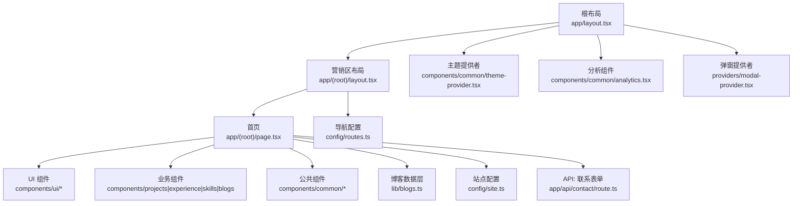
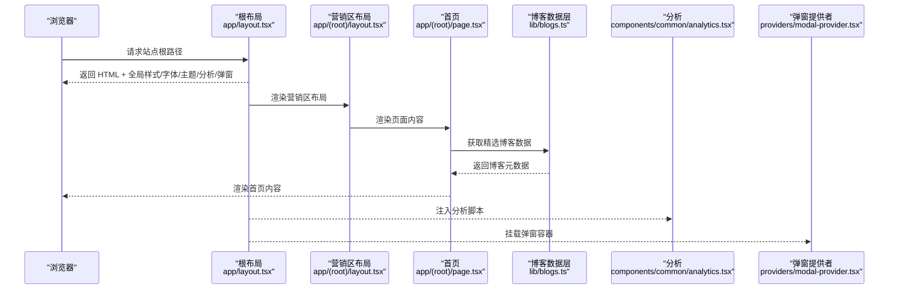
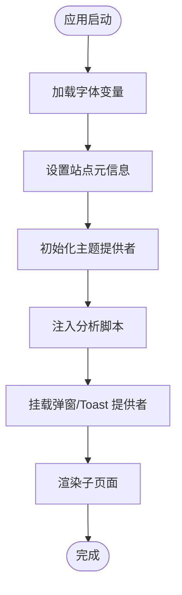
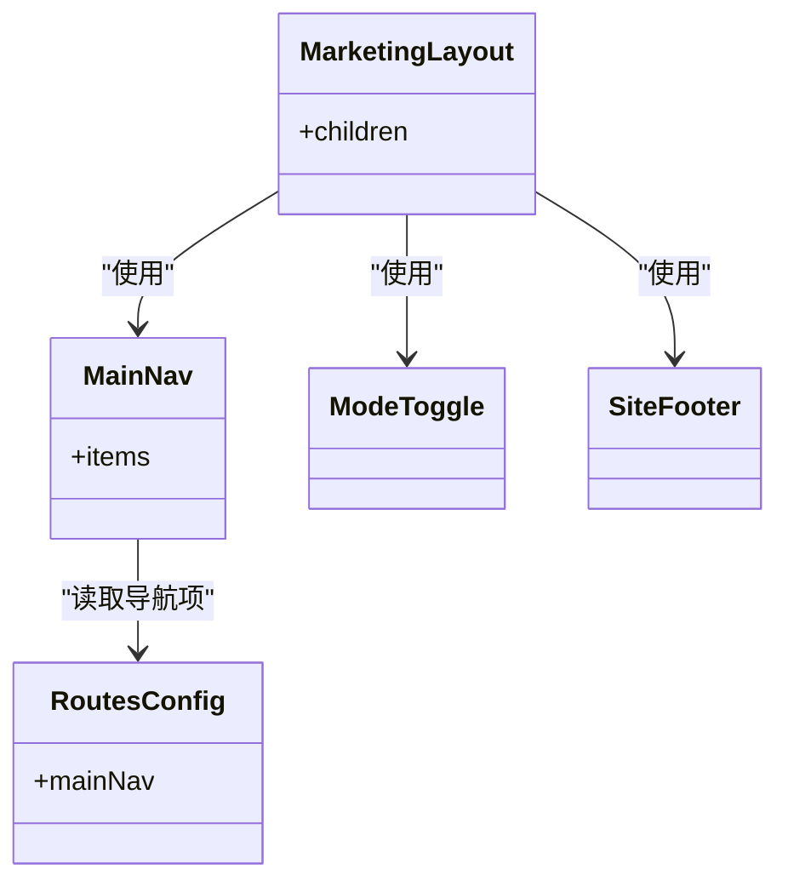
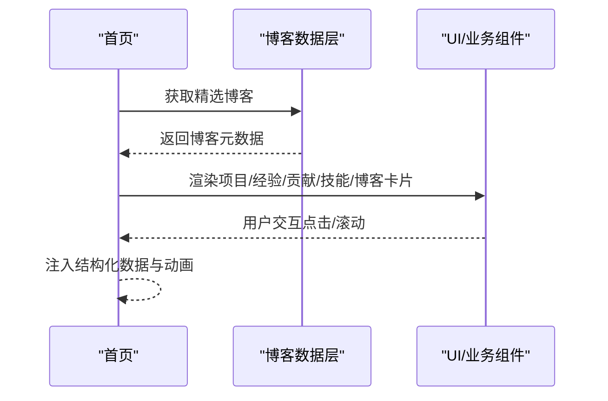
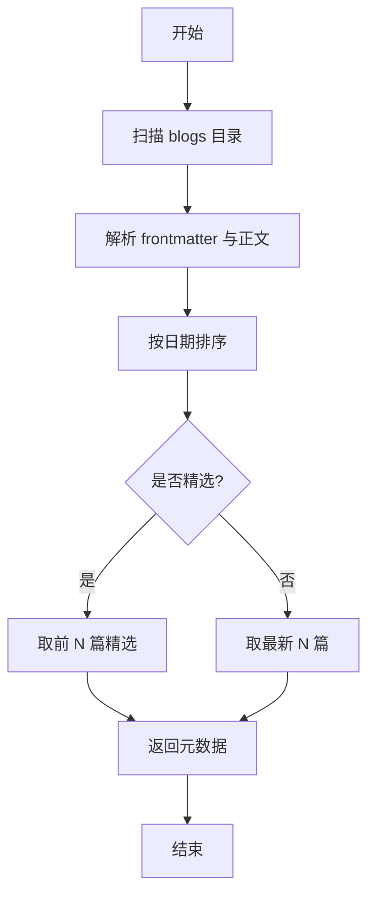
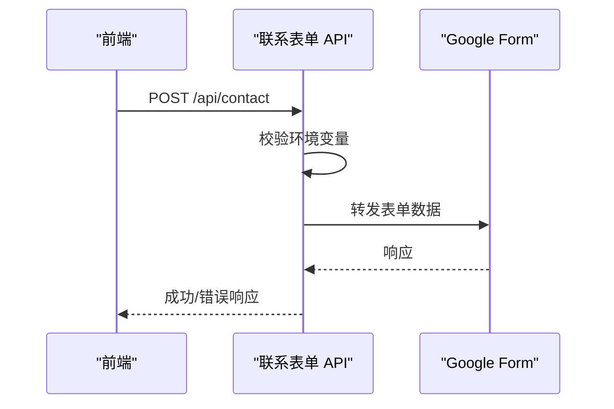
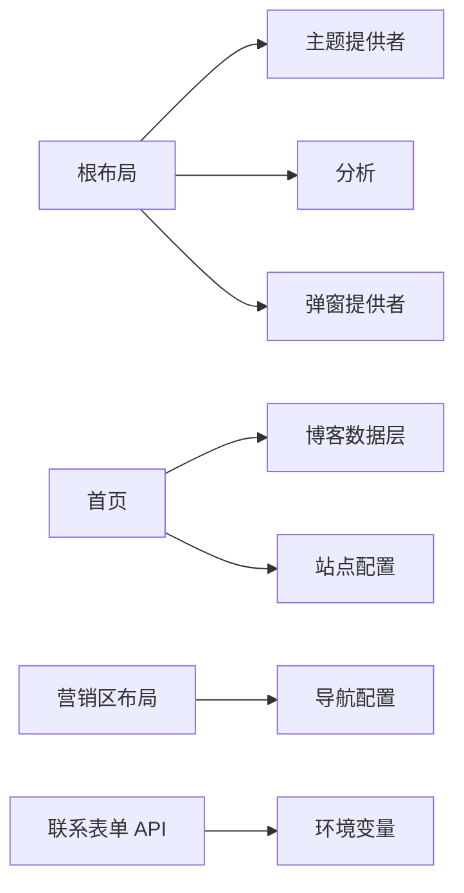

# 整体架构概览

<cite>
**本文引用的文件**
- [app/layout.tsx](file://app/layout.tsx)
- [app/(root)/layout.tsx](file://app/(root)/layout.tsx)
- [app/(root)/page.tsx](file://app/(root)/page.tsx)
- [next.config.js](file://next.config.js)
- [package.json](file://package.json)
- [components/common/theme-provider.tsx](file://components/common/theme-provider.tsx)
- [components/common/analytics.tsx](file://components/common/analytics.tsx)
- [providers/modal-provider.tsx](file://providers/modal-provider.tsx)
- [config/site.ts](file://config/site.ts)
- [lib/blogs.ts](file://lib/blogs.ts)
- [components/common/client-page-wrapper.tsx](file://components/common/client-page-wrapper.tsx)
- [app/api/contact/route.ts](file://app/api/contact/route.ts)
- [config/routes.ts](file://config/routes.ts)
</cite>

## 目录
1. [简介](#简介)
2. [项目结构](#项目结构)
3. [核心组件](#核心组件)
4. [架构总览](#架构总览)
5. [详细组件分析](#详细组件分析)
6. [依赖关系分析](#依赖关系分析)
7. [性能与渲染策略](#性能与渲染策略)
8. [故障排查指南](#故障排查指南)
9. [结论](#结论)
10. [附录](#附录)

## 简介
本项目是一个基于 Next.js App Router 的现代化个人作品集网站。它采用服务器组件（默认）与客户端组件（显式标注 "use client"）分离的策略，结合 Tailwind CSS、Radix UI、Framer Motion 等生态，提供高性能、可访问、易维护的前端体验。根布局负责全局样式、字体加载、主题提供者、分析与弹窗等基础设施；业务页面按功能域组织在 app/(root) 下，并通过 API Routes 提供后端能力（如联系表单）。

## 项目结构
- 路由与布局
  - 应用根布局：定义全局 HTML/Body、站点元信息、主题、分析、弹窗容器等。
  - 营销区布局：包裹头部导航、主内容区域与页脚，统一页面骨架。
  - 首页：聚合展示项目、经验、贡献、技能、博客与联系方式。
- 组件分层
  - UI 层：通用按钮、卡片、对话框等原子组件。
  - 业务组件：项目卡、经验时间线、技能评分等。
  - 公共组件：导航、动画、主题切换、分析、页脚等。
- 数据与配置
  - 站点配置：站点名称、描述、链接、图标等。
  - 路由配置：主导航菜单项。
  - 博客数据：从 Markdown 文件读取并解析为结构化数据。
- API 层
  - 联系表单接口：将前端提交转发到外部 Google Form。
- 构建与工具
  - Next.js 配置：自定义响应头（CORS 等）。
  - 包管理：Next.js、React、Tailwind、Radix、Motion、Zustand 等。

图表来源
- [app/layout.tsx:1-145](file://app/layout.tsx#L1-L145)
- [app/(root)/layout.tsx:1-33](file://app/(root)/layout.tsx#L1-L33)
- [app/(root)/page.tsx:1-357](file://app/(root)/page.tsx#L1-L357)
- [components/common/theme-provider.tsx:1-8](file://components/common/theme-provider.tsx#L1-L8)
- [components/common/analytics.tsx:1-8](file://components/common/analytics.tsx#L1-L8)
- [providers/modal-provider.tsx:1-24](file://providers/modal-provider.tsx#L1-L24)
- [lib/blogs.ts:1-97](file://lib/blogs.ts#L1-L97)
- [config/site.ts:1-41](file://config/site.ts#L1-L41)
- [config/routes.ts:1-29](file://config/routes.ts#L1-L29)
- [app/api/contact/route.ts:1-31](file://app/api/contact/route.ts#L1-L31)

章节来源
- [app/layout.tsx:1-145](file://app/layout.tsx#L1-L145)
- [app/(root)/layout.tsx:1-33](file://app/(root)/layout.tsx#L1-L33)
- [app/(root)/page.tsx:1-357](file://app/(root)/page.tsx#L1-L357)
- [next.config.js:1-25](file://next.config.js#L1-L25)
- [package.json:1-73](file://package.json#L1-L73)

## 核心组件
- 根布局（RootLayout）
  - 职责：注入全局样式、Google Fonts 与本地字体变量、站点元信息（标题、描述、Open Graph、Twitter Card、SEO robots）、第三方分析脚本、主题提供者、Toaster、ModalProvider。
  - 关键点：强制要求 Google Analytics ID，缺失时抛出错误；使用 next/font 优化字体加载；通过 Script 异步加载第三方小部件。
- 营销区布局（MarketingLayout）
  - 职责：提供统一的头部导航、主内容区与页脚；集成 GitHub Star 徽章与主题切换。
  - 关键点：导航项来自 routesConfig，便于集中维护。
- 首页（IndexPage）
  - 职责：聚合展示项目、经验、贡献、技能、博客与联系方式；注入结构化数据（Person、SoftwareApplication）；使用 ClientPageWrapper 包裹以实现页面级入场动画。
  - 关键点：博客数据通过 lib/blogs.ts 获取；图片使用 next/image 优化；各区块使用动画组件提升体验。
- 主题提供者（ThemeProvider）
  - 职责：封装 next-themes，提供多主题支持（light/dark/retro/cyberpunk/paper/aurora/synthwave），以 class 模式切换。
- 分析（Analytics）
  - 职责：集成 Vercel Analytics，用于页面访问统计。
- 弹窗提供者（ModalProvider）
  - 职责：在客户端挂载后渲染 CustomModal，避免 SSR 水合不一致。
- 博客数据层（lib/blogs.ts）
  - 职责：读取 content/blogs/*.md，解析 frontmatter 与正文，生成元数据与 HTML；提供“精选博客”与“阅读时长估算”。
- 站点配置（config/site.ts）
  - 职责：集中站点基本信息、社交链接、OG 图片、关键词等。
- 导航配置（config/routes.ts）
  - 职责：集中定义主导航项，供布局与导航组件复用。
- 联系表单 API（app/api/contact/route.ts）
  - 职责：接收前端 POST，校验环境变量，转发至 Google Form，返回成功或错误响应。

章节来源
- [app/layout.tsx:1-145](file://app/layout.tsx#L1-L145)
- [app/(root)/layout.tsx:1-33](file://app/(root)/layout.tsx#L1-L33)
- [app/(root)/page.tsx:1-357](file://app/(root)/page.tsx#L1-L357)
- [components/common/theme-provider.tsx:1-8](file://components/common/theme-provider.tsx#L1-L8)
- [components/common/analytics.tsx:1-8](file://components/common/analytics.tsx#L1-L8)
- [providers/modal-provider.tsx:1-24](file://providers/modal-provider.tsx#L1-L24)
- [lib/blogs.ts:1-97](file://lib/blogs.ts#L1-L97)
- [config/site.ts:1-41](file://config/site.ts#L1-L41)
- [config/routes.ts:1-29](file://config/routes.ts#L1-L29)
- [app/api/contact/route.ts:1-31](file://app/api/contact/route.ts#L1-L31)

## 架构总览
本项目的架构遵循“布局即壳、页面即组合、数据就近获取”的原则：
- 根布局负责全局基础设施（样式、字体、主题、分析、弹窗）。
- 营销区布局提供页面骨架（导航、主体、页脚）。
- 页面组件组合 UI 与业务组件，按需引入数据。
- 数据层通过文件系统与静态配置提供内容，必要时通过 API Routes 与外部服务交互。
- 客户端能力通过 "use client" 精确启用，最小化客户端代码体积。

图表来源
- [app/layout.tsx:1-145](file://app/layout.tsx#L1-L145)
- [app/(root)/layout.tsx:1-33](file://app/(root)/layout.tsx#L1-L33)
- [app/(root)/page.tsx:1-357](file://app/(root)/page.tsx#L1-L357)
- [lib/blogs.ts:1-97](file://lib/blogs.ts#L1-L97)
- [components/common/analytics.tsx:1-8](file://components/common/analytics.tsx#L1-L8)
- [providers/modal-provider.tsx:1-24](file://providers/modal-provider.tsx#L1-L24)

## 详细组件分析

### 根布局与基础设施初始化
- 字体加载：使用 next/font 加载 Inter，并通过 CSS 变量暴露；同时加载本地字体 CalSans 作为标题字体。
- 站点元信息：集中设置标题模板、描述、作者、Open Graph、Twitter Card、图标、manifest、robots、验证信息等。
- 主题系统：通过 ThemeProvider 提供多主题切换能力，并以 class 模式驱动 Tailwind 主题。
- 分析与监控：注入 Google Analytics 与 Vercel Analytics，确保在客户端启用。
- 弹窗与提示：挂载 ModalProvider 与 Toaster，保证全局弹窗与消息提示可用。
- 安全与健壮性：若缺少 Google Analytics ID，直接抛出错误，防止静默失败。

图表来源
- [app/layout.tsx:1-145](file://app/layout.tsx#L1-L145)
- [components/common/theme-provider.tsx:1-8](file://components/common/theme-provider.tsx#L1-L8)
- [components/common/analytics.tsx:1-8](file://components/common/analytics.tsx#L1-L8)
- [providers/modal-provider.tsx:1-24](file://providers/modal-provider.tsx#L1-L24)

章节来源
- [app/layout.tsx:1-145](file://app/layout.tsx#L1-L145)

### 营销区布局与导航
- 布局结构：顶部固定高度 header，包含 MainNav、GitHub Star 徽章、ModeToggle；中间 main 承载页面内容；底部 SiteFooter。
- 导航数据：MainNav 的 items 来源于 routesConfig，便于统一管理。
- 主题切换：ModeToggle 与 ThemeProvider 配合，实现亮/暗及其他主题切换。

图表来源
- [app/(root)/layout.tsx:1-33](file://app/(root)/layout.tsx#L1-L33)
- [config/routes.ts:1-29](file://config/routes.ts#L1-L29)

章节来源
- [app/(root)/layout.tsx:1-33](file://app/(root)/layout.tsx#L1-L33)
- [config/routes.ts:1-29](file://config/routes.ts#L1-L29)

### 首页与数据流
- 页面结构：首屏个人信息与行动号召；随后依次展示项目、经验、贡献、技能、博客与联系方式。
- 数据获取：博客数据通过 getFeaturedBlogs 从 Markdown 文件解析得到；其他数据来自 config 模块。
- 客户端增强：使用 ClientPageWrapper 包裹页面，实现页面级淡入动画。
- SEO 增强：注入 Person 与 SoftwareApplication 结构化数据，提升搜索引擎理解。

图表来源
- [app/(root)/page.tsx:1-357](file://app/(root)/page.tsx#L1-L357)
- [lib/blogs.ts:1-97](file://lib/blogs.ts#L1-L97)
- [components/common/client-page-wrapper.tsx:1-37](file://components/common/client-page-wrapper.tsx#L1-L37)

章节来源
- [app/(root)/page.tsx:1-357](file://app/(root)/page.tsx#L1-L357)
- [lib/blogs.ts:1-97](file://lib/blogs.ts#L1-L97)
- [components/common/client-page-wrapper.tsx:1-37](file://components/common/client-page-wrapper.tsx#L1-L37)

### 博客数据层（Markdown -> 结构化数据）
- 流程：扫描 content/blogs/*.md，解析 frontmatter 与正文，生成 BlogMeta/Post；支持按日期排序与精选过滤；提供阅读时长估算。
- 复杂度：遍历 N 篇博客，每篇进行 MD 解析，时间复杂度 O(N)，空间复杂度取决于内容大小。
- 优化点：可在生产构建期缓存解析结果；对大文档考虑分块处理。

图表来源
- [lib/blogs.ts:1-97](file://lib/blogs.ts#L1-L97)

章节来源
- [lib/blogs.ts:1-97](file://lib/blogs.ts#L1-L97)

### 联系表单 API
- 流程：接收 JSON 表单数据，校验必要环境变量，构造查询参数并转发到 Google Form，返回成功或错误。
- 错误处理：缺少环境变量或网络异常时返回 500。
- 扩展建议：增加输入校验（如 Zod）、重试机制、限流与日志记录。

图表来源
- [app/api/contact/route.ts:1-31](file://app/api/contact/route.ts#L1-L31)

章节来源
- [app/api/contact/route.ts:1-31](file://app/api/contact/route.ts#L1-L31)

## 依赖关系分析
- 运行时依赖
  - Next.js、React、Tailwind、Radix UI、Motion、Zustand、gray-matter、remark 系列、@vercel/analytics、next-themes 等。
- 关键耦合
  - 根布局依赖 theme-provider、analytics、modal-provider。
  - 首页依赖博客数据层与站点配置。
  - 营销区布局依赖导航配置。
- 潜在风险
  - 根布局对 Google Analytics ID 强依赖，缺失会抛错。
  - 博客数据层依赖文件系统，需确保 content/blogs 存在且格式正确。

图表来源
- [app/layout.tsx:1-145](file://app/layout.tsx#L1-L145)
- [app/(root)/page.tsx:1-357](file://app/(root)/page.tsx#L1-L357)
- [lib/blogs.ts:1-97](file://lib/blogs.ts#L1-L97)
- [config/site.ts:1-41](file://config/site.ts#L1-L41)
- [app/(root)/layout.tsx:1-33](file://app/(root)/layout.tsx#L1-L33)
- [config/routes.ts:1-29](file://config/routes.ts#L1-L29)
- [app/api/contact/route.ts:1-31](file://app/api/contact/route.ts#L1-L31)

章节来源
- [package.json:1-73](file://package.json#L1-L73)
- [next.config.js:1-25](file://next.config.js#L1-L25)

## 性能与渲染策略
- 服务器组件优先
  - 默认使用服务器组件减少客户端 JS 体积，提升首屏性能。
  - 仅在需要交互或浏览器 API 时使用 "use client"（如动画、主题切换、弹窗）。
- 字体与资源优化
  - 使用 next/font 自动优化字体加载，减少 FOIT/FOUT。
  - 图片使用 next/image 与 sizes 属性，按需加载与自适应尺寸。
- 构建期与运行期
  - 博客数据在构建期或请求时读取，适合 ISR/SSG 场景；对于频繁更新的内容可考虑增量再生成。
  - 通过 next.config.js 添加必要的响应头（如 CORS），保障跨域需求。
- 分析与脚本
  - 使用 next/script 的 afterInteractive 策略加载第三方脚本，避免阻塞首屏。
  - 分析脚本在根布局中注入，确保全站覆盖。

[本节为通用指导，不直接分析具体文件]

## 故障排查指南
- 根布局缺少 Google Analytics ID
  - 现象：启动或构建时报错提示缺少 GA ID。
  - 处理：在环境变量中配置 NEXT_PUBLIC_GOOGLE_MEASUREMENT_ID。
- 博客目录不存在或格式错误
  - 现象：博客列表为空或解析失败。
  - 处理：确保 content/blogs 目录下存在 .md 文件，且 frontmatter 字段完整。
- 联系表单无法提交
  - 现象：提交后返回错误或无响应。
  - 处理：检查 GOOGLE_FORM_LINK 及相关字段 ID 环境变量是否正确；确认网络可达。
- 主题切换无效
  - 现象：切换主题后样式未生效。
  - 处理：确认 ThemeProvider 已包裹应用，且 Tailwind 配置正确识别 class 模式。

章节来源
- [app/layout.tsx:1-145](file://app/layout.tsx#L1-L145)
- [lib/blogs.ts:1-97](file://lib/blogs.ts#L1-L97)
- [app/api/contact/route.ts:1-31](file://app/api/contact/route.ts#L1-L31)
- [components/common/theme-provider.tsx:1-8](file://components/common/theme-provider.tsx#L1-L8)

## 结论
该项目以 Next.js App Router 为核心，采用清晰的布局与组件分层，结合服务器组件优先、精确客户端边界、集中配置与数据层抽象，实现了高性能、可维护的个人作品集方案。根布局统一了基础设施，营销区布局提供了稳定的页面骨架，首页通过组合 UI 与业务组件呈现内容，博客数据层与 API 层支撑内容与交互。整体架构易于扩展，适合持续迭代与团队协作。

## 附录
- 开发命令
  - 开发：npm run dev
  - 构建：npm run build
  - 启动：npm run start
  - 代码检查：npm run lint
- 关键依赖版本
  - Next.js 16.x、React 19.x、Tailwind 4.x、Radix UI、Motion、Zustand 等。

章节来源
- [package.json:1-73](file://package.json#L1-L73)