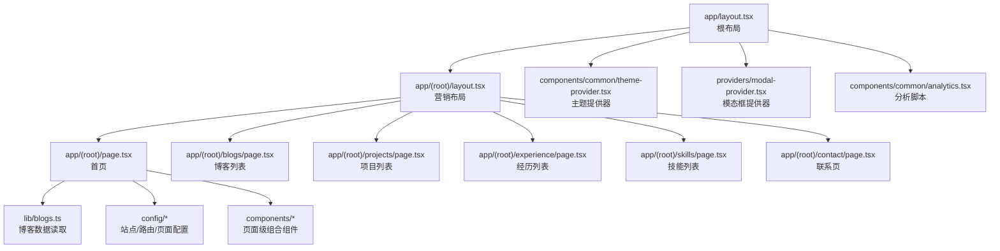
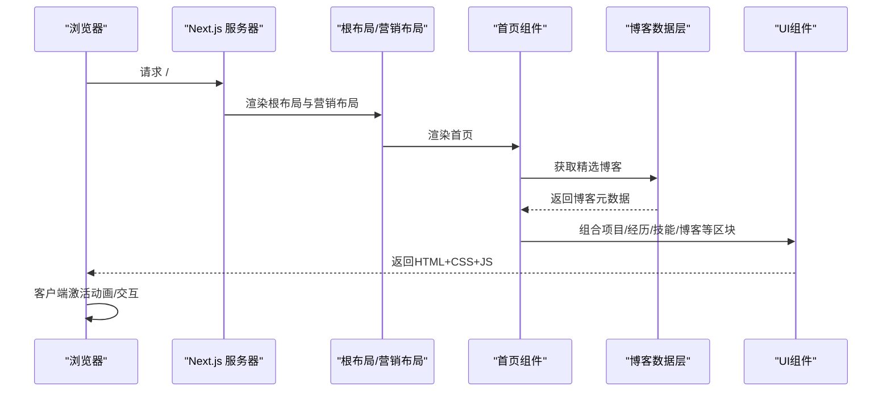
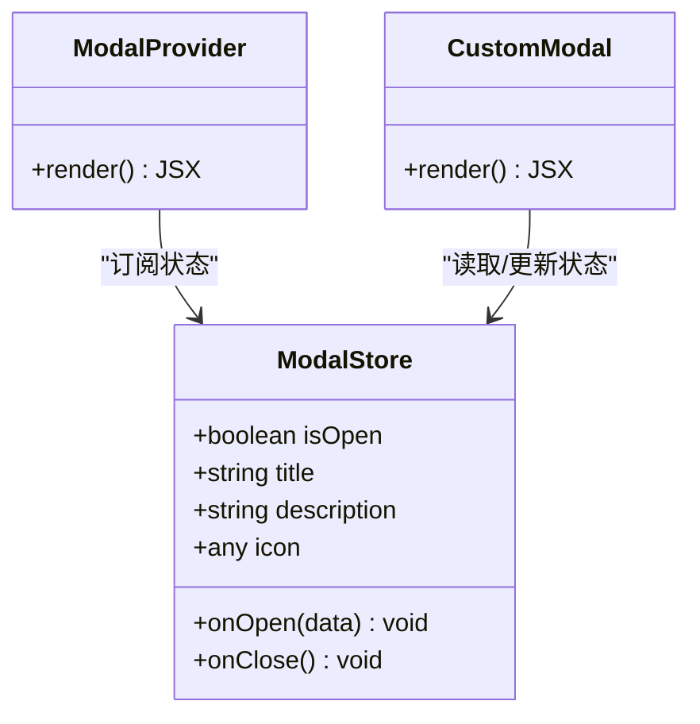
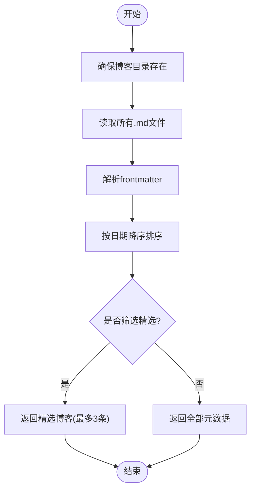
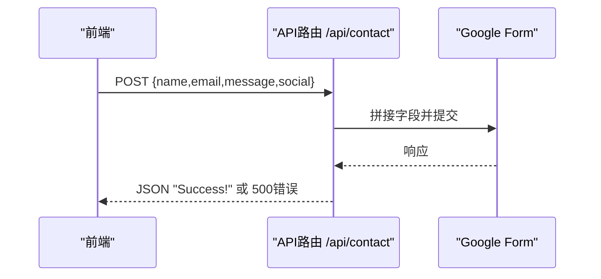
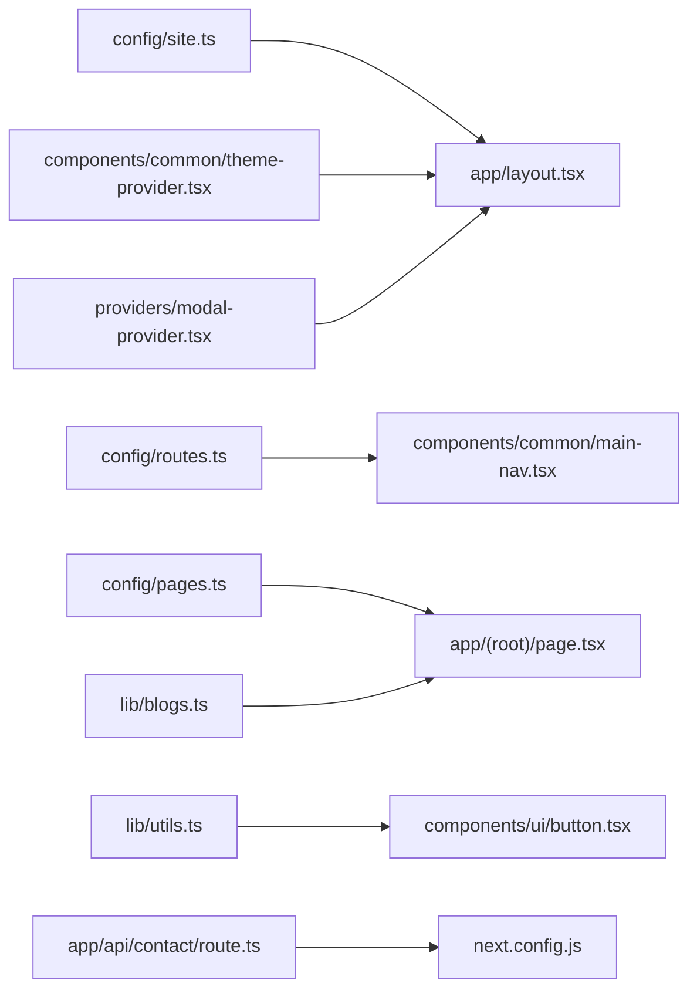

# 架构设计

<cite>
**本文引用的文件**
- [package.json](file://package.json)
- [next.config.js](file://next.config.js)
- [app/layout.tsx](file://app/layout.tsx)
- [app/(root)/layout.tsx](file://app/(root)/layout.tsx)
- [app/(root)/page.tsx](file://app/(root)/page.tsx)
- [config/site.ts](file://config/site.ts)
- [config/routes.ts](file://config/routes.ts)
- [config/pages.ts](file://config/pages.ts)
- [components/common/theme-provider.tsx](file://components/common/theme-provider.tsx)
- [components/common/main-nav.tsx](file://components/common/main-nav.tsx)
- [components/common/client-page-wrapper.tsx](file://components/common/client-page-wrapper.tsx)
- [providers/modal-provider.tsx](file://providers/modal-provider.tsx)
- [hooks/use-modal-store.ts](file://hooks/use-modal-store.ts)
- [lib/blogs.ts](file://lib/blogs.ts)
- [app/api/contact/route.ts](file://app/api/contact/route.ts)
- [lib/utils.ts](file://lib/utils.ts)
</cite>

## 目录
1. [简介](#简介)
2. [项目结构](#项目结构)
3. [核心组件](#核心组件)
4. [架构总览](#架构总览)
5. [详细组件分析](#详细组件分析)
6. [依赖关系分析](#依赖关系分析)
7. [性能考量](#性能考量)
8. [故障排查指南](#故障排查指南)
9. [结论](#结论)
10. [附录](#附录)

## 简介
本架构设计文档面向Next.js投资组合项目，围绕App Router、组件化架构、服务端渲染策略、主题系统、状态管理、路由与数据流进行系统化说明。文档通过架构图表与代码级映射，帮助开发者快速理解从静态配置到页面渲染的完整流程，以及各模块的职责边界与协作方式。

## 项目结构
本项目采用Next.js App Router组织路由与布局：
- app/：应用根目录，包含全局布局、分组路由（(root)）、API路由、站点元信息（manifest、sitemap）。
- components/：按功能域划分的可复用UI与业务组件，common为通用组件，ui为基础原子组件。
- config/：集中化的站点配置、路由配置、页面文案与内容常量。
- lib/：工具函数与数据读取逻辑（如博客Markdown解析）。
- providers/：客户端上下文提供者（主题、模态框等）。
- hooks/：自定义Hook（如模态框状态存储）。
- content/：静态内容（Markdown博客）。
- public/：静态资源（图片、字体、机器人协议等）。

图表来源
- [app/layout.tsx:1-145](file://app/layout.tsx#L1-L145)
- [app/(root)/layout.tsx:1-33](file://app/(root)/layout.tsx#L1-L33)
- [app/(root)/page.tsx:1-357](file://app/(root)/page.tsx#L1-L357)
- [components/common/theme-provider.tsx:1-8](file://components/common/theme-provider.tsx#L1-L8)
- [providers/modal-provider.tsx:1-24](file://providers/modal-provider.tsx#L1-L24)
- [lib/blogs.ts:1-97](file://lib/blogs.ts#L1-L97)
- [config/site.ts:1-41](file://config/site.ts#L1-L41)
- [config/routes.ts:1-29](file://config/routes.ts#L1-L29)
- [config/pages.ts:1-86](file://config/pages.ts#L1-L86)

章节来源
- [app/layout.tsx:1-145](file://app/layout.tsx#L1-L145)
- [app/(root)/layout.tsx:1-33](file://app/(root)/layout.tsx#L1-L33)
- [app/(root)/page.tsx:1-357](file://app/(root)/page.tsx#L1-L357)
- [config/site.ts:1-41](file://config/site.ts#L1-L41)
- [config/routes.ts:1-29](file://config/routes.ts#L1-L29)
- [config/pages.ts:1-86](file://config/pages.ts#L1-L86)
- [lib/blogs.ts:1-97](file://lib/blogs.ts#L1-L97)

## 核心组件
- 根布局与SEO：在根布局中注入全局样式、字体、站点元数据（标题模板、描述、OpenGraph、Twitter卡片、图标、robots、验证），并挂载主题提供器、分析脚本、Toaster与模态框提供器。
- 营销布局：统一头部导航、模式切换、GitHub星标徽章与页脚，包裹主内容区域。
- 首页聚合：以服务端组件形式组装项目、经历、贡献、技能、博客、联系等区块，使用动画组件与客户端包装器提升体验。
- 主题系统：基于next-themes封装提供器，支持多主题与系统主题跟随。
- 模态框系统：基于Zustand的状态管理与Provider，避免SSR水合问题。
- 博客数据层：读取content/blogs下的Markdown，解析frontmatter与正文HTML，提供列表与精选能力。
- API路由：联系表单POST至Google Form，返回统一响应；通过next.config设置CORS头。

章节来源
- [app/layout.tsx:30-145](file://app/layout.tsx#L30-L145)
- [app/(root)/layout.tsx:1-33](file://app/(root)/layout.tsx#L1-L33)
- [app/(root)/page.tsx:28-357](file://app/(root)/page.tsx#L28-L357)
- [components/common/theme-provider.tsx:1-8](file://components/common/theme-provider.tsx#L1-L8)
- [providers/modal-provider.tsx:1-24](file://providers/modal-provider.tsx#L1-L24)
- [lib/blogs.ts:1-97](file://lib/blogs.ts#L1-L97)
- [app/api/contact/route.ts:1-31](file://app/api/contact/route.ts#L1-L31)
- [next.config.js:1-25](file://next.config.js#L1-L25)

## 架构总览
整体采用“服务端优先”的渲染策略：
- 根布局负责全局基础设施（字体、SEO、主题、分析、模态框）。
- 路由组( root )提供统一的营销布局（导航、页脚）。
- 页面组件在服务端读取静态配置与内容（如博客Markdown），生成HTML后下发，客户端再挂载交互逻辑（动画、表单、模态框）。
- 数据流自下而上：配置与内容 -> 数据层 -> 页面组件 -> UI组件 -> 浏览器渲染。

图表来源
- [app/layout.tsx:99-145](file://app/layout.tsx#L99-L145)
- [app/(root)/layout.tsx:11-33](file://app/(root)/layout.tsx#L11-L33)
- [app/(root)/page.tsx:37-357](file://app/(root)/page.tsx#L37-L357)
- [lib/blogs.ts:84-89](file://lib/blogs.ts#L84-L89)

## 详细组件分析

### 根布局与SEO
- 职责：定义全局HTML结构、注入字体变量、站点元数据（标题模板、描述、关键词、作者、OG/Twitter、图标、canonical、robots、验证）、第三方脚本与分析、主题与模态框提供器。
- 关键点：
  - 使用siteConfig作为元数据源，保证一致性。
  - 强制要求Google Analytics ID，缺失时抛出错误，确保可观测性。
  - 通过ThemeProvider启用多主题与系统主题跟随。
  - 使用Script加载外部小部件，afterInteractive策略减少首屏阻塞。

章节来源
- [app/layout.tsx:30-145](file://app/layout.tsx#L30-L145)
- [config/site.ts:1-41](file://config/site.ts#L1-L41)

### 营销布局（(root)）
- 职责：统一头部导航、模式切换、GitHub星标徽章与页脚，承载页面内容。
- 关键点：
  - 导航项来源于routesConfig.mainNav，便于集中维护。
  - 移动端与桌面端分别展示导航入口。
  - 使用Container容器保持内容宽度一致。

章节来源
- [app/(root)/layout.tsx:1-33](file://app/(root)/layout.tsx#L1-L33)
- [config/routes.ts:1-29](file://config/routes.ts#L1-L29)

### 首页（聚合页）
- 职责：聚合项目、经历、贡献、技能、博客、联系等区块，提供结构化数据（JSON-LD）以提升SEO。
- 关键点：
  - 使用ClientPageWrapper包裹以实现页面级入场动画。
  - 通过pagesConfig统一管理页面标题与描述。
  - 调用getFeaturedBlogs获取精选博客，结合ProjectCard、ExperienceCard等展示。
  - 使用AnimatedSection/AnimatedText增强滚动与文本动画。

章节来源
- [app/(root)/page.tsx:28-357](file://app/(root)/page.tsx#L28-L357)
- [config/pages.ts:1-86](file://config/pages.ts#L1-L86)
- [components/common/client-page-wrapper.tsx:1-37](file://components/common/client-page-wrapper.tsx#L1-L37)
- [lib/blogs.ts:84-89](file://lib/blogs.ts#L84-L89)

### 主题系统
- 职责：提供跨页面的主题切换能力，支持系统主题与多预设主题。
- 关键点：
  - 基于next-themes封装，属性attribute="class"以便Tailwind类名驱动主题。
  - 在根布局中挂载，确保所有子树共享主题状态。

章节来源
- [components/common/theme-provider.tsx:1-8](file://components/common/theme-provider.tsx#L1-L8)
- [app/layout.tsx:115-128](file://app/layout.tsx#L115-L128)

### 模态框系统与状态管理
- 职责：提供全局模态框能力，管理打开/关闭与内容。
- 关键点：
  - 使用Zustand创建useModalStore，暴露isOpen、title、description、icon及onOpen/onClose。
  - ModalProvider在根布局挂载，避免SSR水合差异。
  - 组件通过store触发打开并传入数据。

图表来源
- [hooks/use-modal-store.ts:1-36](file://hooks/use-modal-store.ts#L1-L36)
- [providers/modal-provider.tsx:1-24](file://providers/modal-provider.tsx#L1-L24)

章节来源
- [hooks/use-modal-store.ts:1-36](file://hooks/use-modal-store.ts#L1-L36)
- [providers/modal-provider.tsx:1-24](file://providers/modal-provider.tsx#L1-L24)

### 博客数据层
- 职责：读取content/blogs下的Markdown，解析frontmatter与正文HTML，提供列表、详情与精选能力。
- 关键点：
  - 使用gray-matter解析frontmatter，remark系列将Markdown转为HTML。
  - getAllBlogsMeta按日期倒序排序，getFeaturedBlogs优先返回标记featured的文章，否则取最新3篇。
  - ensureBlogsDir保证目录存在，提升健壮性。

图表来源
- [lib/blogs.ts:29-89](file://lib/blogs.ts#L29-L89)

章节来源
- [lib/blogs.ts:1-97](file://lib/blogs.ts#L1-L97)

### 导航与路由
- 职责：提供顶部导航与移动端菜单，高亮当前段落的导航项。
- 关键点：
  - 使用useSelectedLayoutSegment与usePathname判断当前路由段，动态设置高亮样式。
  - 导航项来自routesConfig.mainNav，便于集中维护。
  - 移动端菜单通过状态控制显示/隐藏。

章节来源
- [components/common/main-nav.tsx:1-105](file://components/common/main-nav.tsx#L1-L105)
- [config/routes.ts:1-29](file://config/routes.ts#L1-L29)

### 联系表单API
- 职责：接收前端提交的联系信息，转发至Google Form，返回统一响应。
- 关键点：
  - 通过环境变量配置Google Form链接与各字段ID。
  - next.config中为相关路径设置CORS头，允许跨域提交。
  - 异常处理返回500状态码，便于前端提示。

图表来源
- [app/api/contact/route.ts:1-31](file://app/api/contact/route.ts#L1-L31)
- [next.config.js:1-25](file://next.config.js#L1-L25)

章节来源
- [app/api/contact/route.ts:1-31](file://app/api/contact/route.ts#L1-L31)
- [next.config.js:1-25](file://next.config.js#L1-L25)

### 基础UI与工具
- 按钮组件：基于class-variance-authority定义变体与尺寸，配合Radix Slot实现asChild能力。
- 工具函数：cn合并类名（clsx + tailwind-merge），格式化日期等。

章节来源
- [components/ui/button.tsx:1-57](file://components/ui/button.tsx#L1-L57)
- [lib/utils.ts:1-25](file://lib/utils.ts#L1-L25)

## 依赖关系分析
- 运行时依赖：Next.js、React、Tailwind CSS、motion、next-themes、zod/react-hook-form、gray-matter/remark系列、@vercel/analytics等。
- 构建与开发：ESLint、Prettier、TypeScript、PostCSS等。
- 关键耦合点：
  - 根布局依赖siteConfig与第三方脚本。
  - 首页依赖pagesConfig、lib/blogs与多个业务组件。
  - 导航依赖routesConfig与Next导航API。
  - 博客数据层依赖文件系统与Markdown处理库。

图表来源
- [config/site.ts:1-41](file://config/site.ts#L1-L41)
- [config/routes.ts:1-29](file://config/routes.ts#L1-L29)
- [config/pages.ts:1-86](file://config/pages.ts#L1-L86)
- [lib/blogs.ts:1-97](file://lib/blogs.ts#L1-L97)
- [lib/utils.ts:1-25](file://lib/utils.ts#L1-L25)
- [components/common/theme-provider.tsx:1-8](file://components/common/theme-provider.tsx#L1-L8)
- [providers/modal-provider.tsx:1-24](file://providers/modal-provider.tsx#L1-L24)
- [app/api/contact/route.ts:1-31](file://app/api/contact/route.ts#L1-L31)
- [next.config.js:1-25](file://next.config.js#L1-L25)

章节来源
- [package.json:1-73](file://package.json#L1-L73)

## 性能考量
- 首屏优化：
  - 根布局按需加载字体与脚本，使用afterInteractive策略降低阻塞。
  - 首页使用服务端渲染，减少客户端计算；动画由客户端轻量激活。
- 资源加载：
  - 图片使用Next Image并设置priority与sizes，优化关键图像加载。
  - 静态资源与媒体文件存放于public，便于CDN缓存。
- 构建产物：
  - 使用Tailwind与class-variance-authority减少重复样式。
  - 合理拆分组件与数据层，避免不必要的客户端依赖。
- 可观测性：
  - Google Analytics集成，便于监控访问与转化。
  - 环境变量校验（如GA_ID）防止部署失败。

[本节为通用指导，不直接分析具体文件]

## 故障排查指南
- 缺少Google Analytics ID：根布局会抛出错误，检查环境变量NEXT_PUBLIC_GOOGLE_MEASUREMENT_ID是否正确配置。
- 联系表单失败：确认GOOGLE_FORM_LINK及各字段ID环境变量已正确设置；检查next.config中CORS头是否覆盖目标路径。
- 博客内容未显示：确认content/blogs目录下存在.md文件，且frontmatter字段完整；查看lib/blogs.ts中的ensureBlogsDir与解析逻辑。
- 主题切换无效：确认根布局已挂载ThemeProvider且attribute="class"；检查Tailwind主题变量是否生效。
- 导航高亮异常：检查useSelectedLayoutSegment返回值与routesConfig.href是否匹配。

章节来源
- [app/layout.tsx:100-103](file://app/layout.tsx#L100-L103)
- [app/api/contact/route.ts:3-29](file://app/api/contact/route.ts#L3-L29)
- [lib/blogs.ts:29-89](file://lib/blogs.ts#L29-L89)
- [components/common/theme-provider.tsx:5-6](file://components/common/theme-provider.tsx#L5-L6)
- [components/common/main-nav.tsx:41-86](file://components/common/main-nav.tsx#L41-L86)

## 结论
本项目以Next.js App Router为核心，采用“服务端优先、客户端增强”的渲染策略，通过集中式配置与模块化组件实现良好的可维护性与扩展性。主题系统、模态框状态管理、博客数据层与API路由各司其职，形成清晰的数据流与职责边界。建议在后续迭代中继续强化类型约束、错误边界与性能监控，进一步提升用户体验与可观测性。

[本节为总结性内容，不直接分析具体文件]

## 附录
- 环境变量清单（建议）：
  - NEXT_PUBLIC_GOOGLE_MEASUREMENT_ID：Google Analytics标识
  - GOOGLE_FORM_LINK：Google Form提交地址
  - GOOGLE_FORM_FIELD_ID_NAME/EMAIL/MESSAGE/SOCIAL：对应字段ID
  - NEXT_PUBLIC_GOOGLE_VERIFICATION：Google站点验证
- 推荐实践：
  - 新增页面时在config/pages.ts补充元数据，保持一致的标题与描述。
  - 新增导航项时在config/routes.ts维护，避免硬编码。
  - 新增博客时在content/blogs添加.md，并在frontmatter中标记featured以进入精选区。

[本节为附加信息，不直接分析具体文件]