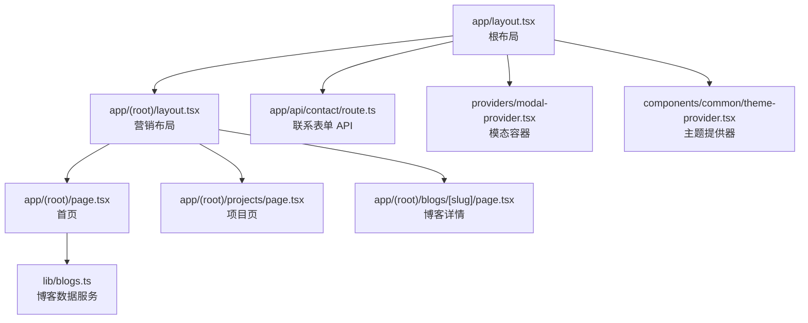
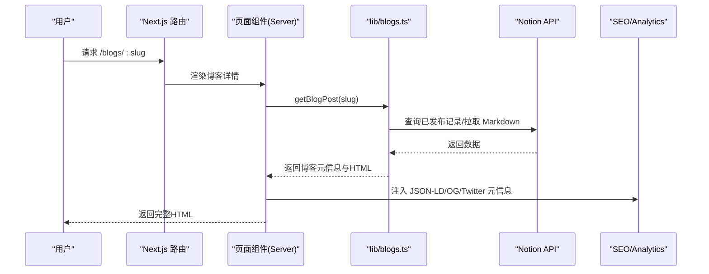
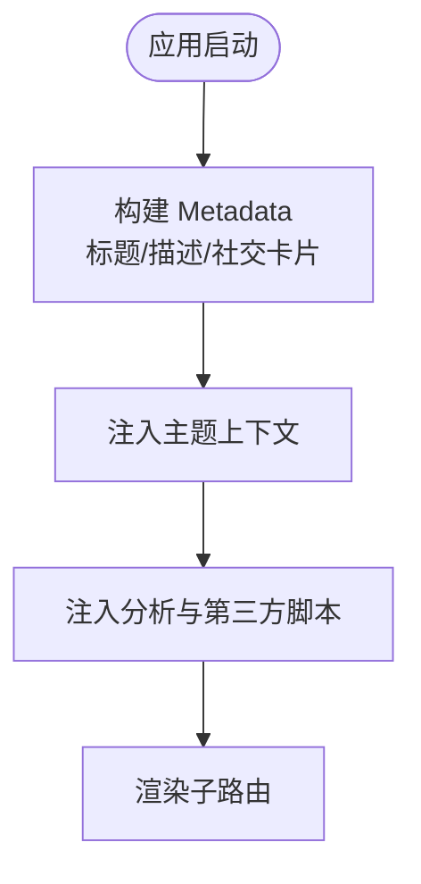
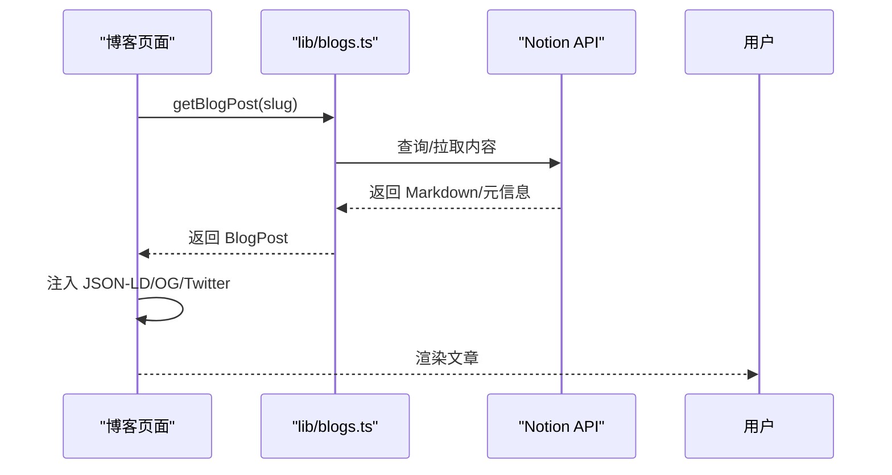
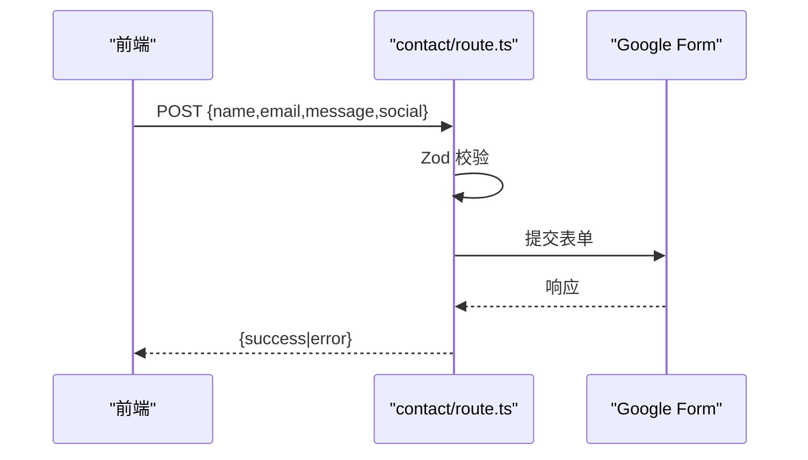
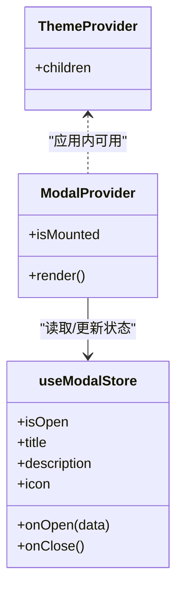
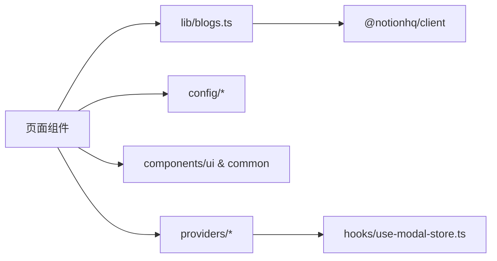

# 架构设计

<cite>
**本文引用的文件**
- [app/layout.tsx](file://app/layout.tsx)
- [app/(root)/layout.tsx](file://app/(root)/layout.tsx)
- [app/(root)/page.tsx](file://app/(root)/page.tsx)
- [app/(root)/projects/page.tsx](file://app/(root)/projects/page.tsx)
- [app/(root)/blogs/[slug]/page.tsx](file://app/(root)/blogs/[slug]/page.tsx)
- [app/api/contact/route.ts](file://app/api/contact/route.ts)
- [components/common/theme-provider.tsx](file://components/common/theme-provider.tsx)
- [providers/modal-provider.tsx](file://providers/modal-provider.tsx)
- [hooks/use-modal-store.ts](file://hooks/use-modal-store.ts)
- [config/site.ts](file://config/site.ts)
- [config/routes.ts](file://config/routes.ts)
- [lib/blogs.ts](file://lib/blogs.ts)
- [next.config.js](file://next.config.js)
- [package.json](file://package.json)
</cite>

## 目录
1. [简介](#简介)
2. [项目结构](#项目结构)
3. [核心组件](#核心组件)
4. [架构总览](#架构总览)
5. [详细组件分析](#详细组件分析)
6. [依赖关系分析](#依赖关系分析)
7. [性能考量](#性能考量)
8. [故障排查指南](#故障排查指南)
9. [结论](#结论)
10. [附录](#附录)

## 简介
本架构设计文档面向 Next.js 投资组合项目，系统性阐述整体架构模式、目录组织、组件层次与数据流；明确 Server Components 与 Client Components 的使用策略、路由组织方式与状态管理模式；定义系统边界、技术决策与权衡；并提供架构图表与交互流程图，帮助开发者快速理解设计与实现思路。

## 项目结构
本项目采用 Next.js App Router 的目录式路由与分层组织：
- app/：应用根布局、页面路由、API 路由、站点元信息（manifest/sitemap）
- components/：按功能域划分的 UI 与业务组件（common、ui、各模块子目录）
- config/：站点配置、路由、内容常量等
- hooks/：跨组件共享的状态 Hook（如模态框）
- providers/：全局 Provider（主题、模态容器等）
- lib/：服务端工具与数据获取（博客、工具函数）
- public/：静态资源
- content/：Markdown 博文（示例）

图表来源
- [app/layout.tsx:87-131](file://app/layout.tsx#L87-L131)
- [app/(root)/layout.tsx:11-33](file://app/(root)/layout.tsx#L11-L33)
- [app/(root)/page.tsx:36-354](file://app/(root)/page.tsx#L36-L354)
- [app/(root)/projects/page.tsx:31-59](file://app/(root)/projects/page.tsx#L31-L59)
- [app/(root)/blogs/[slug]/page.tsx:86-322](file://app/(root)/blogs/[slug]/page.tsx#L86-L322)
- [app/api/contact/route.ts:11-57](file://app/api/contact/route.ts#L11-L57)
- [providers/modal-provider.tsx:7-24](file://providers/modal-provider.tsx#L7-L24)
- [components/common/theme-provider.tsx:8-11](file://components/common/theme-provider.tsx#L8-L11)
- [lib/blogs.ts:492-536](file://lib/blogs.ts#L492-L536)

章节来源
- [app/layout.tsx:18-131](file://app/layout.tsx#L18-L131)
- [app/(root)/layout.tsx:11-33](file://app/(root)/layout.tsx#L11-L33)
- [app/(root)/page.tsx:36-354](file://app/(root)/page.tsx#L36-L354)
- [app/(root)/projects/page.tsx:31-59](file://app/(root)/projects/page.tsx#L31-L59)
- [app/(root)/blogs/[slug]/page.tsx:86-322](file://app/(root)/blogs/[slug]/page.tsx#L86-L322)
- [app/api/contact/route.ts:11-57](file://app/api/contact/route.ts#L11-L57)
- [providers/modal-provider.tsx:7-24](file://providers/modal-provider.tsx#L7-L24)
- [components/common/theme-provider.tsx:8-11](file://components/common/theme-provider.tsx#L8-L11)
- [lib/blogs.ts:492-536](file://lib/blogs.ts#L492-L536)

## 核心组件
- 根布局与站点元信息：在根布局中集中注入 SEO、OpenGraph、Twitter Card、Google Analytics、第三方脚本与主题上下文，确保全站一致性与可发现性。
- 营销布局：统一头部导航、页脚与主内容区，集中管理全局导航项与主题切换入口。
- 首页聚合：以 Server Component 为主，组合项目、经历、贡献、技能、博客与联系方式等区块，并通过客户端包装器启用入场动画。
- 博客数据服务：封装 Notion 数据源访问、字段校验、缓存与重验证，提供列表与单篇接口。
- 联系表单 API：服务端校验并转发至 Google Form，返回标准化响应。
- 主题与模态：通过 Provider 将主题与模态能力注入到整个应用树。

章节来源
- [app/layout.tsx:18-131](file://app/layout.tsx#L18-L131)
- [app/(root)/layout.tsx:11-33](file://app/(root)/layout.tsx#L11-L33)
- [app/(root)/page.tsx:36-354](file://app/(root)/page.tsx#L36-L354)
- [lib/blogs.ts:492-536](file://lib/blogs.ts#L492-L536)
- [app/api/contact/route.ts:11-57](file://app/api/contact/route.ts#L11-L57)
- [components/common/theme-provider.tsx:8-11](file://components/common/theme-provider.tsx#L8-L11)
- [providers/modal-provider.tsx:7-24](file://providers/modal-provider.tsx#L7-L24)

## 架构总览
- 渲染模型：默认使用 React Server Components 进行首屏数据获取与 HTML 生成；仅在需要浏览器 API 或交互时引入 Client Components。
- 路由组织：基于 App Router 的分层路由，(root) 作为营销类页面的布局分组；动态路由用于博客文章与详情页。
- 数据流：页面组件在服务端调用 lib 层的数据服务，必要时通过 API 路由与外部系统集成。
- 状态管理：轻量级全局状态由 Zustand 驱动（模态框），UI 状态尽量本地化。
- 集成点：Notion 数据源、Google Analytics、Google Form、第三方聊天小部件。

图表来源
- [app/(root)/blogs/[slug]/page.tsx:21-84](file://app/(root)/blogs/[slug]/page.tsx#L21-L84)
- [lib/blogs.ts:492-536](file://lib/blogs.ts#L492-L536)
- [app/layout.tsx:18-131](file://app/layout.tsx#L18-L131)

## 详细组件分析

### 根布局与站点元信息
- 职责：集中设置站点标题模板、描述、作者、社交卡片、图标、robots、验证、主题上下文、分析与第三方脚本。
- 关键点：
  - 使用 ThemeProvider 包裹应用，支持多主题与系统跟随。
  - 注入 Google Analytics 与第三方聊天小部件，按需加载。
  - 通过 siteConfig 统一管理站点基础信息。

图表来源
- [app/layout.tsx:18-131](file://app/layout.tsx#L18-L131)
- [components/common/theme-provider.tsx:8-11](file://components/common/theme-provider.tsx#L8-L11)
- [config/site.ts:1-39](file://config/site.ts#L1-L39)

章节来源
- [app/layout.tsx:18-131](file://app/layout.tsx#L18-L131)
- [components/common/theme-provider.tsx:8-11](file://components/common/theme-provider.tsx#L8-L11)
- [config/site.ts:1-39](file://config/site.ts#L1-L39)

### 营销布局与导航
- 职责：提供统一的 Header、Main、Footer，挂载主导航与模式切换。
- 关键点：
  - 导航项来自 routesConfig，便于集中维护。
  - 顶部区域包含 GitHub Star 徽章与主题切换。

章节来源
- [app/(root)/layout.tsx:11-33](file://app/(root)/layout.tsx#L11-L33)
- [config/routes.ts:11-39](file://config/routes.ts#L11-L39)

### 首页（聚合页）
- 职责：展示个人介绍、精选项目、经历、贡献、技能、博客与联系方式。
- 关键点：
  - 使用 ClientPageWrapper 包裹以实现页面级入场动画。
  - 通过 lib/blogs 获取精选博客，结合配置数据渲染区块。
  - 结构化数据（JSON-LD）提升 SEO。

章节来源
- [app/(root)/page.tsx:36-354](file://app/(root)/page.tsx#L36-L354)
- [lib/blogs.ts:532-536](file://lib/blogs.ts#L532-L536)

### 项目页（分类筛选）
- 职责：展示项目列表，支持“全部/个人/专业”标签切换。
- 关键点：
  - 使用 ResponsiveTabs 承载不同分类的内容。
  - 数据来源于配置，按类型过滤后渲染。

章节来源
- [app/(root)/projects/page.tsx:31-59](file://app/(root)/projects/page.tsx#L31-L59)

### 博客详情（服务端数据 + SEO）
- 职责：根据 slug 渲染博客文章，输出完善的 SEO 元信息与结构化数据。
- 关键点：
  - generateStaticParams 预生成所有 slug。
  - generateMetadata 动态生成每篇文章的元信息。
  - 使用 ClientPageWrapper 包裹以获得动画效果。

图表来源
- [app/(root)/blogs/[slug]/page.tsx:21-84](file://app/(root)/blogs/[slug]/page.tsx#L21-L84)
- [lib/blogs.ts:492-536](file://lib/blogs.ts#L492-L536)

章节来源
- [app/(root)/blogs/[slug]/page.tsx:86-322](file://app/(root)/blogs/[slug]/page.tsx#L86-L322)
- [lib/blogs.ts:492-536](file://lib/blogs.ts#L492-L536)

### 联系表单 API
- 职责：接收前端表单数据，校验后转发至 Google Form。
- 关键点：
  - 使用 Zod 进行请求体验证。
  - 环境变量控制目标表单与字段映射。
  - 对外返回统一 JSON 响应。

图表来源
- [app/api/contact/route.ts:11-57](file://app/api/contact/route.ts#L11-L57)

章节来源
- [app/api/contact/route.ts:11-57](file://app/api/contact/route.ts#L11-L57)

### 主题与模态（Client Components）
- 主题：ThemeProvider 为 Client Component，负责主题切换与持久化。
- 模态：ModalProvider 在根布局挂载，内部使用 Zustand store 管理打开/关闭与内容。

图表来源
- [components/common/theme-provider.tsx:8-11](file://components/common/theme-provider.tsx#L8-L11)
- [providers/modal-provider.tsx:7-24](file://providers/modal-provider.tsx#L7-L24)
- [hooks/use-modal-store.ts:19-33](file://hooks/use-modal-store.ts#L19-L33)

章节来源
- [components/common/theme-provider.tsx:8-11](file://components/common/theme-provider.tsx#L8-L11)
- [providers/modal-provider.tsx:7-24](file://providers/modal-provider.tsx#L7-L24)
- [hooks/use-modal-store.ts:19-33](file://hooks/use-modal-store.ts#L19-L33)

## 依赖关系分析
- 运行时依赖：Next.js、React、Tailwind、Zustand、Zod、motion、rehype/remark 系列、@notionhq/client 等。
- 关键耦合：
  - 页面组件依赖 lib/blogs 获取内容，降低与数据源的直接耦合。
  - 路由与导航解耦于 routesConfig，便于扩展与维护。
  - 主题与模态通过 Provider 注入，避免在各页面重复初始化。

图表来源
- [package.json:13-49](file://package.json#L13-L49)
- [lib/blogs.ts:1-15](file://lib/blogs.ts#L1-L15)
- [config/routes.ts:11-39](file://config/routes.ts#L11-L39)
- [hooks/use-modal-store.ts:19-33](file://hooks/use-modal-store.ts#L19-L33)

章节来源
- [package.json:13-49](file://package.json#L13-L49)
- [lib/blogs.ts:1-15](file://lib/blogs.ts#L1-L15)
- [config/routes.ts:11-39](file://config/routes.ts#L11-L39)
- [hooks/use-modal-store.ts:19-33](file://hooks/use-modal-store.ts#L19-L33)

## 性能考量
- 服务端渲染与缓存：
  - 使用 Next.js 内置缓存与 revalidate 策略对 Notion 数据进行增量缓存，减少外部依赖延迟。
  - 博客列表与单篇内容分别缓存，提高首屏与详情页性能。
- 客户端优化：
  - 仅对需要动画与交互的区域使用 Client Components，减少客户端包体积。
  - 图片与字体按需加载，配合 Tailwind 与 CSS 变量优化样式体积。
- 网络与第三方：
  - 分析与聊天小部件采用异步加载策略，避免阻塞首屏。
  - API 路由集中处理外部请求，便于重试与错误降级。

[本节为通用性能建议，不直接分析具体文件]

## 故障排查指南
- 博客数据不可用：
  - 检查环境变量 NOTION_TOKEN 与 NOTION_DATA_SOURCE_ID 是否同时配置。
  - 确认 Notion 数据源 Status 属性包含 Published 选项。
  - 查看控制台警告关于未知块或不支持的块类型。
- 联系表单失败：
  - 检查 GOOGLE_FORM_LINK 与各字段 ID 环境变量是否正确配置。
  - 关注 API 返回的错误码（400/502/500）定位问题阶段。
- 主题/模态异常：
  - 确认 ThemeProvider 与 ModalProvider 在根布局正确挂载。
  - 检查模态 store 的 onOpen/onClose 调用路径。

章节来源
- [lib/blogs.ts:99-121](file://lib/blogs.ts#L99-L121)
- [lib/blogs.ts:287-335](file://lib/blogs.ts#L287-L335)
- [lib/blogs.ts:422-467](file://lib/blogs.ts#L422-L467)
- [app/api/contact/route.ts:11-57](file://app/api/contact/route.ts#L11-L57)
- [providers/modal-provider.tsx:7-24](file://providers/modal-provider.tsx#L7-L24)
- [components/common/theme-provider.tsx:8-11](file://components/common/theme-provider.tsx#L8-L11)

## 结论
本项目以 Next.js App Router 为核心，采用“服务端优先、客户端增强”的渲染策略，通过清晰的目录结构与 Provider/Hook 机制实现高内聚低耦合。数据层通过 lib 抽象屏蔽外部依赖，配合缓存与重验证保障性能与稳定性。SEO 与可访问性贯穿布局与页面层，确保良好的可发现性与用户体验。整体架构易于扩展与维护，适合持续迭代与团队协作。

[本节为总结性内容，不直接分析具体文件]

## 附录
- 技术栈概览：Next.js、React、TypeScript、Tailwind、Zustand、Zod、motion、rehype/remark、Notion SDK。
- 配置要点：站点信息集中于 siteConfig，路由集中在 routesConfig，便于统一管理与扩展。
- 部署与环境：通过环境变量注入第三方服务凭据与链接，保证安全与灵活性。

[本节为补充信息，不直接分析具体文件]