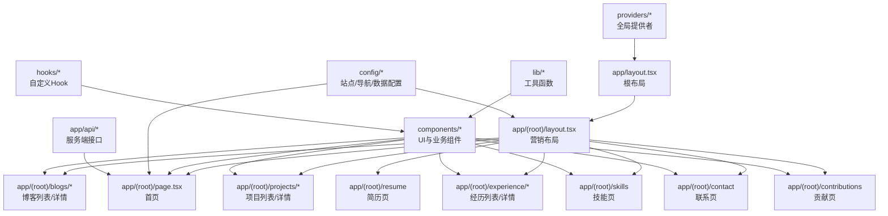
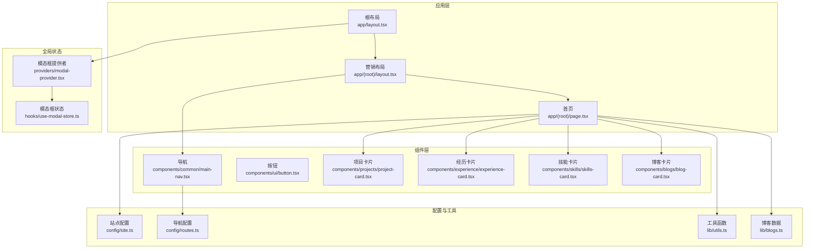
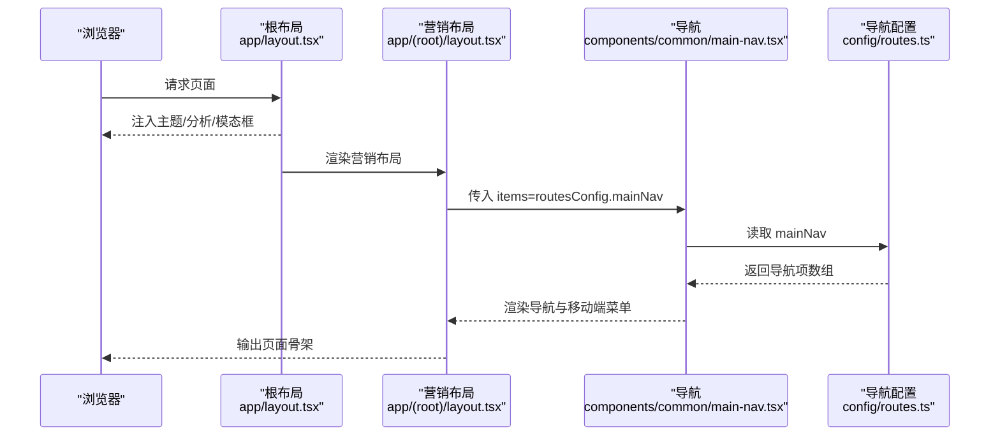
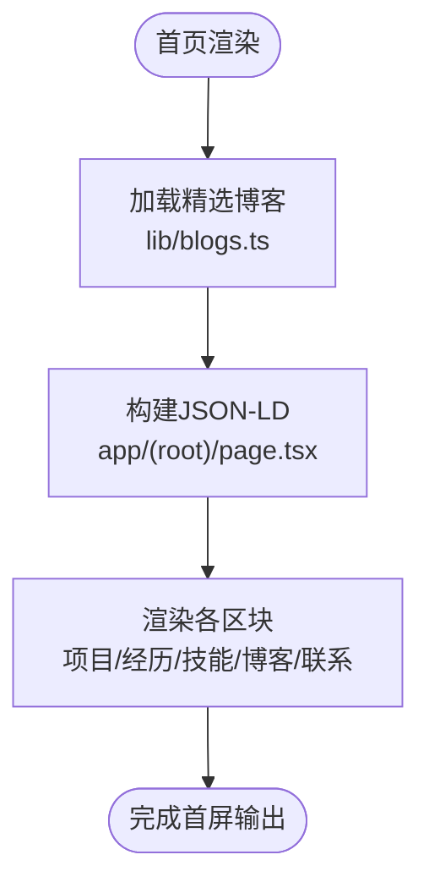
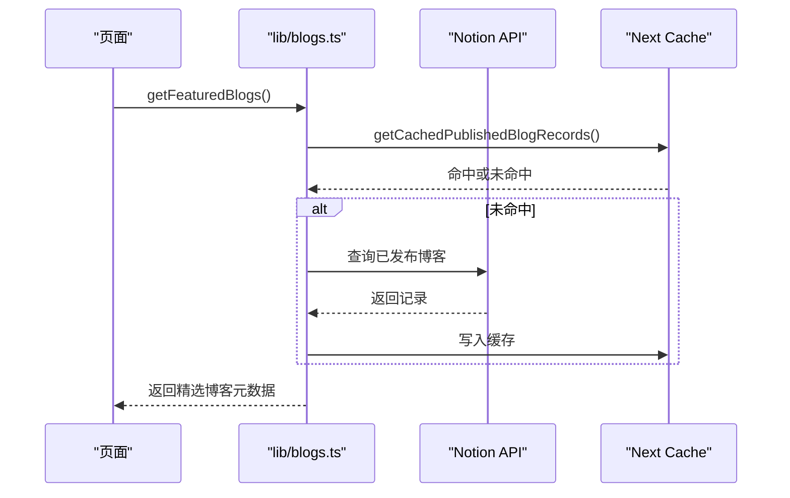
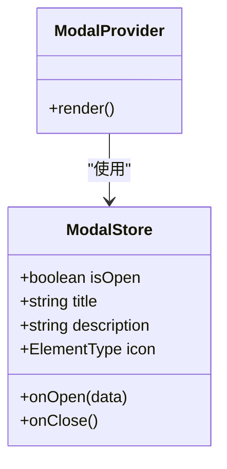
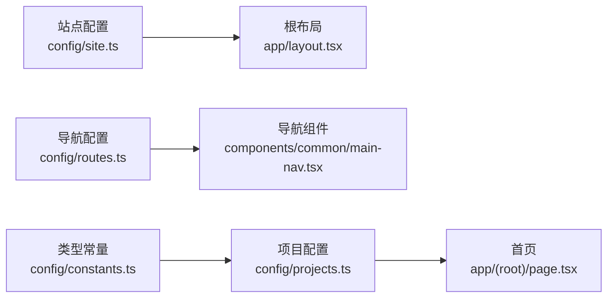
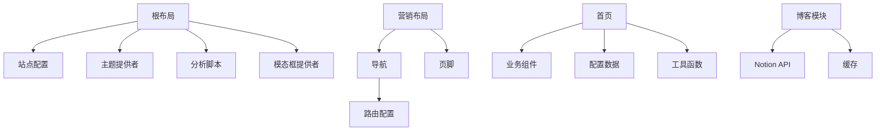

# 目录结构设计

<cite>
**本文引用的文件**
- [app/layout.tsx](file://app/layout.tsx)
- [app/(root)/layout.tsx](file://app/(root)/layout.tsx)
- [app/(root)/page.tsx](file://app/(root)/page.tsx)
- [config/site.ts](file://config/site.ts)
- [config/routes.ts](file://config/routes.ts)
- [components/common/main-nav.tsx](file://components/common/main-nav.tsx)
- [components/ui/button.tsx](file://components/ui/button.tsx)
- [lib/utils.ts](file://lib/utils.ts)
- [providers/modal-provider.tsx](file://providers/modal-provider.tsx)
- [hooks/use-modal-store.ts](file://hooks/use-modal-store.ts)
- [lib/blogs.ts](file://lib/blogs.ts)
- [config/constants.ts](file://config/constants.ts)
- [config/projects.ts](file://config/projects.ts)
</cite>

## 目录结构总览
本项目采用 Next.js App Router 的约定式路由与功能域组织方式，将“页面路由”“组件库”“配置数据”“工具函数”“全局状态/提供者”“API 路由”等职责清晰拆分。核心原则如下：
- 路由按业务域划分，使用 Route Groups 隔离共享布局与独立布局。
- 组件按“通用 UI 原子组件”“领域业务组件”“页面级组合组件”分层。
- 配置集中管理站点信息、导航、项目、技能、社交链接等，避免硬编码。
- 工具函数统一放在 lib，提供类型安全的字符串、日期、样式合并能力。
- 全局状态与跨页面能力通过 providers 暴露（如主题、模态框）。
- API 路由集中在 app/api，遵循 Next.js Route Handlers 规范。

**图表来源**
- [app/layout.tsx:18-130](file://app/layout.tsx#L18-L130)
- [app/(root)/layout.tsx:11-32](file://app/(root)/layout.tsx#L11-L32)
- [app/(root)/page.tsx:28-354](file://app/(root)/page.tsx#L28-L354)

**章节来源**
- [app/layout.tsx:18-130](file://app/layout.tsx#L18-L130)
- [app/(root)/layout.tsx:11-32](file://app/(root)/layout.tsx#L11-L32)
- [app/(root)/page.tsx:28-354](file://app/(root)/page.tsx#L28-L354)

## 项目结构与命名规范
- app
  - (root): 使用 Route Group 将营销型页面共享同一布局（包含头部导航、页脚），便于复用 MainNav、SiteFooter、ModeToggle 等。
  - api: 服务端接口，例如联系表单提交、GitHub Stars 缓存读取。
  - globals.css: 全局样式入口。
  - layout.tsx: 根布局，注入站点元信息、主题提供者、分析脚本、模态框提供者。
  - manifest.ts / sitemap.ts: PWA 清单与站点地图。
- components
  - ui: 基础 UI 原子组件（按钮、卡片、输入、对话框等），基于 Radix + Tailwind + class-variance-authority。
  - common: 跨页面复用的业务无关组件（导航、动画、主题切换、图标、页眉页脚等）。
  - 业务域子目录: blogs、projects、experience、skills、forms、modals、contact、contributions 等，承载对应领域的展示与交互逻辑。
- config
  - site.ts: 站点名称、描述、SEO、图标、社交链接等。
  - routes.ts: 主导航项定义，供导航组件渲染。
  - constants.ts: 类型常量（技能、分类、页面枚举）。
  - projects.ts / experience.ts / skills.ts / contributions.ts: 各模块的数据配置，驱动页面渲染。
- lib
  - utils.ts: 样式合并 cn、日期格式化、时长文本生成等通用工具。
  - blogs.ts: Notion 博客数据获取、校验、缓存与内容渲染。
- hooks
  - use-lock-body.ts / use-modal-store.ts: 页面滚动锁定、模态框状态管理。
- providers
  - animation-provider.tsx / modal-provider.tsx: 全局动画与模态框容器。
- content / public / assets
  - content/blogs: Markdown 文章（若本地化）或作为静态资源。
  - public: 图片、robots.txt、站点资源。
  - assets/fonts: 字体资源。

**章节来源**
- [config/site.ts:1-39](file://config/site.ts#L1-L39)
- [config/routes.ts:1-39](file://config/routes.ts#L1-L39)
- [config/constants.ts:1-91](file://config/constants.ts#L1-L91)
- [lib/utils.ts:1-29](file://lib/utils.ts#L1-L29)
- [lib/blogs.ts:1-550](file://lib/blogs.ts#L1-L550)

## 核心组件与职责边界
- 根布局 app/layout.tsx
  - 负责站点元数据、主题提供者、分析脚本、模态框提供者注入。
  - 引入 fonts、siteConfig、utils，确保全站一致的主题与样式变量。
- 营销布局 app/(root)/layout.tsx
  - 提供统一的 header、main、footer 结构，集成 MainNav、ModeToggle、GitHubStarBadge。
  - 通过 routesConfig 渲染导航项，保证导航与路由配置解耦。
- 首页 app/(root)/page.tsx
  - 聚合 featuredProjects、experiences、featuredSkills、featuredBlogs 等数据，使用 AnimatedSection/Text 构建可访问的滚动动效。
  - 注入 JSON-LD 结构化数据，提升 SEO。
- 导航组件 components/common/main-nav.tsx
  - 响应式导航，支持移动端菜单；根据当前 segment 高亮当前路由。
  - 依赖 routesConfig 与 siteConfig，保持内容与表现分离。
- UI 原子组件 components/ui/button.tsx
  - 基于 cva 定义变体与尺寸，统一样式策略；通过 Slot 支持 asChild 模式。
  - 使用 cn 合并类名，确保样式优先级可控。

**章节来源**
- [app/layout.tsx:18-130](file://app/layout.tsx#L18-L130)
- [app/(root)/layout.tsx:11-32](file://app/(root)/layout.tsx#L11-L32)
- [app/(root)/page.tsx:28-354](file://app/(root)/page.tsx#L28-L354)
- [components/common/main-nav.tsx:1-99](file://components/common/main-nav.tsx#L1-L99)
- [components/ui/button.tsx:1-58](file://components/ui/button.tsx#L1-L58)

## 架构总览
Next.js App Router 的分层架构如下：
- 根布局负责全局上下文（主题、分析、模态框）。
- 营销布局负责页面骨架（导航、主体、页脚）。
- 页面组件组合领域组件与 UI 组件，消费配置数据与工具函数。
- 工具函数与 Hook 提供跨组件能力（样式合并、状态管理）。
- API 路由处理服务端逻辑（表单提交、外部服务调用）。

**图表来源**
- [app/layout.tsx:18-130](file://app/layout.tsx#L18-L130)
- [app/(root)/layout.tsx:11-32](file://app/(root)/layout.tsx#L11-L32)
- [app/(root)/page.tsx:28-354](file://app/(root)/page.tsx#L28-L354)
- [components/common/main-nav.tsx:1-99](file://components/common/main-nav.tsx#L1-L99)
- [components/ui/button.tsx:1-58](file://components/ui/button.tsx#L1-L58)
- [config/site.ts:1-39](file://config/site.ts#L1-L39)
- [config/routes.ts:1-39](file://config/routes.ts#L1-L39)
- [lib/utils.ts:1-29](file://lib/utils.ts#L1-L29)
- [lib/blogs.ts:1-550](file://lib/blogs.ts#L1-L550)
- [providers/modal-provider.tsx:1-24](file://providers/modal-provider.tsx#L1-L24)
- [hooks/use-modal-store.ts:1-33](file://hooks/use-modal-store.ts#L1-L33)

## 详细组件分析

### 导航与布局（Route Groups）
- 使用 (root) Route Group 将营销型页面共享同一布局，避免重复代码。
- 导航项由 routesConfig 统一管理，MainNav 仅负责渲染与交互。
- 布局中嵌入 ModeToggle、GitHubStarBadge，增强用户体验。

**图表来源**
- [app/layout.tsx:18-130](file://app/layout.tsx#L18-L130)
- [app/(root)/layout.tsx:11-32](file://app/(root)/layout.tsx#L11-L32)
- [components/common/main-nav.tsx:1-99](file://components/common/main-nav.tsx#L1-L99)
- [config/routes.ts:1-39](file://config/routes.ts#L1-L39)

**章节来源**
- [app/(root)/layout.tsx:11-32](file://app/(root)/layout.tsx#L11-L32)
- [components/common/main-nav.tsx:1-99](file://components/common/main-nav.tsx#L1-L99)
- [config/routes.ts:1-39](file://config/routes.ts#L1-L39)

### 首页聚合与数据流
- 首页通过异步函数加载 featuredBlogs，并注入 JSON-LD。
- 使用 AnimatedSection/Text 包裹各区块，实现滚动入场动画。
- 数据来源于 config 下的项目、经历、技能、贡献配置以及 lib/blogs。

**图表来源**
- [app/(root)/page.tsx:28-354](file://app/(root)/page.tsx#L28-L354)
- [lib/blogs.ts:492-536](file://lib/blogs.ts#L492-L536)

**章节来源**
- [app/(root)/page.tsx:28-354](file://app/(root)/page.tsx#L28-L354)
- [lib/blogs.ts:492-536](file://lib/blogs.ts#L492-L536)

### 博客数据获取与缓存
- 使用 @notionhq/client 查询已发布博客，严格校验字段（Zod）。
- 通过 unstable_cache 对博客列表与单篇内容进行缓存，支持 revalidate 与 tags。
- 提供 getAllBlogSlugs、getAllBlogsMeta、getBlogPost、getFeaturedBlogs 等导出方法。

**图表来源**
- [lib/blogs.ts:404-420](file://lib/blogs.ts#L404-L420)
- [lib/blogs.ts:469-476](file://lib/blogs.ts#L469-L476)
- [lib/blogs.ts:492-536](file://lib/blogs.ts#L492-L536)

**章节来源**
- [lib/blogs.ts:1-550](file://lib/blogs.ts#L1-L550)

### 模态框状态管理
- 使用 Zustand 创建 useModalStore，提供 onOpen/onClose 控制模态框。
- ModalProvider 在根布局挂载，确保全局可用。
- 组件可通过 store 打开模态框并传递标题、描述、图标。

**图表来源**
- [hooks/use-modal-store.ts:1-33](file://hooks/use-modal-store.ts#L1-L33)
- [providers/modal-provider.tsx:1-24](file://providers/modal-provider.tsx#L1-L24)

**章节来源**
- [hooks/use-modal-store.ts:1-33](file://hooks/use-modal-store.ts#L1-L33)
- [providers/modal-provider.tsx:1-24](file://providers/modal-provider.tsx#L1-L24)

### 配置管理与类型约束
- site.ts 集中站点信息与 SEO 相关配置。
- routes.ts 定义导航项，供导航组件渲染。
- constants.ts 定义技能、分类、页面枚举，保障类型安全。
- projects.ts 定义项目数据结构与示例数据，支持多段说明与图片画廊。

**图表来源**
- [config/site.ts:1-39](file://config/site.ts#L1-L39)
- [config/routes.ts:1-39](file://config/routes.ts#L1-L39)
- [config/constants.ts:1-91](file://config/constants.ts#L1-L91)
- [config/projects.ts:1-422](file://config/projects.ts#L1-L422)
- [app/layout.tsx:18-130](file://app/layout.tsx#L18-L130)
- [components/common/main-nav.tsx:1-99](file://components/common/main-nav.tsx#L1-L99)
- [app/(root)/page.tsx:28-354](file://app/(root)/page.tsx#L28-L354)

**章节来源**
- [config/site.ts:1-39](file://config/site.ts#L1-L39)
- [config/routes.ts:1-39](file://config/routes.ts#L1-L39)
- [config/constants.ts:1-91](file://config/constants.ts#L1-L91)
- [config/projects.ts:1-422](file://config/projects.ts#L1-L422)

## 依赖关系分析
- 根布局依赖站点配置、字体、工具函数、主题提供者、分析脚本、模态框提供者。
- 营销布局依赖导航、模式切换、GitHub Star 徽章、页脚。
- 首页依赖各业务组件与配置数据，并通过工具函数进行样式合并与数据处理。
- 导航依赖路由配置与站点配置，确保内容与表现解耦。
- 博客模块依赖 Notion API、缓存机制与内容渲染工具。

**图表来源**
- [app/layout.tsx:18-130](file://app/layout.tsx#L18-L130)
- [app/(root)/layout.tsx:11-32](file://app/(root)/layout.tsx#L11-L32)
- [app/(root)/page.tsx:28-354](file://app/(root)/page.tsx#L28-L354)
- [components/common/main-nav.tsx:1-99](file://components/common/main-nav.tsx#L1-L99)
- [config/routes.ts:1-39](file://config/routes.ts#L1-L39)
- [lib/blogs.ts:1-550](file://lib/blogs.ts#L1-L550)

**章节来源**
- [app/layout.tsx:18-130](file://app/layout.tsx#L18-L130)
- [app/(root)/layout.tsx:11-32](file://app/(root)/layout.tsx#L11-L32)
- [app/(root)/page.tsx:28-354](file://app/(root)/page.tsx#L28-L354)
- [components/common/main-nav.tsx:1-99](file://components/common/main-nav.tsx#L1-L99)
- [config/routes.ts:1-39](file://config/routes.ts#L1-L39)
- [lib/blogs.ts:1-550](file://lib/blogs.ts#L1-L550)

## 性能考虑
- 使用 Next.js 内置缓存（unstable_cache）对博客列表与单篇内容进行缓存，减少 API 调用与渲染开销。
- 首页按需加载精选内容，避免一次性渲染过多数据。
- 使用 class-variance-authority 与 tailwind-merge 优化样式计算，减少运行时类名冲突。
- 图片与字体资源通过 public 与 assets 管理，结合 Next.js 优化策略提升加载速度。

[本节为通用性能建议，不直接分析具体文件]

## 故障排查指南
- 博客模块
  - 检查环境变量 NOTION_TOKEN 与 NOTION_DATA_SOURCE_ID 是否同时设置。
  - 确认 Notion 数据源属性类型与期望一致（Status、Title、Slug 等）。
  - 关注日志中的未知块警告与截断错误，调整文章内容长度。
- 导航与路由
  - 确保 routesConfig 中的 href 与实际路由匹配。
  - 检查 (root) Route Group 下是否存在对应的 page.tsx。
- 样式与主题
  - 使用 cn 合并类名，避免覆盖默认样式。
  - 确认主题变量在根布局中正确注入。

**章节来源**
- [lib/blogs.ts:99-121](file://lib/blogs.ts#L99-L121)
- [lib/blogs.ts:287-335](file://lib/blogs.ts#L287-L335)
- [lib/blogs.ts:422-467](file://lib/blogs.ts#L422-L467)
- [config/routes.ts:11-38](file://config/routes.ts#L11-L38)
- [components/ui/button.tsx:1-58](file://components/ui/button.tsx#L1-L58)

## 结论
本项目的目录结构遵循 Next.js App Router 的最佳实践，通过 Route Groups、组件分层、配置集中、工具函数封装与全局提供者，实现了清晰的职责边界与良好的可维护性。开发者应遵循以下规范：
- 新增页面优先放入 app/(root) 并使用共享布局。
- 组件按 UI 原子、通用业务、领域业务分层组织。
- 配置数据集中管理，避免在组件中硬编码。
- 工具函数与 Hook 复用性强，优先从 lib 与 hooks 引入。
- 使用 providers 管理全局状态与能力，避免组件内耦合。

[本节为总结性内容，不直接分析具体文件]