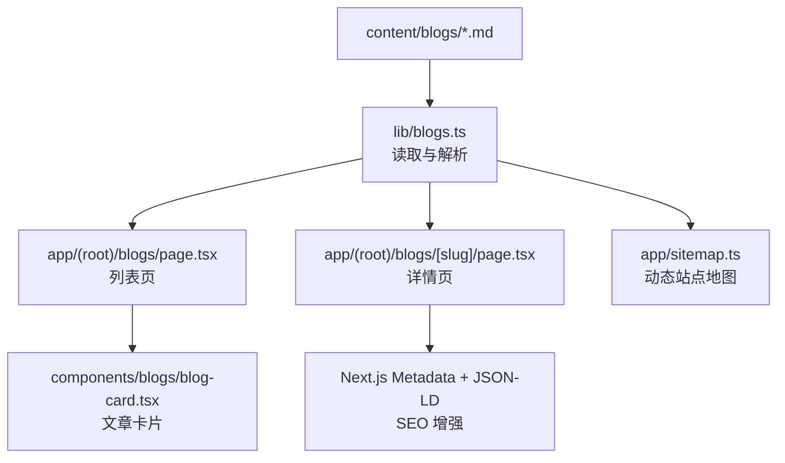
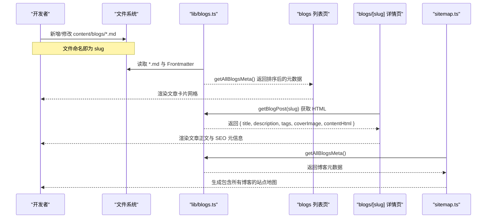
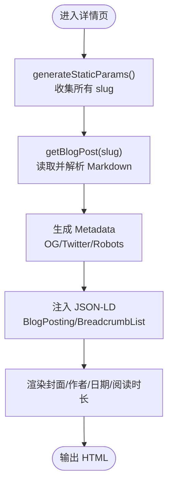
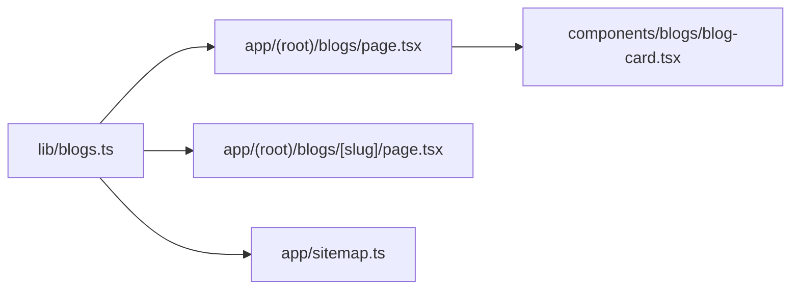

# 内容目录结构

<cite>
**本文引用的文件**
- [lib/blogs.ts](file://lib/blogs.ts)
- [app/(root)/blogs/page.tsx](file://app/(root)/blogs/page.tsx)
- [app/(root)/blogs/[slug]/page.tsx](file://app/(root)/blogs/[slug]/page.tsx)
- [components/blogs/blog-card.tsx](file://components/blogs/blog-card.tsx)
- [content/blogs/3d-card-threejs-blender.md](file://content/blogs/3d-card-threejs-blender.md)
- [content/blogs/aeo-vs-seo-chatgpt-ranking.md](file://content/blogs/aeo-vs-seo-chatgpt-ranking.md)
- [config/site.ts](file://config/site.ts)
- [config/pages.ts](file://config/pages.ts)
- [app/sitemap.ts](file://app/sitemap.ts)
</cite>

## 目录
1. [简介](#简介)
2. [项目结构](#项目结构)
3. [核心组件](#核心组件)
4. [架构总览](#架构总览)
5. [详细组件分析](#详细组件分析)
6. [依赖关系分析](#依赖关系分析)
7. [性能考量](#性能考量)
8. [故障排查指南](#故障排查指南)
9. [结论](#结论)
10. [附录](#附录)

## 简介
本文件面向基于 Markdown 的内容管理系统，聚焦博客文章的组织方式、Frontmatter 元数据定义、内容渲染流程与 SEO 优化。系统采用 Next.js App Router，将静态 Markdown 内容置于 content/blogs 目录，通过服务端函数在构建期或请求期读取并渲染为 HTML，配合结构化数据（JSON-LD）和站点地图生成，实现开箱即用的博客发布体验。

## 项目结构
- 内容存储：content/blogs 目录下存放 .md 文件，每个文件代表一篇博客文章。
- 路由与页面：
  - app/(root)/blogs/page.tsx：博客列表页，展示所有文章的元数据卡片。
  - app/(root)/blogs/[slug]/page.tsx：单篇文章详情页，渲染 Markdown 内容与 SEO 元信息。
- 工具库：lib/blogs.ts 提供读取、解析、排序、统计等能力。
- 配置：config/site.ts 与 config/pages.ts 集中管理站点信息与页面元数据。
- 站点地图：app/sitemap.ts 动态生成包含所有博客的 sitemap。

图表来源
- [lib/blogs.ts:1-97](file://lib/blogs.ts#L1-L97)
- [app/(root)/blogs/page.tsx:1-153](file://app/(root)/blogs/page.tsx#L1-L153)
- [app/(root)/blogs/[slug]/page.tsx:1-325](file://app/(root)/blogs/[slug]/page.tsx#L1-L325)
- [components/blogs/blog-card.tsx:1-96](file://components/blogs/blog-card.tsx#L1-L96)
- [app/sitemap.ts:1-72](file://app/sitemap.ts#L1-L72)

章节来源
- [lib/blogs.ts:1-97](file://lib/blogs.ts#L1-L97)
- [app/(root)/blogs/page.tsx:1-153](file://app/(root)/blogs/page.tsx#L1-L153)
- [app/(root)/blogs/[slug]/page.tsx:1-325](file://app/(root)/blogs/[slug]/page.tsx#L1-L325)
- [components/blogs/blog-card.tsx:1-96](file://components/blogs/blog-card.tsx#L1-L96)
- [app/sitemap.ts:1-72](file://app/sitemap.ts#L1-L72)

## 核心组件
- 内容源：Markdown 文件位于 content/blogs，每篇以 slug 命名（文件名去掉 .md）。
- Frontmatter 元数据：
  - 必需字段：title、date、description、tags
  - 可选字段：coverImage、readingTime、featured
- 渲染管线：
  - 使用 gray-matter 解析 Frontmatter 与正文
  - 使用 remark + remark-gfm + remark-html 将 Markdown 转为 HTML
- 列表与详情：
  - 列表页调用 getAllBlogsMeta 获取排序后的元数据
  - 详情页调用 getBlogPost 获取完整 HTML 内容
- SEO：
  - 列表页与详情页均注入 JSON-LD（CollectionPage/BlogPosting/BreadcrumbList）
  - 动态生成 Open Graph/Twitter Card 元信息
  - 站点地图包含所有博客条目

章节来源
- [lib/blogs.ts:11-27](file://lib/blogs.ts#L11-L27)
- [lib/blogs.ts:35-82](file://lib/blogs.ts#L35-L82)
- [app/(root)/blogs/page.tsx:11-39](file://app/(root)/blogs/page.tsx#L11-L39)
- [app/(root)/blogs/page.tsx:44-120](file://app/(root)/blogs/page.tsx#L44-L120)
- [app/(root)/blogs/[slug]/page.tsx:25-79](file://app/(root)/blogs/[slug]/page.tsx#L25-L79)
- [app/(root)/blogs/[slug]/page.tsx:102-177](file://app/(root)/blogs/[slug]/page.tsx#L102-L177)
- [app/sitemap.ts:6-71](file://app/sitemap.ts#L6-L71)

## 架构总览
下图展示了从内容到页面的端到端流程，包括构建期参数生成、服务端数据获取、HTML 渲染与 SEO 注入。

图表来源
- [lib/blogs.ts:35-82](file://lib/blogs.ts#L35-L82)
- [app/(root)/blogs/page.tsx:41-148](file://app/(root)/blogs/page.tsx#L41-L148)
- [app/(root)/blogs/[slug]/page.tsx:20-89](file://app/(root)/blogs/[slug]/page.tsx#L20-L89)
- [app/sitemap.ts:6-71](file://app/sitemap.ts#L6-L71)

## 详细组件分析

### 博客文章结构与 Frontmatter
- 位置：content/blogs 下的每个 .md 文件
- Frontmatter 字段说明：
  - title：文章标题
  - date：发布日期（用于排序与时间显示）
  - description：摘要描述
  - tags：标签数组（用于关键词与筛选扩展）
  - coverImage：封面图路径（相对站点根路径）
  - readingTime：阅读时长（分钟），可省略
  - featured：是否精选（用于首页或列表优先展示）
- 示例参考：
  - [content/blogs/3d-card-threejs-blender.md:1-9](file://content/blogs/3d-card-threejs-blender.md#L1-L9)
  - [content/blogs/aeo-vs-seo-chatgpt-ranking.md:1-8](file://content/blogs/aeo-vs-seo-chatgpt-ranking.md#L1-L8)

章节来源
- [content/blogs/3d-card-threejs-blender.md:1-9](file://content/blogs/3d-card-threejs-blender.md#L1-L9)
- [content/blogs/aeo-vs-seo-chatgpt-ranking.md:1-8](file://content/blogs/aeo-vs-seo-chatgpt-ranking.md#L1-L8)
- [lib/blogs.ts:11-27](file://lib/blogs.ts#L11-L27)

### 内容渲染流程
- 列表页：
  - 调用 getAllBlogsMeta 获取所有文章元数据并按日期倒序排列
  - 渲染 BlogCard 网格，支持封面图、标签、标题、摘要、日期与阅读时长
- 详情页：
  - 通过 generateStaticParams 预生成所有 slug 路由
  - 调用 getBlogPost 解析 Markdown 为 HTML
  - 注入 JSON-LD（BlogPosting、BreadcrumbList）与 Open Graph/Twitter 元信息
  - 渲染封面图、作者、日期、阅读时长与正文内容

图表来源
- [app/(root)/blogs/[slug]/page.tsx:20-89](file://app/(root)/blogs/[slug]/page.tsx#L20-L89)
- [app/(root)/blogs/[slug]/page.tsx:102-177](file://app/(root)/blogs/[slug]/page.tsx#L102-L177)
- [lib/blogs.ts:64-82](file://lib/blogs.ts#L64-L82)

章节来源
- [app/(root)/blogs/[slug]/page.tsx:20-89](file://app/(root)/blogs/[slug]/page.tsx#L20-L89)
- [app/(root)/blogs/[slug]/page.tsx:102-177](file://app/(root)/blogs/[slug]/page.tsx#L102-L177)
- [lib/blogs.ts:64-82](file://lib/blogs.ts#L64-L82)

### 图片资源管理
- 封面图路径：
  - 使用相对站点根的路径（如 /projects/portfolio/logo.png）
  - 详情页与列表页通过 Next.js Image 组件加载，支持懒加载与尺寸优化
- 建议：
  - 将图片资源放在 public 下对应子目录，便于 CDN 缓存与复用
  - 保持 coverImage 路径与站点根一致，避免跨域问题

章节来源
- [app/(root)/blogs/[slug]/page.tsx:267-281](file://app/(root)/blogs/[slug]/page.tsx#L267-L281)
- [components/blogs/blog-card.tsx:26-37](file://components/blogs/blog-card.tsx#L26-L37)

### 内容版本控制
- 基于 Git 的版本控制：
  - 每次提交变更 content/blogs 下的 .md 文件即可追踪历史
  - 通过文件名（slug）唯一标识文章，便于回滚与分支合并
- 最佳实践：
  - 使用语义化 commit message 记录内容更新
  - 对重大改版使用分支隔离，合并前进行预览验证

[本节为通用实践说明，不直接分析具体代码文件]

### SEO 优化
- 元数据：
  - 列表页与详情页分别设置 title、description、canonical、Open Graph、Twitter Card
- 结构化数据：
  - 列表页：CollectionPage + Blog 聚合，列出所有 BlogPosting
  - 详情页：BlogPosting 包含 headline、description、author、publisher、image、keywords、wordCount、timeRequired 等
  - 面包屑：BreadcrumbList 提升导航语义
- 站点地图：
  - 动态生成包含所有博客的 sitemap，标注 lastModified、changeFrequency、priority

章节来源
- [app/(root)/blogs/page.tsx:11-39](file://app/(root)/blogs/page.tsx#L11-L39)
- [app/(root)/blogs/page.tsx:44-120](file://app/(root)/blogs/page.tsx#L44-L120)
- [app/(root)/blogs/[slug]/page.tsx:25-79](file://app/(root)/blogs/[slug]/page.tsx#L25-L79)
- [app/(root)/blogs/[slug]/page.tsx:102-177](file://app/(root)/blogs/[slug]/page.tsx#L102-L177)
- [app/sitemap.ts:6-71](file://app/sitemap.ts#L6-L71)

### 内容搜索功能
- 当前实现未内置全文检索；可通过以下方案扩展：
  - 前端索引：构建时生成全文索引（如 lunr.js），按 tags/title/description 过滤
  - 后端服务：引入 Algolia/Meilisearch，将元数据与片段同步至搜索引擎
  - 站内搜索页：新增搜索路由，结合分页与高亮显示
- 建议：
  - 利用 tags 作为一级分类，快速定位主题
  - 在详情页保留 keywords 字段以便外部搜索引擎抓取

[本节为扩展方案说明，不直接分析具体代码文件]

### 内容创作工作流
- 创建新文章：
  - 在 content/blogs 新增 .md 文件，命名即为 slug
  - 填写 Frontmatter（title、date、description、tags、coverImage、readingTime、featured）
  - 编写正文，使用标准 Markdown 语法
- 预览与发布：
  - 本地开发运行 Next.js 应用，访问 /blogs 查看列表与 /blogs/{slug} 查看详情
  - 提交代码后由 CI/CD 构建部署，自动更新站点地图与索引

章节来源
- [lib/blogs.ts:35-42](file://lib/blogs.ts#L35-L42)
- [app/(root)/blogs/page.tsx:41-148](file://app/(root)/blogs/page.tsx#L41-L148)
- [app/(root)/blogs/[slug]/page.tsx:20-89](file://app/(root)/blogs/[slug]/page.tsx#L20-L89)

### 内容审核流程
- 建议流程：
  - 草稿阶段：在分支中编辑，使用 draft 标记或隐藏 featured
  - 同行评审：通过 Pull Request 进行内容审查
  - 上线发布：合并主分支后触发构建，自动生成站点地图与索引
- 自动化检查：
  - 校验 Frontmatter 必填字段
  - 链接有效性检测（外链与站内资源）
  - 图片压缩与格式转换（WebP/AVIF）

[本节为流程建议，不直接分析具体代码文件]

### 多语言支持的扩展方案
- 内容层：
  - 为每篇文章增加 locale 字段（如 en、zh），并在 lib/blogs.ts 中按语言过滤
  - 在路由层增加 /{locale}/blogs 与 /{locale}/blogs/[slug] 的动态路由
- 配置层：
  - 在 config/site.ts 中维护多语言站点名、描述与关键字
- 渲染层：
  - 根据 URL 中的 locale 选择对应语言的文章与元数据
  - 在 JSON-LD 中设置 inLanguage 字段
- 站点地图：
  - 为每种语言生成独立的 sitemap 或使用 hreflang 关联

[本节为扩展方案说明，不直接分析具体代码文件]

## 依赖关系分析
- 模块耦合：
  - 列表页与详情页均依赖 lib/blogs.ts 的数据接口
  - 列表页依赖 components/blogs/blog-card.tsx 进行卡片渲染
  - 站点地图依赖 lib/blogs.ts 获取博客元数据
- 外部依赖：
  - gray-matter：解析 Frontmatter
  - remark/remark-gfm/remark-html：Markdown 转 HTML
  - Next.js：App Router、Metadata、Script、Image 等

图表来源
- [lib/blogs.ts:1-97](file://lib/blogs.ts#L1-L97)
- [app/(root)/blogs/page.tsx:1-153](file://app/(root)/blogs/page.tsx#L1-L153)
- [app/(root)/blogs/[slug]/page.tsx:1-325](file://app/(root)/blogs/[slug]/page.tsx#L1-L325)
- [components/blogs/blog-card.tsx:1-96](file://components/blogs/blog-card.tsx#L1-L96)
- [app/sitemap.ts:1-72](file://app/sitemap.ts#L1-L72)

章节来源
- [lib/blogs.ts:1-97](file://lib/blogs.ts#L1-L97)
- [app/(root)/blogs/page.tsx:1-153](file://app/(root)/blogs/page.tsx#L1-L153)
- [app/(root)/blogs/[slug]/page.tsx:1-325](file://app/(root)/blogs/[slug]/page.tsx#L1-L325)
- [components/blogs/blog-card.tsx:1-96](file://components/blogs/blog-card.tsx#L1-L96)
- [app/sitemap.ts:1-72](file://app/sitemap.ts#L1-L72)

## 性能考量
- 构建期静态生成：
  - generateStaticParams 预生成所有博客路由，减少运行时开销
- 图片优化：
  - 使用 Next.js Image 组件，自动懒加载与尺寸裁剪
- 内容解析：
  - remark 管道仅在详情页按需执行，列表页仅处理元数据
- 站点地图：
  - 动态生成，lastModified 与 changeFrequency 有助于搜索引擎抓取效率

[本节为通用性能建议，不直接分析具体代码文件]

## 故障排查指南
- 常见问题：
  - 找不到文章：检查 slug 是否与文件名一致，确保 .md 文件存在且未被误删
  - 列表为空：确认 content/blogs 目录存在且包含 .md 文件
  - 图片不显示：检查 coverImage 路径是否为站点根相对路径，并确保资源存在于 public 下
  - SEO 不生效：确认 JSON-LD 已正确注入，robots 允许抓取，sitemap 包含该页面
- 调试步骤：
  - 在详情页 try/catch 捕获异常，必要时降级为 notFound
  - 检查 lib/blogs.ts 的文件读取与解析逻辑
  - 使用浏览器开发者工具查看页面源码中的 <script type="application/ld+json"> 是否正确

章节来源
- [app/(root)/blogs/[slug]/page.tsx:81-89](file://app/(root)/blogs/[slug]/page.tsx#L81-L89)
- [lib/blogs.ts:29-42](file://lib/blogs.ts#L29-L42)

## 结论
本项目提供了一个轻量、可扩展的基于 Markdown 的博客内容管理系统。通过清晰的目录结构、标准化的 Frontmatter、完善的渲染与 SEO 机制，以及灵活的扩展点（搜索、多语言、审核流程），能够满足个人与技术团队的内容发布需求。建议在后续迭代中逐步引入全文检索、多语言支持与自动化审核，以提升内容运营效率与用户体验。

## 附录
- 站点配置参考：
  - [config/site.ts:1-41](file://config/site.ts#L1-L41)
  - [config/pages.ts:15-86](file://config/pages.ts#L15-L86)
- 示例文章参考：
  - [content/blogs/3d-card-threejs-blender.md:1-305](file://content/blogs/3d-card-threejs-blender.md#L1-L305)
  - [content/blogs/aeo-vs-seo-chatgpt-ranking.md:1-118](file://content/blogs/aeo-vs-seo-chatgpt-ranking.md#L1-L118)