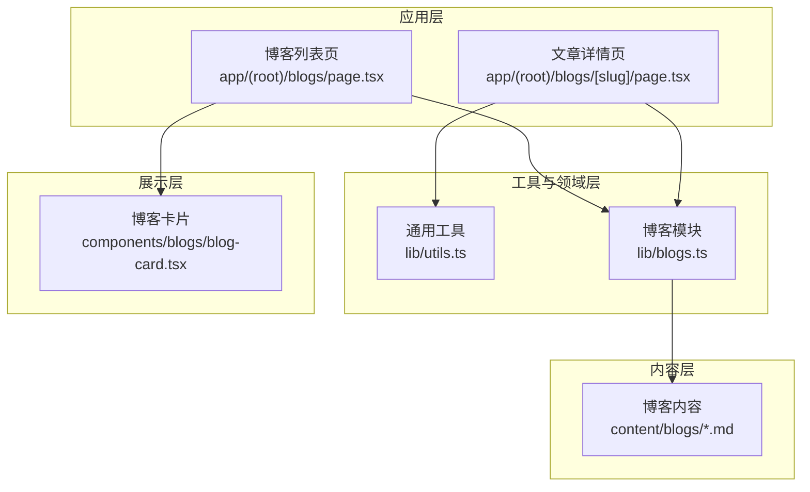
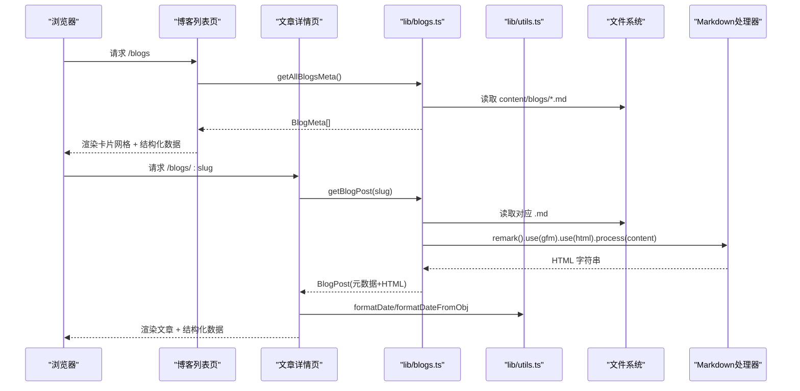
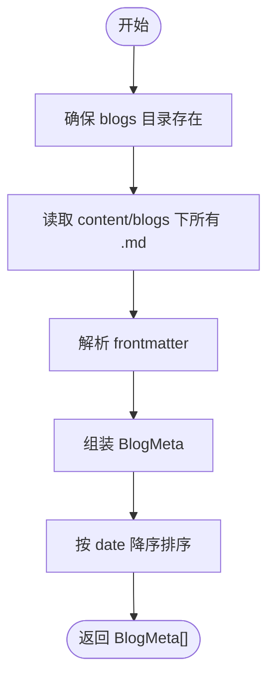
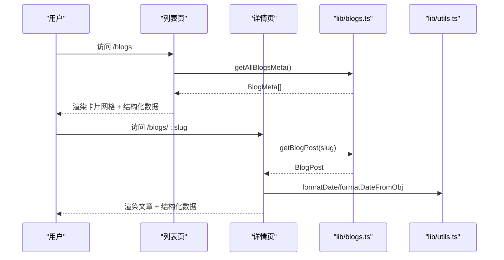
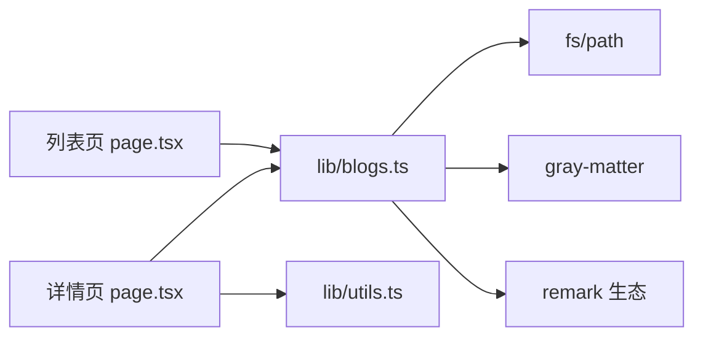

# 工具库目录结构

<cite>
**本文引用的文件**
- [lib/utils.ts](file://lib/utils.ts)
- [lib/blogs.ts](file://lib/blogs.ts)
- [app/(root)/blogs/page.tsx](file://app/(root)/blogs/page.tsx)
- [app/(root)/blogs/[slug]/page.tsx](file://app/(root)/blogs/[slug]/page.tsx)
- [components/blogs/blog-card.tsx](file://components/blogs/blog-card.tsx)
- [content/blogs/3d-card-threejs-blender.md](file://content/blogs/3d-card-threejs-blender.md)
</cite>

## 目录
1. [简介](#简介)
2. [项目结构](#项目结构)
3. [核心组件](#核心组件)
4. [架构总览](#架构总览)
5. [详细组件分析](#详细组件分析)
6. [依赖关系分析](#依赖关系分析)
7. [性能考量](#性能考量)
8. [故障排查指南](#故障排查指南)
9. [结论](#结论)
10. [附录：使用示例与最佳实践](#附录使用示例与最佳实践)

## 简介
本文件聚焦于 lib 目录下的工具函数组织原则与设计模式，并系统说明博客系统的核心逻辑：Markdown 解析、内容管理、元数据处理、SEO 结构化数据注入等。文档同时提供工具函数的使用指引、错误处理机制与性能优化策略，帮助读者快速理解并扩展该作品集项目的工具层与博客子系统。

## 项目结构
本项目采用 Next.js App Router，博客内容与渲染逻辑集中在以下位置：
- lib：工具与领域逻辑（样式合并、日期格式化、博客读取与解析）
- app/(root)/blogs：博客列表页与文章详情页路由
- components/blogs：博客卡片展示组件
- content/blogs：以 Markdown 文件形式存储的博客内容（含 frontmatter 元数据）

图表来源
- [app/(root)/blogs/page.tsx:1-153](file://app/(root)/blogs/page.tsx#L1-L153)
- [app/(root)/blogs/[slug]/page.tsx:1-325](file://app/(root)/blogs/[slug]/page.tsx#L1-L325)
- [lib/utils.ts:1-25](file://lib/utils.ts#L1-L25)
- [lib/blogs.ts:1-97](file://lib/blogs.ts#L1-L97)
- [components/blogs/blog-card.tsx:1-96](file://components/blogs/blog-card.tsx#L1-L96)
- [content/blogs/3d-card-threejs-blender.md:1-305](file://content/blogs/3d-card-threejs-blender.md#L1-L305)

章节来源
- [app/(root)/blogs/page.tsx:1-153](file://app/(root)/blogs/page.tsx#L1-L153)
- [app/(root)/blogs/[slug]/page.tsx:1-325](file://app/(root)/blogs/[slug]/page.tsx#L1-L325)
- [lib/utils.ts:1-25](file://lib/utils.ts#L1-L25)
- [lib/blogs.ts:1-97](file://lib/blogs.ts#L1-L97)
- [components/blogs/blog-card.tsx:1-96](file://components/blogs/blog-card.tsx#L1-L96)
- [content/blogs/3d-card-threejs-blender.md:1-305](file://content/blogs/3d-card-threejs-blender.md#L1-L305)

## 核心组件
- 通用工具（lib/utils.ts）
  - 样式类名合并：基于 clsx 与 tailwind-merge 的 cn 工具，用于安全合并动态类名。
  - 日期格式化：提供字符串或 Date 对象的本地化日期格式化能力。
- 博客模块（lib/blogs.ts）
  - 文件系统访问：读取 content/blogs 下的 .md 文件。
  - Frontmatter 解析：使用 gray-matter 提取标题、日期、描述、标签、封面图、阅读时长、是否精选等元信息。
  - Markdown 转 HTML：使用 remark + remark-gfm + remark-html 将正文转换为 HTML。
  - 列表与详情：导出获取所有 slug、全部元数据（按时间倒序）、单篇文章（元数据+HTML）、精选文章、估算阅读时长等方法。
- 页面组件
  - 列表页：调用 getAllBlogsMeta 渲染卡片网格，并注入集合页 JSON-LD 与面包屑结构化数据。
  - 详情页：根据 slug 获取文章，生成 SEO 元信息与文章级 JSON-LD，渲染正文与导航。
- 展示组件
  - 博客卡片：接收 BlogMeta，展示封面、标签、标题、摘要、日期与阅读时长。

章节来源
- [lib/utils.ts:1-25](file://lib/utils.ts#L1-L25)
- [lib/blogs.ts:1-97](file://lib/blogs.ts#L1-L97)
- [app/(root)/blogs/page.tsx:1-153](file://app/(root)/blogs/page.tsx#L1-L153)
- [app/(root)/blogs/[slug]/page.tsx:1-325](file://app/(root)/blogs/[slug]/page.tsx#L1-L325)
- [components/blogs/blog-card.tsx:1-96](file://components/blogs/blog-card.tsx#L1-L96)

## 架构总览
博客子系统遵循“数据在磁盘、逻辑在工具层、视图在页面组件”的分层设计：
- 数据源：content/blogs/*.md（包含 frontmatter 与正文）
- 工具层：lib/blogs.ts 负责 I/O、解析、排序、过滤；lib/utils.ts 提供跨模块复用的工具方法
- 表现层：Next.js 页面组件负责 SEO、布局与交互；components/blogs/blog-card.tsx 负责卡片展示

图表来源
- [app/(root)/blogs/page.tsx:1-153](file://app/(root)/blogs/page.tsx#L1-L153)
- [app/(root)/blogs/[slug]/page.tsx:1-325](file://app/(root)/blogs/[slug]/page.tsx#L1-L325)
- [lib/blogs.ts:1-97](file://lib/blogs.ts#L1-L97)
- [lib/utils.ts:1-25](file://lib/utils.ts#L1-L25)

## 详细组件分析

### 工具函数：lib/utils.ts
- 设计原则
  - 单一职责：每个函数只做一件事（类名合并、日期格式化）。
  - 可组合性：通过参数重载支持多种输入类型（字符串或数字日期、Date 对象）。
  - 无副作用：纯函数，便于测试与复用。
- 关键方法
  - cn(...inputs): 合并动态类名，避免冲突与冗余。
  - formatDate(input): 将字符串或数字时间戳格式化为本地化日期。
  - formatDateFromObj(input): 对 Date 对象进行本地化日期格式化。
- 使用示例（路径引用）
  - 在文章详情页中用于格式化发布日期与构建 ISO 时间字符串。
  - 在卡片组件中用于显示本地化日期。

章节来源
- [lib/utils.ts:1-25](file://lib/utils.ts#L1-L25)
- [app/(root)/blogs/[slug]/page.tsx:91-97](file://app/(root)/blogs/[slug]/page.tsx#L91-L97)
- [components/blogs/blog-card.tsx:12-18](file://components/blogs/blog-card.tsx#L12-L18)

### 博客模块：lib/blogs.ts
- 设计模式
  - 分层封装：I/O（fs/path）与解析（gray-matter/remark）被封装为对外暴露的简单 API。
  - 类型驱动：通过接口定义 BlogFrontmatter、BlogMeta、BlogPost，保证数据结构一致性。
  - 容错与健壮性：ensureBlogsDir 确保目录存在，避免首次运行报错。
- 核心流程
  - 列出所有 slug：扫描 content/blogs 下 .md 文件，返回文件名（不含扩展名）。
  - 获取全部元数据：读取每个 .md，解析 frontmatter，组装 BlogMeta，并按 date 降序排序。
  - 获取单篇文章：读取指定 .md，解析 frontmatter 与正文，使用 remark 链式插件将 Markdown 转为 HTML。
  - 精选文章：优先返回 marked featured 的文章，否则回退到最新 3 篇。
  - 阅读时长估算：基于词数与每分钟词速估算阅读时间。
- 复杂度与性能
  - getAllBlogsMeta：O(n) 遍历 n 个 .md 文件，排序 O(n log n)。
  - getBlogPost：单次 I/O + Markdown 解析，适合按需加载。
- 错误处理
  - 目录不存在时自动创建。
  - 缺失文件或解析异常由调用方捕获（详情页中使用 try/catch 并触发 notFound）。

图表来源
- [lib/blogs.ts:29-62](file://lib/blogs.ts#L29-L62)

章节来源
- [lib/blogs.ts:1-97](file://lib/blogs.ts#L1-L97)

### 页面与组件：列表页与详情页
- 列表页（app/(root)/blogs/page.tsx）
  - 调用 getAllBlogsMeta 获取文章元数据。
  - 渲染卡片网格，空状态友好提示。
  - 注入 CollectionPage 与 BreadcrumbList 的 JSON-LD，提升 SEO。
- 详情页（app/(root)/blogs/[slug]/page.tsx）
  - generateStaticParams 预生成静态路由参数。
  - generateMetadata 动态生成 SEO 元信息（OpenGraph、Twitter Card、robots）。
  - 主渲染：解析文章、格式化日期、注入 BlogPosting 与 BreadcrumbList JSON-LD。
  - 错误处理：getBlogPost 失败时调用 notFound。
- 卡片组件（components/blogs/blog-card.tsx）
  - 接收 BlogMeta，展示封面、标签、标题、摘要、日期与阅读时长。
  - 链接至 /blogs/:slug。

图表来源
- [app/(root)/blogs/page.tsx:1-153](file://app/(root)/blogs/page.tsx#L1-L153)
- [app/(root)/blogs/[slug]/page.tsx:1-325](file://app/(root)/blogs/[slug]/page.tsx#L1-L325)
- [lib/blogs.ts:1-97](file://lib/blogs.ts#L1-L97)
- [lib/utils.ts:1-25](file://lib/utils.ts#L1-L25)

章节来源
- [app/(root)/blogs/page.tsx:1-153](file://app/(root)/blogs/page.tsx#L1-L153)
- [app/(root)/blogs/[slug]/page.tsx:1-325](file://app/(root)/blogs/[slug]/page.tsx#L1-L325)
- [components/blogs/blog-card.tsx:1-96](file://components/blogs/blog-card.tsx#L1-L96)

## 依赖关系分析
- 模块耦合
  - 页面组件仅依赖 lib/blogs.ts 与 lib/utils.ts，保持低耦合。
  - 博客模块依赖 fs、path、gray-matter、remark 生态，屏蔽底层实现细节。
- 外部依赖
  - gray-matter：解析 frontmatter。
  - remark + remark-gfm + remark-html：Markdown 转 HTML。
  - clsx + tailwind-merge：类名合并。
- 潜在风险
  - 同步 I/O：getAllBlogsMeta 与 getBlogPost 使用同步读取，在大目录或高并发场景可能阻塞事件循环。建议在生产环境考虑缓存或异步 I/O。
  - 未 sanitization：HTML 输出未做清洗，需评估 XSS 风险。

图表来源
- [app/(root)/blogs/page.tsx:1-153](file://app/(root)/blogs/page.tsx#L1-L153)
- [app/(root)/blogs/[slug]/page.tsx:1-325](file://app/(root)/blogs/[slug]/page.tsx#L1-L325)
- [lib/blogs.ts:1-97](file://lib/blogs.ts#L1-L97)
- [lib/utils.ts:1-25](file://lib/utils.ts#L1-L25)

章节来源
- [lib/blogs.ts:1-97](file://lib/blogs.ts#L1-L97)
- [lib/utils.ts:1-25](file://lib/utils.ts#L1-L25)
- [app/(root)/blogs/page.tsx:1-153](file://app/(root)/blogs/page.tsx#L1-L153)
- [app/(root)/blogs/[slug]/page.tsx:1-325](file://app/(root)/blogs/[slug]/page.tsx#L1-L325)

## 性能考量
- 列表页批量读取
  - getAllBlogsMeta 会读取所有 .md 文件并排序，建议在内容较多时使用分页或懒加载。
- 详情页按需解析
  - getBlogPost 仅在访问具体文章时解析 Markdown，减少首屏开销。
- 缓存策略
  - 可对 getAllBlogsMeta 的结果进行内存缓存或在构建期生成静态数据，降低运行时 I/O。
- 渲染优化
  - 列表使用 CSS Grid 与动画组件，注意控制动画数量与延迟，避免重排重绘。
- HTML 安全
  - remark-html 未启用 sanitize，若内容来自不可信来源，应引入 sanitizer 或白名单策略。

[本节为通用性能指导，不直接分析具体代码文件]

## 故障排查指南
- 常见问题
  - 找不到博客目录：ensureBlogsDir 会自动创建，但若权限不足会导致写入失败。检查部署环境的目录权限。
  - 文章不存在：详情页在 getBlogPost 失败时调用 notFound，确认 slug 与文件名一致（不含 .md）。
  - 日期格式异常：确认 frontmatter 中的 date 字段为有效日期字符串或时间戳。
  - HTML 渲染异常：检查 Markdown 语法与 remark 插件兼容性。
- 定位步骤
  - 在列表页打印 getAllBlogsMeta 结果，确认元数据是否正确。
  - 在详情页 catch 块中记录错误日志，确认 isFile 与 path 拼接是否正确。
  - 使用浏览器开发者工具查看注入的 JSON-LD 是否符合预期。

章节来源
- [lib/blogs.ts:29-33](file://lib/blogs.ts#L29-L33)
- [app/(root)/blogs/[slug]/page.tsx:84-89](file://app/(root)/blogs/[slug]/page.tsx#L84-L89)

## 结论
本项目将工具函数与博客领域逻辑清晰分离：lib/utils.ts 提供跨模块复用的基础能力，lib/blogs.ts 封装了从文件系统到 Markdown 解析的完整链路，页面组件专注于 SEO 与展示。整体结构简洁、可扩展性强，适合持续迭代与团队协作。

[本节为总结性内容，不直接分析具体代码文件]

## 附录：使用示例与最佳实践
- 工具函数使用示例（路径引用）
  - 样式合并：在任意组件中使用 cn(...) 合并动态类名。
  - 日期格式化：在详情页与卡片组件中格式化发布日期。
- 博客写作规范（参考示例文件）
  - 在 content/blogs 下新增 .md 文件，顶部包含 frontmatter（title、date、description、tags、coverImage、readingTime、featured）。
  - 正文使用标准 Markdown，支持 GFM 表格、任务列表等。
- 错误处理最佳实践
  - 在详情页对 getBlogPost 使用 try/catch，失败时调用 notFound。
  - 对前端渲染的 HTML 进行安全评估，必要时引入 sanitizer。
- 性能优化建议
  - 对列表页结果进行缓存或构建期生成。
  - 控制动画与图片资源大小，合理使用 next/image 的优先级与尺寸。

章节来源
- [content/blogs/3d-card-threejs-blender.md:1-305](file://content/blogs/3d-card-threejs-blender.md#L1-L305)
- [app/(root)/blogs/[slug]/page.tsx:84-89](file://app/(root)/blogs/[slug]/page.tsx#L84-L89)
- [lib/blogs.ts:1-97](file://lib/blogs.ts#L1-L97)
- [lib/utils.ts:1-25](file://lib/utils.ts#L1-L25)