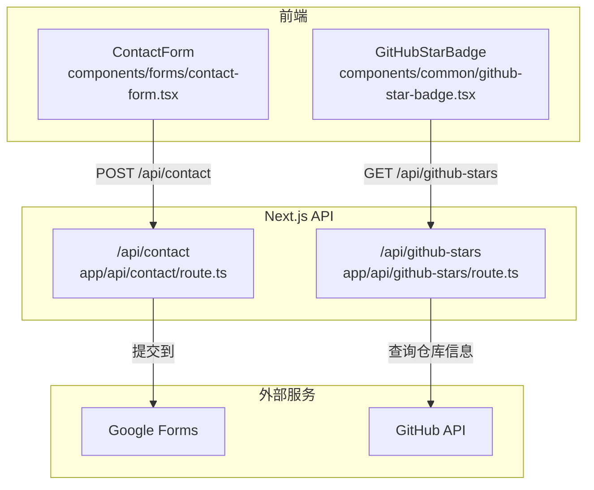
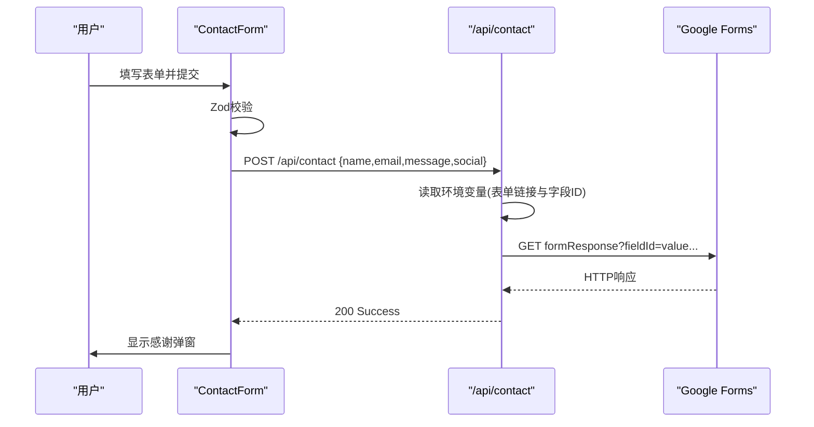
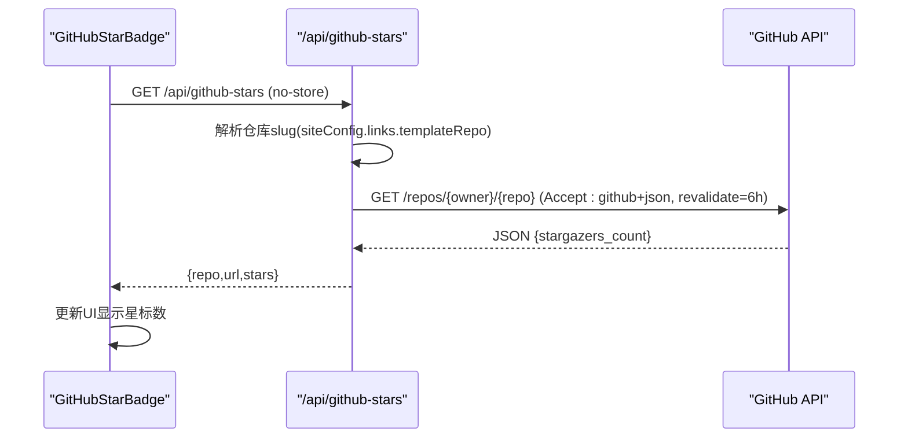
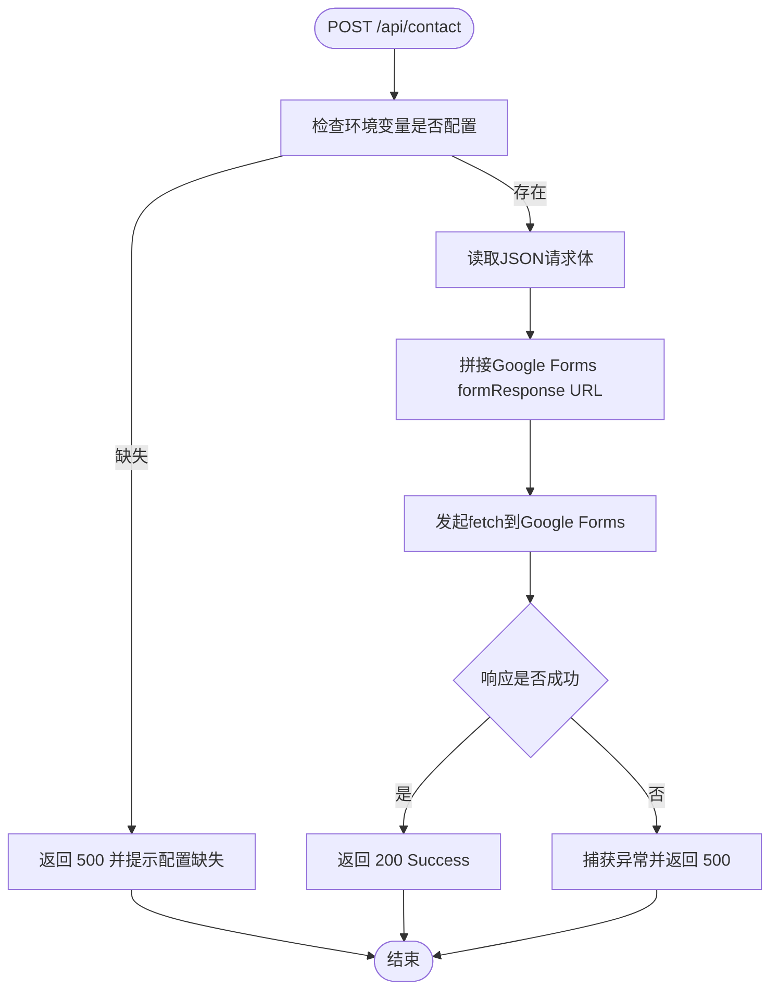
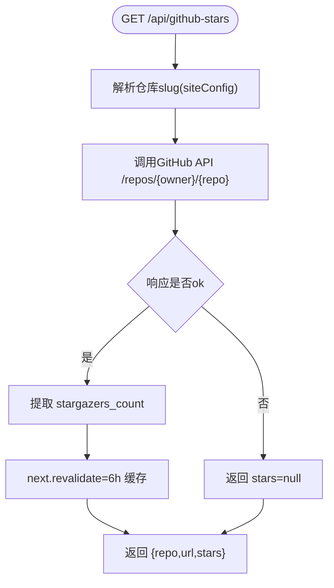
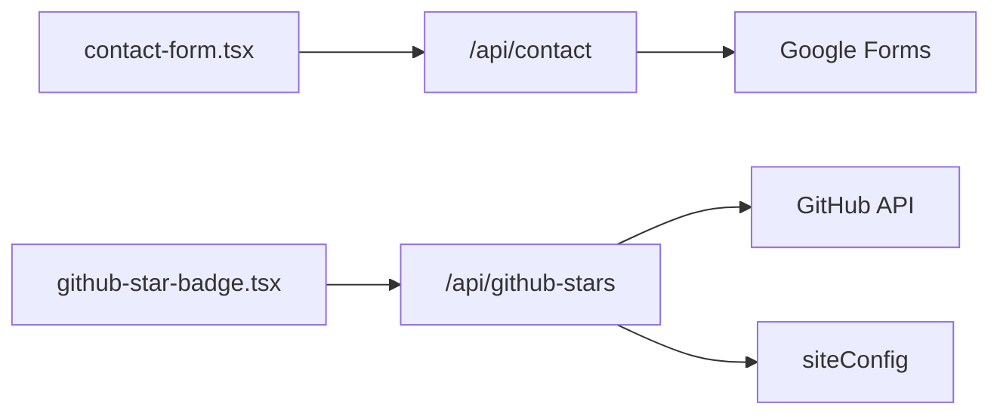

# API路由设计

<cite>
**本文引用的文件**
- [app/api/contact/route.ts](file://app/api/contact/route.ts)
- [app/api/github-stars/route.ts](file://app/api/github-stars/route.ts)
- [components/forms/contact-form.tsx](file://components/forms/contact-form.tsx)
- [components/common/github-star-badge.tsx](file://components/common/github-star-badge.tsx)
- [config/site.ts](file://config/site.ts)
- [next.config.js](file://next.config.js)
</cite>

## 目录
1. [简介](#简介)
2. [项目结构](#项目结构)
3. [核心组件](#核心组件)
4. [架构总览](#架构总览)
5. [详细组件分析](#详细组件分析)
6. [依赖关系分析](#依赖关系分析)
7. [性能考量](#性能考量)
8. [故障排查指南](#故障排查指南)
9. [结论](#结论)
10. [附录：最佳实践与示例](#附录：最佳实践与示例)

## 简介
本文件聚焦于Next.js应用中的API路由设计与实现，围绕两个关键端点展开：联系表单API（/api/contact）与GitHub Stars API（/api/github-stars）。文档将解释请求处理流程、表单验证、错误处理、外部服务集成（Google Forms、GitHub API）、缓存策略以及RESTful命名规范，并提供扩展新端点的实践建议。

## 项目结构
API路由采用Next.js App Router的约定式路由组织方式，位于app/api目录下，每个子目录对应一个API资源，并在该目录下定义route.ts以暴露HTTP方法处理器。前端通过React组件调用这些API，形成“前端表单/展示 → Next.js API → 第三方服务”的数据流。

图表来源
- [components/forms/contact-form.tsx:48-71](file://components/forms/contact-form.tsx#L48-L71)
- [app/api/contact/route.ts:3-30](file://app/api/contact/route.ts#L3-L30)
- [components/common/github-star-badge.tsx:17-36](file://components/common/github-star-badge.tsx#L17-L36)
- [app/api/github-stars/route.ts:34-43](file://app/api/github-stars/route.ts#L34-L43)

章节来源
- [app/api/contact/route.ts:1-31](file://app/api/contact/route.ts#L1-L31)
- [app/api/github-stars/route.ts:1-44](file://app/api/github-stars/route.ts#L1-L44)
- [components/forms/contact-form.tsx:1-142](file://components/forms/contact-form.tsx#L1-L142)
- [components/common/github-star-badge.tsx:1-63](file://components/common/github-star-badge.tsx#L1-L63)

## 核心组件
- 联系表单组件：使用Zod进行字段校验，结合react-hook-form管理状态，提交时调用/api/contact。
- GitHub Star徽章组件：在客户端发起GET /api/github-stars获取仓库星标数并展示。
- 联系表单API：接收JSON数据，读取环境变量配置，构造Google Forms提交URL并转发数据。
- GitHub Stars API：从siteConfig解析仓库地址，调用GitHub API获取星标数，并使用Next.js ISR进行服务端缓存。

章节来源
- [components/forms/contact-form.tsx:21-71](file://components/forms/contact-form.tsx#L21-L71)
- [components/common/github-star-badge.tsx:14-36](file://components/common/github-star-badge.tsx#L14-L36)
- [app/api/contact/route.ts:3-30](file://app/api/contact/route.ts#L3-L30)
- [app/api/github-stars/route.ts:7-43](file://app/api/github-stars/route.ts#L7-L43)
- [config/site.ts:8-12](file://config/site.ts#L8-L12)

## 架构总览
整体数据流遵循“前端校验 → API路由中转 → 第三方服务”的模式：
- 联系表单：前端完成Zod校验后，POST JSON至/api/contact；后端读取环境变量，拼接Google Forms formResponse URL并发起fetch；成功返回统一响应。
- GitHub Stars：前端组件在useEffect中调用/api/github-stars；后端根据siteConfig解析仓库路径，调用GitHub API，并通过next.revalidate设置ISR缓存时间；返回包含仓库信息与星标数的JSON。

图表来源
- [components/forms/contact-form.tsx:48-71](file://components/forms/contact-form.tsx#L48-L71)
- [app/api/contact/route.ts:3-30](file://app/api/contact/route.ts#L3-L30)

图表来源
- [components/common/github-star-badge.tsx:17-36](file://components/common/github-star-badge.tsx#L17-L36)
- [app/api/github-stars/route.ts:7-43](file://app/api/github-stars/route.ts#L7-L43)
- [config/site.ts:8-12](file://config/site.ts#L8-L12)

## 详细组件分析

### 联系表单API（/api/contact）
- 输入与校验
  - 前端使用Zod对name、email、message、social进行校验，确保最小长度、邮箱格式、可选URL等规则。
  - 后端直接消费已校验的JSON体，避免重复校验逻辑。
- 环境变量与配置
  - 通过process.env读取Google Forms的表单链接与各字段ID，用于构建formResponse URL。
- 数据处理与外部集成
  - 将表单字段作为查询参数拼接到Google Forms的formResponse URL，发起GET请求完成提交。
- 错误处理
  - 未配置环境变量时返回500并提示配置缺失。
  - 捕获异常并返回500内部错误。
- 响应格式
  - 成功返回简单文本消息，便于前端判断并触发后续交互（如弹窗）。

图表来源
- [app/api/contact/route.ts:3-30](file://app/api/contact/route.ts#L3-L30)

章节来源
- [components/forms/contact-form.tsx:21-71](file://components/forms/contact-form.tsx#L21-L71)
- [app/api/contact/route.ts:3-30](file://app/api/contact/route.ts#L3-L30)

### GitHub Stars API（/api/github-stars）
- 仓库解析
  - 从siteConfig.links.templateRepo解析出owner/repo字符串，提供容错回退。
- 外部API调用
  - 调用GitHub REST API获取仓库信息，设置Accept头为github+json。
  - 使用next.revalidate=6小时进行服务端ISR缓存，降低频繁请求带来的限流风险。
- 错误处理
  - 当GitHub API不可用或返回非2xx时，返回null值，保证接口稳定。
- 响应格式
  - 返回包含仓库名称、链接与星标数的JSON对象，便于前端渲染。

图表来源
- [app/api/github-stars/route.ts:7-43](file://app/api/github-stars/route.ts#L7-L43)
- [config/site.ts:8-12](file://config/site.ts#L8-L12)

章节来源
- [app/api/github-stars/route.ts:7-43](file://app/api/github-stars/route.ts#L7-L43)
- [components/common/github-star-badge.tsx:17-36](file://components/common/github-star-badge.tsx#L17-L36)
- [config/site.ts:8-12](file://config/site.ts#L8-L12)

### 前端集成要点
- 联系表单
  - 使用Zod + react-hook-form进行表单校验与状态管理。
  - 提交成功后重置表单并弹出感谢弹窗。
- GitHub Star徽章
  - 在useEffect中发起GET请求，使用no-store避免浏览器缓存干扰。
  - 失败时静默忽略，保持UI可用。

章节来源
- [components/forms/contact-form.tsx:48-71](file://components/forms/contact-form.tsx#L48-L71)
- [components/common/github-star-badge.tsx:17-36](file://components/common/github-star-badge.tsx#L17-L36)

## 依赖关系分析
- 模块耦合
  - contact API仅依赖NextResponse与环境变量，低耦合、高内聚。
  - github-stars API依赖siteConfig与GitHub API，具备容错与缓存机制。
- 外部依赖
  - Google Forms：通过URL参数提交表单数据。
  - GitHub API：受速率限制，通过ISR缓存减少请求频率。
- CORS配置
  - next.config.js中对特定路径设置了CORS头，当前示例针对/sb-contact，不影响现有API路由。

图表来源
- [components/forms/contact-form.tsx:48-71](file://components/forms/contact-form.tsx#L48-L71)
- [app/api/contact/route.ts:3-30](file://app/api/contact/route.ts#L3-L30)
- [components/common/github-star-badge.tsx:17-36](file://components/common/github-star-badge.tsx#L17-L36)
- [app/api/github-stars/route.ts:7-43](file://app/api/github-stars/route.ts#L7-L43)
- [config/site.ts:8-12](file://config/site.ts#L8-L12)
- [next.config.js:3-21](file://next.config.js#L3-L21)

章节来源
- [next.config.js:3-21](file://next.config.js#L3-L21)

## 性能考量
- 缓存策略
  - GitHub Stars API使用next.revalidate=6小时进行服务端ISR缓存，显著降低外部API调用次数，提升响应速度并规避限流。
  - 前端组件使用no-store确保每次加载都拉取最新数据，适合需要实时性的场景。
- 请求优化
  - 表单提交在前端完成严格校验，减少无效请求。
  - 后端对Google Forms的请求为一次性GET，无复杂计算。
- 可扩展性
  - 环境变量集中管理，便于多环境部署。
  - 模块化路由结构清晰，易于新增端点。

[本节为通用性能指导，不直接分析具体文件]

## 故障排查指南
- 联系表单无法提交
  - 检查环境变量是否配置完整（表单链接与各字段ID）。
  - 确认Google Forms字段ID与实际表单一致。
  - 查看后端日志输出，定位网络错误或参数问题。
- GitHub Stars不显示或为null
  - 检查siteConfig.links.templateRepo是否正确。
  - 观察GitHub API返回状态码，若不可用则stars为null属预期行为。
  - 确认前端组件是否正确处理null情况。
- CORS相关报错
  - 如需跨域访问，参考next.config.js中的headers配置模式，为目标路径添加必要的CORS头。

章节来源
- [app/api/contact/route.ts:3-30](file://app/api/contact/route.ts#L3-L30)
- [app/api/github-stars/route.ts:17-32](file://app/api/github-stars/route.ts#L17-L32)
- [next.config.js:3-21](file://next.config.js#L3-L21)

## 结论
本项目采用Next.js App Router的API路由模式，实现了简洁高效的联系表单与GitHub Stars功能。通过前端校验、环境变量配置、外部服务集成与服务端缓存，保证了良好的用户体验与系统稳定性。建议在后续扩展中继续遵循RESTful命名规范、完善错误处理与监控告警，以提升可维护性与可靠性。

[本节为总结性内容，不直接分析具体文件]

## 附录：最佳实践与示例

### RESTful命名规范
- 资源导向：使用名词复数表示集合，单数表示单个资源（例如：/api/projects、/api/projects/[id]）。
- 动词语义：使用HTTP方法表达操作意图（GET读取、POST创建、PUT/PATCH更新、DELETE删除）。
- 版本控制：必要时在路径中包含版本号（例如：/api/v1/...），便于向后兼容。

[本节为概念性指导，不直接分析具体文件]

### 创建新的API端点示例（步骤）
- 新建路由文件
  - 在app/api下按资源名创建目录，并添加route.ts文件。
- 定义HTTP方法
  - 导出对应的异步函数（GET/POST/PUT/PATCH/DELETE），接收Request并返回NextResponse。
- 输入校验
  - 在后端再次校验请求体（即使前端已校验），推荐使用Zod或类似库。
- 业务逻辑
  - 读取环境变量、调用外部服务、执行业务处理。
- 错误处理
  - 区分客户端错误（4xx）与服务端错误（5xx），返回明确的错误信息。
- 响应格式
  - 统一JSON结构，包含数据、状态码与提示信息。

章节来源
- [app/api/contact/route.ts:3-30](file://app/api/contact/route.ts#L3-L30)
- [app/api/github-stars/route.ts:34-43](file://app/api/github-stars/route.ts#L34-L43)

### 处理不同类型请求的示例
- GET：读取数据（如GitHub Stars API）
  - 从配置或数据库获取数据，返回JSON。
- POST：创建资源（如联系表单）
  - 解析请求体，校验数据，调用外部服务，返回结果。
- PUT/PATCH：更新资源
  - 识别资源标识，校验更新字段，执行更新并返回新状态。
- DELETE：删除资源
  - 校验权限与资源存在性，执行删除并返回确认信息。

[本节为概念性指导，不直接分析具体文件]