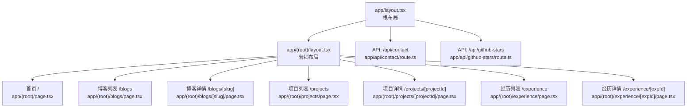
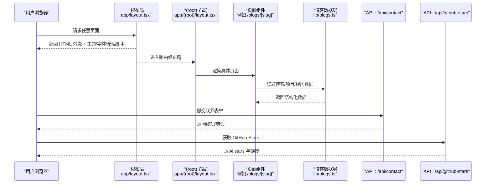
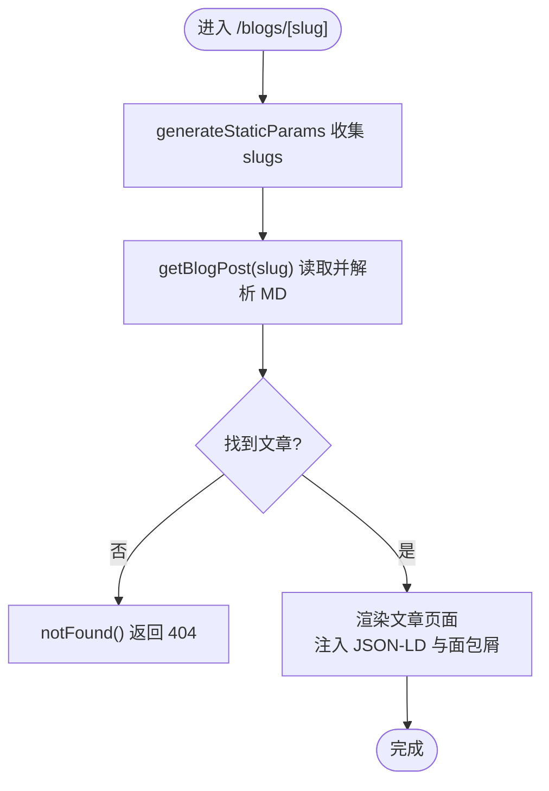
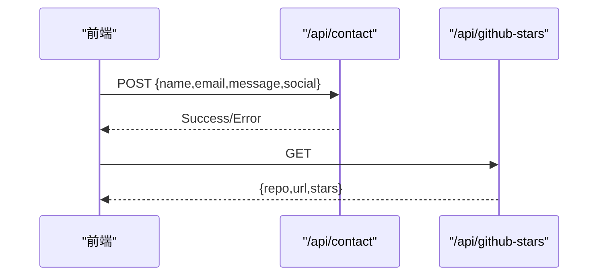
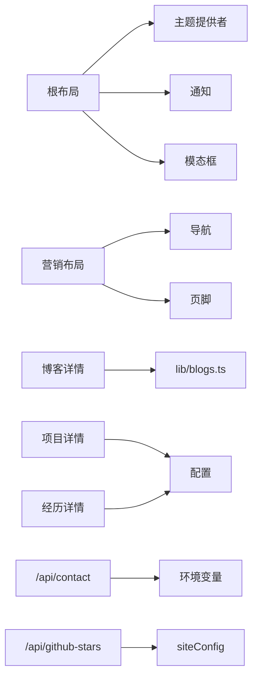

# 应用目录结构

<cite>
**本文引用的文件**
- [app/layout.tsx](file://app/layout.tsx)
- [app/(root)/layout.tsx](file://app/(root)/layout.tsx)
- [app/(root)/page.tsx](file://app/(root)/page.tsx)
- [app/(root)/blogs/page.tsx](file://app/(root)/blogs/page.tsx)
- [app/(root)/blogs/[slug]/page.tsx](file://app/(root)/blogs/[slug]/page.tsx)
- [app/(root)/projects/page.tsx](file://app/(root)/projects/page.tsx)
- [app/(root)/projects/[projectId]/page.tsx](file://app/(root)/projects/[projectId]/page.tsx)
- [app/(root)/experience/page.tsx](file://app/(root)/experience/page.tsx)
- [app/(root)/experience/[expId]/page.tsx](file://app/(root)/experience/[expId]/page.tsx)
- [app/api/contact/route.ts](file://app/api/contact/route.ts)
- [app/api/github-stars/route.ts](file://app/api/github-stars/route.ts)
- [config/routes.ts](file://config/routes.ts)
- [lib/blogs.ts](file://lib/blogs.ts)
</cite>

## 目录
1. [简介](#简介)
2. [项目结构](#项目结构)
3. [核心组件](#核心组件)
4. [架构总览](#架构总览)
5. [详细组件分析](#详细组件分析)
6. [依赖关系分析](#依赖关系分析)
7. [性能考量](#性能考量)
8. [故障排查指南](#故障排查指南)
9. [结论](#结论)
10. [附录](#附录)

## 简介
本文件聚焦于 Next.js App Router 的目录组织与最佳实践，围绕 app 目录的结构、根布局与路由组设计、API 路由命名规范、(app) 路由组的用途与优势、页面与服务端组件的使用方式，以及嵌套路由、动态路由、并行路由的实现进行系统化说明。文档结合仓库中的实际代码路径与实现细节，帮助读者快速理解并落地到复杂页面结构与 API 接口组织。

## 项目结构
该 Next.js 项目采用 App Router 约定式路由：
- app 为路由根目录，包含全局布局、站点级元数据、公共样式与清单等。
- (root) 路由组用于承载营销/展示类页面，提供统一的头部导航、页脚与主题切换等布局。
- api 目录定义服务端 API 路由，按功能模块划分子目录（如 contact、github-stars）。
- 各业务页面以文件夹形式组织，支持静态列表页与动态详情页（使用方括号命名的动态段）。

图表来源
- [app/layout.tsx:1-145](file://app/layout.tsx#L1-L145)
- [app/(root)/layout.tsx:1-33](file://app/(root)/layout.tsx#L1-L33)
- [app/(root)/page.tsx:1-357](file://app/(root)/page.tsx#L1-L357)
- [app/(root)/blogs/page.tsx:1-153](file://app/(root)/blogs/page.tsx#L1-L153)
- [app/(root)/blogs/[slug]/page.tsx:1-325](file://app/(root)/blogs/[slug]/page.tsx#L1-L325)
- [app/(root)/projects/page.tsx:1-59](file://app/(root)/projects/page.tsx#L1-L59)
- [app/(root)/projects/[projectId]/page.tsx:1-159](file://app/(root)/projects/[projectId]/page.tsx#L1-L159)
- [app/(root)/experience/page.tsx:1-34](file://app/(root)/experience/page.tsx#L1-L34)
- [app/(root)/experience/[expId]/page.tsx:1-221](file://app/(root)/experience/[expId]/page.tsx#L1-L221)
- [app/api/contact/route.ts:1-31](file://app/api/contact/route.ts#L1-L31)
- [app/api/github-stars/route.ts:1-44](file://app/api/github-stars/route.ts#L1-L44)

章节来源
- [app/layout.tsx:1-145](file://app/layout.tsx#L1-L145)
- [app/(root)/layout.tsx:1-33](file://app/(root)/layout.tsx#L1-L33)
- [config/routes.ts:1-29](file://config/routes.ts#L1-L29)

## 核心组件
- 根布局（Root Layout）
  - 负责全局 HTML 外壳、字体注入、主题提供者、全局通知与第三方脚本、SEO 元信息配置等。
  - 通过导出 metadata 统一站点标题模板、描述、Open Graph/Twitter 卡片、图标与 robots 策略。
- 营销布局（Marketing Layout）
  - 在 (root) 路由组内提供统一头部导航、GitHub Star 徽章、模式切换、主内容区与页脚。
  - 所有位于 (root) 下的页面自动复用该布局。
- 页面组件
  - 列表页与详情页均为服务端组件，按需读取数据、生成 SEO 元信息与结构化数据。
  - 通过 ClientPageWrapper 包裹交互性较强的区域，兼顾 SSR 与客户端交互。
- API 路由
  - 按功能模块组织，暴露 GET/POST 等方法，返回 JSON 或重定向响应。
  - 使用环境变量与外部服务集成（如 Google Form、GitHub API），并设置缓存策略。

章节来源
- [app/layout.tsx:1-145](file://app/layout.tsx#L1-L145)
- [app/(root)/layout.tsx:1-33](file://app/(root)/layout.tsx#L1-L33)
- [app/(root)/page.tsx:1-357](file://app/(root)/page.tsx#L1-L357)
- [app/api/contact/route.ts:1-31](file://app/api/contact/route.ts#L1-L31)
- [app/api/github-stars/route.ts:1-44](file://app/api/github-stars/route.ts#L1-L44)

## 架构总览
下图展示了从浏览器请求到页面渲染与 API 调用的整体流程，包括布局嵌套、路由匹配、服务端数据获取与缓存策略。

图表来源
- [app/layout.tsx:1-145](file://app/layout.tsx#L1-L145)
- [app/(root)/layout.tsx:1-33](file://app/(root)/layout.tsx#L1-L33)
- [app/(root)/blogs/[slug]/page.tsx:1-325](file://app/(root)/blogs/[slug]/page.tsx#L1-L325)
- [lib/blogs.ts:1-97](file://lib/blogs.ts#L1-L97)
- [app/api/contact/route.ts:1-31](file://app/api/contact/route.ts#L1-L31)
- [app/api/github-stars/route.ts:1-44](file://app/api/github-stars/route.ts#L1-L44)

## 详细组件分析

### 根布局与站点级元数据
- 职责
  - 注入全局 CSS、字体变量、主题提供者、Toaster、ModalProvider、Google Analytics 与第三方脚本。
  - 定义站点级 metadata：标题模板、描述、作者、Open Graph/Twitter 卡片、图标、robots 策略、验证信息等。
- 关键点
  - 通过环境变量校验必要配置（如 GA ID），缺失时抛出错误，便于早期发现配置问题。
  - 使用 cn 工具类组合 body 样式，确保主题变量生效。

章节来源
- [app/layout.tsx:1-145](file://app/layout.tsx#L1-L145)

### 路由组 (root) 与营销布局
- 职责
  - 提供统一头部导航、GitHub Star 徽章、模式切换、主内容容器与页脚。
  - 集中管理站点导航项，便于维护与扩展。
- 关键点
  - 所有位于 (root) 下的页面自动继承该布局，减少重复代码。
  - 导航项来自 routesConfig，便于集中配置。

章节来源
- [app/(root)/layout.tsx:1-33](file://app/(root)/layout.tsx#L1-L33)
- [config/routes.ts:1-29](file://config/routes.ts#L1-L29)

### 首页与内容区块组织
- 职责
  - 聚合展示项目、经历、贡献、技能、博客与联系方式等核心板块。
  - 为每个区块注入结构化数据（JSON-LD）以提升 SEO。
- 关键点
  - 使用动画组件与懒加载提升首屏体验。
  - 通过 ClientPageWrapper 包裹需要客户端交互的区域。

章节来源
- [app/(root)/page.tsx:1-357](file://app/(root)/page.tsx#L1-L357)

### 博客系统：列表与详情
- 列表页
  - 读取所有博客元数据，渲染网格卡片，并提供集合型结构化数据与面包屑。
- 详情页
  - 基于 slug 动态渲染文章，生成文章级结构化数据与面包屑。
  - 使用 generateStaticParams 预生成静态参数，提升构建期效率。
  - 若文章不存在，调用 notFound 处理 404。
- 数据层
  - 解析 Markdown 文件，提取 frontmatter 与内容 HTML，支持阅读时间估算与精选文章筛选。

图表来源
- [app/(root)/blogs/[slug]/page.tsx:1-325](file://app/(root)/blogs/[slug]/page.tsx#L1-L325)
- [lib/blogs.ts:1-97](file://lib/blogs.ts#L1-L97)

章节来源
- [app/(root)/blogs/page.tsx:1-153](file://app/(root)/blogs/page.tsx#L1-L153)
- [app/(root)/blogs/[slug]/page.tsx:1-325](file://app/(root)/blogs/[slug]/page.tsx#L1-L325)
- [lib/blogs.ts:1-97](file://lib/blogs.ts#L1-L97)

### 项目与经历：列表与详情
- 项目列表
  - 使用标签页过滤个人/专业项目，渲染项目卡片。
- 项目详情
  - 根据 projectId 查找项目，不存在则重定向到列表页；展示技术栈、描述与页面信息。
- 经历列表
  - 以时间线形式展示职业经历。
- 经历详情
  - 根据 expId 查找经历，不存在则重定向；使用标签页展示摘要、成就与技能。

章节来源
- [app/(root)/projects/page.tsx:1-59](file://app/(root)/projects/page.tsx#L1-L59)
- [app/(root)/projects/[projectId]/page.tsx:1-159](file://app/(root)/projects/[projectId]/page.tsx#L1-L159)
- [app/(root)/experience/page.tsx:1-34](file://app/(root)/experience/page.tsx#L1-L34)
- [app/(root)/experience/[expId]/page.tsx:1-221](file://app/(root)/experience/[expId]/page.tsx#L1-L221)

### API 路由：命名规范与实现
- 命名规范
  - 按功能模块划分子目录，如 contact、github-stars。
  - 每个路由文件命名为 route.ts，并在其中导出对应 HTTP 方法函数（GET/POST 等）。
- 实现要点
  - 联系表单：读取环境变量配置 Google Form 字段，组装 URL 提交表单数据，返回成功或错误响应。
  - GitHub Stars：调用 GitHub API 获取仓库 star 数，设置 revalidate 缓存策略，返回 JSON。

图表来源
- [app/api/contact/route.ts:1-31](file://app/api/contact/route.ts#L1-L31)
- [app/api/github-stars/route.ts:1-44](file://app/api/github-stars/route.ts#L1-L44)

章节来源
- [app/api/contact/route.ts:1-31](file://app/api/contact/route.ts#L1-L31)
- [app/api/github-stars/route.ts:1-44](file://app/api/github-stars/route.ts#L1-L44)

## 依赖关系分析
- 布局依赖
  - 根布局依赖主题提供者、全局通知、模态框提供者与第三方脚本。
  - 营销布局依赖导航、模式切换、GitHub Star 徽章与页脚组件。
- 页面依赖
  - 列表页与详情页依赖配置（siteConfig、pagesConfig）、数据层（lib/blogs.ts）与 UI 组件。
- API 依赖
  - 联系表单依赖环境变量与外部 Google Form。
  - GitHub Stars 依赖 siteConfig 中的仓库链接与 GitHub API。

图表来源
- [app/layout.tsx:1-145](file://app/layout.tsx#L1-L145)
- [app/(root)/layout.tsx:1-33](file://app/(root)/layout.tsx#L1-L33)
- [app/(root)/blogs/[slug]/page.tsx:1-325](file://app/(root)/blogs/[slug]/page.tsx#L1-L325)
- [lib/blogs.ts:1-97](file://lib/blogs.ts#L1-L97)
- [app/api/contact/route.ts:1-31](file://app/api/contact/route.ts#L1-L31)
- [app/api/github-stars/route.ts:1-44](file://app/api/github-stars/route.ts#L1-L44)

章节来源
- [app/layout.tsx:1-145](file://app/layout.tsx#L1-L145)
- [app/(root)/layout.tsx:1-33](file://app/(root)/layout.tsx#L1-L33)
- [lib/blogs.ts:1-97](file://lib/blogs.ts#L1-L97)
- [app/api/contact/route.ts:1-31](file://app/api/contact/route.ts#L1-L31)
- [app/api/github-stars/route.ts:1-44](file://app/api/github-stars/route.ts#L1-L44)

## 性能考量
- 构建期优化
  - 使用 generateStaticParams 预生成博客动态路由参数，减少运行时开销。
- 缓存策略
  - API 路由中对 GitHub API 调用设置 revalidate，降低频繁请求成本。
- 资源加载
  - 图片使用 next/image 并设置 priority 与尺寸，提升首屏性能。
  - 第三方脚本通过 Script 组件控制加载时机（如 afterInteractive）。
- 首屏渲染
  - 将非关键交互区域延迟渲染或按需加载，减少初始包体积。

[本节为通用性能建议，不直接分析具体文件]

## 故障排查指南
- 环境变量缺失
  - 根布局中检查必要的环境变量（如 Google Analytics ID），缺失时会抛出错误，便于部署前发现配置问题。
- 404 与重定向
  - 博客详情页在找不到文章时调用 notFound；项目与经历详情页在找不到数据时重定向到列表页。
- API 错误处理
  - 联系表单在未配置环境变量时返回 500；网络异常时捕获错误并返回内部错误。
  - GitHub Stars 接口在请求失败时返回空值，避免崩溃。

章节来源
- [app/layout.tsx:99-103](file://app/layout.tsx#L99-L103)
- [app/(root)/blogs/[slug]/page.tsx:81-89](file://app/(root)/blogs/[slug]/page.tsx#L81-L89)
- [app/(root)/projects/[projectId]/page.tsx:23-28](file://app/(root)/projects/[projectId]/page.tsx#L23-L28)
- [app/(root)/experience/[expId]/page.tsx:59-67](file://app/(root)/experience/[expId]/page.tsx#L59-L67)
- [app/api/contact/route.ts:3-29](file://app/api/contact/route.ts#L3-L29)
- [app/api/github-stars/route.ts:17-31](file://app/api/github-stars/route.ts#L17-L31)

## 结论
本项目通过 App Router 的目录约定实现了清晰的层次化结构：根布局负责全局配置与 SEO，(root) 路由组提供统一的营销布局，页面组件与服务端数据层解耦，API 路由按功能模块化组织。借助动态路由、静态参数生成与缓存策略，项目在可维护性与性能之间取得良好平衡。遵循本文的组织原则与实践，可在复杂页面结构与 API 接口设计中保持一致性与可扩展性。

## 附录
- 路由与页面映射速查
  - 首页：/ → app/(root)/page.tsx
  - 博客列表：/blogs → app/(root)/blogs/page.tsx
  - 博客详情：/blogs/[slug] → app/(root)/blogs/[slug]/page.tsx
  - 项目列表：/projects → app/(root)/projects/page.tsx
  - 项目详情：/projects/[projectId] → app/(root)/projects/[projectId]/page.tsx
  - 经历列表：/experience → app/(root)/experience/page.tsx
  - 经历详情：/experience/[expId] → app/(root)/experience/[expId]/page.tsx
  - API：/api/contact → app/api/contact/route.ts
  - API：/api/github-stars → app/api/github-stars/route.ts

[本节为概念性总结，不直接分析具体文件]