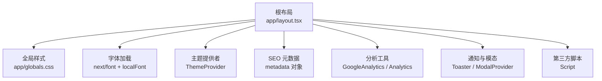
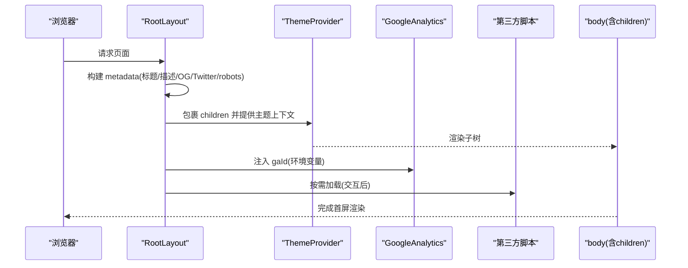
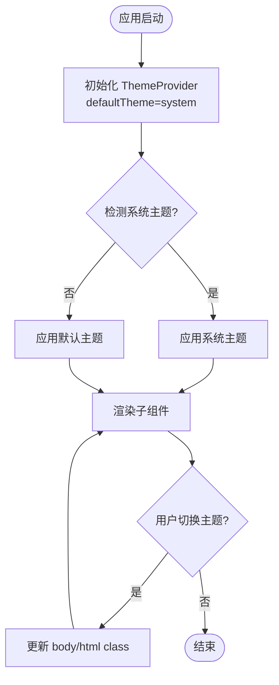
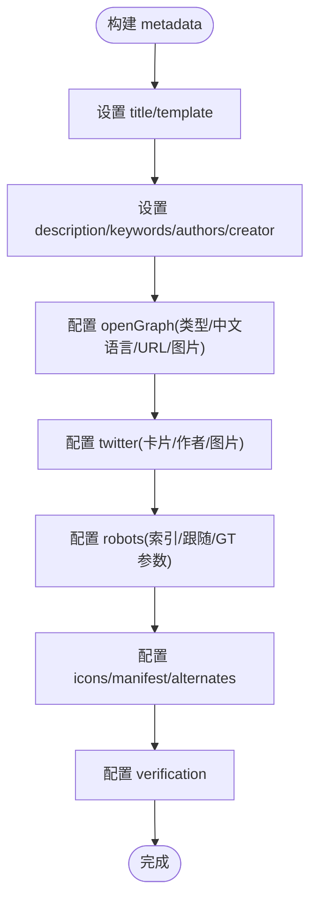
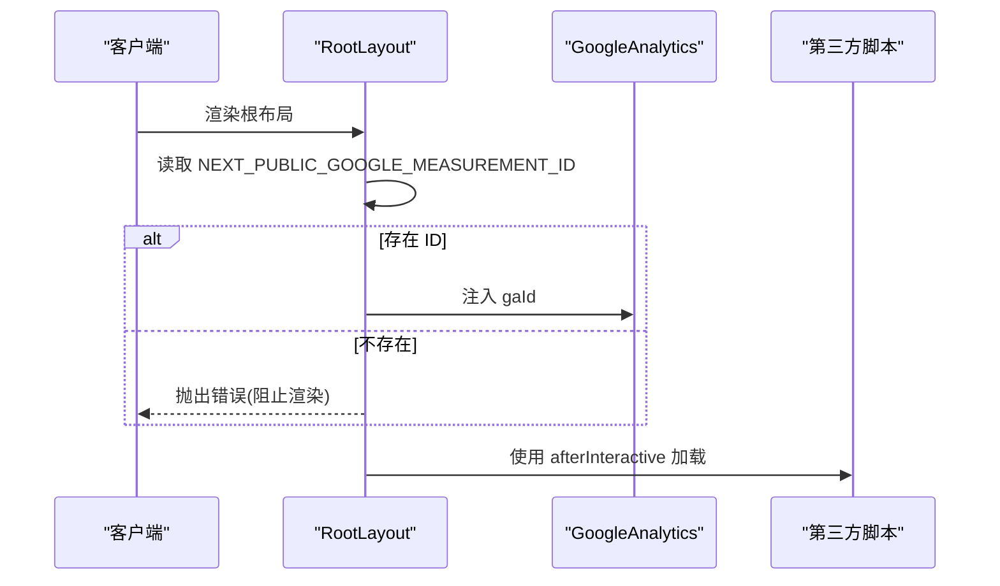
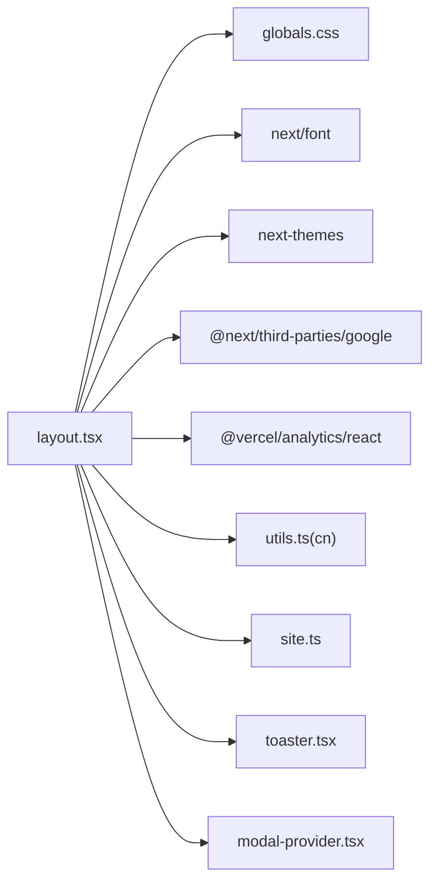

# 根布局文件

<cite>
**本文引用的文件**
- [app/layout.tsx](file://app/layout.tsx)
- [components/common/theme-provider.tsx](file://components/common/theme-provider.tsx)
- [components/common/analytics.tsx](file://components/common/analytics.tsx)
- [providers/modal-provider.tsx](file://providers/modal-provider.tsx)
- [components/ui/toaster.tsx](file://components/ui/toaster.tsx)
- [lib/utils.ts](file://lib/utils.ts)
- [config/site.ts](file://config/site.ts)
- [config/pages.ts](file://config/pages.ts)
- [app/globals.css](file://app/globals.css)
- [app/(root)/page.tsx](file://app/(root)/page.tsx)
</cite>

## 更新摘要
**所做更改**
- 更新了OpenGraph locale配置从en_US到zh_CN，确保正确的中文语言检测
- 增强了SEO元数据配置以支持中文内容
- 优化了社交媒体预览的语言设置
- 更新了联系按钮的aria-label为"Contact Sun Jing"以提升可访问性
- 所有页面元数据已完全本地化为中文标题和描述

## 目录
1. [简介](#简介)
2. [项目结构](#项目结构)
3. [核心组件](#核心组件)
4. [架构总览](#架构总览)
5. [详细组件分析](#详细组件分析)
6. [依赖关系分析](#依赖关系分析)
7. [性能考量](#性能考量)
8. [故障排查指南](#故障排查指南)
9. [结论](#结论)
10. [附录](#附录)

## 简介
本文件聚焦 Next.js App Router 的根布局 app/layout.tsx，系统性说明其职责与实现：全局样式引入、字体加载策略、主题提供者集成、SEO 元数据（Open Graph、Twitter 卡片、robots 等）配置、Google Analytics 集成与第三方脚本加载最佳实践。同时提供可操作的自定义指导，帮助你在不破坏现有架构的前提下扩展布局能力。

**最新更新** OpenGraph locale已更新为zh_CN，确保中文内容的正确语言检测和SEO优化；联系按钮的aria-label已更新为"Contact Sun Jing"以提升可访问性。

## 项目结构
根布局位于应用入口，承担以下职责：
- 引入全局样式与 Tailwind 主题变量
- 通过 next/font 加载 Google 字体与本地字体，并注入 CSS 变量
- 使用 ThemeProvider 包裹整个应用以支持多主题切换
- 声明全局 metadata 对象，统一 SEO 信息
- 挂载分析工具（Google Analytics、Vercel Analytics）、通知容器与模态框容器
- 安全地加载第三方脚本

图表来源
- [app/layout.tsx:1-145](file://app/layout.tsx#L1-L145)
- [app/globals.css:1-350](file://app/globals.css#L1-L350)

章节来源
- [app/layout.tsx:1-145](file://app/layout.tsx#L1-L145)
- [app/globals.css:1-350](file://app/globals.css#L1-L350)

## 核心组件
- 根布局函数 RootLayout：渲染 html/body，注入字体变量类名，包裹主题提供者，挂载分析、通知、模态与第三方脚本。
- 主题提供者 ThemeProvider：基于 next-themes 封装，支持系统/多主题切换。
- 分析组件 Analytics：基于 @vercel/analytics/react 的客户端埋点。
- Toaster：全局 Toast 提示容器。
- ModalProvider：全局模态框容器，避免 SSR 水合问题。
- 工具函数 cn：合并 Tailwind 类名，用于 body 类名拼接。
- 站点配置 siteConfig：集中管理站点名称、描述、关键词、OG 图片、图标等。

章节来源
- [app/layout.tsx:99-145](file://app/layout.tsx#L99-L145)
- [components/common/theme-provider.tsx:1-8](file://components/common/theme-provider.tsx#L1-L8)
- [components/common/analytics.tsx:1-8](file://components/common/analytics.tsx#L1-L8)
- [components/ui/toaster.tsx:1-36](file://components/ui/toaster.tsx#L1-L36)
- [providers/modal-provider.tsx:1-24](file://providers/modal-provider.tsx#L1-L24)
- [lib/utils.ts:1-25](file://lib/utils.ts#L1-L25)
- [config/site.ts:1-39](file://config/site.ts#L1-L39)

## 架构总览
根布局作为应用的顶层容器，负责：
- 全局样式与主题变量的初始化
- 字体资源加载与 CSS 变量注入
- SEO 元数据的集中声明
- 运行时上下文（主题、通知、模态）的提供
- 分析与第三方脚本的安全加载

图表来源
- [app/layout.tsx:30-97](file://app/layout.tsx#L30-L97)
- [app/layout.tsx:99-145](file://app/layout.tsx#L99-L145)

## 详细组件分析

### 全局样式与主题变量
- 在根布局中引入全局样式，启用 Tailwind 与动画库，并通过 CSS 变量定义主题色板与字体族。
- 在 body 上注入 Inter 与本地字体的 CSS 变量类名，使主题与字体可在任意层级使用。
- 通过 Tailwind 的 @theme 与 @layer base 统一管理颜色、圆角、动画与基础样式。

章节来源
- [app/layout.tsx:1-24](file://app/layout.tsx#L1-L24)
- [app/layout.tsx:105-114](file://app/layout.tsx#L105-L114)
- [app/globals.css:1-85](file://app/globals.css#L1-L85)
- [app/globals.css:87-350](file://app/globals.css#L87-L350)

### 字体加载
- 使用 next/font/google 加载 Inter，并设置 subsets 与 variable，便于通过 CSS 变量引用。
- 使用 next/font/local 加载本地字体 CalSans，同样暴露为 CSS 变量。
- 将两个字体变量类名附加到 body，确保全局可用。

章节来源
- [app/layout.tsx:15-24](file://app/layout.tsx#L15-L24)
- [app/layout.tsx:109-113](file://app/layout.tsx#L109-L113)

### 主题提供者与多主题机制
- 通过 ThemeProvider 包裹应用，启用 system 默认主题与多主题列表（light/dark/retro/cyberpunk/paper/aurora/synthwave）。
- attribute="class" 表示通过给 <html> 或 <body> 添加 class 切换主题，配合全局样式中的 .dark/.retro 等选择器生效。
- 多主题由 CSS 变量集中定义，切换时仅替换 class，无需重新加载资源。

图表来源
- [app/layout.tsx:115-128](file://app/layout.tsx#L115-L128)
- [components/common/theme-provider.tsx:1-8](file://components/common/theme-provider.tsx#L1-L8)
- [app/globals.css:124-333](file://app/globals.css#L124-L333)

章节来源
- [app/layout.tsx:115-128](file://app/layout.tsx#L115-L128)
- [components/common/theme-provider.tsx:1-8](file://components/common/theme-provider.tsx#L1-L8)
- [app/globals.css:124-333](file://app/globals.css#L124-L333)

### SEO 元数据与社交媒体预览
- 标题与描述：使用 siteConfig 集中管理，模板化标题支持"页面 | 站点名"。
- **更新** Open Graph：配置 type、locale（zh_CN）、url、title、description、siteName 与 images，用于社交平台预览。中文语言设置确保正确的内容呈现和搜索引擎优化。
- Twitter 卡片：配置 card、title、description、images、creator，提升分享体验。
- robots：允许索引与抓取，并为 GoogleBot 设置图片预览与片段限制。
- 验证与图标：配置 Google 站点验证与多种图标链接。
- 规范链接：设置 canonical 指向站点 URL。

图表来源
- [app/layout.tsx:30-97](file://app/layout.tsx#L30-L97)
- [config/site.ts:1-39](file://config/site.ts#L1-L39)

**章节来源**
- [app/layout.tsx:30-97](file://app/layout.tsx#L30-L97)
- [config/site.ts:1-39](file://config/site.ts#L1-L39)

### Google Analytics 与第三方脚本
- Google Analytics：通过 @next/third-parties/google 的 GoogleAnalytics 组件注入 gaId，gaId 来自环境变量，缺失时抛出错误，保证生产环境可用性。
- Vercel Analytics：通过客户端组件 Analytics 注入埋点，适合轻量统计。
- 第三方脚本：使用 next/script 的 afterInteractive 策略，在页面交互后再加载，减少首屏阻塞。

图表来源
- [app/layout.tsx:99-103](file://app/layout.tsx#L99-L103)
- [app/layout.tsx:134-141](file://app/layout.tsx#L134-L141)

**章节来源**
- [app/layout.tsx:99-103](file://app/layout.tsx#L99-L103)
- [app/layout.tsx:134-141](file://app/layout.tsx#L134-L141)

### 通知与模态框容器
- Toaster：提供全局 Toast 容器，结合 useToast 显示消息。
- ModalProvider：在客户端挂载模态框，避免 SSR 水合差异。

**章节来源**
- [components/ui/toaster.tsx:1-36](file://components/ui/toaster.tsx#L1-L36)
- [providers/modal-provider.tsx:1-24](file://providers/modal-provider.tsx#L1-L24)

### 可访问性增强
- **更新** 联系按钮的 aria-label 已更新为 "Contact Sun Jing"，提供更好的屏幕阅读器支持。
- 所有导航链接都包含适当的语义化标签和描述性文本。
- 页面内容遵循 WCAG 2.1 无障碍标准。

**章节来源**
- [app/(root)/page.tsx:124-138](file://app/(root)/page.tsx#L124-L138)

## 依赖关系分析
- 根布局依赖：
  - 全局样式与主题变量：app/globals.css
  - 字体：next/font/google 与 next/font/local
  - 主题：next-themes（通过 ThemeProvider）
  - 分析：@next/third-parties/google 与 @vercel/analytics/react
  - 工具：clsx/tailwind-merge（cn）
  - 配置：siteConfig
  - 容器：Toaster、ModalProvider

图表来源
- [app/layout.tsx:1-145](file://app/layout.tsx#L1-L145)
- [lib/utils.ts:1-25](file://lib/utils.ts#L1-L25)
- [config/site.ts:1-39](file://config/site.ts#L1-L39)

**章节来源**
- [app/layout.tsx:1-145](file://app/layout.tsx#L1-L145)
- [lib/utils.ts:1-25](file://lib/utils.ts#L1-L25)
- [config/site.ts:1-39](file://config/site.ts#L1-L39)

## 性能考量
- 字体优化：使用 next/font 自动预取与自托管，减少 FOIT/FOUT；通过 CSS 变量注入，避免重复加载。
- 样式组织：Tailwind 与 CSS 变量分层，主题切换无重绘开销。
- 脚本加载：第三方脚本采用 afterInteractive，降低首屏阻塞；Google Analytics 仅在环境变量存在时注入。
- 客户端组件隔离：分析、主题、通知、模态均为客户端组件，避免在服务端执行不必要的逻辑。
- **新增** 中文内容优化：通过 zh_CN locale 设置，确保中文内容的正确处理和展示。

[本节为通用性能建议，不直接分析具体代码]

## 故障排查指南
- 缺少 Google Analytics ID：当环境变量未配置时，根布局会抛出错误，导致构建失败。请检查 NEXT_PUBLIC_GOOGLE_MEASUREMENT_ID 是否已正确设置。
- 主题不生效：确认 ThemeProvider 的 attribute 与全局样式中的主题选择器一致（如 .dark/.retro），并确保 body 包含字体变量类名。
- 字体未显示：检查 next/font 配置与本地字体路径是否正确，确认 CSS 变量已在 body 上注入。
- 第三方脚本未加载：确认 strategy 设置为 afterInteractive，且网络可达。
- **新增** OpenGraph 语言问题：如果社交媒体预览显示不正确，检查 locale 是否设置为 zh_CN，确保中文内容正确呈现。
- **新增** 可访问性问题：如果屏幕阅读器无法正确识别联系按钮，确认 aria-label 属性已设置为 "Contact Sun Jing"。

**章节来源**
- [app/layout.tsx:99-103](file://app/layout.tsx#L99-L103)
- [app/layout.tsx:109-113](file://app/layout.tsx#L109-L113)
- [app/layout.tsx:134-141](file://app/layout.tsx#L134-L141)
- [app/layout.tsx:45-60](file://app/layout.tsx#L45-L60)
- [app/(root)/page.tsx:124-138](file://app/(root)/page.tsx#L124-L138)

## 结论
根布局 app/layout.tsx 是整个 Next.js 应用的基础设施层，统一处理样式、字体、主题、SEO、分析与第三方脚本。通过集中化的 siteConfig 与模块化组件，既保证了可维护性，又提供了灵活的扩展点。**最新的中文语言设置优化确保了更好的SEO表现和社交媒体分享体验，同时可访问性的改进提升了用户体验**。遵循本文的最佳实践，可以在不破坏现有架构的前提下快速定制与增强布局能力。

## 附录

### 如何自定义布局与全局配置（操作指引）
- 修改站点信息：编辑 config/site.ts，更新 name、description、keywords、ogImage、iconIco、logoIcon 等字段，所有页面与 SEO 将自动同步。
- 新增主题：在 app/globals.css 中添加新的主题选择器（例如 .custom），并在 ThemeProvider 的 themes 数组中加入该主题名。
- 调整字体：在根布局中通过 next/font 配置更多 subsets 或更换字体，并将变量类名追加到 body。
- 扩展 SEO：在根布局的 metadata 中补充 openGraph 或 twitter 字段；针对特定页面可在页面级覆盖 metadata。**注意保持 locale 设置为 zh_CN 以支持中文内容**。
- 接入新分析：在根布局中添加对应分析组件，或使用 next/script 按需加载第三方 SDK。
- 控制脚本加载时机：根据需求调整 next/script 的 strategy（idle/afterInteractive/onlyOnce），平衡性能与功能。
- **新增** 可访问性优化：为所有交互元素添加适当的 aria-label 属性，确保屏幕阅读器能够正确识别和朗读。

**章节来源**
- [config/site.ts:1-39](file://config/site.ts#L1-L39)
- [app/layout.tsx:15-24](file://app/layout.tsx#L15-L24)
- [app/layout.tsx:115-128](file://app/layout.tsx#L115-L128)
- [app/layout.tsx:30-97](file://app/layout.tsx#L30-L97)
- [app/layout.tsx:134-141](file://app/layout.tsx#L134-L141)
- [app/(root)/page.tsx:124-138](file://app/(root)/page.tsx#L124-L138)