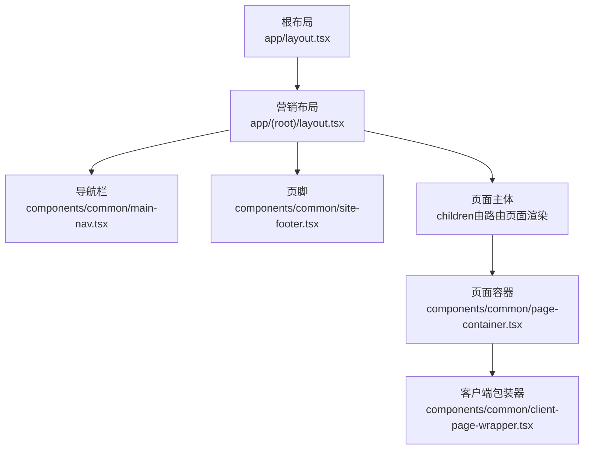
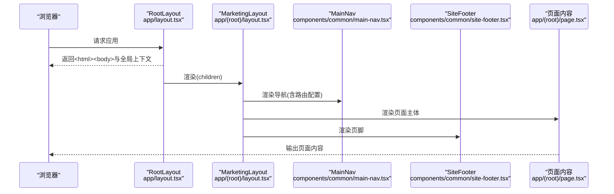
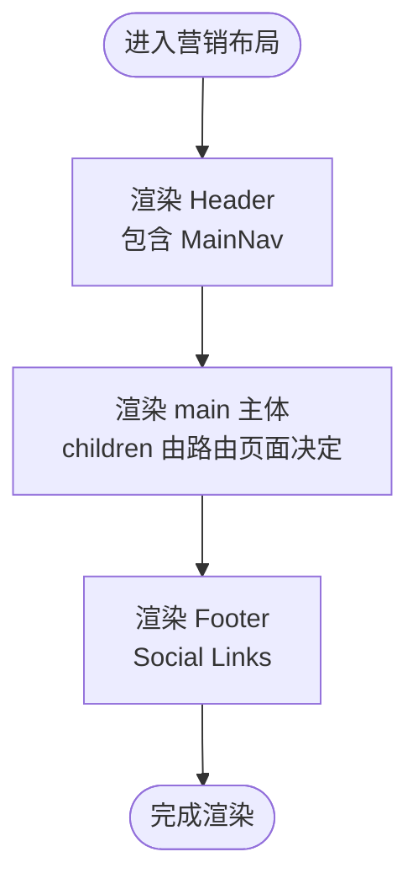
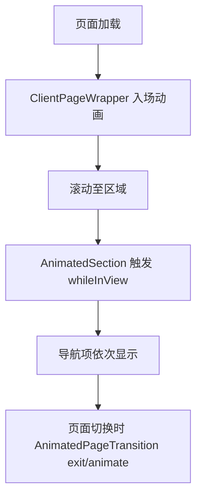
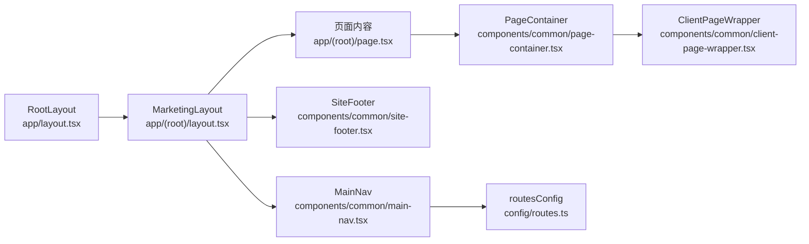

# 营销布局

<cite>
**本文引用的文件**
- [app/layout.tsx](file://app/layout.tsx)
- [app/(root)/layout.tsx](file://app/(root)/layout.tsx)
- [components/common/main-nav.tsx](file://components/common/main-nav.tsx)
- [components/common/site-footer.tsx](file://components/common/site-footer.tsx)
- [components/common/page-container.tsx](file://components/common/page-container.tsx)
- [components/common/client-page-wrapper.tsx](file://components/common/client-page-wrapper.tsx)
- [components/common/animated-page-transition.tsx](file://components/common/animated-page-transition.tsx)
- [providers/animation-provider.tsx](file://providers/animation-provider.tsx)
- [config/routes.ts](file://config/routes.ts)
- [app/(root)/page.tsx](file://app/(root)/page.tsx)
</cite>

## 目录
1. [简介](#简介)
2. [项目结构](#项目结构)
3. [核心组件](#核心组件)
4. [架构总览](#架构总览)
5. [详细组件分析](#详细组件分析)
6. [依赖关系分析](#依赖关系分析)
7. [性能考量](#性能考量)
8. [故障排查指南](#故障排查指南)
9. [结论](#结论)
10. [附录：扩展与自定义示例](#附录扩展与自定义示例)

## 简介
本文件围绕 Next.js App Router 的营销型站点布局进行系统化说明，重点包括：
- (app) 路由组的作用与优势，以及如何用它组织页面结构
- 营销布局的实现：导航栏、页脚、页面容器的集成方式
- 客户端组件与服务端组件的使用场景与最佳实践
- 动画过渡效果的实现机制
- 如何扩展和自定义营销布局（提供具体代码路径）

## 项目结构
该项目的营销布局基于 Next.js App Router 的分层布局模式：
- 根布局 app/layout.tsx：负责全局 HTML 外壳、主题、全局脚本、元数据等
- 营销布局 app/(root)/layout.tsx：为 (root) 路由组下的所有页面提供统一的头部、主体、页脚容器
- 页面级内容通过各路由下的 page.tsx 组合业务组件与通用 UI 组件

图表来源
- [app/layout.tsx:99-144](file://app/layout.tsx#L99-L144)
- [app/(root)/layout.tsx:11-32](file://app/(root)/layout.tsx#L11-L32)
- [components/common/main-nav.tsx:40-104](file://components/common/main-nav.tsx#L40-L104)
- [components/common/site-footer.tsx:9-33](file://components/common/site-footer.tsx#L9-L33)
- [components/common/page-container.tsx:11-26](file://components/common/page-container.tsx#L11-L26)
- [components/common/client-page-wrapper.tsx:25-36](file://components/common/client-page-wrapper.tsx#L25-L36)

章节来源
- [app/layout.tsx:99-144](file://app/layout.tsx#L99-L144)
- [app/(root)/layout.tsx:11-32](file://app/(root)/layout.tsx#L11-L32)

## 核心组件
- 根布局 RootLayout：定义全局样式、字体、主题提供者、全局脚本与元信息，确保全站一致的基础体验。
- 营销布局 MarketingLayout：在 (root) 路由组下统一渲染 Header、Main、Footer，并注入导航项与工具按钮。
- 主导航 MainNav：响应式导航，支持桌面/移动端菜单切换、当前段高亮、动效与链接禁用态。
- 页脚 SiteFooter：展示社交链接与工具提示。
- 页面容器 PageContainer：封装页面标题区与内容区，并通过 ClientPageWrapper 包裹以启用入场动画。
- 客户端包装器 ClientPageWrapper：使用 motion/react 提供页面进入动画。
- 页面过渡 AnimatedPageTransition：用于页面间切换时的进入/退出动画（可配合路由或框架能力使用）。

章节来源
- [app/layout.tsx:99-144](file://app/layout.tsx#L99-L144)
- [app/(root)/layout.tsx:11-32](file://app/(root)/layout.tsx#L11-L32)
- [components/common/main-nav.tsx:40-104](file://components/common/main-nav.tsx#L40-L104)
- [components/common/site-footer.tsx:9-33](file://components/common/site-footer.tsx#L9-L33)
- [components/common/page-container.tsx:11-26](file://components/common/page-container.tsx#L11-L26)
- [components/common/client-page-wrapper.tsx:25-36](file://components/common/client-page-wrapper.tsx#L25-L36)
- [components/common/animated-page-transition.tsx:33-47](file://components/common/animated-page-transition.tsx#L33-L47)

## 架构总览
下图展示了从根布局到营销布局再到页面内容的渲染链路，以及导航与页脚的挂载位置。

图表来源
- [app/layout.tsx:99-144](file://app/layout.tsx#L99-L144)
- [app/(root)/layout.tsx:11-32](file://app/(root)/layout.tsx#L11-L32)
- [components/common/main-nav.tsx:40-104](file://components/common/main-nav.tsx#L40-L104)
- [components/common/site-footer.tsx:9-33](file://components/common/site-footer.tsx#L9-L33)
- [app/(root)/page.tsx:37-356](file://app/(root)/page.tsx#L37-L356)

## 详细组件分析

### (app) 路由组的作用与优势
- 作用：将一组共享相同布局的页面放入同一命名空间，便于复用 layout.tsx，避免重复代码。
- 优势：
  - 集中管理公共 UI（如导航、页脚），降低耦合度
  - 提升可维护性：新增页面只需放在对应路由组内即可自动继承布局
  - 更好的分组语义：便于按功能域划分路由结构

在本项目中，(root) 路由组承载了首页与主要业务页面，统一由 app/(root)/layout.tsx 提供营销布局。

章节来源
- [app/(root)/layout.tsx:11-32](file://app/(root)/layout.tsx#L11-L32)

### 营销布局实现：导航栏、页脚、页面容器
- 导航栏 MainNav：
  - 数据来源：routesConfig.mainNav，集中管理导航项
  - 交互：移动端菜单开关、当前段高亮、悬停/点击动效
  - 响应式：桌面显示完整导航，移动端显示汉堡菜单
- 页脚 SiteFooter：
  - 展示社交图标与链接，配合 CustomTooltip 提供友好提示
- 页面容器 PageContainer：
  - 统一页面标题与描述区域
  - 通过 ClientPageWrapper 包裹内容，获得一致的入场动画

图表来源
- [app/(root)/layout.tsx:11-32](file://app/(root)/layout.tsx#L11-L32)
- [components/common/main-nav.tsx:40-104](file://components/common/main-nav.tsx#L40-L104)
- [components/common/site-footer.tsx:9-33](file://components/common/site-footer.tsx#L9-L33)

章节来源
- [app/(root)/layout.tsx:11-32](file://app/(root)/layout.tsx#L11-L32)
- [components/common/main-nav.tsx:40-104](file://components/common/main-nav.tsx#L40-L104)
- [components/common/site-footer.tsx:9-33](file://components/common/site-footer.tsx#L9-L33)
- [components/common/page-container.tsx:11-26](file://components/common/page-container.tsx#L11-L26)

### 客户端组件与服务端组件的使用场景与最佳实践
- 服务端组件（默认）：
  - 适合渲染静态或数据获取逻辑，减少客户端体积
  - 本项目中大多数页面与布局均为服务端组件，利于 SEO 与首屏性能
- 客户端组件（"use client"）：
  - 需要浏览器 API、事件处理、状态管理或动画时启用
  - 本项目中的 MainNav、ClientPageWrapper、AnimatedPageTransition、AnimationProvider 等使用了客户端特性
- 最佳实践：
  - 仅在必要时添加 "use client"，保持尽可能多的服务端渲染
  - 将交互密集的部分拆分为独立客户端组件，提高可维护性
  - 通过 props 传递数据，避免跨层状态污染

章节来源
- [components/common/main-nav.tsx:1-104](file://components/common/main-nav.tsx#L1-L104)
- [components/common/client-page-wrapper.tsx:1-36](file://components/common/client-page-wrapper.tsx#L1-L36)
- [components/common/animated-page-transition.tsx:1-47](file://components/common/animated-page-transition.tsx#L1-L47)
- [providers/animation-provider.tsx:1-12](file://providers/animation-provider.tsx#L1-L12)

### 动画过渡效果的实现机制
- 页面入场动画：
  - ClientPageWrapper 使用 motion/react 的 variants 控制淡入与上移效果
- 滚动触发动画：
  - AnimatedSection 使用 whileInView 与 viewport 配置，元素进入视口时触发渐显与位移
- 导航项动效：
  - MainNav 对每个导航项设置初始隐藏与可见变体，结合延迟与缓动函数形成阶梯式出现
- 页面切换过渡：
  - AnimatedPageTransition 提供 initial/animate/exit 三态，可用于页面切换时的进出场动画

图表来源
- [components/common/client-page-wrapper.tsx:10-36](file://components/common/client-page-wrapper.tsx#L10-L36)
- [components/common/animated-section.tsx:14-50](file://components/common/animated-section.tsx#L14-L50)
- [components/common/main-nav.tsx:26-87](file://components/common/main-nav.tsx#L26-L87)
- [components/common/animated-page-transition.tsx:10-47](file://components/common/animated-page-transition.tsx#L10-L47)

章节来源
- [components/common/client-page-wrapper.tsx:10-36](file://components/common/client-page-wrapper.tsx#L10-L36)
- [components/common/animated-section.tsx:14-50](file://components/common/animated-section.tsx#L14-L50)
- [components/common/main-nav.tsx:26-87](file://components/common/main-nav.tsx#L26-L87)
- [components/common/animated-page-transition.tsx:10-47](file://components/common/animated-page-transition.tsx#L10-L47)

## 依赖关系分析
- 营销布局依赖导航与页脚组件，并通过 routesConfig 注入导航项
- 页面内容通过 PageContainer 与 ClientPageWrapper 组合，获得统一标题与动画
- 根布局提供主题、全局脚本与元数据，影响整个应用的外观与行为

图表来源
- [app/layout.tsx:99-144](file://app/layout.tsx#L99-L144)
- [app/(root)/layout.tsx:11-32](file://app/(root)/layout.tsx#L11-L32)
- [components/common/main-nav.tsx:40-104](file://components/common/main-nav.tsx#L40-L104)
- [components/common/site-footer.tsx:9-33](file://components/common/site-footer.tsx#L9-L33)
- [components/common/page-container.tsx:11-26](file://components/common/page-container.tsx#L11-L26)
- [components/common/client-page-wrapper.tsx:25-36](file://components/common/client-page-wrapper.tsx#L25-L36)
- [config/routes.ts:1-29](file://config/routes.ts#L1-L29)

章节来源
- [config/routes.ts:1-29](file://config/routes.ts#L1-L29)
- [app/(root)/layout.tsx:11-32](file://app/(root)/layout.tsx#L11-L32)

## 性能考量
- 优先服务端渲染：大部分页面与布局为服务端组件，有利于首屏性能与 SEO
- 按需启用客户端：仅交互与动画相关组件使用 "use client"，减少客户端包体积
- 动画优化：
  - 使用 whileInView 与 viewport 限制触发范围，避免不必要的重排
  - 合理设置延迟与持续时间，保证流畅且不过度消耗资源
- 资源加载：
  - 根布局中使用 Script 与第三方组件时注意策略（如 afterInteractive），避免阻塞首屏

[本节为通用指导，不直接分析具体文件]

## 故障排查指南
- 导航项未高亮：
  - 检查 useSelectedLayoutSegment 与 href 前缀匹配逻辑是否正确
  - 确认 routesConfig 中的 href 与路由结构一致
- 移动端菜单无法关闭：
  - 检查 pathname 变化时是否重置 showMobileMenu 状态
- 动画不触发：
  - 确认组件已标记为 "use client"
  - 检查 viewport 与 margin 配置是否导致元素始终不在视口内
- 主题切换无效：
  - 确认 ThemeProvider 已在根布局正确包裹 children

章节来源
- [components/common/main-nav.tsx:40-104](file://components/common/main-nav.tsx#L40-L104)
- [components/common/client-page-wrapper.tsx:25-36](file://components/common/client-page-wrapper.tsx#L25-L36)
- [app/layout.tsx:115-133](file://app/layout.tsx#L115-L133)

## 结论
该项目通过 Next.js App Router 的路由组与分层布局实现了清晰的营销型站点结构：
- (root) 路由组统一管理导航、页脚与页面容器，提升可维护性与一致性
- 客户端与服务端组件职责明确，兼顾性能与交互体验
- 动画系统模块化，易于扩展与定制
- 通过集中化的路由配置与组件化设计，便于快速扩展新页面与功能

[本节为总结性内容，不直接分析具体文件]

## 附录：扩展与自定义示例
以下示例均指向仓库中的实际文件路径，便于你在此基础上进行扩展与定制：

- 新增导航项
  - 修改导航配置：[config/routes.ts:1-29](file://config/routes.ts#L1-L29)
  - 导航渲染逻辑参考：[components/common/main-nav.tsx:62-87](file://components/common/main-nav.tsx#L62-L87)

- 调整营销布局结构
  - 在营销布局中添加新的区块或侧边栏：[app/(root)/layout.tsx:11-32](file://app/(root)/layout.tsx#L11-L32)

- 自定义页面容器
  - 扩展页面标题与内容区样式：[components/common/page-container.tsx:11-26](file://components/common/page-container.tsx#L11-L26)
  - 页面标题组件：[components/common/page-header.tsx:6-20](file://components/common/page-header.tsx#L6-L20)

- 启用页面切换动画
  - 使用页面过渡组件：[components/common/animated-page-transition.tsx:33-47](file://components/common/animated-page-transition.tsx#L33-L47)

- 为页面添加滚动动画
  - 使用滚动触发动画组件：[components/common/animated-section.tsx:14-50](file://components/common/animated-section.tsx#L14-L50)

- 在首页集成营销布局内容
  - 首页结构与组件组合参考：[app/(root)/page.tsx:37-356](file://app/(root)/page.tsx#L37-L356)

- 全局主题与脚本
  - 根布局中的主题与脚本注入：[app/layout.tsx:99-144](file://app/layout.tsx#L99-L144)

章节来源
- [config/routes.ts:1-29](file://config/routes.ts#L1-L29)
- [components/common/main-nav.tsx:62-87](file://components/common/main-nav.tsx#L62-L87)
- [app/(root)/layout.tsx:11-32](file://app/(root)/layout.tsx#L11-L32)
- [components/common/page-container.tsx:11-26](file://components/common/page-container.tsx#L11-L26)
- [components/common/page-header.tsx:6-20](file://components/common/page-header.tsx#L6-L20)
- [components/common/animated-page-transition.tsx:33-47](file://components/common/animated-page-transition.tsx#L33-L47)
- [components/common/animated-section.tsx:14-50](file://components/common/animated-section.tsx#L14-L50)
- [app/(root)/page.tsx:37-356](file://app/(root)/page.tsx#L37-L356)
- [app/layout.tsx:99-144](file://app/layout.tsx#L99-L144)