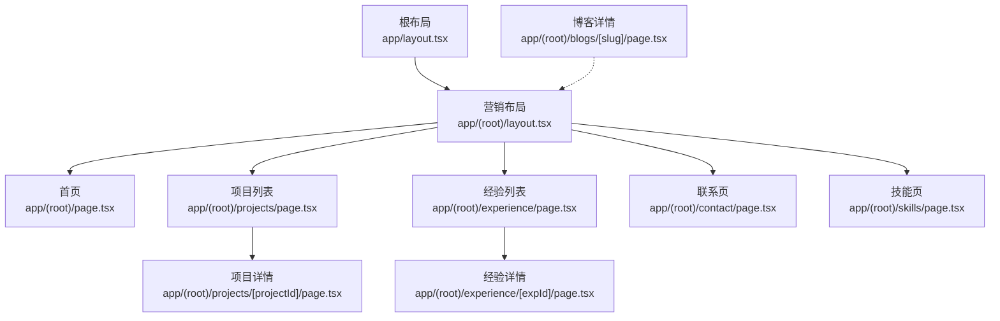
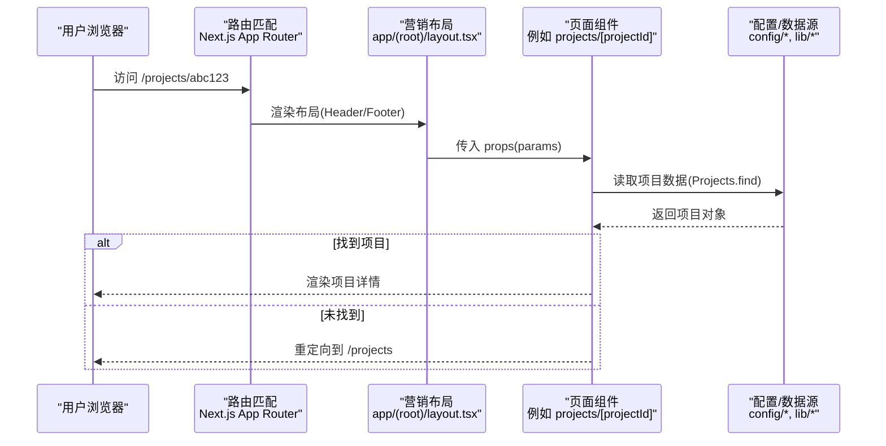
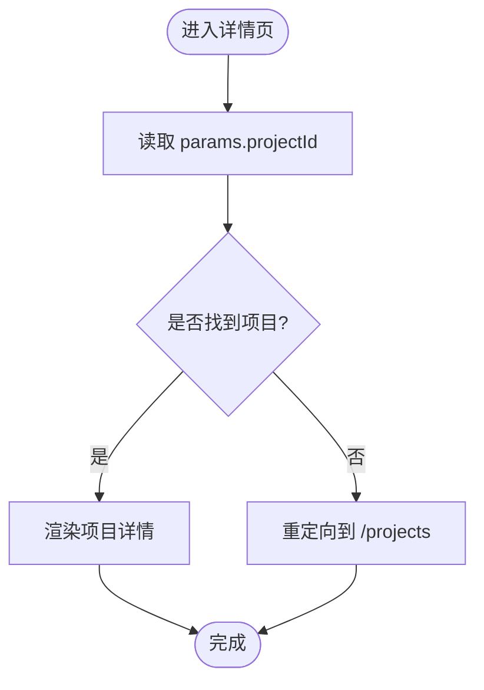
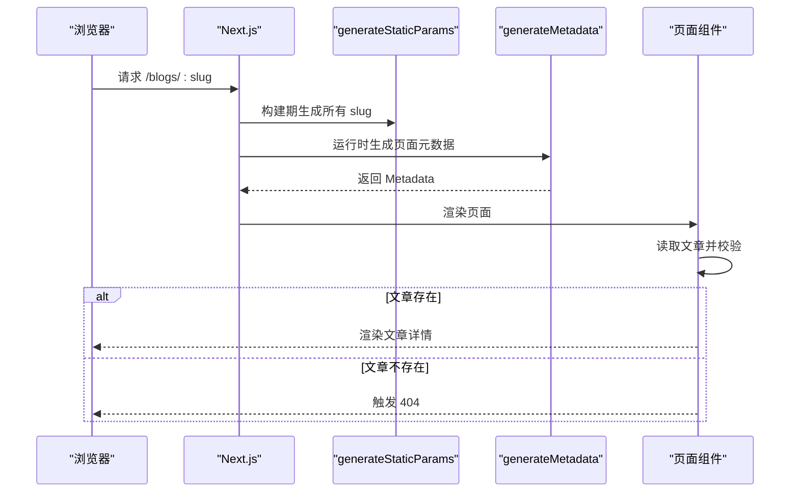
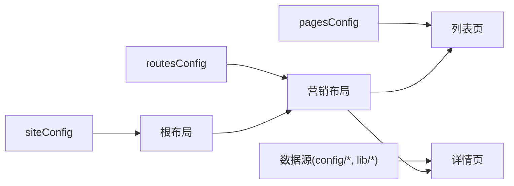

# 页面组织结构

<cite>
**本文引用的文件**
- [app/layout.tsx](file://app/layout.tsx)
- [app/(root)/layout.tsx](file://app/(root)/layout.tsx)
- [app/(root)/page.tsx](file://app/(root)/page.tsx)
- [app/(root)/projects/page.tsx](file://app/(root)/projects/page.tsx)
- [app/(root)/projects/[projectId]/page.tsx](file://app/(root)/projects/[projectId]/page.tsx)
- [app/(root)/experience/page.tsx](file://app/(root)/experience/page.tsx)
- [app/(root)/experience/[expId]/page.tsx](file://app/(root)/experience/[expId]/page.tsx)
- [app/(root)/blogs/[slug]/page.tsx](file://app/(root)/blogs/[slug]/page.tsx)
- [app/(root)/contact/page.tsx](file://app/(root)/contact/page.tsx)
- [app/(root)/skills/page.tsx](file://app/(root)/skills/page.tsx)
- [config/routes.ts](file://config/routes.ts)
- [config/pages.ts](file://config/pages.ts)
- [config/site.ts](file://config/site.ts)
- [components/common/page-container.tsx](file://components/common/page-container.tsx)
</cite>

## 目录
1. [简介](#简介)
2. [项目结构](#项目结构)
3. [核心组件](#核心组件)
4. [架构总览](#架构总览)
5. [详细组件分析](#详细组件分析)
6. [依赖关系分析](#依赖关系分析)
7. [性能考量](#性能考量)
8. [故障排查指南](#故障排查指南)
9. [结论](#结论)
10. [附录：新增页面与路由的实操步骤](#附录新增页面与路由的实操步骤)

## 简介
本文件聚焦于 Next.js App Router 的页面约定与文件命名规范，系统梳理该项目的页面组织方式、职责划分、动态路由实现以及页面组件复用策略。通过阅读本文，你将掌握如何基于现有结构快速创建新页面与路由，并理解各功能页（首页、项目页、经验页等）的设计模式与数据流。

## 项目结构
本项目采用 Next.js App Router 的分层布局与分组路由：
- 根布局 app/layout.tsx 负责全局样式、主题、SEO 元信息、第三方脚本与全局 Provider。
- 营销型分组布局 app/(root)/layout.tsx 提供站点级 Header、导航、Footer 与主内容区，所有“根级”页面共享此布局。
- 功能页面集中在 app/(root) 下，按业务模块划分子目录：projects、experience、blogs、contact、skills、contributions、resume、community 等。
- 配置集中管理：routes.ts 定义主导航；pages.ts 定义各页面的标题与描述；site.ts 定义站点信息与链接。

图表来源
- [app/layout.tsx:99-143](file://app/layout.tsx#L99-L143)
- [app/(root)/layout.tsx:11-31](file://app/(root)/layout.tsx#L11-L31)
- [app/(root)/page.tsx:37-356](file://app/(root)/page.tsx#L37-L356)
- [app/(root)/projects/page.tsx:31-58](file://app/(root)/projects/page.tsx#L31-L58)
- [app/(root)/experience/page.tsx:24-33](file://app/(root)/experience/page.tsx#L24-L33)
- [app/(root)/contact/page.tsx:13-29](file://app/(root)/contact/page.tsx#L13-L29)
- [app/(root)/skills/page.tsx:13-22](file://app/(root)/skills/page.tsx#L13-L22)
- [app/(root)/projects/[projectId]/page.tsx:23-158](file://app/(root)/projects/[projectId]/page.tsx#L23-L158)
- [app/(root)/experience/[expId]/page.tsx:59-219](file://app/(root)/experience/[expId]/page.tsx#L59-L219)
- [app/(root)/blogs/[slug]/page.tsx:81-324](file://app/(root)/blogs/[slug]/page.tsx#L81-L324)

章节来源
- [app/layout.tsx:99-143](file://app/layout.tsx#L99-L143)
- [app/(root)/layout.tsx:11-31](file://app/(root)/layout.tsx#L11-L31)
- [config/routes.ts:1-29](file://config/routes.ts#L1-L29)
- [config/pages.ts:15-86](file://config/pages.ts#L15-L86)

## 核心组件
- 根布局 app/layout.tsx
  - 注入全局字体、主题、Toaster、ModalProvider、Analytics、Google Analytics 等。
  - 统一 SEO metadata（title、description、OpenGraph、Twitter、robots、canonical 等）。
- 营销布局 app/(root)/layout.tsx
  - 提供顶部导航 MainNav、GitHub Star Badge、主题切换 ModeToggle、SiteFooter。
  - 使用 routesConfig.mainNav 渲染主导航项。
- 通用页面容器 components/common/page-container.tsx
  - 封装 ClientPageWrapper + PageHeader，为列表/详情页提供统一的标题与描述区域。
- 页面配置 config/pages.ts
  - 集中管理各页面的 title、description、metadata.title/description，便于统一维护与复用。
- 站点配置 config/site.ts
  - 站点名称、作者、URL、社交链接、OG 图片、关键词等。

章节来源
- [app/layout.tsx:30-97](file://app/layout.tsx#L30-L97)
- [app/(root)/layout.tsx:11-31](file://app/(root)/layout.tsx#L11-L31)
- [components/common/page-container.tsx:11-26](file://components/common/page-container.tsx#L11-L26)
- [config/pages.ts:15-86](file://config/pages.ts#L15-L86)
- [config/site.ts:1-41](file://config/site.ts#L1-L41)

## 架构总览
App Router 的页面约定在本项目中体现为：
- 静态页面：每个功能模块在 app/(root) 下以目录形式存在，并在目录下放置 page.tsx。
- 动态路由：使用方括号命名参数，如 [slug]、[projectId]、[expId]，Next.js 自动将 URL 段解析为 params。
- 服务端生成参数：对于可枚举的动态路由，使用 generateStaticParams 预生成参数，提升构建期性能与 SEO。
- 元数据：每个页面导出 metadata 或 generateMetadata，用于 SEO 与社交平台预览。
- 错误处理：不存在的数据使用 notFound() 或 redirect() 进行友好跳转或 404。

图表来源
- [app/(root)/layout.tsx:11-31](file://app/(root)/layout.tsx#L11-L31)
- [app/(root)/projects/[projectId]/page.tsx:23-28](file://app/(root)/projects/[projectId]/page.tsx#L23-L28)
- [config/projects.ts](file://config/projects.ts)

章节来源
- [app/(root)/projects/[projectId]/page.tsx:23-28](file://app/(root)/projects/[projectId]/page.tsx#L23-L28)
- [app/(root)/experience/[expId]/page.tsx:59-67](file://app/(root)/experience/[expId]/page.tsx#L59-L67)
- [app/(root)/blogs/[slug]/page.tsx:20-23](file://app/(root)/blogs/[slug]/page.tsx#L20-L23)

## 详细组件分析

### 首页 app/(root)/page.tsx
- 职责：聚合展示项目精选、经历精选、贡献、技能、博客与联系方式入口。
- 设计模式：
  - 使用 ClientPageWrapper 包裹客户端交互能力。
  - 通过 AnimatedSection/AnimatedText 提供滚动动画。
  - 从 pagesConfig 读取标题与描述，保持文案集中管理。
  - 引入结构化数据（JSON-LD）增强 SEO。
- 数据流：从配置与库函数获取精选数据，渲染卡片网格与“查看全部”链接。

章节来源
- [app/(root)/page.tsx:28-35](file://app/(root)/page.tsx#L28-L35)
- [app/(root)/page.tsx:37-356](file://app/(root)/page.tsx#L37-L356)
- [config/pages.ts:15-86](file://config/pages.ts#L15-L86)

### 项目列表页 app/(root)/projects/page.tsx
- 职责：展示全部/个人/专业项目，支持标签切换。
- 复用策略：使用 PageContainer 统一标题与描述；使用 ResponsiveTabs 切换不同分类；ProjectCard 复用展示逻辑。
- 数据流：从 config/projects 读取项目数组，根据当前 tab 过滤后渲染。

章节来源
- [app/(root)/projects/page.tsx:9-12](file://app/(root)/projects/page.tsx#L9-L12)
- [app/(root)/projects/page.tsx:14-29](file://app/(root)/projects/page.tsx#L14-L29)
- [app/(root)/projects/page.tsx:31-58](file://app/(root)/projects/page.tsx#L31-L58)
- [components/common/page-container.tsx:11-26](file://components/common/page-container.tsx#L11-L26)

### 项目详情页 app/(root)/projects/[projectId]/page.tsx
- 动态路由：params.projectId 来自 URL。
- 职责：根据 projectId 查找项目并渲染详情（封面、技术栈、描述、页面信息等）。
- 错误处理：未找到时 redirect 回 /projects。
- 复用：使用 ChipContainer 展示标签，ProjectDescription 渲染段落与要点。

图表来源
- [app/(root)/projects/[projectId]/page.tsx:23-28](file://app/(root)/projects/[projectId]/page.tsx#L23-L28)
- [app/(root)/projects/[projectId]/page.tsx:30-158](file://app/(root)/projects/[projectId]/page.tsx#L30-L158)

章节来源
- [app/(root)/projects/[projectId]/page.tsx:23-28](file://app/(root)/projects/[projectId]/page.tsx#L23-L28)
- [app/(root)/projects/[projectId]/page.tsx:30-158](file://app/(root)/projects/[projectId]/page.tsx#L30-L158)

### 经验列表页 app/(root)/experience/page.tsx
- 职责：以时间线形式展示职业经历。
- 复用：PageContainer 提供统一头部；Timeline 组件渲染时间线。
- SEO：自定义 title、description、keywords、canonical。

章节来源
- [app/(root)/experience/page.tsx:9-22](file://app/(root)/experience/page.tsx#L9-L22)
- [app/(root)/experience/page.tsx:24-33](file://app/(root)/experience/page.tsx#L24-L33)

### 经验详情页 app/(root)/experience/[expId]/page.tsx
- 动态路由：params.expId 来自 URL。
- 职责：根据 expId 查找经历，展示摘要、成就、技能标签等。
- 错误处理：未找到时 redirect 回 /experience。
- 元数据：generateMetadata 根据 expId 生成标题与描述。

章节来源
- [app/(root)/experience/[expId]/page.tsx:38-57](file://app/(root)/experience/[expId]/page.tsx#L38-L57)
- [app/(root)/experience/[expId]/page.tsx:59-67](file://app/(root)/experience/[expId]/page.tsx#L59-L67)
- [app/(root)/experience/[expId]/page.tsx:69-219](file://app/(root)/experience/[expId]/page.tsx#L69-L219)

### 博客详情页 app/(root)/blogs/[slug]/page.tsx
- 动态路由：params.slug 来自 URL。
- 预渲染：generateStaticParams 基于 getAllBlogSlugs 生成所有 slug，利于构建期优化。
- 职责：加载文章、生成 SEO metadata（含 OpenGraph/Twitter）、输出 JSON-LD（BlogPosting、BreadcrumbList），渲染面包屑、封面、正文与底部导航。
- 错误处理：找不到文章调用 notFound()。

图表来源
- [app/(root)/blogs/[slug]/page.tsx:20-23](file://app/(root)/blogs/[slug]/page.tsx#L20-L23)
- [app/(root)/blogs/[slug]/page.tsx:25-79](file://app/(root)/blogs/[slug]/page.tsx#L25-L79)
- [app/(root)/blogs/[slug]/page.tsx:81-324](file://app/(root)/blogs/[slug]/page.tsx#L81-L324)

章节来源
- [app/(root)/blogs/[slug]/page.tsx:20-23](file://app/(root)/blogs/[slug]/page.tsx#L20-L23)
- [app/(root)/blogs/[slug]/page.tsx:25-79](file://app/(root)/blogs/[slug]/page.tsx#L25-L79)
- [app/(root)/blogs/[slug]/page.tsx:81-324](file://app/(root)/blogs/[slug]/page.tsx#L81-L324)

### 其他页面
- 联系页 app/(root)/contact/page.tsx：使用 PageContainer 包装表单与 GitHub 跳转卡片。
- 技能页 app/(root)/skills/page.tsx：使用 PageContainer 与 SkillsCard 展示技能矩阵。

章节来源
- [app/(root)/contact/page.tsx:8-11](file://app/(root)/contact/page.tsx#L8-L11)
- [app/(root)/contact/page.tsx:13-29](file://app/(root)/contact/page.tsx#L13-L29)
- [app/(root)/skills/page.tsx:8-11](file://app/(root)/skills/page.tsx#L8-L11)
- [app/(root)/skills/page.tsx:13-22](file://app/(root)/skills/page.tsx#L13-L22)

## 依赖关系分析
- 布局依赖
  - 根布局依赖站点配置 siteConfig、主题、Toaster、ModalProvider、Analytics。
  - 营销布局依赖 routesConfig.mainNav 渲染导航，依赖 SiteFooter、ModeToggle、GitHubStarBadge。
- 页面依赖
  - 列表页依赖 PageContainer 与对应数据源（Projects、experiences、skills）。
  - 详情页依赖各自数据源与工具函数（cn、formatDateFromObj）。
- 配置依赖
  - pagesConfig 被多个页面引用以统一标题与描述。
  - siteConfig 被根布局与详情页用于 SEO 与外链。

图表来源
- [config/site.ts:1-41](file://config/site.ts#L1-L41)
- [config/routes.ts:1-29](file://config/routes.ts#L1-L29)
- [config/pages.ts:15-86](file://config/pages.ts#L15-L86)
- [app/layout.tsx:99-143](file://app/layout.tsx#L99-L143)
- [app/(root)/layout.tsx:11-31](file://app/(root)/layout.tsx#L11-L31)

章节来源
- [config/site.ts:1-41](file://config/site.ts#L1-L41)
- [config/routes.ts:1-29](file://config/routes.ts#L1-L29)
- [config/pages.ts:15-86](file://config/pages.ts#L15-L86)

## 性能考量
- 构建期参数生成：博客详情页使用 generateStaticParams 预生成所有 slug，减少运行时开销并提升 SEO。
- 资源优先级：首屏图片使用 priority，避免布局偏移与提升 LCP。
- 客户端交互：使用 ClientPageWrapper 包裹需要客户端能力的页面，避免不必要的客户端代码。
- 元数据集中化：通过 pagesConfig 与 siteConfig 统一管理 SEO，减少重复与不一致。

[本节为通用指导，不直接分析具体文件]

## 故障排查指南
- 环境变量缺失：根布局中若缺少 Google Analytics ID，会抛出错误，需检查 NEXT_PUBLIC_GOOGLE_MEASUREMENT_ID。
- 动态路由数据不存在：
  - 项目详情页：未找到项目时重定向到 /projects。
  - 经验详情页：未找到经历时重定向到 /experience。
  - 博客详情页：未找到文章时调用 notFound() 显示 404。
- 导航异常：确认 routesConfig.mainNav 中的 href 与实际路由一致。

章节来源
- [app/layout.tsx:100-103](file://app/layout.tsx#L100-L103)
- [app/(root)/projects/[projectId]/page.tsx:23-28](file://app/(root)/projects/[projectId]/page.tsx#L23-L28)
- [app/(root)/experience/[expId]/page.tsx:59-67](file://app/(root)/experience/[expId]/page.tsx#L59-L67)
- [app/(root)/blogs/[slug]/page.tsx:81-89](file://app/(root)/blogs/[slug]/page.tsx#L81-L89)
- [config/routes.ts:1-29](file://config/routes.ts#L1-L29)

## 结论
该项目基于 Next.js App Router 的约定式路由，清晰划分了布局与页面职责，并通过配置集中化管理文案与站点信息。动态路由采用参数化目录与 generateStaticParams 的组合，兼顾性能与 SEO。页面组件遵循复用原则，利用 PageContainer、ClientPageWrapper、AnimatedSection 等通用组件保持一致的视觉与交互体验。整体结构易于扩展与维护，适合继续增加新的功能模块。

[本节为总结性内容，不直接分析具体文件]

## 附录：新增页面与路由的实操步骤
以下以“新增一个关于‘作品集’的页面与动态详情”为例，说明如何在现有结构中快速落地：

- 创建静态列表页
  - 在 app/(root)/portfolio/page.tsx 新建页面文件。
  - 使用 PageContainer 包裹标题与描述，从 config/pages 添加对应条目，从 config/portfolio 读取数据并渲染卡片。
  - 参考路径：[app/(root)/projects/page.tsx](file://app/(root)/projects/page.tsx)

- 创建动态详情页
  - 在 app/(root)/portfolio/[id]/page.tsx 新建动态路由文件。
  - 使用 params.id 读取详情数据，未找到时 redirect 回 /portfolio。
  - 如需预渲染，实现 generateStaticParams 返回所有 id。
  - 参考路径：[app/(root)/projects/[projectId]/page.tsx](file://app/(root)/projects/[projectId]/page.tsx)

- 更新导航与配置
  - 在 config/routes.ts 的 mainNav 中添加新菜单项。
  - 在 config/pages.ts 中添加新页面的 title、description、metadata。
  - 参考路径：[config/routes.ts](file://config/routes.ts)、[config/pages.ts](file://config/pages.ts)

- 复用组件与样式
  - 使用 PageContainer、ChipContainer、Button 等通用组件保持一致风格。
  - 参考路径：[components/common/page-container.tsx](file://components/common/page-container.tsx)

- SEO 与元数据
  - 在页面导出 metadata 或使用 generateMetadata，设置 canonical、OpenGraph、Twitter 等。
  - 参考路径：[app/(root)/blogs/[slug]/page.tsx](file://app/(root)/blogs/[slug]/page.tsx)

章节来源
- [app/(root)/projects/page.tsx:31-58](file://app/(root)/projects/page.tsx#L31-L58)
- [app/(root)/projects/[projectId]/page.tsx:23-28](file://app/(root)/projects/[projectId]/page.tsx#L23-L28)
- [config/routes.ts:1-29](file://config/routes.ts#L1-L29)
- [config/pages.ts:15-86](file://config/pages.ts#L15-L86)
- [components/common/page-container.tsx:11-26](file://components/common/page-container.tsx#L11-L26)
- [app/(root)/blogs/[slug]/page.tsx:25-79](file://app/(root)/blogs/[slug]/page.tsx#L25-L79)